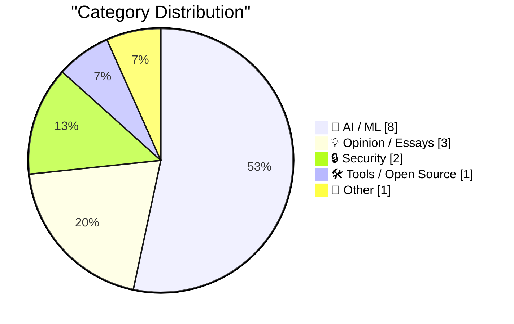
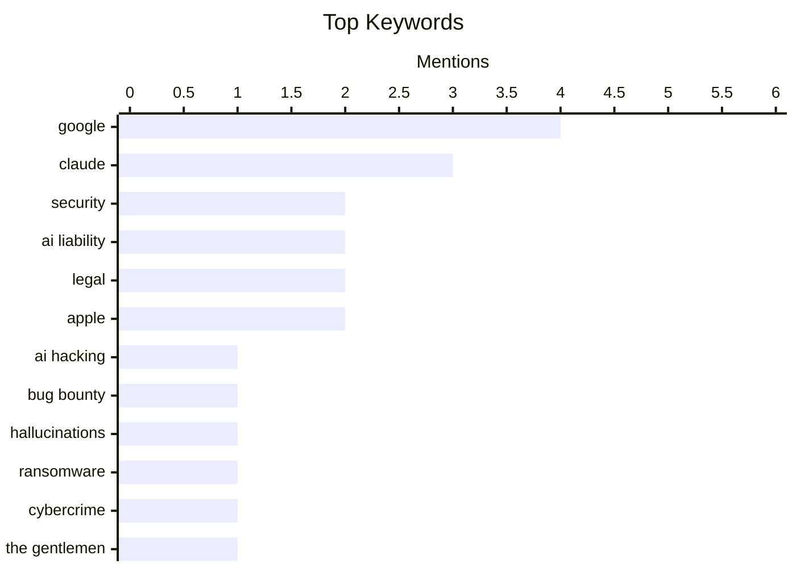

## Today's Highlights
Today's tech headlines reveal a rapidly evolving AI landscape, marked by significant legal and ethical challenges. Google is now facing liability for AI hallucinations, prompting a re-evaluation of Section 230's shield for AI companies and a policy reversal from Anthropic. Meanwhile, the AI development race continues with Apple and Google collaborating on Siri AI and Google advancing DiffusionGemma, even as OpenAI considers drastic price cuts to stay competitive. This dynamic environment also sees AI being weaponized, as demonstrated by a $500,000 hack against Google using AI.
---
## Must Read Today
1. **Hacking Google with A.I. for $500,000**
[Hacking Google with A.I. for $500,000](https://brutecat.com/articles/hacking-google-with-ai) — brutecat.com · 14h ago · 🔒 Security
> This article explores the security vulnerabilities within Google's vast infrastructure by deploying an AI for bug bounty hunting. The AI analyzed 1,500 APIs and 3,600 keys, systematically identifying potential weaknesses. This extensive automated security assessment ultimately led to the discovery of vulnerabilities that garnered $500,000 in bounties. The findings demonstrate the significant potential of AI in uncovering complex security flaws in large-scale, modern systems. The core takeaway is that AI can be an exceptionally effective tool for offensive security and large-scale vulnerability discovery.
💡 **Why read it**: It provides a compelling case study on leveraging AI for large-scale security testing and bug bounty hunting against a major tech company, yielding substantial results.
🏷️ AI hacking, Google, security, bug bounty
2. **Breaking: Google liable for hallucinations**
[Breaking: Google liable for hallucinations](https://garymarcus.substack.com/p/breaking-google-liable-for-hallucinations) — garymarcus.substack.com · 21h ago · 🤖 AI / ML
> The article addresses the critical legal issue of AI companies' accountability for 'hallucinations' or fabricated content generated by their models. A recent German court ruling found Google liable for defamatory content, specifically a fabricated quote attributed to a public figure, produced by its AI. This decision sets a significant precedent, suggesting that AI developers may be held directly responsible for the factual accuracy and potential harm of their AI's outputs. This landmark ruling challenges previous assumptions about AI liability and could influence international legal frameworks. The main conclusion is that this German legal decision marks a pivotal shift towards holding AI providers accountable for harmful AI-generated content.
💡 **Why read it**: It highlights a critical legal development regarding AI liability for hallucinations, which could have far-reaching implications for AI development and deployment globally.
🏷️ AI liability, Google, hallucinations, legal
3. **Who Runs the Ransomware Group ‘The Gentlemen?’**
[Who Runs the Ransomware Group ‘The Gentlemen?’](https://krebsonsecurity.com/2026/06/who-runs-the-ransomware-group-the-gentlemen/) — krebsonsecurity.com · 23h ago · 🔒 Security
> This article investigates the real-world identity of the administrator behind 'The Gentlemen,' a rapidly emerging and highly active ransomware group. 'The Gentlemen' has quickly become the second most active ransomware gang by victim count, largely due to an aggressive recruitment strategy offering affiliates 90 percent of any ransom paid. The post examines various clues and digital footprints to link the group's leadership to a specific individual. It delves into the operational tactics and incentive structures that have fueled the group's rapid expansion. The article aims to unmask the leader of a prominent ransomware group, offering insights into the modern cybercrime ecosystem.
💡 **Why read it**: It offers an investigative deep dive into the leadership, recruitment strategies, and operational tactics of a major ransomware group, providing valuable insights into the cybercrime landscape.
🏷️ Ransomware, cybercrime, The Gentlemen, security
---
## Data Overview
| Sources Scanned | Articles Fetched | Time Window | Selected |
|:---:|:---:|:---:|:---:|
| 87/92 | 2556 -> 19 | 24h | **15** |
### Category Distribution

### Top Keywords

<details>
<summary>Plain Text Keyword Chart (Terminal Friendly)</summary>
```
google         │ ████████████████████ 4
claude         │ ███████████████░░░░░ 3
security       │ ██████████░░░░░░░░░░ 2
ai liability   │ ██████████░░░░░░░░░░ 2
legal          │ ██████████░░░░░░░░░░ 2
apple          │ ██████████░░░░░░░░░░ 2
ai hacking     │ █████░░░░░░░░░░░░░░░ 1
bug bounty     │ █████░░░░░░░░░░░░░░░ 1
hallucinations │ █████░░░░░░░░░░░░░░░ 1
ransomware     │ █████░░░░░░░░░░░░░░░ 1
```
</details>
### Topic Tags
**google**(4) · **claude**(3) · **security**(2) · ai liability(2) · legal(2) · apple(2) · ai hacking(1) · bug bounty(1) · hallucinations(1) · ransomware(1) · cybercrime(1) · the gentlemen(1) · siri(1) · ai(1) · section 230(1) · regulation(1) · anthropic(1) · ai policy(1) · research(1) · breaking news(1)
---
## AI / ML
### 1. Breaking: Google liable for hallucinations
[Breaking: Google liable for hallucinations](https://garymarcus.substack.com/p/breaking-google-liable-for-hallucinations) — **garymarcus.substack.com** · 21h ago · ⭐ 28/30
> The article addresses the critical legal issue of AI companies' accountability for 'hallucinations' or fabricated content generated by their models. A recent German court ruling found Google liable for defamatory content, specifically a fabricated quote attributed to a public figure, produced by its AI. This decision sets a significant precedent, suggesting that AI developers may be held directly responsible for the factual accuracy and potential harm of their AI's outputs. This landmark ruling challenges previous assumptions about AI liability and could influence international legal frameworks. The main conclusion is that this German legal decision marks a pivotal shift towards holding AI providers accountable for harmful AI-generated content.
🏷️ AI liability, Google, hallucinations, legal
---
### 2. Craig Federighi Details Apple’s Collaboration With Google for Siri AI — Live, on Stage
[Craig Federighi Details Apple’s Collaboration With Google for Siri AI — Live, on Stage](https://9to5mac.com/2026/06/08/craig-federighi-details-apples-collaboration-with-google-for-siri-ai-in-ios-27/) — **daringfireball.net** · 13h ago · ⭐ 26/30
> This article details Apple's significant collaboration with Google for the new Siri AI in iOS 27, as revealed by Craig Federighi and his team. During a post-WWDC tech talk, Federighi, joined by Amar Subramanya (VP of AI), Mike Rockwell (Siri lead), and Sebastien Marineau-Mes (software VP), explained the specifics of this partnership. The collaboration focuses on integrating Google's AI technology to enhance Siri's capabilities, likely leveraging Google's expertise in large language models or search infrastructure. The main conclusion is that Apple is openly partnering with Google to substantially upgrade Siri's AI in iOS 27, marking a strategic move to advance its intelligent assistant.
🏷️ Apple, Google, Siri, AI
---
### 3. Maybe Section 230 doesn’t shield AI companies from liability, after all
[Maybe Section 230 doesn’t shield AI companies from liability, after all](https://garymarcus.substack.com/p/maybe-section-230-doesnt-shield-ai) — **garymarcus.substack.com** · 12h ago · ⭐ 25/30
> This article re-evaluates the applicability of Section 230 of the Communications Decency Act in shielding AI companies from liability for content generated by their models. Inspired by a new German ruling (likely the one discussed in Index 1), the author argues that Section 230, which protects platforms for user-generated content, may not extend to AI-generated content. The core argument is that AI models actively 'create' content rather than merely hosting third-party contributions, thus potentially making AI companies directly responsible for harmful or illegal outputs. The article concludes that recent legal precedents, particularly from Germany, challenge the traditional understanding of Section 230's scope, potentially exposing AI companies to greater liability.
🏷️ Section 230, AI liability, legal, regulation
---
### 4. Anthropic Walks Back Policy That Could Have ‘Sabotaged’ AI Researchers Using Claude
[Anthropic Walks Back Policy That Could Have ‘Sabotaged’ AI Researchers Using Claude](https://simonwillison.net/2026/Jun/11/anthropic-walks-back-policy/#atom-everything) — **simonwillison.net** · 10h ago · ⭐ 24/30
> This article reports on Anthropic's reversal of a controversial policy regarding safeguards for frontier LLM development, which was perceived as potentially hindering AI research using Claude. Anthropic had implemented 'Fable 5's safeguards,' which were criticized for their lack of transparency and potential to 'sabotage' researchers. Following significant community backlash, Anthropic issued a statement to WIRED, apologizing and announcing that these safeguards would now be made visible. The policy was seen as an attempt to control how researchers utilized Claude, particularly for safety-critical applications. The main conclusion is that Anthropic reversed its controversial policy on Claude's safeguards due to community pressure, emphasizing the importance of transparency and open collaboration in AI research.
🏷️ Anthropic, Claude, AI policy, research
---
### 5. DiffusionGemma
[DiffusionGemma](https://simonwillison.net/2026/Jun/10/diffusiongemma/#atom-everything) — **simonwillison.net** · 18h ago · ⭐ 23/30
> This article announces the return and further development of Google's experimental Gemini Diffusion model, now branded as DiffusionGemma, for faster text generation. Google had briefly released a preview of the Gemini Diffusion model in May 2025, which demonstrated impressive speeds of 857 tokens/second. The re-release as DiffusionGemma indicates Google's continued investment in this research, likely focusing on optimizing the model for even more efficient and rapid text generation. The article suggests further details on its enhanced capabilities and potential applications. The main conclusion is that Google has revived and rebranded its high-speed text generation model as DiffusionGemma, signaling continued development in efficient AI text synthesis.
🏷️ Google, DiffusionGemma, text generation, AI model
---
### 6. Breaking: OpenAI is pondering “drastic” price cuts.
[Breaking: OpenAI is pondering “drastic” price cuts.](https://garymarcus.substack.com/p/breaking-openai-is-pondering-drastic) — **garymarcus.substack.com** · 26m ago · ⭐ 21/30
> This article reports on OpenAI's consideration of 'drastic' price cuts for its AI models and analyzes the implications of such a move. The author interprets this potential action as a sign of weakness, suggesting increased competition, pressure on profit margins, or a strategic effort to gain market share by lowering the barrier to entry for AI model usage. Such significant price reductions could have a profound impact on the broader AI industry's pricing structure and overall profitability. The main conclusion is that OpenAI's potential 'drastic' price cuts are viewed as a strategic or defensive move, signaling increased competition and potential shifts in the economic landscape of the AI industry.
🏷️ OpenAI, pricing, AI market, competition
---
### 7. Solving a chess puzzle with Claude and Prolog
[Solving a chess puzzle with Claude and Prolog](https://www.johndcook.com/blog/2026/06/11/prolog-claude/) — **johndcook.com** · 47m ago · ⭐ 21/30
> This article explores using Claude, an AI, to generate Prolog code for solving a logical chess puzzle, specifically the classic eight queens problem. It highlights Prolog's inherent strength in directly representing logical problems, a key advantage despite its general disadvantages. The experiment demonstrates AI's capability in assisting with logic programming by generating functional code for complex combinatorial challenges. The main takeaway is that combining AI with logic programming languages like Prolog can be highly effective for tackling intricate logical and combinatorial problems.
🏷️ Claude, Prolog, logic programming, chess puzzle
---
### 8. Formally proving a calculation with Claude and Lean
[Formally proving a calculation with Claude and Lean](https://www.johndcook.com/blog/2026/06/10/claude-and-lean/) — **johndcook.com** · 14h ago · ⭐ 21/30
> This article details an experiment to assess Claude's ability to generate Lean code for formally proving a six-line calculus calculation, specifically a Fourier coefficient (a_n) in terms of a Bessel function. The author provided Claude with a prompt including the LaTeX source for the mathematical proof. The goal was to leverage Lean, a formal proof assistant, to verify the calculation's correctness, thereby testing Claude's capacity to translate mathematical proofs into a formal verification language. The experiment assesses the potential of AI models like Claude in automating the generation of formal proofs, a critical step towards more reliable mathematical and software verification.
🏷️ Claude, Lean, formal verification, mathematical proof
---
## Opinion / Essays
### 9. Breaking news, and how the end might begin
[Breaking news, and how the end might begin](https://garymarcus.substack.com/p/breaking-news-and-how-the-end-might) — **garymarcus.substack.com** · 21h ago · ⭐ 24/30
> This article discusses recent critical news and its potential implications, drawing parallels to past economic insights. The author references a recent interview with Steve Eisman, renowned for predicting the 2008 financial crisis, to contextualize current 'potentially critical news.' While specific details of the news are not provided in the snippet, the context suggests a focus on significant, possibly negative, developments that could signal a major shift or downturn. The article aims to connect current events with historical patterns of systemic risk and market instability. The main conclusion is that the article uses a flashback to Steve Eisman's insights to frame current 'breaking news,' suggesting it could be a precursor to significant, potentially negative, systemic changes.
🏷️ Breaking news, Steve Eisman, industry trends, commentary
---
### 10. Quoting Jeremy Howard
[Quoting Jeremy Howard](https://simonwillison.net/2026/Jun/10/jeremy-howard/#atom-everything) — **simonwillison.net** · 22h ago · ⭐ 20/30
> The article quotes Jeremy Howard's proposed solution to slow down recursive AI self-improvement and prevent dangerous power imbalances. Howard suggests that the lab with the top-ranked AI model must agree not to use it for working on frontier AI, while simultaneously ensuring everyone else has access to it. This approach, by definition, would prevent the AI frontier from advancing and avoid concentrated power in a single entity. Howard's proposal offers a specific, counter-intuitive mechanism for AI governance, aiming to democratize access to advanced AI while curbing unchecked progress.
🏷️ AI safety, Jeremy Howard, policy, self-improvement
---
### 11. ★ Sweet Jeebus, MacOS 27 Golden Gate Removes the Dumb Icons From Menu Items
[★ Sweet Jeebus, MacOS 27 Golden Gate Removes the Dumb Icons From Menu Items](https://daringfireball.net/2026/06/macos_27_golden_gate_removes_the_dumb_icons_from_menu_items) — **daringfireball.net** · 13h ago · ⭐ 20/30
> This article celebrates a significant user interface change in the upcoming MacOS 27 Golden Gate: the removal of icons from menu items, a feature the author strongly disliked in MacOS Tahoe. This change is highlighted as the author's favorite news from WWDC, indicating a positive shift in Apple's software design philosophy. The removal of these "dumb icons" is seen as proof that "the rot has been rooted out of Apple’s software design team." The update signifies a positive course correction in Apple's UI design, prioritizing clarity and user experience over potentially distracting visual elements.
🏷️ MacOS, UI/UX, Apple, design
---
## Security
### 12. Hacking Google with A.I. for $500,000
[Hacking Google with A.I. for $500,000](https://brutecat.com/articles/hacking-google-with-ai) — **brutecat.com** · 14h ago · ⭐ 30/30
> This article explores the security vulnerabilities within Google's vast infrastructure by deploying an AI for bug bounty hunting. The AI analyzed 1,500 APIs and 3,600 keys, systematically identifying potential weaknesses. This extensive automated security assessment ultimately led to the discovery of vulnerabilities that garnered $500,000 in bounties. The findings demonstrate the significant potential of AI in uncovering complex security flaws in large-scale, modern systems. The core takeaway is that AI can be an exceptionally effective tool for offensive security and large-scale vulnerability discovery.
🏷️ AI hacking, Google, security, bug bounty
---
### 13. Who Runs the Ransomware Group ‘The Gentlemen?’
[Who Runs the Ransomware Group ‘The Gentlemen?’](https://krebsonsecurity.com/2026/06/who-runs-the-ransomware-group-the-gentlemen/) — **krebsonsecurity.com** · 23h ago · ⭐ 27/30
> This article investigates the real-world identity of the administrator behind 'The Gentlemen,' a rapidly emerging and highly active ransomware group. 'The Gentlemen' has quickly become the second most active ransomware gang by victim count, largely due to an aggressive recruitment strategy offering affiliates 90 percent of any ransom paid. The post examines various clues and digital footprints to link the group's leadership to a specific individual. It delves into the operational tactics and incentive structures that have fueled the group's rapid expansion. The article aims to unmask the leader of a prominent ransomware group, offering insights into the modern cybercrime ecosystem.
🏷️ Ransomware, cybercrime, The Gentlemen, security
---
## Tools / Open Source
### 14. datasette-agent 0.2a0
[datasette-agent 0.2a0](https://simonwillison.net/2026/Jun/10/datasette-agent/#atom-everything) — **simonwillison.net** · 14h ago · ⭐ 22/30
> This article announces the release of `datasette-agent` version 0.2a0, highlighting a significant enhancement in user interaction capabilities for its tools. The new version introduces the ability for tools to interactively ask users questions during execution. Tools can now declare a `context` parameter to receive a `ToolContext` object, enabling `await context.ask_user(...)` for various query types, including yes/no, multiple-choice (`options=[...]`), or free-text (`free_text=True`) questions. This feature greatly enhances the flexibility and interactivity of agents built using `datasette-agent`. The main conclusion is that `datasette-agent` 0.2a0 significantly improves tool interactivity by enabling dynamic user questioning during execution, making agents more versatile and responsive.
🏷️ Datasette, agent, release, open source
---
## Other
### 15. Biological Evolution and Information Acquisition
[Biological Evolution and Information Acquisition](https://www.construction-physics.com/p/biological-evolution-and-information) — **construction-physics.com** · 1h ago · ⭐ 19/30
> This article introduces a simulation of technological evolution by economist Brian Arthur, which explores how complex systems can evolve from simple building blocks. Arthur's simulation started with basic components like a NAND gate and successfully evolved complex circuits such as a 12-way AND gate or a 4-bit adder. This was achieved by randomly combining increasingly useful existing components, mirroring principles of biological evolution in a technological context. The simulation demonstrates that complex technological innovations can emerge through an evolutionary process of combining and refining simpler, existing components, analogous to biological evolution's information acquisition.
🏷️ Technological evolution, biological evolution, information acquisition
---
*Generated at 2026-06-11 14:01 | Scanned 87 sources -> 2556 articles -> selected 15*
*Based on the [Hacker News Popularity Contest 2025](https://refactoringenglish.com/tools/hn-popularity/) RSS source list recommended by [Andrej Karpathy](https://x.com/karpathy)*
*Produced by Dongdianr AI. Follow the same-name WeChat public account for more AI practical tips 💡*
