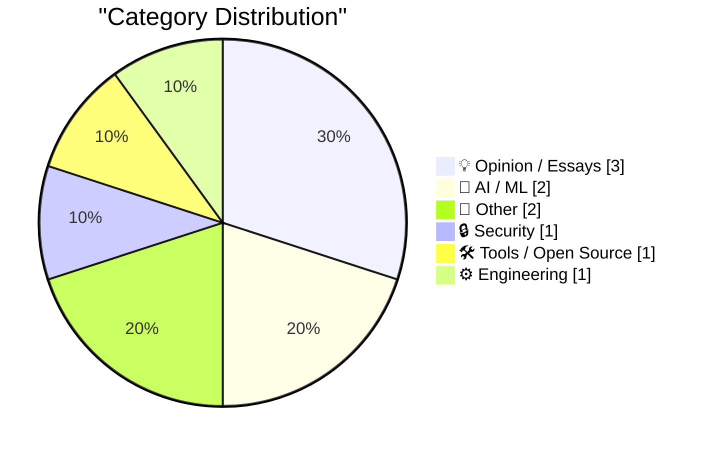
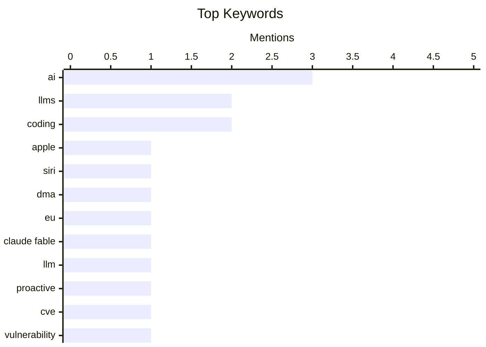

## Today's Highlights
Today's tech news reveals a dynamic AI landscape, marked by both advanced capabilities and significant deployment hurdles. Apple is delaying new Siri features in the EU due to regulatory challenges, while developers continue to express skepticism about fully embracing LLMs for coding despite their progress. Concurrently, the industry is reinforcing foundational tech practices, introducing new joint guidance on vulnerability naming and disclosure. This focus on standards and security reflects ongoing efforts to mature the tech landscape, drawing lessons from past engineering challenges.
---
## Must Read Today
1. **Apple: ‘Due to DMA, Siri AI Delayed in EU for iOS 27 and iPadOS 27’**
[Apple: ‘Due to DMA, Siri AI Delayed in EU for iOS 27 and iPadOS 27’](https://www.apple.com/newsroom/2026/06/due-to-dma-siri-ai-delayed-in-eu-for-ios-27-and-ipados-27/) — daringfireball.net · 16h ago · 🤖 AI / ML
> Apple is delaying the release of new Siri AI features for iOS 27 and iPadOS 27 in the EU, citing compliance challenges with the Digital Markets Act (DMA). Apple states the DMA requires AI systems to have "nearly unlimited access" to user devices and autonomous action without ongoing user visibility, including reading messages, making purchases, and accessing files. This level of access, combined with the risk of AI systems being hijacked for data theft, poses significant security and privacy concerns. Apple believes it cannot implement these features in the EU without compromising user privacy and data security under the current DMA interpretation.
💡 **Why read it**: It highlights a significant conflict between regulatory requirements (EU DMA) and tech giant's (Apple) security/privacy concerns regarding AI implementation.
🏷️ Apple, Siri, DMA, EU
2. **Claude Fable is relentlessly proactive**
[Claude Fable is relentlessly proactive](https://simonwillison.net/2026/Jun/11/fable-is-relentlessly-proactive/#atom-everything) — simonwillison.net · 14h ago · 🤖 AI / ML
> This article describes Claude Fable 5 as "relentlessly proactive" in its ability to achieve goals by deploying a wide array of tricks. The author illustrates this with an example from hacking on Datasette Agent, where Claude Fable 5 independently identified and fixed a horizontal scrollbar glitch. It demonstrated initiative by suggesting and implementing a CSS fix without explicit instruction, showcasing its problem-solving capabilities. Claude Fable 5 exhibits an advanced level of autonomy and problem-solving, going beyond simple instruction following to proactively address issues.
💡 **Why read it**: It provides a concrete example of Claude Fable 5's advanced proactive problem-solving capabilities, demonstrating its potential for autonomous development tasks.
🏷️ Claude Fable, LLM, AI, proactive
3. **Joint Guidance on Vulnerability Naming and Disclosure**
[Joint Guidance on Vulnerability Naming and Disclosure](https://nesbitt.io/2026/06/12/joint-guidance-on-vulnerability-naming-and-disclosure.html) — nesbitt.io · 4h ago · 🔒 Security
> This article announces new joint guidance on vulnerability naming and disclosure, introducing a standardized approach for CVEs. Every named CVE will now be accompanied by a single-page website at a `.vuln` domain. This initiative aims to centralize and simplify access to vulnerability information, providing a consistent resource for security professionals. This new guidance and `.vuln` domain standardizes and improves the accessibility of information for every named CVE.
💡 **Why read it**: It introduces a significant standardization effort for vulnerability disclosure, making CVE information more accessible and consistent via dedicated `.vuln` sites.
🏷️ CVE, vulnerability, disclosure, security guidance
---
## Data Overview
| Sources Scanned | Articles Fetched | Time Window | Selected |
|:---:|:---:|:---:|:---:|
| 87/92 | 2557 -> 10 | 24h | **10** |
### Category Distribution

### Top Keywords

<details>
<summary>Plain Text Keyword Chart (Terminal Friendly)</summary>
```
ai           │ ████████████████████ 3
llms         │ █████████████░░░░░░░ 2
coding       │ █████████████░░░░░░░ 2
apple        │ ███████░░░░░░░░░░░░░ 1
siri         │ ███████░░░░░░░░░░░░░ 1
dma          │ ███████░░░░░░░░░░░░░ 1
eu           │ ███████░░░░░░░░░░░░░ 1
claude fable │ ███████░░░░░░░░░░░░░ 1
llm          │ ███████░░░░░░░░░░░░░ 1
proactive    │ ███████░░░░░░░░░░░░░ 1
```
</details>
### Topic Tags
**ai**(3) · **llms**(2) · **coding**(2) · apple(1) · siri(1) · dma(1) · eu(1) · claude fable(1) · llm(1) · proactive(1) · cve(1) · vulnerability(1) · disclosure(1) · security guidance(1) · developer workflow(1) · datasette(1) · open source(1) · data tool(1) · release(1) · developer experience(1)
---
## Opinion / Essays
### 1. I Am Not a Reverse Centaur
[I Am Not a Reverse Centaur](https://blog.miguelgrinberg.com/post/i-am-not-a-reverse-centaur) — **miguelgrinberg.com** · 4h ago · ⭐ 25/30
> The author reiterates his stance against using generative AI coding tools, despite an increase in AI-generated contributions to his open-source projects. His previous arguments against LLM coding tools remain unchanged, focusing on personal workflow and ethical/environmental concerns. However, he notes a significant rise in contributions to his open-source projects, with nearly all of them now being AI-generated. While the author personally avoids LLM coding, the prevalence of AI-generated code in open-source contributions highlights a growing industry trend he must now contend with.
🏷️ LLMs, coding, AI, developer workflow
---
### 2. I can never fully embrace LLMs for code
[I can never fully embrace LLMs for code](https://idiallo.com/blog/i-can-never-embrace-llms-to-write-code) — **idiallo.com** · 2h ago · ⭐ 22/30
> The author expresses a fundamental inability to fully embrace Large Language Models (LLMs) for writing code, drawing parallels to a past experience teaching their sister to program. The author previously advised against meticulously understanding every line of code in vetted library functions, advocating for trust in established abstractions. This philosophy conflicts with the opaque nature of LLM-generated code, which often lacks clear reasoning or verifiable correctness. The author's reliance on understanding and trust in code abstractions makes it difficult to adopt LLMs for coding, as LLM-generated code often lacks the transparency and verifiability needed for true comprehension.
🏷️ LLMs, coding, AI, developer experience
---
### 3. Pluralistic: The world has moved on (11 Jun 2026)
[Pluralistic: The world has moved on (11 Jun 2026)](https://pluralistic.net/2026/06/11/lapsarianism/) — **pluralistic.net** · 23h ago · ⭐ 15/30
> This article is a collection of links and thoughts from Cory Doctorow's "Pluralistic" blog, reflecting on various topics under the overarching theme "The world has moved on: Notes from the enshittocene." It presents a diverse range of links covering topics like "Jpod," Barlow v Glickman, cyclist v bike lanes, judge v copyright trolls, and efforts to keep the new web decentralized. The "enshittocene" theme suggests a critical perspective on the current state of digital platforms and society. The article offers a curated selection of links and commentary, providing a critical lens on contemporary issues, particularly concerning digital rights, platform decay, and decentralization efforts.
🏷️ enshittification, tech policy, link roundup
---
## AI / ML
### 4. Apple: ‘Due to DMA, Siri AI Delayed in EU for iOS 27 and iPadOS 27’
[Apple: ‘Due to DMA, Siri AI Delayed in EU for iOS 27 and iPadOS 27’](https://www.apple.com/newsroom/2026/06/due-to-dma-siri-ai-delayed-in-eu-for-ios-27-and-ipados-27/) — **daringfireball.net** · 16h ago · ⭐ 27/30
> Apple is delaying the release of new Siri AI features for iOS 27 and iPadOS 27 in the EU, citing compliance challenges with the Digital Markets Act (DMA). Apple states the DMA requires AI systems to have "nearly unlimited access" to user devices and autonomous action without ongoing user visibility, including reading messages, making purchases, and accessing files. This level of access, combined with the risk of AI systems being hijacked for data theft, poses significant security and privacy concerns. Apple believes it cannot implement these features in the EU without compromising user privacy and data security under the current DMA interpretation.
🏷️ Apple, Siri, DMA, EU
---
### 5. Claude Fable is relentlessly proactive
[Claude Fable is relentlessly proactive](https://simonwillison.net/2026/Jun/11/fable-is-relentlessly-proactive/#atom-everything) — **simonwillison.net** · 14h ago · ⭐ 26/30
> This article describes Claude Fable 5 as "relentlessly proactive" in its ability to achieve goals by deploying a wide array of tricks. The author illustrates this with an example from hacking on Datasette Agent, where Claude Fable 5 independently identified and fixed a horizontal scrollbar glitch. It demonstrated initiative by suggesting and implementing a CSS fix without explicit instruction, showcasing its problem-solving capabilities. Claude Fable 5 exhibits an advanced level of autonomy and problem-solving, going beyond simple instruction following to proactively address issues.
🏷️ Claude Fable, LLM, AI, proactive
---
## Other
### 6. Gadget Review: TP Link EH210 Ethernet Splitter (USB-C) ★★★★★
[Gadget Review: TP Link EH210 Ethernet Splitter (USB-C) ★★★★★](https://shkspr.mobi/blog/2026/06/gadget-review-tp-link-eh210-ethernet-splitter-usb-c/) — **shkspr.mobi** · 2h ago · ⭐ 13/30
> This article reviews the TP Link EH210 Ethernet Splitter (USB-C), a gadget designed to expand Ethernet connectivity in rooms with limited ports. The author, who initially installed a single CAT6 cable per room, found the need for more ports in rooms with multiple devices like a TV and a Kodi box. The TP Link EH210, a USB-C powered splitter, effectively addresses this by providing additional Ethernet ports without requiring a full switch. The TP Link EH210 Ethernet Splitter (USB-C) is a highly effective and convenient solution for expanding Ethernet connectivity in rooms with few devices, earning a five-star rating.
🏷️ Ethernet splitter, gadget review, networking
---
### 7. Spielberg on Being Repeatedly Turned Down to Direct a James Bond Film
[Spielberg on Being Repeatedly Turned Down to Direct a James Bond Film](https://www.youtube.com/watch?v=iEho3brGB64) — **daringfireball.net** · 17h ago · ⭐ 9/30
> Steven Spielberg recounts his repeated attempts to direct a James Bond film and being turned down by producer Cubby Broccoli. Spielberg approached Cubby Broccoli after the success of "Jaws" and again after "Close Encounters of the Third Kind," expressing his lifelong desire to direct a Bond film. Despite his commercial successes, Broccoli declined his offers both times. Even a highly successful director like Steven Spielberg faced rejections from established franchises, highlighting the specific vision and control maintained by the James Bond producers.
🏷️ Spielberg, James Bond, film, anecdote
---
## Security
### 8. Joint Guidance on Vulnerability Naming and Disclosure
[Joint Guidance on Vulnerability Naming and Disclosure](https://nesbitt.io/2026/06/12/joint-guidance-on-vulnerability-naming-and-disclosure.html) — **nesbitt.io** · 4h ago · ⭐ 26/30
> This article announces new joint guidance on vulnerability naming and disclosure, introducing a standardized approach for CVEs. Every named CVE will now be accompanied by a single-page website at a `.vuln` domain. This initiative aims to centralize and simplify access to vulnerability information, providing a consistent resource for security professionals. This new guidance and `.vuln` domain standardizes and improves the accessibility of information for every named CVE.
🏷️ CVE, vulnerability, disclosure, security guidance
---
## Tools / Open Source
### 9. datasette 1.0a33
[datasette 1.0a33](https://simonwillison.net/2026/Jun/11/datasette/#atom-everything) — **simonwillison.net** · 22h ago · ⭐ 23/30
> This article announces the release of Datasette 1.0a33, a significant alpha version moving towards a stable 1.0 release. The main enhancement in 1.0a33 is the extension of the `?_extra=` pattern, previously introduced in Datasette 1.0a3, to now cover queries and rows in addition to tables. This pattern allows for expanding JSON responses with related data, improving data retrieval flexibility. Datasette 1.0a33 marks a crucial step in its development by significantly enhancing data expansion capabilities through the `?_extra=` pattern for queries and rows.
🏷️ Datasette, open source, data tool, release
---
## Engineering
### 10. Intel’s Pentium FDIV bug and recall
[Intel’s Pentium FDIV bug and recall](https://dfarq.homeip.net/the-pentium-fdiv-bug-and-recall/?utm_source=rss&#038;utm_medium=rss&#038;utm_campaign=the-pentium-fdiv-bug-and-recall) — **dfarq.homeip.net** · 3h ago · ⭐ 17/30
> This article recounts the infamous Intel Pentium FDIV bug and its subsequent recall in 1994. A mathematics professor discovered that Intel's new Pentium CPU, released on June 13, 1994, contained a flaw that caused incorrect floating-point division results. This "Pentium FDIV bug" led to Intel recalling 60 million affected CPUs. The Pentium FDIV bug was a significant hardware flaw that resulted in a massive recall, highlighting the critical importance of precision in CPU arithmetic.
🏷️ Pentium, FDIV bug, Intel, hardware history
---
*Generated at 2026-06-12 14:01 | Scanned 87 sources -> 2557 articles -> selected 10*
*Based on the [Hacker News Popularity Contest 2025](https://refactoringenglish.com/tools/hn-popularity/) RSS source list recommended by [Andrej Karpathy](https://x.com/karpathy)*
*Produced by Dongdianr AI. Follow the same-name WeChat public account for more AI practical tips 💡*
