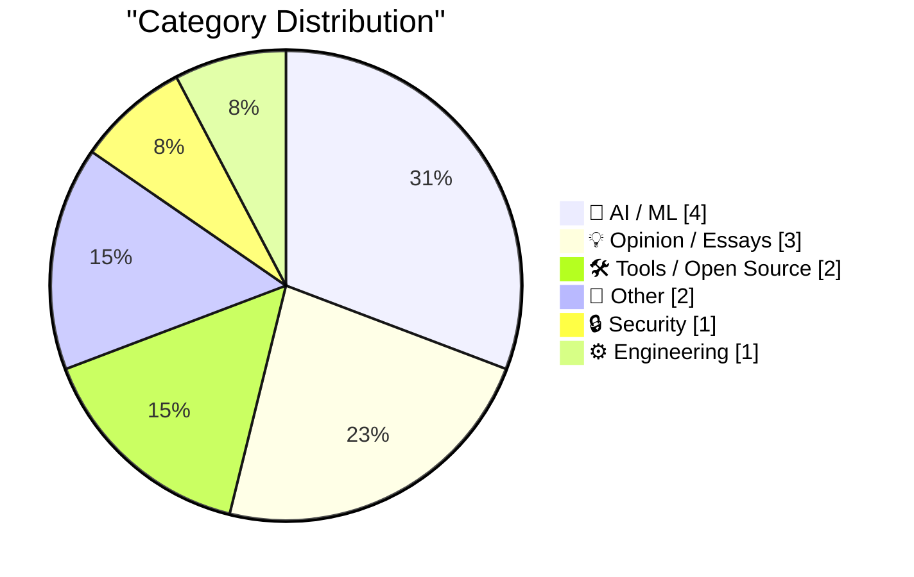
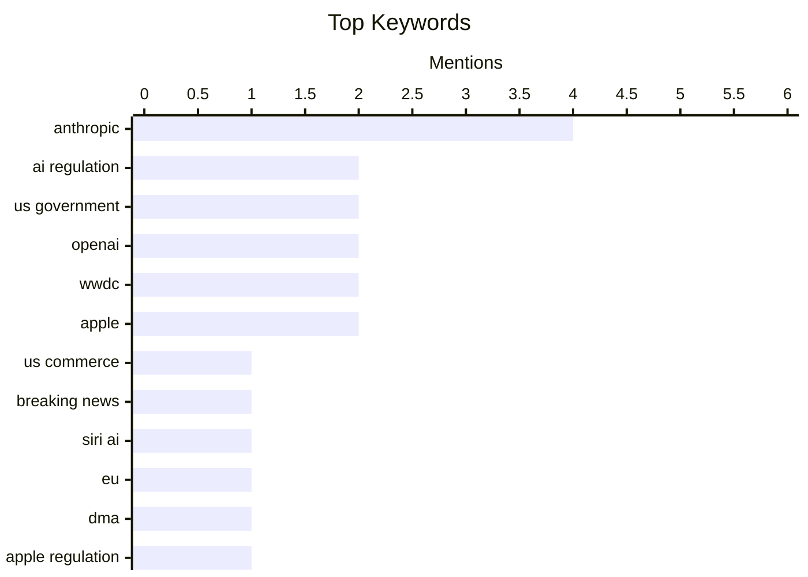

## Today's Highlights
Today's tech highlights reveal a significant increase in government oversight of advanced AI, with the US Commerce Department imposing export controls that effectively halt access to Anthropic's latest models. This regulatory push is also shaping product strategies, as seen with Apple's decision regarding Siri AI in the EU. Amidst these interventions, the broader Silicon Valley AI sector faces scrutiny, even as companies continue to innovate with new tools while grappling with persistent security challenges.
---
## Must Read Today
1. **Breaking news: US Commerce Department effectively shuts down Anthropic’s latest models**
[Breaking news: US Commerce Department effectively shuts down Anthropic’s latest models](https://garymarcus.substack.com/p/breaking-news-us-commerce-department) — garymarcus.substack.com · 12h ago · 🤖 AI / ML
> The US Commerce Department has issued an export control directive effectively shutting down access to Anthropic's latest AI models, Fable and Mythos, for foreign nationals. This unprecedented move, citing national security, mandates the suspension of access for all foreign nationals, including Anthropic's own foreign employees, whether inside or outside the US. Coming after two years of perceived underregulation, this represents a sudden "nuclear option" in US AI policy. The directive significantly restricts who can use and develop with these advanced models. This government intervention signals a dramatic shift in US AI regulation, prioritizing national security and impacting the global AI landscape.
💡 **Why read it**: It details a significant and sudden US government intervention in AI regulation, directly impacting a major AI developer and setting a new precedent for national security controls on advanced models.
🏷️ Anthropic, US Commerce, AI regulation, breaking news
2. **The European Commission Response to Siri AI and the DMA**
[The European Commission Response to Siri AI and the DMA](https://www.linkedin.com/posts/thomas-regnier-24a05810b_what-is-the-true-story-behind-apples-decision-activity-7470439874664280064-TuEt) — daringfireball.net · 20h ago · 🤖 AI / ML
> Apple's decision not to roll out "Siri AI" in the EU has led to speculation regarding the impact of the Digital Markets Act (DMA). Thomas Regnier, spokesperson for the European Commission, clarified that Apple's decision is solely its own, as "absolutely nothing in the DMA prohibits Apple from rolling out new features in the EU." While the EC and Apple had contacts regarding "Siri AI," the Commission states that Apple did not offer a compliant solution. The European Commission asserts that the DMA does not restrict innovation but requires compliance, placing the onus on Apple for its rollout choices in the EU.
💡 **Why read it**: It clarifies the European Commission's stance on Apple's "Siri AI" rollout in the EU, debunking claims that the DMA prohibits new features and highlighting the responsibility of tech companies to ensure compliance.
🏷️ Siri AI, EU, DMA, Apple regulation
3. **Dangerous Technology For Americans Only**
[Dangerous Technology For Americans Only](https://lucumr.pocoo.org/2026/6/13/americans-only/) — lucumr.pocoo.org · 14h ago · 🤖 AI / ML
> Anthropic, a company that has advocated for strict AI controls, is now subject to a US government export control directive suspending foreign access to its Fable and Mythos models. The article notes the "schadenfreude" on Twitter regarding this situation, as Anthropic's leadership previously described its technology as dangerous and in need of regulation. The US government appears to have taken this framing seriously, leading to the directive that restricts foreign nationals from using these models. The situation highlights the irony of a company advocating for AI danger now facing government-imposed restrictions based on that very premise, sparking public amusement.
💡 **Why read it**: It offers a critical perspective on the US government's export control directive against Anthropic, highlighting the irony of the company's prior advocacy for AI danger and regulation.
🏷️ Anthropic, US government, AI ethics, export control
---
## Data Overview
| Sources Scanned | Articles Fetched | Time Window | Selected |
|:---:|:---:|:---:|:---:|
| 86/92 | 2546 -> 13 | 24h | **13** |
### Category Distribution

### Top Keywords

<details>
<summary>Plain Text Keyword Chart (Terminal Friendly)</summary>
```
anthropic     │ ████████████████████ 4
ai regulation │ ██████████░░░░░░░░░░ 2
us government │ ██████████░░░░░░░░░░ 2
openai        │ ██████████░░░░░░░░░░ 2
wwdc          │ ██████████░░░░░░░░░░ 2
apple         │ ██████████░░░░░░░░░░ 2
us commerce   │ █████░░░░░░░░░░░░░░░ 1
breaking news │ █████░░░░░░░░░░░░░░░ 1
siri ai       │ █████░░░░░░░░░░░░░░░ 1
eu            │ █████░░░░░░░░░░░░░░░ 1
```
</details>
### Topic Tags
**anthropic**(4) · **ai regulation**(2) · **us government**(2) · openai(2) · wwdc(2) · apple(2) · us commerce(1) · breaking news(1) · siri ai(1) · eu(1) · dma(1) · apple regulation(1) · ai ethics(1) · export control(1) · google(1) · remote attestation(1) · privacy(1) · silicon valley(1) · ipo(1) · fable 5(1)
---
## AI / ML
### 1. Breaking news: US Commerce Department effectively shuts down Anthropic’s latest models
[Breaking news: US Commerce Department effectively shuts down Anthropic’s latest models](https://garymarcus.substack.com/p/breaking-news-us-commerce-department) — **garymarcus.substack.com** · 12h ago · ⭐ 28/30
> The US Commerce Department has issued an export control directive effectively shutting down access to Anthropic's latest AI models, Fable and Mythos, for foreign nationals. This unprecedented move, citing national security, mandates the suspension of access for all foreign nationals, including Anthropic's own foreign employees, whether inside or outside the US. Coming after two years of perceived underregulation, this represents a sudden "nuclear option" in US AI policy. The directive significantly restricts who can use and develop with these advanced models. This government intervention signals a dramatic shift in US AI regulation, prioritizing national security and impacting the global AI landscape.
🏷️ Anthropic, US Commerce, AI regulation, breaking news
---
### 2. The European Commission Response to Siri AI and the DMA
[The European Commission Response to Siri AI and the DMA](https://www.linkedin.com/posts/thomas-regnier-24a05810b_what-is-the-true-story-behind-apples-decision-activity-7470439874664280064-TuEt) — **daringfireball.net** · 20h ago · ⭐ 27/30
> Apple's decision not to roll out "Siri AI" in the EU has led to speculation regarding the impact of the Digital Markets Act (DMA). Thomas Regnier, spokesperson for the European Commission, clarified that Apple's decision is solely its own, as "absolutely nothing in the DMA prohibits Apple from rolling out new features in the EU." While the EC and Apple had contacts regarding "Siri AI," the Commission states that Apple did not offer a compliant solution. The European Commission asserts that the DMA does not restrict innovation but requires compliance, placing the onus on Apple for its rollout choices in the EU.
🏷️ Siri AI, EU, DMA, Apple regulation
---
### 3. Dangerous Technology For Americans Only
[Dangerous Technology For Americans Only](https://lucumr.pocoo.org/2026/6/13/americans-only/) — **lucumr.pocoo.org** · 14h ago · ⭐ 27/30
> Anthropic, a company that has advocated for strict AI controls, is now subject to a US government export control directive suspending foreign access to its Fable and Mythos models. The article notes the "schadenfreude" on Twitter regarding this situation, as Anthropic's leadership previously described its technology as dangerous and in need of regulation. The US government appears to have taken this framing seriously, leading to the directive that restricts foreign nationals from using these models. The situation highlights the irony of a company advocating for AI danger now facing government-imposed restrictions based on that very premise, sparking public amusement.
🏷️ Anthropic, US government, AI ethics, export control
---
### 4. Statement on the US government directive to suspend access to Fable 5 and Mythos 5
[Statement on the US government directive to suspend access to Fable 5 and Mythos 5](https://simonwillison.net/2026/Jun/13/us-government-directive-to-suspend-access/#atom-everything) — **simonwillison.net** · 12h ago · ⭐ 25/30
> The US government has issued an export control directive mandating the suspension of access to Anthropic's Fable 5 and Mythos 5 models for all foreign nationals. Citing national security authorities, the directive applies to foreign nationals both inside and outside the United States, including foreign national Anthropic employees. The article highlights this as an unprecedented and "nuts" move, effectively restricting a significant portion of the global user base and workforce from accessing these advanced AI models. This directive represents a drastic and immediate government intervention in AI model access, driven by national security concerns, with broad implications for Anthropic's operations and the global AI community.
🏷️ US government, Anthropic, AI regulation, Fable 5
---
## Opinion / Essays
### 5. Premium: The Silicon Valley Bubble (Part 1)
[Premium: The Silicon Valley Bubble (Part 1)](https://www.wheresyoured.at/premium-the-silicon-valley-bubble-part-1/) — **wheresyoured.at** · 20h ago · ⭐ 26/30
> The article suggests that the current era of Silicon Valley, particularly for major AI companies, is nearing its end due to unsustainable business models. Both OpenAI and Anthropic have filed paperwork to go public, initiating a "race for exit liquidity." The author points out that these companies "burn billions of dollars a year and have no path to profitability," indicating a significant financial vulnerability despite their high valuations. The impending IPOs of these AI giants are framed as a desperate attempt to secure capital before an inevitable market correction, signaling the potential bursting of a "Silicon Valley Bubble."
🏷️ Silicon Valley, OpenAI, Anthropic, IPO
---
### 6. ★ The Talk Show: Live From WWDC 2026
[★ The Talk Show: Live From WWDC 2026](https://daringfireball.net/2026/06/the_talk_show_live_from_wwdc_2026) — **daringfireball.net** · 14h ago · ⭐ 20/30
> This article promotes "The Talk Show" recorded live at The California Theatre in San Jose on Tuesday, June 9, 2026, which provided analysis and discussion of Apple's announcements at WWDC 2026. Host John Gruber was joined by special guests Joanna Stern and Nilay Patel to discuss the key announcements made during Apple's annual Worldwide Developers Conference. The event offered an expert panel discussion providing immediate insights and reactions to Apple's WWDC 2026 announcements for a live audience.
🏷️ WWDC, Apple, podcast
---
### 7. Quoting Andrew Singleton
[Quoting Andrew Singleton](https://simonwillison.net/2026/Jun/12/andrew-singleton/#atom-everything) — **simonwillison.net** · 19h ago · ⭐ 17/30
> The article presents a satirical scenario to critique the often-inflated and circular economics surrounding "AI investments." It describes John's propane company investing $20 billion in Jenny's crematorium for 5% ownership. Jenny then incinerates $10 billion and pays John $10 billion for propane to burn that money. This allows John to report $10 billion in "AI revenue" for the quarter and claim a $100 billion business valuation based on his 5% stake. The scenario highlights how reported revenue and inflated valuations can be generated through self-referential transactions without genuine productive output. This serves as a cautionary tale against misleading financial reporting in emerging tech sectors.
🏷️ AI economics, satire, venture capital
---
## Tools / Open Source
### 8. OpenAI WebRTC Audio Session, now with document context
[OpenAI WebRTC Audio Session, now with document context](https://simonwillison.net/2026/Jun/12/openai-webrtc/#atom-everything) — **simonwillison.net** · 14h ago · ⭐ 23/30
> This article announces an enhancement to real-time audio interactions with OpenAI's models, now including contextual understanding from documents. An updated tool, initially built in December 2024 using the OpenAI WebRTC API for real-time audio models, now integrates "document context." This new version, following OpenAI's introduction of new API models last month, allows the audio session to draw information from provided documents for more informed responses. The updated OpenAI WebRTC Audio Session significantly improves real-time AI interactions by enabling models to process and respond based on specific document content, enhancing conversational intelligence.
🏷️ OpenAI, WebRTC, audio, AI tools
---
### 9. The WWDC 2026 Keynote and State of the Union on YouTube
[The WWDC 2026 Keynote and State of the Union on YouTube](https://www.youtube.com/watch?v=hF8swzNR1-o) — **daringfireball.net** · 20h ago · ⭐ 22/30
> This article addresses the challenge of accessing and reviewing content from Apple's WWDC 2026, specifically the Keynote and State of the Union. While Apple's Developer app allows downloading local copies of most sessions, the Keynote is an exception. The article points out that the full WWDC 2026 Keynote and State of the Union are available on YouTube, with the State of the Union running over an hour. Apple also provided a 4.5-minute recap of the State of the Union for quick viewing. YouTube serves as a convenient alternative for accessing and reviewing the WWDC 2026 Keynote and State of the Union, including a concise recap for those short on time.
🏷️ WWDC, Apple, keynote, developer resources
---
## Other
### 10. Reading List 06/13/2026
[Reading List 06/13/2026](https://www.construction-physics.com/p/reading-list-06132026) — **construction-physics.com** · 2h ago · ⭐ 15/30
> This article functions as a reading list, curating diverse topics related to construction, infrastructure, and industrial projects. It highlights innovative concepts such as building homes directly atop libraries, alongside discussions on the manufacturing processes for Patriot missiles. The list also includes efforts to construct new coal plants in the US and ambitious geopolitical infrastructure proposals like a tunnel connecting the US and Russia. This compilation offers a broad, multi-faceted overview of current and prospective developments across various sectors of heavy industry and civil engineering.
🏷️ Construction, Infrastructure, Manufacturing, Coal Plants
---
### 11. This Week on The Analog Antiquarian
[This Week on The Analog Antiquarian](https://www.filfre.net/2026/06/this-week-on-the-analog-antiquarian/) — **filfre.net** · 21h ago · ⭐ 7/30
> This article, part of "The Analog Antiquarian" series, delves into a specific historical or literary work. Titled "Opus 2: Henry VI, Part 1," it indicates an in-depth exploration of Shakespeare's historical play. The content likely provides analysis, historical context, or critical insights pertaining to this particular installment of the Henry VI trilogy. It continues a series dedicated to examining significant cultural or historical artifacts.
🏷️ History, Literature, Antiquarian
---
## Security
### 12. Pluralistic: Google's new remote attestation scheme is every bit as terrible as its old remote attestation scheme (12 Jun 2026)
[Pluralistic: Google's new remote attestation scheme is every bit as terrible as its old remote attestation scheme (12 Jun 2026)](https://pluralistic.net/2026/06/12/compelled-speech/) — **pluralistic.net** · 17h ago · ⭐ 26/30
> Google has introduced a new remote attestation scheme, which the author criticizes as being as problematic as its predecessors. The article implies that Google's new scheme, like its old ones, continues to raise concerns about user control, privacy, and potential for platform lock-in or censorship, without offering significant improvements. The phrase "Not even a QR code can produce a kissable pig" metaphorically suggests that superficial changes do not address fundamental flaws. The author concludes that Google's latest remote attestation effort fails to resolve the inherent issues associated with such technologies, maintaining a negative stance on its implications.
🏷️ Google, remote attestation, privacy
---
## Engineering
### 13. This Week in Package Management: 13 June 2026
[This Week in Package Management: 13 June 2026](https://nesbitt.io/2026/06/13/this-week-in-package-management.html) — **nesbitt.io** · 4h ago · ⭐ 24/30
> Staying updated with the latest developments, releases, and advisories across the diverse package management ecosystem can be challenging. This article serves as a curated digest, compiling recent releases, security advisories, and relevant articles from various package management systems and communities. It aims to provide a consolidated overview of significant updates. The article offers a convenient weekly summary for professionals and developers to efficiently track important changes and news within the package management world.
🏷️ package management, releases, advisories, security
---
*Generated at 2026-06-13 14:01 | Scanned 86 sources -> 2546 articles -> selected 13*
*Based on the [Hacker News Popularity Contest 2025](https://refactoringenglish.com/tools/hn-popularity/) RSS source list recommended by [Andrej Karpathy](https://x.com/karpathy)*
*Produced by Dongdianr AI. Follow the same-name WeChat public account for more AI practical tips 💡*
