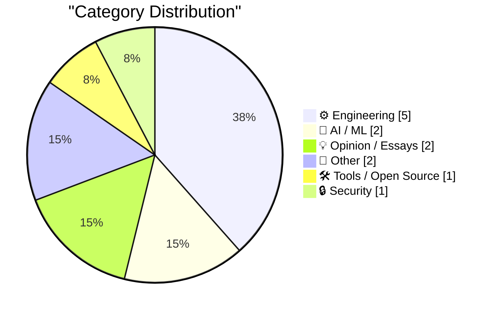
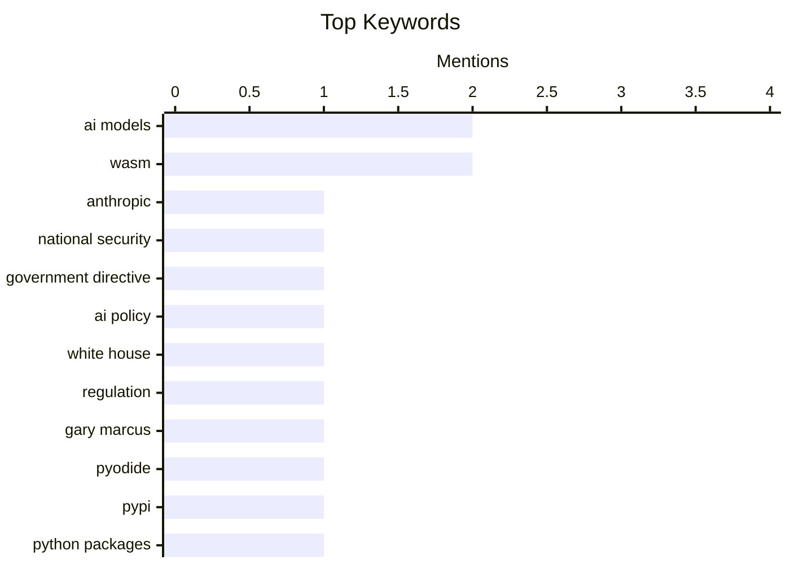

## Today's Highlights
Today's tech highlights reveal a growing tension in the AI landscape, with the U.S. government directing Anthropic to shut down specific models due to national security concerns, amidst broader criticism of the White House's AI policy. Further underscoring these challenges, Apple's Private Cloud Compute for Foundation Models is noted for its severe limitations for third-party developers. Meanwhile, the WebAssembly ecosystem continues to expand, with new advancements enabling Python wheels to be published directly to PyPI for Pyodide and the initial release of luau-wasm.
---
## Must Read Today
1. **U.S. Government Directs Anthropic to Shut Down Fable 5 and Mythos 5 Models on National Security Grounds**
[U.S. Government Directs Anthropic to Shut Down Fable 5 and Mythos 5 Models on National Security Grounds](https://www.anthropic.com/news/fable-mythos-access) — daringfireball.net · 20h ago · 🤖 AI / ML
> Anthropic has been directed by the U.S. government to suspend all access to its Fable 5 and Mythos 5 AI models. Citing national security authorities and export control, the directive mandates disabling these models for all foreign nationals, both inside and outside the United States, including foreign national Anthropic employees. This order forces Anthropic to abruptly disable Fable 5 and Mythos 5 for all customers to ensure compliance. Access to all other Anthropic models will not be affected. This marks a significant government intervention in AI model availability.
💡 **Why read it**: This article highlights a significant instance of government intervention in AI model access due to national security concerns, impacting a major AI developer.
🏷️ Anthropic, national security, AI models, government directive
2. **The White House’s shambolic AI policy**
[The White House’s shambolic AI policy](https://garymarcus.substack.com/p/the-white-houses-shambolic-ai-policy) — garymarcus.substack.com · 21h ago · 💡 Opinion / Essays
> The article critically assesses the White House's current AI policy, labeling it as disorganized and ineffective. It argues that the federal government's lack of a coherent strategy is prompting individual states to develop their own independent AI regulations. The author implies a significant void in unified federal guidance, leading to a fragmented regulatory landscape. The piece suggests that a more robust and coordinated approach is essential to effectively address the complex challenges of AI governance. This fragmented approach risks inconsistent and potentially conflicting policies across the nation.
💡 **Why read it**: It offers a critical perspective on the current state of U.S. federal AI policy, explaining why states are taking independent action.
🏷️ AI policy, White House, regulation, Gary Marcus
3. **Publishing WASM wheels to PyPI for use with Pyodide**
[Publishing WASM wheels to PyPI for use with Pyodide](https://simonwillison.net/2026/Jun/13/publishing-wasm-wheels/#atom-everything) — simonwillison.net · 14h ago · ⚙️ Engineering
> The article announces a significant advancement for Python in WebAssembly, enabling the direct publishing of WASM wheels to PyPI for use with Pyodide. This new capability, highlighted in the Pyodide 314.0 release, allows developers to install Python packages built for Pyodide (or any runtime compatible with the PyEmscripten platform defined in PEP 783) directly from PyPI. This streamlines the distribution and installation process for WebAssembly-compiled Python libraries. The development significantly simplifies how Python packages can be made available and utilized in browser-based or WebAssembly environments via Pyodide.
💡 **Why read it**: This article is crucial for Python developers interested in WebAssembly, as it details how to publish and use WASM-compiled Python packages via PyPI and Pyodide.
🏷️ WASM, Pyodide, PyPI, Python packages
---
## Data Overview
| Sources Scanned | Articles Fetched | Time Window | Selected |
|:---:|:---:|:---:|:---:|
| 87/92 | 2557 -> 13 | 24h | **13** |
### Category Distribution

### Top Keywords

<details>
<summary>Plain Text Keyword Chart (Terminal Friendly)</summary>
```
ai models            │ ████████████████████ 2
wasm                 │ ████████████████████ 2
anthropic            │ ██████████░░░░░░░░░░ 1
national security    │ ██████████░░░░░░░░░░ 1
government directive │ ██████████░░░░░░░░░░ 1
ai policy            │ ██████████░░░░░░░░░░ 1
white house          │ ██████████░░░░░░░░░░ 1
regulation           │ ██████████░░░░░░░░░░ 1
gary marcus          │ ██████████░░░░░░░░░░ 1
pyodide              │ ██████████░░░░░░░░░░ 1
```
</details>
### Topic Tags
**ai models**(2) · **wasm**(2) · **anthropic**(1) · national security(1) · government directive(1) · ai policy(1) · white house(1) · regulation(1) · gary marcus(1) · pyodide(1) · pypi(1) · python packages(1) · apple(1) · private cloud compute(1) · developer restrictions(1) · python(1) · plugins(1) · architecture(1) · pluggy(1) · luau(1)
---
## Engineering
### 1. Publishing WASM wheels to PyPI for use with Pyodide
[Publishing WASM wheels to PyPI for use with Pyodide](https://simonwillison.net/2026/Jun/13/publishing-wasm-wheels/#atom-everything) — **simonwillison.net** · 14h ago · ⭐ 24/30
> The article announces a significant advancement for Python in WebAssembly, enabling the direct publishing of WASM wheels to PyPI for use with Pyodide. This new capability, highlighted in the Pyodide 314.0 release, allows developers to install Python packages built for Pyodide (or any runtime compatible with the PyEmscripten platform defined in PEP 783) directly from PyPI. This streamlines the distribution and installation process for WebAssembly-compiled Python libraries. The development significantly simplifies how Python packages can be made available and utilized in browser-based or WebAssembly environments via Pyodide.
🏷️ WASM, Pyodide, PyPI, Python packages
---
### 2. Plugins case study: Pluggy
[Plugins case study: Pluggy](https://eli.thegreenplace.net/2026/plugins-case-study-pluggy/) — **eli.thegreenplace.net** · 10h ago · ⭐ 23/30
> The article introduces Pluggy, a Python library specifically designed for developing robust and flexible plugin systems. Pluggy originated as an integral part of the `pytest` project, which is renowned for its extensive and well-structured plugin ecosystem, before being extracted into a standalone library. It provides a structured and efficient methodology for adding plugin capabilities to Python applications, thereby enhancing extensibility and modularity. Developers aiming to implement a flexible and maintainable plugin architecture in their Python projects are strongly encouraged to consider utilizing Pluggy.
🏷️ Python, plugins, architecture, Pluggy
---
### 3. The adder at the heart of Intel's 8087 floating-point chip
[The adder at the heart of Intel's 8087 floating-point chip](http://www.righto.com/feeds/3050107772739337632/comments/default) — **righto.com** · 22h ago · ⭐ 22/30
> The article provides an in-depth look at the technical core of the Intel 8087 floating-point coprocessor, specifically focusing on its crucial adder design. Released in 1980, the Intel 8087 dramatically accelerated math operations, achieving up to 100 times faster performance by handling arithmetic, square roots, and transcendental functions. Central to its groundbreaking capabilities was a sophisticated 69-bit adder, described as the "arithmetic heart" of its floating-point execution unit. This adder was supported by an intricate network of related registers, shifters, and control circuitry. The advanced design of this 69-bit adder was fundamental to the 8087's pioneering role in early floating-point computation.
🏷️ Intel 8087, floating-point, coprocessor, computer architecture
---
### 4. Mapping SQLite result columns back to their source `table.column`
[Mapping SQLite result columns back to their source `table.column`](https://simonwillison.net/2026/Jun/13/sqlite-column-provenance/#atom-everything) — **simonwillison.net** · 14h ago · ⭐ 21/30
> The article explores the technical challenge of accurately mapping SQLite query result columns back to their original `table.column` source. This research aims to enhance Datasette by enabling arbitrary SQL queries to render results with additional provenance information. The objective is to identify precisely which specific columns from which tables contributed to each output column, even within complex `SELECT` statements involving joins or subqueries. Successfully mapping column provenance would significantly improve data understanding, debugging, and auditability for SQL queries, especially within data exploration tools like Datasette.
🏷️ SQLite, Datasette, database, column mapping
---
### 5. Building a serial and VGA "everything console"
[Building a serial and VGA "everything console"](https://oldvcr.blogspot.com/feeds/7900423283602789203/comments/default) — **oldvcr.blogspot.com** · 12h ago · ⭐ 17/30
> The author outlines a project to build a portable, self-contained "everything console" for systems primarily using serial consoles, aiming to replace cumbersome CRT terminals or dedicated laptops. The core problem is the inconvenience of current solutions for interacting with such systems. The DIY project seeks to integrate both serial and VGA capabilities into a single, more convenient and lightweight unit. This initiative is driven by the need for a more efficient, portable, and less heavy solution for interacting with various systems. The ultimate goal is to create a cost-effective, versatile console to streamline work with serial-console-based systems.
🏷️ serial console, VGA, embedded, hardware
---
## AI / ML
### 6. U.S. Government Directs Anthropic to Shut Down Fable 5 and Mythos 5 Models on National Security Grounds
[U.S. Government Directs Anthropic to Shut Down Fable 5 and Mythos 5 Models on National Security Grounds](https://www.anthropic.com/news/fable-mythos-access) — **daringfireball.net** · 20h ago · ⭐ 28/30
> Anthropic has been directed by the U.S. government to suspend all access to its Fable 5 and Mythos 5 AI models. Citing national security authorities and export control, the directive mandates disabling these models for all foreign nationals, both inside and outside the United States, including foreign national Anthropic employees. This order forces Anthropic to abruptly disable Fable 5 and Mythos 5 for all customers to ensure compliance. Access to all other Anthropic models will not be affected. This marks a significant government intervention in AI model availability.
🏷️ Anthropic, national security, AI models, government directive
---
### 7. Apple’s Private Cloud Compute Is Severely Limited for Third-Party Developers
[Apple’s Private Cloud Compute Is Severely Limited for Third-Party Developers](https://developer.apple.com/private-cloud-compute/) — **daringfireball.net** · 20h ago · ⭐ 24/30
> Apple's Private Cloud Compute (PCC) for Foundation Models is significantly restricted for third-party developers, particularly concerning cost and access. Only developers in the App Store Small Business Program with fewer than two million first-time App Store downloads are eligible to use Apple Foundation Models on PCC without incurring cloud API costs. While PCC promises "frontier level intelligence with unparalleled privacy protections," its free access is limited to a specific subset of small developers. This policy makes it easier for a select group of small developers to get started, but larger or non-qualifying third-party developers face substantial barriers or costs.
🏷️ Apple, Private Cloud Compute, AI models, developer restrictions
---
## Opinion / Essays
### 8. The White House’s shambolic AI policy
[The White House’s shambolic AI policy](https://garymarcus.substack.com/p/the-white-houses-shambolic-ai-policy) — **garymarcus.substack.com** · 21h ago · ⭐ 27/30
> The article critically assesses the White House's current AI policy, labeling it as disorganized and ineffective. It argues that the federal government's lack of a coherent strategy is prompting individual states to develop their own independent AI regulations. The author implies a significant void in unified federal guidance, leading to a fragmented regulatory landscape. The piece suggests that a more robust and coordinated approach is essential to effectively address the complex challenges of AI governance. This fragmented approach risks inconsistent and potentially conflicting policies across the nation.
🏷️ AI policy, White House, regulation, Gary Marcus
---
### 9. Pluralistic: Shareholder supremacy and the precog CEO (13 Jun 2026)
[Pluralistic: Shareholder supremacy and the precog CEO (13 Jun 2026)](https://pluralistic.net/2026/06/13/minority-shareholder-report/) — **pluralistic.net** · 20h ago · ⭐ 22/30
> The article critically examines the concept of shareholder supremacy and its broad implications, particularly in the context of a "precog CEO" who makes decisions based on speculative future profits. It touches upon diverse issues including intellectual property disputes (e.g., James Joyce scholars vs. Joyce estate), labor concerns (e.g., iPod sweatshops, laid-off workers facing gag clauses), and regulatory efforts like the ACCESS Act. The central argument critiques how the unfalsifiable nature of corporate justifications under shareholder-first mandates can lead to problematic behaviors. The piece broadly critiques how prioritizing shareholders can result in detrimental corporate policies across various sectors.
🏷️ Shareholder supremacy, AI ethics, corporate governance, tech policy
---
## Other
### 10. Trump’s Name (Set in the Wrong Font, of Course) Has Been Removed From the Kennedy Center
[Trump’s Name (Set in the Wrong Font, of Course) Has Been Removed From the Kennedy Center](https://apple.news/ANLNtQOeuSkiJ35tzkYw9oA) — **daringfireball.net** · 20h ago · ⭐ 12/30
> Trump’s Name (Set in the Wrong Font, of Course) Has Been Removed From the Kennedy Center
🏷️ Trump, Kennedy Center, politics, font
---
### 11. Did Frank Sinatra really think "Something" was a Lennon/McCartney song?
[Did Frank Sinatra really think "Something" was a Lennon/McCartney song?](https://shkspr.mobi/blog/2026/06/did-frank-sinatra-really-think-something-was-a-lennon-mccartney-song/) — **shkspr.mobi** · 2h ago · ⭐ 10/30
> Did Frank Sinatra really think "Something" was a Lennon/McCartney song?
🏷️ Frank Sinatra, Beatles, music history, anecdote
---
## Tools / Open Source
### 12. luau-wasm 0.1a0
[luau-wasm 0.1a0](https://simonwillison.net/2026/Jun/13/luau-wasm/#atom-everything) — **simonwillison.net** · 14h ago · ⭐ 22/30
> This article announces the release of `luau-wasm` version 0.1a0, marking an initial step in bringing the Luau programming language to WebAssembly environments. The project leverages the recently introduced capability to publish WASM wheels directly to PyPI, facilitating its use with Pyodide, as detailed in a related publication. `luau-wasm` aims to integrate Luau, known for being a fast, small, and embeddable scripting language, into Python projects running within WebAssembly. This alpha release represents a foundational effort towards expanding Luau's utility in web-based and Python-driven applications.
🏷️ Luau, WASM, release, library
---
## Security
### 13. RSA munitions T-shirt
[RSA munitions T-shirt](https://www.johndcook.com/blog/2026/06/13/rsa-munitions-t-shirt/) — **johndcook.com** · 17h ago · ⭐ 16/30
> RSA munitions T-shirt
🏷️ RSA, encryption, export control, history
---
*Generated at 2026-06-14 14:01 | Scanned 87 sources -> 2557 articles -> selected 13*
*Based on the [Hacker News Popularity Contest 2025](https://refactoringenglish.com/tools/hn-popularity/) RSS source list recommended by [Andrej Karpathy](https://x.com/karpathy)*
*Produced by Dongdianr AI. Follow the same-name WeChat public account for more AI practical tips 💡*
