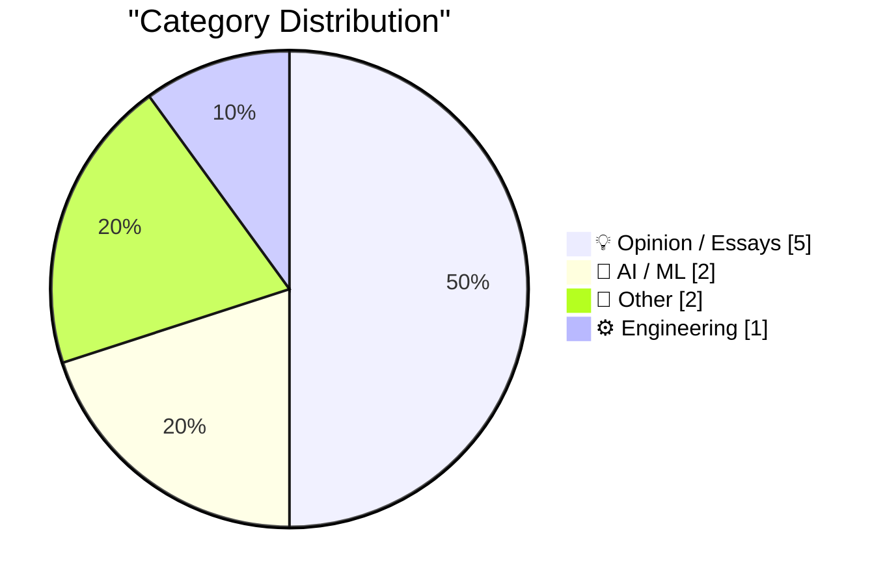
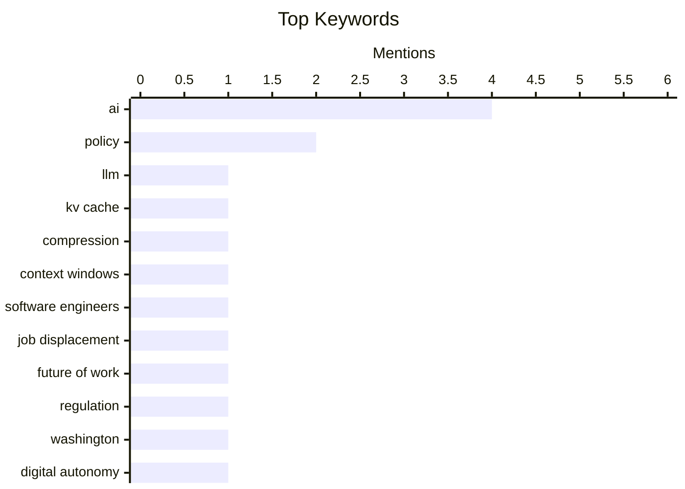

## Today's Highlights
Today's tech landscape is marked by significant advancements and critical discussions surrounding artificial intelligence. Breakthroughs in areas like KV cache compression are pushing AI capabilities, while opinions challenge common misconceptions about AI's impact on job displacement and GPU longevity. This rapid evolution also brings into focus the urgent need for progress in digital policy, with calls for action from Washington and concerns over the stagnation of digital autonomy discussions in the EU, especially regarding AI's interaction with open-source trust.
---
## Must Read Today
1. **A brief history of KV cache compression developments**
[A brief history of KV cache compression developments](https://martinalderson.com/posts/a-brief-history-of-kv-cache-compression-developments/?utm_source=rss&amp;utm_medium=rss&amp;utm_campaign=feed) — martinalderson.com · 14h ago · 🤖 AI / ML
> The article discusses the critical role of KV cache compression in enabling long context windows for modern LLMs, addressing the significant memory consumption of the Key-Value cache. It traces the evolution of techniques from Multi-Query Attention (MQA) and Grouped-Query Attention (GQA), which reduced cache size by sharing keys/values across attention heads. Further advancements include Multi-Head Attention (MLA) and linear-attention hybrids, which offer more sophisticated compression or alternative attention mechanisms. These continuous innovations were essential for making long-context LLMs practical and facilitating advanced agentic AI applications. Ultimately, the progression of KV cache compression techniques has been fundamental to the capabilities of contemporary LLMs.
💡 **Why read it**: It provides a concise technical history of critical optimizations that enabled long-context LLMs, explaining how specific architectural changes addressed memory limitations.
🏷️ LLM, KV cache, Compression, Context windows
2. **Why AI hasn’t replaced software engineers, and won’t**
[Why AI hasn’t replaced software engineers, and won’t](https://simonwillison.net/2026/Jun/14/why-ai-hasnt-replaced-software-engineers/#atom-everything) — simonwillison.net · 14h ago · 💡 Opinion / Essays
> This essay challenges the narrative that AI will imminently replace software engineers, a profession often cited as uniquely susceptible to AI disruption. Authors Arvind Narayanan and Sayash Kappor argue that current AI capabilities lack the nuanced understanding, creative problem-solving, and abstract reasoning crucial for complex software engineering tasks. They emphasize that software engineering encompasses more than just coding, involving design, debugging, collaboration, and adapting to evolving requirements, areas where AI still falls short. The authors conclude that AI is more likely to augment human engineers rather than cause mass job displacement in the field. Therefore, AI's current limitations prevent it from fully replacing the multifaceted role of a software engineer.
💡 **Why read it**: It offers a well-reasoned counter-narrative to the common fear of AI-driven job displacement in software engineering, providing specific arguments for AI's current limitations in this field.
🏷️ AI, Software Engineers, Job displacement, Future of work
3. **What Washington must do**
[What Washington must do](https://garymarcus.substack.com/p/what-washington-must-do) — garymarcus.substack.com · 21h ago · 💡 Opinion / Essays
> The article's title, "What Washington must do," suggests a call to action regarding a significant, albeit unspecified, issue. The accompanying quote, "The only way out is through," implies that Washington needs to confront a challenge directly rather than avoid it. The brevity of the provided snippet prevents a detailed understanding of the core problem or specific arguments. However, it strongly indicates an urgent need for decisive governmental action. The main conclusion is that Washington is urged to face a critical situation head-on.
💡 **Why read it**: The provided snippet is too brief to determine specific value, but it hints at a call to action for Washington regarding an unspecified critical issue.
🏷️ AI, Regulation, Policy, Washington
---
## Data Overview
| Sources Scanned | Articles Fetched | Time Window | Selected |
|:---:|:---:|:---:|:---:|
| 87/92 | 2560 -> 10 | 24h | **10** |
### Category Distribution

### Top Keywords

<details>
<summary>Plain Text Keyword Chart (Terminal Friendly)</summary>
```
ai                 │ ████████████████████ 4
policy             │ ██████████░░░░░░░░░░ 2
llm                │ █████░░░░░░░░░░░░░░░ 1
kv cache           │ █████░░░░░░░░░░░░░░░ 1
compression        │ █████░░░░░░░░░░░░░░░ 1
context windows    │ █████░░░░░░░░░░░░░░░ 1
software engineers │ █████░░░░░░░░░░░░░░░ 1
job displacement   │ █████░░░░░░░░░░░░░░░ 1
future of work     │ █████░░░░░░░░░░░░░░░ 1
regulation         │ █████░░░░░░░░░░░░░░░ 1
```
</details>
### Topic Tags
**ai**(4) · **policy**(2) · **llm**(1) · kv cache(1) · compression(1) · context windows(1) · software engineers(1) · job displacement(1) · future of work(1) · regulation(1) · washington(1) · digital autonomy(1) · eu(1) · sovereignty(1) · open source(1) · trust(1) · provenance(1) · gpus(1) · hardware(1) · sustainability(1)
---
## Opinion / Essays
### 1. Why AI hasn’t replaced software engineers, and won’t
[Why AI hasn’t replaced software engineers, and won’t](https://simonwillison.net/2026/Jun/14/why-ai-hasnt-replaced-software-engineers/#atom-everything) — **simonwillison.net** · 14h ago · ⭐ 26/30
> This essay challenges the narrative that AI will imminently replace software engineers, a profession often cited as uniquely susceptible to AI disruption. Authors Arvind Narayanan and Sayash Kappor argue that current AI capabilities lack the nuanced understanding, creative problem-solving, and abstract reasoning crucial for complex software engineering tasks. They emphasize that software engineering encompasses more than just coding, involving design, debugging, collaboration, and adapting to evolving requirements, areas where AI still falls short. The authors conclude that AI is more likely to augment human engineers rather than cause mass job displacement in the field. Therefore, AI's current limitations prevent it from fully replacing the multifaceted role of a software engineer.
🏷️ AI, Software Engineers, Job displacement, Future of work
---
### 2. What Washington must do
[What Washington must do](https://garymarcus.substack.com/p/what-washington-must-do) — **garymarcus.substack.com** · 21h ago · ⭐ 24/30
> The article's title, "What Washington must do," suggests a call to action regarding a significant, albeit unspecified, issue. The accompanying quote, "The only way out is through," implies that Washington needs to confront a challenge directly rather than avoid it. The brevity of the provided snippet prevents a detailed understanding of the core problem or specific arguments. However, it strongly indicates an urgent need for decisive governmental action. The main conclusion is that Washington is urged to face a critical situation head-on.
🏷️ AI, Regulation, Policy, Washington
---
### 3. EU & Civil Society need to progress on Digital Autonomy
[EU & Civil Society need to progress on Digital Autonomy](https://berthub.eu/articles/posts/eu-civil-society-need-progress-digital-autonomy/) — **berthub.eu** · 1h ago · ⭐ 23/30
> The article addresses the stagnation in discussions surrounding digital autonomy (or sovereignty) within the EU, noting that conversations often circle back to legislation and abstract European values. The author urges civil society and think tanks to move beyond current legislative debates and focus on a long-term, comprehensive roadmap for achieving digital sovereignty. It emphasizes that meaningful progress requires concrete steps along the entire journey, not just theoretical discussions. Civil society is identified as a crucial contributor to this forward momentum. The main conclusion is that the EU and civil society must shift from circular discussions to a proactive, long-term strategy to achieve genuine digital autonomy.
🏷️ Digital autonomy, EU, Policy, Sovereignty
---
### 4. Things that made me think: Open Source trust relationships, knowledge without provenance, and theory building
[Things that made me think: Open Source trust relationships, knowledge without provenance, and theory building](https://tomrenner.com/posts/ttmmt-4/) — **tomrenner.com** · 14h ago · ⭐ 23/30
> This article explores the implications of AI agents interacting with open-source projects, focusing on trust, knowledge provenance, and theory building. It references a scenario where an "AI agent lands PRs in major OSS projects, targets maintainers via cold outreach," which challenges traditional trust relationships within open-source communities. The discussion extends to the broader issue of knowledge acquisition without clear provenance, complicating the development of reliable theories and understanding information origins. The article suggests that the increasing involvement of AI agents necessitates a re-evaluation of trust models and the importance of verifiable knowledge sources. Ultimately, the presence of AI in open-source demands a critical look at how trust and knowledge are established and maintained.
🏷️ Open Source, Trust, AI, Provenance
---
### 5. Quoting Julia Evans
[Quoting Julia Evans](https://simonwillison.net/2026/Jun/15/julia-evans/#atom-everything) — **simonwillison.net** · 11h ago · ⭐ 19/30
> The article highlights a common challenge for writers: effectively addressing their audience, which often leads to generic or unfocused content. Julia Evans' advice is to overcome this by picturing a specific person and writing directly for them. She suggests imagining "me, but 3 years ago" or a close friend as the target audience. This approach helps make the writing more personal, clear, and engaging by focusing on the specific needs and understanding of a single, well-defined reader. The main conclusion is that adopting a "write for one person" mindset, by envisioning a specific individual, significantly improves the clarity and effectiveness of writing.
🏷️ Writing, Communication, Audience, Documentation
---
## AI / ML
### 6. A brief history of KV cache compression developments
[A brief history of KV cache compression developments](https://martinalderson.com/posts/a-brief-history-of-kv-cache-compression-developments/?utm_source=rss&amp;utm_medium=rss&amp;utm_campaign=feed) — **martinalderson.com** · 14h ago · ⭐ 28/30
> The article discusses the critical role of KV cache compression in enabling long context windows for modern LLMs, addressing the significant memory consumption of the Key-Value cache. It traces the evolution of techniques from Multi-Query Attention (MQA) and Grouped-Query Attention (GQA), which reduced cache size by sharing keys/values across attention heads. Further advancements include Multi-Head Attention (MLA) and linear-attention hybrids, which offer more sophisticated compression or alternative attention mechanisms. These continuous innovations were essential for making long-context LLMs practical and facilitating advanced agentic AI applications. Ultimately, the progression of KV cache compression techniques has been fundamental to the capabilities of contemporary LLMs.
🏷️ LLM, KV cache, Compression, Context windows
---
### 7. AI GPUs probably live longer than three years
[AI GPUs probably live longer than three years](https://seangoedecke.com/ai-gpus-live-longer-than-three-years/) — **seangoedecke.com** · 14h ago · ⭐ 21/30
> The article challenges the common claim that AI inference GPUs only last "three years at most" under load, a notion often used to argue against the sustainability of current AI use. The author suggests this claim, sometimes attributed to unnamed Google architects, likely stems from specific, high-intensity training scenarios rather than typical inference workloads. Inference, which constitutes the majority of AI GPU usage, is generally less demanding on hardware than training. Therefore, the actual lifespan of GPUs used for AI inference is likely longer than three years. The main conclusion is that the assertion of a maximum three-year lifespan for AI GPUs is probably an overestimation for typical inference workloads, thus undermining sustainability arguments based on this specific hardware longevity claim.
🏷️ AI, GPUs, Hardware, Sustainability
---
## Other
### 8. GIF’s June 1987 debut
[GIF’s June 1987 debut](https://dfarq.homeip.net/gifs-june-1987-debut/?utm_source=rss&#038;utm_medium=rss&#038;utm_campaign=gifs-june-1987-debut) — **dfarq.homeip.net** · 3h ago · ⭐ 13/30
> The article highlights the surprising historical fact that the GIF (Graphics Interchange Format) made its debut on June 16, 1987, predating the modern internet. This means GIF was a well-established and popular file format in the early 1990s, which contributed to its widespread support in the first web browsers. Its pre-Internet popularity was a key factor in its early adoption online. The article underscores that GIF was a foundational digital image format long before the World Wide Web became prevalent. The main conclusion is that the GIF format, introduced in June 1987, is a venerable and foundational digital image format that significantly predates the modern internet.
🏷️ GIF, History, File format, Web standards
---
### 9. Weekly Update 508
[Weekly Update 508](https://www.troyhunt.com/weekly-update-508/) — **troyhunt.com** · 9h ago · ⭐ 5/30
> The author expresses frustration over the difficulty of finding suitable light switches that meet specific aesthetic and functional criteria. The core problem is the inability to locate switches that are both non-stateful (push-button, rather than up/down) and visually appealing. This seemingly simple requirement proves challenging, indicating a gap in the market for designs that combine modern aesthetics with specific functional preferences. The struggle suggests that common light switch designs often prioritize traditional forms over user-desired features like non-stateful operation. The main conclusion is that finding aesthetically pleasing, non-stateful light switches is surprisingly difficult, highlighting a niche market need for specific design and functional preferences.
🏷️ Light switches, Home improvement, Personal blog
---
## Engineering
### 10. [RSS Club] What happens to old posts?
[[RSS Club] What happens to old posts?](https://shkspr.mobi/blog/2026/06/rss-club-what-happens-to-old-posts/) — **shkspr.mobi** · 2h ago · ⭐ 16/30
> The article addresses a problem arising from the "RSS Club" model, where posts are exclusively available to RSS/Atom subscribers, creating issues for readers who bookmark content. A distraught reader reported bookmarking an RSS Club post, only to find it later removed or made private, consistent with the club's ephemeral nature. This incident highlights a conflict between the exclusive, time-limited nature of RSS Club content and the expectation of persistent access for bookmarked resources. The article implicitly questions the long-term utility and accessibility of such content. The main conclusion is that the RSS Club model, while fostering exclusivity, creates significant challenges for content discoverability and long-term access for readers.
🏷️ RSS, Web content, Archiving, Syndication
---
*Generated at 2026-06-15 14:01 | Scanned 87 sources -> 2560 articles -> selected 10*
*Based on the [Hacker News Popularity Contest 2025](https://refactoringenglish.com/tools/hn-popularity/) RSS source list recommended by [Andrej Karpathy](https://x.com/karpathy)*
*Produced by Dongdianr AI. Follow the same-name WeChat public account for more AI practical tips 💡*
