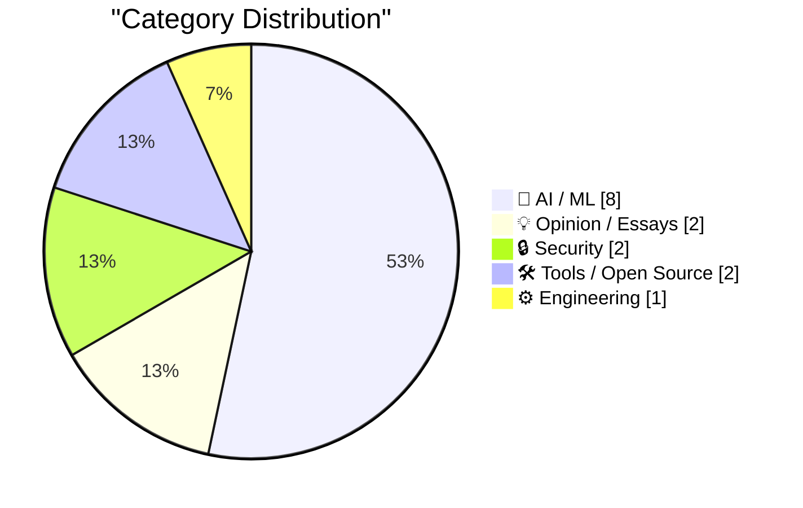
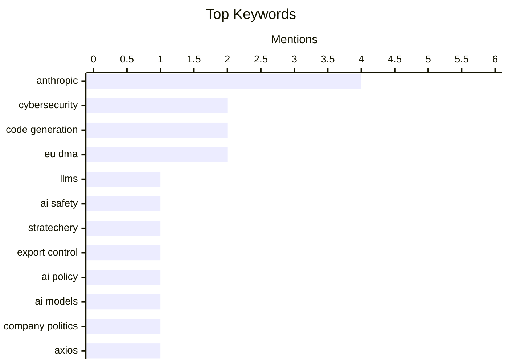

## Today's Highlights
Today's tech news highlights the significant governance and operational hurdles facing leading AI developers, with Anthropic grappling with safety policies and government directives that have taken models offline. OpenAI, meanwhile, reports escalating financial losses amidst this rapidly evolving sector. Concurrently, the EU's Digital Markets Act is actively reshaping the tech landscape, drawing criticism for its impact on giants like Google and Apple and sparking debate over competition and access to frontier AI.
---
## Must Read Today
1. **‘Anthropic’s Safety Superpower’**
[‘Anthropic’s Safety Superpower’](https://stratechery.com/2026/anthropics-safety-superpower/) — daringfireball.net · 20h ago · 💡 Opinion / Essays
> Anthropic's restrictive policy on its frontier LLMs raises questions about competition and access in the AI safety landscape. The company explicitly states it doesn't want to aid competitors and implies only it should develop frontier LLMs. This stance is particularly striking given it was implemented shortly after a dispute where the Department of War sought to use Claude. Anthropic's actions suggest a belief in its unique "safety superpower," potentially limiting broader innovation and access to advanced AI models.
💡 **Why read it**: It offers critical insight into Anthropic's strategic positioning and its controversial stance on AI safety and competition.
🏷️ Anthropic, LLMs, AI Safety, Stratechery
2. **Quoting Matteo Wong, The Atlantic**
[Quoting Matteo Wong, The Atlantic](https://simonwillison.net/2026/Jun/16/matteo-wong-the-atlantic/#atom-everything) — simonwillison.net · 10h ago · 🤖 AI / ML
> The article highlights the White House's engagement with Anthropic's Fable model regarding a "jailbreak" and bug patching. Cybersecurity expert Katie Moussouris was consulted by Anthropic to appraise a White House report detailing how IT experts used Fable to identify and fix software vulnerabilities. This indicates government interest in leveraging advanced AI for cybersecurity, even for potential "jailbreaks." The interaction underscores the complex relationship between AI developers, government, and cybersecurity, particularly concerning model vulnerabilities and their potential exploitation for defensive purposes.
💡 **Why read it**: It reveals a specific instance of government interaction with a frontier AI model (Anthropic's Fable) for cybersecurity purposes, including bug finding.
🏷️ Anthropic, Export Control, AI Policy, Cybersecurity
3. **"They screwed us": Personality clashes sent Anthropic's models offline**
["They screwed us": Personality clashes sent Anthropic's models offline](https://simonwillison.net/2026/Jun/15/axios-clashes-anthropics/#atom-everything) — simonwillison.net · 23h ago · 🤖 AI / ML
> Personality clashes and government directives led to Anthropic's Mythos/Fable models being taken offline, revealing tensions in AI regulation. An Axios report, drawing on anonymous sources, suggests that significant "personality clashes" between parties contributed to the US government's export control directive. This directive resulted in the suspension of access to Anthropic's advanced AI models, Mythos and Fable. The incident highlights the complex interplay of corporate-government relations, individual personalities, and regulatory actions in the rapidly evolving AI landscape.
💡 **Why read it**: It provides a rare glimpse into the political and interpersonal dynamics behind government actions affecting frontier AI models like Anthropic's.
🏷️ Anthropic, AI Models, Company Politics, Axios
---
## Data Overview
| Sources Scanned | Articles Fetched | Time Window | Selected |
|:---:|:---:|:---:|:---:|
| 87/92 | 2561 -> 24 | 24h | **15** |
### Category Distribution

### Top Keywords

<details>
<summary>Plain Text Keyword Chart (Terminal Friendly)</summary>
```
anthropic       │ ████████████████████ 4
cybersecurity   │ ██████████░░░░░░░░░░ 2
code generation │ ██████████░░░░░░░░░░ 2
eu dma          │ ██████████░░░░░░░░░░ 2
llms            │ █████░░░░░░░░░░░░░░░ 1
ai safety       │ █████░░░░░░░░░░░░░░░ 1
stratechery     │ █████░░░░░░░░░░░░░░░ 1
export control  │ █████░░░░░░░░░░░░░░░ 1
ai policy       │ █████░░░░░░░░░░░░░░░ 1
ai models       │ █████░░░░░░░░░░░░░░░ 1
```
</details>
### Topic Tags
**anthropic**(4) · **cybersecurity**(2) · **code generation**(2) · eu dma(2) · llms(1) · ai safety(1) · stratechery(1) · export control(1) · ai policy(1) · ai models(1) · company politics(1) · axios(1) · system design(1) · backpressure(1) · architecture(1) · ai economics(1) · nvidia(1) · business models(1) · phishing(1) · duckduckgo(1)
---
## AI / ML
### 1. Quoting Matteo Wong, The Atlantic
[Quoting Matteo Wong, The Atlantic](https://simonwillison.net/2026/Jun/16/matteo-wong-the-atlantic/#atom-everything) — **simonwillison.net** · 10h ago · ⭐ 27/30
> The article highlights the White House's engagement with Anthropic's Fable model regarding a "jailbreak" and bug patching. Cybersecurity expert Katie Moussouris was consulted by Anthropic to appraise a White House report detailing how IT experts used Fable to identify and fix software vulnerabilities. This indicates government interest in leveraging advanced AI for cybersecurity, even for potential "jailbreaks." The interaction underscores the complex relationship between AI developers, government, and cybersecurity, particularly concerning model vulnerabilities and their potential exploitation for defensive purposes.
🏷️ Anthropic, Export Control, AI Policy, Cybersecurity
---
### 2. "They screwed us": Personality clashes sent Anthropic's models offline
["They screwed us": Personality clashes sent Anthropic's models offline](https://simonwillison.net/2026/Jun/15/axios-clashes-anthropics/#atom-everything) — **simonwillison.net** · 23h ago · ⭐ 27/30
> Personality clashes and government directives led to Anthropic's Mythos/Fable models being taken offline, revealing tensions in AI regulation. An Axios report, drawing on anonymous sources, suggests that significant "personality clashes" between parties contributed to the US government's export control directive. This directive resulted in the suspension of access to Anthropic's advanced AI models, Mythos and Fable. The incident highlights the complex interplay of corporate-government relations, individual personalities, and regulatory actions in the rapidly evolving AI landscape.
🏷️ Anthropic, AI Models, Company Politics, Axios
---
### 3. AI's Brokenomics
[AI's Brokenomics](https://www.wheresyoured.at/brokenomics/) — **wheresyoured.at** · 18h ago · ⭐ 27/30
> The provided text is a promotional snippet for a premium newsletter, offering no substantive content on the topic of "AI's Brokenomics." The snippet merely advertises a weekly newsletter, priced at $70/year or $7/month, promising extensive analyses (5,000-18,000 words) of companies like NVIDIA and Anthropic. Without the full article, no specific arguments or conclusions regarding "AI's Brokenomics" can be drawn from this promotional material.
🏷️ AI Economics, NVIDIA, Anthropic, Business Models
---
### 4. Writing Prolog with ChatGPT
[Writing Prolog with ChatGPT](https://www.johndcook.com/blog/2026/06/15/writing-prolog-with-chatgpt/) — **johndcook.com** · 20h ago · ⭐ 26/30
> The article explores the capability of large language models, specifically ChatGPT, to generate Prolog code for solving complex logical puzzles like chess problems. The author tasked ChatGPT with placing a queen, king, rook, bishop, and knight on a 4x4 chessboard such that no piece attacks another. This follows a previous successful attempt using Claude for a similar puzzle, demonstrating the LLM's ability to handle symbolic reasoning and code generation in a declarative language like Prolog. ChatGPT proves effective in generating Prolog code to solve non-trivial logical constraints, showcasing its potential for symbolic AI tasks beyond natural language processing.
🏷️ ChatGPT, Prolog, Code Generation
---
### 5. Exclusive: OpenAI Losses Increased Nearly 8X in 2025, With Spending Hitting $34 Billion
[Exclusive: OpenAI Losses Increased Nearly 8X in 2025, With Spending Hitting $34 Billion](https://www.wheresyoured.at/exclusive-openai-financials/) — **wheresyoured.at** · 10h ago · ⭐ 26/30
> The article reports on the significant financial losses and escalating spending of OpenAI in 2025, raising questions about the sustainability of current AI development models. According to an exclusive report, OpenAI's losses in 2025 surged by nearly 800%, with total expenditures reaching an unprecedented $34 billion. This substantial increase in spending underscores the immense capital required for frontier AI research and development. The reported financial figures highlight the extraordinary investment and operational costs associated with leading-edge AI development, suggesting a challenging economic landscape for even the most prominent AI labs.
🏷️ OpenAI, Losses, Spending, AI Industry
---
### 6. The European Commission Ruled Months Ago That Google’s Integration of Gemini in Android Violates the DMA
[The European Commission Ruled Months Ago That Google’s Integration of Gemini in Android Violates the DMA](https://arstechnica.com/ai/2026/04/europe-could-force-google-to-open-android-to-other-ai-assistants/) — **daringfireball.net** · 19h ago · ⭐ 25/30
> The European Commission ruled that Google's integration of Gemini into Android violates the Digital Markets Act (DMA), prompting proposed changes to AI tool operation on the platform. European regulators are pushing for broad changes, including enabling third-party AI tools to be invoked system-wide via hot words or buttons, granting them access to screen context, and allowing them to utilize local data for proactive suggestions. This ruling aims to prevent Google from unfairly leveraging its platform dominance for its own AI services. The DMA's enforcement against Google's Gemini integration signifies a concerted effort by European regulators to ensure fair competition and open access for alternative AI assistants on major mobile platforms.
🏷️ Google Gemini, Android, EU DMA, AI Regulation
---
### 7. Quaternion Rotations, Claude, and Lean
[Quaternion Rotations, Claude, and Lean](https://www.johndcook.com/blog/2026/06/15/quaternions-claude-lean/) — **johndcook.com** · 18h ago · ⭐ 25/30
> The article's core topic is evaluating an AI's ability to identify errors in technical content, prompted by a typo report in a blog post about quaternion-to-rotation matrix conversions. The author tested Claude (specifically Sonnet 4.6 Medium) by providing a prompt to see if it could locate the reported typo. This experiment aims to assess the AI's proficiency in debugging or identifying subtle technical inaccuracies in mathematical contexts. The main conclusion is that the article explores the efficacy of large language models like Claude in identifying specific technical errors in mathematical or programming content.
🏷️ Quaternions, AI, Claude, Rotation Matrices
---
### 8. JAX: commitment issues
[JAX: commitment issues](https://www.gilesthomas.com/2026/06/jax-commitment-issues) — **gilesthomas.com** · 16h ago · ⭐ 25/30
> This article discusses specific device management behaviors, termed "commitment issues," within JAX when executing code on systems equipped with CUDA. The provided code snippet, involving `jax.random.key(42)` and `cpu0 = jax.s`, suggests an exploration into how JAX handles device allocation and resource management, particularly concerning initial setup or random number generation on specific devices like CPU0. These "commitment issues" likely refer to unexpected or suboptimal device assignments that can impact performance or reproducibility. The article aims to clarify nuances in JAX's device management, especially in CUDA environments, which is critical for optimizing and debugging JAX applications.
🏷️ JAX, CUDA, Machine Learning, Framework
---
## Opinion / Essays
### 9. ‘Anthropic’s Safety Superpower’
[‘Anthropic’s Safety Superpower’](https://stratechery.com/2026/anthropics-safety-superpower/) — **daringfireball.net** · 20h ago · ⭐ 28/30
> Anthropic's restrictive policy on its frontier LLMs raises questions about competition and access in the AI safety landscape. The company explicitly states it doesn't want to aid competitors and implies only it should develop frontier LLMs. This stance is particularly striking given it was implemented shortly after a dispute where the Department of War sought to use Claude. Anthropic's actions suggest a belief in its unique "safety superpower," potentially limiting broader innovation and access to advanced AI models.
🏷️ Anthropic, LLMs, AI Safety, Stratechery
---
### 10. The Washington Post on the EU’s DMA Folly
[The Washington Post on the EU’s DMA Folly](https://www.washingtonpost.com/opinions/2026/06/14/apple-withholding-siri-ai-europe-is-another-dma-failure/) — **daringfireball.net** · 11h ago · ⭐ 25/30
> The EU's Digital Markets Act (DMA) is criticized for inadvertently causing Apple to withhold its new Siri AI from Europe due to stringent data access requirements. The Washington Post editorial board argues that while the EU claims Apple's decision is voluntary, the DMA mandates that any rival AI agent must gain "sweeping access" to user messages, files, and chat history if Siri AI is launched. Apple's proposed software security layer to mitigate this was rejected, forcing the company to delay the European launch. The DMA's broad data access provisions, intended to foster competition, are instead hindering the deployment of advanced AI features in Europe and raising significant privacy concerns.
🏷️ EU DMA, Tech Regulation, Apple, Siri
---
## Security
### 11. Would you like a drainer served at the very top of DuckDuckGo?
[Would you like a drainer served at the very top of DuckDuckGo?](https://timsh.org/drainer-at-the-top-of-duckduckgo/) — **timsh.org** · 27m ago · ⭐ 26/30
> A critical security vulnerability was discovered where a phishing website, serving a crypto wallet "drainer," ranked as the #1 search result on DuckDuckGo for "tronscan." The author encountered an exact duplicate of the legitimate Tronscan blockchain explorer, which was malicious and designed to drain cryptocurrency wallets. This highly dangerous phishing site achieved top organic search ranking, indicating a significant failure in search engine security and content filtering. Search engines like DuckDuckGo must implement more robust security measures to prevent dangerous phishing and scam websites from appearing as top results, especially for sensitive financial queries.
🏷️ Phishing, DuckDuckGo, Blockchain, Search Security
---
### 12. The Fable 5 Export Controls Harm US Cyber Defense
[The Fable 5 Export Controls Harm US Cyber Defense](https://simonwillison.net/2026/Jun/16/fable-5-export-controls/#atom-everything) — **simonwillison.net** · 8h ago · ⭐ 24/30
> The core problem discussed is how the "Fable 5" export controls, particularly as applied to AI models, are detrimentally affecting US cyber defense capabilities. The article highlights Kate Moussouris's confirmation that the "jailbreak" leading to Claude Fable 5's ban under export control was merely a prompt like "fix this code." This suggests an overly broad interpretation or application of export controls to basic AI interactions. The main conclusion is that current AI export controls, exemplified by the Claude Fable 5 incident, are excessively restrictive and harmful to US cyber defense by impeding legitimate and beneficial AI applications.
🏷️ Export Controls, Cyber Defense, US Policy, Cybersecurity
---
## Tools / Open Source
### 13. WorkOS Launches Auth.md — an Open Protocol for Agent Registration
[WorkOS Launches Auth.md — an Open Protocol for Agent Registration](https://workos.com/auth-md?utm_source=daringfireball&amp;utm_medium=newsletter&amp;utm_campaign=q22026) — **daringfireball.net** · 20h ago · ⭐ 25/30
> The core problem Auth.md addresses is the lack of a standardized, programmatic way for AI agents to register with online services, which were traditionally designed for human users. Auth.md is an open protocol that solves this by requiring services to expose a single, machine-readable Markdown file at their root. This file enables AI agents to dynamically discover OAuth Protected Resource Metadata, parse necessary scopes, and authenticate seamlessly. This approach streamlines the interaction between AI agents and services. The main conclusion is that Auth.md provides a crucial, standardized mechanism for AI agents to interact with services, simplifying their registration and authentication processes.
🏷️ AI Agents, Open Protocol, WorkOS, Registration
---
### 14. datasette-agent 0.3a0
[datasette-agent 0.3a0](https://simonwillison.net/2026/Jun/15/datasette-agent/#atom-everything) — **simonwillison.net** · 20h ago · ⭐ 24/30
> This article announces the release of `datasette-agent 0.3a0`, focusing on enhancing its capabilities for database interaction, specifically for write operations. The key technical addition is a new tool, `execute_write_sql`, which enables writing data to a database. A crucial design choice for this tool is the mandatory requirement for user approval before any write operation is executed, ensuring that user permissions are respected and data integrity is maintained. This feature directly addresses GitHub issue `#27`. The main conclusion is that `datasette-agent 0.3a0` significantly improves its utility by enabling controlled and secure database write operations with explicit user consent.
🏷️ Datasette, AI Agent, Database, Open Source
---
## Engineering
### 15. Lean, not backpressure
[Lean, not backpressure](https://entropicthoughts.com/lean-not-backpressure) — **entropicthoughts.com** · 16h ago · ⭐ 27/30
> The article critiques the misuse of the "backpressure" metaphor in designing systems for code-generating robots, arguing for a more precise conceptualization. The author contends that Lucas Costa's proposed solutions, which focus on signaling upstream processes to alter their behavior or ensure quality, fundamentally differ from true backpressure, which is about signaling a need to slow down. The author suggests that concepts akin to "lean" principles, emphasizing efficient and quality-focused processes, would be a more accurate metaphor. Accurate terminology is crucial for effective system design, and distinguishing between flow control (backpressure) and quality/process improvement (lean) is vital for building robust AI-driven systems.
🏷️ System Design, Backpressure, Code Generation, Architecture
---
*Generated at 2026-06-16 14:02 | Scanned 87 sources -> 2561 articles -> selected 15*
*Based on the [Hacker News Popularity Contest 2025](https://refactoringenglish.com/tools/hn-popularity/) RSS source list recommended by [Andrej Karpathy](https://x.com/karpathy)*
*Produced by Dongdianr AI. Follow the same-name WeChat public account for more AI practical tips 💡*
