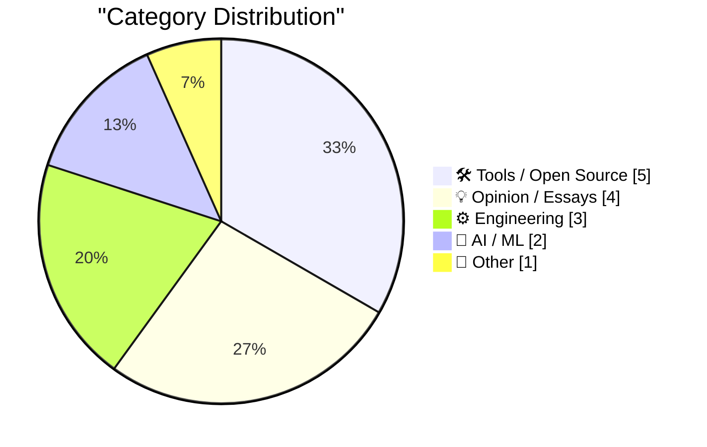
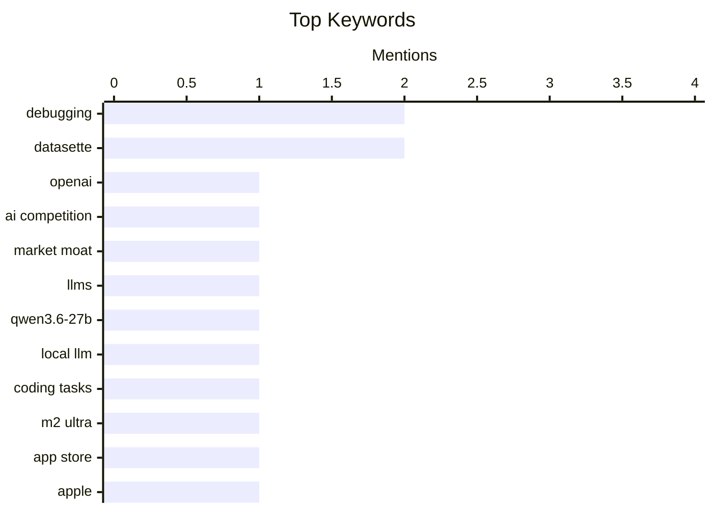

## Today's Highlights
Today's tech news points to a dynamic shift in the AI landscape, with OpenAI's competitive edge reportedly dimming as powerful local large language models gain traction, especially for coding tasks. This comes amidst a growing push for digital autonomy, particularly in Europe, and observations of regional disparities in platform features. Meanwhile, developers continue to navigate complex debugging challenges in both AI systems and production environments, supported by new tooling.
---
## Must Read Today
1. **OpenAI’s lead is dwindling fast**
[OpenAI’s lead is dwindling fast](https://garymarcus.substack.com/p/openais-lead-is-dwindling-fast) — garymarcus.substack.com · 16h ago · 💡 Opinion / Essays
> This article argues that OpenAI's competitive advantage, often perceived as a 'moat,' is rapidly diminishing. The author contends that the real 'moat' was never just about models, but about data, compute, and talent, which are becoming more accessible. Open-source models like Llama 3 70B are now approaching GPT-4's performance, while smaller models such as Qwen3.6-27B are highly capable for local tasks. The decreasing cost of training and inference further erodes OpenAI's ability to maintain a lead based on scale alone. Ultimately, the field is democratizing, making it difficult for any single player to sustain a dominant position.
💡 **Why read it**: It provides a critical perspective on the competitive landscape of AI, challenging the notion of a sustainable 'moat' for leading AI companies like OpenAI.
🏷️ OpenAI, AI competition, market moat, LLMs
2. **Quoting Georgi Gerganov**
[Quoting Georgi Gerganov](https://simonwillison.net/2026/Jun/16/georgi-gerganov/#atom-everything) — simonwillison.net · 21h ago · 🤖 AI / ML
> This article highlights the impressive capabilities of local large language models for coding tasks, specifically quoting Georgi Gerganov. Gerganov attests that Qwen3.6-27B is a very capable local model, which he uses almost daily for mundane coding tasks at ggml-org. He runs it efficiently on his M2 Ultra or RTX 5090 box, demonstrating its practical utility on consumer-grade hardware. This indicates that powerful models can be effectively deployed locally, reducing reliance on remote services. The main takeaway is that local, smaller-scale LLMs like Qwen3.6-27B are becoming highly effective for practical development tasks.
💡 **Why read it**: It offers a concrete, real-world endorsement of a specific local LLM (Qwen3.6-27B) for coding, demonstrating its practical utility on consumer hardware.
🏷️ Qwen3.6-27B, local LLM, coding tasks, M2 Ultra
3. **New in the App Store: Personalized Recommendations**
[New in the App Store: Personalized Recommendations](https://techcrunch.com/2026/06/09/apples-app-store-rolls-out-personalized-recommendations/) — daringfireball.net · 21h ago · 🛠 Tools / Open Source
> Apple is introducing new discovery features in the App Store designed to personalize app recommendations for users. Announced at WWDC, these updates include 'Personalized Collections' and 'App Notes.' Personalized Collections will showcase app recommendations tailored to individual users' interests and behavior, aiming to improve relevance. Additionally, 'App Notes' will provide explanations for why specific apps are being recommended. These enhancements are intended to improve app discoverability for users and offer new avenues for developers to reach their target audience.
💡 **Why read it**: It details Apple's latest App Store enhancements designed to improve app discovery through personalized recommendations and explanatory 'App Notes.'
🏷️ App Store, Apple, personalized recommendations, app discovery
---
## Data Overview
| Sources Scanned | Articles Fetched | Time Window | Selected |
|:---:|:---:|:---:|:---:|
| 87/92 | 2564 -> 16 | 24h | **15** |
### Category Distribution

### Top Keywords

<details>
<summary>Plain Text Keyword Chart (Terminal Friendly)</summary>
```
debugging      │ ████████████████████ 2
datasette      │ ████████████████████ 2
openai         │ ██████████░░░░░░░░░░ 1
ai competition │ ██████████░░░░░░░░░░ 1
market moat    │ ██████████░░░░░░░░░░ 1
llms           │ ██████████░░░░░░░░░░ 1
qwen3.6-27b    │ ██████████░░░░░░░░░░ 1
local llm      │ ██████████░░░░░░░░░░ 1
coding tasks   │ ██████████░░░░░░░░░░ 1
m2 ultra       │ ██████████░░░░░░░░░░ 1
```
</details>
### Topic Tags
**debugging**(2) · **datasette**(2) · **openai**(1) · ai competition(1) · market moat(1) · llms(1) · qwen3.6-27b(1) · local llm(1) · coding tasks(1) · m2 ultra(1) · app store(1) · apple(1) · personalized recommendations(1) · app discovery(1) · apple intelligence(1) · eu regulation(1) · iphone(1) · feature parity(1) · flax(1) · jax(1)
---
## Tools / Open Source
### 1. New in the App Store: Personalized Recommendations
[New in the App Store: Personalized Recommendations](https://techcrunch.com/2026/06/09/apples-app-store-rolls-out-personalized-recommendations/) — **daringfireball.net** · 21h ago · ⭐ 25/30
> Apple is introducing new discovery features in the App Store designed to personalize app recommendations for users. Announced at WWDC, these updates include 'Personalized Collections' and 'App Notes.' Personalized Collections will showcase app recommendations tailored to individual users' interests and behavior, aiming to improve relevance. Additionally, 'App Notes' will provide explanations for why specific apps are being recommended. These enhancements are intended to improve app discoverability for users and offer new avenues for developers to reach their target audience.
🏷️ App Store, Apple, personalized recommendations, app discovery
---
### 2. datasette 1.0a34
[datasette 1.0a34](https://simonwillison.net/2026/Jun/16/datasette/#atom-everything) — **simonwillison.net** · 16h ago · ⭐ 23/30
> This article announces the release of Datasette 1.0a34, introducing significant new data manipulation features. The primary enhancement in this alpha version is the ability to insert, edit, and delete rows directly within the Datasette interface. These functionalities are accessible on table pages, with edit and delete options also available on individual row pages. This update moves Datasette beyond being a read-only data exploration tool. Datasette 1.0a34 significantly enhances its utility by providing direct data modification capabilities.
🏷️ Datasette, data tool, alpha release, data management
---
### 3. datasette-tailscale 0.1a0
[datasette-tailscale 0.1a0](https://simonwillison.net/2026/Jun/16/datasette-tailscale/#atom-everything) — **simonwillison.net** · 21h ago · ⭐ 21/30
> This article introduces `datasette-tailscale` 0.1a0, an experimental plugin designed to simplify the secure sharing of Datasette instances. The plugin allows users to expose a local Datasette server to their Tailnet using a simple command: `datasette tailscale mydata.db --ts-authkey tskey-auth-xxxx --ts-hostname datasette-preview`. This command starts a localhost Datasette server alongside a Tailscale sidecar, making the Datasette instance accessible via `http://datasette-preview` within the user's private Tailscale network. `datasette-tailscale` simplifies secure, private sharing of Datasette instances within a Tailscale network, enhancing accessibility and collaboration.
🏷️ Datasette, Tailscale, plugin, data access
---
### 4. <click-to-play> — a still that plays
[<click-to-play> — a still that plays](https://simonwillison.net/2026/Jun/17/click-to-play-component/#atom-everything) — **simonwillison.net** · 10h ago · ⭐ 20/30
> This article describes the development of a progressive enhancement Web Component named `<click-to-play>`, designed for loading GIFs on demand. The component transforms standard HTML markup, specifically an `<a>` tag containing an `` (representing the first frame), into a still frame with a click-to-play button. This mechanism ensures that large GIFs are only loaded when explicitly requested by the user, rather than on initial page load. This approach significantly improves page load performance and overall user experience. The component offers an elegant solution for optimizing web performance by deferring the loading of heavy GIF content until user interaction.
🏷️ Web Component, front-end, progressive enhancement, GIF
---
### 5. Key, in sight
[Key, in sight](https://aresluna.org/key-in-sight) — **aresluna.org** · 19h ago · ⭐ 19/30
> This article serves as an extensive guide to keyboard customization, covering both hardware and software aspects of personalized input devices. It delves into technical details such as switch types, keycap profiles, PCB selection, and programming with firmware like QMK, ZMK, and VIA. The guide also explores ergonomic considerations and the underlying philosophy of tailoring keyboards for optimal productivity and comfort. By offering practical advice and deep insights, it emphasizes the benefits of custom layouts and keybindings. The main conclusion is that this resource is invaluable for anyone interested in building or customizing their own mechanical keyboard.
🏷️ Keyboard, Customization, Ergonomics, Guide
---
## Opinion / Essays
### 6. OpenAI’s lead is dwindling fast
[OpenAI’s lead is dwindling fast](https://garymarcus.substack.com/p/openais-lead-is-dwindling-fast) — **garymarcus.substack.com** · 16h ago · ⭐ 28/30
> This article argues that OpenAI's competitive advantage, often perceived as a 'moat,' is rapidly diminishing. The author contends that the real 'moat' was never just about models, but about data, compute, and talent, which are becoming more accessible. Open-source models like Llama 3 70B are now approaching GPT-4's performance, while smaller models such as Qwen3.6-27B are highly capable for local tasks. The decreasing cost of training and inference further erodes OpenAI's ability to maintain a lead based on scale alone. Ultimately, the field is democratizing, making it difficult for any single player to sustain a dominant position.
🏷️ OpenAI, AI competition, market moat, LLMs
---
### 7. Checking In on the iOS Continental Fun-Gap Drift
[Checking In on the iOS Continental Fun-Gap Drift](https://daringfireball.net/2024/09/ios_continental_drift_fun_gap) — **daringfireball.net** · 13h ago · ⭐ 24/30
> This article revisits the perceived 'fun-gap' in iOS features between the EU and other regions, specifically concerning Apple Intelligence and iPhone Mirroring. Two years after initial skepticism, the author notes that EU users still lack these 'very useful' and 'quite fun' features. This disparity in feature availability creates a different user experience compared to non-EU regions, likely due to regulatory or other regional constraints. The main conclusion is that, despite initial hopes, the 'fun side' of advanced iOS features remains largely unavailable in the EU, indicating a persistent continental divide.
🏷️ Apple Intelligence, EU regulation, iPhone, feature parity
---
### 8. Do not invite big-tech to join your digital autonomy discussion
[Do not invite big-tech to join your digital autonomy discussion](https://berthub.eu/articles/posts/do-not-invite-big-tech-to-your-digital-autonomy-discussion/) — **berthub.eu** · 22h ago · ⭐ 24/30
> This article argues against inviting major US big tech companies to discussions concerning European digital autonomy and dependencies. The author, reflecting on a past event, contends that while big tech companies are necessary business partners, they possess inherent conflicts of interest in such discussions. Their business models often rely on creating and maintaining digital dependencies, which directly opposes the goal of fostering autonomy. Therefore, to genuinely advance digital autonomy, discussions should prioritize perspectives from entities whose interests align with reducing dependencies, rather than those who profit from them.
🏷️ Digital autonomy, Big Tech, Policy, Europe
---
### 9. NetNewsWire Status
[NetNewsWire Status](https://simonwillison.net/2026/Jun/17/netnewswire-status/#atom-everything) — **simonwillison.net** · 10h ago · ⭐ 17/30
> This article highlights the inspiring development status of NetNewsWire, an RSS reader, following its creator Brent Simmons' retirement. Brent Simmons, having retired a year ago, is now dedicating his time to making NetNewsWire exceptionally good, free from commercial pressures. The software, first released in 2002, is described as "like podcasts, but for reading," emphasizing its role in content consumption. This non-commercial approach allows for a singular focus on quality and user experience, rather than feature bloat or monetization. NetNewsWire's continued development under Brent Simmons' post-retirement dedication exemplifies how passion and freedom from commercial constraints can lead to exceptionally high-quality software.
🏷️ NetNewsWire, Brent Simmons, open source, passion project
---
## Engineering
### 10. Debugging on Prod
[Debugging on Prod](https://idiallo.com/blog/debugging-on-prod) — **idiallo.com** · 17h ago · ⭐ 23/30
> This article recounts the challenging experience of debugging a production-only bug after a significant site redesign and code cleanup. The author redesigned their 10-year-old blog, deleting unused templates and old code, and initially, all pages worked fine. However, a specific 500 error only manifested on the production environment, not in development, highlighting the unique difficulties of such issues. This experience underscores the critical importance of robust testing and careful deployment strategies, especially after extensive code refactoring. Production-only bugs are the most challenging, emphasizing the need for thorough environmental parity and testing.
🏷️ Debugging, production bugs, software engineering, 500 error
---
### 11. 10Gb/s Ethernet: switching to a Broadcom SFP+ module
[10Gb/s Ethernet: switching to a Broadcom SFP+ module](https://www.gilesthomas.com/2026/06/10g-ethernet-switching-to-broadcom-sfp-plus) — **gilesthomas.com** · 19h ago · ⭐ 18/30
> The author encountered overheating issues with 10GBASE-T SFP+ modules used to connect a 10Gb/s home LAN, which relies on CAT-6 cabling, to a router and switch with SFP+ cages. While initial modules in the router appeared stable, the switch module proved problematic due to excessive heat. The solution involved replacing the problematic SFP+ module with a Broadcom BCM84760-based module, specifically a MikroTik S+RJ10. This specific module is known for its superior thermal performance, significantly improving stability and reducing heat compared to generic alternatives. The main takeaway is that selecting a high-quality, Broadcom-based 10GBASE-T SFP+ module like the MikroTik S+RJ10 can effectively mitigate common overheating problems in 10Gb/s Ethernet setups.
🏷️ 10Gb/s, Ethernet, SFP+, Networking
---
### 12. How a Microsoft product from June 1979 led to the IBM PC
[How a Microsoft product from June 1979 led to the IBM PC](https://dfarq.homeip.net/how-a-microsoft-product-from-june-1979-led-to-the-ibm-pc/?utm_source=rss&#038;utm_medium=rss&#038;utm_campaign=how-a-microsoft-product-from-june-1979-led-to-the-ibm-pc) — **dfarq.homeip.net** · 3h ago · ⭐ 17/30
> This article explores the historical significance of June 1979 for Microsoft and its indirect yet crucial role in the development of the IBM PC. In June 1979, Microsoft's flagship 8080 Basic surpassed an installed base of 200,000 users, marking a significant milestone. More importantly, on June 18, 1979, Microsoft released a version of its BASIC interpreter specifically for the Intel 8086 processor. This strategic release of 8086 BASIC, combined with Microsoft's subsequent operating system efforts (MS-DOS), positioned the company to become a pivotal partner for IBM's personal computer project. The main conclusion is that Microsoft's early product releases and growing market presence in June 1979 laid foundational groundwork that directly led to its essential role in the IBM PC's creation.
🏷️ Microsoft, IBM PC, 8080 Basic, History
---
## AI / ML
### 13. Quoting Georgi Gerganov
[Quoting Georgi Gerganov](https://simonwillison.net/2026/Jun/16/georgi-gerganov/#atom-everything) — **simonwillison.net** · 21h ago · ⭐ 25/30
> This article highlights the impressive capabilities of local large language models for coding tasks, specifically quoting Georgi Gerganov. Gerganov attests that Qwen3.6-27B is a very capable local model, which he uses almost daily for mundane coding tasks at ggml-org. He runs it efficiently on his M2 Ultra or RTX 5090 box, demonstrating its practical utility on consumer-grade hardware. This indicates that powerful models can be effectively deployed locally, reducing reliance on remote services. The main takeaway is that local, smaller-scale LLMs like Qwen3.6-27B are becoming highly effective for practical development tasks.
🏷️ Qwen3.6-27B, local LLM, coding tasks, M2 Ultra
---
### 14. Flax debugging: making a hash of things
[Flax debugging: making a hash of things](https://www.gilesthomas.com/2026/06/hashing-jax-parameters) — **gilesthomas.com** · 11h ago · ⭐ 24/30
> This article addresses the challenge of debugging a JAX/Flax NNX training loop to verify if gradients were correctly applied to parameters. The author found that directly printing complex parameters was unhelpful for observing changes. The proposed solution involves hashing the parameters after each update step and printing this hash instead. This technique allows for quick and concise verification of whether parameters are indeed changing, indicating successful gradient application. Hashing JAX/Flax parameters provides an effective and concise method for debugging parameter updates within complex neural network training loops.
🏷️ Flax, JAX, Debugging, Training loop
---
## Other
### 15. Partial fraction decomposition
[Partial fraction decomposition](https://www.johndcook.com/blog/2026/06/16/partial-fraction-decomposition/) — **johndcook.com** · 20h ago · ⭐ 16/30
> This article discusses partial fraction decomposition, a mathematical technique often introduced in calculus primarily for computing integrals of rational functions. The technique involves breaking down a ratio of polynomials, P(x)/Q(x), into a sum of simpler terms that can each be integrated in closed form. Beyond calculus, partial fraction decomposition finds significant applications in fields such as control theory for analyzing system responses and in signal processing for filter design. It essentially transforms complex rational expressions into a sum of simpler fractions, making them easier to manipulate or analyze in various mathematical contexts. The main takeaway is that partial fraction decomposition is a versatile mathematical tool with utility extending far beyond basic integral computation, proving valuable in diverse engineering and scientific disciplines.
🏷️ Partial fraction, calculus, mathematics, integration
---
*Generated at 2026-06-17 14:01 | Scanned 87 sources -> 2564 articles -> selected 15*
*Based on the [Hacker News Popularity Contest 2025](https://refactoringenglish.com/tools/hn-popularity/) RSS source list recommended by [Andrej Karpathy](https://x.com/karpathy)*
*Produced by Dongdianr AI. Follow the same-name WeChat public account for more AI practical tips 💡*
