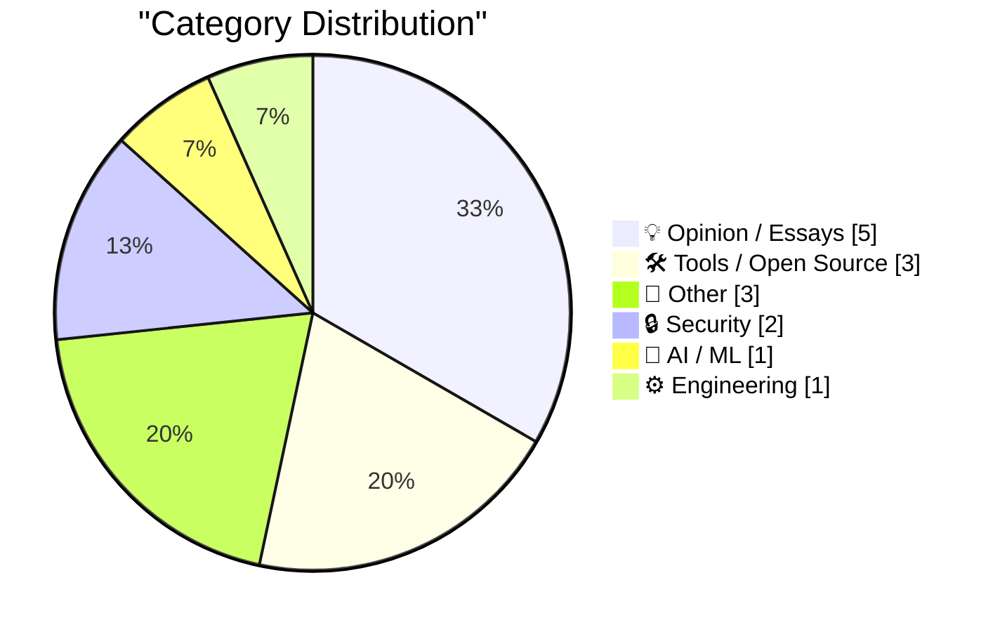
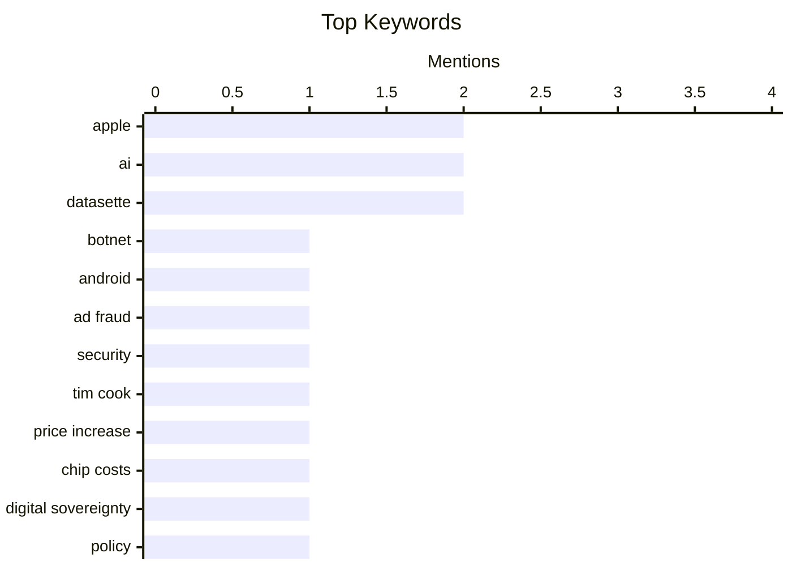

## Today's Highlights
Digital security remains a top concern, with new botnet threats emerging and Apple enhancing privacy features for its users. Simultaneously, the tech world grapples with the implications of AI, from debates on digital sovereignty to the release of new AI-powered productivity tools. These developments unfold against a backdrop of economic pressures, as major tech companies signal unavoidable price increases.
---
## Must Read Today
1. **‘Popa’ Botnet Linked to Publicly-Traded Israeli Firm**
[‘Popa’ Botnet Linked to Publicly-Traded Israeli Firm](https://krebsonsecurity.com/2026/06/popa-botnet-linked-to-publicly-traded-israeli-firm/) — krebsonsecurity.com · 20h ago · 🔒 Security
> The Popa botnet, an Android-based botnet, has for four years forced millions of consumer TV boxes to relay Internet traffic for advertising fraud, account takeovers, and data-scraping. Security researchers have now linked this sprawling botnet to NetNut, a "residential proxy" provider. NetNut is operated by Alarum Technologies Ltd [NASDAQ: ALAR], a publicly-traded Israeli firm. This connection suggests a commercial entity is directly involved in facilitating malicious traffic. The article exposes a significant link between a widespread botnet and a legitimate, publicly-traded company, highlighting the blurred lines in the cybersecurity landscape.
💡 **Why read it**: It reveals a direct link between a major Android botnet and a publicly-traded company, exposing how legitimate services can be used to facilitate cybercrime.
🏷️ Botnet, Android, Ad Fraud, Security
2. **Tim Cook, in Interview With WSJ: ‘Unfortunately, Price Increases Are Unavoidable’**
[Tim Cook, in Interview With WSJ: ‘Unfortunately, Price Increases Are Unavoidable’](https://www.wsj.com/tech/apple-price-increases-memory-supply-199845b1?st=qWH3n1&amp;reflink=desktopwebshare_permalink) — daringfireball.net · 22h ago · 💡 Opinion / Essays
> Apple CEO Tim Cook has stated that the company plans to raise prices on its products. This decision is a direct response to the surging costs of memory and storage chips. Cook emphasized that Apple is doing its best to mitigate these huge increases and has been trying to shield customers, but the situation has become unsustainable. Apple's upcoming price hikes are an unavoidable consequence of rising component costs, impacting consumers globally.
💡 **Why read it**: It provides direct insight into Apple's pricing strategy and the economic pressures from supply chain costs impacting major tech companies.
🏷️ Apple, Tim Cook, Price Increase, Chip Costs
3. **Pluralistic: AI digital sovereignty risk doesn't exist (18 Jun 2026)**
[Pluralistic: AI digital sovereignty risk doesn't exist (18 Jun 2026)](https://pluralistic.net/2026/06/18/their-trillions-our-billions/) — pluralistic.net · 22h ago · 🤖 AI / ML
> The article challenges the widely discussed notion of "AI digital sovereignty risk." The author uses a mathematical analogy, stating "If 'risk + AI = risk – AI', then 'AI = 0'," to suggest that the concept of AI introducing a unique digital sovereignty risk is flawed or nonexistent. This implies that existing risks are merely recontextualized by AI, rather than new ones being created. The piece argues that the perceived "AI digital sovereignty risk" is a misnomer, suggesting that AI doesn't introduce fundamentally new sovereignty challenges.
💡 **Why read it**: It offers a critical, contrarian perspective on the widely discussed concept of "AI digital sovereignty risk," prompting deeper thought on the actual implications of AI.
🏷️ AI, Digital Sovereignty, Policy, Risk
---
## Data Overview
| Sources Scanned | Articles Fetched | Time Window | Selected |
|:---:|:---:|:---:|:---:|
| 87/92 | 2565 -> 15 | 24h | **15** |
### Category Distribution

### Top Keywords

<details>
<summary>Plain Text Keyword Chart (Terminal Friendly)</summary>
```
apple          │ ████████████████████ 2
ai             │ ████████████████████ 2
datasette      │ ████████████████████ 2
botnet         │ ██████████░░░░░░░░░░ 1
android        │ ██████████░░░░░░░░░░ 1
ad fraud       │ ██████████░░░░░░░░░░ 1
security       │ ██████████░░░░░░░░░░ 1
tim cook       │ ██████████░░░░░░░░░░ 1
price increase │ ██████████░░░░░░░░░░ 1
chip costs     │ ██████████░░░░░░░░░░ 1
```
</details>
### Topic Tags
**apple**(2) · **ai**(2) · **datasette**(2) · botnet(1) · android(1) · ad fraud(1) · security(1) · tim cook(1) · price increase(1) · chip costs(1) · digital sovereignty(1) · policy(1) · risk(1) · ui/ux(1) · touch interaction(1) · design(1) · mobile development(1) · mac(1) · autocomplete(1) · on-device ai(1)
---
## Opinion / Essays
### 1. Tim Cook, in Interview With WSJ: ‘Unfortunately, Price Increases Are Unavoidable’
[Tim Cook, in Interview With WSJ: ‘Unfortunately, Price Increases Are Unavoidable’](https://www.wsj.com/tech/apple-price-increases-memory-supply-199845b1?st=qWH3n1&amp;reflink=desktopwebshare_permalink) — **daringfireball.net** · 22h ago · ⭐ 26/30
> Apple CEO Tim Cook has stated that the company plans to raise prices on its products. This decision is a direct response to the surging costs of memory and storage chips. Cook emphasized that Apple is doing its best to mitigate these huge increases and has been trying to shield customers, but the situation has become unsustainable. Apple's upcoming price hikes are an unavoidable consequence of rising component costs, impacting consumers globally.
🏷️ Apple, Tim Cook, Price Increase, Chip Costs
---
### 2. Accenture: Then and now, and how it may signify things to come
[Accenture: Then and now, and how it may signify things to come](https://garymarcus.substack.com/p/accenture-then-and-now-and-how-it) — **garymarcus.substack.com** · 19h ago · ⭐ 25/30
> The article examines Accenture's current state in comparison to its past, using its trajectory as a potential indicator for future trends. It poses the question of whether Accenture's recent performance or strategic shifts represent a temporary "blip" or a significant "data point that is on trend." This suggests an analysis of the company's evolution within the broader industry landscape. The piece encourages readers to consider Accenture's trajectory as a case study for understanding broader shifts and future directions in the consulting and technology sectors.
🏷️ Accenture, Industry Trends, AI Impact, Consulting
---
### 3. Full Page Paralysis
[Full Page Paralysis](https://blog.jim-nielsen.com/2026/full-page-paralysis/) — **blog.jim-nielsen.com** · -299m ago · ⭐ 23/30
> The article discusses the often-overlooked difficulty of "finishing" projects, contrasting it with the more commonly known "blank page paralysis." While starting can be hard, the author argues that finishing is often harder, likening this challenge to "the last 90%" in software or "the last mile" in logistics, where the final stretch is disproportionately difficult. Finishing makes something real and finite, subject to judgment. The piece highlights that "full page paralysis" – the struggle to complete a project – is a significant and often underestimated hurdle, driven by the finality and judgment associated with completion.
🏷️ Productivity, Software Development, Finishing, Paralysis
---
### 4. NetNewsWire Status
[NetNewsWire Status](https://inessential.com/2026/06/15/netnewswire-status.html) — **daringfireball.net** · 21h ago · ⭐ 20/30
> Brent Simmons provides an update on the significant modernization and tech debt reduction efforts undertaken for the NetNewsWire RSS reader over the past year. The project accumulated 2,188 commits, focusing on foundational improvements and bug fixes rather than new features, which were previously requested but blocked by underlying issues. This extensive work addressed the app's need for modernization and technical debt payoff. These efforts have substantially improved NetNewsWire, making an already indispensable app much better.
🏷️ NetNewsWire, Open Source, Tech Debt, Project Maintenance
---
### 5. SpaceX, Newly Public, to Acquire Cursor for $60 Billion in SpaceX Funny-Money Stock
[SpaceX, Newly Public, to Acquire Cursor for $60 Billion in SpaceX Funny-Money Stock](https://www.cnbc.com/2026/06/16/spacex-spcx-cursor-acquisition-ipo.html) — **daringfireball.net** · 21h ago · ⭐ 8/30
> SpaceX, recently public, is acquiring Cursor for $60 billion in stock, causing significant dilution. Cursor reported over $1 billion in annualized revenue in November and was ranked No. 37 on the CNBC Disruptor 50 list in 2026. The acquisition involves $60 billion in Class A common stock, representing a 3.4% dilution of SpaceX's IPO valuation. Following the news, SpaceX shares gained approximately 16% on Tuesday, surpassing Amazon and Microsoft in market cap. This major acquisition by a newly public SpaceX, despite significant stock dilution, has been met with positive market reaction, propelling SpaceX to become one of the largest tech companies by market cap.
🏷️ SpaceX, Acquisition, Satire, Fictional
---
## Tools / Open Source
### 6. Cotypist – Smart Autocomplete Utility for Mac
[Cotypist – Smart Autocomplete Utility for Mac](https://cotypist.app/) — **daringfireball.net** · 18h ago · ⭐ 25/30
> Cotypist is a new AI-powered autocomplete utility specifically designed for macOS. Developed by Daniel Gräfe of Accelerated Thought, it utilizes on-device models and processing, ensuring user privacy. The utility is described as "Mac-assed" in its design, adhering to macOS conventions for local data storage and user experience. Cotypist suggests a few words ahead of the user's insertion point. This tool offers a privacy-respecting, well-designed, on-device AI autocomplete solution tailored for Mac users.
🏷️ Mac, Autocomplete, AI, On-device AI
---
### 7. Datasette Apps: Host custom HTML applications inside Datasette
[Datasette Apps: Host custom HTML applications inside Datasette](https://simonwillison.net/2026/Jun/18/datasette-apps/#atom-everything) — **simonwillison.net** · 14h ago · ⭐ 24/30
> A new Datasette plugin, `datasette-apps`, has been launched, enabling the hosting of self-contained HTML+JavaScript applications directly within Datasette. This plugin allows custom web applications to run in a tightly constrained environment inside Datasette, extending its capabilities beyond data exploration to include interactive, custom-built interfaces. The launch announcement provides the 'what,' while the article expands on the 'why.' `datasette-apps` significantly enhances Datasette's utility by transforming it into a platform for hosting custom web applications alongside its data serving capabilities.
🏷️ Datasette, Plugin, HTML Apps, Data Publishing
---
### 8. datasette-acl 0.6a0
[datasette-acl 0.6a0](https://simonwillison.net/2026/Jun/18/datasette-acl/#atom-everything) — **simonwillison.net** · 18h ago · ⭐ 23/30
> The `datasette-acl 0.6a0` release significantly expands the `datasette-acl` plugin for Datasette. This update moves `datasette-acl` beyond table-only permissions towards a general resource-sharing system. Alex Garcia led most of the development, aiming to provide finely-grained control over who can access various resources within multi-user Datasette instances. The `datasette-acl 0.6a0` release significantly improves Datasette's multi-user capabilities by offering more granular and comprehensive access control for its resources.
🏷️ Datasette, ACL, Permissions, Access Control
---
## Other
### 9. Converting Coal Plants to Natural Gas
[Converting Coal Plants to Natural Gas](https://www.construction-physics.com/p/converting-coal-plants-to-natural) — **construction-physics.com** · 1h ago · ⭐ 13/30
> The article introduces the historical reliance on coal for power generation, setting the stage for a discussion on converting coal plants to natural gas. For several hundred years, coal was the primary fuel source for electricity generation. The article likely details the technical processes, economic drivers, and environmental benefits or challenges associated with transitioning these existing coal infrastructure assets to utilize natural gas. It aims to provide insights into the practicalities and implications of this energy sector shift.
🏷️ Energy, Coal Plants, Natural Gas, Infrastructure
---
### 10. Jay Miner, Atari and Amiga computer designer
[Jay Miner, Atari and Amiga computer designer](https://dfarq.homeip.net/jay-miner-atari-and-amiga-computer-designer/?utm_source=rss&#038;utm_medium=rss&#038;utm_campaign=jay-miner-atari-and-amiga-computer-designer) — **dfarq.homeip.net** · 3h ago · ⭐ 12/30
> The article celebrates Jay Miner, a pivotal figure in early personal computing and gaming hardware design. Miner is credited with designing the iconic Atari 2600 game console, the Atari 8-bit computers, and the groundbreaking Amiga computer. Beyond these contributions to consumer electronics, he also worked on medical technology. Jay Miner's innovative work significantly shaped the early computer and video game industries, leaving a lasting legacy in technology.
🏷️ Jay Miner, Amiga, Atari, Computer History
---
### 11. Verizon, Formerly Menace Mobile
[Verizon, Formerly Menace Mobile](https://www.youtube.com/watch?v=lzmntndEXWo) — **daringfireball.net** · 13h ago · ⭐ 10/30
> The article describes a new Verizon ad campaign featuring characters from the Austin Powers film series. The two-minute spot stars Mike Myers as Dr. Evil, Rob Lowe as Number Two, Seth Green as Scott, and Mindy Sterling as Frau Farbissina, directed by Jay Roach. Dr. Evil proposes "Menace Mobile," a wireless carrier with confusing pricing, which Scott rejects as "not evil" enough, implying Verizon offers clearer plans. Verizon uses humor and pop culture references with the Austin Powers cast to differentiate its wireless plans from confusing competitors.
🏷️ Verizon, Advertising, Marketing, Ad Campaign
---
## Security
### 12. ‘Popa’ Botnet Linked to Publicly-Traded Israeli Firm
[‘Popa’ Botnet Linked to Publicly-Traded Israeli Firm](https://krebsonsecurity.com/2026/06/popa-botnet-linked-to-publicly-traded-israeli-firm/) — **krebsonsecurity.com** · 20h ago · ⭐ 28/30
> The Popa botnet, an Android-based botnet, has for four years forced millions of consumer TV boxes to relay Internet traffic for advertising fraud, account takeovers, and data-scraping. Security researchers have now linked this sprawling botnet to NetNut, a "residential proxy" provider. NetNut is operated by Alarum Technologies Ltd [NASDAQ: ALAR], a publicly-traded Israeli firm. This connection suggests a commercial entity is directly involved in facilitating malicious traffic. The article exposes a significant link between a widespread botnet and a legitimate, publicly-traded company, highlighting the blurred lines in the cybersecurity landscape.
🏷️ Botnet, Android, Ad Fraud, Security
---
### 13. New Domain for Sign In With Apple and iCloud+ Hide My Email
[New Domain for Sign In With Apple and iCloud+ Hide My Email](https://developer.apple.com/news/?id=sus6t6ab) — **daringfireball.net** · 20h ago · ⭐ 22/30
> Apple is unifying the email domains used by Sign in with Apple and iCloud+ Hide My Email. Later this summer, both features will transition to a single, shared domain: `private.icloud.com`. New addresses generated for Sign in with Apple, previously issued on `privaterelay.appleid.com`, will now be issued on `private.icloud.com`. Similarly, new iCloud+ Hide My Email addresses, previously issued on `icloud.com`, will also use the new domain. This consolidation simplifies Apple's privacy-focused email relay services under a consistent domain, enhancing user experience and potentially streamlining management.
🏷️ Apple, Privacy, iCloud, Sign In With Apple
---
## AI / ML
### 14. Pluralistic: AI digital sovereignty risk doesn't exist (18 Jun 2026)
[Pluralistic: AI digital sovereignty risk doesn't exist (18 Jun 2026)](https://pluralistic.net/2026/06/18/their-trillions-our-billions/) — **pluralistic.net** · 22h ago · ⭐ 26/30
> The article challenges the widely discussed notion of "AI digital sovereignty risk." The author uses a mathematical analogy, stating "If 'risk + AI = risk – AI', then 'AI = 0'," to suggest that the concept of AI introducing a unique digital sovereignty risk is flawed or nonexistent. This implies that existing risks are merely recontextualized by AI, rather than new ones being created. The piece argues that the perceived "AI digital sovereignty risk" is a misnomer, suggesting that AI doesn't introduce fundamentally new sovereignty challenges.
🏷️ AI, Digital Sovereignty, Policy, Risk
---
## Engineering
### 15. Show your hands honor for the strange power they bring you
[Show your hands honor for the strange power they bring you](https://aresluna.org/show-your-hands-honor) — **aresluna.org** · 23h ago · ⭐ 26/30
> The article focuses on the critical importance of designing finger-friendly interactions in user interfaces. It emphasizes honoring the "strange power" of hands by creating intuitive and ergonomic digital experiences. The extensive piece spans 7,700 words and includes 38 interactive "playgrounds" to illustrate practical design principles. Effective UI/UX design must prioritize natural, comfortable, and efficient interactions that respect the physical capabilities and limitations of human hands.
🏷️ UI/UX, Touch Interaction, Design, Mobile Development
---
*Generated at 2026-06-19 14:01 | Scanned 87 sources -> 2565 articles -> selected 15*
*Based on the [Hacker News Popularity Contest 2025](https://refactoringenglish.com/tools/hn-popularity/) RSS source list recommended by [Andrej Karpathy](https://x.com/karpathy)*
*Produced by Dongdianr AI. Follow the same-name WeChat public account for more AI practical tips 💡*
