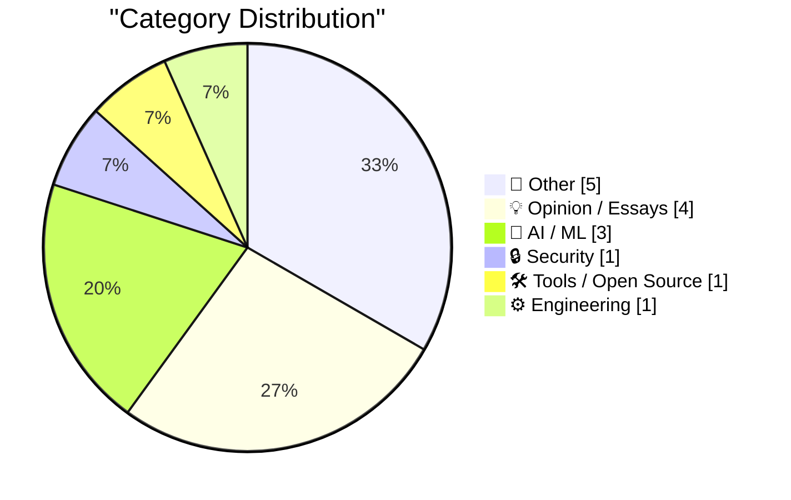
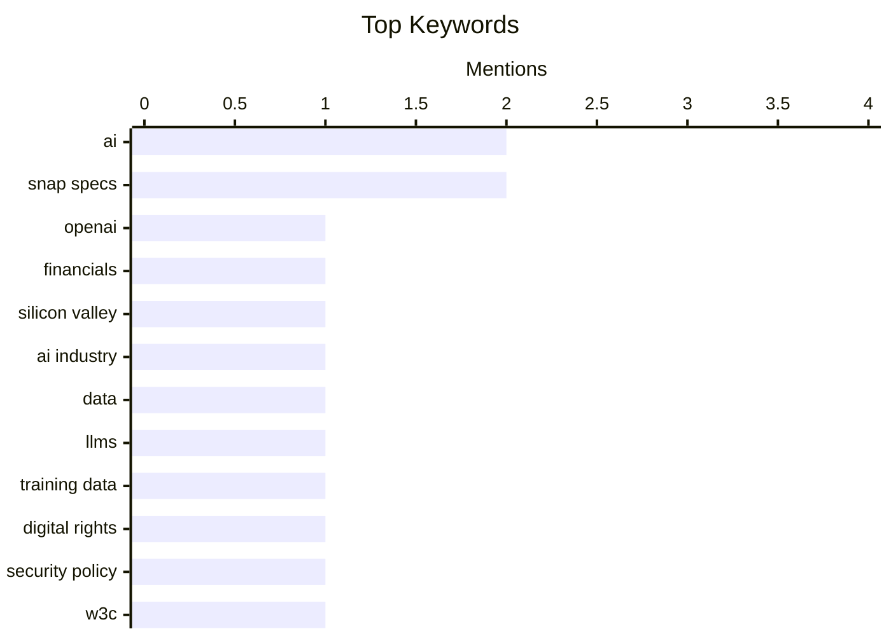

## Today's Highlights
Today's tech headlines reveal a dynamic AI sector grappling with both foundational data challenges and advanced architectural concepts, even as financial realities like OpenAI's performance spark "bubble" concerns. A broader theme of deception emerges, from a rebranded "Trump Mobile T1" phone to warnings about "The Big Con." Amidst these developments, industry consolidation continues with Fox's $25 billion acquisition of Roku.
---
## Must Read Today
1. **Premium: The Silicon Valley Bubble (Part 2)**
[Premium: The Silicon Valley Bubble (Part 2)](https://www.wheresyoured.at/premium-the-silicon-valley-bubble-part-2/) — wheresyoured.at · 20h ago · 💡 Opinion / Essays
> The article discusses the financial performance of OpenAI, highlighting a significant disparity between its expenditure and revenue. It reports that OpenAI spent $34 billion while generating only $13.07 billion in revenue in 2024 and 2025. This substantial loss raises questions about the sustainability and valuation of AI companies within the current Silicon Valley ecosystem. The core takeaway is that despite high valuations, some leading AI companies may be operating at considerable financial deficits.
💡 **Why read it**: It provides specific, audited financial figures for OpenAI, offering a critical perspective on the economic realities of a major AI company.
🏷️ OpenAI, Financials, Silicon Valley, AI Industry
2. **The data black hole at the center of AI**
[The data black hole at the center of AI](https://www.dwarkesh.com/p/the-sample-efficiency-black-hole) — dwarkesh.com · 21h ago · 🤖 AI / ML
> The article explores the critical and often overlooked role of data in the development and capabilities of modern AI systems. It metaphorically describes AI's reliance on an "unimaginably massive black hole of data" as the central force holding its capabilities together. This emphasizes that despite impressive AI outputs, their sample efficiency is extremely low, requiring vast quantities of data for training. The core problem is the immense data hunger of current AI models, which poses challenges for future scaling and resource management. The main conclusion is that the sheer volume of data required for AI training is a fundamental and limiting factor.
💡 **Why read it**: It offers a compelling metaphor and highlights a fundamental, often underestimated, technical challenge in AI development: the insatiable demand for data.
🏷️ AI, Data, LLMs, Training Data
3. **Pluralistic: The Big Con (19 Jun 2026)**
[Pluralistic: The Big Con (19 Jun 2026)](https://pluralistic.net/2026/06/19/too-big-to-fact-check/) — pluralistic.net · 17h ago · 🔒 Security
> This article is a collection of links and short commentary, with the overarching theme of "The Big Con" suggesting systemic issues of deception and lack of accountability. It touches on various topics including the futility of scaling flawed systems ("Making the pile of shit bigger won't increase the number of ponies underneath it"), issues with fact-checking, and examples of corporate or governmental malfeasance. Specific mentions include Meta publishing AI prompts, the gig economy astroturf, and W3C vs. security research. The core takeaway is a critical perspective on various societal and technological "cons" that often go unchecked due to power dynamics.
💡 **Why read it**: It provides a critical, multi-faceted commentary on contemporary issues, from tech ethics to corporate power, offering diverse perspectives on systemic problems.
🏷️ digital rights, security policy, W3C, tech ethics
---
## Data Overview
| Sources Scanned | Articles Fetched | Time Window | Selected |
|:---:|:---:|:---:|:---:|
| 87/92 | 2566 -> 18 | 24h | **15** |
### Category Distribution

### Top Keywords

<details>
<summary>Plain Text Keyword Chart (Terminal Friendly)</summary>
```
ai             │ ████████████████████ 2
snap specs     │ ████████████████████ 2
openai         │ ██████████░░░░░░░░░░ 1
financials     │ ██████████░░░░░░░░░░ 1
silicon valley │ ██████████░░░░░░░░░░ 1
ai industry    │ ██████████░░░░░░░░░░ 1
data           │ ██████████░░░░░░░░░░ 1
llms           │ ██████████░░░░░░░░░░ 1
training data  │ ██████████░░░░░░░░░░ 1
digital rights │ ██████████░░░░░░░░░░ 1
```
</details>
### Topic Tags
**ai**(2) · **snap specs**(2) · **openai**(1) · financials(1) · silicon valley(1) · ai industry(1) · data(1) · llms(1) · training data(1) · digital rights(1) · security policy(1) · w3c(1) · tech ethics(1) · ai agents(1) · authentication(1) · context window(1) · package management(1) · releases(1) · advisories(1) · weekly digest(1)
---
## Other
### 1. Fox to Buy Roku Streaming Service in $25 Billion Deal
[Fox to Buy Roku Streaming Service in $25 Billion Deal](https://www.wsj.com/business/deals/fox-roku-deal-f6e564f9?st=mKdQwC&amp;reflink=desktopwebshare_permalink) — **daringfireball.net** · 19h ago · ⭐ 22/30
> Fox Corp. announced its acquisition of Roku, a streaming service provider, in a deal valued at approximately $25 billion. This acquisition represents Fox’s largest deal to date, aiming to significantly expand its ad-supported streaming business. The deal combines Fox's live news and sports programming with Roku's position as the biggest provider of streaming platforms for connected TVs. It builds upon Fox's previous acquisition of Tubi for $400 million. The main conclusion is that Fox is making a substantial strategic bet on the future of ad-supported streaming by integrating Roku's platform and user base.
🏷️ Fox, Roku, acquisition, streaming
---
### 2. Trump Mobile T1 Phone Is a Gold-Painted Two-Year-Old HTC U24 Pro
[Trump Mobile T1 Phone Is a Gold-Painted Two-Year-Old HTC U24 Pro](https://www.nbcnews.com/tech/gadgets/trump-mobile-t1-phone-nearly-identical-htc-device-analysis-rcna349293) — **daringfireball.net** · 19h ago · ⭐ 19/30
> A technical analysis by iFixit, in partnership with NBC News, revealed that the "Trump Mobile T1" phone, marketed as "Made in the USA," is nearly identical to the two-year-old HTC U24 Pro. The HTC U24 Pro is manufactured by the Taiwanese company HTC using Chinese parts, directly contradicting the "Made in the USA" claim. The analysis involved a full teardown report by iFixit. The core finding is that the Trump T1 is a re-branded, older model foreign-made phone. The main conclusion is that the product's marketing claims regarding its origin are demonstrably false.
🏷️ Trump Phone, HTC, rebranding, iFixit
---
### 3. Reading List 06/20/26
[Reading List 06/20/26](https://www.construction-physics.com/p/reading-list-062026) — **construction-physics.com** · 1h ago · ⭐ 17/30
> This article presents a diverse reading list covering various topics relevant to construction and technology. It discusses a new housing bill, General Motors' entry into grid-scale battery solutions, and skepticism regarding reported data center construction delays. Other topics include advancements in solid-state air conditioning technology. The compilation offers a quick overview of current developments and discussions across several interconnected industries.
🏷️ Reading List, Data Centers, Construction, Energy
---
### 4. Snap Launches Ad Campaign for Specs Starring Michael Caine
[Snap Launches Ad Campaign for Specs Starring Michael Caine](https://www.reddit.com/r/funny/comments/1jk6onr/bloody_large_glasses_by_michael_caine/) — **daringfireball.net** · 21h ago · ⭐ 12/30
> This article discusses Snap's new advertising campaign for its Specs wearable device, featuring actor Michael Caine. The campaign aims to reframe the perception of the "giant glasses" as a symbol of power and style. The author reflects on the potential for these devices to be considered fashionable, despite their potentially unconventional design. This marketing strategy attempts to appeal to a broader audience by associating the product with a respected cultural icon.
🏷️ Snap Specs, advertising, marketing
---
### 5. Bobby Prince has died
[Bobby Prince has died](https://oldvcr.blogspot.com/feeds/8983624217005254252/comments/default) — **oldvcr.blogspot.com** · 12h ago · ⭐ 11/30
> This article announces the passing of Bobby Prince, a prominent musician known for his contributions to 1990s First-Person Shooter (FPS) games, at the age of 81. Prince's work on Wolfenstein 3D, particularly "The Ultimate Challenge," is noted for its genre-specific style. While his contributions to Duke Nukem 3D and Rise of the Triad were solid, the article suggests they were often overshadowed by the work of Lee Jackson, citing "Grabbag" as an example. The piece acknowledges his significant, though sometimes understated, impact on the soundscapes of classic FPS titles.
🏷️ Obituary, Game Music, FPS Games, Bobby Prince
---
## Opinion / Essays
### 6. Premium: The Silicon Valley Bubble (Part 2)
[Premium: The Silicon Valley Bubble (Part 2)](https://www.wheresyoured.at/premium-the-silicon-valley-bubble-part-2/) — **wheresyoured.at** · 20h ago · ⭐ 27/30
> The article discusses the financial performance of OpenAI, highlighting a significant disparity between its expenditure and revenue. It reports that OpenAI spent $34 billion while generating only $13.07 billion in revenue in 2024 and 2025. This substantial loss raises questions about the sustainability and valuation of AI companies within the current Silicon Valley ecosystem. The core takeaway is that despite high valuations, some leading AI companies may be operating at considerable financial deficits.
🏷️ OpenAI, Financials, Silicon Valley, AI Industry
---
### 7. Full Page Paralysis
[Full Page Paralysis](https://blog.jim-nielsen.com/2026/full-page-paralysis/) — **blog.jim-nielsen.com** · 19h ago · ⭐ 22/30
> The article discusses the common psychological barrier of "blank page paralysis" but argues that finishing a project is often harder than starting it. It draws parallels to "the last 90%" in software development and "the last mile" in logistics, emphasizing that the final stages are disproportionately challenging. The difficulty stems from the act of making something real and finite, which then becomes subject to judgment. The core problem is the inherent struggle to complete projects, particularly in creative and technical fields. The main takeaway is that overcoming the inertia of completion is a significant hurdle, often more so than initiating a task.
🏷️ Productivity, Project Management, Software Development, Finishing Projects
---
### 8. ‘What’s the Deal With Old Guys and Giant Glasses?’
[‘What’s the Deal With Old Guys and Giant Glasses?’](https://www.youtube.com/watch?v=8DYGxn6Xvt0) — **daringfireball.net** · 12h ago · ⭐ 13/30
> This article questions the conventional wisdom that early adoption of new technology is exclusively a young-person phenomenon. It specifically speculates whether Snap Specs, a new wearable technology, could challenge this notion. The author humorously suggests the possibility of direct sales of Snap Specs in retirement homes. This piece explores the potential for an unexpected demographic to become early adopters of emerging tech.
🏷️ Snap Specs, consumer tech, adoption
---
### 9. The Goldilocks Principle in Fantasy Strategy
[The Goldilocks Principle in Fantasy Strategy](https://www.filfre.net/2026/06/the-goldilocks-principle-in-fantasy-strategy/) — **filfre.net** · 22h ago · ⭐ 12/30
> This article introduces the "Goldilocks Principle" in the context of fantasy strategy games, using Heroes of Might and Magic II as a prime example. The author emphasizes the significant personal time invested in Heroes II, suggesting its design achieved a "just right" balance of complexity and accessibility. This principle implies that successful games strike an optimal equilibrium, avoiding being too simple or too complex. The piece reflects on the enduring appeal of games that master this delicate balance.
🏷️ Game Design, Strategy Games, Fantasy, Gaming
---
## AI / ML
### 10. The data black hole at the center of AI
[The data black hole at the center of AI](https://www.dwarkesh.com/p/the-sample-efficiency-black-hole) — **dwarkesh.com** · 21h ago · ⭐ 26/30
> The article explores the critical and often overlooked role of data in the development and capabilities of modern AI systems. It metaphorically describes AI's reliance on an "unimaginably massive black hole of data" as the central force holding its capabilities together. This emphasizes that despite impressive AI outputs, their sample efficiency is extremely low, requiring vast quantities of data for training. The core problem is the immense data hunger of current AI models, which poses challenges for future scaling and resource management. The main conclusion is that the sheer volume of data required for AI training is a fundamental and limiting factor.
🏷️ AI, Data, LLMs, Training Data
---
### 11. Quoting Sean Lynch
[Quoting Sean Lynch](https://simonwillison.net/2026/Jun/19/sean-lynch/#atom-everything) — **simonwillison.net** · 15h ago · ⭐ 24/30
> The article quotes Sean Lynch on the valuable capability of an "MCP" (Multi-Context Proxy) in AI systems. Lynch argues that MCP's primary benefit over traditional skills/CLI interfaces is its ability to isolate the authentication flow outside the agent’s context window, potentially removing it entirely from the harness. This design choice enhances security and simplifies agent development by abstracting sensitive authentication details. The idealized form of MCP is suggested to be solely an auth gateway for the API. The main conclusion is that decoupling authentication from the agent's context is a significant architectural win for AI systems.
🏷️ AI agents, authentication, context window
---
### 12. I know Kung-fu
[I know Kung-fu](https://idiallo.com/blog/i-know-kung-fu) — **idiallo.com** · 10h ago · ⭐ 19/30
> The article uses the "I know Kung-fu" scene from The Matrix to explore the concept of instant knowledge acquisition and its implications for learning. It questions the movie's simplified portrayal of knowledge as mere data upload, suggesting that real understanding and skill development are more complex than simply having information at one's fingertips. The core problem is the oversimplification of knowledge acquisition in popular culture, contrasting it with the nuanced process of true learning and skill mastery. The main takeaway is that while information access is crucial, genuine knowledge and capability require more than just passive reception.
🏷️ AI, learning, skill acquisition
---
## Security
### 13. Pluralistic: The Big Con (19 Jun 2026)
[Pluralistic: The Big Con (19 Jun 2026)](https://pluralistic.net/2026/06/19/too-big-to-fact-check/) — **pluralistic.net** · 17h ago · ⭐ 25/30
> This article is a collection of links and short commentary, with the overarching theme of "The Big Con" suggesting systemic issues of deception and lack of accountability. It touches on various topics including the futility of scaling flawed systems ("Making the pile of shit bigger won't increase the number of ponies underneath it"), issues with fact-checking, and examples of corporate or governmental malfeasance. Specific mentions include Meta publishing AI prompts, the gig economy astroturf, and W3C vs. security research. The core takeaway is a critical perspective on various societal and technological "cons" that often go unchecked due to power dynamics.
🏷️ digital rights, security policy, W3C, tech ethics
---
## Tools / Open Source
### 14. This Week in Package Management: 20 June 2026
[This Week in Package Management: 20 June 2026](https://nesbitt.io/2026/06/20/this-week-in-package-management.html) — **nesbitt.io** · 4h ago · ⭐ 23/30
> This article is a brief announcement for a regular series, "This Week in Package Management." It indicates that the series covers releases, advisories, and articles from across the package management world. The core topic is to provide updates and news relevant to software package management. No specific technical details or findings are present in this particular snippet, as it serves as an index or introduction. The main takeaway is that this resource aims to keep readers informed about developments in package management.
🏷️ Package Management, Releases, Advisories, Weekly Digest
---
## Engineering
### 15. Which Copyleft Licence is Suitable for an SVG?
[Which Copyleft Licence is Suitable for an SVG?](https://shkspr.mobi/blog/2026/06/which-copyleft-licence-is-suitable-for-an-svg/) — **shkspr.mobi** · 2h ago · ⭐ 21/30
> The article addresses the question of selecting an appropriate copyleft license for Scalable Vector Graphics (SVG) files, highlighting the format's advantages as an XML-based, resolution-independent image standard. It implicitly discusses the need to ensure that the chosen license effectively applies copyleft principles to a visual, code-like asset. The core problem is determining how to apply software-oriented copyleft licenses to a data format like SVG, which combines visual representation with XML structure. While the snippet doesn't provide a direct answer, it sets up the discussion for navigating licensing complexities for open-source graphics.
🏷️ SVG, Licensing, Copyleft, Open Source
---
*Generated at 2026-06-20 14:01 | Scanned 87 sources -> 2566 articles -> selected 15*
*Based on the [Hacker News Popularity Contest 2025](https://refactoringenglish.com/tools/hn-popularity/) RSS source list recommended by [Andrej Karpathy](https://x.com/karpathy)*
*Produced by Dongdianr AI. Follow the same-name WeChat public account for more AI practical tips 💡*
