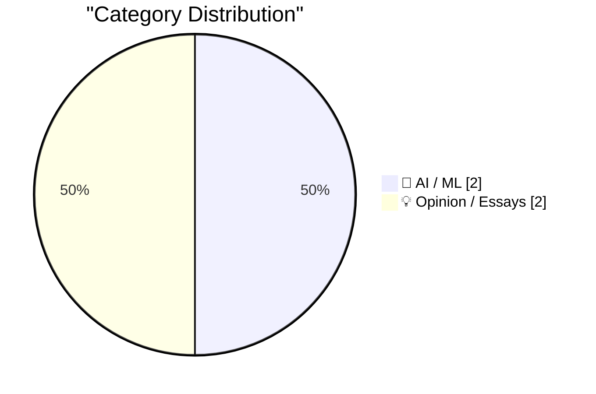
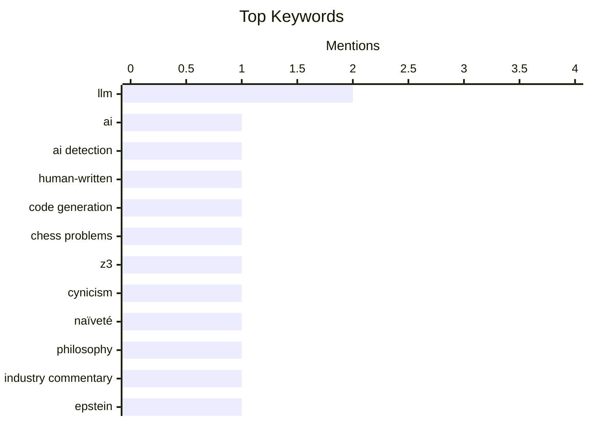

## Today's Highlights
Today's discussions reveal a dual focus on artificial intelligence and societal critique. On the AI front, Large Language Models are demonstrating new capabilities in code generation for complex tasks, even as debates continue regarding AI's fundamental reliability and explainability. Meanwhile, broader philosophical and societal commentaries delve into concepts like "vulgar materialism" and critical analyses of power structures, underscoring a holistic look at technology's impact.
---
## Must Read Today
1. **The 100,000 whys of AI**
[The 100,000 whys of AI](https://lcamtuf.substack.com/p/the-100000-whys-of-ai) — lcamtuf.substack.com · 8h ago · 🤖 AI / ML
> The article addresses the ongoing debate among tech professionals regarding the ability to reliably distinguish between human-written and AI-generated text. It highlights the inherent difficulty in consistently identifying AI-generated content, a challenge amplified by the rapid evolution of large language models. The discussion likely explores the limitations of current detection methodologies and the sophisticated mimicry capabilities of modern AI. Ultimately, the piece underscores that the ability to accurately differentiate AI from human text remains an unresolved and complex problem.
💡 **Why read it**: This article is worth reading for anyone interested in the practical and ethical challenges of AI text generation and its detection.
🏷️ AI, AI detection, LLM, Human-written
2. **All pieces on a 6 by 5 board**
[All pieces on a 6 by 5 board](https://www.johndcook.com/blog/2026/06/20/z3-python-claude/) — johndcook.com · 16h ago · 🤖 AI / ML
> This article explores using Large Language Models (LLMs) to generate code for solving specific chess-related combinatorial puzzles, specifically placing all standard chess pieces on a 6x5 board. The author leverages Claude to generate Z3/Python code, building upon previous experiments where Claude and ChatGPT generated Prolog code for similar chess problems. This approach tests the LLM's ability to translate problem descriptions into executable constraint satisfaction code using a specific solver (Z3) and language (Python). The post demonstrates the practical application of LLMs like Claude in generating specialized code for complex logical puzzles, showcasing their potential in automated problem-solving.
💡 **Why read it**: This article is worth reading for those interested in practical applications of LLMs for code generation, particularly for constraint satisfaction problems using tools like Z3 and Python.
🏷️ LLM, Code generation, Chess problems, Z3
3. **On Vulgar Materialism**
[On Vulgar Materialism](https://borretti.me/article/on-vulgar-materialism) — borretti.me · 14h ago · 💡 Opinion / Essays
> The article likely delves into the philosophical concept of "vulgar materialism," which often reduces complex phenomena to simplistic material or economic explanations. The subtitle, "sufficiently advanced cynicism is indistinguishable from naïveté," suggests an exploration of how extreme skepticism or a reductionist worldview can paradoxically lead to a lack of critical depth. It probably critiques the oversimplification inherent in such materialistic perspectives and their potential to overlook nuanced social, cultural, or psychological factors. The piece aims to challenge readers to reconsider the limitations of purely materialistic interpretations and the intellectual pitfalls of excessive cynicism.
💡 **Why read it**: This article is worth reading for those interested in philosophical critiques of reductionism and the nuanced interplay between cynicism, materialism, and intellectual depth.
🏷️ Cynicism, Naïveté, Philosophy, Industry commentary
---
## Data Overview
| Sources Scanned | Articles Fetched | Time Window | Selected |
|:---:|:---:|:---:|:---:|
| 87/92 | 2566 -> 4 | 24h | **4** |
### Category Distribution

### Top Keywords

<details>
<summary>Plain Text Keyword Chart (Terminal Friendly)</summary>
```
llm             │ ████████████████████ 2
ai              │ ██████████░░░░░░░░░░ 1
ai detection    │ ██████████░░░░░░░░░░ 1
human-written   │ ██████████░░░░░░░░░░ 1
code generation │ ██████████░░░░░░░░░░ 1
chess problems  │ ██████████░░░░░░░░░░ 1
z3              │ ██████████░░░░░░░░░░ 1
cynicism        │ ██████████░░░░░░░░░░ 1
naïveté         │ ██████████░░░░░░░░░░ 1
philosophy      │ ██████████░░░░░░░░░░ 1
```
</details>
### Topic Tags
**llm**(2) · **ai**(1) · **ai detection**(1) · human-written(1) · code generation(1) · chess problems(1) · z3(1) · cynicism(1) · naïveté(1) · philosophy(1) · industry commentary(1) · epstein(1) · rfid(1) · dweb(1) · digest(1)
---
## AI / ML
### 1. The 100,000 whys of AI
[The 100,000 whys of AI](https://lcamtuf.substack.com/p/the-100000-whys-of-ai) — **lcamtuf.substack.com** · 8h ago · ⭐ 26/30
> The article addresses the ongoing debate among tech professionals regarding the ability to reliably distinguish between human-written and AI-generated text. It highlights the inherent difficulty in consistently identifying AI-generated content, a challenge amplified by the rapid evolution of large language models. The discussion likely explores the limitations of current detection methodologies and the sophisticated mimicry capabilities of modern AI. Ultimately, the piece underscores that the ability to accurately differentiate AI from human text remains an unresolved and complex problem.
🏷️ AI, AI detection, LLM, Human-written
---
### 2. All pieces on a 6 by 5 board
[All pieces on a 6 by 5 board](https://www.johndcook.com/blog/2026/06/20/z3-python-claude/) — **johndcook.com** · 16h ago · ⭐ 26/30
> This article explores using Large Language Models (LLMs) to generate code for solving specific chess-related combinatorial puzzles, specifically placing all standard chess pieces on a 6x5 board. The author leverages Claude to generate Z3/Python code, building upon previous experiments where Claude and ChatGPT generated Prolog code for similar chess problems. This approach tests the LLM's ability to translate problem descriptions into executable constraint satisfaction code using a specific solver (Z3) and language (Python). The post demonstrates the practical application of LLMs like Claude in generating specialized code for complex logical puzzles, showcasing their potential in automated problem-solving.
🏷️ LLM, Code generation, Chess problems, Z3
---
## Opinion / Essays
### 3. On Vulgar Materialism
[On Vulgar Materialism](https://borretti.me/article/on-vulgar-materialism) — **borretti.me** · 14h ago · ⭐ 18/30
> The article likely delves into the philosophical concept of "vulgar materialism," which often reduces complex phenomena to simplistic material or economic explanations. The subtitle, "sufficiently advanced cynicism is indistinguishable from naïveté," suggests an exploration of how extreme skepticism or a reductionist worldview can paradoxically lead to a lack of critical depth. It probably critiques the oversimplification inherent in such materialistic perspectives and their potential to overlook nuanced social, cultural, or psychological factors. The piece aims to challenge readers to reconsider the limitations of purely materialistic interpretations and the intellectual pitfalls of excessive cynicism.
🏷️ Cynicism, Naïveté, Philosophy, Industry commentary
---
### 4. Pluralistic: How the Epstein Class recruits (20 Jun 2026)
[Pluralistic: How the Epstein Class recruits (20 Jun 2026)](https://pluralistic.net/2026/06/20/any-club-that-would-have-me/) — **pluralistic.net** · 21h ago · ⭐ 16/30
> This article, part of Cory Doctorow's "Pluralistic" series, appears to be a link aggregation post, with a primary focus on "How the Epstein Class recruits." Beyond the main topic, the post also curates a diverse set of links covering issues like the MPAA's criticism in the WSJ, RFID skimmers, post-Soviet inventions, and the "Dweb v founders' frailty." It touches on various societal and technological concerns, reflecting a broad critical perspective. The article serves as a curated collection of current events and critical analyses, highlighting various issues from power structures to technological vulnerabilities and historical insights.
🏷️ Epstein, RFID, Dweb, Digest
---
*Generated at 2026-06-21 14:01 | Scanned 87 sources -> 2566 articles -> selected 4*
*Based on the [Hacker News Popularity Contest 2025](https://refactoringenglish.com/tools/hn-popularity/) RSS source list recommended by [Andrej Karpathy](https://x.com/karpathy)*
*Produced by Dongdianr AI. Follow the same-name WeChat public account for more AI practical tips 💡*
