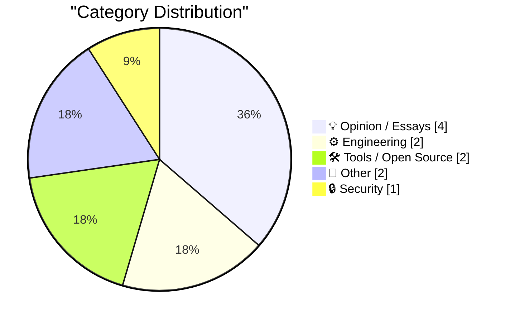
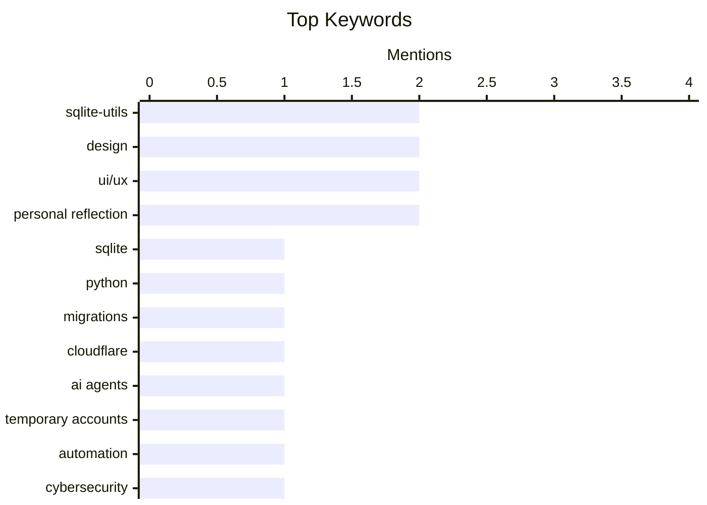

## Today's Highlights
Today's tech landscape emphasizes robust developer tooling, with new SQLite features, temporary Cloudflare accounts for AI agents, and advanced video infrastructure simplifying complex tasks. Meanwhile, design discussions challenge superficial consistency, highlighting evolving macOS app icons and advocating for excellence over mere appearance. Rounding out the news, critical advice on cybersecurity for travelers and personal awareness underscores the ongoing need for digital and personal protection.
---
## Must Read Today
1. **sqlite-utils 4.0rc1 adds migrations and nested transactions**
[sqlite-utils 4.0rc1 adds migrations and nested transactions](https://simonwillison.net/2026/Jun/21/sqlite-utils-40rc1/#atom-everything) — simonwillison.net · 14h ago · ⚙️ Engineering
> The article announces `sqlite-utils 4.0rc1`, a Python library and CLI tool for SQLite, introducing significant new features for database management. This version adds robust support for database migrations, allowing users to define and apply schema changes through Python functions using `sqlite-utils migrate`. It also introduces nested transactions, enabling multiple operations to be grouped and individually committed or rolled back without affecting the overarching transaction. Furthermore, `sqlite-utils` now directly supports `sqlite3.Connection` objects, enhancing integration with existing Python SQLite workflows. These updates significantly improve `sqlite-utils`'s capabilities for managing complex SQLite database schemas and ensuring data integrity through robust transaction control.
💡 **Why read it**: It's worth reading for developers working with SQLite in Python, as it details powerful new features like migrations and nested transactions that simplify database management and enhance data integrity.
🏷️ SQLite, Python, migrations, sqlite-utils
2. **Temporary Cloudflare Accounts for AI agents**
[Temporary Cloudflare Accounts for AI agents](https://simonwillison.net/2026/Jun/21/temporary-cloudflare-accounts/#atom-everything) — simonwillison.net · 16h ago · 🛠 Tools / Open Source
> Cloudflare has introduced "Temporary Cloudflare Accounts," a new feature allowing users to deploy Cloudflare Workers projects without requiring a full Cloudflare account. This functionality enables developers to quickly test and deploy Workers using the `npx wrangler deploy --temporary` command, which creates a temporary account valid for 24 hours. While marketed for AI agents, the author notes its broader utility for rapid prototyping and experimentation across various use cases. The temporary account provides a unique URL for the deployed Worker, simplifying initial development and sharing. This feature significantly lowers the barrier to entry for using Cloudflare Workers, making it easier for developers to experiment and deploy serverless functions without commitment.
💡 **Why read it**: It's worth reading for developers interested in serverless functions or Cloudflare Workers, as it highlights a new, frictionless way to deploy and test projects without account creation.
🏷️ Cloudflare, AI agents, temporary accounts, automation
3. **Cybersecurity for the paranoid business traveller**
[Cybersecurity for the paranoid business traveller](https://shkspr.mobi/blog/2026/06/cybersecurity-for-the-paranoid-business-traveller/) — shkspr.mobi · 2h ago · 🔒 Security
> This article provides comprehensive cybersecurity advice tailored for business travelers, acknowledging the heightened risk of espionage, blackmail, and state-sponsored attacks they face. The author compiles various security recommendations, including using a "burner" phone and laptop with minimal personal data and avoiding public Wi-Fi networks. It emphasizes the importance of assuming compromise and taking proactive steps like encrypting all communications, using VPNs, and strong, unique passwords. The advice also covers pre-travel preparations like backing up data and post-travel actions such as wiping devices. Business travelers should adopt a highly cautious and proactive approach to cybersecurity, treating all devices and networks as potentially compromised to protect sensitive information.
💡 **Why read it**: It's worth reading for anyone who travels for business, offering practical and comprehensive cybersecurity measures to protect against sophisticated threats.
🏷️ Cybersecurity, business travel, espionage, privacy
---
## Data Overview
| Sources Scanned | Articles Fetched | Time Window | Selected |
|:---:|:---:|:---:|:---:|
| 87/92 | 2566 -> 11 | 24h | **11** |
### Category Distribution

### Top Keywords

<details>
<summary>Plain Text Keyword Chart (Terminal Friendly)</summary>
```
sqlite-utils        │ ████████████████████ 2
design              │ ████████████████████ 2
ui/ux               │ ████████████████████ 2
personal reflection │ ████████████████████ 2
sqlite              │ ██████████░░░░░░░░░░ 1
python              │ ██████████░░░░░░░░░░ 1
migrations          │ ██████████░░░░░░░░░░ 1
cloudflare          │ ██████████░░░░░░░░░░ 1
ai agents           │ ██████████░░░░░░░░░░ 1
temporary accounts  │ ██████████░░░░░░░░░░ 1
```
</details>
### Topic Tags
**sqlite-utils**(2) · **design**(2) · **ui/ux**(2) · personal reflection(2) · sqlite(1) · python(1) · migrations(1) · cloudflare(1) · ai agents(1) · temporary accounts(1) · automation(1) · cybersecurity(1) · business travel(1) · espionage(1) · privacy(1) · consistency(1) · product design(1) · macos(1) · app icons(1) · mux(1)
---
## Opinion / Essays
### 1. Consistency, But in Excellence Not Appearance
[Consistency, But in Excellence Not Appearance](https://blog.jim-nielsen.com/2026/a-consistency-of-excellence/) — **blog.jim-nielsen.com** · -299m ago · ⭐ 20/30
> The article critiques the modern trend in visual design, particularly in software interfaces, where consistency in appearance has become prioritized over consistency in excellence or user experience. Using macOS icon evolutions as an example, referencing BasicAppleGuy's comparison, the author argues that an overemphasis on visual uniformity can lead to blandness and a loss of character. The piece suggests that true consistency should lie in the quality and thoughtfulness of design, rather than a rigid adherence to a single aesthetic style. It implies that design should evolve naturally, allowing for individual expression within a high standard of quality. Designers should strive for consistency in the excellence and utility of their work, rather than a superficial, uniform appearance that can stifle creativity and diminish user delight.
🏷️ Design, consistency, UI/UX, product design
---
### 2. Before and After: MacOS 27 Golden Gate Beta 1’s App Icons
[Before and After: MacOS 27 Golden Gate Beta 1’s App Icons](https://basicappleguy.com/basicappleblog/macos-golden-gate-icon-comparison) — **daringfireball.net** · 15h ago · ⭐ 17/30
> This article discusses the updated app icon design introduced in macOS 27 Golden Gate Beta 1, highlighting the visual changes and their impact. Basic Apple Guy observed that the new icons feature bolder colors and significant adjustments to several individual icons. There is a noticeable change in the refraction of the "Liquid Glass" effect, particularly in icons like Journal, along with an increased sharpness. The article notes a flattening of the Liquid Glass effect, contributing to a distinct new aesthetic. macOS 27 Golden Gate Beta 1 brings a significant visual refresh to app icons, characterized by bolder colors, increased sharpness, and a refined "Liquid Glass" effect, signaling an evolution in Apple's design language.
🏷️ macOS, app icons, design, UI/UX
---
### 3. Everything you say CAN and WILL be used against you
[Everything you say CAN and WILL be used against you](https://idiallo.com/blog/the-right-to-remain-silent) — **idiallo.com** · 7h ago · ⭐ 11/30
> The article emphasizes the critical importance of exercising the right to remain silent when interacting with law enforcement, despite the common tendency to speak. The author highlights that Miranda rights are designed to inform individuals of their right to silence, yet many people, influenced by media like police bodycam videos, still choose to talk, often to their detriment. The core message is that any statement made, even seemingly innocuous ones, can be misinterpreted or used to build a case against an individual. The article implicitly advocates for legal counsel before engaging in any conversation with authorities. It is always in one's best interest to remain silent and request a lawyer when questioned by law enforcement, as anything said can be used against them.
🏷️ Miranda rights, legal, communication, personal reflection
---
### 4. Happy Father's Day.
[Happy Father's Day.](https://idiallo.com/byte-size/happy-fathers-day-2026) — **idiallo.com** · 11h ago · ⭐ 10/30
> The author reflects on the personal journey of fatherhood, questioning when one truly becomes the "leader" or "strong man" figure often associated with fathers, especially in comparison to their own fathers. As a father of twin boys, the author grapples with a "midlife crisis" feeling, unsure when he transitioned into the responsible family head. He contrasts his self-perception with his father, who seemed to embody leadership effortlessly, prompting introspection. The article suggests a contemplation of identity and the evolving definition of fatherhood, hinting that the role might be assumed gradually rather than through a single transformative moment. Fatherhood is a complex, evolving journey of self-discovery and responsibility, where the perception of becoming a "leader" may differ significantly from idealized notions or comparisons to previous generations.
🏷️ Fatherhood, family, personal reflection
---
## Engineering
### 5. sqlite-utils 4.0rc1 adds migrations and nested transactions
[sqlite-utils 4.0rc1 adds migrations and nested transactions](https://simonwillison.net/2026/Jun/21/sqlite-utils-40rc1/#atom-everything) — **simonwillison.net** · 14h ago · ⭐ 24/30
> The article announces `sqlite-utils 4.0rc1`, a Python library and CLI tool for SQLite, introducing significant new features for database management. This version adds robust support for database migrations, allowing users to define and apply schema changes through Python functions using `sqlite-utils migrate`. It also introduces nested transactions, enabling multiple operations to be grouped and individually committed or rolled back without affecting the overarching transaction. Furthermore, `sqlite-utils` now directly supports `sqlite3.Connection` objects, enhancing integration with existing Python SQLite workflows. These updates significantly improve `sqlite-utils`'s capabilities for managing complex SQLite database schemas and ensuring data integrity through robust transaction control.
🏷️ SQLite, Python, migrations, sqlite-utils
---
### 6. Queens on a prime order board
[Queens on a prime order board](https://www.johndcook.com/blog/2026/06/21/queens-prime/) — **johndcook.com** · 13h ago · ⭐ 16/30
> The article discusses a specific condition for solving the N-queens problem, focusing on cases where N is a prime number. The N-queens problem involves placing N queens on an N x N chessboard such that no two queens attack each other (i.e., no two queens share the same row, column, or diagonal). When N is a prime number greater than or equal to 5, a solution can be found by placing the queens along a line with a specific slope (e.g., 2, 3, 4). This specific condition simplifies the problem for prime N, offering a direct construction method rather than relying on general backtracking algorithms. For prime N ≥ 5, the N-queens problem can be solved by placing queens along a line of a specific slope, providing a more elegant solution than general approaches.
🏷️ N-queens problem, algorithms, prime numbers, chessboard
---
## Tools / Open Source
### 7. Temporary Cloudflare Accounts for AI agents
[Temporary Cloudflare Accounts for AI agents](https://simonwillison.net/2026/Jun/21/temporary-cloudflare-accounts/#atom-everything) — **simonwillison.net** · 16h ago · ⭐ 23/30
> Cloudflare has introduced "Temporary Cloudflare Accounts," a new feature allowing users to deploy Cloudflare Workers projects without requiring a full Cloudflare account. This functionality enables developers to quickly test and deploy Workers using the `npx wrangler deploy --temporary` command, which creates a temporary account valid for 24 hours. While marketed for AI agents, the author notes its broader utility for rapid prototyping and experimentation across various use cases. The temporary account provides a unique URL for the deployed Worker, simplifying initial development and sharing. This feature significantly lowers the barrier to entry for using Cloudflare Workers, making it easier for developers to experiment and deploy serverless functions without commitment.
🏷️ Cloudflare, AI agents, temporary accounts, automation
---
### 8. Mux — Video for Developers
[Mux — Video for Developers](https://www.mux.com/?utm_campaign=fireball&amp;utm_source=DF) — **daringfireball.net** · 16h ago · ⭐ 17/30
> Mux offers a video infrastructure platform designed to simplify video integration and intelligence for developers. The platform addresses the complexity of handling video data by providing tools that transform raw video files into "video intelligence." Its "Mux Robots" feature automates video workflows, allowing developers to configure processes once to automatically analyze new uploads. These automated processes can perform tasks like asking questions, summarizing content, or finding key moments within videos. This eliminates the need for manual asset webhooks or self-hosted glue code, significantly streamlining video processing. Mux provides a comprehensive, automated solution for developers to integrate, process, and extract intelligence from video content, significantly reducing development overhead.
🏷️ Mux, video API, developers, streaming
---
## Other
### 9. AMD Athlon: AMD’s game changing CPU from 1999
[AMD Athlon: AMD’s game changing CPU from 1999](https://dfarq.homeip.net/amd-athlon-amds-game-changing-cpu-from-1999/?utm_source=rss&#038;utm_medium=rss&#038;utm_campaign=amd-athlon-amds-game-changing-cpu-from-1999) — **dfarq.homeip.net** · 3h ago · ⭐ 8/30
> The article celebrates the AMD Athlon CPU, launched in 1999, as a pivotal product that significantly elevated AMD's competitive standing against Intel. Announced on June 23, 1999, and launched on August 9, 1999, the Athlon was the successor to AMD's K6 series. It marked a turning point by offering performance that not only matched but often surpassed Intel's contemporary offerings, particularly the Pentium III, at a competitive price. This performance advantage was largely due to its innovative K7 microarchitecture, which featured a faster front-side bus and a more efficient execution pipeline. The AMD Athlon was a "game-changing" CPU that established AMD as a serious competitor in the high-performance processor market, breaking Intel's dominance in 1999.
🏷️ AMD Athlon, CPU, Hardware history
---
### 10. sqlite-utils 4.0rc1
[sqlite-utils 4.0rc1](https://simonwillison.net/2026/Jun/21/sqlite-utils/#atom-everything) — **simonwillison.net** · 14h ago · ⭐ 7/30
> This article announces the release of `sqlite-utils 4.0rc1`, a release candidate for the `sqlite-utils` Python library. The core updates in this version include the addition of migrations, allowing for schema evolution, and support for nested transactions, enhancing data integrity and complex operations. These features aim to improve the robustness and flexibility of managing SQLite databases programmatically. Developers are encouraged to explore this release candidate and its new capabilities.
🏷️ sqlite-utils, release
---
## Security
### 11. Cybersecurity for the paranoid business traveller
[Cybersecurity for the paranoid business traveller](https://shkspr.mobi/blog/2026/06/cybersecurity-for-the-paranoid-business-traveller/) — **shkspr.mobi** · 2h ago · ⭐ 23/30
> This article provides comprehensive cybersecurity advice tailored for business travelers, acknowledging the heightened risk of espionage, blackmail, and state-sponsored attacks they face. The author compiles various security recommendations, including using a "burner" phone and laptop with minimal personal data and avoiding public Wi-Fi networks. It emphasizes the importance of assuming compromise and taking proactive steps like encrypting all communications, using VPNs, and strong, unique passwords. The advice also covers pre-travel preparations like backing up data and post-travel actions such as wiping devices. Business travelers should adopt a highly cautious and proactive approach to cybersecurity, treating all devices and networks as potentially compromised to protect sensitive information.
🏷️ Cybersecurity, business travel, espionage, privacy
---
*Generated at 2026-06-22 14:01 | Scanned 87 sources -> 2566 articles -> selected 11*
*Based on the [Hacker News Popularity Contest 2025](https://refactoringenglish.com/tools/hn-popularity/) RSS source list recommended by [Andrej Karpathy](https://x.com/karpathy)*
*Produced by Dongdianr AI. Follow the same-name WeChat public account for more AI practical tips 💡*
