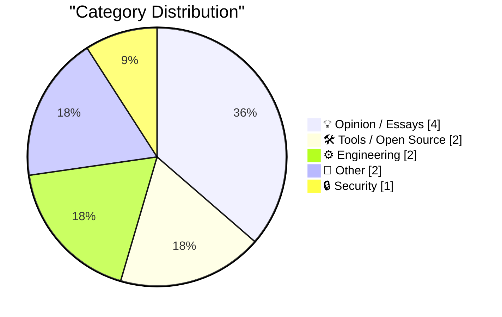
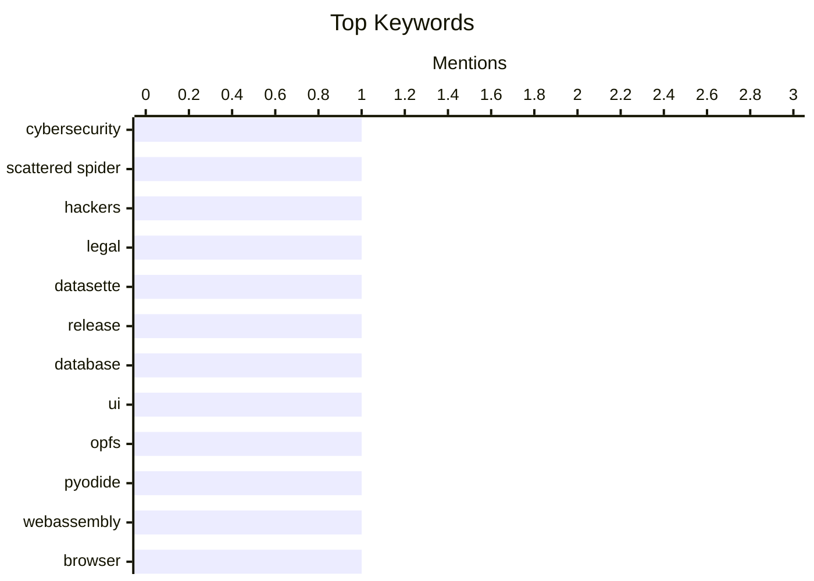

## Today's Highlights
Today's tech highlights feature a major win in cybersecurity as members of the prolific Scattered Spider hacking group plead guilty. Meanwhile, the development community is active with significant alpha updates for open-source tools like Datasette and practical engineering guides covering JWT authentication and universal regular expressions. Beyond the code, discussions range from reflections on WWDC 2026 to the value of simple blogging and personal insights into tech competence.
---
## Must Read Today
1. **Scattered Spider Hackers Plead Guilty on Day 1 of Trial**
[Scattered Spider Hackers Plead Guilty on Day 1 of Trial](https://krebsonsecurity.com/2026/06/scattered-spider-hackers-plead-guilty-on-day-1-of-trial/) — krebsonsecurity.com · 21h ago · 🔒 Security
> Two key members of the prolific cybercrime group Scattered Spider pleaded guilty to criminal charges in the UK. These charges stem from an August 2024 cyberattack that severely impacted Transport for London's public transport network. Their pleas occurred on the first day of what was anticipated to be a six-week trial. This development represents a significant legal victory against a prominent and disruptive cybercriminal organization.
💡 **Why read it**: It provides a timely update on the legal consequences for members of a significant cybercrime group responsible for critical infrastructure attacks.
🏷️ Cybersecurity, Scattered Spider, hackers, legal
2. **datasette 1.0a35**
[datasette 1.0a35](https://simonwillison.net/2026/Jun/23/datasette/#atom-everything) — simonwillison.net · 16h ago · 🛠 Tools / Open Source
> Datasette has released version 1.0a35, a significant alpha update for the open-source tool for exploring and publishing data. This release's highlights include a new "Create table" interface, accessible from the database actions menu. This new interface is powered by the `/<database>/-/create` JSON API, enabling users to define columns and primary keys directly. This enhancement significantly improves Datasette's capabilities for in-application database schema management.
💡 **Why read it**: It details a major alpha release for Datasette, introducing new database schema management features like a "Create table" interface.
🏷️ Datasette, release, database, UI
3. **OPFS + Pyodide test harness**
[OPFS + Pyodide test harness](https://simonwillison.net/2026/Jun/23/opfs-pyodide/#atom-everything) — simonwillison.net · 19h ago · 🛠 Tools / Open Source
> This article presents a test harness designed to explore the capability of Datasette Lite to edit persistent SQLite files directly within the browser. The approach leverages Pyodide, which runs the Python Datasette application in WebAssembly, in conjunction with the Origin Private File System (OPFS) API. OPFS offers web applications a private, persistent storage mechanism, enabling synchronous file system operations via `createSyncAccessHandle()`. This combination demonstrates a promising method for Datasette Lite to provide users with editable and persistent SQLite databases entirely client-side.
💡 **Why read it**: It showcases a novel technical solution for enabling persistent, editable SQLite databases in the browser using Pyodide and the OPFS API.
🏷️ OPFS, Pyodide, WebAssembly, browser
---
## Data Overview
| Sources Scanned | Articles Fetched | Time Window | Selected |
|:---:|:---:|:---:|:---:|
| 86/92 | 2544 -> 11 | 24h | **11** |
### Category Distribution

### Top Keywords

<details>
<summary>Plain Text Keyword Chart (Terminal Friendly)</summary>
```
cybersecurity    │ ████████████████████ 1
scattered spider │ ████████████████████ 1
hackers          │ ████████████████████ 1
legal            │ ████████████████████ 1
datasette        │ ████████████████████ 1
release          │ ████████████████████ 1
database         │ ████████████████████ 1
ui               │ ████████████████████ 1
opfs             │ ████████████████████ 1
pyodide          │ ████████████████████ 1
```
</details>
### Topic Tags
**cybersecurity**(1) · **scattered spider**(1) · **hackers**(1) · legal(1) · datasette(1) · release(1) · database(1) · ui(1) · opfs(1) · pyodide(1) · webassembly(1) · browser(1) · auth0(1) · jwt(1) · authentication(1) · php(1) · wwdc(1) · apple(1) · podcast(1) · tech commentary(1)
---
## Opinion / Essays
### 1. The Talk Show: ‘Perp Walk for Selfies’
[The Talk Show: ‘Perp Walk for Selfies’](https://daringfireball.net/thetalkshow/2026/06/23/ep-450) — **daringfireball.net** · 21h ago · ⭐ 21/30
> This episode of The Talk Show features Jason Snell, who joins to review WWDC 2026 and discuss future projects. The conversation provides a retrospective analysis of Apple's recent developer conference. Additionally, Snell previews "Designed in California," his and Myke Hurley’s upcoming 50-episode podcast dedicated to Apple's history. The episode serves as both a recap of recent Apple news and an announcement for a substantial historical audio series.
🏷️ WWDC, Apple, podcast, tech commentary
---
### 2. Blogging Can Just Be Stating The Obvious
[Blogging Can Just Be Stating The Obvious](https://blog.jim-nielsen.com/2026/blogging-stating-the-obvious/) — **blog.jim-nielsen.com** · -299m ago · ⭐ 18/30
> This article posits that blogging can be valuable even when simply stating the obvious, rather than always requiring novel insights. It references John Gruber's critique of pervasive, user-hostile website popups, where Gruber emphasizes the fundamental expectation to "see the website" upon visiting. This example underscores how articulating widely shared but often unstated frustrations or common sense can be highly impactful. The core message encourages content creators to share straightforward observations, as they can resonate strongly and validate common experiences.
🏷️ Blogging, web design, opinion, UX
---
### 3. Weekly Update 509
[Weekly Update 509](https://www.troyhunt.com/weekly-update-509/) — **troyhunt.com** · 8h ago · ⭐ 13/30
> This weekly update reflects on the author's "conscious incompetence" concerning home cinema audiovisual systems. The author defines conscious incompetence as knowing there's a lot one doesn't know, contrasting it with unconscious incompetence where one is unaware of their knowledge gaps. This self-assessment highlights the complexity of home cinema AV and the continuous learning required. The article offers a brief, introspective take on the nature of expertise and learning.
🏷️ Weekly update, personal, reflection, blog
---
### 4. Cargo Culture
[Cargo Culture](https://www.wheresyoured.at/cargo-culture/) — **wheresyoured.at** · 22h ago · ⭐ 12/30
> This article serves as a promotional piece for a premium newsletter titled "Cargo Culture." The subscription costs $70 annually or $7 monthly, offering weekly issues that are typically between 5,000 and 18,000 words long. Subscribers are promised extensive, detailed analyses of prominent tech companies, specifically mentioning NVIDIA and Anthropic. This content aims to provide in-depth insights into key industry players for its paying audience.
🏷️ Newsletter, NVIDIA, Anthropic, tech analysis
---
## Tools / Open Source
### 5. datasette 1.0a35
[datasette 1.0a35](https://simonwillison.net/2026/Jun/23/datasette/#atom-everything) — **simonwillison.net** · 16h ago · ⭐ 24/30
> Datasette has released version 1.0a35, a significant alpha update for the open-source tool for exploring and publishing data. This release's highlights include a new "Create table" interface, accessible from the database actions menu. This new interface is powered by the `/<database>/-/create` JSON API, enabling users to define columns and primary keys directly. This enhancement significantly improves Datasette's capabilities for in-application database schema management.
🏷️ Datasette, release, database, UI
---
### 6. OPFS + Pyodide test harness
[OPFS + Pyodide test harness](https://simonwillison.net/2026/Jun/23/opfs-pyodide/#atom-everything) — **simonwillison.net** · 19h ago · ⭐ 23/30
> This article presents a test harness designed to explore the capability of Datasette Lite to edit persistent SQLite files directly within the browser. The approach leverages Pyodide, which runs the Python Datasette application in WebAssembly, in conjunction with the Origin Private File System (OPFS) API. OPFS offers web applications a private, persistent storage mechanism, enabling synchronous file system operations via `createSyncAccessHandle()`. This combination demonstrates a promising method for Datasette Lite to provide users with editable and persistent SQLite databases entirely client-side.
🏷️ OPFS, Pyodide, WebAssembly, browser
---
## Engineering
### 7. Auth0 PHP - manually authenticating JWT idTokens
[Auth0 PHP - manually authenticating JWT idTokens](https://shkspr.mobi/blog/2026/06/auth0-php-manually-authenticating-tokens/) — **shkspr.mobi** · 2h ago · ⭐ 23/30
> This article provides a guide for manually authenticating Auth0 JWT `idTokens` in PHP, addressing a perceived gap in official documentation. It explains that after user authentication, only the `idToken` is required for validation, not the `accessToken`. The process involves steps to decode and verify the structure and signature of the JWT. This practical walkthrough offers a direct solution for developers needing to implement robust, manual Auth0 `idToken` authentication within their PHP applications.
🏷️ Auth0, JWT, authentication, PHP
---
### 8. Regular expressions that work “everywhere”
[Regular expressions that work “everywhere”](https://www.johndcook.com/blog/2026/06/23/regex-everywhere/) — **johndcook.com** · 13h ago · ⭐ 21/30
> The article discusses the common frustration stemming from the inconsistent implementations and varying feature support of regular expressions across different tools and programming languages. The author notes that learning regex in a "maximalist" environment like Perl often leads to disappointment when expected features are absent or syntactically different elsewhere. This variability necessitates careful consideration when writing regular expressions intended for broad compatibility. The core takeaway is the need to be aware of tool-specific regex dialects to avoid portability issues.
🏷️ Regular expressions, regex, portability, programming
---
## Other
### 9. Windows 98 shipped June 25, 1998
[Windows 98 shipped June 25, 1998](https://dfarq.homeip.net/windows-98-shipped-june-25-1998/?utm_source=rss&#038;utm_medium=rss&#038;utm_campaign=windows-98-shipped-june-25-1998) — **dfarq.homeip.net** · 3h ago · ⭐ 9/30
> This article commemorates the 25th anniversary of Microsoft's Windows 98, which shipped on June 25, 1998. Despite its delayed release and significant hype, the operating system is highlighted as a notable improvement over Windows 95. It offered enhancements that, while not as celebrated as Windows 95's launch, provided a better user experience. The piece serves as a nostalgic reflection on a key milestone in Microsoft's operating system development.
🏷️ Windows 98, history, operating system
---
### 10. The most wonderful thing that happened to Tommy McHugh
[The most wonderful thing that happened to Tommy McHugh](https://www.experimental-history.com/p/the-most-wonderful-thing-that-happened) — **experimental-history.com** · 22h ago · ⭐ 3/30
> The article explores the extraordinary case of Tommy McHugh, a former builder who developed profound artistic and poetic talents following two strokes, illustrating the rare phenomenon of acquired savant syndrome. After his first stroke in 2001, which affected his frontal and temporal lobes, McHugh experienced an overwhelming compulsion to draw and write, producing thousands of works. A second stroke in 2003 further intensified these abilities. Neurologists hypothesize that the strokes disinhibited parts of his brain, potentially by damaging areas responsible for critical self-censorship or by rerouting neural pathways, thereby unlocking latent creative capacities. McHugh's transformation provides compelling evidence for the brain's remarkable plasticity and the potential for creativity to emerge unexpectedly from neurological injury.
🏷️ personal story, human interest, medical event
---
## Security
### 11. Scattered Spider Hackers Plead Guilty on Day 1 of Trial
[Scattered Spider Hackers Plead Guilty on Day 1 of Trial](https://krebsonsecurity.com/2026/06/scattered-spider-hackers-plead-guilty-on-day-1-of-trial/) — **krebsonsecurity.com** · 21h ago · ⭐ 28/30
> Two key members of the prolific cybercrime group Scattered Spider pleaded guilty to criminal charges in the UK. These charges stem from an August 2024 cyberattack that severely impacted Transport for London's public transport network. Their pleas occurred on the first day of what was anticipated to be a six-week trial. This development represents a significant legal victory against a prominent and disruptive cybercriminal organization.
🏷️ Cybersecurity, Scattered Spider, hackers, legal
---
*Generated at 2026-06-24 14:01 | Scanned 86 sources -> 2544 articles -> selected 11*
*Based on the [Hacker News Popularity Contest 2025](https://refactoringenglish.com/tools/hn-popularity/) RSS source list recommended by [Andrej Karpathy](https://x.com/karpathy)*
*Produced by Dongdianr AI. Follow the same-name WeChat public account for more AI practical tips 💡*
