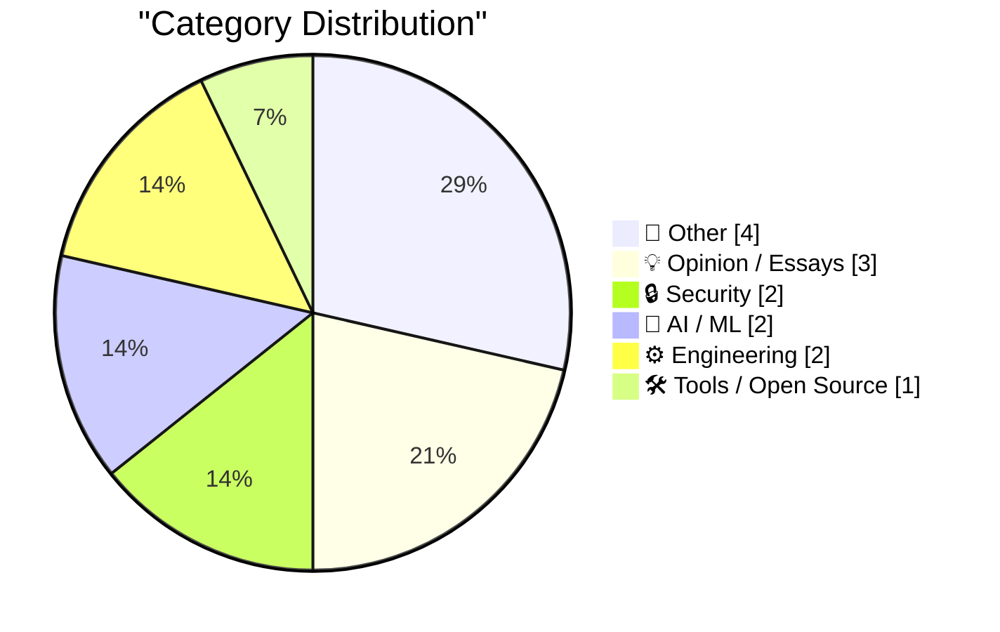
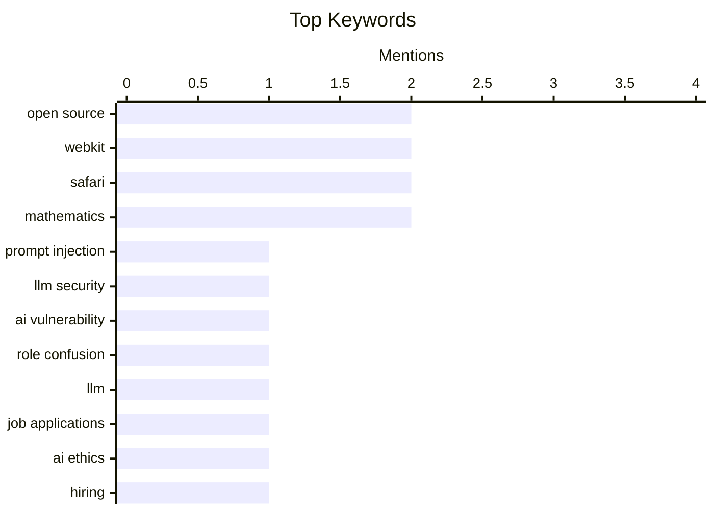

## Today's Highlights
Today's tech highlights underscore the rapid expansion of AI, bringing both innovation and complex challenges. Discussions are emerging around prompt injection vulnerabilities, the critical need for authentication standards for AI agents, and the pervasive nature of LLM-generated content. Simultaneously, the web platform continues its refinement, marked by significant quality improvements in WebKit for Safari 27 Beta and new tools for better browser compatibility. Efforts to bolster open-source security are also underway with innovative scanning solutions designed to protect projects without overwhelming maintainers.
---
## Must Read Today
1. **Thoughts on Role Confusion**
[Thoughts on Role Confusion](https://www.gilesthomas.com/2026/06/role-confusion) — gilesthomas.com · 17h ago · 🔒 Security
> This article discusses "Prompt Injection as Role Confusion," a concept from a paper by Charles Ye, Jasmine Cui, and Dylan Hadfield-Menell. It highlights that LLMs often disregard explicit 'role' tags like `<system>`, `<user>`, or `<think>`, instead interpreting roles based on the tone of the prompt. This suggests LLMs prioritize stylistic cues over explicit structural markers for role assignment. The core finding is that LLMs' understanding of roles is more nuanced and less reliant on explicit tags than previously assumed, making prompt injection a complex challenge. The main takeaway is that effective prompt engineering requires understanding these subtle interpretive behaviors of LLMs.
💡 **Why read it**: It offers a novel perspective on LLM prompt injection by framing it as "role confusion," explaining why explicit role tags are often ineffective.
🏷️ prompt injection, LLM security, AI vulnerability, role confusion
2. **Quoting Tom MacWright**
[Quoting Tom MacWright](https://simonwillison.net/2026/Jun/24/tom-macwright/#atom-everything) — simonwillison.net · 19h ago · 🤖 AI / ML
> This article quotes Tom MacWright, who expresses concern over the increasing prevalence of LLM-generated content in job applications. He observes applications, portfolio sites, GitHub projects, and even commit messages that are entirely AI-generated. MacWright's main reaction is a profound lack of understanding about the actual individuals behind these applications, as their true selves and authentic voices are absent. He argues that this trend prevents genuine connection and insight into candidates' abilities and personalities. The core takeaway is that AI-generated content in professional contexts erodes authenticity and makes it difficult to assess real human contributions.
💡 **Why read it**: It raises a critical contemporary issue regarding the impact of LLM-generated content on professional authenticity and candidate evaluation in hiring.
🏷️ LLM, job applications, AI ethics, hiring
3. **[Sponsor] WorkOS: Agents Need Auth. There’s Now a Spec for It.**
[[Sponsor] WorkOS: Agents Need Auth. There’s Now a Spec for It.](http://workos.com/auth-md?utm_source=daringfireball&amp;utm_medium=newsletter&amp;utm_campaign=q32026) — daringfireball.net · 19h ago · 🤖 AI / ML
> The article addresses the problem of AI agents encountering sign-up forms when needing new accounts, as there's no standard for agent-initiated user registration. WorkOS introduces `auth.md`, a specification similar to `robots.txt`, which developers host at their domain to inform agents about supported registration flows, exposed scopes, and credential issuance. This spec composes existing OAuth standards to provide a structured way for agents to register users on behalf of an application. Cloudflare, Firecrawl, and Resend have already adopted this new standard. The initiative aims to standardize agent authentication, enabling seamless interaction between AI agents and web services.
💡 **Why read it**: It introduces `auth.md`, a new, practical specification for standardizing AI agent registration and authentication using existing OAuth standards.
🏷️ AI agents, authentication, auth.md, API design
---
## Data Overview
| Sources Scanned | Articles Fetched | Time Window | Selected |
|:---:|:---:|:---:|:---:|
| 86/92 | 2544 -> 14 | 24h | **14** |
### Category Distribution

### Top Keywords

<details>
<summary>Plain Text Keyword Chart (Terminal Friendly)</summary>
```
open source      │ ████████████████████ 2
webkit           │ ████████████████████ 2
safari           │ ████████████████████ 2
mathematics      │ ████████████████████ 2
prompt injection │ ██████████░░░░░░░░░░ 1
llm security     │ ██████████░░░░░░░░░░ 1
ai vulnerability │ ██████████░░░░░░░░░░ 1
role confusion   │ ██████████░░░░░░░░░░ 1
llm              │ ██████████░░░░░░░░░░ 1
job applications │ ██████████░░░░░░░░░░ 1
```
</details>
### Topic Tags
**open source**(2) · **webkit**(2) · **safari**(2) · mathematics(2) · prompt injection(1) · llm security(1) · ai vulnerability(1) · role confusion(1) · llm(1) · job applications(1) · ai ethics(1) · hiring(1) · ai agents(1) · authentication(1) · auth.md(1) · api design(1) · vulnerability scanning(1) · maintainers(1) · security(1) · browser updates(1)
---
## Other
### 1. Consecutive Pythagorean triangle sides
[Consecutive Pythagorean triangle sides](https://www.johndcook.com/blog/2026/06/25/consecutive-pythagorean/) — **johndcook.com** · 2h ago · ⭐ 18/30
> This post explores Pythagorean triples (a, b, c) where two sides are consecutive integers, specifically cases where `a + 1 = b` or `b + 1 = c`. It references a paper by George Osborne that addresses when the squares of two consecutive numbers can also form a square. The article aims to find all such triples, delving into the mathematical conditions required for these specific relationships between the sides of a right triangle. This involves number theory to derive the general forms of these consecutive-sided Pythagorean triples. The main takeaway is a detailed mathematical analysis of specific types of Pythagorean triples.
🏷️ Pythagorean triples, number theory, mathematics
---
### 2. The Star Trek lemma
[The Star Trek lemma](https://www.johndcook.com/blog/2026/06/24/star-trek-lemma/) — **johndcook.com** · 11h ago · ⭐ 15/30
> This article details the author's unexpected discovery of "The Star Trek Lemma" listed in the table of contents of a mathematics book by Arthur Baragar. The author, John D. Cook, found a footnote to Baragar's book, his former officemate, and then located the book on Archive.org. The surprise stemmed from encountering a pop culture reference, "The Star Trek Lemma," within a technical academic text. This unusual naming convention suggests a potentially interesting intersection of mathematics and popular culture. The article serves as an intriguing pointer to a concept that might appeal to both math enthusiasts and Star Trek fans.
🏷️ Star Trek, lemma, mathematics, geometry
---
### 3. Designed in California: An Apple History Podcast
[Designed in California: An Apple History Podcast](https://designed.fm/) — **daringfireball.net** · 22h ago · ⭐ 13/30
> This article promotes the Kickstarter campaign for "Designed in California," a new narrative podcast by Jason Snell and Myke Hurley dedicated to chronicling Apple's 50-year history. The ambitious project aims for a minimum of 50 episodes, with additional content unlocked via stretch goals. The campaign has already successfully surpassed its primary funding objective, demonstrating strong community interest. John Gruber, the author, enthusiastically endorses the podcast, having discussed it at length on his own show. He recommends it to listeners who enjoy podcasts like "The Talk Show" and "Upgrade," noting there's still a week left to contribute towards further stretch goals.
🏷️ Apple, podcast, history, Kickstarter
---
### 4. US Subways Build Too Many Cross Passages
[US Subways Build Too Many Cross Passages](https://www.construction-physics.com/p/us-subways-build-too-many-cross-passages) — **construction-physics.com** · 6m ago · ⭐ 13/30
> This article presents the core argument that US subway systems are currently building an excessive number of cross passages. The piece was specifically developed as part of IFP’s Transit Abundance Playbook, a larger collection comprising 15 distinct ideas designed to improve transit delivery throughout the United States. This particular point suggests a potential area of inefficiency or over-engineering in existing US subway construction methodologies. By reducing the number of these passages, there could be opportunities for significant cost savings and faster project completion. It highlights a specific design choice in transit infrastructure that warrants re-evaluation for optimization.
🏷️ subway, construction, urban planning, transit
---
## Opinion / Essays
### 5. Pluralistic: Jailbreaking isn't theft (25 Jun 2026)
[Pluralistic: Jailbreaking isn't theft (25 Jun 2026)](https://pluralistic.net/2026/06/25/thieve-different/) — **pluralistic.net** · 4h ago · ⭐ 20/30
> This article, from Cory Doctorow's Pluralistic blog, argues that "jailbreaking isn't theft," framing it as a user's right to control their purchased devices and software. It suggests that actions like jailbreaking or circumventing digital restrictions are not piracy but rather a reassertion of ownership against corporate control. The piece implies a broader critique of digital rights management (DRM) and vendor lock-in, advocating for user freedom over proprietary systems. The core message is that user modification of owned technology should not be legally equated with stealing. The main takeaway is a strong defense of user autonomy over digital products.
🏷️ Jailbreaking, digital rights, AI policy
---
### 6. VA Linux’s transformation after leaving the hardware business
[VA Linux’s transformation after leaving the hardware business](https://dfarq.homeip.net/va-linuxs-transformation-after-leaving-the-hardware-business/?utm_source=rss&#038;utm_medium=rss&#038;utm_campaign=va-linuxs-transformation-after-leaving-the-hardware-business) — **dfarq.homeip.net** · 3h ago · ⭐ 20/30
> This article recounts VA Linux's pivotal decision to exit the hardware business on June 26, 2001, in the aftermath of the dot-com bubble burst. Despite being a record-setting startup, the company made this "curious but probably right decision" to survive. The transformation involved shifting its focus away from hardware manufacturing to adapt to the changing market landscape. This strategic pivot allowed VA Linux to endure and evolve beyond its initial business model, demonstrating resilience in a volatile market. The main takeaway is the importance of adaptability and strategic reorientation for tech companies facing market downturns.
🏷️ VA Linux, dot-com bubble, business strategy, industry history
---
### 7. Blogging Can Just Be Stating The Obvious
[Blogging Can Just Be Stating The Obvious](https://blog.jim-nielsen.com/2026/blogging-stating-the-obvious/) — **blog.jim-nielsen.com** · 19h ago · ⭐ 16/30
> This article explores the often-overlooked value of blogging about seemingly "obvious" topics, referencing John Gruber's meta-commentary on blogging. Gruber's original piece critiques ubiquitous, user-hostile website popups, highlighting a common user experience problem. The author emphasizes Gruber's observation that what appears obvious to one person might be a revelation or a useful reinforcement for another. This perspective suggests that many widely accepted truths or common sense observations are not universally understood or articulated. Consequently, sharing even simple or self-evident thoughts can be a valuable contribution, helping others connect dots or gain new perspectives.
🏷️ blogging, web design, UX, popups
---
## Security
### 8. Thoughts on Role Confusion
[Thoughts on Role Confusion](https://www.gilesthomas.com/2026/06/role-confusion) — **gilesthomas.com** · 17h ago · ⭐ 27/30
> This article discusses "Prompt Injection as Role Confusion," a concept from a paper by Charles Ye, Jasmine Cui, and Dylan Hadfield-Menell. It highlights that LLMs often disregard explicit 'role' tags like `<system>`, `<user>`, or `<think>`, instead interpreting roles based on the tone of the prompt. This suggests LLMs prioritize stylistic cues over explicit structural markers for role assignment. The core finding is that LLMs' understanding of roles is more nuanced and less reliant on explicit tags than previously assumed, making prompt injection a complex challenge. The main takeaway is that effective prompt engineering requires understanding these subtle interpretive behaviors of LLMs.
🏷️ prompt injection, LLM security, AI vulnerability, role confusion
---
### 9. Scrutineer: scanning open source without flooding maintainers
[Scrutineer: scanning open source without flooding maintainers](https://nesbitt.io/2026/06/25/scrutineer.html) — **nesbitt.io** · 4h ago · ⭐ 26/30
> The article introduces Scrutineer, a tool designed to scan open-source projects for vulnerabilities without overwhelming maintainers with excessive reports. It acknowledges that finding vulnerabilities is "the easy part," but effectively communicating them without creating noise is challenging. Scrutineer aims to provide actionable insights while minimizing the burden on maintainers, likely by aggregating, prioritizing, or filtering findings. The tool focuses on improving the signal-to-noise ratio in vulnerability reporting for open-source software, ensuring maintainers receive relevant information without being flooded. The main takeaway is the importance of responsible and efficient vulnerability disclosure in the open-source ecosystem.
🏷️ open source, vulnerability scanning, maintainers, security
---
## AI / ML
### 10. Quoting Tom MacWright
[Quoting Tom MacWright](https://simonwillison.net/2026/Jun/24/tom-macwright/#atom-everything) — **simonwillison.net** · 19h ago · ⭐ 26/30
> This article quotes Tom MacWright, who expresses concern over the increasing prevalence of LLM-generated content in job applications. He observes applications, portfolio sites, GitHub projects, and even commit messages that are entirely AI-generated. MacWright's main reaction is a profound lack of understanding about the actual individuals behind these applications, as their true selves and authentic voices are absent. He argues that this trend prevents genuine connection and insight into candidates' abilities and personalities. The core takeaway is that AI-generated content in professional contexts erodes authenticity and makes it difficult to assess real human contributions.
🏷️ LLM, job applications, AI ethics, hiring
---
### 11. [Sponsor] WorkOS: Agents Need Auth. There’s Now a Spec for It.
[[Sponsor] WorkOS: Agents Need Auth. There’s Now a Spec for It.](http://workos.com/auth-md?utm_source=daringfireball&amp;utm_medium=newsletter&amp;utm_campaign=q32026) — **daringfireball.net** · 19h ago · ⭐ 26/30
> The article addresses the problem of AI agents encountering sign-up forms when needing new accounts, as there's no standard for agent-initiated user registration. WorkOS introduces `auth.md`, a specification similar to `robots.txt`, which developers host at their domain to inform agents about supported registration flows, exposed scopes, and credential issuance. This spec composes existing OAuth standards to provide a structured way for agents to register users on behalf of an application. Cloudflare, Firecrawl, and Resend have already adopted this new standard. The initiative aims to standardize agent authentication, enabling seamless interaction between AI agents and web services.
🏷️ AI agents, authentication, auth.md, API design
---
## Engineering
### 12. WebKit in Safari 27 Beta
[WebKit in Safari 27 Beta](https://webkit.org/blog/17967/news-from-wwdc26-webkit-in-safari-27-beta/) — **daringfireball.net** · 18h ago · ⭐ 25/30
> This article highlights the significant quality improvements in WebKit for Safari 27 Beta, announced during WWDC26. Safari 27 includes 58 brand-new features and an unprecedented 525 fixes, marking the largest pile of fixes in recent memory for a Safari release. The primary focus of this update was not on introducing new functionalities but on enhancing the correctness, edge case handling, and interoperability of existing features. This commitment to increasing quality ensures that WebKit features behave more reliably and as expected. The main takeaway is Apple's strong emphasis on refining existing WebKit capabilities for a more robust user experience.
🏷️ WebKit, Safari, browser updates, beta release
---
### 13. WebKit Always Enables the Copy Menu Item in Every App
[WebKit Always Enables the Copy Menu Item in Every App](https://lapcatsoftware.com/articles/2026/6/5.html) — **daringfireball.net** · 16h ago · ⭐ 18/30
> Jeff Johnson investigates and confirms a bug reported by John Gruber where the "Copy" menu item in macOS applications using WebKit remains enabled even when no text is selected. This issue affects not only Safari but also other apps like Mail that utilize WebKit as a public API on Apple platforms. The problem stems from WebKit's implementation, causing the menu item to incorrectly indicate availability for copying. This bug represents a minor but persistent UI inconsistency across WebKit-powered applications. The main takeaway is the identification of a specific WebKit bug causing a misleading UI state in macOS apps.
🏷️ WebKit, Safari, UI bug, macOS
---
## Tools / Open Source
### 14. simonw/browser-compat-db
[simonw/browser-compat-db](https://simonwillison.net/2026/Jun/24/browser-compat-db/#atom-everything) — **simonwillison.net** · 14h ago · ⭐ 23/30
> Simon Willison introduces `simonw/browser-compat-db`, a project inspired by Mozilla's new MDN MCP service and its `mdn/mcp` source code. This project converts the comprehensive `mdn/browser-compat-data` repository, which contains extensive browser compatibility information, into a SQLite database. The goal is to make this valuable compatibility data more easily queryable and accessible for developers. By transforming the data into a SQLite format, it simplifies programmatic access and integration into various tools and workflows. The main takeaway is the creation of a more developer-friendly format for browser compatibility data.
🏷️ browser compatibility, web development, open source, MDN
---
*Generated at 2026-06-25 14:01 | Scanned 86 sources -> 2544 articles -> selected 14*
*Based on the [Hacker News Popularity Contest 2025](https://refactoringenglish.com/tools/hn-popularity/) RSS source list recommended by [Andrej Karpathy](https://x.com/karpathy)*
*Produced by Dongdianr AI. Follow the same-name WeChat public account for more AI practical tips 💡*
