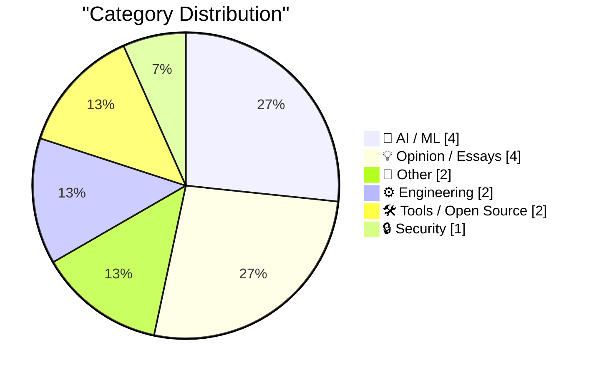
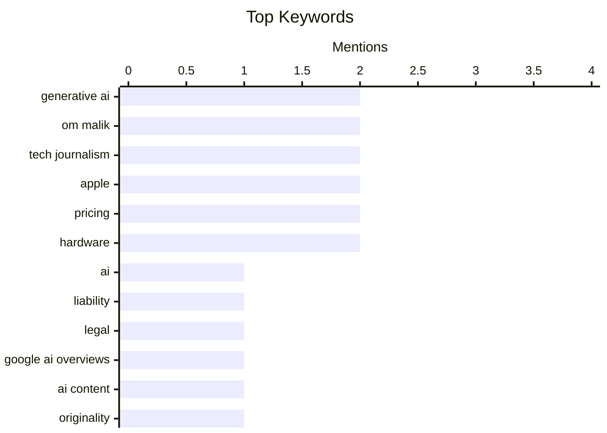

## Today's Highlights
Today's highlights reveal a nuanced picture of artificial intelligence, balancing its demonstrated profitability in inference with mounting concerns over liability, the quality of AI-generated content, and a potential "fizzle" in the broader generative AI hype. In other tech news, Apple has significantly raised prices on most products while also addressing critical software bugs. The community also pauses to remember industry figure Om Malik, who passed away recently.
---
## Must Read Today
1. **AI and Liability**
[AI and Liability](https://simonwillison.net/2026/Jun/25/ai-and-liability/#atom-everything) — simonwillison.net · 15h ago · 🤖 AI / ML
> This article addresses the critical issue of liability for errors generated by AI systems, prompted by a landmark German ruling holding Google responsible for false information in its AI Overviews. Bruce Schneier argues that AI agents should be treated as agents of their deployers, making the deploying organization liable for their actions and outputs. This perspective emphasizes that the entity deploying AI, not the AI itself, bears the legal responsibility for any inaccuracies or harmful content produced. The core takeaway is that existing legal frameworks for agency can be applied to AI, ensuring accountability for AI-generated errors.
💡 **Why read it**: It provides a timely and crucial perspective on the legal implications and accountability for AI-generated content, referencing a landmark German ruling.
🏷️ AI, Liability, Legal, Google AI Overviews
2. **AI children's books, body horror edition**
[AI children's books, body horror edition](https://lcamtuf.substack.com/p/ai-childrens-books-body-horror-edition) — lcamtuf.substack.com · 12h ago · 🤖 AI / ML
> This article highlights the disturbing and repetitive nature of AI-generated content, specifically focusing on children's books. The author demonstrates how AI often produces visually similar, uncanny, and sometimes grotesque images, particularly when attempting to depict human or animal figures. This 'body horror' aspect arises from AI's inability to consistently generate anatomically correct or unique features, leading to unsettling uniformity and distortions. The main conclusion is that despite advancements, AI-generated visuals can still lack originality and produce unsettling artifacts, especially in creative domains like children's literature.
💡 **Why read it**: It offers a vivid and critical visual demonstration of the current limitations and unsettling 'sameness' of AI-generated imagery, particularly in creative applications.
🏷️ AI Content, Generative AI, Originality, AI Art
3. **The Generative AI Fizzle™**
[The Generative AI Fizzle™](https://garymarcus.substack.com/p/the-generative-ai-fizzle) — garymarcus.substack.com · 22h ago · 🤖 AI / ML
> The article posits that the current hype surrounding Generative AI may be leading to a "fizzle," suggesting that its real-world impact and profitability might be overstated. It implies that despite significant investment and media attention, many generative AI applications are failing to deliver substantial, sustainable value or widespread adoption beyond niche uses. The author likely critiques the current state of the technology, pointing out its limitations in reliability, cost-effectiveness, or genuine innovation. The central argument is that the market and public perception of generative AI may be inflated, heading towards a period of disillusionment.
💡 **Why read it**: It offers a skeptical and critical counter-narrative to the prevailing hype around Generative AI, prompting readers to consider potential overvaluation and limitations.
🏷️ Generative AI, AI criticism, market trends, AI limitations
---
## Data Overview
| Sources Scanned | Articles Fetched | Time Window | Selected |
|:---:|:---:|:---:|:---:|
| 87/92 | 2570 -> 16 | 24h | **15** |
### Category Distribution

### Top Keywords

<details>
<summary>Plain Text Keyword Chart (Terminal Friendly)</summary>
```
generative ai       │ ████████████████████ 2
om malik            │ ████████████████████ 2
tech journalism     │ ████████████████████ 2
apple               │ ████████████████████ 2
pricing             │ ████████████████████ 2
hardware            │ ████████████████████ 2
ai                  │ ██████████░░░░░░░░░░ 1
liability           │ ██████████░░░░░░░░░░ 1
legal               │ ██████████░░░░░░░░░░ 1
google ai overviews │ ██████████░░░░░░░░░░ 1
```
</details>
### Topic Tags
**generative ai**(2) · **om malik**(2) · **tech journalism**(2) · apple(2) · pricing(2) · hardware(2) · ai(1) · liability(1) · legal(1) · google ai overviews(1) · ai content(1) · originality(1) · ai art(1) · ai criticism(1) · market trends(1) · ai limitations(1) · cve(1) · incident report(1) · security(1) · vulnerability(1)
---
## AI / ML
### 1. AI and Liability
[AI and Liability](https://simonwillison.net/2026/Jun/25/ai-and-liability/#atom-everything) — **simonwillison.net** · 15h ago · ⭐ 26/30
> This article addresses the critical issue of liability for errors generated by AI systems, prompted by a landmark German ruling holding Google responsible for false information in its AI Overviews. Bruce Schneier argues that AI agents should be treated as agents of their deployers, making the deploying organization liable for their actions and outputs. This perspective emphasizes that the entity deploying AI, not the AI itself, bears the legal responsibility for any inaccuracies or harmful content produced. The core takeaway is that existing legal frameworks for agency can be applied to AI, ensuring accountability for AI-generated errors.
🏷️ AI, Liability, Legal, Google AI Overviews
---
### 2. AI children's books, body horror edition
[AI children's books, body horror edition](https://lcamtuf.substack.com/p/ai-childrens-books-body-horror-edition) — **lcamtuf.substack.com** · 12h ago · ⭐ 26/30
> This article highlights the disturbing and repetitive nature of AI-generated content, specifically focusing on children's books. The author demonstrates how AI often produces visually similar, uncanny, and sometimes grotesque images, particularly when attempting to depict human or animal figures. This 'body horror' aspect arises from AI's inability to consistently generate anatomically correct or unique features, leading to unsettling uniformity and distortions. The main conclusion is that despite advancements, AI-generated visuals can still lack originality and produce unsettling artifacts, especially in creative domains like children's literature.
🏷️ AI Content, Generative AI, Originality, AI Art
---
### 3. The Generative AI Fizzle™
[The Generative AI Fizzle™](https://garymarcus.substack.com/p/the-generative-ai-fizzle) — **garymarcus.substack.com** · 22h ago · ⭐ 26/30
> The article posits that the current hype surrounding Generative AI may be leading to a "fizzle," suggesting that its real-world impact and profitability might be overstated. It implies that despite significant investment and media attention, many generative AI applications are failing to deliver substantial, sustainable value or widespread adoption beyond niche uses. The author likely critiques the current state of the technology, pointing out its limitations in reliability, cost-effectiveness, or genuine innovation. The central argument is that the market and public perception of generative AI may be inflated, heading towards a period of disillusionment.
🏷️ Generative AI, AI criticism, market trends, AI limitations
---
### 4. AI inference is obviously profitable
[AI inference is obviously profitable](https://seangoedecke.com/ai-inference-is-obviously-profitable/) — **seangoedecke.com** · 14h ago · ⭐ 25/30
> This article directly challenges the common belief that AI inference is inherently unprofitable and relies on investor subsidies. The author argues that many critics overlook the actual cost structures and potential for efficiency gains in serving AI models. It suggests that with optimized hardware, software, and operational strategies, AI inference can indeed be a profitable endeavor, even for consumer-facing products. The piece aims to debunk the notion that LLMs are too expensive in terms of money, power, and water for widespread use, asserting that profitability is achievable with the right approach.
🏷️ AI Inference, Profitability, AI Economics, Business
---
## Opinion / Essays
### 5. Om Malik, 1966-2026
[Om Malik, 1966-2026](https://om.co/2026/06/24/1966-2026/) — **daringfireball.net** · 17h ago · ⭐ 24/30
> This article is a somber announcement regarding the passing of Om Malik on June 24, 2026, at Stanford Hospital, following a long battle with heart health. The news, shared by his family, came as a shock to many due to his private handling of his illness. It serves as a tribute, inviting friends and colleagues to share their remembrances across various social media platforms. The article underscores the profound impact Om had on those who knew him, highlighting the unexpected and heartbreaking nature of his death.
🏷️ Om Malik, Obituary, Tech Journalism, Venture Capital
---
### 6. My Om Malik Story
[My Om Malik Story](https://blog.jim-nielsen.com/2026/tribute-to-om/) — **blog.jim-nielsen.com** · 19h ago · ⭐ 23/30
> This article is a personal tribute to Om Malik, written in response to the news of his passing. The author shares a specific, graceful encounter with Om Malik from early 2021, when the author had set a goal to write 72 blog posts. This personal anecdote highlights Om's character and influence, contributing to the collective remembrance of him. The piece aims to illustrate the positive impact Om had on individuals, reflecting on his mentorship or encouragement.
🏷️ Om Malik, tech journalism, industry figure, tribute
---
### 7. ★ Spensive Thoughts
[★ Spensive Thoughts](https://daringfireball.net/2026/06/spensive_thoughts) — **daringfireball.net** · 15h ago · ⭐ 19/30
> This article offers immediate reactions and analysis regarding Apple's recent hardware price adjustments. It provides quick thoughts on which products saw price increases and which did not, following a day of significant changes in Apple's online store. The author likely delves into the strategic implications behind these pricing decisions, considering market positioning and consumer impact. The piece aims to offer a concise commentary on Apple's updated pricing strategy.
🏷️ Apple, Hardware, Pricing, Consumer Tech
---
### 8. Spyglass: A web browsing pioneer’s IPO
[Spyglass: A web browsing pioneer’s IPO](https://dfarq.homeip.net/spyglass-a-web-browsing-pioneers-ipo/?utm_source=rss&#038;utm_medium=rss&#038;utm_campaign=spyglass-a-web-browsing-pioneers-ipo) — **dfarq.homeip.net** · 3h ago · ⭐ 18/30
> This article highlights Spyglass, a pioneering web browser manufacturer, and its significant, often-overlooked IPO in the early dot-com era. Contrary to common belief, Spyglass held its IPO on June 27, 1995, preceding Netscape's public offering. The company issued two million shares, performing well and later licensing its browser technology to Microsoft for Internet Explorer. Spyglass played a crucial, though frequently forgotten, role in the early commercialization and development of the internet browser market. It corrects a historical misconception about the first browser company to go public.
🏷️ Spyglass, web browser, IPO, tech history
---
## Other
### 9. Apple Raises Prices on Most Products by 15–25 Percent, but Not iPhones, Watches, or AirPods
[Apple Raises Prices on Most Products by 15–25 Percent, but Not iPhones, Watches, or AirPods](https://www.wsj.com/tech/apple-raises-prices-on-macs-ipads-by-200-or-more-on-some-models-a7463f99?st=zse57R) — **daringfireball.net** · 21h ago · ⭐ 22/30
> Apple has significantly increased prices on most of its products, with Macs seeing a 15-20% rise and iPads increasing by 15-25%. For instance, the base MacBook Air rose $200 to $1,299, the base MacBook Pro increased $300 to $1,999, and the entry-level MacBook Neo increased $100 to $699. The iPad Air also saw a substantial price hike. Notably, iPhones, Apple Watches, and AirPods were exempt from these price adjustments. The price changes were implemented after the Apple Online Store briefly went offline, a typical procedure for product announcements.
🏷️ Apple, Pricing, Hardware, Macs
---
### 10. Hart’s theorem
[Hart’s theorem](https://www.johndcook.com/blog/2026/06/25/harts-theorem/) — **johndcook.com** · 18h ago · ⭐ 14/30
> This article introduces Hart's theorem, a geometric principle concerning circles tangent to a "triangle" formed by circular arcs. Hart's theorem states that if a figure is formed by the arcs of three circles, its inscribed circle and the three escribed circles are all tangent to a new circle or line. This theorem extends classical Euclidean geometry concepts to figures with curved sides, defining a "triangle" as a three-sided figure whose sides are portions of a circle. It reveals a sophisticated geometric relationship between circles associated with a curvilinear triangle, demonstrating a deeper structure in non-Euclidean-like configurations.
🏷️ Hart's theorem, geometry, mathematics, circles
---
## Engineering
### 11. Apple Journal’s Atrocious Undo Bug Has Been Fixed (and SwiftUI, Per Se, Is Not to Blame)
[Apple Journal’s Atrocious Undo Bug Has Been Fixed (and SwiftUI, Per Se, Is Not to Blame)](https://daringfireball.net/2026/06/swiftui_only_makes_it_easy_to_develop_bad_apps) — **daringfireball.net** · 15h ago · ⭐ 19/30
> The article reports on the fix for a critical undo bug in Apple's Journal app on MacOS 26 Tahoe, which previously caused entire sentences to disappear instead of just the last deleted word. The bug, described as "atrocious," would delete "The quick brown fox" entirely after deleting "brown" and invoking undo, instead of just restoring "brown." Crucially, the author clarifies that SwiftUI itself is not inherently to blame for such bugs, but rather how developers implement features within the framework. The fix addresses a significant usability issue, improving the reliability of the Journal app.
🏷️ Apple Journal, SwiftUI, Bug Fix, iOS Development
---
### 12. Quickly apply LUTs (color grading) with ffmpeg
[Quickly apply LUTs (color grading) with ffmpeg](https://www.jeffgeerling.com/blog/2026/apply-lut-color-grade-with-ffmpeg/) — **jeffgeerling.com** · 11h ago · ⭐ 16/30
> This post serves as a quick reference for efficiently applying Look-Up Tables (LUTs) for color grading "Log" video footage using `ffmpeg`. Log footage, akin to RAW photos, captures the video sensor's full dynamic range, enabling greater flexibility in post-production color and luminance adjustments. The article implies a straightforward `ffmpeg` command-line approach to integrate LUTs, simplifying the workflow often perceived as complex for Log footage. `ffmpeg` thus offers an efficient method to apply LUTs, streamlining the color grading process and leveraging the dynamic range benefits of Log video.
🏷️ ffmpeg, LUTs, Color Grading, Video Processing
---
## Tools / Open Source
### 13. datasette-export-database 0.3a2
[datasette-export-database 0.3a2](https://simonwillison.net/2026/Jun/25/datasette-export-database/#atom-everything) — **simonwillison.net** · 20h ago · ⭐ 16/30
> This release note addresses a critical dependency compatibility issue within the `datasette-export-database` plugin, specifically version 0.3a2. Previously, the `pyproject.toml` file incorrectly pinned the `datasette` dependency to `datasette==1.0a27`, rendering the plugin incompatible with other Datasette versions. The fix updates this dependency specification to `datasette>=1.0a27`, ensuring broader compatibility across various Datasette installations. This minor but crucial update resolves the dependency conflict, allowing the plugin to function correctly for more users.
🏷️ Datasette, Python, Release, Packaging
---
### 14. Review: Gamrombo PS5 controller - including Linux set up ★★★★☆
[Review: Gamrombo PS5 controller - including Linux set up ★★★★☆](https://shkspr.mobi/blog/2026/06/review-gamrombo-ps5-controller-including-linux-set-up/) — **shkspr.mobi** · 2h ago · ⭐ 16/30
> This article reviews the Gamrombo PS5 controller, a third-party alternative to the official Sony DualSense, and includes essential instructions for its setup on Linux. Priced under £40, the Gamrombo controller offers a significantly more affordable option compared to the £70 official PS5 controller. The review details its features, including "unnecessary blinkenlights," and provides specific steps for configuring it to work seamlessly with Linux systems. The Gamrombo controller presents a cost-effective alternative for PS5 gaming, particularly beneficial for users requiring Linux compatibility, despite limited manufacturer information.
🏷️ PS5 Controller, Linux, Hardware Review, Gaming
---
## Security
### 15. Incident Report: CVE-2026-LGTM
[Incident Report: CVE-2026-LGTM](https://nesbitt.io/2026/06/26/incident-report-cve-2026-lgtm.html) — **nesbitt.io** · 9h ago · ⭐ 26/30
> This article presents an incident report detailing a security vulnerability, CVE-2026-LGTM, which appears to involve a series of unfortunate events related to "agents." While specific technical details are not fully exposed in the snippet, the title suggests a formal Common Vulnerabilities and Exposures (CVE) identifier, indicating a significant security flaw. The incident likely describes how a system or process involving multiple "agents" led to a compromise or malfunction. The report aims to dissect the root causes and provide insights into preventing similar future incidents.
🏷️ CVE, incident report, security, vulnerability
---
*Generated at 2026-06-26 14:01 | Scanned 87 sources -> 2570 articles -> selected 15*
*Based on the [Hacker News Popularity Contest 2025](https://refactoringenglish.com/tools/hn-popularity/) RSS source list recommended by [Andrej Karpathy](https://x.com/karpathy)*
*Produced by Dongdianr AI. Follow the same-name WeChat public account for more AI practical tips 💡*
