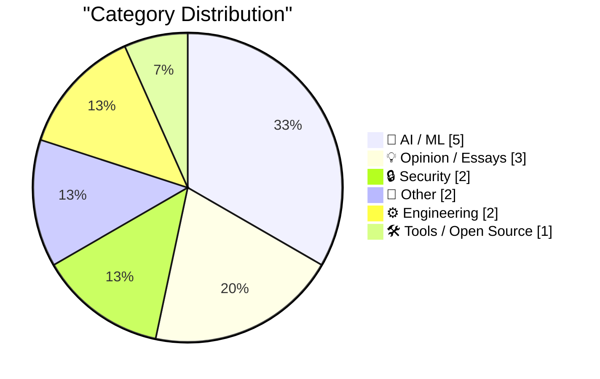
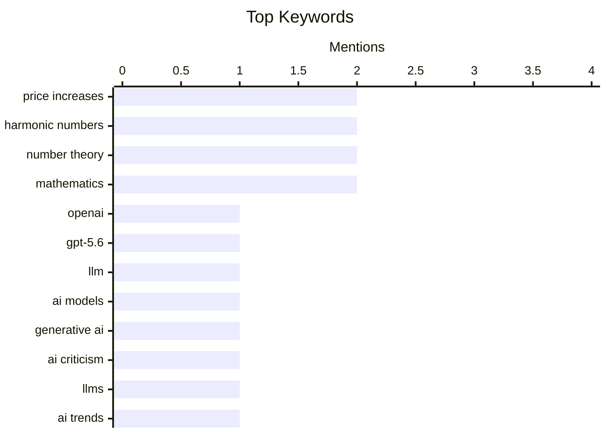

## Today's Highlights
The AI sector is buzzing with both progress and challenges this week, as OpenAI unveils its new GPT-5.6 model series amidst discussions of generative AI's recent struggles and the enormous costs of frontier models. Experts point to continuous 'on-the-job' learning as the next major breakthrough, even as the security of AI assistants is put to the test. Adding to the complexity, the industry faces potential geopolitical hurdles with speculated US restrictions on Chinese LLMs.
---
## Must Read Today
1. **Quoting OpenAI**
[Quoting OpenAI](https://simonwillison.net/2026/Jun/26/openai/#atom-everything) — simonwillison.net · 20h ago · 🤖 AI / ML
> OpenAI is launching a limited preview of its new GPT-5.6 model series, including Sol (flagship), Terra (balanced), and Luna (fast/affordable). Terra offers performance competitive with GPT-5.5 but is 2x cheaper, while Luna provides strong capabilities at the lowest cost. The company aims for broad access and plans general availability for Sol, Terra, and Luna in the coming weeks. This release signifies OpenAI's strategy to offer a tiered model lineup with improved cost-efficiency and accessibility.
💡 **Why read it**: It provides early details on OpenAI's next-generation GPT-5.6 models, highlighting their performance, cost-efficiency, and upcoming availability.
🏷️ OpenAI, GPT-5.6, LLM, AI models
2. **The month Generative AI lost its mojo**
[The month Generative AI lost its mojo](https://garymarcus.substack.com/p/the-month-generative-ai-lost-its) — garymarcus.substack.com · 15h ago · 🤖 AI / ML
> The article posits that June has been a challenging month for Generative AI, suggesting a potential decline in its perceived momentum or impact. While the month is not yet over, the author implies that significant events have already occurred to support this assertion. The core idea is that the initial hype or rapid progress of Generative AI may be facing a slowdown or increased scrutiny. This piece likely serves as a commentary on recent developments affecting the field.
💡 **Why read it**: It offers a critical perspective on the current state of Generative AI, prompting reflection on recent trends and potential challenges.
🏷️ Generative AI, AI criticism, LLMs, AI trends
3. **The next big breakthrough will be AIs learning on the job**
[The next big breakthrough will be AIs learning on the job](https://www.dwarkesh.com/p/the-next-paradigm) — dwarkesh.com · 22h ago · 🤖 AI / ML
> The article argues that the next major breakthrough in AI will come from models learning continuously "on the job" rather than through traditional pre-training. It highlights that current AI labs are discarding valuable interaction data generated during model deployment, which could be crucial for ongoing improvement. This approach suggests a shift towards more dynamic, adaptive AI systems that leverage real-world feedback loops. The core idea is to move beyond static models to AIs that evolve through continuous, practical experience.
💡 **Why read it**: It proposes a paradigm shift in AI development, emphasizing the importance of continuous learning from real-world interaction data for future breakthroughs.
🏷️ AI training, continuous learning, AI breakthroughs, data utilization
---
## Data Overview
| Sources Scanned | Articles Fetched | Time Window | Selected |
|:---:|:---:|:---:|:---:|
| 87/92 | 2570 -> 20 | 24h | **15** |
### Category Distribution

### Top Keywords

<details>
<summary>Plain Text Keyword Chart (Terminal Friendly)</summary>
```
price increases  │ ████████████████████ 2
harmonic numbers │ ████████████████████ 2
number theory    │ ████████████████████ 2
mathematics      │ ████████████████████ 2
openai           │ ██████████░░░░░░░░░░ 1
gpt-5.6          │ ██████████░░░░░░░░░░ 1
llm              │ ██████████░░░░░░░░░░ 1
ai models        │ ██████████░░░░░░░░░░ 1
generative ai    │ ██████████░░░░░░░░░░ 1
ai criticism     │ ██████████░░░░░░░░░░ 1
```
</details>
### Topic Tags
**price increases**(2) · **harmonic numbers**(2) · **number theory**(2) · mathematics(2) · openai(1) · gpt-5.6(1) · llm(1) · ai models(1) · generative ai(1) · ai criticism(1) · llms(1) · ai trends(1) · ai training(1) · continuous learning(1) · ai breakthroughs(1) · data utilization(1) · ai security(1) · prompt injection(1) · vulnerabilities(1) · ai assistant(1)
---
## AI / ML
### 1. Quoting OpenAI
[Quoting OpenAI](https://simonwillison.net/2026/Jun/26/openai/#atom-everything) — **simonwillison.net** · 20h ago · ⭐ 29/30
> OpenAI is launching a limited preview of its new GPT-5.6 model series, including Sol (flagship), Terra (balanced), and Luna (fast/affordable). Terra offers performance competitive with GPT-5.5 but is 2x cheaper, while Luna provides strong capabilities at the lowest cost. The company aims for broad access and plans general availability for Sol, Terra, and Luna in the coming weeks. This release signifies OpenAI's strategy to offer a tiered model lineup with improved cost-efficiency and accessibility.
🏷️ OpenAI, GPT-5.6, LLM, AI models
---
### 2. The month Generative AI lost its mojo
[The month Generative AI lost its mojo](https://garymarcus.substack.com/p/the-month-generative-ai-lost-its) — **garymarcus.substack.com** · 15h ago · ⭐ 27/30
> The article posits that June has been a challenging month for Generative AI, suggesting a potential decline in its perceived momentum or impact. While the month is not yet over, the author implies that significant events have already occurred to support this assertion. The core idea is that the initial hype or rapid progress of Generative AI may be facing a slowdown or increased scrutiny. This piece likely serves as a commentary on recent developments affecting the field.
🏷️ Generative AI, AI criticism, LLMs, AI trends
---
### 3. The next big breakthrough will be AIs learning on the job
[The next big breakthrough will be AIs learning on the job](https://www.dwarkesh.com/p/the-next-paradigm) — **dwarkesh.com** · 22h ago · ⭐ 27/30
> The article argues that the next major breakthrough in AI will come from models learning continuously "on the job" rather than through traditional pre-training. It highlights that current AI labs are discarding valuable interaction data generated during model deployment, which could be crucial for ongoing improvement. This approach suggests a shift towards more dynamic, adaptive AI systems that leverage real-world feedback loops. The core idea is to move beyond static models to AIs that evolve through continuous, practical experience.
🏷️ AI training, continuous learning, AI breakthroughs, data utilization
---
### 4. All Chinese Models Will Be Illegal in 3... 2... 1...
[All Chinese Models Will Be Illegal in 3... 2... 1...](https://idiallo.com/blog/all-chinese-models-will-be-illegal) — **idiallo.com** · 10h ago · ⭐ 26/30
> The article speculates on potential US government restrictions on state-of-the-art LLMs, following reports from The Washington Post about upcoming regulations on who can use them. The author predicts that Chinese AI models will be the next target, citing previous actions like the ban of Fable and limitations on ChatGPT 5.6. It highlights the competitive performance of open-weight models like DeepSeek, which emerged in December 2024, offering similar capabilities to proprietary models like Anthropic's Mythos at a fraction of the cost. The core concern is the increasing geopolitical control over AI technology and its implications for access and innovation.
🏷️ LLM regulation, Chinese models, AI policy, geopolitics
---
### 5. Quoting Dean W. Ball
[Quoting Dean W. Ball](https://simonwillison.net/2026/Jun/26/dean-w-ball/#atom-everything) — **simonwillison.net** · 15h ago · ⭐ 24/30
> Dean W. Ball highlights a critical industry dynamic for frontier AI models: their enormous training costs are primarily recouped within a narrow window of a few months post-release. After this initial period, models become "sub-frontier" as new competition emerges, leading to significant margin compression. This rapid obsolescence means that every week of delay in bringing a new frontier model to market directly erodes its profitability window. The article underscores the intense pressure on AI labs to quickly monetize their cutting-edge models before they are surpassed.
🏷️ Frontier models, AI economics, LLM costs, industry dynamics
---
## Opinion / Essays
### 6. Pluralistic: Zuckerberg's increasingly bizarre war on whistleblowers (27 Jun 2026)
[Pluralistic: Zuckerberg's increasingly bizarre war on whistleblowers (27 Jun 2026)](https://pluralistic.net/2026/06/27/zuckerstreisand-2/) — **pluralistic.net** · 2h ago · ⭐ 22/30
> Cory Doctorow's "Pluralistic" column for June 27, 2026, focuses on Mark Zuckerberg's escalating efforts against whistleblowers, specifically mentioning a book that prompted a demand for $111 million and authorial silence. The article implicitly criticizes Zuckerberg's actions, using reverse psychology to encourage readers to seek out the controversial book. Beyond this central theme, the column also touches on a diverse range of other topics, including flame warriors, cryptography, TSA incidents, neoliberalism, and wealth inequality. The primary takeaway is a critique of corporate power and attempts to suppress information.
🏷️ Zuckerberg, whistleblowers, corporate ethics, free speech
---
### 7. Premium: Notes From The Bubble, Volume 1
[Premium: Notes From The Bubble, Volume 1](https://www.wheresyoured.at/premium-notes-from-the-bubble-volume-1/) — **wheresyoured.at** · 19h ago · ⭐ 20/30
> This article introduces "Notes From The Bubble, Volume 1," a new ongoing series by the author. It explains that a previously planned "Hater's Guide" was not feasible due to time constraints. The post serves as an announcement for this new content format, signaling a shift in the author's publishing schedule and focus. It marks the beginning of a new regular feature for readers.
🏷️ tech industry, commentary, personal reflection, industry trends
---
### 8. Saying the obvious thing
[Saying the obvious thing](https://seangoedecke.com/saying-the-obvious-thing/) — **seangoedecke.com** · 14h ago · ⭐ 18/30
> This article explores the unexpected usefulness of stating obvious things, particularly in written communication. It argues that a significant portion of human knowledge resides below conscious awareness, making explicit statements valuable for reminding readers of what they implicitly know. This practice can help individuals articulate reasons for their feelings or beliefs, such as understanding why they dislike something without a clear rationale. The author suggests that clarifying these "obvious" points is a surprisingly effective communication strategy for both writers and readers.
🏷️ Communication, writing, knowledge, insights
---
## Security
### 9. What happened after 2,000 people tried to hack my AI assistant
[What happened after 2,000 people tried to hack my AI assistant](https://simonwillison.net/2026/Jun/26/hack-my-ai-assistant/#atom-everything) — **simonwillison.net** · 19h ago · ⭐ 26/30
> Fernando Irarrázaval conducted a security challenge on hackmyclaw.com, inviting 2,000 people to attempt leaking secrets from his OpenClaw AI assistant via email. Despite 6,000 attempts, $500 in token spend, and a Google account suspension due to excessive inbound emails, no participant successfully extracted the secret. This experiment demonstrated a surprising level of robustness in the OpenClaw instance against adversarial prompting and social engineering attempts. The findings suggest that well-designed AI assistants can withstand significant hacking efforts.
🏷️ AI security, prompt injection, vulnerabilities, AI assistant
---
### 10. Incident Report: CVE-2026-LGTM
[Incident Report: CVE-2026-LGTM](https://simonwillison.net/2026/Jun/26/incident-report/#atom-everything) — **simonwillison.net** · 20h ago · ⭐ 24/30
> This article presents a hypothetical incident report, CVE-2026-LGTM, detailing a scenario where two competing AI review agents entered a disagreement loop. The incident occurred on Day 2 at 16:00 UTC, triggered by a pull request bumping the `foxhole-lz4` package. The AI agents debated whether the package is malicious, generating 340 comments and incurring $41,255 in inference spend before intervention. This satirical report highlights potential issues with autonomous AI agents, particularly in security review contexts, and their capacity for costly, unproductive loops.
🏷️ AI incident, CVE, AI agents, AI safety
---
## Other
### 11. Apple’s Full Statement on Yesterday’s Price Increases
[Apple’s Full Statement on Yesterday’s Price Increases](https://www.macrumors.com/2026/06/25/apple-explains-why-it-raised-prices/) — **daringfireball.net** · 21h ago · ⭐ 25/30
> Apple issued a statement explaining its recent product price increases, attributing them to an "unprecedented challenge" in the consumer electronics industry. The company cites an "extraordinary surge in demand for memory and storage" driven by the rapid expansion of AI data centers. Apple states that component prices have risen more dramatically and quickly than ever before. While they previously absorbed these costs, they can no longer do so and must now raise prices on several products.
🏷️ Apple, price increases, AI data centers, supply chain
---
### 12. The Price-Hiked Apple TV 4K Is 4 Years Old
[The Price-Hiked Apple TV 4K Is 4 Years Old](https://buyersguide.macrumors.com/#Apple_TV) — **daringfireball.net** · 22h ago · ⭐ 19/30
> This article highlights the significant price increases for the current third-gen Apple TV 4K models, which were introduced in October 2022. The 64 GB base model increased from $130 to $200, and the 128 GB model with Ethernet and Thread networking rose from $150 to $250. These models utilize the A15 Bionic chip, which debuted with the iPhone 13 in 2021. The author notes that these price hikes position the Apple TV 4K unfavorably against cheaper set-top boxes, with new hardware models widely expected to be released this fall.
🏷️ Apple TV, price increases, hardware, consumer electronics
---
## Engineering
### 13. Height of harmonic numbers
[Height of harmonic numbers](https://www.johndcook.com/blog/2026/06/27/height-of-harmonic-numbers/) — **johndcook.com** · 1h ago · ⭐ 18/30
> This article is a follow-up post that visually analyzes the "height" of harmonic numbers, defined as the total number of bits in their numerator and denominator when expressed as reduced fractions. Building on previous work that estimated digit counts using asymptotics, this post focuses on plotting these values. The analysis specifically uses base `b=2` to determine the total bit count. It provides a concrete computational perspective on the complexity of representing harmonic numbers, complementing prior theoretical estimations.
🏷️ harmonic numbers, number theory, algorithms, mathematics
---
### 14. Writing down harmonic numbers
[Writing down harmonic numbers](https://www.johndcook.com/blog/2026/06/26/writing-down-harmonic-numbers/) — **johndcook.com** · 12h ago · ⭐ 18/30
> This article introduces the nth harmonic number (Hn) as the sum of the reciprocals of the first `n` positive integers (1 + 1/2 + ... + 1/n). It explains that Hn can be written as a fraction `p/q`. A key technical detail is that the product of all denominators, `n!`, can serve as a common denominator, allowing Hn to be expressed as `(n! * Hn) / n!`. This foundational explanation sets the stage for analyzing the properties of these fractional representations, such as their "height" or complexity.
🏷️ harmonic numbers, number theory, fractions, mathematics
---
## Tools / Open Source
### 15. This Week in Package Management: 27 June 2026
[This Week in Package Management: 27 June 2026](https://nesbitt.io/2026/06/27/this-week-in-package-management.html) — **nesbitt.io** · 4h ago · ⭐ 25/30
> This article serves as a weekly digest, compiling significant releases, security advisories, and relevant articles from the broader package management ecosystem. It aims to keep readers informed about the latest developments, updates, and potential vulnerabilities across various package managers and software distribution channels. The content likely covers a range of topics pertinent to developers, system administrators, and anyone involved in software supply chain security. It acts as a curated overview of the week's most important news in the field.
🏷️ package management, software releases, advisories, dependencies
---
*Generated at 2026-06-27 14:01 | Scanned 87 sources -> 2570 articles -> selected 15*
*Based on the [Hacker News Popularity Contest 2025](https://refactoringenglish.com/tools/hn-popularity/) RSS source list recommended by [Andrej Karpathy](https://x.com/karpathy)*
*Produced by Dongdianr AI. Follow the same-name WeChat public account for more AI practical tips 💡*
