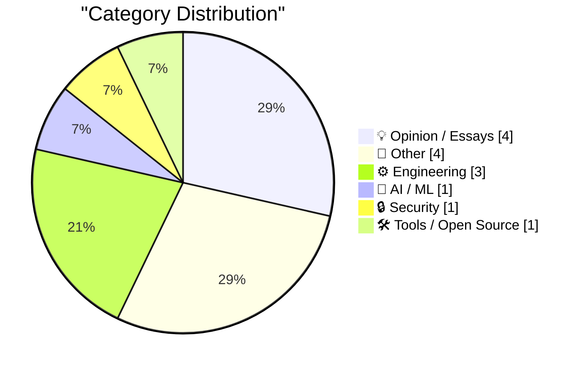
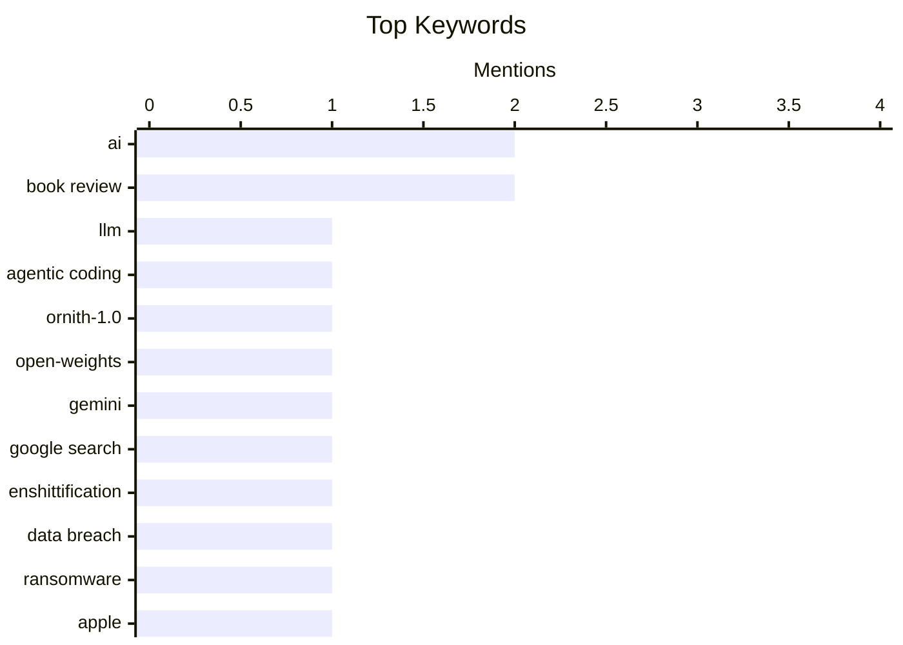

## Today's Highlights
Today's tech highlights show AI and LLMs advancing rapidly, with new models for agentic coding emerging and AI tools challenging the dominance of traditional search engines. However, this progress is tempered by persistent security concerns, as a major data breach exposed details of future products from a key supplier. The broader digital landscape also features critical discussions on platform quality, the importance of open source infrastructure, and innovative engineering approaches.
---
## Must Read Today
1. **Ornith-1.0: Self-Scaffolding LLMs for Agentic Coding**
[Ornith-1.0: Self-Scaffolding LLMs for Agentic Coding](https://simonwillison.net/2026/Jun/29/ornith/#atom-everything) — simonwillison.net · 21h ago · 🤖 AI / ML
> This article introduces Ornith-1.0, a new open-weights LLM from DeepReinforce designed for agentic coding. It is built upon pretrained Gemma 4 and Qwen 3.5, available in variants including 9B Dense, 31B Dense, 35B MoE, and 397B MoE. The model achieves state-of-the-art performance among open-source models of comparable size on coding benchmarks. Ornith-1.0 represents a significant advancement in open-source LLMs for agentic coding tasks.
💡 **Why read it**: It introduces a new state-of-the-art open-source LLM for coding, offering various model sizes and demonstrating strong performance on benchmarks.
🏷️ LLM, agentic coding, Ornith-1.0, open-weights
2. **Pluralistic: Gemini is better than search because Google enshittified search (29 Jun 2026)**
[Pluralistic: Gemini is better than search because Google enshittified search (29 Jun 2026)](https://pluralistic.net/2026/06/29/arsonist-firefighters/) — pluralistic.net · 21h ago · 💡 Opinion / Essays
> This article critically discusses the perceived decline in quality of Google Search, attributing it to Google's own 'enshittification' of the platform. The author argues that Google's focus on monetization and other factors has degraded the core search experience. This degradation, the piece implies, makes alternative tools like Gemini appear superior. The article ultimately suggests that Google's self-inflicted issues with its search product have created an opening for AI tools to offer a better user experience.
💡 **Why read it**: It offers a critical perspective on the current state of Google Search and its comparison with AI alternatives like Gemini, highlighting the impact of platform enshittification.
🏷️ Gemini, Google Search, enshittification, AI
3. **Data Breach at Indian Supplier Tata Electronics Exposes iPhone 18 Pro Details and Photos**
[Data Breach at Indian Supplier Tata Electronics Exposes iPhone 18 Pro Details and Photos](https://www.reuters.com/business/media-telecom/apple-iphone-18-pro-supplier-list-parts-photos-exposed-tata-data-leak-2026-06-29/) — daringfireball.net · 13h ago · 🔒 Security
> A significant data breach at Tata Electronics, an Indian supplier for Apple, has exposed sensitive details and photos of the upcoming iPhone 18 Pro models. A ransomware group stole data and subsequently posted lists of components, suppliers, and images of the iPhone 18 Pro on the dark web. This incident poses a substantial threat to Apple's meticulously managed global supply chain and product secrecy. The breach highlights critical security vulnerabilities within Apple's manufacturing ecosystem, potentially impacting future product launches.
💡 **Why read it**: It details a major data breach impacting Apple's supply chain and the secrecy of the unreleased iPhone 18 Pro, underscoring critical cybersecurity risks in global manufacturing.
🏷️ data breach, ransomware, Apple, supply chain
---
## Data Overview
| Sources Scanned | Articles Fetched | Time Window | Selected |
|:---:|:---:|:---:|:---:|
| 87/92 | 2572 -> 14 | 24h | **14** |
### Category Distribution

### Top Keywords

<details>
<summary>Plain Text Keyword Chart (Terminal Friendly)</summary>
```
ai               │ ████████████████████ 2
book review      │ ████████████████████ 2
llm              │ ██████████░░░░░░░░░░ 1
agentic coding   │ ██████████░░░░░░░░░░ 1
ornith-1.0       │ ██████████░░░░░░░░░░ 1
open-weights     │ ██████████░░░░░░░░░░ 1
gemini           │ ██████████░░░░░░░░░░ 1
google search    │ ██████████░░░░░░░░░░ 1
enshittification │ ██████████░░░░░░░░░░ 1
data breach      │ ██████████░░░░░░░░░░ 1
```
</details>
### Topic Tags
**ai**(2) · **book review**(2) · **llm**(1) · agentic coding(1) · ornith-1.0(1) · open-weights(1) · gemini(1) · google search(1) · enshittification(1) · data breach(1) · ransomware(1) · apple(1) · supply chain(1) · html(1) · table extractor(1) · utility(1) · conversion(1) · open source(1) · un(1) · policy(1)
---
## Opinion / Essays
### 1. Pluralistic: Gemini is better than search because Google enshittified search (29 Jun 2026)
[Pluralistic: Gemini is better than search because Google enshittified search (29 Jun 2026)](https://pluralistic.net/2026/06/29/arsonist-firefighters/) — **pluralistic.net** · 21h ago · ⭐ 27/30
> This article critically discusses the perceived decline in quality of Google Search, attributing it to Google's own 'enshittification' of the platform. The author argues that Google's focus on monetization and other factors has degraded the core search experience. This degradation, the piece implies, makes alternative tools like Gemini appear superior. The article ultimately suggests that Google's self-inflicted issues with its search product have created an opening for AI tools to offer a better user experience.
🏷️ Gemini, Google Search, enshittification, AI
---
### 2. Taking Roads and Bridges literally
[Taking Roads and Bridges literally](https://nesbitt.io/2026/06/30/taking-roads-and-bridges-literally.html) — **nesbitt.io** · 4h ago · ⭐ 21/30
> This article offers reflections on the UN Open Source Week 2026, using the metaphor of 'roads and bridges' to discuss foundational aspects of open source. The title implies a discussion about the critical infrastructure and interconnectedness within the open-source ecosystem, potentially covering governance, collaboration, or essential tools. Specific technical details are not provided in the snippet. It offers a perspective on the strategic importance of core components and connections within the open-source world, as discussed at a major UN event.
🏷️ open source, UN, policy, future trends
---
### 3. The Dating App Plot Device
[The Dating App Plot Device](https://idiallo.com/blog/dating-plot-device) — **idiallo.com** · 7h ago · ⭐ 19/30
> This article critically examines the fundamental business models and design choices behind dating apps, highlighting a conflict between user goals and platform incentives. The author posits that dating apps face a dilemma: either help users find a match (leading to churn) or keep them on the platform for as long as possible (often through monetization). The piece suggests that if the goal were genuinely to foster love, the programmatic approach to defining and facilitating it would be complex. The article argues that dating app designs are often driven by profit motives rather than genuine user success in finding long-term relationships.
🏷️ dating apps, business model, product strategy
---
### 4. Notes from June 2026
[Notes from June 2026](https://evanhahn.com/notes-from-june-2026/) — **evanhahn.com** · 14h ago · ⭐ 6/30
> This personal update from June 2026 primarily details the author's professional achievement of launching a significant project at Ghost. The project, "automations" for email sequences for new members, is described as one of the biggest undertaken by the author, currently in beta. Despite favorable weather in Chicago, the author spent most of the month working on this computer-based initiative. The core takeaway is the successful rollout of a major new feature for Ghost, enhancing member engagement capabilities.
🏷️ personal blog, reflections, monthly notes
---
## Other
### 5. Book Review: Fake Creativity by Blake Loch ★★★☆☆
[Book Review: Fake Creativity by Blake Loch ★★★☆☆](https://shkspr.mobi/blog/2026/06/book-review-fake-creativity-by-blake-loch/) — **shkspr.mobi** · 2h ago · ⭐ 17/30
> This article is a book review of 'Fake Creativity' by Blake Loch, a self-published novel exploring themes of AI plagiarism and the nature of creativity. The novel follows an author's descent into paranoia, convinced an AI is plagiarizing his work, leading him to question the authenticity of his own creative processes. The review notes that the book raises excellent questions about creativity in the age of AI. The book is an intriguing exploration of AI's impact on human creativity and the psychological toll of questioning one's originality.
🏷️ book review, AI, creativity, plagiarism
---
### 6. Pluralistic: Jo Walton's "Everybody's Perfect" (30 Jun 2026)
[Pluralistic: Jo Walton's "Everybody's Perfect" (30 Jun 2026)](https://pluralistic.net/2026/06/30/serenissima/) — **pluralistic.net** · 2h ago · ⭐ 14/30
> This article is a daily link aggregation from Cory Doctorow's Pluralistic blog. It primarily highlights Jo Walton's novel "Everybody's Perfect" as a mystical tour-de-force. Additionally, it touches on topics like corruption and the financial performance of AI companies, questioning their profitability. The post also includes personal updates on upcoming and recent appearances, along with mentions of latest and upcoming books. Overall, it serves as a curated digest of cultural recommendations and socio-economic commentary.
🏷️ link aggregation, book review, AI companies
---
### 7. [Sponsor] Day One Journal
[[Sponsor] Day One Journal](https://dayoneapp.com/blog/introducing-daily-chat/) — **daringfireball.net** · 14h ago · ⭐ 12/30
> The Day One journaling app addresses the common challenge of starting and structuring journal entries by introducing "Daily Chat." This new AI-powered feature provides a guided reflection experience, helping users articulate their thoughts and organize them into coherent journal entries. Early testers praised Daily Chat as a "game changer" for daily journaling, highlighting its effectiveness in simplifying the thought-capturing process. The tool aims to make journaling more accessible and less intimidating for individuals who struggle with initial prompts or perceived quality standards. Ultimately, Daily Chat enhances the journaling experience by offering an interactive, supportive framework.
🏷️ journaling app, productivity, Day One
---
### 8. Apricot Computers: An underrated British brand
[Apricot Computers: An underrated British brand](https://dfarq.homeip.net/apricot-computers-an-underrated-british-brand/?utm_source=rss&#038;utm_medium=rss&#038;utm_campaign=apricot-computers-an-underrated-british-brand) — **dfarq.homeip.net** · 3h ago · ⭐ 12/30
> This article highlights Apricot Computers as an underrated British brand, often overshadowed by contemporaries like Sinclair, Amstrad, and Acorn. It argues that despite its lesser-known status, Apricot deserves more recognition in the history of British computing. The piece suggests that a television program from early 1990 may have contributed to a renewed appreciation or awareness of the brand. The core argument is that Apricot's contributions to the British tech landscape are significant and warrant further attention.
🏷️ computer history, retro computing, British brands
---
## Engineering
### 9. Data-directed programming in Haskell (SICP 2.4.3)
[Data-directed programming in Haskell (SICP 2.4.3)](https://entropicthoughts.com/sicp-2-4-data-directed-programming-in-haskell) — **entropicthoughts.com** · 16h ago · ⭐ 20/30
> This article explores the concept of data-directed programming, specifically in the context of Haskell, drawing inspiration from Structure and Interpretation of Computer Programs (SICP) section 2.4.3. It follows up on a previous discussion about tagged data in Haskell, moving towards data-directed programming as suggested by SICP authors. The author intends to demonstrate how to implement this paradigm in Haskell, using complex numbers (stored in rectangular form) as a potential example. The post aims to illustrate the application of data-directed programming principles from SICP within the functional programming language Haskell.
🏷️ Haskell, SICP, data-directed programming, functional programming
---
### 10. Derivative equals inverse
[Derivative equals inverse](https://www.johndcook.com/blog/2026/06/29/derivative-equals-inverse/) — **johndcook.com** · 12h ago · ⭐ 19/30
> This article presents a unique mathematical problem: finding a function `f` such that its derivative `f'(x)` equals its inverse `f⁻¹(x)` for all positive `x`. The problem is described as an unusual differential equation that cannot be solved using standard techniques taught in typical differential equations courses. The article promises an interesting solution, implying a non-trivial mathematical approach is required. It highlights a challenging and unconventional mathematical problem requiring creative problem-solving beyond standard differential equation methods.
🏷️ calculus, differential equation, mathematics, inverse function
---
### 11. Count the number of Safari tabs
[Count the number of Safari tabs](https://simonwillison.net/2026/Jun/29/safari-tab-count/#atom-everything) — **simonwillison.net** · 19h ago · ⭐ 14/30
> This article provides a quick tip (TIL) on how to count the number of open browser tabs in Safari using AppleScript. The solution involves a single line of AppleScript executed via `osascript` in the terminal: `osascript -e 'tell application "Safari" to count tabs of every window'`. The author demonstrates its use, showing a result of 370 open tabs. This concise AppleScript command offers a simple and effective way to programmatically determine the total number of open Safari tabs.
🏷️ AppleScript, Safari, browser tabs, scripting
---
## AI / ML
### 12. Ornith-1.0: Self-Scaffolding LLMs for Agentic Coding
[Ornith-1.0: Self-Scaffolding LLMs for Agentic Coding](https://simonwillison.net/2026/Jun/29/ornith/#atom-everything) — **simonwillison.net** · 21h ago · ⭐ 27/30
> This article introduces Ornith-1.0, a new open-weights LLM from DeepReinforce designed for agentic coding. It is built upon pretrained Gemma 4 and Qwen 3.5, available in variants including 9B Dense, 31B Dense, 35B MoE, and 397B MoE. The model achieves state-of-the-art performance among open-source models of comparable size on coding benchmarks. Ornith-1.0 represents a significant advancement in open-source LLMs for agentic coding tasks.
🏷️ LLM, agentic coding, Ornith-1.0, open-weights
---
## Security
### 13. Data Breach at Indian Supplier Tata Electronics Exposes iPhone 18 Pro Details and Photos
[Data Breach at Indian Supplier Tata Electronics Exposes iPhone 18 Pro Details and Photos](https://www.reuters.com/business/media-telecom/apple-iphone-18-pro-supplier-list-parts-photos-exposed-tata-data-leak-2026-06-29/) — **daringfireball.net** · 13h ago · ⭐ 25/30
> A significant data breach at Tata Electronics, an Indian supplier for Apple, has exposed sensitive details and photos of the upcoming iPhone 18 Pro models. A ransomware group stole data and subsequently posted lists of components, suppliers, and images of the iPhone 18 Pro on the dark web. This incident poses a substantial threat to Apple's meticulously managed global supply chain and product secrecy. The breach highlights critical security vulnerabilities within Apple's manufacturing ecosystem, potentially impacting future product launches.
🏷️ data breach, ransomware, Apple, supply chain
---
## Tools / Open Source
### 14. HTML table extractor
[HTML table extractor](https://simonwillison.net/2026/Jun/29/html-table-extractor/#atom-everything) — **simonwillison.net** · 14h ago · ⭐ 22/30
> This article introduces a new web-based tool called 'HTML table extractor' designed to convert embedded HTML tables from pasted rich text. The tool accepts rich text from browsers and converts every detected table into multiple formats, including HTML, Markdown, CSV, TSV, or JSON. An example use case involves extracting data from Wikipedia tables. This tool provides a versatile and efficient solution for converting structured data from web pages into various machine-readable formats.
🏷️ HTML, table extractor, utility, conversion
---
*Generated at 2026-06-30 14:01 | Scanned 87 sources -> 2572 articles -> selected 14*
*Based on the [Hacker News Popularity Contest 2025](https://refactoringenglish.com/tools/hn-popularity/) RSS source list recommended by [Andrej Karpathy](https://x.com/karpathy)*
*Produced by Dongdianr AI. Follow the same-name WeChat public account for more AI practical tips 💡*
