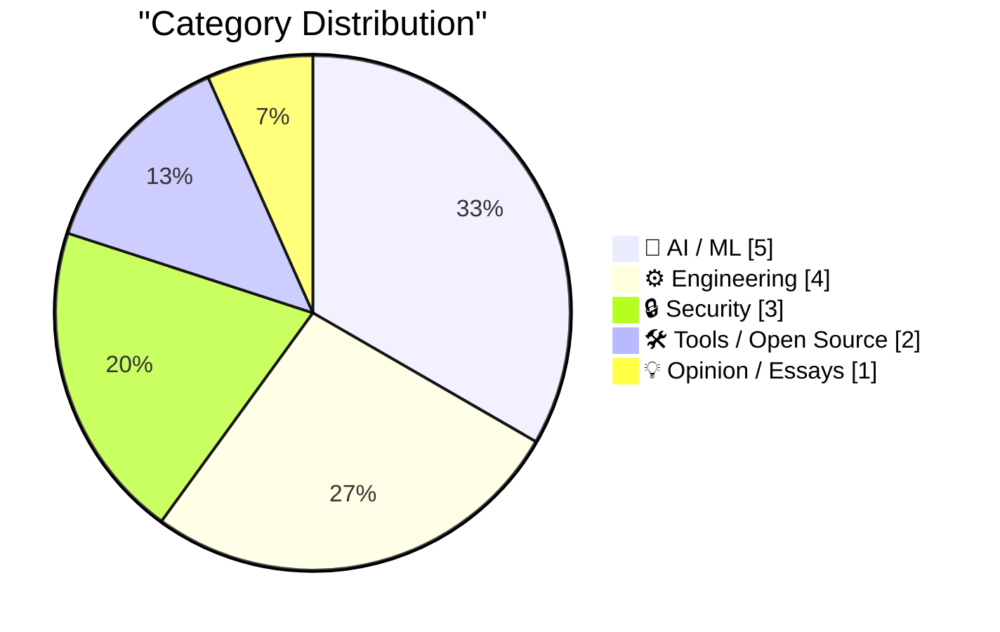
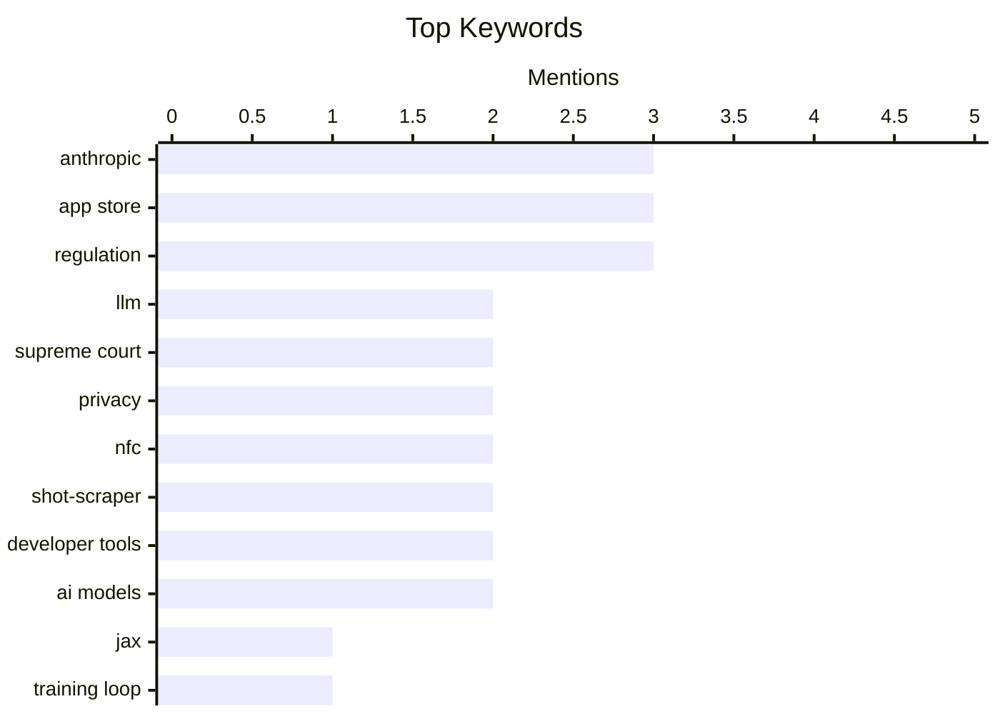

## Today's Highlights
The tech world is grappling with significant shifts today, from the intricate engineering behind large language models and critical evaluations of the AI industry's health, to intensifying regulatory and legal challenges for major platforms. Courts and regulators are scrutinizing tech giants over app store practices and data privacy, including a Supreme Court ruling on geofence warrants and new proposals for mobile ecosystem openness. This comes as cybersecurity regulations spark debate and specific technologies like ClickHouse gain ground in competitive fields.
---
## Must Read Today
1. **Writing an LLM from scratch, part 34a -- building a JAX training loop for an LLM training run**
[Writing an LLM from scratch, part 34a -- building a JAX training loop for an LLM training run](https://www.gilesthomas.com/2026/06/llm-from-scratch-34a-building-a-jax-training-loop-for-an-llm-training-run) — gilesthomas.com · 19h ago · 🤖 AI / ML
> This article details the process of building and training a Large Language Model (LLM) from scratch, specifically focusing on implementing a JAX training loop. The author is following a self-designed curriculum inspired by Sebastian Raschka's book, aiming to construct an LLM using only accumulated notes. This installment (part 34a) delves into the practical implementation of setting up the computational graph and optimization steps within the JAX framework for an LLM. The project emphasizes a deep, hands-on understanding of LLM development without external references. It provides a practical guide to implementing a JAX-based training loop for those building LLMs from first principles.
💡 **Why read it**: It offers a detailed, practical guide for implementing an LLM training loop using JAX, valuable for those building LLMs from first principles.
🏷️ LLM, JAX, training loop, deep learning
2. **★ The Supreme Court Rules That Law Enforcement’s Use of ‘Geofence Warrant’ Was a ‘Search’ (But May Be Moot, Technically, Since 2024)**
[★ The Supreme Court Rules That Law Enforcement’s Use of ‘Geofence Warrant’ Was a ‘Search’ (But May Be Moot, Technically, Since 2024)](https://daringfireball.net/2026/06/scotus_geofence_warrant_search) — daringfireball.net · 19h ago · 🔒 Security
> The Supreme Court has ruled that law enforcement's use of 'geofence warrants' constitutes a 'search' under the Fourth Amendment. Geofence warrants compel tech companies to provide location data for all devices within a specific geographic area and time frame. While a significant legal precedent for privacy, the practical impact of this ruling may be limited. Google no longer collects this specific type of information in a way susceptible to such warrants, and Apple never did. The ruling clarifies the legal status of this surveillance method, even as technology companies evolve their data collection practices.
💡 **Why read it**: It clarifies the legal status of geofence warrants as a 'search' by the Supreme Court, despite evolving data collection practices by tech giants like Google and Apple.
🏷️ Geofence warrant, Supreme Court, privacy, data collection
3. **The AI Industry Is Losing**
[The AI Industry Is Losing](https://www.wheresyoured.at/the-ai-industry-is-losing/) — wheresyoured.at · 22h ago · 💡 Opinion / Essays
> The article posits that the AI industry is currently "losing," challenging the widespread perception of its success and rapid advancement. The author likely presents a contrarian view, possibly highlighting underlying issues such as unsustainable business models, overhyped capabilities, or fundamental technical limitations that are not widely acknowledged. It suggests a critical examination of the industry's trajectory, potentially including detailed analyses of major players like NVIDIA and Anthropic. The piece aims to provoke thought by arguing that the AI industry faces significant, unaddressed challenges despite its public image.
💡 **Why read it**: It provides a critical, contrarian perspective on the current state of the AI industry, prompting readers to question prevailing narratives of success.
🏷️ AI industry, market analysis, NVIDIA, Anthropic
---
## Data Overview
| Sources Scanned | Articles Fetched | Time Window | Selected |
|:---:|:---:|:---:|:---:|
| 87/92 | 2574 -> 26 | 24h | **15** |
### Category Distribution

### Top Keywords

<details>
<summary>Plain Text Keyword Chart (Terminal Friendly)</summary>
```
anthropic       │ ████████████████████ 3
app store       │ ████████████████████ 3
regulation      │ ████████████████████ 3
llm             │ █████████████░░░░░░░ 2
supreme court   │ █████████████░░░░░░░ 2
privacy         │ █████████████░░░░░░░ 2
nfc             │ █████████████░░░░░░░ 2
shot-scraper    │ █████████████░░░░░░░ 2
developer tools │ █████████████░░░░░░░ 2
ai models       │ █████████████░░░░░░░ 2
```
</details>
### Topic Tags
**anthropic**(3) · **app store**(3) · **regulation**(3) · llm(2) · supreme court(2) · privacy(2) · nfc(2) · shot-scraper(2) · developer tools(2) · ai models(2) · jax(1) · training loop(1) · deep learning(1) · geofence warrant(1) · data collection(1) · ai industry(1) · market analysis(1) · nvidia(1) · apple(1) · epic games(1)
---
## AI / ML
### 1. Writing an LLM from scratch, part 34a -- building a JAX training loop for an LLM training run
[Writing an LLM from scratch, part 34a -- building a JAX training loop for an LLM training run](https://www.gilesthomas.com/2026/06/llm-from-scratch-34a-building-a-jax-training-loop-for-an-llm-training-run) — **gilesthomas.com** · 19h ago · ⭐ 28/30
> This article details the process of building and training a Large Language Model (LLM) from scratch, specifically focusing on implementing a JAX training loop. The author is following a self-designed curriculum inspired by Sebastian Raschka's book, aiming to construct an LLM using only accumulated notes. This installment (part 34a) delves into the practical implementation of setting up the computational graph and optimization steps within the JAX framework for an LLM. The project emphasizes a deep, hands-on understanding of LLM development without external references. It provides a practical guide to implementing a JAX-based training loop for those building LLMs from first principles.
🏷️ LLM, JAX, training loop, deep learning
---
### 2. Grant Sanderson – AI and the future of math
[Grant Sanderson – AI and the future of math](https://www.dwarkesh.com/p/grant-sanderson-2) — **dwarkesh.com** · 22h ago · ⭐ 25/30
> This article, likely an interview or discussion, explores the profound intersection of Artificial Intelligence and the future of mathematics. Grant Sanderson, creator of 3Blue1Brown, posits that "Math is where we’ll see superintelligence first." This suggests a discussion on how AI could significantly accelerate mathematical research, automate complex proofs, or even develop entirely new mathematical concepts. The piece delves into the potential for AI to transform the field of mathematics, impacting discovery, understanding, and application. It concludes that mathematics will be a primary domain for the emergence and demonstration of superintelligent AI, with profound implications for the discipline.
🏷️ AI, mathematics, superintelligence, future of AI
---
### 3. What's new in Claude Sonnet 5
[What's new in Claude Sonnet 5](https://simonwillison.net/2026/Jun/30/claude-sonnet-5/#atom-everything) — **simonwillison.net** · 16h ago · ⭐ 22/30
> This article discusses the new features and performance of Anthropic's recently released Claude Sonnet 5 large language model. Anthropic states that Sonnet 5's performance is "close to that of Opus 4.8," but it is offered at a lower price point. The author emphasizes checking the developer documentation for actionable information rather than just the official announcement. Claude Sonnet 5 offers near-Opus 4.8 performance at a reduced cost, making it a potentially more accessible option for developers.
🏷️ Claude Sonnet 5, LLM, Anthropic, AI models
---
### 4. Quoting Anthropic
[Quoting Anthropic](https://simonwillison.net/2026/Jun/30/anthropic/#atom-everything) — **simonwillison.net** · 14h ago · ⭐ 20/30
> This article relays an important announcement from Anthropic regarding the lifting of export controls on specific Claude models. Anthropic announced via Twitter that the Department of Commerce has lifted export controls on Claude Fable 5 and Mythos 5. They stated that access to these models would begin to be restored the following day. The lifting of export controls on Claude Fable 5 and Mythos 5 will broaden their availability, indicating a significant regulatory change for these AI models.
🏷️ Anthropic, Claude, AI models, export controls
---
### 5. Nano Banana 2 Lite
[Nano Banana 2 Lite](https://simonwillison.net/2026/Jun/30/nano-banana-2-lite/#atom-everything) — **simonwillison.net** · 15h ago · ⭐ 20/30
> This article introduces Google's new image generation model, Nano Banana 2 Lite, also known as Gemini 3.1 Flash Lite Image. The model, accessible via the `gemini-3.1-flash-lite-image` API, is engineered for "velocity and scale," making it the "fastest and cheapest Gemini image model." The author mentions using AI Studio to test it. Nano Banana 2 Lite (Gemini 3.1 Flash Lite Image) is positioned as Google's most efficient and cost-effective Gemini model for image generation.
🏷️ Gemini, image generation, AI model, Google DeepMind
---
## Engineering
### 6. Supreme Court Agrees to Review Apple’s Petition Regarding Civil Contempt Finding in ‘Apple v. Epic Games’
[Supreme Court Agrees to Review Apple’s Petition Regarding Civil Contempt Finding in ‘Apple v. Epic Games’](https://www.supremecourt.gov/orders/courtorders/063026zor_3f14.pdf) — **daringfireball.net** · 17h ago · ⭐ 25/30
> The Supreme Court has agreed to review Apple's petition concerning a civil contempt finding in the ongoing 'Apple v. Epic Games' lawsuit. The Court granted certiorari specifically limited to "Question 1 presented by the petition," which pertains to whether Apple could be held in contempt for violating the *spirit* of an injunction. This injunction aimed to allow external payments, but Apple's implementation involved charging a commission on these external payments, which Epic argued circumvented the ruling. The Supreme Court's decision to hear this specific aspect indicates a continued legal battle over the interpretation and enforcement of antitrust injunctions in the digital marketplace.
🏷️ Apple, Epic Games, Supreme Court, app store
---
### 7. Clickhouse is winning the Observability Wars
[Clickhouse is winning the Observability Wars](https://matduggan.com/clickhouse-is-winning-the-observability-wars/) — **matduggan.com** · 47m ago · ⭐ 25/30
> The article argues that ClickHouse is emerging as the dominant technology in the "Observability Wars," a term for the intense competition among data platforms for monitoring and analyzing system performance. The author, with a decade of experience in observability, asserts that ClickHouse's columnar database architecture and high performance make it exceptionally well-suited for handling the massive volumes of logs, metrics, and traces required for modern observability. This positions it favorably against traditional monitoring solutions, which are often deemed insufficient or too expensive. ClickHouse is presented as the superior choice for observability due to its architectural advantages in processing and querying vast amounts of time-series data efficiently.
🏷️ ClickHouse, observability, monitoring, data analytics
---
### 8. CMA Consultation on Mobile App Steering and NFC Access
[CMA Consultation on Mobile App Steering and NFC Access](https://www.gov.uk/government/news/cma-consults-on-new-requirements-for-apple-and-googles-mobile-platforms) — **daringfireball.net** · 21h ago · ⭐ 24/30
> The UK Competition and Markets Authority (CMA) is conducting a consultation regarding new requirements for Apple and Google's mobile platforms concerning app steering and NFC access. The consultation aims to gather feedback on lifting restrictions that prevent developers from "steering" customers to off-platform options, which are currently banned by Apple and restricted by Google. This move is intended to allow developers to bypass mandatory platform fees. The CMA's principles also address ensuring "fair and reasonable" steering fees through an evidence-based framework. The CMA's consultation signifies a regulatory push to increase competition and reduce developer costs by exploring mandated flexibility in app payment options and potentially opening up NFC access.
🏷️ App Store, regulation, mobile apps, NFC
---
### 9. U.K. Regulator Considers Requiring App Store to Allow Steering to the Web, and iOS NFC to Be Open
[U.K. Regulator Considers Requiring App Store to Allow Steering to the Web, and iOS NFC to Be Open](https://www.reuters.com/world/uk-regulator-proposes-easing-apple-google-app-store-payment-rules-2026-06-30/) — **daringfireball.net** · 22h ago · ⭐ 24/30
> Britain's competition regulator, the Competition and Markets Authority (CMA), has proposed new rules to allow app developers to direct users to alternative payment options outside Apple and Google's app stores. These proposals specifically target the removal of existing restrictions that prevent UK developers from "steering" users to off-platform payment methods, aiming to cut fees and boost competition. Additionally, the CMA is considering requiring iOS NFC to be open, which would grant third-party access to this technology currently controlled by Apple. The CMA's proposals represent a significant regulatory step towards enhancing competition and consumer choice within the mobile app ecosystem by challenging platform control over payments and core hardware.
🏷️ App Store, regulation, mobile payments, NFC
---
## Security
### 10. ★ The Supreme Court Rules That Law Enforcement’s Use of ‘Geofence Warrant’ Was a ‘Search’ (But May Be Moot, Technically, Since 2024)
[★ The Supreme Court Rules That Law Enforcement’s Use of ‘Geofence Warrant’ Was a ‘Search’ (But May Be Moot, Technically, Since 2024)](https://daringfireball.net/2026/06/scotus_geofence_warrant_search) — **daringfireball.net** · 19h ago · ⭐ 26/30
> The Supreme Court has ruled that law enforcement's use of 'geofence warrants' constitutes a 'search' under the Fourth Amendment. Geofence warrants compel tech companies to provide location data for all devices within a specific geographic area and time frame. While a significant legal precedent for privacy, the practical impact of this ruling may be limited. Google no longer collects this specific type of information in a way susceptible to such warrants, and Apple never did. The ruling clarifies the legal status of this surveillance method, even as technology companies evolve their data collection practices.
🏷️ Geofence warrant, Supreme Court, privacy, data collection
---
### 11. Bulkdatasets AIVD en MIVD: de schaduw geheime dienst
[Bulkdatasets AIVD en MIVD: de schaduw geheime dienst](https://berthub.eu/articles/posts/de-schaduwgeheimedienst/) — **berthub.eu** · 5h ago · ⭐ 25/30
> A new research report reveals that the Dutch intelligence agencies, AIVD and MIVD, are handling bulk datasets carelessly and sometimes unlawfully. Bulk datasets are extensive collections of data, often pertaining to millions of random individuals, acquired from various sources including informants, other government organizations, foreign intelligence services, or commercial parties. The report indicates that the agencies' management of these vast personal data collections is problematic, raising significant concerns about privacy, legal compliance, and oversight. This article exposes critical issues with the AIVD and MIVD's data handling, suggesting a need for stricter adherence to legal frameworks for data acquisition and processing.
🏷️ bulk datasets, privacy, surveillance, intelligence agencies
---
### 12. The CRA is not about open source
[The CRA is not about open source](https://nesbitt.io/2026/07/01/the-cra-is-not-about-open-source.html) — **nesbitt.io** · 4h ago · ⭐ 24/30
> The article argues that the Cyber Resilience Act (CRA) is fundamentally misaligned with the principles and sustainability of open-source software, despite creating an "open-source steward" role. The author contends that while the CRA introduces a role for open-source stewardship, it critically fails to provide funding or a viable maintenance model for open-source projects. This oversight creates a significant burden on maintainers without adequate support, potentially hindering the very ecosystem it purports to regulate or protect. The CRA, in its current form, is seen as detrimental to open-source sustainability by imposing responsibilities without corresponding financial or structural support.
🏷️ Cyber Resilience Act, open source, regulation
---
## Tools / Open Source
### 13. Have your agent record video demos of its work with shot-scraper video
[Have your agent record video demos of its work with shot-scraper video](https://simonwillison.net/2026/Jun/30/shot-scraper-video/#atom-everything) — **simonwillison.net** · 21h ago · ⭐ 23/30
> This article introduces `shot-scraper video`, a new command designed for recording automated video demos of web application routines. Released in `shot-scraper 1.10`, this command accepts a `storyboard.yml` file to define a sequence of actions. It leverages Playwright to execute these actions and record a video of the entire routine, enabling programmatic generation of visual demonstrations of agent interactions with web UIs. The tool simplifies the creation of reproducible and shareable video documentation for web automation tasks.
🏷️ shot-scraper, video demos, developer tools, automation
---
### 14. shot-scraper 1.10
[shot-scraper 1.10](https://simonwillison.net/2026/Jun/30/shot-scraper/#atom-everything) — **simonwillison.net** · 22h ago · ⭐ 20/30
> This article announces the release of `shot-scraper 1.10`, focusing on its primary new feature. The main new feature in version 1.10 is the `shot-scraper video storyboard.yml` command, which is described in detail in a separate article titled "Have your agent record video demos of its work with shot-scraper video." `shot-scraper 1.10` introduces the significant `shot-scraper video` command, enabling automated video recording of web application routines.
🏷️ shot-scraper, release, developer tools
---
## Opinion / Essays
### 15. The AI Industry Is Losing
[The AI Industry Is Losing](https://www.wheresyoured.at/the-ai-industry-is-losing/) — **wheresyoured.at** · 22h ago · ⭐ 26/30
> The article posits that the AI industry is currently "losing," challenging the widespread perception of its success and rapid advancement. The author likely presents a contrarian view, possibly highlighting underlying issues such as unsustainable business models, overhyped capabilities, or fundamental technical limitations that are not widely acknowledged. It suggests a critical examination of the industry's trajectory, potentially including detailed analyses of major players like NVIDIA and Anthropic. The piece aims to provoke thought by arguing that the AI industry faces significant, unaddressed challenges despite its public image.
🏷️ AI industry, market analysis, NVIDIA, Anthropic
---
*Generated at 2026-07-01 14:01 | Scanned 87 sources -> 2574 articles -> selected 15*
*Based on the [Hacker News Popularity Contest 2025](https://refactoringenglish.com/tools/hn-popularity/) RSS source list recommended by [Andrej Karpathy](https://x.com/karpathy)*
*Produced by Dongdianr AI. Follow the same-name WeChat public account for more AI practical tips 💡*
