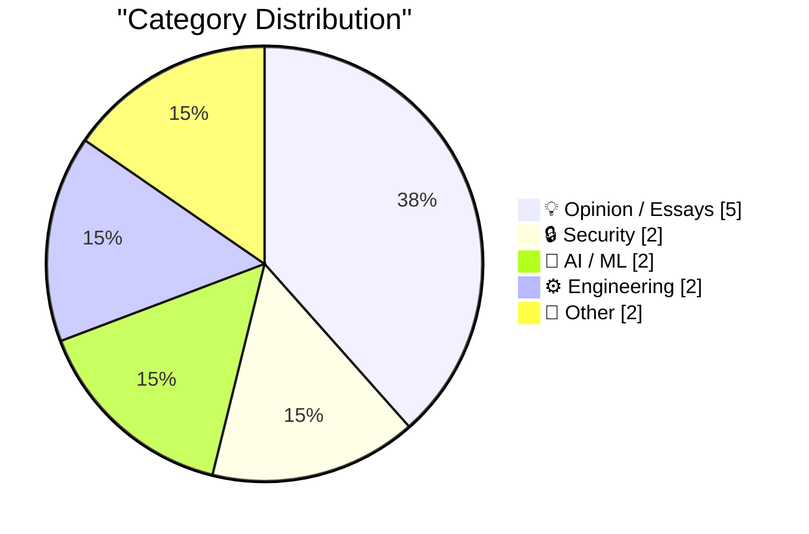
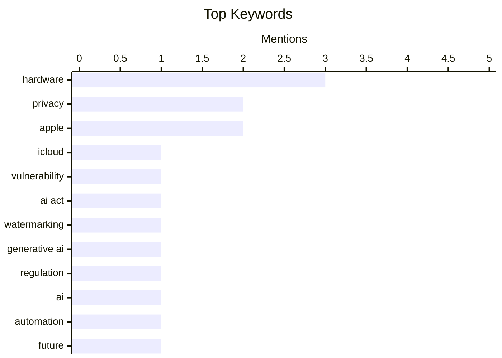

## Today's Highlights
Today's tech news reveals pressing security and privacy issues, including a critical iCloud vulnerability that leaks real email addresses and an urgent call for greater digital autonomy. The AI sector grapples with regulatory challenges, as the trivial removability of AI watermarks undermines detection efforts and fundamental questions about AI's future persist. Meanwhile, broader discussions critique the evolving digital experience, from the decline of traditional online forums to concerns about platform "enclosure" and the business models dictating hardware access.
---
## Must Read Today
1. **404 Media: Vulnerability in iCloud’s ‘Hide My Email’ Reveals Peoples’ Real Email Addresses**
[404 Media: Vulnerability in iCloud’s ‘Hide My Email’ Reveals Peoples’ Real Email Addresses](https://www.404media.co/apple-hide-my-email-vulnerability-reveals-peoples-real-email-addresses/) — daringfireball.net · 23h ago · 🔒 Security
> A critical vulnerability in Apple's iCloud 'Hide My Email' service is reportedly leaking users' real email addresses, compromising their privacy. 404 Media verified the issue with their own hidden email address and reported it to Apple over a year ago with replication instructions, but it remains unpatched. The exact details of the exploit are not being revealed to prevent further abuse. The continued existence of this unpatched vulnerability poses a significant privacy risk for 'Hide My Email' users.
💡 **Why read it**: It highlights a critical, unpatched privacy vulnerability in a widely used Apple service, urging users to be aware of potential data exposure.
🏷️ iCloud, vulnerability, privacy, Apple
2. **Text AI watermarks will always be trivial to remove**
[Text AI watermarks will always be trivial to remove](https://seangoedecke.com/text-ai-watermarks/) — seangoedecke.com · 14h ago · 🤖 AI / ML
> The EU AI Act's Article 50 requires AI outputs to be detectable as artificially generated, prompting the use of watermarks for text AI. The article argues that text AI watermarks will always be trivial to remove because they rely on statistical patterns easily altered by minor text modifications like paraphrasing or synonym replacement, without changing semantic meaning. Unlike image watermarks, text has a high degree of semantic flexibility. Relying on watermarks for text AI detection is fundamentally flawed and will not effectively meet regulatory requirements like the EU AI Act.
💡 **Why read it**: It critically analyzes the inherent limitations of text AI watermarking as a regulatory compliance mechanism, offering a skeptical perspective on its effectiveness.
🏷️ AI Act, watermarking, generative AI, regulation
3. **The Winning Essays for the Big Questions About AI**
[The Winning Essays for the Big Questions About AI](https://www.dwarkesh.com/p/blog-prize-winners) — dwarkesh.com · 15h ago · 🤖 AI / ML
> This article presents the winning essays from a competition focused on "Big Questions About AI," exploring various societal challenges and opportunities related to artificial intelligence. The winning essays cover diverse topics such as abolishing pandemics, navigating AI automation's impact on employment, and drawing lessons from business models like the Honk Kong MTR for AI integration. These essays likely offer different perspectives and proposed solutions to these complex AI-related issues. The competition highlights a range of critical discussions and innovative ideas regarding AI's future impact and how humanity can best adapt or leverage its capabilities.
💡 **Why read it**: It provides a curated collection of insightful perspectives on major societal questions surrounding AI, offering diverse viewpoints on its potential challenges and benefits.
🏷️ AI, Automation, Future
---
## Data Overview
| Sources Scanned | Articles Fetched | Time Window | Selected |
|:---:|:---:|:---:|:---:|
| 87/92 | 2575 -> 13 | 24h | **13** |
### Category Distribution

### Top Keywords

<details>
<summary>Plain Text Keyword Chart (Terminal Friendly)</summary>
```
hardware      │ ████████████████████ 3
privacy       │ █████████████░░░░░░░ 2
apple         │ █████████████░░░░░░░ 2
icloud        │ ███████░░░░░░░░░░░░░ 1
vulnerability │ ███████░░░░░░░░░░░░░ 1
ai act        │ ███████░░░░░░░░░░░░░ 1
watermarking  │ ███████░░░░░░░░░░░░░ 1
generative ai │ ███████░░░░░░░░░░░░░ 1
regulation    │ ███████░░░░░░░░░░░░░ 1
ai            │ ███████░░░░░░░░░░░░░ 1
```
</details>
### Topic Tags
**hardware**(3) · **privacy**(2) · **apple**(2) · icloud(1) · vulnerability(1) · ai act(1) · watermarking(1) · generative ai(1) · regulation(1) · ai(1) · automation(1) · future(1) · digital autonomy(1) · security(1) · enshittification(1) · platforms(1) · tech industry(1) · monopolization(1) · valve(1) · subsidies(1)
---
## Opinion / Essays
### 1. Pluralistic: Technocarcinization (01 Jul 2026)
[Pluralistic: Technocarcinization (01 Jul 2026)](https://pluralistic.net/2026/07/01/ontogeny/) — **pluralistic.net** · 22h ago · ⭐ 23/30
> The article, titled "Technocarcinization," discusses the pervasive and detrimental phenomenon of "enshittification" across various digital platforms and technologies. It frames enshittification as a "great leveler," suggesting its widespread impact. The article also touches on related themes like monopolies (Elizabeth Warren's views), antitrust issues (Spotify v Apple), and corporate lobbying (Exxon lobbyist confessions), implying these contribute to or are symptoms of this technological decay. The piece critically examines how digital systems and platforms are increasingly degrading user experience and value, often driven by monopolistic practices and corporate self-interest.
🏷️ Enshittification, platforms, tech industry, monopolization
---
### 2. Valve Explains Why It Doesn’t Subsidize Its Hardware Platforms
[Valve Explains Why It Doesn’t Subsidize Its Hardware Platforms](https://www.theverge.com/games/952004/valve-steam-machine-price-not-subsidizing) — **daringfireball.net** · 19h ago · ⭐ 20/30
> Valve explains its business philosophy regarding hardware pricing, specifically why it chooses not to subsidize its Steam Deck or Steam Machine gaming devices. Valve believes that subsidizing hardware, while seemingly an "easy solution," does not align with building "healthy ecosystems." The company is "religious" about the long-term benefits of open systems for both itself and its customers, citing the PC ecosystem as a primary driver of this belief. Valve prioritizes an open, unsubsidized hardware model to foster a sustainable and healthy ecosystem, contrasting with common industry practices of selling hardware at a loss to drive software sales.
🏷️ Valve, hardware, subsidies, ecosystem
---
### 3. Bring Back Crappy Forums
[Bring Back Crappy Forums](https://feed.tedium.co/link/15204/17371410/online-web-forums-retrospective) — **tedium.co** · 15h ago · ⭐ 19/30
> The article laments the decline of traditional, "crappy" web forums and questions whether their replacement by seemingly "better" options was truly an improvement. It suggests that while web forums were "rough around the edges," they offered a distinct online experience that has been lost. The piece implies that modern, polished platforms might lack certain qualities (e.g., community intimacy, directness, less algorithmic control) that older forums provided. The article advocates for a re-evaluation of the value of simpler, less refined online community spaces, suggesting that their perceived flaws might have been strengths.
🏷️ Web forums, online communities, internet history, social media
---
### 4. The Talk Show: ‘Taking Drugs to Get Fat’
[The Talk Show: ‘Taking Drugs to Get Fat’](https://daringfireball.net/thetalkshow/2026/06/30/ep-451) — **daringfireball.net** · 22h ago · ⭐ 18/30
> This podcast episode discusses Apple's hardware price increases due to a global RAM/SSD shortage and speculates on UI changes in the MacOS 27 Golden Gate beta. John Moltz joins the show to analyze how supply chain issues, specifically a shortage of RAM and SSD components, are impacting Apple's pricing strategy for its hardware. They also "spitball" about their preferences and observations regarding the user interface modifications in the upcoming MacOS 27 Golden Gate beta. The discussion provides insights into both the economic pressures affecting Apple's product costs and the potential user experience implications of future MacOS design updates.
🏷️ Apple, MacOS, hardware, supply chain
---
### 5. This blog is written in en-GB
[This blog is written in en-GB](https://shkspr.mobi/blog/2026/07/this-blog-is-written-in-en-gb/) — **shkspr.mobi** · 2h ago · ⭐ 13/30
> The author addresses a reader's request to make their blog's language more inclusive by using globally known cultural references. The author firmly declines this request, stating that all blog posts intentionally begin with the HTML declaration `<html lang=en-GB>`. This declaration signifies a deliberate choice to write for a British English audience, including specific cultural nuances. The author asserts their right to maintain their blog's specific linguistic and cultural context, prioritizing authenticity for their intended audience. This stance highlights a deliberate choice in content creation over universal accessibility.
🏷️ Blogging, language, cultural references
---
## Security
### 6. 404 Media: Vulnerability in iCloud’s ‘Hide My Email’ Reveals Peoples’ Real Email Addresses
[404 Media: Vulnerability in iCloud’s ‘Hide My Email’ Reveals Peoples’ Real Email Addresses](https://www.404media.co/apple-hide-my-email-vulnerability-reveals-peoples-real-email-addresses/) — **daringfireball.net** · 23h ago · ⭐ 29/30
> A critical vulnerability in Apple's iCloud 'Hide My Email' service is reportedly leaking users' real email addresses, compromising their privacy. 404 Media verified the issue with their own hidden email address and reported it to Apple over a year ago with replication instructions, but it remains unpatched. The exact details of the exploit are not being revealed to prevent further abuse. The continued existence of this unpatched vulnerability poses a significant privacy risk for 'Hide My Email' users.
🏷️ iCloud, vulnerability, privacy, Apple
---
### 7. Digitale Autonomie 2.0: en nu echt
[Digitale Autonomie 2.0: en nu echt](https://berthub.eu/articles/posts/digitale-autonomie-2-0-surf-privacy-security/) — **berthub.eu** · 2h ago · ⭐ 24/30
> The article discusses the concept of "Digital Autonomy 2.0," emphasizing the urgent need for concrete actions and implementation strategies in digital privacy and security. The author, having given over 50 talks on digital autonomy, presented an opening speech at the Surf Privacy and Security Conferentie, focusing on practical steps rather than just theoretical discussions. The title "en nu echt" (and now really) signifies a shift towards actionable strategies for achieving digital independence. The piece advocates for moving beyond abstract discussions to genuinely implement measures that enhance digital autonomy, privacy, and security.
🏷️ Digital Autonomy, Privacy, Security
---
## AI / ML
### 8. Text AI watermarks will always be trivial to remove
[Text AI watermarks will always be trivial to remove](https://seangoedecke.com/text-ai-watermarks/) — **seangoedecke.com** · 14h ago · ⭐ 26/30
> The EU AI Act's Article 50 requires AI outputs to be detectable as artificially generated, prompting the use of watermarks for text AI. The article argues that text AI watermarks will always be trivial to remove because they rely on statistical patterns easily altered by minor text modifications like paraphrasing or synonym replacement, without changing semantic meaning. Unlike image watermarks, text has a high degree of semantic flexibility. Relying on watermarks for text AI detection is fundamentally flawed and will not effectively meet regulatory requirements like the EU AI Act.
🏷️ AI Act, watermarking, generative AI, regulation
---
### 9. The Winning Essays for the Big Questions About AI
[The Winning Essays for the Big Questions About AI](https://www.dwarkesh.com/p/blog-prize-winners) — **dwarkesh.com** · 15h ago · ⭐ 24/30
> This article presents the winning essays from a competition focused on "Big Questions About AI," exploring various societal challenges and opportunities related to artificial intelligence. The winning essays cover diverse topics such as abolishing pandemics, navigating AI automation's impact on employment, and drawing lessons from business models like the Honk Kong MTR for AI integration. These essays likely offer different perspectives and proposed solutions to these complex AI-related issues. The competition highlights a range of critical discussions and innovative ideas regarding AI's future impact and how humanity can best adapt or leverage its capabilities.
🏷️ AI, Automation, Future
---
## Engineering
### 10. Pluralistic: The difference between "today's task" and "accretive work" (02 Jul 2026)
[Pluralistic: The difference between "today's task" and "accretive work" (02 Jul 2026)](https://pluralistic.net/2026/07/02/canonization/) — **pluralistic.net** · 6h ago · ⭐ 18/30
> The article distinguishes between "today's task" (getting something working) and "accretive work" (building for long-term value and sustainability), highlighting when each approach is appropriate. It argues that while "I got it working" might suffice for immediate tasks, it's often insufficient for projects requiring sustained growth or future adaptability. The piece implies that accretive work involves thoughtful design, maintainability, and strategic planning beyond immediate functionality. The article emphasizes the importance of understanding when to prioritize quick fixes versus investing in work that builds lasting value and contributes to a project's long-term health.
🏷️ Accretive work, software development, project management
---
### 11. ★ A Tale of Two Modems
[★ A Tale of Two Modems](https://daringfireball.net/2026/07/a_tale_of_two_modems) — **daringfireball.net** · 14h ago · ⭐ 16/30
> The article compares two modems, focusing on their performance in cellular download speed, reception, and battery life. The author notes that cellular download speed and reception are "nearly a solved problem" for their needs, indicating high satisfaction with current performance in these areas. However, battery life remains a significant challenge or area for improvement, suggesting a disparity in technological advancement between these features. While modern modems excel in connectivity and speed, battery longevity continues to be the primary limiting factor for the author's mobile computing experience.
🏷️ Modems, battery life, hardware, mobile
---
## Other
### 12. PlayStation Plus and Xbox Game Pass Subscriptions
[PlayStation Plus and Xbox Game Pass Subscriptions](https://daringfireball.net/linked/2026/07/01/valve-on-subsidizing-hardware) — **daringfireball.net** · 18h ago · ⭐ 15/30
> This article discusses the dual purpose and significant cost of PlayStation Plus and Xbox Game Pass subscriptions in the console gaming market. PlayStation Plus ranges from $11-$20/month, while Xbox Game Pass costs $10-$23/month. These services not only offer access to a library of game titles but are also mandatory for online multiplayer functionality in many games. The author implies this recurring revenue model helps offset potential hardware subsidies, contrasting with Valve's stance against selling hardware at a loss. Ultimately, these subscriptions represent a substantial ongoing expense for console gamers, driven by the necessity for online play.
🏷️ Gaming, subscriptions, console, economics
---
### 13. Jack Tramiel and Atari
[Jack Tramiel and Atari](https://dfarq.homeip.net/jack-tramiel-and-atari/?utm_source=rss&#038;utm_medium=rss&#038;utm_campaign=jack-tramiel-and-atari) — **dfarq.homeip.net** · 3h ago · ⭐ 14/30
> This brief article notes the significant change of ownership for Atari in 1984 following a period of financial distress. On July 2, 1984, Jack Tramiel acquired Atari from Warner Communications. This divestment occurred after Atari's sales plummeted from $2 billion in 1983, just a year and a half after being considered a highly successful acquisition. The sale marked a pivotal moment for Atari, signaling the end of its initial boom period under Warner Communications. This event underscores the volatile nature of the early video game industry.
🏷️ Atari, History, Jack Tramiel
---
*Generated at 2026-07-02 14:01 | Scanned 87 sources -> 2575 articles -> selected 13*
*Based on the [Hacker News Popularity Contest 2025](https://refactoringenglish.com/tools/hn-popularity/) RSS source list recommended by [Andrej Karpathy](https://x.com/karpathy)*
*Produced by Dongdianr AI. Follow the same-name WeChat public account for more AI practical tips 💡*
