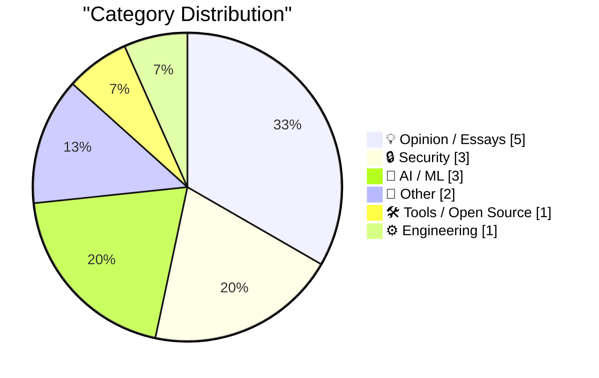
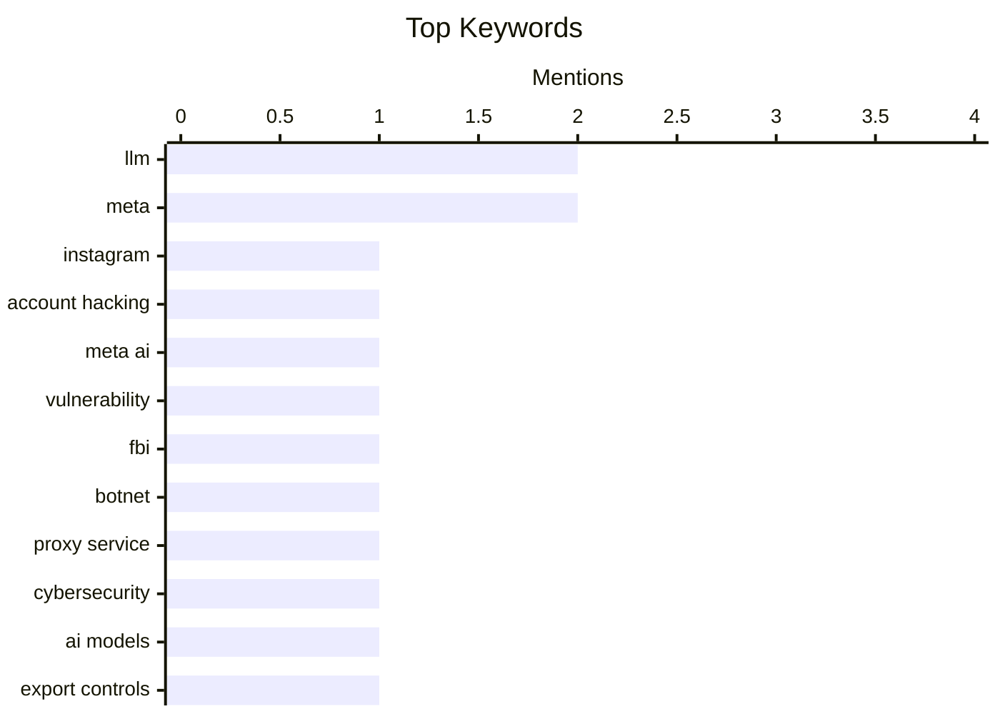

## Today's Highlights
Today's tech highlights reveal a dual focus on escalating cybersecurity threats and the relentless advancement of AI. Hackers are exploiting AI itself to compromise user accounts, as seen with Instagram, while law enforcement targets major cybercrime infrastructure. Concurrently, the AI development front is bustling with new tools for evaluating and enhancing large language models, including specialized coding agents. This rapid evolution comes as major tech companies face internal scrutiny over their engineering direction and the ongoing challenge of data privacy persists.
---
## Must Read Today
1. **Hackers Stole Instagram Accounts Simply by Asking Meta AI to Give Them Access**
[Hackers Stole Instagram Accounts Simply by Asking Meta AI to Give Them Access](https://www.404media.co/hackers-simply-asked-meta-ai-to-give-them-access-to-high-profile-instagram-accounts-it-worked/) — daringfireball.net · 22h ago · 🔒 Security
> Hackers Stole Instagram Accounts Simply by Asking Meta AI to Give Them Access
🏷️ Instagram, Account hacking, Meta AI, Vulnerability
2. **FBI Seizes NetNut Proxy Platform, Popa Botnet**
[FBI Seizes NetNut Proxy Platform, Popa Botnet](https://krebsonsecurity.com/2026/07/fbi-seizes-netnut-proxy-platform-popa-botnet/) — krebsonsecurity.com · 18h ago · 🔒 Security
> FBI Seizes NetNut Proxy Platform, Popa Botnet
🏷️ FBI, botnet, proxy service, cybersecurity
3. **Claude Fable and Kayfabe**
[Claude Fable and Kayfabe](https://www.anthropic.com/news/redeploying-fable-5) — daringfireball.net · 19h ago · 🤖 AI / ML
> Claude Fable and Kayfabe
🏷️ AI models, Export controls, Anthropic, Regulation
---
## Data Overview
| Sources Scanned | Articles Fetched | Time Window | Selected |
|:---:|:---:|:---:|:---:|
| 88/92 | 2588 -> 20 | 24h | **15** |
### Category Distribution

### Top Keywords

<details>
<summary>Plain Text Keyword Chart (Terminal Friendly)</summary>
```
llm             │ ████████████████████ 2
meta            │ ████████████████████ 2
instagram       │ ██████████░░░░░░░░░░ 1
account hacking │ ██████████░░░░░░░░░░ 1
meta ai         │ ██████████░░░░░░░░░░ 1
vulnerability   │ ██████████░░░░░░░░░░ 1
fbi             │ ██████████░░░░░░░░░░ 1
botnet          │ ██████████░░░░░░░░░░ 1
proxy service   │ ██████████░░░░░░░░░░ 1
cybersecurity   │ ██████████░░░░░░░░░░ 1
```
</details>
### Topic Tags
**llm**(2) · **meta**(2) · **instagram**(1) · account hacking(1) · meta ai(1) · vulnerability(1) · fbi(1) · botnet(1) · proxy service(1) · cybersecurity(1) · ai models(1) · export controls(1) · anthropic(1) · regulation(1) · dspy(1) · prompt engineering(1) · evaluation(1) · engineering culture(1) · productivity(1) · performative work(1)
---
## Opinion / Essays
### 1. ‘Why Is Meta Destroying Its Engineering Organization?’
[‘Why Is Meta Destroying Its Engineering Organization?’](https://newsletter.pragmaticengineer.com/p/why-is-meta-destroying-its-engineering) — **daringfireball.net** · 20h ago · ⭐ 26/30
> ‘Why Is Meta Destroying Its Engineering Organization?’
🏷️ Meta, Engineering culture, Productivity, Performative work
---
### 2. Understand to participate
[Understand to participate](https://simonwillison.net/2026/Jul/2/understand-to-participate/#atom-everything) — **simonwillison.net** · 20h ago · ⭐ 22/30
> Understand to participate
🏷️ AI agents, collaboration, human-AI
---
### 3. MG Siegler Got Banned From WhatsApp for No Reason
[MG Siegler Got Banned From WhatsApp for No Reason](https://spyglass.org/whatsapp-ban/) — **daringfireball.net** · 21h ago · ⭐ 21/30
> MG Siegler reports being inexplicably banned from WhatsApp for the third time in as many years, without any explanation or warning from Meta. He suspects the ban is directly tied to his claiming of a new username on WhatsApp, a feature recently opened by Meta. After claiming his username, he was logged out of other active instances and subsequently banned upon attempting to log back in, receiving only a generic "This account can no longer use WhatsApp" message. This incident highlights WhatsApp's opaque account management policies and the lack of user recourse for arbitrary bans.
🏷️ WhatsApp, Account ban, Meta, Usernames
---
### 4. This Page Left Intentionally Blank
[This Page Left Intentionally Blank](https://blog.jim-nielsen.com/2026/intentionally-blank/) — **blog.jim-nielsen.com** · 19h ago · ⭐ 19/30
> The article explores the concept of "This Page Intentionally Left Blank" as an act of creativity and intentional design, inspired by the "This Page Intentionally Left Blank"-Project. The author connects this idea to negation as a creative act, referencing how printed manuals historically included such blank pages. These seemingly empty spaces serve a deliberate purpose, preventing misinterpretation of missing content and sometimes offering space for user notes. Ultimately, intentionally blank spaces, whether in physical documents or digital design, can be a purposeful and creative choice, serving functional roles beyond mere emptiness.
🏷️ Creativity, Negation, Design, Philosophy
---
### 5. Truth Social Is Still Just Trump’s Blog
[Truth Social Is Still Just Trump’s Blog](https://daringfireball.net/2025/06/truth_social_is_just_trumps_blog) — **daringfireball.net** · 18h ago · ⭐ 14/30
> The article asserts that Truth Social primarily functions as a personal blog for Donald Trump, with minimal engagement from other key political figures. The author observes that even members of the Trump administration, such as Commerce Secretary Howard Lutnick, prefer using Twitter/X for official communications, like announcing the release of Anthropic's Claude Fable 5. This reinforces the long-standing observation that Trump is virtually the sole active high-profile user on Truth Social. Despite its aspirations as a social media platform, Truth Social has failed to attract a broader base of influential users and remains largely a one-man show.
🏷️ Truth Social, Trump, social media
---
## Security
### 6. Hackers Stole Instagram Accounts Simply by Asking Meta AI to Give Them Access
[Hackers Stole Instagram Accounts Simply by Asking Meta AI to Give Them Access](https://www.404media.co/hackers-simply-asked-meta-ai-to-give-them-access-to-high-profile-instagram-accounts-it-worked/) — **daringfireball.net** · 22h ago · ⭐ 29/30
> Hackers Stole Instagram Accounts Simply by Asking Meta AI to Give Them Access
🏷️ Instagram, Account hacking, Meta AI, Vulnerability
---
### 7. FBI Seizes NetNut Proxy Platform, Popa Botnet
[FBI Seizes NetNut Proxy Platform, Popa Botnet](https://krebsonsecurity.com/2026/07/fbi-seizes-netnut-proxy-platform-popa-botnet/) — **krebsonsecurity.com** · 18h ago · ⭐ 28/30
> FBI Seizes NetNut Proxy Platform, Popa Botnet
🏷️ FBI, botnet, proxy service, cybersecurity
---
### 8. Swimming Pools, Pee, and Trying to Delete Your Data From the Internet
[Swimming Pools, Pee, and Trying to Delete Your Data From the Internet](https://www.troyhunt.com/swimming-pools-pee-and-trying-to-delete-your-data-from-the-internet/) — **troyhunt.com** · 7h ago · ⭐ 26/30
> Swimming Pools, Pee, and Trying to Delete Your Data From the Internet
🏷️ Data privacy, Digital footprint, Data deletion, Internet security
---
## AI / ML
### 9. Claude Fable and Kayfabe
[Claude Fable and Kayfabe](https://www.anthropic.com/news/redeploying-fable-5) — **daringfireball.net** · 19h ago · ⭐ 27/30
> Claude Fable and Kayfabe
🏷️ AI models, Export controls, Anthropic, Regulation
---
### 10. Using DSPy to evaluate and improve Datasette Agent's SQL system prompts
[Using DSPy to evaluate and improve Datasette Agent's SQL system prompts](https://simonwillison.net/2026/Jul/2/dspy-datasette-agent-prompts/#atom-everything) — **simonwillison.net** · 19h ago · ⭐ 26/30
> Using DSPy to evaluate and improve Datasette Agent's SQL system prompts
🏷️ DSPy, LLM, prompt engineering, evaluation
---
### 11. llm-coding-agent 0.1a0
[llm-coding-agent 0.1a0](https://simonwillison.net/2026/Jul/2/llm-coding-agent/#atom-everything) — **simonwillison.net** · 18h ago · ⭐ 24/30
> llm-coding-agent 0.1a0
🏷️ LLM, coding agent, open source, release
---
## Other
### 12. April Report From Ookla: ‘A Return to mmWave 5G’
[April Report From Ookla: ‘A Return to mmWave 5G’](https://www.ookla.com/articles/a-return-to-mmwave-5g) — **daringfireball.net** · 15h ago · ⭐ 19/30
> This article discusses the continued growth and relevance of mmWave 5G networks, particularly in the U.S., despite many other countries prioritizing mid-band spectrum. New drive test data from Ookla’s RootMetrics, combined with crowdsourced information from Ookla’s Speedtest Insights, demonstrates the ongoing expansion of mmWave 5G networks. While international regulators focused on releasing mid-band spectrum, the U.S. has maintained its commitment to mmWave, indicating its persistent role in delivering high-speed 5G capabilities. The report suggests that mmWave 5G, though not universally adopted, remains a significant component of the 5G infrastructure, especially in specific markets.
🏷️ 5G, mmWave, Ookla, telecom
---
### 13. Compute!’s Gazette magazine, 1983-1995
[Compute!’s Gazette magazine, 1983-1995](https://dfarq.homeip.net/computes-gazette-magazine-1983-1995/?utm_source=rss&#038;utm_medium=rss&#038;utm_campaign=computes-gazette-magazine-1983-1995) — **dfarq.homeip.net** · 3h ago · ⭐ 17/30
> This article provides a brief historical overview of Compute!’s Gazette, a prominent Commodore computer magazine published from 1983 to 1995. Launched in July 1983 as an offshoot of the general computer magazine Compute!, Gazette quickly achieved success. It specifically catered to Commodore computer users, becoming a favorite among enthusiasts during its 12-year run. Compute!’s Gazette was a significant publication for Commodore users, reflecting the vibrant personal computing culture of the 1980s and early 1990s.
🏷️ Retro computing, Commodore, Computer magazine, History
---
## Tools / Open Source
### 14. Introducing the Safari MCP Server for Web Developers
[Introducing the Safari MCP Server for Web Developers](https://webkit.org/blog/18136/introducing-the-safari-mcp-server-for-web-developers/) — **daringfireball.net** · 16h ago · ⭐ 25/30
> Introducing the Safari MCP Server for Web Developers
🏷️ Safari, WebKit, web development, debugging
---
## Engineering
### 15. Pluralistic: CARDiac, syntax coloring, view source and vibe code (03 Jul 2026)
[Pluralistic: CARDiac, syntax coloring, view source and vibe code (03 Jul 2026)](https://pluralistic.net/2026/07/03/rod-logic/) — **pluralistic.net** · 5h ago · ⭐ 22/30
> Pluralistic: CARDiac, syntax coloring, view source and vibe code (03 Jul 2026)
🏷️ Abstraction, Syntax coloring, View source, Copyright
---
*Generated at 2026-07-03 14:01 | Scanned 88 sources -> 2588 articles -> selected 15*
*Based on the [Hacker News Popularity Contest 2025](https://refactoringenglish.com/tools/hn-popularity/) RSS source list recommended by [Andrej Karpathy](https://x.com/karpathy)*
*Produced by Dongdianr AI. Follow the same-name WeChat public account for more AI practical tips 💡*
