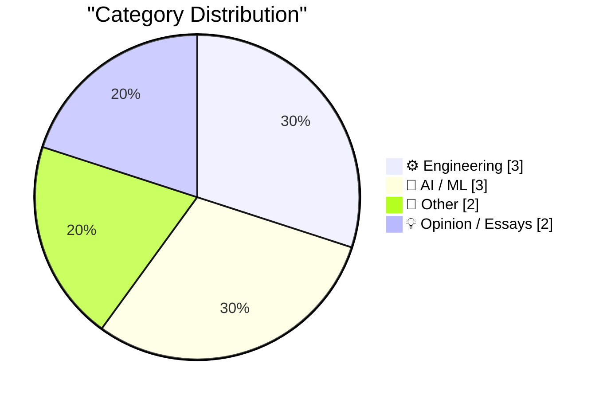
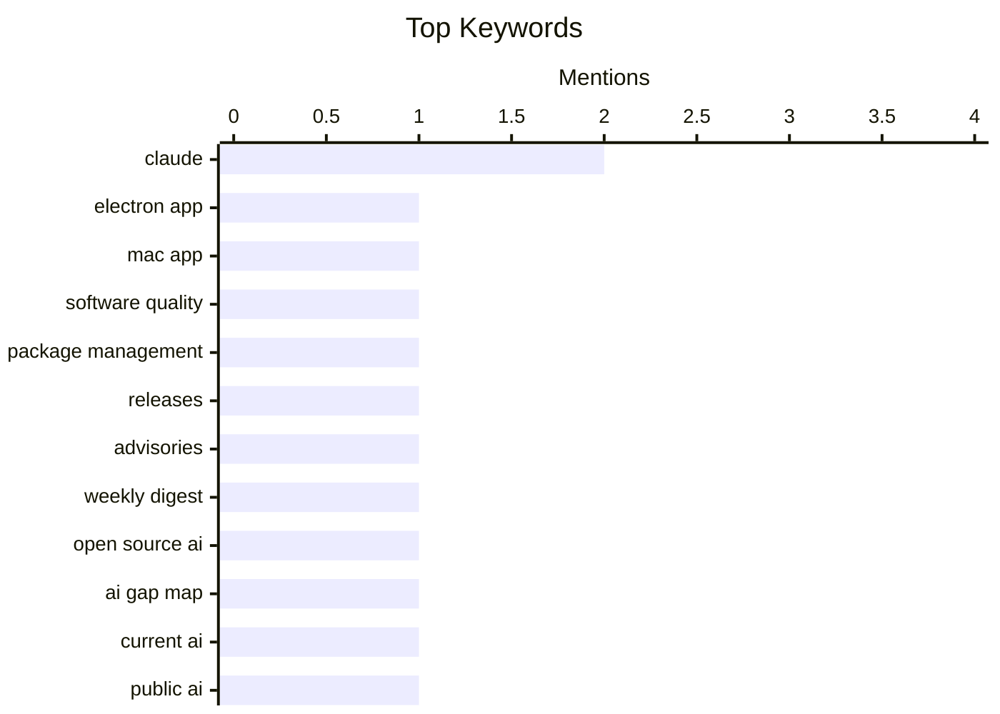

## Today's Highlights
Today's tech news highlights the multifaceted evolution of artificial intelligence, from deep dives into data's impact on models and strategies for interacting with advanced AIs, to new initiatives mapping gaps in the open-source AI landscape. Simultaneously, the software engineering realm continues to innovate with combined barcode technologies and refine essential infrastructure like package management. However, challenges persist, as evidenced by critical reviews of AI application quality and observations of declining product sales, signaling a dynamic market environment.
---
## Must Read Today
1. **★ Claude’s Criminally Bad Electron Mac App Is an Inside Job**
[★ Claude’s Criminally Bad Electron Mac App Is an Inside Job](https://daringfireball.net/2026/07/claudes_criminally_bad_mac_app_is_an_inside_job) — daringfireball.net · 16h ago · ⚙️ Engineering
> The article speculates on the underlying reason for Claude's Mac app being built with Electron, despite its perceived poor performance. It suggests the choice is an "inside job," linking it directly to Felix Rieseberg, a prominent figure in Electron development known for Electron Fiddle and his work on Electron for VS Code. The author sarcastically implies that Rieseberg's influence led to the Electron decision, comparing it to a hammer manufacturer owning a construction company where all screws are hammered. This suggests the technical decision was driven by internal connections rather than optimal performance or user experience considerations. The article concludes that the use of Electron for the Claude app likely stems from specific internal relationships and expertise rather than a purely technical evaluation.
💡 **Why read it**: It offers a provocative, speculative, and humorous take on the technical decisions behind a major AI product's desktop application, highlighting potential non-technical influences.
🏷️ Claude, Electron app, Mac app, Software quality
2. **This Week in Package Management: 4 July 2026**
[This Week in Package Management: 4 July 2026](https://nesbitt.io/2026/07/04/this-week-in-package-management.html) — nesbitt.io · 4h ago · ⚙️ Engineering
> This article serves as a weekly digest, compiling the latest releases, security advisories, and notable articles from across the package management world. It aims to keep developers and system administrators informed about critical updates and potential vulnerabilities. The content covers various package management tools and platforms, ensuring a broad overview of the ecosystem's health and evolution. The post provides a concise overview of the most important news and updates in package management for the week of July 4, 2026. This resource helps readers quickly grasp significant developments without sifting through numerous individual announcements.
💡 **Why read it**: It's a valuable resource for developers and system administrators to stay current with critical updates and security information in the package management ecosystem.
🏷️ Package management, Releases, Advisories, Weekly digest
3. **Open Source AI Gap Map**
[Open Source AI Gap Map](https://simonwillison.net/2026/Jul/3/open-source-ai-gap-map/#atom-everything) — simonwillison.net · 15h ago · 🤖 AI / ML
> The article introduces the "Open Source AI Gap Map," a new initiative by Current AI aimed at identifying and addressing crucial voids in the open-source AI landscape. Current AI, a non-profit founded in February 2025 at the AI Action Summit in Paris with $400 million committed, launched this map to index the current state of open-source AI. The project's goal is to build a "public option for AI" by systematically highlighting areas needing more development and investment. This strategic mapping effort seeks to foster a more robust, equitable, and publicly accessible AI ecosystem. The Open Source AI Gap Map aims to systematically identify and fill crucial voids in open-source AI development, fostering a more robust and publicly accessible AI ecosystem.
💡 **Why read it**: It highlights a significant new initiative backed by substantial funding to strategically advance open-source AI development by mapping its current state and identifying gaps.
🏷️ Open Source AI, AI Gap Map, Current AI, Public AI
---
## Data Overview
| Sources Scanned | Articles Fetched | Time Window | Selected |
|:---:|:---:|:---:|:---:|
| 88/92 | 2588 -> 10 | 24h | **10** |
### Category Distribution

### Top Keywords

<details>
<summary>Plain Text Keyword Chart (Terminal Friendly)</summary>
```
claude             │ ████████████████████ 2
electron app       │ ██████████░░░░░░░░░░ 1
mac app            │ ██████████░░░░░░░░░░ 1
software quality   │ ██████████░░░░░░░░░░ 1
package management │ ██████████░░░░░░░░░░ 1
releases           │ ██████████░░░░░░░░░░ 1
advisories         │ ██████████░░░░░░░░░░ 1
weekly digest      │ ██████████░░░░░░░░░░ 1
open source ai     │ ██████████░░░░░░░░░░ 1
ai gap map         │ ██████████░░░░░░░░░░ 1
```
</details>
### Topic Tags
**claude**(2) · **electron app**(1) · **mac app**(1) · software quality(1) · package management(1) · releases(1) · advisories(1) · weekly digest(1) · open source ai(1) · ai gap map(1) · current ai(1) · public ai(1) · ai models(1) · fable(1) · ai engineering(1) · bayesian statistics(1) · posterior variance(1) · confidence interval(1) · data analysis(1) · ai chips(1)
---
## Engineering
### 1. ★ Claude’s Criminally Bad Electron Mac App Is an Inside Job
[★ Claude’s Criminally Bad Electron Mac App Is an Inside Job](https://daringfireball.net/2026/07/claudes_criminally_bad_mac_app_is_an_inside_job) — **daringfireball.net** · 16h ago · ⭐ 26/30
> The article speculates on the underlying reason for Claude's Mac app being built with Electron, despite its perceived poor performance. It suggests the choice is an "inside job," linking it directly to Felix Rieseberg, a prominent figure in Electron development known for Electron Fiddle and his work on Electron for VS Code. The author sarcastically implies that Rieseberg's influence led to the Electron decision, comparing it to a hammer manufacturer owning a construction company where all screws are hammered. This suggests the technical decision was driven by internal connections rather than optimal performance or user experience considerations. The article concludes that the use of Electron for the Claude app likely stems from specific internal relationships and expertise rather than a purely technical evaluation.
🏷️ Claude, Electron app, Mac app, Software quality
---
### 2. This Week in Package Management: 4 July 2026
[This Week in Package Management: 4 July 2026](https://nesbitt.io/2026/07/04/this-week-in-package-management.html) — **nesbitt.io** · 4h ago · ⭐ 26/30
> This article serves as a weekly digest, compiling the latest releases, security advisories, and notable articles from across the package management world. It aims to keep developers and system administrators informed about critical updates and potential vulnerabilities. The content covers various package management tools and platforms, ensuring a broad overview of the ecosystem's health and evolution. The post provides a concise overview of the most important news and updates in package management for the week of July 4, 2026. This resource helps readers quickly grasp significant developments without sifting through numerous individual announcements.
🏷️ Package management, Releases, Advisories, Weekly digest
---
### 3. Combined 1D and 2D Barcodes
[Combined 1D and 2D Barcodes](https://shkspr.mobi/blog/2026/07/combined-1d-and-2d-barcodes/) — **shkspr.mobi** · 2h ago · ⭐ 16/30
> The article explores the innovative idea of combining traditional 1D barcodes (like UPCs) with modern 2D QR codes, anticipating the latter's eventual replacement of the former. The author, unable to find existing examples, decided to create a QR code with an embedded UPC. The design allows a phone to read the 1D number when held close (obscuring the QR corners) and the full 2D data when held further away. This hybrid approach aims to bridge the transition between the two barcode technologies, offering backward compatibility. A novel hybrid barcode design can integrate both 1D and 2D information, offering backward compatibility while facilitating the shift towards QR codes.
🏷️ Barcodes, QR Code, UPC, Data encoding
---
## AI / ML
### 4. Open Source AI Gap Map
[Open Source AI Gap Map](https://simonwillison.net/2026/Jul/3/open-source-ai-gap-map/#atom-everything) — **simonwillison.net** · 15h ago · ⭐ 24/30
> The article introduces the "Open Source AI Gap Map," a new initiative by Current AI aimed at identifying and addressing crucial voids in the open-source AI landscape. Current AI, a non-profit founded in February 2025 at the AI Action Summit in Paris with $400 million committed, launched this map to index the current state of open-source AI. The project's goal is to build a "public option for AI" by systematically highlighting areas needing more development and investment. This strategic mapping effort seeks to foster a more robust, equitable, and publicly accessible AI ecosystem. The Open Source AI Gap Map aims to systematically identify and fill crucial voids in open-source AI development, fostering a more robust and publicly accessible AI ecosystem.
🏷️ Open Source AI, AI Gap Map, Current AI, Public AI
---
### 5. Fable's judgement
[Fable's judgement](https://simonwillison.net/2026/Jul/3/judgement/#atom-everything) — **simonwillison.net** · 19h ago · ⭐ 23/30
> The article discusses an effective strategy for interacting with advanced AI models like Claude Fable and Opus, emphasizing the importance of allowing them autonomy. Based on insights from the Claude Code team at AIE, the recommendation is to let Fable (and Opus) use their own "judgement" rather than providing overly prescriptive instructions. An example given is allowing Fable to decide when to use automated testing for larger features, rather than dictating the specific testing approach. This approach suggests that empowering advanced AI models with more autonomy can lead to better outcomes than micromanaging their processes. Trusting their internal decision-making capabilities can optimize their performance and efficiency.
🏷️ Claude, AI models, Fable, AI engineering
---
### 6. Does additional data always reduce posterior variance?
[Does additional data always reduce posterior variance?](https://www.johndcook.com/blog/2026/07/03/does-additional-data-always-reduce-posterior-variance/) — **johndcook.com** · 11h ago · ⭐ 21/30
> The article investigates whether adding more data invariably leads to a reduction in the posterior variance of an estimate within a Bayesian framework. While intuition suggests more data reduces uncertainty, the discussion explores nuances where this might not always hold true for confidence intervals. From a Bayesian perspective, new information generally concentrates the posterior distribution, thereby reducing uncertainty. However, the post implies that the relationship between additional data and the size of confidence intervals can be more complex than a simple monotonic decrease, requiring closer examination of specific conditions. Although new data typically reduces Bayesian posterior uncertainty, the relationship between additional data and the size of confidence intervals can be more complex than a simple monotonic decrease.
🏷️ Bayesian statistics, Posterior variance, Confidence interval, Data analysis
---
## Other
### 7. Reading List 07/04/26
[Reading List 07/04/26](https://www.construction-physics.com/p/reading-list-070426) — **construction-physics.com** · 1h ago · ⭐ 20/30
> This article presents a curated reading list covering diverse topics relevant to construction, technology, and economics for July 4, 2026. The list includes articles on subjects such as households lacking homeowners insurance, international crackdowns on AI chip smuggling, and the historical and practical implications of Japan's two electrical frequencies. It also features a piece on Meta's strategic expansion into the AI compute business. This compilation aggregates disparate but interesting news items, offering insights into economic, technological, and infrastructure-related developments. The reading list provides a broad overview of current events and trends across multiple sectors.
🏷️ AI chips, Meta AI, Reading list, Industry news
---
### 8. June 2026 newsletter
[June 2026 newsletter](https://simonwillison.net/2026/Jul/3/june-newsletter/#atom-everything) — **simonwillison.net** · 23h ago · ⭐ 11/30
> This article announces the release of the June 2026 sponsors-only monthly newsletter by Simon Willison, summarizing its key topics. The newsletter covers significant AI model updates, including Claude Fable 5, GPT-5.6, and GLM-5.2, which is noted as the new best open-weights model. It also discusses US export restrictions impacting AI and touches on the "tokenmaxxing is so over" trend. Additionally, the newsletter provides updates on Datasette Apps and `sqlite-utils`, offering insights into open-source tools. The June 2026 newsletter provides a comprehensive update on critical developments in AI models, open-source tools, and related industry trends for Simon Willison's sponsors.
🏷️ Newsletter, Simon Willison, Monthly update
---
## Opinion / Essays
### 9. Quoting Josh W. Comeau
[Quoting Josh W. Comeau](https://simonwillison.net/2026/Jul/3/josh-w-comeau/#atom-everything) — **simonwillison.net** · 16h ago · ⭐ 16/30
> The article highlights Josh W. Comeau's observation about a significant decline in sales for his programming courses, attributing it largely to the impact of AI. Comeau reported that his third course, "Whimsical Animations," sold only about one-third as many copies as typical launches, with similar drops for existing courses. He identifies a "double whammy" from AI: people question the need for developer skills, and AI tools can generate code, reducing the perceived value of learning from courses. This trend suggests a fundamental shift in the market for developer education. The rise of AI is significantly impacting the market for developer education, leading to reduced demand for traditional coding courses as AI tools provide alternative solutions and raise questions about future skill relevance.
🏷️ Course sales, Developer education, Josh Comeau, Market trends
---
### 10. The Life and Times of Maxis, Part 1: SimEverything
[The Life and Times of Maxis, Part 1: SimEverything](https://www.filfre.net/2026/07/the-life-and-times-of-maxis-part-1-simeverything/) — **filfre.net** · 22h ago · ⭐ 16/30
> This article is the first part of a historical account detailing the origins and early days of Maxis Software, focusing on its "SimEverything" philosophy. It delves into the company's founding principles, heavily influenced by Will Wright's fascination with complex systems like continental drift. This curiosity translated into games like SimCity, which allowed players to simulate and understand intricate real-world phenomena. The piece emphasizes the dedication of gamers to preserving their hobby's history, highlighting the lasting impact of Maxis's approach. Maxis Software's early success stemmed from Will Wright's unique vision to create games that allowed players to explore and interact with complex simulations, fostering a deep connection with the underlying systems.
🏷️ Maxis Software, Will Wright, Game history, SimCity
---
*Generated at 2026-07-04 14:01 | Scanned 88 sources -> 2588 articles -> selected 10*
*Based on the [Hacker News Popularity Contest 2025](https://refactoringenglish.com/tools/hn-popularity/) RSS source list recommended by [Andrej Karpathy](https://x.com/karpathy)*
*Produced by Dongdianr AI. Follow the same-name WeChat public account for more AI practical tips 💡*
