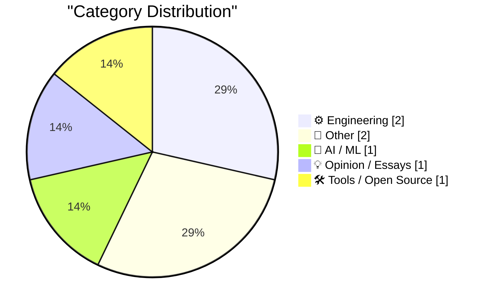
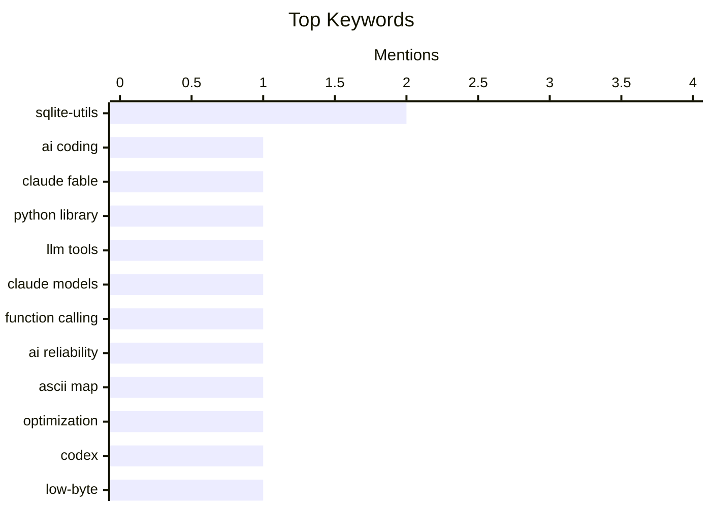

## Today's Highlights
Today's tech highlights underscore the increasingly complex role of AI in development, from efficiently writing code for tools like sqlite-utils and assisting in building a 500-byte world map, to creating a paradox where advanced models outpace their user tools. Simultaneously, the broader software landscape continues to evolve, marked by new app features such as calendar mirroring and ongoing debates about the impact of cross-platform solutions like Electron versus native applications. This reflects a dynamic environment driven by both AI innovation and a persistent focus on app quality and user experience.
---
## Must Read Today
1. **sqlite-utils 4.0rc2, mostly written by Claude Fable (for about $149.25)**
[sqlite-utils 4.0rc2, mostly written by Claude Fable (for about $149.25)](https://simonwillison.net/2026/Jul/5/sqlite-utils-fable/#atom-everything) — simonwillison.net · 13h ago · ⚙️ Engineering
> This article details the process of using Claude Fable, an AI model, to finalize the `sqlite-utils 4.0rc2` release, aiming for a stable SemVer-compliant major version. The author leveraged Claude Fable, costing approximately $149.25, to assist in development and refinement. This involved using specific prompts to guide the AI in generating code and addressing issues for the `sqlite-utils` library, aiming for a robust release candidate before the Claude Fable subscription ended. AI models like Claude Fable can significantly accelerate and assist in software development, even for complex library releases, demonstrating a cost-effective development aid.
💡 **Why read it**: It offers a practical case study on leveraging an AI model (Claude Fable) for significant software development work, including cost analysis and efficiency gains.
🏷️ sqlite-utils, AI coding, Claude Fable, Python library
2. **Better Models: Worse Tools**
[Better Models: Worse Tools](https://simonwillison.net/2026/Jul/4/better-models-worse-tools/#atom-everything) — simonwillison.net · 15h ago · 🤖 AI / ML
> The article highlights a paradoxical issue where advanced AI models, specifically Claude Opus 4.8, generate tool calls with invented, non-schema-compliant fields, leading to "worse tools" despite "better models." Armin encountered this problem while working on Pi, observing that Opus 4.8 would add extra, invented fields within the `edits[]` array of its edit tool calls. While the core edit might be correct, the arguments did not match the expected schema, indicating a hallucination or over-creativity issue in tool usage, a behavior not seen in smaller models like Haiku. Even highly capable AI models can struggle with precise tool schema adherence, potentially complicating automated workflows and requiring robust error handling for unexpected tool call arguments.
💡 **Why read it**: It exposes a critical, counter-intuitive problem in AI model development where more advanced models can exhibit worse tool-use reliability due to schema non-compliance.
🏷️ LLM tools, Claude models, function calling, AI reliability
3. **Building a World Map with only 500 bytes**
[Building a World Map with only 500 bytes](https://simonwillison.net/2026/Jul/4/building-a-world-map-with-only-500-bytes/#atom-everything) — simonwillison.net · 14h ago · ⚙️ Engineering
> Iwo Kadziela, with AI assistance from Codex, developed a method to generate a credible ASCII world map using an extremely small data footprint of under 500 bytes. The core innovation involves using deflate compression to store geographical data efficiently, resulting in a 445-byte dataset. This compressed data is then decompressed and rendered as ASCII characters, producing a visually recognizable world map. Highly efficient data compression, specifically deflate, can enable the creation of complex visual outputs like world maps from remarkably small data sizes, even for ASCII representations.
💡 **Why read it**: It showcases an impressive technical feat in data compression and visualization, demonstrating how to render a complex image like a world map with minimal data (445 bytes).
🏷️ ASCII map, optimization, Codex, low-byte
---
## Data Overview
| Sources Scanned | Articles Fetched | Time Window | Selected |
|:---:|:---:|:---:|:---:|
| 88/92 | 2588 -> 7 | 24h | **7** |
### Category Distribution

### Top Keywords

<details>
<summary>Plain Text Keyword Chart (Terminal Friendly)</summary>
```
sqlite-utils     │ ████████████████████ 2
ai coding        │ ██████████░░░░░░░░░░ 1
claude fable     │ ██████████░░░░░░░░░░ 1
python library   │ ██████████░░░░░░░░░░ 1
llm tools        │ ██████████░░░░░░░░░░ 1
claude models    │ ██████████░░░░░░░░░░ 1
function calling │ ██████████░░░░░░░░░░ 1
ai reliability   │ ██████████░░░░░░░░░░ 1
ascii map        │ ██████████░░░░░░░░░░ 1
optimization     │ ██████████░░░░░░░░░░ 1
```
</details>
### Topic Tags
**sqlite-utils**(2) · **ai coding**(1) · **claude fable**(1) · python library(1) · llm tools(1) · claude models(1) · function calling(1) · ai reliability(1) · ascii map(1) · optimization(1) · codex(1) · low-byte(1) · electron(1) · native apps(1) · cross-platform(1) · macos(1) · release(1) · fantastical(1) · calendar app(1) · privacy(1)
---
## Engineering
### 1. sqlite-utils 4.0rc2, mostly written by Claude Fable (for about $149.25)
[sqlite-utils 4.0rc2, mostly written by Claude Fable (for about $149.25)](https://simonwillison.net/2026/Jul/5/sqlite-utils-fable/#atom-everything) — **simonwillison.net** · 13h ago · ⭐ 26/30
> This article details the process of using Claude Fable, an AI model, to finalize the `sqlite-utils 4.0rc2` release, aiming for a stable SemVer-compliant major version. The author leveraged Claude Fable, costing approximately $149.25, to assist in development and refinement. This involved using specific prompts to guide the AI in generating code and addressing issues for the `sqlite-utils` library, aiming for a robust release candidate before the Claude Fable subscription ended. AI models like Claude Fable can significantly accelerate and assist in software development, even for complex library releases, demonstrating a cost-effective development aid.
🏷️ sqlite-utils, AI coding, Claude Fable, Python library
---
### 2. Building a World Map with only 500 bytes
[Building a World Map with only 500 bytes](https://simonwillison.net/2026/Jul/4/building-a-world-map-with-only-500-bytes/#atom-everything) — **simonwillison.net** · 14h ago · ⭐ 19/30
> Iwo Kadziela, with AI assistance from Codex, developed a method to generate a credible ASCII world map using an extremely small data footprint of under 500 bytes. The core innovation involves using deflate compression to store geographical data efficiently, resulting in a 445-byte dataset. This compressed data is then decompressed and rendered as ASCII characters, producing a visually recognizable world map. Highly efficient data compression, specifically deflate, can enable the creation of complex visual outputs like world maps from remarkably small data sizes, even for ASCII representations.
🏷️ ASCII map, optimization, Codex, low-byte
---
## Other
### 3. Fantastical 4.1.15 Adds Calendar Mirroring
[Fantastical 4.1.15 Adds Calendar Mirroring](https://flexibits.com/blog/2026/06/double-booked-never-heard-of-it-meet-calendar-mirroring-in-fantastical/) — **daringfireball.net** · 21h ago · ⭐ 16/30
> Fantastical 4.1.15 introduces a new "Calendar Mirroring" feature designed to seamlessly integrate events from two separate calendars, such as work and personal, without compromising privacy. This feature allows users to connect two calendars, automatically displaying events from one on the other. A key design choice is that no event information is transmitted to Flexibits servers or stored off-device, ensuring privacy. Users can choose to show full event details or simply block out time as "Busy" for privacy. Fantastical's Calendar Mirroring offers a privacy-focused solution for managing multiple calendars, enhancing organization without centralizing sensitive event data.
🏷️ Fantastical, calendar app, privacy, app update
---
### 4. Day One Journal
[Day One Journal](https://dayoneapp.com/blog/introducing-daily-chat/) — **daringfireball.net** · 16h ago · ⭐ 9/30
> This article promotes Day One Journal, highlighting its long-standing commitment to technical and design excellence in journaling applications across Mac and iOS platforms. Day One, launched in 2011, is praised for its robust Mac and iOS apps, which are deeply informed by the personal nature of journaling. The app allows users to create multiple separate journals and is noted for its "Mac-assed" Mac app and high-quality iPhone/iPad apps, with "Daily Chat" mentioned as a new feature. Day One Journal continues to be a leading journaling app, distinguished by its strong technical foundation, thoughtful design, and understanding of user needs for personal reflection.
🏷️ Day One, journal app, iOS app
---
## AI / ML
### 5. Better Models: Worse Tools
[Better Models: Worse Tools](https://simonwillison.net/2026/Jul/4/better-models-worse-tools/#atom-everything) — **simonwillison.net** · 15h ago · ⭐ 26/30
> The article highlights a paradoxical issue where advanced AI models, specifically Claude Opus 4.8, generate tool calls with invented, non-schema-compliant fields, leading to "worse tools" despite "better models." Armin encountered this problem while working on Pi, observing that Opus 4.8 would add extra, invented fields within the `edits[]` array of its edit tool calls. While the core edit might be correct, the arguments did not match the expected schema, indicating a hallucination or over-creativity issue in tool usage, a behavior not seen in smaller models like Haiku. Even highly capable AI models can struggle with precise tool schema adherence, potentially complicating automated workflows and requiring robust error handling for unexpected tool call arguments.
🏷️ LLM tools, Claude models, function calling, AI reliability
---
## Opinion / Essays
### 6. From the DF Archive: ‘Electron and the Decline of Native Apps’
[From the DF Archive: ‘Electron and the Decline of Native Apps’](https://daringfireball.net/2018/12/electron_and_the_decline_of_native_apps) — **daringfireball.net** · 18h ago · ⭐ 17/30
> This article, originally from 2018, discusses the author's concern about Electron's negative impact on the quality and prevalence of native applications, particularly on macOS. The author views Electron as a "scourge" that leads to a decline in native app quality, despite the Mac platform attracting users who typically value native experiences. The piece suggests that the Mac's increased popularity paradoxically led to more developers opting for cross-platform solutions like Electron, sacrificing native performance and user experience. Electron, while offering cross-platform convenience, is seen as detrimental to the long-term health and quality of native application ecosystems, especially for platforms like macOS.
🏷️ Electron, native apps, cross-platform, macOS
---
## Tools / Open Source
### 7. sqlite-utils 4.0rc2
[sqlite-utils 4.0rc2](https://simonwillison.net/2026/Jul/5/sqlite-utils/#atom-everything) — **simonwillison.net** · 13h ago · ⭐ 16/30
> This article announces the release of `sqlite-utils 4.0rc2`, a release candidate for the `sqlite-utils` library. The announcement is brief, primarily serving as a pointer to a more detailed companion article. It confirms the availability of `sqlite-utils 4.0rc2` on GitHub, with the linked article elaborating that this release was largely developed with the assistance of Claude Fable. `sqlite-utils 4.0rc2` has been released, with further details on its development process available in a related post.
🏷️ sqlite-utils, release
---
*Generated at 2026-07-05 14:01 | Scanned 88 sources -> 2588 articles -> selected 7*
*Based on the [Hacker News Popularity Contest 2025](https://refactoringenglish.com/tools/hn-popularity/) RSS source list recommended by [Andrej Karpathy](https://x.com/karpathy)*
*Produced by Dongdianr AI. Follow the same-name WeChat public account for more AI practical tips 💡*
