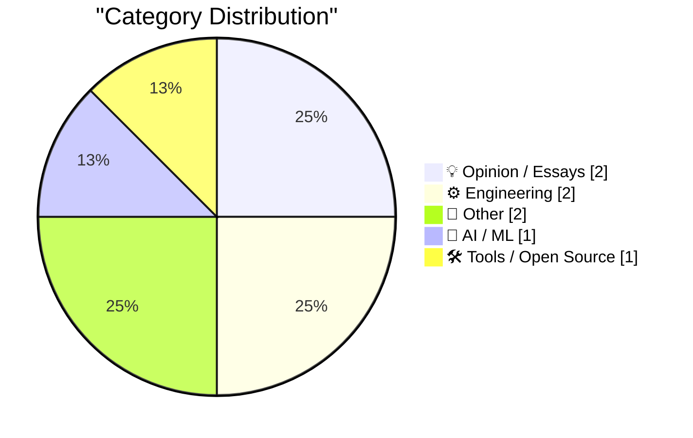
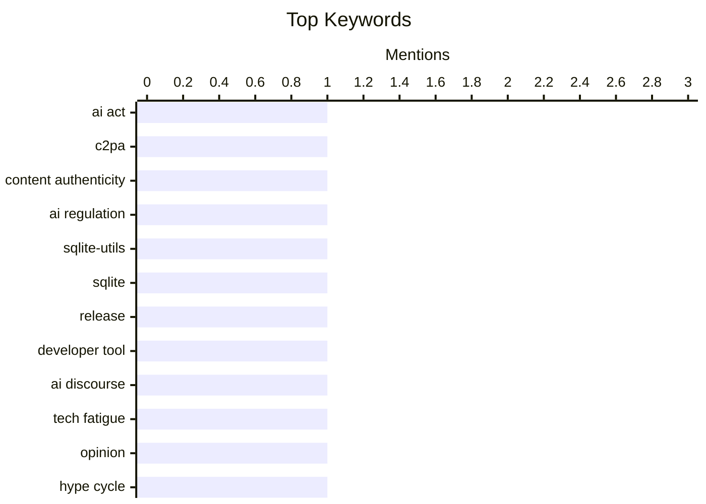

## Today's Highlights
The tech world grapples with the dual nature of AI, as new regulations emerge to mandate identifiable AI-generated content while a palpable fatigue with the constant hype around artificial intelligence sets in. Despite the AI discourse, practical engineering continues its steady march, with updates to core development tools and explorations into fundamental circuit designs. This blend of managing emerging tech and refining foundational work defines the current landscape.
---
## Must Read Today
1. **C2PA only works if everything is signed**
[C2PA only works if everything is signed](https://seangoedecke.com/c2pa-only-works-if-everything-is-signed/) — seangoedecke.com · 14h ago · 🤖 AI / ML
> The EU AI Act mandates that AI-generated content be identifiable, with C2PA emerging as a key standard for digitally signed metadata. While C2PA uses cryptographic signatures to verify content provenance, its effectiveness is severely limited if only AI-generated content is signed. The article argues that for C2PA to effectively combat misinformation, *all* content—both human and AI-generated—must be signed. This universal signing would establish a baseline of trust, making any unsigned content immediately suspect. Ultimately, C2PA's success hinges on widespread, comprehensive adoption of content signing across all media.
💡 **Why read it**: It critically analyzes the practical limitations of the C2PA standard in the context of the EU AI Act, highlighting the necessity of universal content signing for effective provenance verification.
🏷️ AI Act, C2PA, content authenticity, AI regulation
2. **sqlite-utils 4.0rc3**
[sqlite-utils 4.0rc3](https://simonwillison.net/2026/Jul/6/sqlite-utils/#atom-everything) — simonwillison.net · 8h ago · 🛠 Tools / Open Source
> Simon Willison is preparing for the `sqlite-utils 4.0` stable release, with the changelog for `4.0rc3` growing significantly due to ongoing development. The most notable new feature in `4.0rc3` is enhanced support for database introspection, allowing users to query schema information more easily. This release also incorporates numerous bug fixes and improvements, some identified and resolved with assistance from AI tools like Claude Fable 5 and GPT-5.5. The extensive changes since `rc2` indicate a robust development cycle. This release candidate brings substantial new capabilities and fixes, signaling a comprehensive update before the stable `4.0` version.
💡 **Why read it**: It details the progress and key features of `sqlite-utils 4.0rc3`, particularly its enhanced introspection capabilities and the use of AI tools in its development.
🏷️ sqlite-utils, SQLite, release, developer tool
3. **I'm just so bored of AI**
[I'm just so bored of AI](https://shkspr.mobi/blog/2026/07/im-just-so-bored-of-ai/) — shkspr.mobi · 2h ago · 💡 Opinion / Essays
> The author expresses profound boredom and fatigue with the incessant discussion and hype surrounding Artificial Intelligence. The article likens the current AI discourse to repetitive, unoriginal ramblings, similar to listening to new drug users or vapers. It criticizes the perceived lack of novel insights or truly groundbreaking applications beyond basic automation. The author suggests that much of the AI conversation is superficial and overblown, failing to present genuinely revolutionary or fascinating aspects of the technology. Ultimately, the article conveys a weariness with the pervasive and often uninspired conversation around AI, viewing it as repetitive hype rather than substantive innovation.
💡 **Why read it**: It offers a refreshing and critical perspective on the current AI hype cycle, articulating a common sentiment of fatigue with the constant discussion.
🏷️ AI discourse, tech fatigue, opinion, hype cycle
---
## Data Overview
| Sources Scanned | Articles Fetched | Time Window | Selected |
|:---:|:---:|:---:|:---:|
| 87/92 | 2563 -> 8 | 24h | **8** |
### Category Distribution

### Top Keywords

<details>
<summary>Plain Text Keyword Chart (Terminal Friendly)</summary>
```
ai act               │ ████████████████████ 1
c2pa                 │ ████████████████████ 1
content authenticity │ ████████████████████ 1
ai regulation        │ ████████████████████ 1
sqlite-utils         │ ████████████████████ 1
sqlite               │ ████████████████████ 1
release              │ ████████████████████ 1
developer tool       │ ████████████████████ 1
ai discourse         │ ████████████████████ 1
tech fatigue         │ ████████████████████ 1
```
</details>
### Topic Tags
**ai act**(1) · **c2pa**(1) · **content authenticity**(1) · ai regulation(1) · sqlite-utils(1) · sqlite(1) · release(1) · developer tool(1) · ai discourse(1) · tech fatigue(1) · opinion(1) · hype cycle(1) · electronics(1) · circuit design(1) · capacitance(1) · hardware(1) · web development(1) · blog(1) · shuffle feature(1) · javascript(1)
---
## Opinion / Essays
### 1. I'm just so bored of AI
[I'm just so bored of AI](https://shkspr.mobi/blog/2026/07/im-just-so-bored-of-ai/) — **shkspr.mobi** · 2h ago · ⭐ 21/30
> The author expresses profound boredom and fatigue with the incessant discussion and hype surrounding Artificial Intelligence. The article likens the current AI discourse to repetitive, unoriginal ramblings, similar to listening to new drug users or vapers. It criticizes the perceived lack of novel insights or truly groundbreaking applications beyond basic automation. The author suggests that much of the AI conversation is superficial and overblown, failing to present genuinely revolutionary or fascinating aspects of the technology. Ultimately, the article conveys a weariness with the pervasive and often uninspired conversation around AI, viewing it as repetitive hype rather than substantive innovation.
🏷️ AI discourse, tech fatigue, opinion, hype cycle
---
### 2. Amazon Basics, but for intellectual property.
[Amazon Basics, but for intellectual property.](https://idiallo.com/blog/amazon-basics-but-intellectual-property) — **idiallo.com** · 7h ago · ⭐ 18/30
> Amazon faces frequent accusations of leveraging its platform data to create competing "Amazon Basics" products, effectively ripping off third-party merchants. As a service provider, Amazon has access to critical sales metrics and product data from all merchants, creating a significant conflict of interest when it also operates its own private label brands. The article argues that Amazon can identify successful products, replicate them, and then use its platform advantages, such as search placement and pricing data, to undercut original sellers. This practice undermines fair competition and intellectual property rights. Amazon's dual role as a marketplace host and a private label seller creates an inherent conflict of interest, enabling it to exploit merchant data for its own competitive advantage and potentially infringe on intellectual property.
🏷️ Amazon, intellectual property, business ethics, platform abuse
---
## Engineering
### 3. Cursed circuits #5: capacitance multiplier
[Cursed circuits #5: capacitance multiplier](https://lcamtuf.substack.com/p/cursed-circuits-capacitance-multiplier) — **lcamtuf.substack.com** · 18h ago · ⭐ 20/30
> This article introduces the "capacitance multiplier" circuit, a design technique to achieve large effective capacitance without using physically large or expensive capacitors. The circuit employs active components, such as transistors, to make a smaller physical capacitor behave as if it possesses a much greater capacitance. This approach can be cost-effective by replacing a bulky, expensive capacitor with a smaller one combined with other, potentially cheaper, components. The article frames this as a "cursed circuit" due to its unconventional method of component selection and cost optimization. In essence, capacitance multipliers offer an alternative design strategy to achieve high effective capacitance, potentially saving costs on large capacitors by utilizing more active components.
🏷️ electronics, circuit design, capacitance, hardware
---
### 4. Making a Shuffle Button
[Making a Shuffle Button](https://blog.jim-nielsen.com/2026/notes-shuffle/) — **blog.jim-nielsen.com** · 19h ago · ⭐ 20/30
> The author updated the "Shuffle" feature on their notes blog, which currently contains 974 published notes, to improve its random selection of past entries. The previous shuffle implementation likely used a simple random selection, which could lead to repetitive or less engaging note discoveries over time. The update aims to provide a better user experience by potentially introducing more sophisticated randomization logic, ensuring a fresh encounter with older content. The goal is to allow users to "re-encounter some insight from the past" by browsing the extensive archive in a non-linear fashion. The author refined the shuffle functionality to enhance the discovery of their 974 archived notes, aiming for a more engaging and varied random selection experience.
🏷️ web development, blog, shuffle feature, JavaScript
---
## Other
### 5. Why IBM bought Lotus
[Why IBM bought Lotus](https://dfarq.homeip.net/why-ibm-bought-lotus/?utm_source=rss&#038;utm_medium=rss&#038;utm_campaign=why-ibm-bought-lotus) — **dfarq.homeip.net** · 3h ago · ⭐ 17/30
> The article explains the strategic reasons behind IBM's acquisition of Lotus Development for $3.5 billion on July 6, 1995. Lotus Development, once the second-largest software publisher with a $5.5 billion IPO valuation, was primarily known for its flagship spreadsheet product, Lotus 1-2-3. IBM's acquisition was driven by a desire to gain a strong foothold in the burgeoning software market, particularly in office productivity suites and collaborative software, where Lotus Notes was a significant player. This move represented a strategic attempt by IBM to diversify beyond its hardware dominance and compete more effectively with Microsoft. Ultimately, IBM acquired Lotus Development in 1995 to bolster its software portfolio, especially with Lotus 1-2-3 and Lotus Notes, and strengthen its position against competitors like Microsoft in the evolving software industry.
🏷️ IBM, Lotus, acquisition, software history
---
### 6. e approximation
[e approximation](https://www.johndcook.com/blog/2026/07/06/e-approximation/) — **johndcook.com** · 1h ago · ⭐ 14/30
> The article discusses a remarkable rational approximation for the mathematical constant `e`, specifically `e ≈ 2721/1001`. This approximation is noteworthy for its high accuracy, being good to seven, almost eight, significant figures, despite having a relatively small denominator. In contrast, a simpler truncation like `e ≈ 2718/1000` is only accurate to four significant figures. The article highlights that finding such precise rational approximations with small denominators is a non-trivial mathematical pursuit, often involving methods like continued fractions. Ultimately, the approximation `e ≈ 2721/1001` stands out for its exceptional accuracy relative to its denominator size, demonstrating a mathematically elegant way to represent `e` with high precision.
🏷️ mathematics, constant e, approximation, number theory
---
## AI / ML
### 7. C2PA only works if everything is signed
[C2PA only works if everything is signed](https://seangoedecke.com/c2pa-only-works-if-everything-is-signed/) — **seangoedecke.com** · 14h ago · ⭐ 26/30
> The EU AI Act mandates that AI-generated content be identifiable, with C2PA emerging as a key standard for digitally signed metadata. While C2PA uses cryptographic signatures to verify content provenance, its effectiveness is severely limited if only AI-generated content is signed. The article argues that for C2PA to effectively combat misinformation, *all* content—both human and AI-generated—must be signed. This universal signing would establish a baseline of trust, making any unsigned content immediately suspect. Ultimately, C2PA's success hinges on widespread, comprehensive adoption of content signing across all media.
🏷️ AI Act, C2PA, content authenticity, AI regulation
---
## Tools / Open Source
### 8. sqlite-utils 4.0rc3
[sqlite-utils 4.0rc3](https://simonwillison.net/2026/Jul/6/sqlite-utils/#atom-everything) — **simonwillison.net** · 8h ago · ⭐ 24/30
> Simon Willison is preparing for the `sqlite-utils 4.0` stable release, with the changelog for `4.0rc3` growing significantly due to ongoing development. The most notable new feature in `4.0rc3` is enhanced support for database introspection, allowing users to query schema information more easily. This release also incorporates numerous bug fixes and improvements, some identified and resolved with assistance from AI tools like Claude Fable 5 and GPT-5.5. The extensive changes since `rc2` indicate a robust development cycle. This release candidate brings substantial new capabilities and fixes, signaling a comprehensive update before the stable `4.0` version.
🏷️ sqlite-utils, SQLite, release, developer tool
---
*Generated at 2026-07-06 14:01 | Scanned 87 sources -> 2563 articles -> selected 8*
*Based on the [Hacker News Popularity Contest 2025](https://refactoringenglish.com/tools/hn-popularity/) RSS source list recommended by [Andrej Karpathy](https://x.com/karpathy)*
*Produced by Dongdianr AI. Follow the same-name WeChat public account for more AI practical tips 💡*
