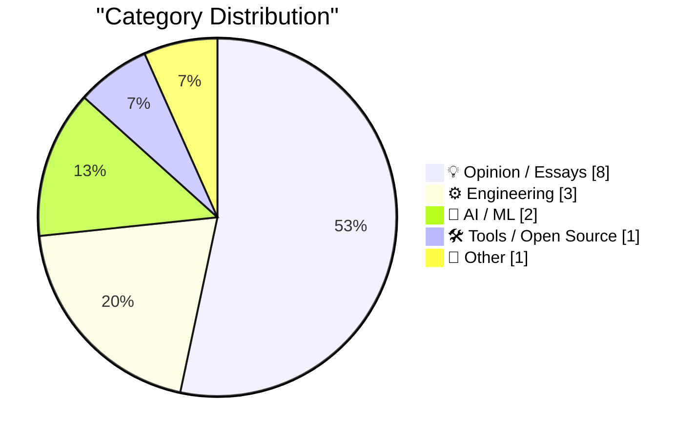
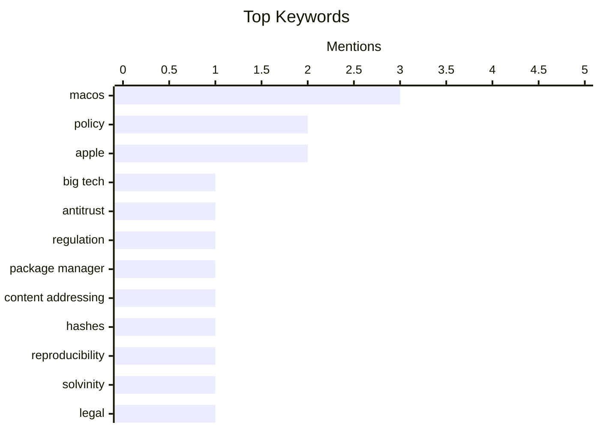

## Today's Highlights
Today's tech headlines reveal a dual focus on reigning in Big Tech and advancing AI capabilities. Regulators and shareholders are intensifying efforts to challenge tech giants, from antitrust strategies to direct actions against major investors like SoftBank. Simultaneously, the AI frontier expands with Tencent's new Hy3 model and continued praise for user-friendly AI experiences like ChatGPT for Mac. Apple's platform also faces scrutiny, with new developer features like Markdown UTIs alongside calls to abandon restrictive design elements such as the "squircle jail" for app icons.
---
## Must Read Today
1. **Pluralistic: How US states and international trustbusters can beat Big Tech (07 Jul 2026)**
[Pluralistic: How US states and international trustbusters can beat Big Tech (07 Jul 2026)](https://pluralistic.net/2026/07/07/going-global/) — pluralistic.net · 1h ago · 💡 Opinion / Essays
> This article discusses strategies for US states and international antitrust regulators to effectively challenge the dominance of Big Tech companies. It highlights that these entities share common adversaries in figures like Trump and the tech giants, suggesting a unified approach is necessary. The piece likely explores legal frameworks, policy coordination, and enforcement mechanisms that can be leveraged across different jurisdictions. The main takeaway is that collaborative efforts between diverse regulatory bodies are crucial for successful antitrust action against powerful technology monopolies.
💡 **Why read it**: It provides insights into potential strategies for global antitrust enforcement against Big Tech, focusing on collaboration between US states and international bodies.
🏷️ Big Tech, Antitrust, Regulation, Policy
2. **Content addressing in package managers**
[Content addressing in package managers](https://nesbitt.io/2026/07/07/content-addressing-in-package-managers.html) — nesbitt.io · 4h ago · ⚙️ Engineering
> This article explores the concept of content addressing as a superior alternative to traditional naming conventions in package managers. It argues that while human-readable names are useful for users, cryptographic hashes provide immutable, verifiable, and globally unique identifiers for software packages. This approach enhances security, reproducibility, and caching efficiency by ensuring that a package's identity is tied directly to its content, preventing tampering or ambiguity. The core takeaway is that content addressing fundamentally improves the reliability and integrity of software supply chains.
💡 **Why read it**: It explains the technical benefits of content addressing using cryptographic hashes for improving package manager security, reproducibility, and efficiency.
🏷️ Package manager, Content addressing, Hashes, Reproducibility
3. **Kort geding aandeelhouders Solvinity**
[Kort geding aandeelhouders Solvinity](https://berthub.eu/articles/posts/kort-geding-aandeelhouder-solvinity/) — berthub.eu · 4h ago · 💡 Opinion / Essays
> This article reports on a preliminary injunction (kort geding) filed by Solvinity shareholders against the Dutch State Secretary for Digital Economy and Sovereignty. The lawsuit centers on the claim that the Dutch government opted not to acquire Solvinity, the company behind DigiD, despite its critical role in national digital infrastructure. The author, who live-blogged the court proceedings, noted discrepancies between court observations and subsequent media coverage. The main conclusion is that the legal dispute highlights significant tensions and strategic disagreements regarding the ownership and control of essential digital services in the Netherlands.
💡 **Why read it**: It offers a unique, first-hand account of a significant legal battle concerning the Dutch government's involvement with a critical digital infrastructure provider, Solvinity.
🏷️ Solvinity, Legal, Digital sovereignty, Policy
---
## Data Overview
| Sources Scanned | Articles Fetched | Time Window | Selected |
|:---:|:---:|:---:|:---:|
| 88/92 | 2589 -> 16 | 24h | **15** |
### Category Distribution

### Top Keywords

<details>
<summary>Plain Text Keyword Chart (Terminal Friendly)</summary>
```
macos              │ ████████████████████ 3
policy             │ █████████████░░░░░░░ 2
apple              │ █████████████░░░░░░░ 2
big tech           │ ███████░░░░░░░░░░░░░ 1
antitrust          │ ███████░░░░░░░░░░░░░ 1
regulation         │ ███████░░░░░░░░░░░░░ 1
package manager    │ ███████░░░░░░░░░░░░░ 1
content addressing │ ███████░░░░░░░░░░░░░ 1
hashes             │ ███████░░░░░░░░░░░░░ 1
reproducibility    │ ███████░░░░░░░░░░░░░ 1
```
</details>
### Topic Tags
**macos**(3) · **policy**(2) · **apple**(2) · big tech(1) · antitrust(1) · regulation(1) · package manager(1) · content addressing(1) · hashes(1) · reproducibility(1) · solvinity(1) · legal(1) · digital sovereignty(1) · softbank(1) · investment(1) · venture capital(1) · masayoshi son(1) · tencent(1) · hy3(1) · moe(1)
---
## Opinion / Essays
### 1. Pluralistic: How US states and international trustbusters can beat Big Tech (07 Jul 2026)
[Pluralistic: How US states and international trustbusters can beat Big Tech (07 Jul 2026)](https://pluralistic.net/2026/07/07/going-global/) — **pluralistic.net** · 1h ago · ⭐ 26/30
> This article discusses strategies for US states and international antitrust regulators to effectively challenge the dominance of Big Tech companies. It highlights that these entities share common adversaries in figures like Trump and the tech giants, suggesting a unified approach is necessary. The piece likely explores legal frameworks, policy coordination, and enforcement mechanisms that can be leveraged across different jurisdictions. The main takeaway is that collaborative efforts between diverse regulatory bodies are crucial for successful antitrust action against powerful technology monopolies.
🏷️ Big Tech, Antitrust, Regulation, Policy
---
### 2. Kort geding aandeelhouders Solvinity
[Kort geding aandeelhouders Solvinity](https://berthub.eu/articles/posts/kort-geding-aandeelhouder-solvinity/) — **berthub.eu** · 4h ago · ⭐ 25/30
> This article reports on a preliminary injunction (kort geding) filed by Solvinity shareholders against the Dutch State Secretary for Digital Economy and Sovereignty. The lawsuit centers on the claim that the Dutch government opted not to acquire Solvinity, the company behind DigiD, despite its critical role in national digital infrastructure. The author, who live-blogged the court proceedings, noted discrepancies between court observations and subsequent media coverage. The main conclusion is that the legal dispute highlights significant tensions and strategic disagreements regarding the ownership and control of essential digital services in the Netherlands.
🏷️ Solvinity, Legal, Digital sovereignty, Policy
---
### 3. Premium: The Hater's Guide To SoftBank
[Premium: The Hater's Guide To SoftBank](https://www.wheresyoured.at/premium-the-haters-guide-to-softbank/) — **wheresyoured.at** · 23h ago · ⭐ 24/30
> This article satirically critiques SoftBank's 46th annual shareholder meeting, particularly focusing on CEO Masayoshi Son's presentation style, described as an "Untethered Goose Game." The piece highlights the unusual and often mocked slides used during the presentation, which have drawn significant attention and amusement from financial commentators like Bryce Elder of the Financial Times. It suggests a critical perspective on SoftBank's recent strategies and public image. The main takeaway is that SoftBank's recent shareholder meetings have become a source of ridicule due to their unconventional presentations and perceived strategic missteps.
🏷️ SoftBank, Investment, Venture Capital, Masayoshi Son
---
### 4. Backblaze Versus Dropbox
[Backblaze Versus Dropbox](https://mjtsai.com/blog/2025/12/19/backblaze-no-longer-backs-up-dropbox/) — **daringfireball.net** · 19h ago · ⭐ 20/30
> This article addresses the significant user concern regarding Backblaze's decision to stop backing up content from online file storage services like Dropbox, iCloud Drive, Google Drive, and Microsoft OneDrive. Backblaze, known for its "back up your entire computer" pitch, previously included these services in its comprehensive backups. The change has led to widespread consternation among users who relied on this feature for a complete data safety net. The main takeaway is that Backblaze's policy shift creates a critical gap in comprehensive backup strategies for users heavily reliant on cloud sync services.
🏷️ Backblaze, Dropbox, Cloud Storage, Backup
---
### 5. Jason Snell Ends His Column, and 28-Year Run, at Macworld
[Jason Snell Ends His Column, and 28-Year Run, at Macworld](https://www.macworld.com/article/3175482) — **daringfireball.net** · 23h ago · ⭐ 19/30
> This article marks the end of Jason Snell's 28-year tenure and column at Macworld, reflecting on his long career covering Apple. Snell began at Macworld in the fall of 1997, a critical period when Apple was near bankruptcy before the launch of the iMac and the "Think Different" campaign. He witnessed Steve Jobs's return and the company's subsequent turnaround, emphasizing the trust Jobs asked from everyone during that uncertain time. The main takeaway is that Snell's departure signifies the end of an era for a prominent voice who chronicled Apple's dramatic resurgence over nearly three decades.
🏷️ Jason Snell, Macworld, Tech Journalism, Apple History
---
### 6. ★ Apple Should Eliminate the App Icon ‘Squircle Jail’
[★ Apple Should Eliminate the App Icon ‘Squircle Jail’](https://daringfireball.net/2026/07/eliminate_app_icon_squircle_jail) — **daringfireball.net** · 15h ago · ⭐ 18/30
> This article argues that Apple should abandon its mandatory "squircle" shape for app icons, which restricts design creativity. The author contends that the unique shape of an icon was historically a crucial and iconic element of its identity, a characteristic now lost due to Apple's enforced uniformity. This design constraint limits developers' ability to differentiate their apps visually and express their brand through distinct icon forms. The main takeaway is that Apple's squircle requirement stifles icon design innovation and diminishes the visual identity of apps.
🏷️ Apple, App Icons, Design, UI/UX
---
### 7. ATP Member Special: Mac-Assed Mac Apps
[ATP Member Special: Mac-Assed Mac Apps](https://atp.fm/atp-dev-mac-assed-mac-apps) — **daringfireball.net** · 20h ago · ⭐ 15/30
> This article highlights a members-only special episode of the Accidental Tech Podcast (ATP) focusing on "Mac-assed Mac apps." The podcast episode delves into defining what constitutes a "Mac-assed Mac app," which typically implies adherence to macOS design guidelines and leveraging platform-specific features. More importantly, it explores the reasons why both users and developers should prioritize and care about such applications. The special emphasizes the value of well-integrated macOS applications for an optimal user experience and robust development.
🏷️ macOS, App Design, User Experience, Podcast
---
### 8. Blog about things you don't understand yet
[Blog about things you don't understand yet](https://seangoedecke.com/blog-about-things-you-dont-understand-yet/) — **seangoedecke.com** · 14h ago · ⭐ 11/30
> The article advocates for blogging about topics one is still in the process of learning. The author states that every published post represents at least two learning experiences: the initial prompt and what was learned during the writing process itself. They emphasize that if no new learning occurs during writing, the topic isn't interesting enough to publish, citing an example from an "o3 geoguessr" post where initial assumptions about AI prompts led to deeper insights. Writing about evolving understanding is a powerful method for solidifying knowledge and discovering new insights.
🏷️ Blogging, Learning, Writing, Philosophy
---
## Engineering
### 9. Content addressing in package managers
[Content addressing in package managers](https://nesbitt.io/2026/07/07/content-addressing-in-package-managers.html) — **nesbitt.io** · 4h ago · ⭐ 25/30
> This article explores the concept of content addressing as a superior alternative to traditional naming conventions in package managers. It argues that while human-readable names are useful for users, cryptographic hashes provide immutable, verifiable, and globally unique identifiers for software packages. This approach enhances security, reproducibility, and caching efficiency by ensuring that a package's identity is tied directly to its content, preventing tampering or ambiguity. The core takeaway is that content addressing fundamentally improves the reliability and integrity of software supply chains.
🏷️ Package manager, Content addressing, Hashes, Reproducibility
---
### 10. Markdown Now Has a UTI in Apple’s Version 27 OSes
[Markdown Now Has a UTI in Apple’s Version 27 OSes](https://developer.apple.com/documentation/uniformtypeidentifiers/uttype-swift.struct/markdown) — **daringfireball.net** · 17h ago · ⭐ 20/30
> This article reports on Apple's introduction of a built-in Uniform Type Identifier (UTI) for Markdown data in the third developer betas of its Version 27 OSes. The new UTI, `net.daringfireball.markdown`, conforms to `public.utf8-plain-text`, officially enshrining UTF-8 encoding for Markdown files. Previously, the recommendation was to conform to `public.plain-text` with an implicit UTF-8 encoding. The key takeaway is that Apple is now providing explicit, standardized support for Markdown files within its operating systems, improving interoperability and consistency.
🏷️ Apple, Markdown, UTI, macOS
---
### 11. Reproducing a geometry theorem diagram
[Reproducing a geometry theorem diagram](https://www.johndcook.com/blog/2026/07/06/arc-hypotenuse/) — **johndcook.com** · 23h ago · ⭐ 14/30
> The article details the process of programmatically reproducing a specific geometry theorem diagram. The author focused on the challenge of drawing the diagram rather than the theorem itself, which involves a segment AB as a diameter and a line CD perpendicular to it within a unit circle. The author guessed C = (cos(1), sin(1)) as a starting point for construction. The post illustrates a practical approach to using computational methods for precise geometric diagram reproduction.
🏷️ Geometry, Diagram, Programming, Visualization
---
## AI / ML
### 12. tencent/Hy3
[tencent/Hy3](https://simonwillison.net/2026/Jul/6/hy3/#atom-everything) — **simonwillison.net** · 14h ago · ⭐ 22/30
> This article introduces Tencent's new Apache 2.0 licensed Mixture-of-Experts (MoE) model, Hy3. Hy3 is a large language model featuring 295 billion parameters, with 21 billion active parameters and 3.8 billion MTP layer parameters. Following a preview launch in April, the model underwent significant post-training with higher quality data based on feedback from over 50 products. The key finding is that Hy3 outperforms similar-sized models, indicating advancements in MoE architecture and training methodologies.
🏷️ Tencent, Hy3, MoE, LLM
---
### 13. Allen Pike, Back in November: ‘Why Is ChatGPT for Mac So Good?’
[Allen Pike, Back in November: ‘Why Is ChatGPT for Mac So Good?’](https://allenpike.com/2025/why-is-chatgpt-so-good-claude/) — **daringfireball.net** · 20h ago · ⭐ 22/30
> This article revisits Allen Pike's November 2025 observation on the quality of ChatGPT for Mac, contrasting it with other AI offerings. Pike argued that while mobile is dominant, the desktop remains crucial for productivity, suggesting OpenAI's acquisition of Sky to double down on desktop development. In contrast, Google has focused on browser-based Gemini, leaving Anthropic's Claude as a potential challenger for well-crafted native desktop AI applications. The main takeaway is that the desktop environment is a significant battleground for AI applications, with different companies pursuing distinct strategies for native vs. browser-based experiences.
🏷️ ChatGPT, Desktop AI, OpenAI, Product Strategy
---
## Tools / Open Source
### 14. Maestral, the Open Source Splendidly Simple Mac Dropbox Client, Has Been Retired
[Maestral, the Open Source Splendidly Simple Mac Dropbox Client, Has Been Retired](https://maestral.app/) — **daringfireball.net** · 20h ago · ⭐ 18/30
> The open-source Mac Dropbox client, Maestral, has been officially retired from active maintenance. Developer Sam Schott announced on the Maestral website that maintenance ceased as of June 2026, with the current version expected to work until certificates expire. On GitHub, Schott further clarified the project was archived on 2026-07-28, citing a lack of time and his personal move away from using Dropbox. Maestral will no longer receive updates or support, marking the end of its active development cycle.
🏷️ Maestral, Dropbox Client, Open Source, macOS
---
## Other
### 15. A full body MRI earns you a year of smoking
[A full body MRI earns you a year of smoking](https://entropicthoughts.com/full-body-mri-earns-you-a-base-jump) — **entropicthoughts.com** · 16h ago · ⭐ 13/30
> This article provocatively compares the risk associated with a full body MRI to various other high-risk activities. The central claim is that the risk of a full body MRI is equivalent to the risk of one year of smoking. The article lists several other activities with comparable risk levels, including a high-risk pregnancy, ascending the Matterhorn, driving 10,000 km on a motorcycle, two BASE jumps, or a day on the frontline in Ukraine. The article aims to contextualize the perceived risk of medical procedures like full body MRIs by equating them to more commonly understood high-risk scenarios.
🏷️ Risk, Health, MRI, Statistics
---
*Generated at 2026-07-07 14:01 | Scanned 88 sources -> 2589 articles -> selected 15*
*Based on the [Hacker News Popularity Contest 2025](https://refactoringenglish.com/tools/hn-popularity/) RSS source list recommended by [Andrej Karpathy](https://x.com/karpathy)*
*Produced by Dongdianr AI. Follow the same-name WeChat public account for more AI practical tips 💡*
