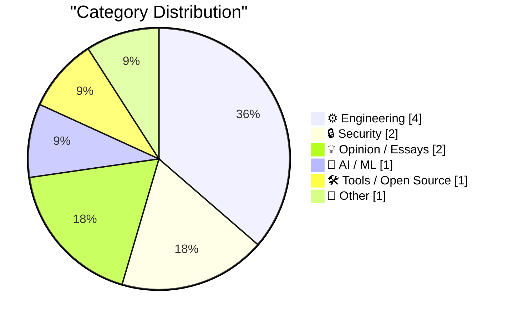
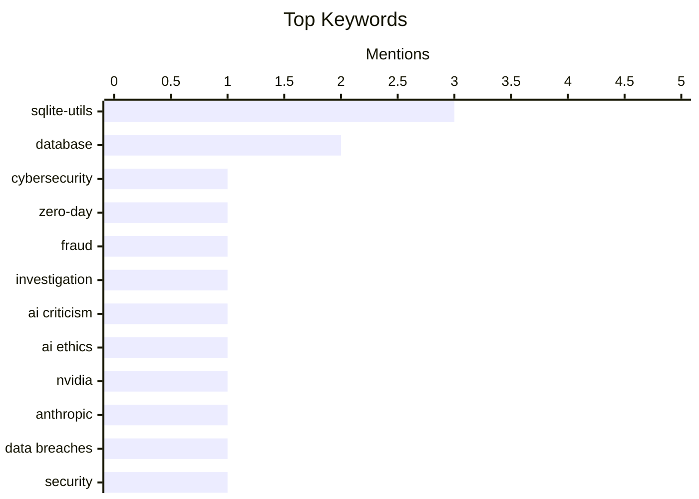

## Today's Highlights
The tech world is buzzing with advancements in AI, as Apple's latest beta introduces new voice controls for Siri, alongside ongoing debates about the industry's direction. Developers are also benefiting from continuous innovation, with significant updates to SQLite utilities for database management and new web components for embedding code. However, the cybersecurity realm faces ethical challenges, highlighted by the exposure of a startup offering zero-day vulnerabilities with questionable backing.
---
## Must Read Today
1. **Felons, Fraudsters Flog Offensive Cybersecurity Startup**
[Felons, Fraudsters Flog Offensive Cybersecurity Startup](https://krebsonsecurity.com/2026/07/felons-fraudsters-flog-offensive-cybersecurity-startup/) — krebsonsecurity.com · 1h ago · 🔒 Security
> This article exposes a cybersecurity startup offering millions for zero-day vulnerabilities. The company is reportedly run by convicted felons and far-right conspiracy theorists. Their past ventures included fake intelligence companies and a defunct AI-based lobbying platform, operated under aliases. The main takeaway is the critical importance of vetting the backgrounds of companies and individuals in the sensitive cybersecurity sector, especially those dealing with high-value exploits.
💡 **Why read it**: It highlights the significant risks and ethical concerns associated with unvetted individuals operating in the offensive cybersecurity market.
🏷️ cybersecurity, zero-day, fraud, investigation
2. **Let AI Burn**
[Let AI Burn](https://www.wheresyoured.at/let-ai-burn/) — wheresyoured.at · 20h ago · 💡 Opinion / Essays
> This article is a promotional piece for a premium newsletter focused on the AI industry. It describes the newsletter's content, which includes vast, detailed analyses of companies like NVIDIA and Anthropic, typically ranging from 5,000 to 18,000 words weekly. The subscription costs $70 annually or $7 monthly. The core message is an invitation to subscribe for in-depth AI industry analysis.
💡 **Why read it**: It provides a clear overview of a paid newsletter's content and pricing, useful for those seeking detailed AI industry analysis.
🏷️ AI criticism, AI ethics, NVIDIA, Anthropic
3. **Weekly Update 511: Live from my Riad in Marrakech**
[Weekly Update 511: Live from my Riad in Marrakech](https://www.troyhunt.com/weekly-update-511/) — troyhunt.com · 6m ago · 🔒 Security
> This article is a personal weekly update from Troy Hunt, primarily focusing on his travel experiences in Marrakech. While mentioning data breaches, the content provided is largely anecdotal and does not delve into specific technical details or new breach analyses. The author uses a metaphor about the futility of removing "piss from a pool" in relation to data breaches, implying a recurring, intractable problem. The main takeaway is a personal travelogue with a brief, high-level nod to ongoing cybersecurity issues.
💡 **Why read it**: It offers a personal, informal update from a prominent cybersecurity expert, providing a glimpse into his current activities and perspective on the ongoing challenge of data breaches.
🏷️ data breaches, security, privacy
---
## Data Overview
| Sources Scanned | Articles Fetched | Time Window | Selected |
|:---:|:---:|:---:|:---:|
| 88/92 | 2590 -> 11 | 24h | **11** |
### Category Distribution

### Top Keywords

<details>
<summary>Plain Text Keyword Chart (Terminal Friendly)</summary>
```
sqlite-utils  │ ████████████████████ 3
database      │ █████████████░░░░░░░ 2
cybersecurity │ ███████░░░░░░░░░░░░░ 1
zero-day      │ ███████░░░░░░░░░░░░░ 1
fraud         │ ███████░░░░░░░░░░░░░ 1
investigation │ ███████░░░░░░░░░░░░░ 1
ai criticism  │ ███████░░░░░░░░░░░░░ 1
ai ethics     │ ███████░░░░░░░░░░░░░ 1
nvidia        │ ███████░░░░░░░░░░░░░ 1
anthropic     │ ███████░░░░░░░░░░░░░ 1
```
</details>
### Topic Tags
**sqlite-utils**(3) · **database**(2) · **cybersecurity**(1) · zero-day(1) · fraud(1) · investigation(1) · ai criticism(1) · ai ethics(1) · nvidia(1) · anthropic(1) · data breaches(1) · security(1) · privacy(1) · sqlite(1) · migrations(1) · siri(1) · ios 27(1) · ai voices(1) · developer beta(1) · web component(1)
---
## Engineering
### 1. sqlite-utils 4.0, now with database schema migrations
[sqlite-utils 4.0, now with database schema migrations](https://simonwillison.net/2026/Jul/7/sqlite-utils-4/#atom-everything) — **simonwillison.net** · 18h ago · ⭐ 24/30
> This article announces the release of sqlite-utils 4.0, the 124th release and first major version bump since 3.0 in November 2020. The update introduces three major features, including robust database schema migrations. It also includes small but significant breaking changes, detailed in an upgrade guide. This version significantly enhances the utility of `sqlite-utils` for managing SQLite databases, particularly for developers needing robust schema evolution.
🏷️ sqlite-utils, SQLite, database, migrations
---
### 2. A bug which only affected left-handed users
[A bug which only affected left-handed users](https://shkspr.mobi/blog/2026/07/a-bug-which-only-affected-left-handed-users/) — **shkspr.mobi** · 2h ago · ⭐ 18/30
> This article describes a specific, unusual bug that exclusively affected left-handed users. The author humorously struggles to describe the issue without sounding "like a clanker," implying a technical or obscure detail. The bug likely relates to UI/UX design or input methods, given the mention of "scrolling using the thumb of their right hand." The core takeaway is the existence of highly specific, niche bugs that can arise from assumptions about user interaction patterns.
🏷️ software bug, UI/UX, accessibility, user experience
---
### 3. sqlite-migrate 0.2
[sqlite-migrate 0.2](https://simonwillison.net/2026/Jul/7/sqlite-migrate/#atom-everything) — **simonwillison.net** · 21h ago · ⭐ 17/30
> This article announces the release of `sqlite-migrate 0.2`, which effectively retires the standalone library. Instead of further development, this version implements a compatibility shim against the new `sqlite-utils 4.0` dependency. This change consolidates migration functionality within the more comprehensive `sqlite-utils` project. The main takeaway is the deprecation of `sqlite-migrate` as a separate library, with its features now integrated into `sqlite-utils 4.0`.
🏷️ sqlite-migrate, sqlite-utils, database, tool
---
### 4. sqlite-utils 4.0
[sqlite-utils 4.0](https://simonwillison.net/2026/Jul/7/sqlite-utils/#atom-everything) — **simonwillison.net** · 22h ago · ⭐ 6/30
> This article announces the release of sqlite-utils 4.0, a significant update to the command-line tool and Python library for working with SQLite databases. The core new feature introduced in version 4.0 is robust support for database schema migrations. This allows users to manage changes to their SQLite database schemas programmatically and reliably. The update enhances the tool's utility for developers needing to evolve their database structures over time. Overall, sqlite-utils 4.0 provides a more comprehensive solution for SQLite database management, particularly for schema evolution.
🏷️ sqlite-utils, release
---
## Security
### 5. Felons, Fraudsters Flog Offensive Cybersecurity Startup
[Felons, Fraudsters Flog Offensive Cybersecurity Startup](https://krebsonsecurity.com/2026/07/felons-fraudsters-flog-offensive-cybersecurity-startup/) — **krebsonsecurity.com** · 1h ago · ⭐ 29/30
> This article exposes a cybersecurity startup offering millions for zero-day vulnerabilities. The company is reportedly run by convicted felons and far-right conspiracy theorists. Their past ventures included fake intelligence companies and a defunct AI-based lobbying platform, operated under aliases. The main takeaway is the critical importance of vetting the backgrounds of companies and individuals in the sensitive cybersecurity sector, especially those dealing with high-value exploits.
🏷️ cybersecurity, zero-day, fraud, investigation
---
### 6. Weekly Update 511: Live from my Riad in Marrakech
[Weekly Update 511: Live from my Riad in Marrakech](https://www.troyhunt.com/weekly-update-511/) — **troyhunt.com** · 6m ago · ⭐ 25/30
> This article is a personal weekly update from Troy Hunt, primarily focusing on his travel experiences in Marrakech. While mentioning data breaches, the content provided is largely anecdotal and does not delve into specific technical details or new breach analyses. The author uses a metaphor about the futility of removing "piss from a pool" in relation to data breaches, implying a recurring, intractable problem. The main takeaway is a personal travelogue with a brief, high-level nod to ongoing cybersecurity issues.
🏷️ data breaches, security, privacy
---
## Opinion / Essays
### 7. Let AI Burn
[Let AI Burn](https://www.wheresyoured.at/let-ai-burn/) — **wheresyoured.at** · 20h ago · ⭐ 27/30
> This article is a promotional piece for a premium newsletter focused on the AI industry. It describes the newsletter's content, which includes vast, detailed analyses of companies like NVIDIA and Anthropic, typically ranging from 5,000 to 18,000 words weekly. The subscription costs $70 annually or $7 monthly. The core message is an invitation to subscribe for in-depth AI industry analysis.
🏷️ AI criticism, AI ethics, NVIDIA, Anthropic
---
### 8. And Then the Billionaire Paid Off $550 Million of Our Debts
[And Then the Billionaire Paid Off $550 Million of Our Debts](https://idiallo.com/blog/billionaire-paid-off-550-million-dollars-of-our-debts) — **idiallo.com** · 6h ago · ⭐ 13/30
> This article reports on Evan Spiegel, Snapchat CEO, and his wife donating $550 million to Undue Medical Debt, a charity in California. This donation represents a quarter of Spiegel's estimated $2 billion wealth. The organization uses the funds to purchase and expunge Californians' medical debts. The article highlights a significant philanthropic act aimed at alleviating a major societal burden.
🏷️ philanthropy, Evan Spiegel, medical debt, charity
---
## AI / ML
### 9. OS 27 Developer Beta 3 Enables New ‘Pace’ and ‘Expressivity’ Sliders for Siri’s New Voices
[OS 27 Developer Beta 3 Enables New ‘Pace’ and ‘Expressivity’ Sliders for Siri’s New Voices](https://techcrunch.com/2026/07/06/you-can-now-customize-siris-pace-and-expressivity-in-the-latest-ios-27-beta/) — **daringfireball.net** · 22h ago · ⭐ 24/30
> This article reports on Apple's iOS 27 developer beta 3, which enables new "Pace" and "Expressivity" sliders for Siri's AI-powered voices. These controls, previously labeled "Coming soon" in earlier betas, allow users to adjust how quickly and expressively Siri speaks. This enhancement aims to provide greater customization and a more natural interaction experience with the AI assistant. The core takeaway is Apple's ongoing effort to refine Siri's vocal delivery through user-adjustable parameters.
🏷️ Siri, iOS 27, AI voices, developer beta
---
## Tools / Open Source
### 10. github-code Web Component
[github-code Web Component](https://simonwillison.net/2026/Jul/7/github-code-component/#atom-everything) — **simonwillison.net** · 21h ago · ⭐ 23/30
> This article introduces an experimental `github-code` Web Component designed for embedding code snippets directly from GitHub. The component was built using GPT-5.5 and a specific prompt: "let's build a Web Component for embedding code from GitHub." It demonstrates a practical application of AI in generating developer tools. The main takeaway is the creation of a useful, AI-assisted Web Component for integrating GitHub code into web pages.
🏷️ Web Component, GPT-5.5, AI, developer tool
---
## Other
### 11. How Donkey Kong toppled Atari
[How Donkey Kong toppled Atari](https://dfarq.homeip.net/how-donkey-kong-toppled-atari/?utm_source=rss&#038;utm_medium=rss&#038;utm_campaign=how-donkey-kong-toppled-atari) — **dfarq.homeip.net** · 3h ago · ⭐ 12/30
> This article discusses the significant impact of Nintendo's Donkey Kong, released in July 1981, on the arcade game market. Donkey Kong quickly surpassed Pac-Man in popularity, becoming the world's most popular arcade game. Its success had lasting repercussions, contributing to the eventual decline of Atari's dominance. The core takeaway is Donkey Kong's pivotal role in shifting the arcade landscape and challenging established industry leaders.
🏷️ Donkey Kong, Atari, gaming history, arcade
---
*Generated at 2026-07-08 14:01 | Scanned 88 sources -> 2590 articles -> selected 11*
*Based on the [Hacker News Popularity Contest 2025](https://refactoringenglish.com/tools/hn-popularity/) RSS source list recommended by [Andrej Karpathy](https://x.com/karpathy)*
*Produced by Dongdianr AI. Follow the same-name WeChat public account for more AI practical tips 💡*
