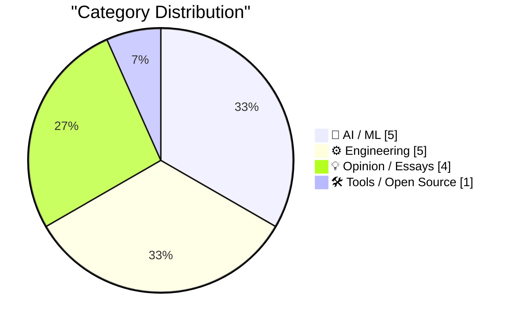
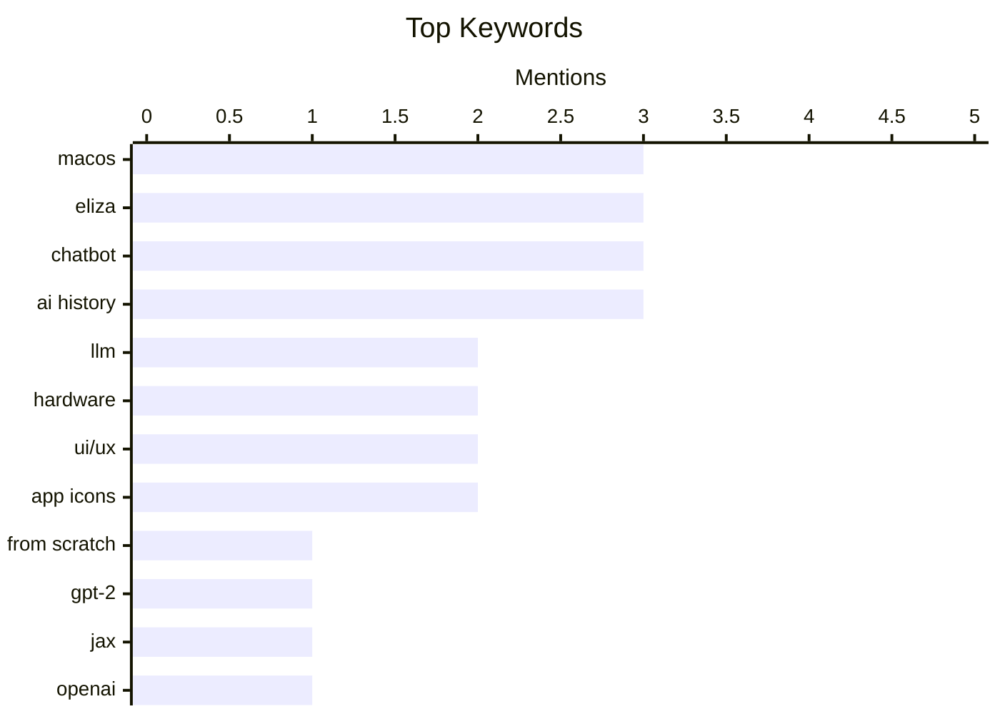

## Today's Highlights
The tech world is abuzz with advancements in AI, from detailed explorations of building large language models from scratch to OpenAI's new GPT-Live voice capabilities. This rapid AI evolution is also prompting critical discussions, with some developers implementing moratoriums on AI-generated code descriptions to preserve human oversight. Concurrently, core engineering continues its pursuit of performance, exemplified by projects like Bun's rewrite in Rust and the ongoing adoption of modern programming languages.
---
## Must Read Today
1. **Writing an LLM from scratch, part 34b -- from bigrams to GPT-2, one component at a time (in JAX)**
[Writing an LLM from scratch, part 34b -- from bigrams to GPT-2, one component at a time (in JAX)](https://www.gilesthomas.com/2026/07/llm-from-scratch-34b-building-and-training-gpt-2-small-in-jax) — gilesthomas.com · 19h ago · 🤖 AI / ML
> This article is the capstone of a long-running series on building an LLM from scratch, culminating in the construction and training of a GPT-2 small-style LLM. The author meticulously worked through Sebastian Raschka's book, applying a strict "no side quests" policy while still delving deep into implementation details. The series concludes with the successful implementation of a 163M-parameter GPT-2 small model using JAX. This post serves as a comprehensive guide and a significant milestone in understanding and practically building complex LLM architectures from foundational principles.
💡 **Why read it**: It offers a detailed, practical guide to building a GPT-2 small LLM from scratch using JAX, providing deep insights into LLM architecture and implementation.
🏷️ LLM, From scratch, GPT-2, JAX
2. **Introducing GPT‑Live**
[Introducing GPT‑Live](https://simonwillison.net/2026/Jul/8/introducing-gptlive/#atom-everything) — simonwillison.net · 14h ago · 🤖 AI / ML
> OpenAI has finally upgraded the model used by ChatGPT voice mode, introducing "GPT-Live" with significantly enhanced capabilities. The new model is highly impressive, offering improved conversational abilities and real-time responsiveness. It features a delegation mechanism where harder tasks requiring web search, deeper reasoning, or complex work are spun off to GPT-5.5 behind the scenes. GPT-Live significantly advances ChatGPT's voice interaction, combining real-time responsiveness with the power of a frontier model for complex queries.
💡 **Why read it**: It highlights a significant advancement in AI voice interaction, demonstrating how a hybrid model approach can combine real-time responsiveness with deep reasoning.
🏷️ OpenAI, ChatGPT, voice mode, LLM
3. **poppy the training box, part 1: the beginnings**
[poppy the training box, part 1: the beginnings](https://www.gilesthomas.com/2026/07/poppy-the-training-box-1-the-beginnings) — gilesthomas.com · 13h ago · 🤖 AI / ML
> The author plans to build a dedicated machine, "poppy," for local LLM training to overcome the limitations of using their daily driver PC, "perry." While "perry," equipped with an RTX 3090, can perform useful training runs (e.g., a 163M-parameter GPT-2 small style LLM in JAX), it ties up the daily machine. The new "poppy" box aims to provide a separate, dedicated environment for continuous LLM training without disrupting daily work. Building a dedicated LLM training machine is a practical solution for researchers and developers to separate compute-intensive tasks from their primary workstation.
💡 **Why read it**: It provides practical insights into the challenges and solutions for setting up a dedicated local machine for LLM training, particularly for those using high-end GPUs like the RTX 3090.
🏷️ LLM training, Local LLM, Hardware, RTX 3090
---
## Data Overview
| Sources Scanned | Articles Fetched | Time Window | Selected |
|:---:|:---:|:---:|:---:|
| 88/92 | 2589 -> 20 | 24h | **15** |
### Category Distribution

### Top Keywords

<details>
<summary>Plain Text Keyword Chart (Terminal Friendly)</summary>
```
macos        │ ████████████████████ 3
eliza        │ ████████████████████ 3
chatbot      │ ████████████████████ 3
ai history   │ ████████████████████ 3
llm          │ █████████████░░░░░░░ 2
hardware     │ █████████████░░░░░░░ 2
ui/ux        │ █████████████░░░░░░░ 2
app icons    │ █████████████░░░░░░░ 2
from scratch │ ███████░░░░░░░░░░░░░ 1
gpt-2        │ ███████░░░░░░░░░░░░░ 1
```
</details>
### Topic Tags
**macos**(3) · **eliza**(3) · **chatbot**(3) · ai history(3) · llm(2) · hardware(2) · ui/ux(2) · app icons(2) · from scratch(1) · gpt-2(1) · jax(1) · openai(1) · chatgpt(1) · voice mode(1) · llm training(1) · local llm(1) · rtx 3090(1) · bun(1) · rust(1) · javascript runtime(1)
---
## AI / ML
### 1. Writing an LLM from scratch, part 34b -- from bigrams to GPT-2, one component at a time (in JAX)
[Writing an LLM from scratch, part 34b -- from bigrams to GPT-2, one component at a time (in JAX)](https://www.gilesthomas.com/2026/07/llm-from-scratch-34b-building-and-training-gpt-2-small-in-jax) — **gilesthomas.com** · 19h ago · ⭐ 29/30
> This article is the capstone of a long-running series on building an LLM from scratch, culminating in the construction and training of a GPT-2 small-style LLM. The author meticulously worked through Sebastian Raschka's book, applying a strict "no side quests" policy while still delving deep into implementation details. The series concludes with the successful implementation of a 163M-parameter GPT-2 small model using JAX. This post serves as a comprehensive guide and a significant milestone in understanding and practically building complex LLM architectures from foundational principles.
🏷️ LLM, From scratch, GPT-2, JAX
---
### 2. Introducing GPT‑Live
[Introducing GPT‑Live](https://simonwillison.net/2026/Jul/8/introducing-gptlive/#atom-everything) — **simonwillison.net** · 14h ago · ⭐ 27/30
> OpenAI has finally upgraded the model used by ChatGPT voice mode, introducing "GPT-Live" with significantly enhanced capabilities. The new model is highly impressive, offering improved conversational abilities and real-time responsiveness. It features a delegation mechanism where harder tasks requiring web search, deeper reasoning, or complex work are spun off to GPT-5.5 behind the scenes. GPT-Live significantly advances ChatGPT's voice interaction, combining real-time responsiveness with the power of a frontier model for complex queries.
🏷️ OpenAI, ChatGPT, voice mode, LLM
---
### 3. poppy the training box, part 1: the beginnings
[poppy the training box, part 1: the beginnings](https://www.gilesthomas.com/2026/07/poppy-the-training-box-1-the-beginnings) — **gilesthomas.com** · 13h ago · ⭐ 25/30
> The author plans to build a dedicated machine, "poppy," for local LLM training to overcome the limitations of using their daily driver PC, "perry." While "perry," equipped with an RTX 3090, can perform useful training runs (e.g., a 163M-parameter GPT-2 small style LLM in JAX), it ties up the daily machine. The new "poppy" box aims to provide a separate, dedicated environment for continuous LLM training without disrupting daily work. Building a dedicated LLM training machine is a practical solution for researchers and developers to separate compute-intensive tasks from their primary workstation.
🏷️ LLM training, Local LLM, Hardware, RTX 3090
---
### 4. The ELIZA Archaeology Project
[The ELIZA Archaeology Project](https://findingeliza.org/) — **daringfireball.net** · 20h ago · ⭐ 18/30
> The ELIZA Archaeology Project
🏷️ ELIZA, chatbot, AI history, preservation
---
### 5. ‘PARRY Encounters the DOCTOR’ — Chatbot on Chatbot Action Circa 1973
[‘PARRY Encounters the DOCTOR’ — Chatbot on Chatbot Action Circa 1973](https://www.rfc-editor.org/info/rfc439/) — **daringfireball.net** · 15h ago · ⭐ 16/30
> ‘PARRY Encounters the DOCTOR’ — Chatbot on Chatbot Action Circa 1973
🏷️ Chatbot, ELIZA, PARRY, AI history
---
## Engineering
### 6. Rewriting Bun in Rust
[Rewriting Bun in Rust](https://simonwillison.net/2026/Jul/8/rewriting-bun-in-rust/#atom-everything) — **simonwillison.net** · 14h ago · ⭐ 24/30
> Jarred Sumner has completed a promised rewrite of Bun, a JavaScript runtime, transitioning it from Zig to Rust. This was a detailed and sophisticated piece of "agentic engineering," involving dynamic workflows, trial runs, and a significant effort. The transition from Zig to Rust aims to improve Bun's performance, stability, or developer experience, though specific benefits aren't detailed in the snippet. The successful rewrite of a complex project like Bun into Rust demonstrates the viability and potential advantages of such a significant architectural shift, especially when leveraging advanced engineering techniques.
🏷️ Bun, Rust, JavaScript runtime, performance
---
### 7. Unboxed: Zig
[Unboxed: Zig](https://nesbitt.io/2026/07/09/unboxed-zig.html) — **nesbitt.io** · 4h ago · ⭐ 24/30
> This article provides an in-depth exploration of Zig's package manager. It delves into the mechanics of how packages are managed, their categorization within the ecosystem, and the governance structures in place. Furthermore, the article addresses the threat model associated with Zig's package management, discussing potential security concerns and mitigations. Understanding Zig's package manager is crucial for developers looking to effectively utilize and contribute to the Zig programming language ecosystem.
🏷️ Zig, Package manager, Programming language
---
### 8. Cursed circuits #6: reverse avalanche oscillator
[Cursed circuits #6: reverse avalanche oscillator](https://lcamtuf.substack.com/p/cursed-circuits-6-reverse-avalanche) — **lcamtuf.substack.com** · 7h ago · ⭐ 20/30
> This article introduces and explores a "reverse avalanche oscillator," paradoxically described as "so bad it's actually good." The piece likely delves into the unconventional design and operational principles of this specific type of oscillator, highlighting its unique characteristics. As part of the "cursed circuits" series, it probably explores unusual or non-standard electronic designs, showcasing their unexpected utility or interesting quirks despite their inherent "badness" in conventional terms. The reverse avalanche oscillator represents an intriguing example of how seemingly "bad" or unconventional circuit designs can possess unique characteristics that make them valuable or interesting in specific contexts.
🏷️ Circuits, Oscillator, Electronics, Hardware
---
### 9. ★ What’s Good for the iOS Goose Is Often Not Good for the MacOS Gander
[★ What’s Good for the iOS Goose Is Often Not Good for the MacOS Gander](https://daringfireball.net/2026/07/whats_good_for_the_ios_goose_is_often_not_good_for_the_macos_gander) — **daringfireball.net** · 12h ago · ⭐ 18/30
> ★ What’s Good for the iOS Goose Is Often Not Good for the MacOS Gander
🏷️ macOS, iOS, UI/UX, app icons
---
### 10. Mac Apps Can Escape From Squircle Jail If They’re Not in the Mac App Store
[Mac Apps Can Escape From Squircle Jail If They’re Not in the Mac App Store](https://tyler.io/2026/07/05/escape-from-squircle-jail/) — **daringfireball.net** · 16h ago · ⭐ 16/30
> Mac Apps Can Escape From Squircle Jail If They’re Not in the Mac App Store
🏷️ macOS, app icons, App Store, NSDockTilePlugIn
---
## Opinion / Essays
### 11. Quoting Kenton Varda
[Quoting Kenton Varda](https://simonwillison.net/2026/Jul/8/kenton-varda/#atom-everything) — **simonwillison.net** · 17h ago · ⭐ 23/30
> Kenton Varda has imposed a moratorium on AI-written change descriptions, including PR and commit messages, and issues/tickets, for his team. Varda found that AI-generated descriptions were "worse than useless" because they focused on easily observable code details. Crucially, they omitted the higher-level framing needed to understand the code's broader purpose, hindering effective PR reviews. While AI can generate text, its current utility for technical change descriptions is limited, often failing to provide the necessary high-level context for human understanding and review.
🏷️ AI, commit messages, developer workflow, productivity
---
### 12. Family Feud: Mac-assed Mac App Edition
[Family Feud: Mac-assed Mac App Edition](https://blog.jim-nielsen.com/2026/mac-assed-family-feud/) — **blog.jim-nielsen.com** · 19h ago · ⭐ 20/30
> This article playfully explores which companies are best positioned to create "Mac-assed Mac apps," a term for applications that deeply adhere to macOS design principles and user experience. In a "Family Feud" style survey, "Apple" was the top answer when asked which company could make a world-class Mac-assed Mac app. This suggests a strong perception that Apple itself sets the standard for native macOS application design and integration. There's a prevailing sentiment that Apple remains the gold standard for developing applications that truly embody the "Mac-assed" philosophy, deeply integrating with the macOS ecosystem and user experience.
🏷️ macOS, App design, UI/UX, Apple
---
### 13. The console wars have been lost
[The console wars have been lost](https://xeiaso.net/notes/2026/console-wars-lost/) — **xeiaso.net** · 14h ago · ⭐ 19/30
> This article provocatively declares the "console wars" to be over, with Valve emerging as the unexpected victor. The author posits that Valve "wins by doing absolutely nothing," implying that their strategic approach, likely through platforms like Steam or hardware like the Steam Deck, has subtly dominated the console market. This suggests a significant shift in how "winning" is defined in the gaming hardware and software landscape, moving beyond traditional direct console competition. Valve's indirect influence and ecosystem dominance have positioned it as the unexpected victor in the long-running "console wars."
🏷️ Gaming, Console wars, Valve, Steam
---
### 14. My Conversation With ELIZA
[My Conversation With ELIZA](https://sites.google.com/view/elizaarchaeology/try-eliza?authuser=0) — **daringfireball.net** · 20h ago · ⭐ 15/30
> My Conversation With ELIZA
🏷️ ELIZA, chatbot, AI history, personal reflection
---
## Tools / Open Source
### 15. [Sponsor] WorkOS Pipes: More Context Makes for Smarter Products
[[Sponsor] WorkOS Pipes: More Context Makes for Smarter Products](https://workos.com/pipes?utm_source=daringfireball&amp;utm_medium=newsletter&amp;utm_campaign=q32026) — **daringfireball.net** · 23h ago · ⭐ 20/30
> Integrating apps and agents with existing tools requires complex, time-consuming infrastructure work involving various OAuth flows and token lifecycles, often taking weeks. WorkOS Pipes simplifies this by handling all integration complexities with a single API call. It offers pre-built connectors for over 100 providers like GitHub, Slack, Salesforce, and Google Drive, managing OAuth, token refresh, and credential storage. This allows developers to call the real provider API with a fresh token every time, significantly reducing development time. WorkOS Pipes streamlines product integrations by abstracting away the complexities of OAuth and token management, enabling developers to connect to numerous services efficiently.
🏷️ WorkOS, Integrations, API, Developer tools
---
*Generated at 2026-07-09 14:01 | Scanned 88 sources -> 2589 articles -> selected 15*
*Based on the [Hacker News Popularity Contest 2025](https://refactoringenglish.com/tools/hn-popularity/) RSS source list recommended by [Andrej Karpathy](https://x.com/karpathy)*
*Produced by Dongdianr AI. Follow the same-name WeChat public account for more AI practical tips 💡*
