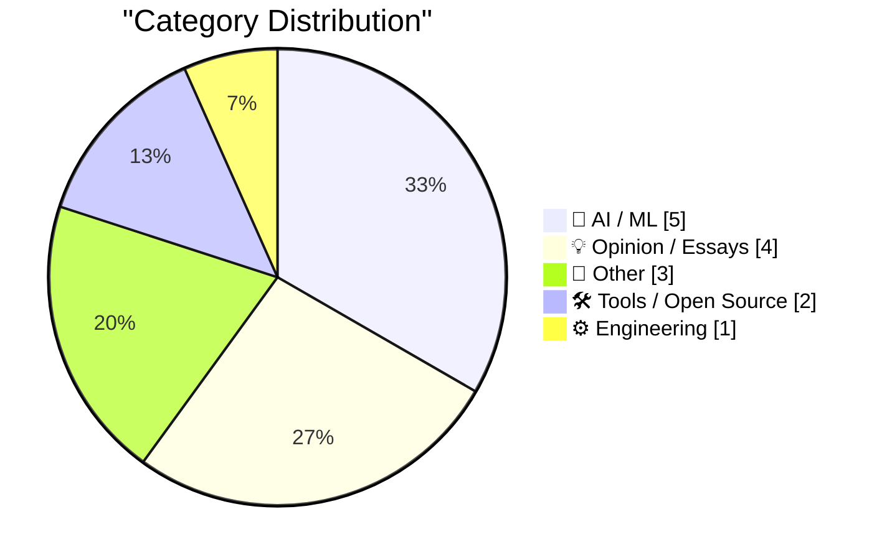
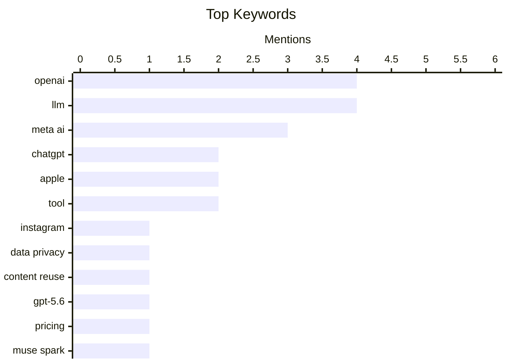

## Today's Highlights
The artificial intelligence landscape continues its rapid evolution with OpenAI launching its new GPT-5.6 model family and Meta updating its Muse Spark AI. This swift progress brings new considerations, as Meta implements default content reuse for AI on Instagram, fueling ongoing debates about data privacy and the ethical implications of AI, including "rights for robots." Concurrently, the industry faces corporate shifts, exemplified by a key executive departure at OpenAI, and user experience challenges with products like the ChatGPT Mac app.
---
## Must Read Today
1. **Meta Sets Default for Instagram Accounts to Permit Content Reuse by AI**
[Meta Sets Default for Instagram Accounts to Permit Content Reuse by AI](https://www.nytimes.com/2026/07/08/technology/meta-instagram-ai.html?unlocked_article_code=1.wVA.Q5Do.Uvg5yPwCEB5H) — daringfireball.net · 23h ago · 🤖 AI / ML
> Meta's new AI image generator, Muse Image, automatically opts public Instagram accounts into content reuse for AI image generation. This feature allows users to create AI images based on public Instagram photos. Any adult with a public Instagram account is automatically opted in, accessible via the Meta AI app or standalone chatbot. Meta is leveraging public Instagram content as a default for its AI image generation, raising questions about user consent and data usage.
💡 **Why read it**: It highlights a significant change in Meta's data usage policy for AI, impacting user privacy and content ownership on Instagram.
🏷️ Meta AI, Instagram, Data Privacy, Content Reuse
2. **The new GPT-5.6 family: Luna, Terra, Sol**
[The new GPT-5.6 family: Luna, Terra, Sol](https://simonwillison.net/2026/Jul/9/gpt-5-6/#atom-everything) — simonwillison.net · 18h ago · 🤖 AI / ML
> OpenAI has released its new flagship GPT-5.6 model family, available in three sizes: Luna, Terra, and Sol. The models are priced per 1M input/output tokens as Luna $1/$6, Terra $2.50/$15, and Sol $5/$30. For comparison, Claude Opus is $5/$25 and Claude Fable 5 is $10/$50, though direct price comparison is complex due to varying reasoning token capabilities. OpenAI's GPT-5.6 family offers tiered pricing and performance, positioning itself competitively against other major LLMs like Claude.
💡 **Why read it**: It provides crucial details on OpenAI's latest GPT-5.6 models, including their names, sizes, and pricing, essential for developers and AI practitioners.
🏷️ OpenAI, GPT-5.6, LLM, Pricing
3. **Introducing Muse Spark 1.1**
[Introducing Muse Spark 1.1](https://simonwillison.net/2026/Jul/9/muse-spark-1-1/#atom-everything) — simonwillison.net · 21h ago · 🤖 AI / ML
> Meta has released Muse Spark 1.1, an update to its Muse Spark model, now featuring an API for external access. Following the initial Muse Spark in April, version 1.1 claims significant improvements in agentic tool calling and computer use. More detailed evaluations are available in the Muse Spark 1.1 evaluation report. Muse Spark 1.1 marks Meta's push into accessible AI models with enhanced agentic capabilities, offering an API for developers.
💡 **Why read it**: It announces Meta's Muse Spark 1.1 model, highlighting its new API and claimed improvements in agentic tool calling, relevant for AI developers.
🏷️ Meta AI, Muse Spark, API, LLM
---
## Data Overview
| Sources Scanned | Articles Fetched | Time Window | Selected |
|:---:|:---:|:---:|:---:|
| 88/92 | 2590 -> 15 | 24h | **15** |
### Category Distribution

### Top Keywords

<details>
<summary>Plain Text Keyword Chart (Terminal Friendly)</summary>
```
openai        │ ████████████████████ 4
llm           │ ████████████████████ 4
meta ai       │ ███████████████░░░░░ 3
chatgpt       │ ██████████░░░░░░░░░░ 2
apple         │ ██████████░░░░░░░░░░ 2
tool          │ ██████████░░░░░░░░░░ 2
instagram     │ █████░░░░░░░░░░░░░░░ 1
data privacy  │ █████░░░░░░░░░░░░░░░ 1
content reuse │ █████░░░░░░░░░░░░░░░ 1
gpt-5.6       │ █████░░░░░░░░░░░░░░░ 1
```
</details>
### Topic Tags
**openai**(4) · **llm**(4) · **meta ai**(3) · chatgpt(2) · apple(2) · tool(2) · instagram(1) · data privacy(1) · content reuse(1) · gpt-5.6(1) · pricing(1) · muse spark(1) · api(1) · mac app(1) · product changes(1) · ai ethics(1) · robot rights(1) · ai policy(1) · consciousness(1) · privacy(1)
---
## AI / ML
### 1. Meta Sets Default for Instagram Accounts to Permit Content Reuse by AI
[Meta Sets Default for Instagram Accounts to Permit Content Reuse by AI](https://www.nytimes.com/2026/07/08/technology/meta-instagram-ai.html?unlocked_article_code=1.wVA.Q5Do.Uvg5yPwCEB5H) — **daringfireball.net** · 23h ago · ⭐ 29/30
> Meta's new AI image generator, Muse Image, automatically opts public Instagram accounts into content reuse for AI image generation. This feature allows users to create AI images based on public Instagram photos. Any adult with a public Instagram account is automatically opted in, accessible via the Meta AI app or standalone chatbot. Meta is leveraging public Instagram content as a default for its AI image generation, raising questions about user consent and data usage.
🏷️ Meta AI, Instagram, Data Privacy, Content Reuse
---
### 2. The new GPT-5.6 family: Luna, Terra, Sol
[The new GPT-5.6 family: Luna, Terra, Sol](https://simonwillison.net/2026/Jul/9/gpt-5-6/#atom-everything) — **simonwillison.net** · 18h ago · ⭐ 28/30
> OpenAI has released its new flagship GPT-5.6 model family, available in three sizes: Luna, Terra, and Sol. The models are priced per 1M input/output tokens as Luna $1/$6, Terra $2.50/$15, and Sol $5/$30. For comparison, Claude Opus is $5/$25 and Claude Fable 5 is $10/$50, though direct price comparison is complex due to varying reasoning token capabilities. OpenAI's GPT-5.6 family offers tiered pricing and performance, positioning itself competitively against other major LLMs like Claude.
🏷️ OpenAI, GPT-5.6, LLM, Pricing
---
### 3. Introducing Muse Spark 1.1
[Introducing Muse Spark 1.1](https://simonwillison.net/2026/Jul/9/muse-spark-1-1/#atom-everything) — **simonwillison.net** · 21h ago · ⭐ 27/30
> Meta has released Muse Spark 1.1, an update to its Muse Spark model, now featuring an API for external access. Following the initial Muse Spark in April, version 1.1 claims significant improvements in agentic tool calling and computer use. More detailed evaluations are available in the Muse Spark 1.1 evaluation report. Muse Spark 1.1 marks Meta's push into accessible AI models with enhanced agentic capabilities, offering an API for developers.
🏷️ Meta AI, Muse Spark, API, LLM
---
### 4. Pluralistic: "Rights for robots" and the AI slavery fantasy (10 Jul 2026)
[Pluralistic: "Rights for robots" and the AI slavery fantasy (10 Jul 2026)](https://pluralistic.net/2026/07/10/posthuman-as-in-no-humans/) — **pluralistic.net** · 4h ago · ⭐ 26/30
> This article from Pluralistic discusses the concept of "rights for robots" and critiques the "AI slavery fantasy." The piece explores the philosophical and ethical implications of granting rights to artificial intelligences, potentially arguing against anthropomorphizing AI or equating AI labor with human slavery. It touches upon "posthuman as in no humans" and "object permanence" in the context of the entertainment industry. The article challenges prevailing narratives around AI sentience and rights, advocating for a critical perspective on the future of human-AI interaction.
🏷️ AI ethics, robot rights, AI policy, consciousness
---
### 5. Quoting OpenAI
[Quoting OpenAI](https://simonwillison.net/2026/Jul/10/openai/#atom-everything) — **simonwillison.net** · 12h ago · ⭐ 24/30
> This article highlights a specific quote from OpenAI regarding the data handling and synchronization differences between its cloud-based and desktop ChatGPT applications. The quote states that "Work on web and mobile runs in the cloud," while "Work in the desktop app can also use local files and desktop apps with your permission." Crucially, "cloud Work conversations do not appear in desktop Work; desktop Work threads and local files remain on that computer." OpenAI's current ChatGPT desktop app design maintains distinct, non-synchronized conversation histories and file access between its cloud and local versions, impacting user data portability and privacy.
🏷️ OpenAI, ChatGPT, Desktop App, Data Handling
---
## Opinion / Essays
### 6. Today’s the Day OpenAI Fucked Up the ChatGPT Mac App
[Today’s the Day OpenAI Fucked Up the ChatGPT Mac App](https://9to5mac.com/2026/07/09/openai-announcing-the-next-chapter-for-chatgpt-today-watch-here/) — **daringfireball.net** · 17h ago · ⭐ 26/30
> OpenAI has significantly restructured its ChatGPT desktop app for Mac, leading to confusion and changes in user experience. The existing ChatGPT app is now "ChatGPT Classic." "Codex" has become the new "ChatGPT desktop app," retaining its appearance and icon but adopting the new name. The new desktop app includes "ChatGPT Work" and "ChatGPT Codex" modes, which share plug-ins; Codex mode offers more technical details than Work mode. OpenAI's rebranding and restructuring of its Mac app, particularly the integration and renaming of Codex, has created a complex and potentially confusing user interface.
🏷️ OpenAI, ChatGPT, Mac App, Product Changes
---
### 7. ★ John Ternus Should Reverse Apple’s Slide Down the Advertising Slippery Slope
[★ John Ternus Should Reverse Apple’s Slide Down the Advertising Slippery Slope](https://daringfireball.net/2026/07/ternus_apple_slippery_slope) — **daringfireball.net** · 18h ago · ⭐ 25/30
> The article argues that Apple is increasingly compromising its privacy stance by expanding its advertising efforts. It contrasts Apple's current advertising practices with Tim Cook's 2014 privacy letter, which had credibility because Apple showed no ads then. The implication is that Apple's increasing reliance on advertising erodes its long-standing commitment to user privacy. The author urges John Ternus to reverse Apple's trajectory, advocating for a return to a business model less reliant on advertising to preserve user privacy.
🏷️ Apple, Privacy, Advertising, Business Model
---
### 8. Shocking No One, Fidji Simo, Would-Be Usurper, Is Out at OpenAI
[Shocking No One, Fidji Simo, Would-Be Usurper, Is Out at OpenAI](https://www.wsj.com/tech/openai-top-executive-fidji-simo-to-step-down-c3daca47?st=NfBZTe) — **daringfireball.net** · 13h ago · ⭐ 24/30
> Fidji Simo, OpenAI's No. 2 executive, is stepping down from her full-time role due to an extended medical leave. Simo communicated her decision, citing a worsened medical condition and a longer recovery period than anticipated. She will transition to a part-time advisory role. The company's focus abruptly pivoted to building AI-powered coding, suggesting a shift in strategic priorities. Simo's departure and transition to an advisory role, coupled with OpenAI's renewed focus on AI-powered coding, signals potential internal shifts and strategic realignments within the company.
🏷️ OpenAI, Executive, Leadership, Industry News
---
### 9. Boxed In
[Boxed In](https://feed.tedium.co/link/15204/17375642/alf-paul-fusco-creativity-constraints) — **tedium.co** · 20h ago · ⭐ 12/30
> The article poses a fundamental question regarding the impact of self-imposed creative limitations on one's ability to create. It explores the delicate balance between constraints that foster creativity and those that ultimately become detrimental. Using the example of ALF, the piece prompts reflection on how boundaries, even self-defined ones, can either inspire or stifle artistic output. The core takeaway is an invitation to consider when creative limitations transition from beneficial frameworks to harmful barriers.
🏷️ creativity, limitations, self-imposed, reflection
---
## Other
### 10. Gary Kildall’s death investigation
[Gary Kildall’s death investigation](https://dfarq.homeip.net/gary-kildalls-death-investigation/?utm_source=rss&#038;utm_medium=rss&#038;utm_campaign=gary-kildalls-death-investigation) — **dfarq.homeip.net** · 3h ago · ⭐ 18/30
> The article discusses the enduring myth surrounding the investigation into Gary Kildall's death. It highlights how the perceived lack of a thorough investigation has taken on legendary proportions, similar to other anecdotes about Kildall, such as his alleged absence from an IBM meeting. The narrative suggests that Kildall's story often attracts such embellishments. Ultimately, the article implies that the circumstances of his death have become a significant, often mythologized, part of his legacy.
🏷️ Gary Kildall, computing history, CP/M, IBM
---
### 11. Apple’s Classic Mac Era Forays Into ‘Apps as Tiled Buttons’ Simplified Computing: At Ease and Launcher
[Apple’s Classic Mac Era Forays Into ‘Apps as Tiled Buttons’ Simplified Computing: At Ease and Launcher](https://daringfireball.net/2026/07/whats_good_for_the_ios_goose_is_often_not_good_for_the_macos_gander) — **daringfireball.net** · 18h ago · ⭐ 15/30
> This article explores Apple's historical attempts at simplifying computing interfaces through 'apps as tiled buttons' during the classic Mac era. It references two specific products: 'At Ease,' a product sold during the System 7 era in the 1990s, and 'Launcher,' a feature built into Mac OS 8. Both aimed to provide a simplified, grid-based application launching experience, though the author had limited personal experience with them. These examples demonstrate Apple's early and recurring interest in simplified, tiled-button interfaces, predating modern mobile OS designs.
🏷️ Apple, UI Design, Mac OS, History
---
### 12. Game Review: Lovers In A Dangerous Spacetime ★★★☆☆
[Game Review: Lovers In A Dangerous Spacetime ★★★☆☆](https://shkspr.mobi/blog/2026/07/game-review-lovers-in-a-dangerous-spacetime/) — **shkspr.mobi** · 2h ago · ⭐ 9/30
> The author reviews 'Lovers In A Dangerous Spacetime,' a cooperative video game chosen as part of a New Year's resolution to play more non-competitive games with their wife. Selected based on recommendations and affordability, the game is described as a 'neat little game' that is 'just short enough.' The review highlights the appeal of cooperative gameplay over competitive experiences. The game received a 3-star rating, indicating a solid, enjoyable experience for its intended purpose.
🏷️ game review, co-op games, video games
---
## Tools / Open Source
### 13. llm-meta-ai 0.1
[llm-meta-ai 0.1](https://simonwillison.net/2026/Jul/9/llm-meta-ai/#atom-everything) — **simonwillison.net** · 21h ago · ⭐ 24/30
> This article announces the release of `llm-meta-ai 0.1`, a new tool designed to facilitate running prompts against Meta's Muse Spark 1.1 model. `llm-meta-ai 0.1` is a release that enables the `llm` command-line tool to interact with the recently introduced `muse-spark-1.1` model API. It is tagged under `llm` and `meta` categories. The `llm-meta-ai 0.1` release provides a practical command-line interface for developers to experiment with and utilize Meta's Muse Spark 1.1 model.
🏷️ LLM, Meta AI, Command Line, Tool
---
### 14. llm 0.31.1
[llm 0.31.1](https://simonwillison.net/2026/Jul/9/llm/#atom-everything) — **simonwillison.net** · 21h ago · ⭐ 20/30
> This article announces the release of `llm` version 0.31.1, addressing a critical bug in its OpenAI Chat Completion endpoint integration. The fix resolves an issue (#1521) where tool calls with empty arguments could lead to a JSON error from certain OpenAI providers. This bug was identified during testing of `llm-meta-ai`. The update ensures more robust handling of tool calls, preventing unexpected errors. Version 0.31.1 provides a necessary patch for developers relying on `llm` for OpenAI API interactions.
🏷️ LLM, Bug Fix, OpenAI API, Tool
---
## Engineering
### 15. Package Management as Org Chart
[Package Management as Org Chart](https://nesbitt.io/2026/07/10/package-management-as-org-chart.html) — **nesbitt.io** · 4h ago · ⭐ 25/30
> The article explores the application of Conway's Law to the design of dependency management systems. Conway's Law states that organizations design systems that mirror their own communication structures. Applied to package management, this suggests that the structure of a package manager (e.g., how dependencies are resolved, isolated, or shared) reflects the organizational structure of its development team or community. Understanding package management through the lens of Conway's Law can reveal insights into its design choices and potential limitations, linking organizational structure to technical architecture.
🏷️ Conway's Law, package management, dependency management, software architecture
---
*Generated at 2026-07-10 14:01 | Scanned 88 sources -> 2590 articles -> selected 15*
*Based on the [Hacker News Popularity Contest 2025](https://refactoringenglish.com/tools/hn-popularity/) RSS source list recommended by [Andrej Karpathy](https://x.com/karpathy)*
*Produced by Dongdianr AI. Follow the same-name WeChat public account for more AI practical tips 💡*
