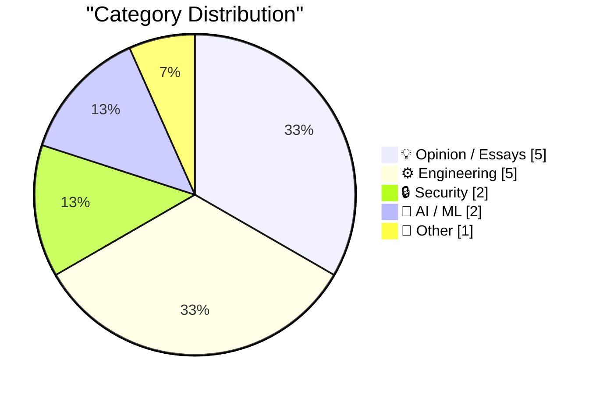
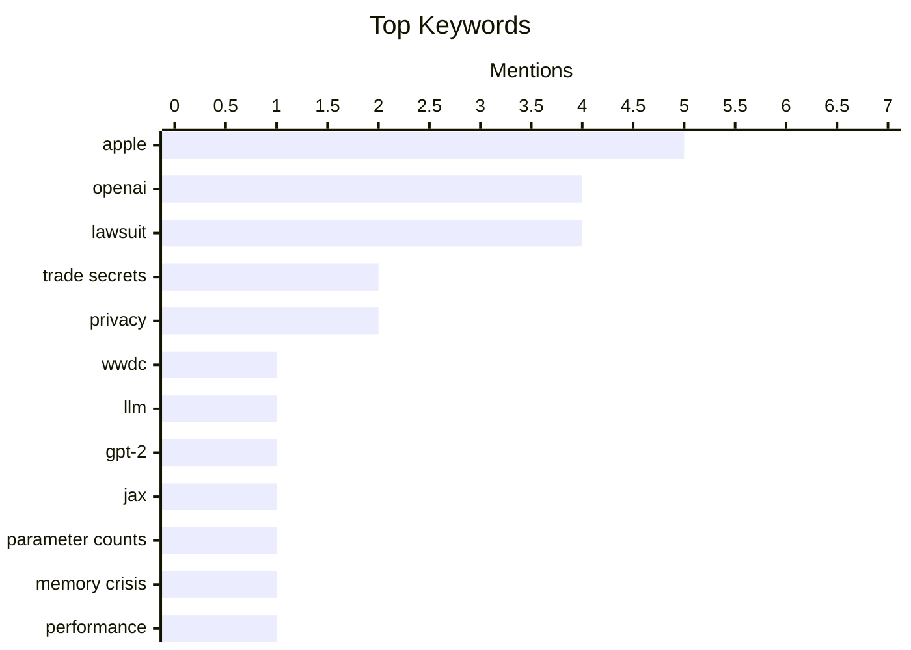

## Today's Highlights
A major legal battle is brewing as Apple sues OpenAI and former employees for alleged trade secret theft, revealing a notably cold relationship between the tech giants. This high-stakes dispute underscores the intense competition and ethical concerns surrounding AI development. Discussions also highlight the technical challenges of AI, from understanding massive LLM parameter counts to the prevalence of "AI slop" in generated content. Beyond AI, the engineering world continues to tackle persistent issues like memory crises and codebase complexity.
---
## Must Read Today
1. **Apple Sues OpenAI, io, and Former Employees, Alleging Theft of Trade Secrets**
[Apple Sues OpenAI, io, and Former Employees, Alleging Theft of Trade Secrets](https://9to5mac.com/2026/07/10/apple-sues-openai-trade-secret-theft/) — daringfireball.net · 17h ago · 🔒 Security
> Apple has filed a lawsuit against OpenAI, io Products, and two former employees, Chang Liu and Tang Tan, alleging theft of trade secrets related to consumer hardware. Tang Tan, former VP of product design for iPhone and Apple Watch, departed in February 2024 to work with Jony Ive, while Chang Liu, a senior system electrical engineer, joined OpenAI in January 2026 after eight years at Apple. The lawsuit specifically implicates OpenAI's hardware development efforts. This legal action underscores Apple's aggressive stance on protecting its intellectual property, particularly concerning former employees joining competitors in critical areas like hardware development.
💡 **Why read it**: It details a significant legal battle between Apple and OpenAI, revealing potential implications for AI hardware development and corporate intellectual property protection.
🏷️ Apple, OpenAI, Lawsuit, Trade Secrets
2. **Ice Cold**
[Ice Cold](https://www.threads.com/@alexheath/post/DaoI2jaEioX) — daringfireball.net · 10h ago · 💡 Opinion / Essays
> Apple executives exhibited a notably cold reaction when questioned about their OpenAI partnership at WWDC, a demeanor now understood to be a precursor to Apple's recent lawsuit. The lawsuit alleges trade secret theft related to consumer hardware, providing context for the previously observed reticence. The timing is particularly notable as senior leaders from both companies are currently at Sun Valley. This situation indicates underlying tensions between the two tech giants even during public engagements, despite their announced collaboration.
💡 **Why read it**: It offers an insider's perspective on Apple's pre-lawsuit behavior, providing crucial context for the recent legal action against OpenAI.
🏷️ Apple, OpenAI, WWDC, Lawsuit
3. **Building intuition about LLM parameter counts**
[Building intuition about LLM parameter counts](https://www.gilesthomas.com/2026/07/llm-parameter-counts) — gilesthomas.com · 16h ago · 🤖 AI / ML
> The author explores the surprisingly high parameter counts even in stripped-down LLM architectures, aiming to build intuition about where these parameters originate. When building a GPT-2 implementation in JAX, a model with only token embeddings and a separate output head (without Transformer blocks, attention, or feed-forward networks, and not using weight tying) still resulted in 77 million parameters. This demonstrates that even basic components contribute significantly to the total parameter count. Understanding the parameter distribution in fundamental components like embeddings is crucial for comprehending the scale and computational demands of LLMs.
💡 **Why read it**: It provides valuable insight into the often-overlooked sources of parameter counts in LLMs, even in their most basic forms, which is essential for anyone building or optimizing these models.
🏷️ LLM, GPT-2, JAX, Parameter counts
---
## Data Overview
| Sources Scanned | Articles Fetched | Time Window | Selected |
|:---:|:---:|:---:|:---:|
| 86/92 | 2537 -> 19 | 24h | **15** |
### Category Distribution

### Top Keywords

<details>
<summary>Plain Text Keyword Chart (Terminal Friendly)</summary>
```
apple            │ ████████████████████ 5
openai           │ ████████████████░░░░ 4
lawsuit          │ ████████████████░░░░ 4
trade secrets    │ ████████░░░░░░░░░░░░ 2
privacy          │ ████████░░░░░░░░░░░░ 2
wwdc             │ ████░░░░░░░░░░░░░░░░ 1
llm              │ ████░░░░░░░░░░░░░░░░ 1
gpt-2            │ ████░░░░░░░░░░░░░░░░ 1
jax              │ ████░░░░░░░░░░░░░░░░ 1
parameter counts │ ████░░░░░░░░░░░░░░░░ 1
```
</details>
### Topic Tags
**apple**(5) · **openai**(4) · **lawsuit**(4) · trade secrets(2) · privacy(2) · wwdc(1) · llm(1) · gpt-2(1) · jax(1) · parameter counts(1) · memory crisis(1) · performance(1) · system design(1) · ar(1) · augmented reality(1) · hardware(1) · codebase(1) · software engineering(1) · teamwork(1) · knowledge(1)
---
## Opinion / Essays
### 1. Ice Cold
[Ice Cold](https://www.threads.com/@alexheath/post/DaoI2jaEioX) — **daringfireball.net** · 10h ago · ⭐ 27/30
> Apple executives exhibited a notably cold reaction when questioned about their OpenAI partnership at WWDC, a demeanor now understood to be a precursor to Apple's recent lawsuit. The lawsuit alleges trade secret theft related to consumer hardware, providing context for the previously observed reticence. The timing is particularly notable as senior leaders from both companies are currently at Sun Valley. This situation indicates underlying tensions between the two tech giants even during public engagements, despite their announced collaboration.
🏷️ Apple, OpenAI, WWDC, Lawsuit
---
### 2. ‘No Interest’
[‘No Interest’](https://x.com/drewpusateri/status/2075708238650089981) — **daringfireball.net** · 10h ago · ⭐ 26/30
> OpenAI has issued a public statement in response to Apple's lawsuit alleging trade secret theft. Drew Pusateri, OpenAI's director of communications, stated, "We have no interest in other companies’ trade secrets. We remain focused on building innovative technology that empowers people everywhere." The article's author then uses an analogy of a stolen wallet to highlight the perceived inadequacy of this response. OpenAI's initial public defense is a blanket denial, which the author implies is insufficient given the nature of the allegations.
🏷️ OpenAI, Apple, Lawsuit, Trade Secrets
---
### 3. John Ternus Calls Sam Altman
[John Ternus Calls Sam Altman](https://www.youtube.com/watch?v=ClASuxd8jQY) — **daringfireball.net** · 10h ago · ⭐ 22/30
> The article presents a fictional, dramatic dialogue between John Ternus (Apple) and Sam Altman (OpenAI). The dialogue implies a tense confrontation, with Ternus making a veiled threat or demand to Altman, referencing a "package" and dismissing "money." This exchange is likely a metaphorical representation of the ongoing legal dispute between Apple and OpenAI. The piece uses a dramatic, almost cinematic exchange to symbolize the high-stakes conflict between Apple and OpenAI, hinting at deeper issues beyond financial compensation.
🏷️ Apple, OpenAI, Lawsuit, Commentary
---
### 4. Squircle Jail Isn’t (Or at Least Shouldn’t Be) About Upcoming Touchscreen Macs
[Squircle Jail Isn’t (Or at Least Shouldn’t Be) About Upcoming Touchscreen Macs](https://daringfireball.net/2026/07/whats_good_for_the_ios_goose_is_often_not_good_for_the_macos_gander) — **daringfireball.net** · 12h ago · ⭐ 20/30
> This article addresses the common misconception that Apple's mandate for squircle app icons on macOS is a technical concession for rumored touchscreen MacBooks. The author firmly asserts that the visible shape and appearance of an app icon, such as a squircle, is entirely unrelated to its clickable or tappable target area. Rendering a specific icon shape does not alter the underlying interactive region for user input. Therefore, the squircle icon mandate is not a technical precursor or concession for future touchscreen Macs.
🏷️ Apple, MacOS, UI Design, Icons
---
### 5. Pluralistic: Workplace "flexibility" isn't (11 Jul 2026)
[Pluralistic: Workplace "flexibility" isn't (11 Jul 2026)](https://pluralistic.net/2026/07/11/your-risk/) — **pluralistic.net** · 5h ago · ⭐ 20/30
> This article critically examines the concept of "workplace flexibility" as it is often presented within the gig economy. The author argues that what is frequently labeled as flexibility in this context is, in essence, a mechanism for shifting risk from employers onto individual workers. This redefines the fundamental nature of employment relationships and worker protections. The main conclusion is that true workplace flexibility differs significantly from the gig economy's model, which primarily serves to externalize business risks onto its workforce.
🏷️ Workplace flexibility, Gig economy, Risk-shifting
---
## Engineering
### 6. Premium: The Hater's Guide To The Memory Crisis
[Premium: The Hater's Guide To The Memory Crisis](https://www.wheresyoured.at/premium-the-haters-guide-to-the-memory-crisis/) — **wheresyoured.at** · 20h ago · ⭐ 26/30
> The provided text is an announcement regarding a temporary hiatus for a premium newsletter. The author will be taking a week off from the premium newsletter starting July 17. This break marks only the second time a premium piece has been missed since the newsletter's inception in June 2025. The snippet primarily serves as a scheduling update for subscribers, indicating a brief pause in the newsletter's regular publication.
🏷️ Memory crisis, Performance, System design
---
### 7. Quoting Nilay Patel
[Quoting Nilay Patel](https://simonwillison.net/2026/Jul/10/nilay-patel/#atom-everything) — **simonwillison.net** · 20h ago · ⭐ 24/30
> Nilay Patel discusses the fundamental technical challenges and requirements for developing augmented reality (AR) glasses. To create AR glasses, a camera must continuously record everything seen by the user and process this data to overlay information. There is currently no chip small enough (to fit in a glasses stem) that is both powerful and power-efficient enough to perform this real-time processing locally. Consequently, such data must be sent to a cloud for processing. Realizing functional AR glasses necessitates continuous visual data capture and offloading computationally intensive processing to the cloud due to current hardware limitations.
🏷️ AR, Augmented Reality, Privacy, Hardware
---
### 8. In defense of not understanding your codebase
[In defense of not understanding your codebase](https://seangoedecke.com/in-defense-of-not-understanding-your-codebase/) — **seangoedecke.com** · 14h ago · ⭐ 24/30
> The article addresses the common expectation for software engineers to fully understand their codebase and argues against its universal applicability. The author suggests that the necessity of complete codebase understanding varies significantly with project size and team turnover. While small, low-turnover projects (like Redis or The Witness) might demand full comprehension, large, high-turnover codebases make such an expectation unrealistic and potentially counterproductive. A nuanced perspective is needed on codebase understanding, recognizing that complete mastery is not always feasible or necessary, especially in complex, evolving software environments.
🏷️ Codebase, Software Engineering, Teamwork, Knowledge
---
### 9. This Week in Package Management: 11 July 2026
[This Week in Package Management: 11 July 2026](https://nesbitt.io/2026/07/11/this-week-in-package-management.html) — **nesbitt.io** · 4h ago · ⭐ 22/30
> The article is a regular update summarizing recent developments in the package management ecosystem. It compiles information on new releases, security advisories, and relevant articles from various sources across the package management world. The specific details of these releases, advisories, or articles are not provided in the snippet. The piece serves as a curated digest for professionals to stay informed about the latest changes and important news within the broad field of package management.
🏷️ Package management, Releases, Advisories
---
### 10. Dot product: Component vs. Geometric definition
[Dot product: Component vs. Geometric definition](https://eli.thegreenplace.net/2026/dot-product-component-vs-geometric-definition/) — **eli.thegreenplace.net** · 12h ago · ⭐ 20/30
> The primary goal of this post is to explain the equivalence between the two fundamental definitions of the vector dot product in Euclidean space. It aims to demonstrate why the component-wise definition (sum of products of corresponding components) is mathematically identical to the geometric definition (product of magnitudes and the cosine of the angle between vectors). The article will likely delve into the mathematical derivation or proof, possibly utilizing concepts such as vector projection or the law of cosines. Ultimately, it provides a foundational understanding of this core concept in linear algebra.
🏷️ Dot product, Linear algebra, Vectors, Mathematics
---
## Security
### 11. Apple Sues OpenAI, io, and Former Employees, Alleging Theft of Trade Secrets
[Apple Sues OpenAI, io, and Former Employees, Alleging Theft of Trade Secrets](https://9to5mac.com/2026/07/10/apple-sues-openai-trade-secret-theft/) — **daringfireball.net** · 17h ago · ⭐ 28/30
> Apple has filed a lawsuit against OpenAI, io Products, and two former employees, Chang Liu and Tang Tan, alleging theft of trade secrets related to consumer hardware. Tang Tan, former VP of product design for iPhone and Apple Watch, departed in February 2024 to work with Jony Ive, while Chang Liu, a senior system electrical engineer, joined OpenAI in January 2026 after eight years at Apple. The lawsuit specifically implicates OpenAI's hardware development efforts. This legal action underscores Apple's aggressive stance on protecting its intellectual property, particularly concerning former employees joining competitors in critical areas like hardware development.
🏷️ Apple, OpenAI, Lawsuit, Trade Secrets
---
### 12. Goede geluiden over digitale autonomie
[Goede geluiden over digitale autonomie](https://berthub.eu/articles/posts/goede-geluiden-over-digitale-autonomie/) — **berthub.eu** · 4h ago · ⭐ 22/30
> This article highlights a significant shift in the Dutch government's discourse regarding digital autonomy. After a decade of apparent denial, various government publications are now actively promoting digital autonomy. These official texts are filled with strong statements and positive intentions, indicating a clear turning point in policy and strategic thinking. The overall takeaway is that there is a noticeable and positive trend in official communications concerning digital self-determination within the Dutch government.
🏷️ Digital autonomy, Privacy, Policy, Europe
---
## AI / ML
### 13. Building intuition about LLM parameter counts
[Building intuition about LLM parameter counts](https://www.gilesthomas.com/2026/07/llm-parameter-counts) — **gilesthomas.com** · 16h ago · ⭐ 27/30
> The author explores the surprisingly high parameter counts even in stripped-down LLM architectures, aiming to build intuition about where these parameters originate. When building a GPT-2 implementation in JAX, a model with only token embeddings and a separate output head (without Transformer blocks, attention, or feed-forward networks, and not using weight tying) still resulted in 77 million parameters. This demonstrates that even basic components contribute significantly to the total parameter count. Understanding the parameter distribution in fundamental components like embeddings is crucial for comprehending the scale and computational demands of LLMs.
🏷️ LLM, GPT-2, JAX, Parameter counts
---
### 14. Newly Renamed Trump Airport in Palm Beach Has an AI Slop Logo
[Newly Renamed Trump Airport in Palm Beach Has an AI Slop Logo](https://futurism.com/artificial-intelligence/trump-airport-logo-ai) — **daringfireball.net** · 11h ago · ⭐ 22/30
> The newly renamed Trump Airport in Palm Beach features a logo that exhibits tell-tale signs of being poorly generated by artificial intelligence. The logo displays numerous inconsistencies and deformities, including horribly deformed and uneven talons, strange conglomerations of blobs for legs, slight asymmetry, and an uneven number of feathers on the wings. Additionally, the two olive branches, typically a pair, are also inconsistent. The logo serves as a clear example of "AI slop," demonstrating the current limitations of AI image generation in producing coherent and consistent designs, especially in fine details.
🏷️ AI Art, Logo Design, Generative AI, Quality
---
## Other
### 15. Adam Brown – A deep but accessible introduction to general relativity
[Adam Brown – A deep but accessible introduction to general relativity](https://www.dwarkesh.com/p/adam-brown-gr) — **dwarkesh.com** · 21h ago · ⭐ 16/30
> This article features Adam Brown providing a comprehensive yet understandable introduction to the theory of general relativity. It promises to cover complex concepts in an accessible manner, making the intricate physics of spacetime comprehensible to a broader audience. A key highlight is the discussion on why black holes can be considered the 'ultimate power plants,' exploring their extreme energy generation potential within the framework of general relativity. This resource offers a digestible overview of general relativity and its fascinating applications, such as the energetic properties of black holes.
🏷️ General relativity, Black holes, Physics
---
*Generated at 2026-07-11 14:01 | Scanned 86 sources -> 2537 articles -> selected 15*
*Based on the [Hacker News Popularity Contest 2025](https://refactoringenglish.com/tools/hn-popularity/) RSS source list recommended by [Andrej Karpathy](https://x.com/karpathy)*
*Produced by Dongdianr AI. Follow the same-name WeChat public account for more AI practical tips 💡*
