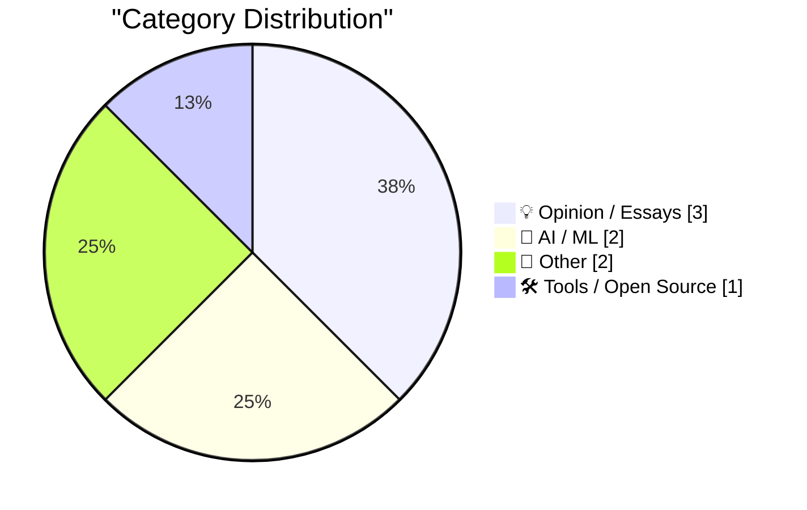
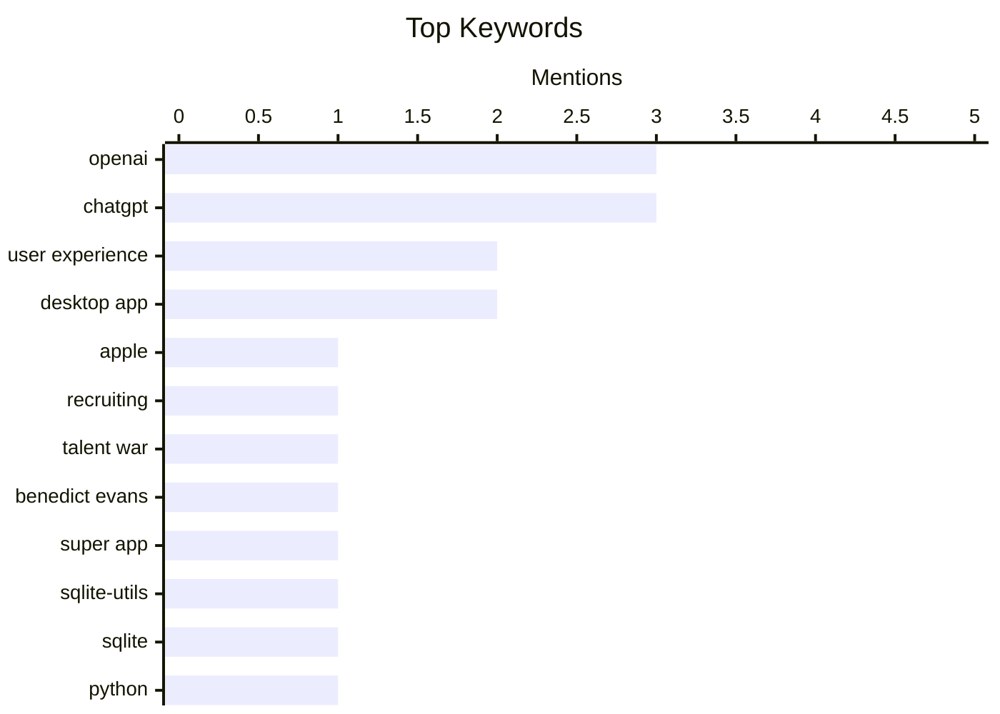

## Today's Highlights
Today's highlights spotlight OpenAI's aggressive recruitment strategies, which are significantly impacting the broader AI talent landscape. Concurrently, the company's new ChatGPT 'super app' and desktop application are facing a wave of critical reviews, with one prominent critic calling it a 'total mess'. Users are also grappling with confusion over the transition to the new app, reporting limitations and difficulties in accessing classic versions, indicating a challenging rollout for the AI giant.
---
## Must Read Today
1. **Gurman on Tang Tan and Paul Meade**
[Gurman on Tang Tan and Paul Meade](https://www.bloomberg.com/news/articles/2026-07-11/openai-engineer-s-lol-moment-set-stage-for-legal-fight-with-apple) — daringfireball.net · 19h ago · 💡 Opinion / Essays
> This article highlights OpenAI's aggressive recruitment strategy, which has significantly impacted Apple's hardware and design teams. OpenAI has been actively poaching senior leaders, including Apple's smart glasses chief Paul Meade, and ravaging several engineering organizations. Apple has responded by immediately dismissing poached executives, denying them transition periods. This indicates a fierce talent war between the two tech giants. The core takeaway is that OpenAI's talent acquisition is directly challenging Apple's key development efforts.
💡 **Why read it**: It highlights the intense talent war between major tech companies like Apple and OpenAI, particularly in critical hardware and AI domains.
🏷️ Apple, OpenAI, recruiting, talent war
2. **Benedict Evans on the New ‘Super App’ ChatGPT**
[Benedict Evans on the New ‘Super App’ ChatGPT](https://www.threads.com/@benedictevans/post/Dano_uvDr8F) — daringfireball.net · 15h ago · 💡 Opinion / Essays
> Benedict Evans critically reviews the new ChatGPT 'super app,' describing it as a 'total mess' due to significant usability and design flaws. He points out confusion between 'project,' 'task,' and 'chat,' along with inconsistent UI elements like floating windows for chats but not for other features. The review also highlights misleading 'plugins' that lead to 'templates' and a problematic setup requirement for Slack or Google Drive that is difficult to bypass. The main conclusion is that the new ChatGPT app suffers from poor design and a confusing user experience.
💡 **Why read it**: It provides a sharp, critical assessment of the new ChatGPT app's user experience and design shortcomings from a respected industry analyst.
🏷️ ChatGPT, Benedict Evans, user experience, super app
3. **sqlite-utils 4.1**
[sqlite-utils 4.1](https://simonwillison.net/2026/Jul/11/sqlite-utils/#atom-everything) — simonwillison.net · 14h ago · 🛠 Tools / Open Source
> This article announces the release of `sqlite-utils 4.1`, a minor dot-release following version 4.0. The update introduces several new features, most notably the addition of a `--code` option to the `sqlite-utils insert` and `sqlite-utils upsert` commands. This enhancement allows for more flexible and powerful data manipulation directly from the command line. The main takeaway is that `sqlite-utils 4.1` improves utility for developers by adding a useful `--code` option for key data operations.
💡 **Why read it**: It informs users and developers about a specific new feature in a popular SQLite utility, which can streamline data operations.
🏷️ sqlite-utils, SQLite, Python, database
---
## Data Overview
| Sources Scanned | Articles Fetched | Time Window | Selected |
|:---:|:---:|:---:|:---:|
| 88/92 | 2592 -> 8 | 24h | **8** |
### Category Distribution

### Top Keywords

<details>
<summary>Plain Text Keyword Chart (Terminal Friendly)</summary>
```
openai          │ ████████████████████ 3
chatgpt         │ ████████████████████ 3
user experience │ █████████████░░░░░░░ 2
desktop app     │ █████████████░░░░░░░ 2
apple           │ ███████░░░░░░░░░░░░░ 1
recruiting      │ ███████░░░░░░░░░░░░░ 1
talent war      │ ███████░░░░░░░░░░░░░ 1
benedict evans  │ ███████░░░░░░░░░░░░░ 1
super app       │ ███████░░░░░░░░░░░░░ 1
sqlite-utils    │ ███████░░░░░░░░░░░░░ 1
```
</details>
### Topic Tags
**openai**(3) · **chatgpt**(3) · **user experience**(2) · desktop app(2) · apple(1) · recruiting(1) · talent war(1) · benedict evans(1) · super app(1) · sqlite-utils(1) · sqlite(1) · python(1) · database(1) · features(1) · mathematics(1) · number theory(1) · conjecture(1) · prime numbers(1) · om malik(1) · tech industry(1)
---
## Opinion / Essays
### 1. Gurman on Tang Tan and Paul Meade
[Gurman on Tang Tan and Paul Meade](https://www.bloomberg.com/news/articles/2026-07-11/openai-engineer-s-lol-moment-set-stage-for-legal-fight-with-apple) — **daringfireball.net** · 19h ago · ⭐ 24/30
> This article highlights OpenAI's aggressive recruitment strategy, which has significantly impacted Apple's hardware and design teams. OpenAI has been actively poaching senior leaders, including Apple's smart glasses chief Paul Meade, and ravaging several engineering organizations. Apple has responded by immediately dismissing poached executives, denying them transition periods. This indicates a fierce talent war between the two tech giants. The core takeaway is that OpenAI's talent acquisition is directly challenging Apple's key development efforts.
🏷️ Apple, OpenAI, recruiting, talent war
---
### 2. Benedict Evans on the New ‘Super App’ ChatGPT
[Benedict Evans on the New ‘Super App’ ChatGPT](https://www.threads.com/@benedictevans/post/Dano_uvDr8F) — **daringfireball.net** · 15h ago · ⭐ 23/30
> Benedict Evans critically reviews the new ChatGPT 'super app,' describing it as a 'total mess' due to significant usability and design flaws. He points out confusion between 'project,' 'task,' and 'chat,' along with inconsistent UI elements like floating windows for chats but not for other features. The review also highlights misleading 'plugins' that lead to 'templates' and a problematic setup requirement for Slack or Google Drive that is difficult to bypass. The main conclusion is that the new ChatGPT app suffers from poor design and a confusing user experience.
🏷️ ChatGPT, Benedict Evans, user experience, super app
---
### 3. ★ Exactly Like Om Malik
[★ Exactly Like Om Malik](https://daringfireball.net/2026/07/exactly_like_om_malik) — **daringfireball.net** · 18h ago · ⭐ 11/30
> This article serves as a collection of remembrances, tributes, and stories dedicated to Om Malik. It compiles various perspectives and anecdotes from different individuals, celebrating his life and contributions. The piece aims to honor his impact and legacy through shared memories and acknowledgments. The main conclusion is that the article collectively reflects on and appreciates Om Malik's significance through a compilation of personal tributes.
🏷️ Om Malik, tech industry, tribute
---
## AI / ML
### 4. Can Someone Explain to Me How to Get ‘ChatGPT Classic’?
[Can Someone Explain to Me How to Get ‘ChatGPT Classic’?](https://help.openai.com/en/articles/20001276-moving-to-the-new-chatgpt-desktop-app) — **daringfireball.net** · 15h ago · ⭐ 20/30
> This OpenAI Help Center article clarifies the transition to the new ChatGPT desktop app and the status of the previous version. It explains that users upgrading to the new app may find both the new 'ChatGPT' (featuring Chat, Work, and Codex) and 'ChatGPT Classic' (the previous desktop app) installed simultaneously. Users are informed that they can continue using 'ChatGPT Classic' without any migration required. The main conclusion is that OpenAI provides flexibility by allowing users to access both the new feature-rich app and the familiar classic version.
🏷️ ChatGPT, desktop app, OpenAI, user experience
---
### 5. OpenAI Help Center Describes What Is Wrong With the New ChatGPT
[OpenAI Help Center Describes What Is Wrong With the New ChatGPT](https://help.openai.com/en/articles/20001275-chatgpt-work-and-codex) — **daringfireball.net** · 15h ago · ⭐ 20/30
> This OpenAI Help Center article details the availability and limitations of the 'Work' and 'Codex' features in the new ChatGPT app. 'Work' is available on web, mobile (for eligible paid plans), and the desktop app, with 'Codex' also accessible. A critical limitation highlighted is that cloud 'Work' conversations do not synchronize with desktop 'Work,' meaning desktop threads and local files remain isolated on the user's computer. The main conclusion is that the new ChatGPT app's 'Work' feature suffers from a significant lack of cross-platform synchronization, hindering seamless workflows.
🏷️ ChatGPT, OpenAI, desktop app, features
---
## Other
### 6. Progress on Gilbreath’s conjecture
[Progress on Gilbreath’s conjecture](https://www.johndcook.com/blog/2026/07/11/progress-on-gilbreaths-conjecture/) — **johndcook.com** · 16h ago · ⭐ 18/30
> This article discusses Gilbreath's conjecture, describing it as a simple yet 'kinda weird' and challenging problem in number theory related to prime numbers. The author notes that the conjecture is easily understandable to anyone familiar with prime numbers. Noted mathematician Paul Erdős previously speculated that the conjecture is true but difficult to prove. The main takeaway is that Gilbreath's conjecture remains an intriguing and difficult unsolved problem in number theory, despite its apparent simplicity.
🏷️ mathematics, number theory, conjecture, prime numbers
---
### 7. Another Ridiculous Interrail Holiday - 6,379Km and 13 Countries over 7 weeks
[Another Ridiculous Interrail Holiday - 6,379Km and 13 Countries over 7 weeks](https://shkspr.mobi/blog/2026/07/another-ridiculous-interrail-holiday-6379km-and-13-countries-over-7-weeks/) — **shkspr.mobi** · 2h ago · ⭐ 10/30
> This article details a couple's extensive second Interrail adventure, covering 6,379 Km and visiting 13 countries over 7 weeks. They utilized a '15 travel days in 2 months' 1st class pass, a less intense approach compared to their previous 5,025 Km, 10-country, 30-day trip. The journey included two ferry crossings, one of which was overnight. The main takeaway is that the article documents a well-planned and successful long-distance train trip, demonstrating how to balance extensive travel with a manageable pace.
🏷️ travel, Interrail, holiday, personal
---
## Tools / Open Source
### 8. sqlite-utils 4.1
[sqlite-utils 4.1](https://simonwillison.net/2026/Jul/11/sqlite-utils/#atom-everything) — **simonwillison.net** · 14h ago · ⭐ 20/30
> This article announces the release of `sqlite-utils 4.1`, a minor dot-release following version 4.0. The update introduces several new features, most notably the addition of a `--code` option to the `sqlite-utils insert` and `sqlite-utils upsert` commands. This enhancement allows for more flexible and powerful data manipulation directly from the command line. The main takeaway is that `sqlite-utils 4.1` improves utility for developers by adding a useful `--code` option for key data operations.
🏷️ sqlite-utils, SQLite, Python, database
---
*Generated at 2026-07-12 14:01 | Scanned 88 sources -> 2592 articles -> selected 8*
*Based on the [Hacker News Popularity Contest 2025](https://refactoringenglish.com/tools/hn-popularity/) RSS source list recommended by [Andrej Karpathy](https://x.com/karpathy)*
*Produced by Dongdianr AI. Follow the same-name WeChat public account for more AI practical tips 💡*
