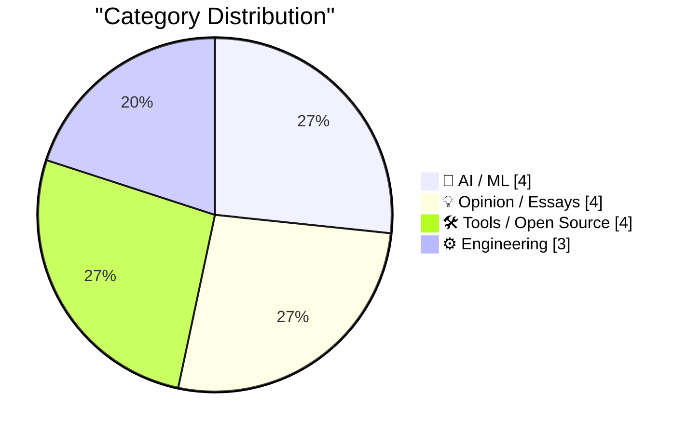
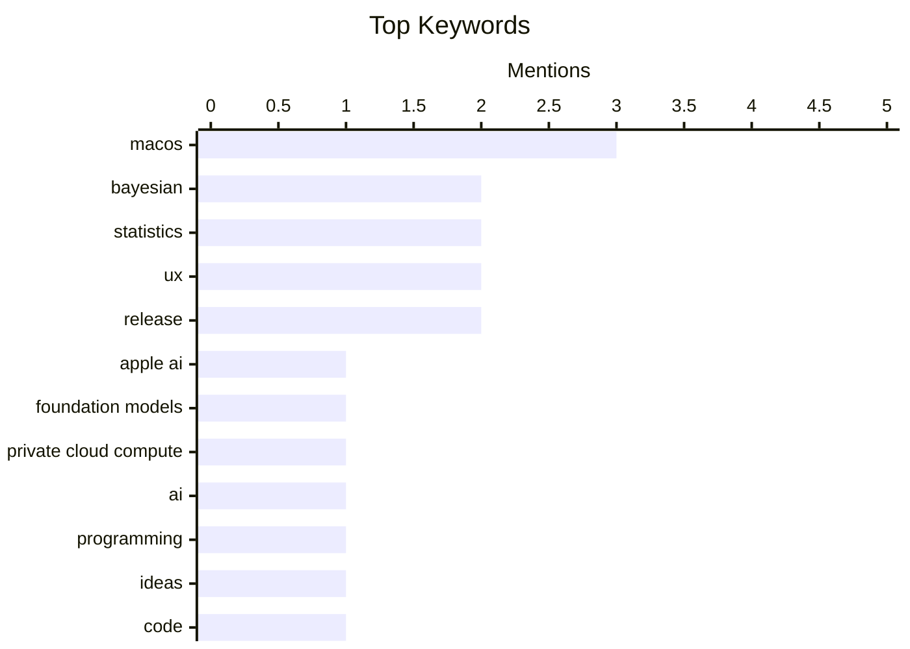

## Today's Highlights
Today's tech highlights reveal a dual focus on AI's practical deployment and its strategic market impact. New methods are emerging to leverage private cloud compute for foundation models, sparking discussions on controlling AI ideas and intellectual property. This also brings into question how AI companies will balance competition with their customer base. Concurrently, engineers are refining core AI concepts and re-evaluating fundamental design elements like user interfaces and icons.
---
## Must Read Today
1. **TwoMillionKit: Use Private Cloud Compute in MacOS 27 Foundation Models Without an Entitlement**
[TwoMillionKit: Use Private Cloud Compute in MacOS 27 Foundation Models Without an Entitlement](https://github.com/insidegui/TwoMillionKit) — daringfireball.net · 19h ago · 🤖 AI / ML
> TwoMillionKit: Use Private Cloud Compute in MacOS 27 Foundation Models Without an Entitlement
🏷️ Apple AI, macOS, Foundation Models, Private Cloud Compute
2. **Control the ideas, not the code**
[Control the ideas, not the code](http://antirez.com/news/169) — antirez.com · 2h ago · 💡 Opinion / Essays
> Control the ideas, not the code
🏷️ AI, programming, ideas, code
3. **Pluralistic: Why aren't AI companies competing directly with their customers? (13 Jul 2026)**
[Pluralistic: Why aren't AI companies competing directly with their customers? (13 Jul 2026)](https://pluralistic.net/2026/07/13/go-meta-meta/) — pluralistic.net · 5h ago · 💡 Opinion / Essays
> Pluralistic: Why aren't AI companies competing directly with their customers? (13 Jul 2026)
🏷️ AI companies, business model, competition, market dynamics
---
## Data Overview
| Sources Scanned | Articles Fetched | Time Window | Selected |
|:---:|:---:|:---:|:---:|
| 88/92 | 2592 -> 20 | 24h | **15** |
### Category Distribution

### Top Keywords

<details>
<summary>Plain Text Keyword Chart (Terminal Friendly)</summary>
```
macos                 │ ████████████████████ 3
bayesian              │ █████████████░░░░░░░ 2
statistics            │ █████████████░░░░░░░ 2
ux                    │ █████████████░░░░░░░ 2
release               │ █████████████░░░░░░░ 2
apple ai              │ ███████░░░░░░░░░░░░░ 1
foundation models     │ ███████░░░░░░░░░░░░░ 1
private cloud compute │ ███████░░░░░░░░░░░░░ 1
ai                    │ ███████░░░░░░░░░░░░░ 1
programming           │ ███████░░░░░░░░░░░░░ 1
```
</details>
### Topic Tags
**macos**(3) · **bayesian**(2) · **statistics**(2) · ux(2) · release(2) · apple ai(1) · foundation models(1) · private cloud compute(1) · ai(1) · programming(1) · ideas(1) · code(1) · ai companies(1) · business model(1) · competition(1) · market dynamics(1) · fable(1) · anthropic(1) · claude(1) · ai model(1)
---
## AI / ML
### 1. TwoMillionKit: Use Private Cloud Compute in MacOS 27 Foundation Models Without an Entitlement
[TwoMillionKit: Use Private Cloud Compute in MacOS 27 Foundation Models Without an Entitlement](https://github.com/insidegui/TwoMillionKit) — **daringfireball.net** · 19h ago · ⭐ 29/30
> TwoMillionKit: Use Private Cloud Compute in MacOS 27 Foundation Models Without an Entitlement
🏷️ Apple AI, macOS, Foundation Models, Private Cloud Compute
---
### 2. Fable gets another bump
[Fable gets another bump](https://simonwillison.net/2026/Jul/12/bump/#atom-everything) — **simonwillison.net** · 16h ago · ⭐ 24/30
> Fable gets another bump
🏷️ Fable, Anthropic, Claude, AI model
---
### 3. Posterior variance
[Posterior variance](https://www.johndcook.com/blog/2026/07/12/posterior-variance/) — **johndcook.com** · 18h ago · ⭐ 24/30
> Posterior variance
🏷️ Bayesian, posterior variance, statistics, data
---
### 4. Posterior mean
[Posterior mean](https://www.johndcook.com/blog/2026/07/12/posterior-mean/) — **johndcook.com** · 20h ago · ⭐ 24/30
> Posterior mean
🏷️ Bayesian, posterior mean, statistics, prior
---
## Opinion / Essays
### 5. Control the ideas, not the code
[Control the ideas, not the code](http://antirez.com/news/169) — **antirez.com** · 2h ago · ⭐ 26/30
> Control the ideas, not the code
🏷️ AI, programming, ideas, code
---
### 6. Pluralistic: Why aren't AI companies competing directly with their customers? (13 Jul 2026)
[Pluralistic: Why aren't AI companies competing directly with their customers? (13 Jul 2026)](https://pluralistic.net/2026/07/13/go-meta-meta/) — **pluralistic.net** · 5h ago · ⭐ 26/30
> Pluralistic: Why aren't AI companies competing directly with their customers? (13 Jul 2026)
🏷️ AI companies, business model, competition, market dynamics
---
### 7. ‘Every Frame Perfect’
[‘Every Frame Perfect’](https://tonsky.me/blog/every-frame-perfect/) — **daringfireball.net** · 18h ago · ⭐ 22/30
> ‘Every Frame Perfect’
🏷️ UI quality, user trust, software quality, UX
---
### 8. How UIs Degrade Over Time
[How UIs Degrade Over Time](https://grumpy.website/1723) — **daringfireball.net** · 18h ago · ⭐ 21/30
> How UIs Degrade Over Time
🏷️ UI design, UX, degradation, MacOS
---
## Tools / Open Source
### 9. WorkOS Pipes
[WorkOS Pipes](https://workos.com/pipes?utm_source=daringfireball&amp;utm_medium=newsletter&amp;utm_campaign=q32026) — **daringfireball.net** · 15h ago · ⭐ 19/30
> Integrating applications with existing tools like GitHub or Slack is a complex process, involving distinct OAuth flows, token lifecycles, and significant infrastructure setup. WorkOS Pipes addresses this by offering a single API call for various integrations. It provides pre-built connectors for services such as GitHub, Slack, Salesforce, and Google Drive, automatically handling OAuth, token refresh, and credential storage. This approach allows developers to interact with real providers without managing underlying authentication complexities. The main takeaway is that Pipes significantly reduces the development effort and time required for building robust third-party integrations.
🏷️ WorkOS, integrations, OAuth, developer tools
---
### 10. Stacks — HyperCard Player for Modern MacOS
[Stacks — HyperCard Player for Modern MacOS](https://morphing.cloud/hypercard/) — **daringfireball.net** · 22h ago · ⭐ 19/30
> The article introduces Stacks, a native macOS application designed to run classic HyperCard stacks directly on modern Macs without requiring an emulator. Stacks offers a faithful recreation of the original HyperCard experience, featuring period-accurate typography, sound, instruments, and MacinTalk speech synthesis. Users can browse the Internet Archive's HyperCard collection and launch stacks with a single click, complete with cross-stack navigation. This application provides a delightful and authentic way to interact with historical HyperCard content on contemporary Apple hardware.
🏷️ HyperCard, macOS, retro computing, player
---
### 11. shot-scraper 1.11
[shot-scraper 1.11](https://simonwillison.net/2026/Jul/12/shot-scraper/#atom-everything) — **simonwillison.net** · 14h ago · ⭐ 18/30
> This article announces the release of `shot-scraper` version 1.11, a tool for web scraping and screenshotting. The update primarily focuses on minor improvements, including enhanced command option consistency. A key technical improvement is making the `server:` mechanism, utilized by `shot-scraper video` and `shot-scraper multi` commands, more robust by allowing the server to take longer than one second to start. This release aims to improve the tool's overall reliability and user experience, especially for operations involving server startup. The main takeaway is that `shot-scraper 1.11` enhances stability and consistency for web scraping and screenshotting tasks.
🏷️ shot-scraper, release, web scraping, developer tool
---
### 12. sqlite-utils 4.1.1
[sqlite-utils 4.1.1](https://simonwillison.net/2026/Jul/12/sqlite-utils/#atom-everything) — **simonwillison.net** · 17h ago · ⭐ 18/30
> This article announces the release of `sqlite-utils` version 4.1.1, a utility for working with SQLite databases. The update is primarily a bug fix release, addressing an edge case identified by Claude chat during experimentation with the 4.1 release related to `ON DELETE` functionality. Specifically, the `table.transform()` method now correctly raises a `TransactionError` if invoked while a transaction is already open, preventing potential data integrity issues. The main takeaway is that `sqlite-utils 4.1.1` provides a critical fix to ensure data consistency when performing table transformations within active transactions.
🏷️ sqlite-utils, SQLite, release, database tool
---
## Engineering
### 13. Directly Responsible Individuals (DRI)
[Directly Responsible Individuals (DRI)](https://simonwillison.net/2026/Jul/12/directly-responsible-individuals/#atom-everything) — **simonwillison.net** · 14h ago · ⭐ 20/30
> Directly Responsible Individuals (DRI)
🏷️ DRI, GitLab, team organization, responsibility
---
### 14. What’s an Icon in 2026?
[What’s an Icon in 2026?](https://blog.jim-nielsen.com/2026/icons-as-software/) — **blog.jim-nielsen.com** · 19h ago · ⭐ 20/30
> What’s an Icon in 2026?
🏷️ icons, Apple, UI/UX, design
---
### 15. Panel meter calculator with floating point
[Panel meter calculator with floating point](https://lcamtuf.substack.com/p/panel-meter-calculator-with-floating) — **lcamtuf.substack.com** · 17h ago · ⭐ 19/30
> This article introduces a project or concept for a panel meter calculator capable of handling floating-point numbers. While specific technical details are not provided in the snippet, the title indicates a focus on precision in measurement and display. The article suggests an accompanying video resource that likely demonstrates the functionality and implementation of this floating-point panel meter. The main takeaway is the presentation of a specialized calculator designed for accurate numerical display, particularly for values requiring decimal precision.
🏷️ panel meter, calculator, floating point
---
*Generated at 2026-07-13 14:01 | Scanned 88 sources -> 2592 articles -> selected 15*
*Based on the [Hacker News Popularity Contest 2025](https://refactoringenglish.com/tools/hn-popularity/) RSS source list recommended by [Andrej Karpathy](https://x.com/karpathy)*
*Produced by Dongdianr AI. Follow the same-name WeChat public account for more AI practical tips 💡*
