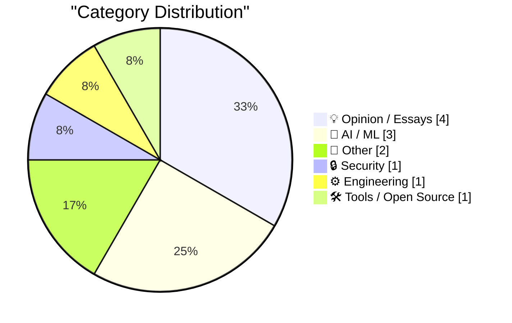
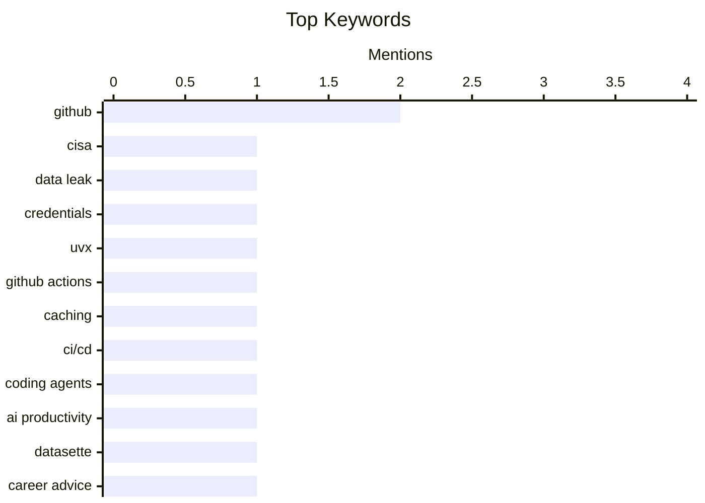

## Today's Highlights
Today's tech news underscores the pervasive impact of AI/ML, from influencing personal code output and powering creative applications to sparking major legal disputes among tech giants. Concurrently, the critical role of development platforms like GitHub is highlighted, facing scrutiny over security vulnerabilities while also being optimized for engineering efficiency and leveraged for insightful code analysis. These trends collectively paint a picture of a rapidly evolving software development landscape grappling with both innovation and inherent challenges.
---
## Must Read Today
1. **Lessons Learned from CISA’s Recent GitHub Leak**
[Lessons Learned from CISA’s Recent GitHub Leak](https://krebsonsecurity.com/2026/07/lessons-learned-from-cisas-recent-github-leak/) — krebsonsecurity.com · 22h ago · 🔒 Security
> CISA experienced a significant data leak where a contractor exposed dozens of internal credentials, including AWS Govcloud keys, in a public GitHub repository for nearly six months. The leak was discovered by KrebsOnSecurity, highlighting critical gaps in the agency's internal monitoring and incident response protocols. The exposed data posed a severe security risk, underscoring challenges in managing contractor access and continuous oversight. This incident emphasizes the need for robust credential monitoring and proactive incident detection. The postmortem by CISA provides crucial lessons for all security teams on preventing similar occurrences.
💡 **Why read it**: It offers critical insights into real-world data leak scenarios, emphasizing the importance of proactive monitoring and incident response for all organizations.
🏷️ CISA, data leak, GitHub, credentials
2. **Using uvx in GitHub Actions in a cache-friendly way**
[Using uvx in GitHub Actions in a cache-friendly way](https://simonwillison.net/2026/Jul/14/uvx-github-actions-cache/#atom-everything) — simonwillison.net · 13h ago · ⚙️ Engineering
> This article addresses the challenge of efficiently caching `uvx tool-name` usage within GitHub Actions workflows to improve build times. The author found a cache-friendly recipe by setting the `UV_EXCLUDE_NEWER: "2026-07-12"` environment variable at the start of the workflow. This variable is then incorporated into the GitHub Actions cache key, ensuring the cache is invalidated only when `uv` or its dependencies are updated past the specified date. This method prevents unnecessary cache rebuilds and optimizes CI/CD performance. This approach provides a reliable and efficient way to manage `uvx` dependencies in automated pipelines.
💡 **Why read it**: It provides a practical, technical solution for optimizing GitHub Actions workflows using `uvx` and caching, directly improving CI/CD efficiency.
🏷️ uvx, GitHub Actions, caching, CI/CD
3. **datasette code-frequency chart on GitHub**
[datasette code-frequency chart on GitHub](https://simonwillison.net/2026/Jul/13/datasette-code-frequency/#atom-everything) — simonwillison.net · 16h ago · 🤖 AI / ML
> The author investigated the impact of coding agents and Opus 4.5 class models on personal code output using GitHub's code-frequency chart for the Datasette project. The GitHub "Code frequency" chart was identified as the best available illustration for visualizing changes in coding output over time. While specific quantitative impacts are not detailed, the article implies a visual analysis of how AI tools might influence development patterns. This approach focuses on leveraging existing GitHub metrics to observe these trends. GitHub's code-frequency chart can serve as a useful, albeit high-level, tool for developers to observe potential changes in their coding output influenced by AI assistants.
💡 **Why read it**: It offers a simple, accessible method using GitHub's built-in tools to visually assess the impact of AI coding assistants on personal development output.
🏷️ coding agents, AI productivity, GitHub, Datasette
---
## Data Overview
| Sources Scanned | Articles Fetched | Time Window | Selected |
|:---:|:---:|:---:|:---:|
| 88/92 | 2594 -> 12 | 24h | **12** |
### Category Distribution

### Top Keywords

<details>
<summary>Plain Text Keyword Chart (Terminal Friendly)</summary>
```
github          │ ████████████████████ 2
cisa            │ ██████████░░░░░░░░░░ 1
data leak       │ ██████████░░░░░░░░░░ 1
credentials     │ ██████████░░░░░░░░░░ 1
uvx             │ ██████████░░░░░░░░░░ 1
github actions  │ ██████████░░░░░░░░░░ 1
caching         │ ██████████░░░░░░░░░░ 1
ci/cd           │ ██████████░░░░░░░░░░ 1
coding agents   │ ██████████░░░░░░░░░░ 1
ai productivity │ ██████████░░░░░░░░░░ 1
```
</details>
### Topic Tags
**github**(2) · **cisa**(1) · **data leak**(1) · credentials(1) · uvx(1) · github actions(1) · caching(1) · ci/cd(1) · coding agents(1) · ai productivity(1) · datasette(1) · career advice(1) · soft skills(1) · workplace politics(1) · software engineers(1) · distribution(1) · statistics(1) · data analysis(1) · elon musk(1) · apple(1)
---
## Opinion / Essays
### 1. What does "playing politics" mean for software engineers?
[What does "playing politics" mean for software engineers?](https://seangoedecke.com/playing-politics/) — **seangoedecke.com** · 14h ago · ⭐ 22/30
> Many software engineers are advised to "play politics" but often lack a clear understanding of its professional meaning, associating it with negative or fictionalized scenarios. The article aims to demystify this concept, moving beyond Game of Thrones-esque interpretations. It suggests that "playing politics" involves understanding organizational dynamics, building relationships, communicating effectively, and advocating for ideas or projects. This often means navigating stakeholder interests and influencing decisions without resorting to manipulative tactics. Ultimately, it's about developing soft skills and strategic communication to effectively advance one's work and career within an organization.
🏷️ career advice, soft skills, workplace politics, software engineers
---
### 2. Remember Musk’s Suit Alleging a Conspiracy Between Apple and OpenAI?
[Remember Musk’s Suit Alleging a Conspiracy Between Apple and OpenAI?](https://arstechnica.com/tech-policy/2025/08/elon-musk-sues-apple-openai-to-block-exclusive-iphone-chatgpt-integration/) — **daringfireball.net** · 22h ago · ⭐ 20/30
> This article discusses Elon Musk's lawsuit against Apple and OpenAI, filed in August 2025, alleging a conspiracy to block rivals like Grok. Musk initially expressed frustration over ChatGPT's consistent top ranking on Apple's "Must Have" app list, which Grok never achieved, suggesting Apple favored its partner OpenAI. The lawsuit, however, expanded beyond App Store rankings to allege a broader conspiracy. This legal action highlights the intense competition and strategic maneuvering in the AI chatbot market. Musk's lawsuit against Apple and OpenAI underscores the significant competitive pressures and potential antitrust concerns emerging in the rapidly evolving AI ecosystem.
🏷️ Elon Musk, Apple, OpenAI, lawsuit
---
### 3. Pluralistic: Gerontocracy's failure mode (14 Jul 2026)
[Pluralistic: Gerontocracy's failure mode (14 Jul 2026)](https://pluralistic.net/2026/07/14/designated-survivor/) — **pluralistic.net** · 2h ago · ⭐ 19/30
> This article, part of Cory Doctorow's "Pluralistic" series, discusses the "failure mode of gerontocracy" and related societal issues. The article likely explores how governance by an older generation can lead to systemic failures, potentially due to a lack of understanding of modern challenges or resistance to change. It touches upon various "object permanence" issues, such as Microsoft vs. MP3s, UK industry vs. schoolkids, and Google vs. search, suggesting recurring patterns of established powers resisting innovation or progress. The piece critically examines how entrenched power structures, particularly gerontocracies, can impede societal and technological advancement, leading to predictable failures across different domains.
🏷️ gerontocracy, social commentary, tech policy, Cory Doctorow
---
### 4. I'm a USB-C Maximalist
[I'm a USB-C Maximalist](https://shkspr.mobi/blog/2026/07/im-a-usb-c-maximalist/) — **shkspr.mobi** · 2h ago · ⭐ 17/30
> The author advocates for USB-C as the universal charging and power standard, based on a 7-week European holiday experience. The author successfully traveled with a single universal power brick featuring a hefty USB-C PD (Power Delivery) port for rapid charging of a phone and laptop, plus two additional USB-C ports for other gadgets. This setup eliminated the need for multiple chargers and cables, significantly reducing travel bulk and complexity. The experience highlights USB-C's versatility and efficiency across various devices. USB-C, especially with Power Delivery, is presented as the optimal universal standard for charging and powering diverse electronic devices, simplifying travel and daily tech management.
🏷️ USB-C, travel tech, power delivery, gadgets
---
## AI / ML
### 5. datasette code-frequency chart on GitHub
[datasette code-frequency chart on GitHub](https://simonwillison.net/2026/Jul/13/datasette-code-frequency/#atom-everything) — **simonwillison.net** · 16h ago · ⭐ 22/30
> The author investigated the impact of coding agents and Opus 4.5 class models on personal code output using GitHub's code-frequency chart for the Datasette project. The GitHub "Code frequency" chart was identified as the best available illustration for visualizing changes in coding output over time. While specific quantitative impacts are not detailed, the article implies a visual analysis of how AI tools might influence development patterns. This approach focuses on leveraging existing GitHub metrics to observe these trends. GitHub's code-frequency chart can serve as a useful, albeit high-level, tool for developers to observe potential changes in their coding output influenced by AI assistants.
🏷️ coding agents, AI productivity, GitHub, Datasette
---
### 6. Intuition for distribution differences
[Intuition for distribution differences](https://entropicthoughts.com/distribution-differences) — **entropicthoughts.com** · 16h ago · ⭐ 21/30
> The article introduces the concept of understanding differences between data distributions using a hypothetical scenario of scores assigned to a country's population. It uses a government-collected score distribution as an example to build intuition for comparing different population-level data sets. The discussion likely delves into visual or statistical methods for identifying and interpreting variations between these distributions, such as comparing means, variances, or shapes of histograms. Developing an intuition for distribution differences is crucial for data analysis, enabling better interpretation of population-level data and identifying significant variations.
🏷️ distribution, statistics, data analysis
---
### 7. DOOMQL
[DOOMQL](https://simonwillison.net/2026/Jul/13/doomql/#atom-everything) — **simonwillison.net** · 15h ago · ⭐ 19/30
> Peter Gostev created DOOMQL, a unique Doom-like game where SQLite serves as the game engine, not just for data storage. Built using GPT-5.6 Sol, DOOMQL demonstrates an unconventional use of SQL. SQL queries manage core game mechanics, including player movement, collision detection, enemy behavior, combat, progression, and even rendering every RGB pixel on screen. This approach challenges traditional game development paradigms by leveraging a database for real-time game logic. DOOMQL showcases a highly creative and technically impressive application of SQL as a game engine, pushing the boundaries of what databases can achieve.
🏷️ DOOMQL, SQLite, game engine, GPT-5.6 Sol
---
## Other
### 8. Nintendo Famicom and the secret of Nintendo’s success
[Nintendo Famicom and the secret of Nintendo’s success](https://dfarq.homeip.net/nintendo-famicom-and-the-secret-of-nintendos-success/?utm_source=rss&#038;utm_medium=rss&#038;utm_campaign=nintendo-famicom-and-the-secret-of-nintendos-success) — **dfarq.homeip.net** · 3h ago · ⭐ 14/30
> The article introduces the Nintendo Famicom (Family Computer), which launched in Japan on July 15, 1983. Despite its name, it was a dedicated game console that quickly achieved significant commercial success. It went on to surpass the Atari 2600's record for the most sales worldwide. This early success hinted at Nintendo's future dominance and its strategic approach to the burgeoning video game market.
🏷️ Nintendo, Famicom, gaming history
---
### 9. Mandatory Update: A Short Story
[Mandatory Update: A Short Story](https://micahflee.com/mandatory-update-a-short-story/) — **micahflee.com** · 22h ago · ⭐ 10/30
> The article announces the author's recent foray into creative writing, including joining a local fiction writers group. The author has developed a short story titled "Mandatory Update." This story has been submitted to the DEF CON 34 Creative Writing Short Story Contest. This marks a new creative endeavor for the author, branching into fiction writing within a technical community context.
🏷️ short story, DEF CON, creative writing, fiction
---
## Security
### 10. Lessons Learned from CISA’s Recent GitHub Leak
[Lessons Learned from CISA’s Recent GitHub Leak](https://krebsonsecurity.com/2026/07/lessons-learned-from-cisas-recent-github-leak/) — **krebsonsecurity.com** · 22h ago · ⭐ 28/30
> CISA experienced a significant data leak where a contractor exposed dozens of internal credentials, including AWS Govcloud keys, in a public GitHub repository for nearly six months. The leak was discovered by KrebsOnSecurity, highlighting critical gaps in the agency's internal monitoring and incident response protocols. The exposed data posed a severe security risk, underscoring challenges in managing contractor access and continuous oversight. This incident emphasizes the need for robust credential monitoring and proactive incident detection. The postmortem by CISA provides crucial lessons for all security teams on preventing similar occurrences.
🏷️ CISA, data leak, GitHub, credentials
---
## Engineering
### 11. Using uvx in GitHub Actions in a cache-friendly way
[Using uvx in GitHub Actions in a cache-friendly way](https://simonwillison.net/2026/Jul/14/uvx-github-actions-cache/#atom-everything) — **simonwillison.net** · 13h ago · ⭐ 24/30
> This article addresses the challenge of efficiently caching `uvx tool-name` usage within GitHub Actions workflows to improve build times. The author found a cache-friendly recipe by setting the `UV_EXCLUDE_NEWER: "2026-07-12"` environment variable at the start of the workflow. This variable is then incorporated into the GitHub Actions cache key, ensuring the cache is invalidated only when `uv` or its dependencies are updated past the specified date. This method prevents unnecessary cache rebuilds and optimizes CI/CD performance. This approach provides a reliable and efficient way to manage `uvx` dependencies in automated pipelines.
🏷️ uvx, GitHub Actions, caching, CI/CD
---
## Tools / Open Source
### 12. [Sponsor] Paper
[[Sponsor] Paper](https://paper.design/?utm_source=df) — **daringfireball.net** · 8h ago · ⭐ 18/30
> Paper is introduced as a professional design tool that bridges the gap between design and code by using real HTML and CSS layers. Its unique selling proposition is that designs are inherently code, eliminating the need for translation during handoffs. Paper supports both code-to-design and design-to-code workflows, allowing users to connect agents via MCP to read and edit designs. Additionally, Paper Snapshot can convert live sites into editable layers for iteration. This integration streamlines the design-to-development pipeline. Paper aims to revolutionize design workflows by making designs directly editable as code, leveraging AI agents to automate tedious tasks and enhance collaboration.
🏷️ design tool, HTML CSS, design to code, UI/UX
---
*Generated at 2026-07-14 14:01 | Scanned 88 sources -> 2594 articles -> selected 12*
*Based on the [Hacker News Popularity Contest 2025](https://refactoringenglish.com/tools/hn-popularity/) RSS source list recommended by [Andrej Karpathy](https://x.com/karpathy)*
*Produced by Dongdianr AI. Follow the same-name WeChat public account for more AI practical tips 💡*
