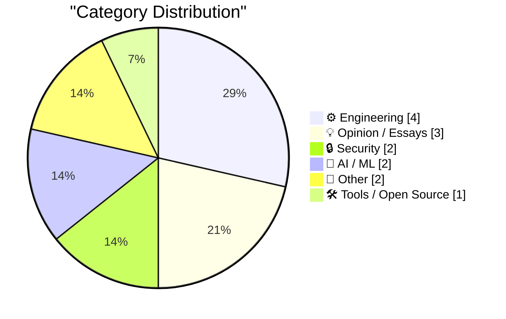
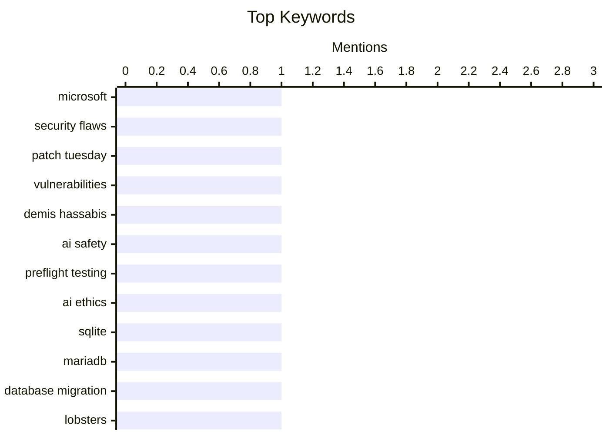

## Today's Highlights
Security and reliability are paramount in today's tech landscape, with Microsoft issuing a record number of patches and AI leaders advocating for "preflight safety testing" to ensure responsible development. Real-world incidents, like an IoT lockout, underscore the critical need for robust systems. Meanwhile, software engineering trends show a drive towards efficiency and stability, exemplified by database migrations to simpler solutions and enhanced dependency management tools.
---
## Must Read Today
1. **Microsoft Patches a Record 570 Security Flaws**
[Microsoft Patches a Record 570 Security Flaws](https://krebsonsecurity.com/2026/07/microsoft-patches-a-record-570-security-flaws/) — krebsonsecurity.com · 18h ago · 🔒 Security
> Microsoft released a record-breaking 570 security patches for its Windows operating systems and other software. This number is almost triple the vulnerabilities fixed in the previous month's record-smashing Patch Tuesday. Microsoft attributes this burgeoning patch count to vulnerability discoveries aided by artificial intelligence. This trend indicates AI's growing impact on accelerating the identification of security flaws.
💡 **Why read it**: This article highlights a significant trend in cybersecurity, showing how AI is accelerating vulnerability discovery and the resulting patch volume for major software vendors.
🏷️ Microsoft, Security Flaws, Patch Tuesday, Vulnerabilities
2. **Breaking: Demis Hassabis endorses preflight safety testing for AI**
[Breaking: Demis Hassabis endorses preflight safety testing for AI](https://garymarcus.substack.com/p/breaking-demis-hassabis-endorses) — garymarcus.substack.com · 23h ago · 🤖 AI / ML
> Demis Hassabis, a prominent figure in AI, has publicly endorsed the critical concept of "preflight safety testing" for AI systems. This endorsement signals a growing recognition within the AI community for implementing rigorous, proactive safety measures before AI deployment. The analogy to preflight checks in aviation underscores the necessity for thorough validation to prevent potential failures and ensure system reliability. Hassabis's stance suggests a positive shift towards prioritizing safety and robust testing methodologies in AI development.
💡 **Why read it**: It's worth reading to understand the evolving consensus among AI leaders regarding the critical importance of safety testing for AI systems, drawing parallels to established high-stakes industries.
🏷️ Demis Hassabis, AI Safety, Preflight Testing, AI Ethics
3. **lobste.rs is now running on SQLite**
[lobste.rs is now running on SQLite](https://simonwillison.net/2026/Jul/14/lobsters-sqlite/#atom-everything) — simonwillison.net · 18h ago · ⚙️ Engineering
> The community site Lobsters has successfully migrated its primary database from MariaDB to SQLite. This migration has been a long-term project, planned since August 2018, with an initial target of PostgreSQL before deciding last year to investigate SQLite. The successful transition demonstrates SQLite's capability to serve as a robust primary database for established web applications. This move represents a significant architectural shift, highlighting SQLite's growing adoption for production systems.
💡 **Why read it**: This article provides a concrete example of a production community site migrating to SQLite, offering insights into its practical application and potential benefits for web development.
🏷️ SQLite, MariaDB, Database Migration, Lobsters
---
## Data Overview
| Sources Scanned | Articles Fetched | Time Window | Selected |
|:---:|:---:|:---:|:---:|
| 88/92 | 2595 -> 14 | 24h | **14** |
### Category Distribution

### Top Keywords

<details>
<summary>Plain Text Keyword Chart (Terminal Friendly)</summary>
```
microsoft         │ ████████████████████ 1
security flaws    │ ████████████████████ 1
patch tuesday     │ ████████████████████ 1
vulnerabilities   │ ████████████████████ 1
demis hassabis    │ ████████████████████ 1
ai safety         │ ████████████████████ 1
preflight testing │ ████████████████████ 1
ai ethics         │ ████████████████████ 1
sqlite            │ ████████████████████ 1
mariadb           │ ████████████████████ 1
```
</details>
### Topic Tags
**microsoft**(1) · **security flaws**(1) · **patch tuesday**(1) · vulnerabilities(1) · demis hassabis(1) · ai safety(1) · preflight testing(1) · ai ethics(1) · sqlite(1) · mariadb(1) · database migration(1) · lobsters(1) · software project(1) · shared language(1) · system design(1) · armin ronacher(1) · dependabot(1) · github(1) · dependency management(1) · changelog(1)
---
## Engineering
### 1. lobste.rs is now running on SQLite
[lobste.rs is now running on SQLite](https://simonwillison.net/2026/Jul/14/lobsters-sqlite/#atom-everything) — **simonwillison.net** · 18h ago · ⭐ 24/30
> The community site Lobsters has successfully migrated its primary database from MariaDB to SQLite. This migration has been a long-term project, planned since August 2018, with an initial target of PostgreSQL before deciding last year to investigate SQLite. The successful transition demonstrates SQLite's capability to serve as a robust primary database for established web applications. This move represents a significant architectural shift, highlighting SQLite's growing adoption for production systems.
🏷️ SQLite, MariaDB, Database Migration, Lobsters
---
### 2. Quoting Armin Ronacher
[Quoting Armin Ronacher](https://simonwillison.net/2026/Jul/14/armin-ronacher/#atom-everything) — **simonwillison.net** · 19h ago · ⭐ 24/30
> Armin Ronacher argues that the true shared language of a software project transcends natural or programming languages. He defines this language as a common understanding of concepts, boundaries, invariants, ownership, and the system's underlying design rationale. This critical knowledge is distributed across documentation, code, code reviews, conversations, arguments, and the experience of explaining the system. Ultimately, effective software development relies heavily on cultivating and maintaining this holistic, often unwritten, shared understanding among team members.
🏷️ Software Project, Shared Language, System Design, Armin Ronacher
---
### 3. Quoting GitHub Changelog
[Quoting GitHub Changelog](https://simonwillison.net/2026/Jul/14/github-changeling/#atom-everything) — **simonwillison.net** · 15h ago · ⭐ 23/30
> GitHub's Dependabot version updates now incorporate a default "package cooldown" period to enhance stability. Dependabot will wait for at least three days after a new release becomes available on its registry before opening a version update pull request. This cooldown mechanism is now enabled by default and requires no additional configuration from users. The feature aims to reduce noise and potential issues from premature updates by allowing new releases to stabilize before being suggested.
🏷️ Dependabot, GitHub, Dependency Management, Changelog
---
### 4. Notes on the Fourier Transform
[Notes on the Fourier Transform](https://eli.thegreenplace.net/2026/notes-on-the-fourier-transform/) — **eli.thegreenplace.net** · 10h ago · ⭐ 23/30
> The article introduces the Fourier Transform as a powerful tool for analyzing non-periodic functions, building upon the foundational concepts of Fourier series. While Fourier series are effective for periodic functions or non-periodic functions defined on finite intervals, they have limitations beyond those intervals. The Fourier Transform extends this analysis to functions that do not repeat over an infinite domain. It provides a mathematical framework for decomposing complex, non-periodic signals into their constituent frequencies, essential for fields like signal processing.
🏷️ Fourier Transform, signal processing, mathematics
---
## Opinion / Essays
### 5. They Prefer the App
[They Prefer the App](https://idiallo.com/blog/they-prefer-the-app) — **idiallo.com** · 15h ago · ⭐ 22/30
> The author observes a prevalent user preference for native mobile applications, even for simple informational tasks, despite the technical efficiency of websites. Many applications, particularly those for schools that primarily present information, could easily be replaced by a simple website. However, there appears to be a cultural or perceived value preference driving the demand for dedicated apps. This trend suggests a disconnect between the technical feasibility of web-based solutions and the market's perceived need for native app experiences.
🏷️ Web Development, Native Apps, Industry Trends, Opinion
---
### 6. Ben je van de IT of niet?
[Ben je van de IT of niet?](https://berthub.eu/articles/posts/ben-je-van-de-it-of-niet/) — **berthub.eu** · 3h ago · ⭐ 15/30
> This article illustrates the common organizational challenge of unclear responsibilities and bureaucratic hurdles in resolving seemingly simple infrastructure problems, using a broken office toilet as an example. When a toilet malfunctioned, facility management, the landlord (responsible for sewage but not toilets), and even legal departments were involved over a week. Each entity deflected responsibility, leading to significant delays and frustration. The anecdote highlights how organizational silos and a lack of clear ownership can severely impede efficient problem-solving, even for minor issues.
🏷️ workplace, IT roles, organizational issues
---
### 7. I'm still alive
[I'm still alive](https://buttondown.com/hillelwayne/archive/im-still-alive/) — **buttondown.com/hillelwayne** · 21h ago · ⭐ 3/30
> The content for this article is not provided, making it impossible to determine the core topic or problem discussed. Consequently, no key arguments, technical approaches, or findings can be extracted from the missing text. Without any available content, no conclusion or takeaway can be formulated.
🏷️ Personal Update, Hillel Wayne, Status
---
## Security
### 8. Microsoft Patches a Record 570 Security Flaws
[Microsoft Patches a Record 570 Security Flaws](https://krebsonsecurity.com/2026/07/microsoft-patches-a-record-570-security-flaws/) — **krebsonsecurity.com** · 18h ago · ⭐ 29/30
> Microsoft released a record-breaking 570 security patches for its Windows operating systems and other software. This number is almost triple the vulnerabilities fixed in the previous month's record-smashing Patch Tuesday. Microsoft attributes this burgeoning patch count to vulnerability discoveries aided by artificial intelligence. This trend indicates AI's growing impact on accelerating the identification of security flaws.
🏷️ Microsoft, Security Flaws, Patch Tuesday, Vulnerabilities
---
### 9. Weekly Update 512: IoT Lockout Fail
[Weekly Update 512: IoT Lockout Fail](https://www.troyhunt.com/weekly-update-512/) — **troyhunt.com** · 13h ago · ⭐ 23/30
> The author experienced a frustrating lockout from his smart home after a 33-hour journey, due to dead batteries in his IoT door lock. This incident highlights a critical reliability flaw in smart home technology, where a single point of failure like a battery can render a primary security mechanism inoperable. The experience underscores the practical downsides and significant inconvenience caused by such failures. It emphasizes the importance of robust fallback mechanisms and careful consideration of failure modes when deploying IoT devices for critical functions.
🏷️ IoT, smart home, security, reliability
---
## AI / ML
### 10. Breaking: Demis Hassabis endorses preflight safety testing for AI
[Breaking: Demis Hassabis endorses preflight safety testing for AI](https://garymarcus.substack.com/p/breaking-demis-hassabis-endorses) — **garymarcus.substack.com** · 23h ago · ⭐ 29/30
> Demis Hassabis, a prominent figure in AI, has publicly endorsed the critical concept of "preflight safety testing" for AI systems. This endorsement signals a growing recognition within the AI community for implementing rigorous, proactive safety measures before AI deployment. The analogy to preflight checks in aviation underscores the necessity for thorough validation to prevent potential failures and ensure system reliability. Hassabis's stance suggests a positive shift towards prioritizing safety and robust testing methodologies in AI development.
🏷️ Demis Hassabis, AI Safety, Preflight Testing, AI Ethics
---
### 11. simonw/pedalican
[simonw/pedalican](https://simonwillison.net/2026/Jul/14/pedalican/#atom-everything) — **simonwillison.net** · 15h ago · ⭐ 15/30
> This article introduces the concept of customizable animated desktop "pets" within Codex Desktop, drawing parallels to Microsoft's Clippy. The author discovered this feature after accidentally activating a built-in pet and subsequently learned that users can create their own. This led to the development of `simonw/pedalican`, a personalized animated robot. The feature allows for the creation of unique, interactive desktop companions, potentially enhancing user engagement or adding a whimsical element to development environments.
🏷️ Codex Desktop, AI, Pet, simonw
---
## Other
### 12. ICD-10 chapters and code letters
[ICD-10 chapters and code letters](https://www.johndcook.com/blog/2026/07/14/icd-10-chapters-letters/) — **johndcook.com** · 23h ago · ⭐ 16/30
> The article examines the structural organization of ICD-10-CM codes, specifically how they are divided into 21 chapters and their relationship with initial code letters. While chapters generally correspond to the first letter of a code, the author notes exceptions. These exceptions include chapters containing blocks beginning with multiple letters, and single letters, such as 'D', spanning across different chapters. This highlights the nuanced and sometimes complex mapping between chapters and code letters in the ICD-10-CM standard.
🏷️ ICD-10, Medical Codes, Healthcare, Classification
---
### 13. Reasons for Escom’s bankruptcy
[Reasons for Escom’s bankruptcy](https://dfarq.homeip.net/reasons-for-escoms-bankruptcy/?utm_source=rss&#038;utm_medium=rss&#038;utm_campaign=reasons-for-escoms-bankruptcy) — **dfarq.homeip.net** · 3h ago · ⭐ 11/30
> This article reports the bankruptcy of German PC manufacturer Escom on July 15, 1996. The company's collapse occurred less than two years after its significant acquisition of the iconic Commodore and Amiga brand names. Escom had begun integrating and utilizing the technology from these acquired brands in its products. This event marked a significant downturn for a company that had recently attempted to leverage established, albeit struggling, computing legacies.
🏷️ Escom, bankruptcy, Commodore, Amiga
---
## Tools / Open Source
### 14. datasette 1.0a37
[datasette 1.0a37](https://simonwillison.net/2026/Jul/14/datasette/#atom-everything) — **simonwillison.net** · 21h ago · ⭐ 18/30
> Datasette has released version 1.0a37, a minor update focusing on performance, documentation, and stability. This release includes specific performance and documentation improvements to the permissions system. Crucially, a cosmetic API change that previously caused almost every existing plugin test suite to break was reverted. This ensures better backward compatibility and a more stable development experience as Datasette progresses towards its 1.0 milestone.
🏷️ Datasette, Release, Performance, Documentation
---
*Generated at 2026-07-15 14:01 | Scanned 88 sources -> 2595 articles -> selected 14*
*Based on the [Hacker News Popularity Contest 2025](https://refactoringenglish.com/tools/hn-popularity/) RSS source list recommended by [Andrej Karpathy](https://x.com/karpathy)*
*Produced by Dongdianr AI. Follow the same-name WeChat public account for more AI practical tips 💡*
