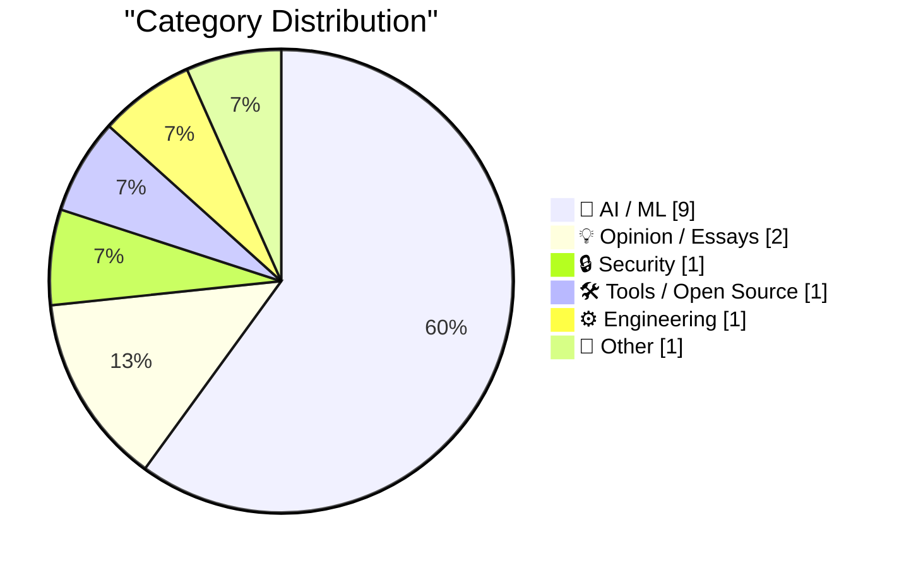
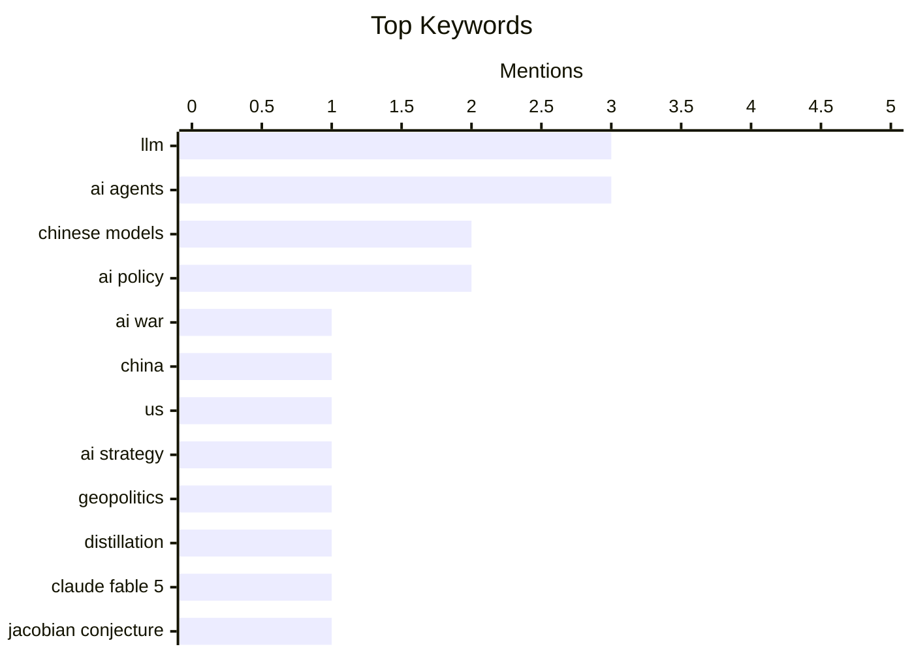

## Today's Highlights
Today's tech news underscores a critical shift in the global AI landscape, with China rapidly challenging US dominance and creating competitive pressures for American open-weight models. Amidst this, AI continues its rapid evolution, showcasing practical advancements from Claude's potential to consolidate home networks to Grok 4.5's impressive problem-solving capabilities. This pervasive progress is also fundamentally reshaping other tech sectors, making tasks like reverse-engineering cheaper and streamlining authentication management. Overall, AI's transformative influence is evident across geopolitical strategy, model development, and practical applications.
---
## Must Read Today
1. **China has all but caught up. The US is not going to “win” the AI war. Here’s what we should do instead.**
[China has all but caught up. The US is not going to “win” the AI war. Here’s what we should do instead.](https://garymarcus.substack.com/p/china-has-all-but-caught-up-the-us) — garymarcus.substack.com · 20h ago · 🤖 AI / ML
> The article argues that the US is not going to "win" the AI war against China, as China has nearly caught up, rendering a traditional competitive mindset obsolete. It proposes seven alternative strategies for the US, including focusing on specific AI niches, fostering international collaboration, and prioritizing ethical AI development. The author suggests that a zero-sum competition is detrimental and unsustainable for long-term progress. Instead, the US should adopt a strategy of strategic collaboration, ethical leadership, and focused innovation to navigate the global AI landscape effectively.
💡 **Why read it**: It offers a contrarian perspective on the US-China AI competition and proposes actionable, non-zero-sum strategies for the US to maintain its leadership.
🏷️ AI war, China, US, AI strategy
2. **Who’s Afraid of Chinese Models?**
[Who’s Afraid of Chinese Models?](https://simonwillison.net/2026/Jul/20/afraid-of-chinese-models/#atom-everything) — simonwillison.net · 20h ago · 🤖 AI / ML
> The article addresses the competitive disadvantage faced by US open-weight AI models against Chinese counterparts due to restrictive terms of service from frontier labs. Ben Thompson proposes a US law to explicitly declare data collection for model training as fair use, addressing the hypocrisy of labs using unlicensed data while prohibiting distillation. This legal change would enable US open models to directly distill from frontier models, improving their competitiveness and potentially reducing reliance on Chinese alternatives. A legal framework supporting fair use for AI training data and distillation could level the playing field for US open-weight models and foster innovation.
💡 **Why read it**: It presents a novel legal and strategic proposal to enhance the competitiveness of US open-weight AI models against Chinese alternatives by addressing data licensing and distillation issues.
🏷️ Chinese models, AI policy, geopolitics, distillation
3. **Locally everywhere does not imply everywhere**
[Locally everywhere does not imply everywhere](https://www.johndcook.com/blog/2026/07/21/jacobian-conjecture/) — johndcook.com · 1h ago · 🤖 AI / ML
> A mathematician at Anthropic, Levent Alpöge, discovered a counterexample to the long-standing Jacobian conjecture using Claude Fable 5. The Jacobian conjecture, proposed in 1939, posits that a polynomial map with a non-zero Jacobian determinant everywhere must have a polynomial inverse. Alpöge's discovery, aided by Claude Fable 5, provides a specific instance where this does not hold true, disproving the conjecture. This highlights the utility of advanced AI models like Claude Fable 5 in complex mathematical research. Claude Fable 5 proved instrumental in disproving the Jacobian conjecture, demonstrating AI's capability to contribute to fundamental mathematical breakthroughs.
💡 **Why read it**: It showcases a significant instance of an AI model, Claude Fable 5, directly contributing to a major mathematical discovery by finding a counterexample to a long-standing conjecture.
🏷️ Claude Fable 5, Jacobian conjecture, AI in math, discovery
---
## Data Overview
| Sources Scanned | Articles Fetched | Time Window | Selected |
|:---:|:---:|:---:|:---:|
| 87/92 | 2573 -> 17 | 24h | **15** |
### Category Distribution

### Top Keywords

<details>
<summary>Plain Text Keyword Chart (Terminal Friendly)</summary>
```
llm            │ ████████████████████ 3
ai agents      │ ████████████████████ 3
chinese models │ █████████████░░░░░░░ 2
ai policy      │ █████████████░░░░░░░ 2
ai war         │ ███████░░░░░░░░░░░░░ 1
china          │ ███████░░░░░░░░░░░░░ 1
us             │ ███████░░░░░░░░░░░░░ 1
ai strategy    │ ███████░░░░░░░░░░░░░ 1
geopolitics    │ ███████░░░░░░░░░░░░░ 1
distillation   │ ███████░░░░░░░░░░░░░ 1
```
</details>
### Topic Tags
**llm**(3) · **ai agents**(3) · **chinese models**(2) · ai policy(2) · ai war(1) · china(1) · us(1) · ai strategy(1) · geopolitics(1) · distillation(1) · claude fable 5(1) · jacobian conjecture(1) · ai in math(1) · discovery(1) · claude(1) · home automation(1) · network management(1) · kimi k3(1) · open-weight(1) · claude code(1)
---
## AI / ML
### 1. China has all but caught up. The US is not going to “win” the AI war. Here’s what we should do instead.
[China has all but caught up. The US is not going to “win” the AI war. Here’s what we should do instead.](https://garymarcus.substack.com/p/china-has-all-but-caught-up-the-us) — **garymarcus.substack.com** · 20h ago · ⭐ 29/30
> The article argues that the US is not going to "win" the AI war against China, as China has nearly caught up, rendering a traditional competitive mindset obsolete. It proposes seven alternative strategies for the US, including focusing on specific AI niches, fostering international collaboration, and prioritizing ethical AI development. The author suggests that a zero-sum competition is detrimental and unsustainable for long-term progress. Instead, the US should adopt a strategy of strategic collaboration, ethical leadership, and focused innovation to navigate the global AI landscape effectively.
🏷️ AI war, China, US, AI strategy
---
### 2. Who’s Afraid of Chinese Models?
[Who’s Afraid of Chinese Models?](https://simonwillison.net/2026/Jul/20/afraid-of-chinese-models/#atom-everything) — **simonwillison.net** · 20h ago · ⭐ 27/30
> The article addresses the competitive disadvantage faced by US open-weight AI models against Chinese counterparts due to restrictive terms of service from frontier labs. Ben Thompson proposes a US law to explicitly declare data collection for model training as fair use, addressing the hypocrisy of labs using unlicensed data while prohibiting distillation. This legal change would enable US open models to directly distill from frontier models, improving their competitiveness and potentially reducing reliance on Chinese alternatives. A legal framework supporting fair use for AI training data and distillation could level the playing field for US open-weight models and foster innovation.
🏷️ Chinese models, AI policy, geopolitics, distillation
---
### 3. Locally everywhere does not imply everywhere
[Locally everywhere does not imply everywhere](https://www.johndcook.com/blog/2026/07/21/jacobian-conjecture/) — **johndcook.com** · 1h ago · ⭐ 27/30
> A mathematician at Anthropic, Levent Alpöge, discovered a counterexample to the long-standing Jacobian conjecture using Claude Fable 5. The Jacobian conjecture, proposed in 1939, posits that a polynomial map with a non-zero Jacobian determinant everywhere must have a polynomial inverse. Alpöge's discovery, aided by Claude Fable 5, provides a specific instance where this does not hold true, disproving the conjecture. This highlights the utility of advanced AI models like Claude Fable 5 in complex mathematical research. Claude Fable 5 proved instrumental in disproving the Jacobian conjecture, demonstrating AI's capability to contribute to fundamental mathematical breakthroughs.
🏷️ Claude Fable 5, Jacobian conjecture, AI in math, discovery
---
### 4. Weekly Update 513: Clauding The Home Network
[Weekly Update 513: Clauding The Home Network](https://www.troyhunt.com/weekly-update-513/) — **troyhunt.com** · 6h ago · ⭐ 27/30
> The article highlights the potential of AI, specifically Claude, to consolidate and make sense of disparate data sources from a home network. Troy Hunt describes using Claude to integrate information from UniFi (network management), Home Assistant (smart home automation), and Pi-Hole (network-wide ad blocking). This integration allows Claude to analyze and provide insights from various "noisy" data streams, demonstrating a practical value proposition for AI in personal data management. AI, exemplified by Claude, offers a powerful solution for aggregating and interpreting complex data from home networks, turning noise into valuable insights.
🏷️ Claude, LLM, Home Automation, Network Management
---
### 5. ‘Who’s Afraid of Chinese Models?’
[‘Who’s Afraid of Chinese Models?’](https://stratechery.com/2026/whos-afraid-of-chinese-models/) — **daringfireball.net** · 21h ago · ⭐ 26/30
> US open-weight AI model makers are at a disadvantage against Chinese alternatives due to restrictive terms of service from frontier labs that prohibit distillation. Ben Thompson argues that US open-weight models are inferior because they are forced to adhere to frontier labs' terms, preventing direct distillation from the best models. This leads to a scenario where US models effectively "distill the distillation" after a detour through Chinese labs, which do not face the same restrictions. Thompson questions the rationale behind prohibiting distillation, suggesting it hinders Western innovation. The current restrictions on distillation for US open-weight models create a competitive imbalance, making them less effective than Chinese counterparts and warranting a reevaluation of these policies.
🏷️ Chinese models, Kimi K3, AI policy, open-weight
---
### 6. A Fireside Chat with Cat and Thariq from the Claude Code team
[A Fireside Chat with Cat and Thariq from the Claude Code team](https://simonwillison.net/2026/Jul/21/cat-and-thariq/#atom-everything) — **simonwillison.net** · 1h ago · ⭐ 25/30
> The article summarizes a fireside chat discussing Anthropic's Claude Code team's work on AI tools and their internal applications. Simon Willison hosted Cat Wu and Thariq Shihipar from Anthropic's Claude Code team at the AI Engineer World's Fair 2026. The discussion covered Claude Code, Claude Tag, and Fable, focusing on coding agent security, evaluation methodologies, and tool design principles. They also detailed how Anthropic internally utilizes these tools for their own development and operations. The chat provided insights into Anthropic's advanced AI coding tools, their security and evaluation practices, and their practical application within the company.
🏷️ Claude Code, AI agents, security, tool design
---
### 7. Reverse-engineering is cheap now
[Reverse-engineering is cheap now](https://simonwillison.net/2026/Jul/20/cheap-reverse-engineering/#atom-everything) — **simonwillison.net** · 18h ago · ⭐ 25/30
> The cost-benefit analysis of reverse-engineering home devices has drastically shifted due to the advent of coding agents. Historically, reverse-engineering undocumented and unstable APIs of home devices was technically feasible but rarely worth the significant effort and time investment for the average programmer. Coding agents have dramatically reduced the time and skill required for such tasks, making the return on investment (ROI) much more favorable. This shift enables more individuals to automate and customize their home devices without extensive programming expertise. Coding agents have democratized reverse-engineering, making it a cost-effective and accessible option for automating and customizing home devices.
🏷️ AI agents, reverse-engineering, automation, coding cost
---
### 8. Solving a chess puzzle with Grok 4.5
[Solving a chess puzzle with Grok 4.5](https://www.johndcook.com/blog/2026/07/20/grok-chess/) — **johndcook.com** · 23h ago · ⭐ 25/30
> The article explores the capability of Grok 4.5 to solve complex chess puzzles, comparing it to other AI models. John D. Cook previously used Claude or ChatGPT to generate Prolog or Lean code for chess puzzles but doubted Grok's ability. However, testing with Grok 4.5 revealed it performed "great" at solving a specific chess problem. This demonstrates a significant improvement in Grok's reasoning and problem-solving capabilities, particularly in domains requiring logical deduction and strategic thinking. Grok 4.5 has shown impressive capabilities in solving chess puzzles, indicating its advancement in complex logical reasoning tasks.
🏷️ Grok 4.5, LLM, Chess Puzzle, Prolog
---
### 9. Kuiper Q-Q plot: are these the same?
[Kuiper Q-Q plot: are these the same?](https://entropicthoughts.com/kuiper-q-q-plot) — **entropicthoughts.com** · 16h ago · ⭐ 19/30
> This article introduces the Kuiper Q-Q plot as an enhanced visualization tool for comparing two distributions, particularly useful for circular data or when tail sensitivity is crucial. It explains that the Kuiper statistic, a variant of the Kolmogorov-Smirnov (KS) statistic, offers uniform sensitivity across the entire distribution and is invariant to the origin for circular data. The author demonstrates its utility by showing how children subjected to a treatment exhibited greater score variation than a reference group, a difference effectively highlighted by the Kuiper Q-Q plot. This plot provides a robust method for assessing whether two datasets originate from the same distribution.
🏷️ Statistics, Data Analysis, Kuiper Plot, Distributions
---
## Opinion / Essays
### 10. For a Business, Should Making (Extra) Money Be Incidental?
[For a Business, Should Making (Extra) Money Be Incidental?](https://simone.org/business-money-incidental/) — **simone.org** · 1h ago · ⭐ 14/30
> This article argues that a business's core mission should be to satisfy customer desires and solve problems ethically, rather than prioritizing profit maximization. It posits that when a business genuinely serves its customers without exploitation, financial gain becomes a natural, "incidental" outcome. The author suggests that an obsessive pursuit of "extra" money often leads to exploitative practices, undermining the business's value and long-term viability. The central takeaway is that aligning with human desire satisfaction, not just profit, fosters sustainable and ethical business models.
🏷️ Business, Ethics, Philosophy, Desire
---
### 11. The First Microsoft Product
[The First Microsoft Product](https://dfarq.homeip.net/the-first-microsoft-product/?utm_source=rss&#038;utm_medium=rss&#038;utm_campaign=the-first-microsoft-product) — **dfarq.homeip.net** · 3h ago · ⭐ 13/30
> This article identifies Altair BASIC as Microsoft's inaugural product, officially announced on January 2, 1975. Developed for the MITS Altair 8800 computer, this programming language enabled users to write custom software, significantly enhancing the early microcomputer's functionality. Altair BASIC was crucial in democratizing software development for personal computers. This foundational product marked Microsoft's entry into the tech industry and played a pivotal role in the nascent personal computing revolution.
🏷️ Microsoft, Altair Basic, History, Programming Language
---
## Security
### 12. Pluralistic: Dealing with dickovers (21 Jul 2026) dickovers
[Pluralistic: Dealing with dickovers (21 Jul 2026) dickovers](https://pluralistic.net/2026/07/21/dickovers/) — **pluralistic.net** · 5h ago · ⭐ 23/30
> The article discusses various issues related to open platforms, digital rights, and privacy, particularly focusing on "dicovers" or digital takeovers. Cory Doctorow emphasizes the importance of the web as an open platform and critiques issues like Broadcast's bad week, Congress's stance on WiFi, and the EFF's fight against DRM law. It also mentions Snowden and bunnie's smartphone smartcase, highlighting ongoing efforts to protect digital freedom and user control against corporate and governmental overreach. The overarching theme is the struggle to maintain an open and user-centric digital environment. The article advocates for the preservation of an open web and digital rights, highlighting ongoing battles against restrictive technologies and policies.
🏷️ digital rights, DRM, privacy, EFF
---
## Tools / Open Source
### 13. [Sponsor] WorkOS MCP: Manage Your Auth Platform From Any AI Agent
[[Sponsor] WorkOS MCP: Manage Your Auth Platform From Any AI Agent](https://workos.com/blog/management-mcp-server?utm_source=daringfireball&amp;utm_medium=newsletter&amp;utm_campaign=q32026) — **daringfireball.net** · 14h ago · ⭐ 22/30
> Traditional authentication platform management tasks like debugging SSO, managing users, and configuring policies are confined to human-driven UIs. WorkOS MCP (Management Control Plane) server enables AI agents to perform hundreds of authentication platform operations that previously required human interaction via a dashboard. Agents can connect securely using OAuth with scoped tokens, eliminating the need for master API keys. This allows for tasks like matching login page branding from a screenshot, significantly automating and streamlining auth platform management. WorkOS MCP empowers AI agents to fully manage authentication platforms, automating complex configuration and operational tasks previously exclusive to human users.
🏷️ WorkOS, auth platform, AI agents, SSO
---
## Engineering
### 14. –end-of-options
[–end-of-options](https://nesbitt.io/2026/07/21/end-of-options.html) — **nesbitt.io** · 4h ago · ⭐ 21/30
> This article clarifies the purpose and utility of the `git --end-of-options` flag, a feature often overlooked or mistaken for an LLM hallucination. It explains that this POSIX-standard flag explicitly signals the end of command-line options, ensuring subsequent arguments are treated as non-options, even if they begin with a hyphen. This prevents misinterpretation of filenames or other arguments that might otherwise be parsed as flags. The flag is a robust solution for disambiguating arguments from options in command-line interfaces.
🏷️ Git, CLI, LLM, Hallucination
---
## Other
### 15. Volume to Area ratio for Regular Solids
[Volume to Area ratio for Regular Solids](https://www.johndcook.com/blog/2026/07/20/volume-area-regular-solids/) — **johndcook.com** · 23h ago · ⭐ 14/30
> This article explores a fascinating geometric property: the ratio of volume to surface area for a sphere of radius `r` is `r/3`. Surprisingly, this exact `r/3` ratio also applies to all regular solids (Platonic solids) when `r` is defined as the radius of their largest inscribed sphere (inradius). This generalization means that for a tetrahedron, cube, octahedron, dodecahedron, or icosahedron, `V/A = r_inradius / 3`. The article highlights a simple yet profound mathematical relationship that unifies spheres and regular polyhedra.
🏷️ Mathematics, Geometry, Regular Solids, Volume
---
*Generated at 2026-07-21 14:01 | Scanned 87 sources -> 2573 articles -> selected 15*
*Based on the [Hacker News Popularity Contest 2025](https://refactoringenglish.com/tools/hn-popularity/) RSS source list recommended by [Andrej Karpathy](https://x.com/karpathy)*
*Produced by Dongdianr AI. Follow the same-name WeChat public account for more AI practical tips 💡*
