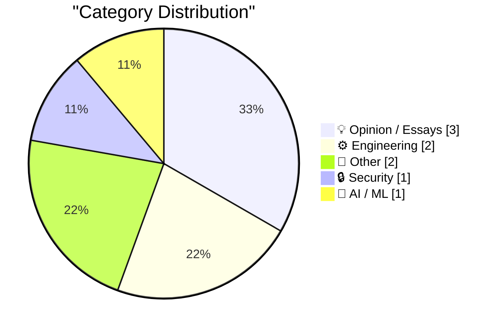
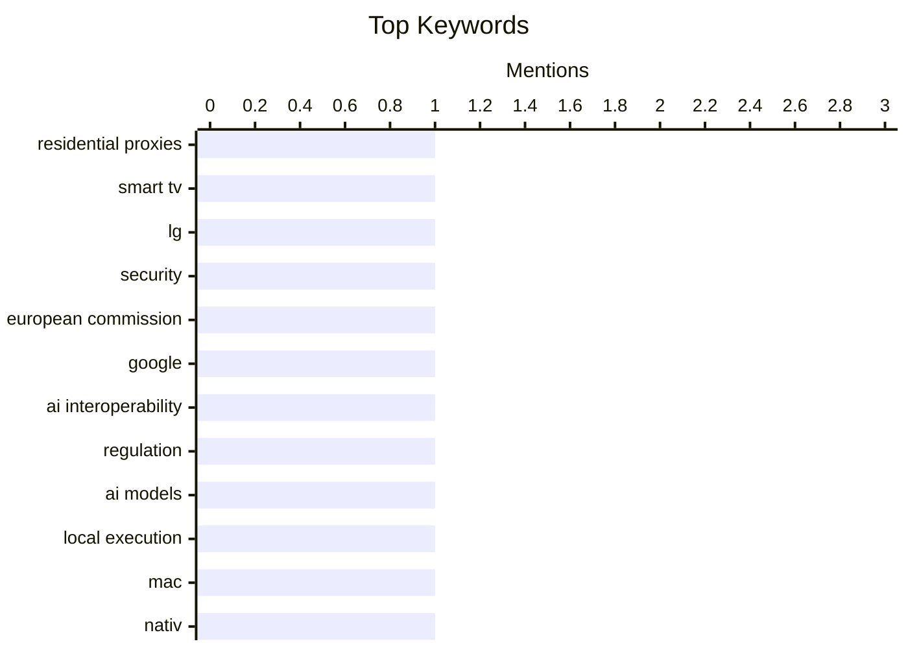

## Today's Highlights
Today's tech landscape is marked by a dual focus on AI accessibility and digital security. Regulators are pushing for greater AI interoperability, exemplified by the European Commission's guidance to Google, while new tools enable running AI models locally on personal devices. Concurrently, major players like LG are tightening security by banning residential proxies on smart TVs, reflecting broader concerns over privacy and control in an increasingly connected world.
---
## Must Read Today
1. **LG to Ban Residential Proxies from Smart TV Apps**
[LG to Ban Residential Proxies from Smart TV Apps](https://krebsonsecurity.com/2026/07/lg-to-ban-residential-proxies-from-smart-tv-apps/) — krebsonsecurity.com · 12h ago · 🔒 Security
> LG to Ban Residential Proxies from Smart TV Apps
🏷️ residential proxies, smart TV, LG, security
2. **★ European Commission: ‘Guidance to Google for AI Interoperability on Android & Sharing of Google Search’**
[★ European Commission: ‘Guidance to Google for AI Interoperability on Android & Sharing of Google Search’](https://daringfireball.net/2026/07/ec_google_guidance_android_ai_and_search_sharing) — daringfireball.net · 15h ago · 💡 Opinion / Essays
> ★ European Commission: ‘Guidance to Google for AI Interoperability on Android & Sharing of Google Search’
🏷️ European Commission, Google, AI interoperability, regulation
3. **Nativ: Run AI models locally on your Mac**
[Nativ: Run AI models locally on your Mac](https://simonwillison.net/2026/Jul/21/nativ/#atom-everything) — simonwillison.net · 23h ago · 🤖 AI / ML
> Nativ: Run AI models locally on your Mac
🏷️ AI models, local execution, Mac, Nativ
---
## Data Overview
| Sources Scanned | Articles Fetched | Time Window | Selected |
|:---:|:---:|:---:|:---:|
| 88/92 | 2600 -> 9 | 24h | **9** |
### Category Distribution

### Top Keywords

<details>
<summary>Plain Text Keyword Chart (Terminal Friendly)</summary>
```
residential proxies │ ████████████████████ 1
smart tv            │ ████████████████████ 1
lg                  │ ████████████████████ 1
security            │ ████████████████████ 1
european commission │ ████████████████████ 1
google              │ ████████████████████ 1
ai interoperability │ ████████████████████ 1
regulation          │ ████████████████████ 1
ai models           │ ████████████████████ 1
local execution     │ ████████████████████ 1
```
</details>
### Topic Tags
**residential proxies**(1) · **smart tv**(1) · **lg**(1) · security(1) · european commission(1) · google(1) · ai interoperability(1) · regulation(1) · ai models(1) · local execution(1) · mac(1) · nativ(1) · python(1) · data analysis(1) · forensic accounting(1) · data science(1) · social media(1) · geolocation(1) · activitypub(1) · platform features(1)
---
## Opinion / Essays
### 1. ★ European Commission: ‘Guidance to Google for AI Interoperability on Android & Sharing of Google Search’
[★ European Commission: ‘Guidance to Google for AI Interoperability on Android & Sharing of Google Search’](https://daringfireball.net/2026/07/ec_google_guidance_android_ai_and_search_sharing) — **daringfireball.net** · 15h ago · ⭐ 26/30
> ★ European Commission: ‘Guidance to Google for AI Interoperability on Android & Sharing of Google Search’
🏷️ European Commission, Google, AI interoperability, regulation
---
### 2. Pluralistic: Trump's America can't even win a rigged game (22 Jul 2026)
[Pluralistic: Trump's America can't even win a rigged game (22 Jul 2026)](https://pluralistic.net/2026/07/22/table-flipper/) — **pluralistic.net** · 5h ago · ⭐ 14/30
> Pluralistic: Trump's America can't even win a rigged game (22 Jul 2026)
🏷️ politics, culture, commentary, link aggregation
---
### 3. Blog Jamboree 2026: The Winners
[Blog Jamboree 2026: The Winners](https://www.experimental-history.com/p/blog-jamboree-2026-the-winners) — **experimental-history.com** · 23h ago · ⭐ 3/30
> Blog Jamboree 2026: The Winners
🏷️ blogging, competition, event
---
## Engineering
### 4. Forensic accounting in Python
[Forensic accounting in Python](https://www.johndcook.com/blog/2026/07/21/forensic-accounting-in-python/) — **johndcook.com** · 22h ago · ⭐ 21/30
> Forensic accounting in Python
🏷️ Python, data analysis, forensic accounting, data science
---
### 5. Scattered thoughts on social geolocation
[Scattered thoughts on social geolocation](https://shkspr.mobi/blog/2026/07/scattered-thoughts-on-social-geolocation/) — **shkspr.mobi** · 2h ago · ⭐ 18/30
> Scattered thoughts on social geolocation
🏷️ social media, geolocation, ActivityPub, platform features
---
## Other
### 6. When sine of x degrees equals sine of x radians
[When sine of x degrees equals sine of x radians](https://www.johndcook.com/blog/2026/07/22/degrees-radians/) — **johndcook.com** · 1h ago · ⭐ 15/30
> When sine of x degrees equals sine of x radians
🏷️ mathematics, trigonometry, sine function
---
### 7. Amiga 1000: Ten years ahead of its time
[Amiga 1000: Ten years ahead of its time](https://dfarq.homeip.net/amiga-1000-ten-years-ahead-of-its-time/?utm_source=rss&#038;utm_medium=rss&#038;utm_campaign=amiga-1000-ten-years-ahead-of-its-time) — **dfarq.homeip.net** · 3h ago · ⭐ 15/30
> Amiga 1000: Ten years ahead of its time
🏷️ Amiga 1000, computer history, retro computing
---
## Security
### 8. LG to Ban Residential Proxies from Smart TV Apps
[LG to Ban Residential Proxies from Smart TV Apps](https://krebsonsecurity.com/2026/07/lg-to-ban-residential-proxies-from-smart-tv-apps/) — **krebsonsecurity.com** · 12h ago · ⭐ 27/30
> LG to Ban Residential Proxies from Smart TV Apps
🏷️ residential proxies, smart TV, LG, security
---
## AI / ML
### 9. Nativ: Run AI models locally on your Mac
[Nativ: Run AI models locally on your Mac](https://simonwillison.net/2026/Jul/21/nativ/#atom-everything) — **simonwillison.net** · 23h ago · ⭐ 24/30
> Nativ: Run AI models locally on your Mac
🏷️ AI models, local execution, Mac, Nativ
---
*Generated at 2026-07-22 14:01 | Scanned 88 sources -> 2600 articles -> selected 9*
*Based on the [Hacker News Popularity Contest 2025](https://refactoringenglish.com/tools/hn-popularity/) RSS source list recommended by [Andrej Karpathy](https://x.com/karpathy)*
*Produced by Dongdianr AI. Follow the same-name WeChat public account for more AI practical tips 💡*
