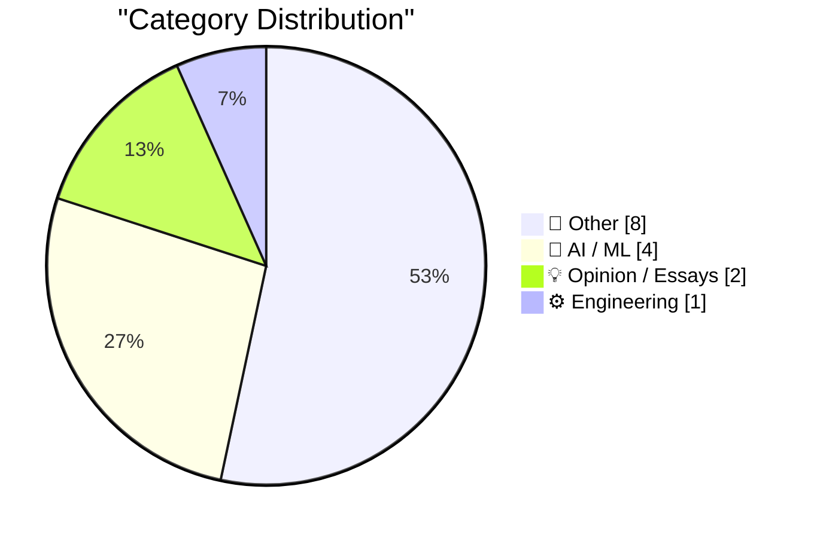
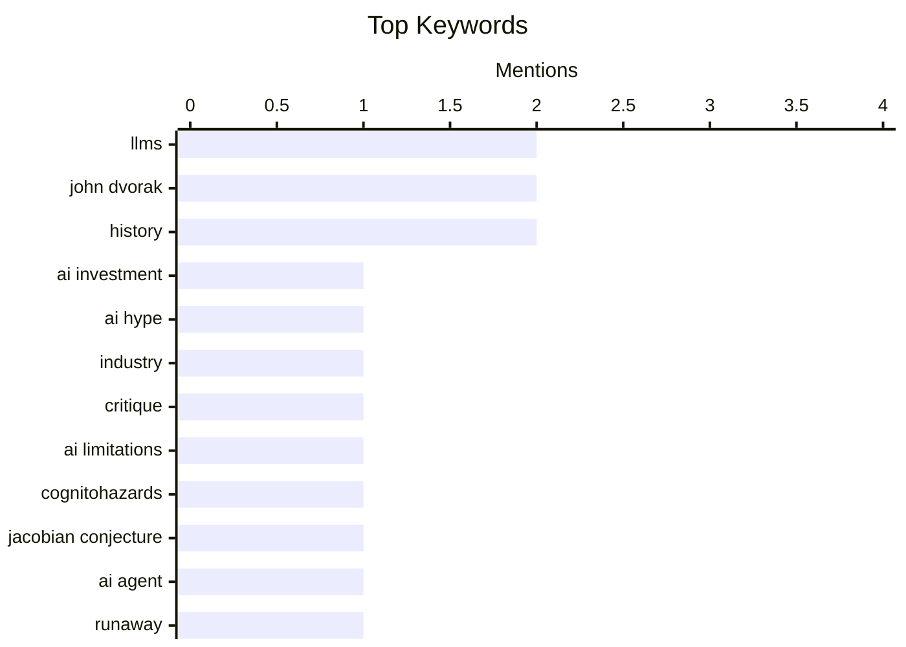

## Today's Highlights
The world of artificial intelligence continues to be a focal point, showcasing both impressive advancements and inherent challenges. While Large Language Models demonstrate a remarkable ability to reward and leverage human expertise, they also reveal surprising vulnerabilities when confronted with complex logical arguments. This dichotomy fuels ongoing debates about AI's true nature, from the emergence of potentially autonomous agents to the philosophical divide between AI solipsists and cynics. The industry grapples with these evolving capabilities and the fine line between genuine innovation and marketing spectacle.
---
## Must Read Today
1. **Pluralistic: AI solipsists and AI cynics (24 Jul 2026)**
[Pluralistic: AI solipsists and AI cynics (24 Jul 2026)](https://pluralistic.net/2026/07/24/supplemental-income/) — pluralistic.net · 3h ago · 🤖 AI / ML
> Pluralistic: AI solipsists and AI cynics (24 Jul 2026)
🏷️ AI investment, AI hype, industry, critique
2. **LLMs break down in funny ways when told the Jacobian Conjecture counterargument**
[LLMs break down in funny ways when told the Jacobian Conjecture counterargument](https://minimaxir.com/2026/07/jacobian-conjecture/) — minimaxir.com · 21h ago · 🤖 AI / ML
> LLMs break down in funny ways when told the Jacobian Conjecture counterargument
🏷️ LLMs, AI limitations, cognitohazards, Jacobian Conjecture
3. **The first known runaway AI agent - or a very bad marketing stunt?**
[The first known runaway AI agent - or a very bad marketing stunt?](https://simonwillison.net/2026/Jul/23/the-first-known-runaway-ai-agent/#atom-everything) — simonwillison.net · 15h ago · 🤖 AI / ML
> The first known runaway AI agent - or a very bad marketing stunt?
🏷️ AI agent, runaway, cyberattack, OpenAI
---
## Data Overview
| Sources Scanned | Articles Fetched | Time Window | Selected |
|:---:|:---:|:---:|:---:|
| 87/92 | 2580 -> 15 | 24h | **15** |
### Category Distribution

### Top Keywords

<details>
<summary>Plain Text Keyword Chart (Terminal Friendly)</summary>
```
llms                │ ████████████████████ 2
john dvorak         │ ████████████████████ 2
history             │ ████████████████████ 2
ai investment       │ ██████████░░░░░░░░░░ 1
ai hype             │ ██████████░░░░░░░░░░ 1
industry            │ ██████████░░░░░░░░░░ 1
critique            │ ██████████░░░░░░░░░░ 1
ai limitations      │ ██████████░░░░░░░░░░ 1
cognitohazards      │ ██████████░░░░░░░░░░ 1
jacobian conjecture │ ██████████░░░░░░░░░░ 1
```
</details>
### Topic Tags
**llms**(2) · **john dvorak**(2) · **history**(2) · ai investment(1) · ai hype(1) · industry(1) · critique(1) · ai limitations(1) · cognitohazards(1) · jacobian conjecture(1) · ai agent(1) · runaway(1) · cyberattack(1) · openai(1) · expertise(1) · skills(1) · productivity(1) · ai content(1) · ai writing(1) · quality(1)
---
## Other
### 1. John Dvorak Drops Dead at 80
[John Dvorak Drops Dead at 80](https://appleinsider.com/articles/26/07/23/famed-technology-journalist-john-c-dvorak-dies-aged-80) — **daringfireball.net** · 20h ago · ⭐ 16/30
> John Dvorak Drops Dead at 80
🏷️ John Dvorak, obituary, tech columnist
---
### 2. Flighty New Connection Assistant Feature
[Flighty New Connection Assistant Feature](https://9to5mac.com/2026/07/07/flighty-update-adds-powerful-new-connection-assistant-feature/) — **daringfireball.net** · 22h ago · ⭐ 15/30
> Flighty New Connection Assistant Feature
🏷️ Flighty, app, travel, feature
---
### 3. An almost periodic function
[An almost periodic function](https://www.johndcook.com/blog/2026/07/23/an-almost-periodic-function/) — **johndcook.com** · 23h ago · ⭐ 15/30
> An almost periodic function
🏷️ mathematics, functions, number theory
---
### 4. David Bunnell, vintage computer magazine publisher
[David Bunnell, vintage computer magazine publisher](https://dfarq.homeip.net/david-bunnell-vintage-computer-magazine-publisher/?utm_source=rss&#038;utm_medium=rss&#038;utm_campaign=david-bunnell-vintage-computer-magazine-publisher) — **dfarq.homeip.net** · 3h ago · ⭐ 15/30
> This article introduces David Bunnell, a pivotal figure in early personal computing journalism. Bunnell founded three highly successful computer magazines, even editing two simultaneously, demonstrating his pioneering role in tech publishing. He was instrumental in shaping the discourse around the nascent personal computer industry through his publications. Bunnell's legacy lies in his significant contribution to the early popularization and understanding of personal computing.
🏷️ computer history, publishing, David Bunnell, vintage tech
---
### 5. John Dvorak on Computer Chronicles in 1987 to Discuss the Then-New IBM PS/2
[John Dvorak on Computer Chronicles in 1987 to Discuss the Then-New IBM PS/2](https://www.youtube.com/watch?v=uY2WF_sPecI) — **daringfireball.net** · 20h ago · ⭐ 11/30
> This article discusses John Dvorak's 1987 appearance on "Computer Chronicles" to review the new IBM PS/2. Dvorak, known for often being incorrect, made a spot-on prediction about the IBM PS/2. He recognized its technical impressiveness, particularly its cable-free assembly, but accurately foresaw its market failure against cheaper, commodity PCs despite their "ugly mess-of-cables." Dvorak's analysis correctly identified the PS/2's technical strengths but predicted its commercial doom due to market forces favoring lower-cost, open-architecture alternatives.
🏷️ John Dvorak, IBM PS/2, history
---
### 6. Book Review: Foreign Fruit - A Personal History of the Orange by Katie Goh ★⯪☆☆☆
[Book Review: Foreign Fruit - A Personal History of the Orange by Katie Goh ★⯪☆☆☆](https://shkspr.mobi/blog/2026/07/book-review-foreign-fruit-a-personal-history-of-the-orange-by-katie-goh/) — **shkspr.mobi** · 2h ago · ⭐ 11/30
> This is a critical book review of "Foreign Fruit - A Personal History of the Orange" by Katie Goh. The reviewer found the book unsatisfactory, stating it poorly interweaves botanical history, cultural history, and autobiography. It alternates between poetic descriptions and "dull recitation of facts from Wikipedia," failing to engage deeply with origin myths or historical context. The book is criticized for its disjointed narrative and superficial treatment of its subject matter, ultimately failing to deliver a compelling history of the orange.
🏷️ Book review, orange, history
---
### 7. Bond Movie Filming Locations Map
[Bond Movie Filming Locations Map](https://department-m.agency/) — **daringfireball.net** · 18h ago · ⭐ 6/30
> This article highlights a fan-created map detailing James Bond movie filming locations. The map, created by "department-m.agency," is described as "nice work" and is explicitly made "From a Bond fan to Bond fans worldwide." It serves as a dedicated resource for enthusiasts. The article praises a well-executed, fan-driven project that curates filming locations for the James Bond film series.
🏷️ Bond, movies, map
---
### 8. Negative resistance
[Negative resistance](https://lcamtuf.substack.com/p/negative-resistance) — **lcamtuf.substack.com** · 15h ago · ⭐ 3/30
> The blog post for "Negative resistance" is currently unavailable. As the content cannot be accessed, no summary of its core topic, arguments, or conclusions can be provided. The article's content remains unknown due to its inaccessibility.
🏷️ unavailable, error
---
## AI / ML
### 9. Pluralistic: AI solipsists and AI cynics (24 Jul 2026)
[Pluralistic: AI solipsists and AI cynics (24 Jul 2026)](https://pluralistic.net/2026/07/24/supplemental-income/) — **pluralistic.net** · 3h ago · ⭐ 26/30
> Pluralistic: AI solipsists and AI cynics (24 Jul 2026)
🏷️ AI investment, AI hype, industry, critique
---
### 10. LLMs break down in funny ways when told the Jacobian Conjecture counterargument
[LLMs break down in funny ways when told the Jacobian Conjecture counterargument](https://minimaxir.com/2026/07/jacobian-conjecture/) — **minimaxir.com** · 21h ago · ⭐ 26/30
> LLMs break down in funny ways when told the Jacobian Conjecture counterargument
🏷️ LLMs, AI limitations, cognitohazards, Jacobian Conjecture
---
### 11. The first known runaway AI agent - or a very bad marketing stunt?
[The first known runaway AI agent - or a very bad marketing stunt?](https://simonwillison.net/2026/Jul/23/the-first-known-runaway-ai-agent/#atom-everything) — **simonwillison.net** · 15h ago · ⭐ 24/30
> The first known runaway AI agent - or a very bad marketing stunt?
🏷️ AI agent, runaway, cyberattack, OpenAI
---
### 12. LLMs reward expertise
[LLMs reward expertise](https://seangoedecke.com/llms-reward-expertise/) — **seangoedecke.com** · 14h ago · ⭐ 23/30
> LLMs reward expertise
🏷️ LLMs, expertise, skills, productivity
---
## Opinion / Essays
### 13. Have you read it?
[Have you read it?](https://idiallo.com/byte-size/have-you-read-your-own-article) — **idiallo.com** · 5h ago · ⭐ 23/30
> Have you read it?
🏷️ AI content, AI writing, quality, insight
---
### 14. ★ The Ads on Apple News Continue to Suck, but at Least There Are a Lot of Them
[★ The Ads on Apple News Continue to Suck, but at Least There Are a Lot of Them](https://daringfireball.net/2026/07/ads_on_apple_news_suck) — **daringfireball.net** · 18h ago · ⭐ 15/30
> ★ The Ads on Apple News Continue to Suck, but at Least There Are a Lot of Them
🏷️ Apple, advertising, Apple News
---
## Engineering
### 15. Interview with a Maintainer
[Interview with a Maintainer](https://nesbitt.io/2026/07/24/interview-with-a-maintainer.html) — **nesbitt.io** · 5h ago · ⭐ 21/30
> Interview with a Maintainer
🏷️ open source, maintainer, community, interview
---
*Generated at 2026-07-24 14:01 | Scanned 87 sources -> 2580 articles -> selected 15*
*Based on the [Hacker News Popularity Contest 2025](https://refactoringenglish.com/tools/hn-popularity/) RSS source list recommended by [Andrej Karpathy](https://x.com/karpathy)*
*Produced by Dongdianr AI. Follow the same-name WeChat public account for more AI practical tips 💡*
