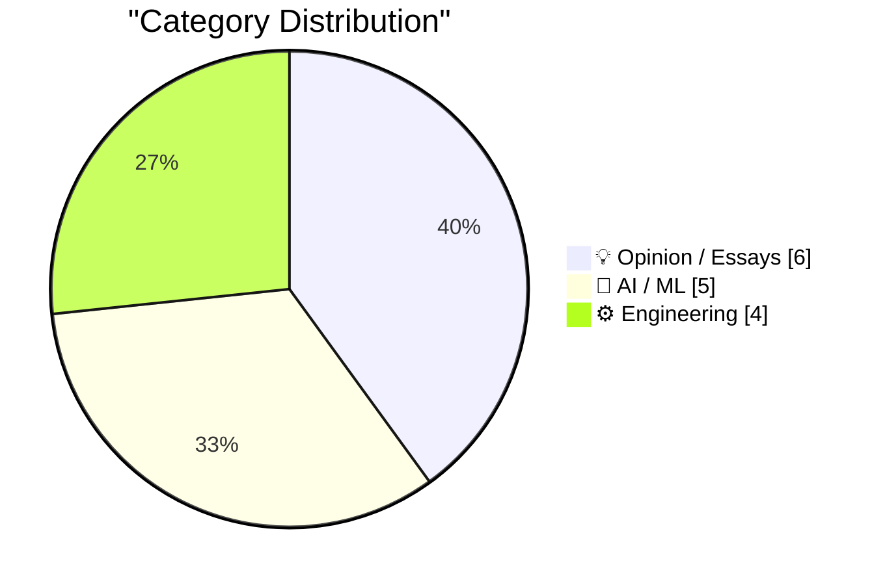
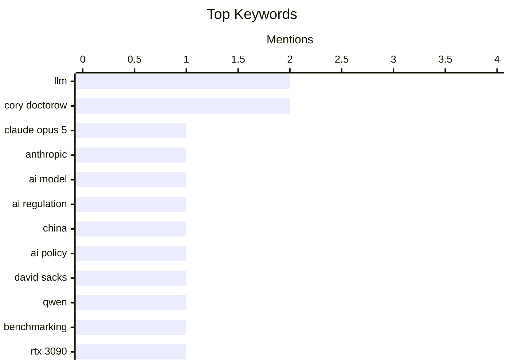

## Today's Highlights
Today's tech highlights feature rapid advancements in artificial intelligence, with Anthropic unveiling its new Claude Opus 5 model amidst ongoing debates about AI regulation and performance benchmarking. Concurrently, influential tech critics are sharpening their focus on industry practices, introducing new terms to describe negative trends and challenging corporate control over user assets. This dual narrative underscores both the relentless pace of AI innovation and a growing demand for transparency and user advocacy in the digital realm.
---
## Must Read Today
1. **Introducing Claude Opus 5**
[Introducing Claude Opus 5](https://simonwillison.net/2026/Jul/24/introducing-claude-opus-5/#atom-everything) — simonwillison.net · 14h ago · 🤖 AI / ML
> This article introduces Anthropic's new large language model, Claude Opus 5, noting initial positive buzz from the community. Anthropic describes Opus 5 as a "thoughtful and proactive model" that approaches the "frontier intelligence of Claude Fable 5" but at half the price. The author, Simon Willison, has not yet had a chance to benchmark the model due to being offline. This release positions Opus 5 as a highly capable yet more cost-effective alternative.
💡 **Why read it**: It announces a significant new AI model, Claude Opus 5, from Anthropic, detailing its positioning relative to previous models and its cost-effectiveness.
🏷️ Claude Opus 5, Anthropic, LLM, AI model
2. **An open letter to David Sacks**
[An open letter to David Sacks](https://garymarcus.substack.com/p/an-open-letter-to-david-sacks) — garymarcus.substack.com · 15h ago · 🤖 AI / ML
> This article presents an open letter challenging the notion that excessive AI regulation in the US is the primary reason for China's progress in artificial intelligence. The author asserts that China is indeed closing the AI gap, but explicitly states this is not attributable to US regulatory burdens. The core argument aims to reframe the debate around international AI competitiveness, suggesting other factors are more influential than domestic regulation.
💡 **Why read it**: It offers a critical perspective on the debate around AI regulation and international competitiveness, specifically challenging common narratives about China's AI progress.
🏷️ AI regulation, China, AI policy, David Sacks
3. **Benchmarking Qwen 3.6 35B MoE (3B active) on an RTX 3090**
[Benchmarking Qwen 3.6 35B MoE (3B active) on an RTX 3090](https://www.gilesthomas.com/2026/07/benchmarking-qwen-3-6-35b-moe-rtx-3090) — gilesthomas.com · 14h ago · 🤖 AI / ML
> This article details a benchmarking attempt of the Qwen 3.6 35B MoE (3B active) language model on a consumer-grade RTX 3090 GPU. Due to the RTX 3090's 24GB VRAM limitation, a 4-bit quantized version of the model was necessary, which also restricted the context window. The author, typically focused on their own LLMs, undertook this experiment to explore the practical performance of large Mixture-of-Experts models on more accessible hardware. This provides insights into running advanced LLMs on consumer-level systems.
💡 **Why read it**: It provides practical insights into the performance and hardware requirements for running a specific large language model (Qwen 3.6 35B MoE) on a consumer GPU (RTX 3090).
🏷️ LLM, Qwen, benchmarking, RTX 3090
---
## Data Overview
| Sources Scanned | Articles Fetched | Time Window | Selected |
|:---:|:---:|:---:|:---:|
| 88/92 | 2605 -> 18 | 24h | **15** |
### Category Distribution

### Top Keywords

<details>
<summary>Plain Text Keyword Chart (Terminal Friendly)</summary>
```
llm           │ ████████████████████ 2
cory doctorow │ ████████████████████ 2
claude opus 5 │ ██████████░░░░░░░░░░ 1
anthropic     │ ██████████░░░░░░░░░░ 1
ai model      │ ██████████░░░░░░░░░░ 1
ai regulation │ ██████████░░░░░░░░░░ 1
china         │ ██████████░░░░░░░░░░ 1
ai policy     │ ██████████░░░░░░░░░░ 1
david sacks   │ ██████████░░░░░░░░░░ 1
qwen          │ ██████████░░░░░░░░░░ 1
```
</details>
### Topic Tags
**llm**(2) · **cory doctorow**(2) · **claude opus 5**(1) · anthropic(1) · ai model(1) · ai regulation(1) · china(1) · ai policy(1) · david sacks(1) · qwen(1) · benchmarking(1) · rtx 3090(1) · opus 5(1) · prompt injection(1) · llm safety(1) · red teaming(1) · openai(1) · chatgpt(1) · siri ai(1) · apple os(1)
---
## Opinion / Essays
### 1. Coiner of ‘Enshittification’ Endorses ‘Dickover’
[Coiner of ‘Enshittification’ Endorses ‘Dickover’](https://pluralistic.net/2026/07/21/dickovers/) — **daringfireball.net** · 19h ago · ⭐ 22/30
> The article discusses Cory Doctorow, known for coining "enshittification," now endorsing the term "dickover" to describe exploitative digital practices. Doctorow argues that commercial surveillance companies' collection of user data is not a fair market exchange but rather a form of "seizing the means of computation." He likens this process to a stallholder reaching into a customer's pocket, challenging the premise of privacy-for-service transactions. This extends his critique of platform decay and user exploitation.
🏷️ Cory Doctorow, enshittification, surveillance, privacy
---
### 2. Pluralistic: Apple's robo-repo (25 Jul 2026)
[Pluralistic: Apple's robo-repo (25 Jul 2026)](https://pluralistic.net/2026/07/25/cruel-cruelty-oh-cruelty/) — **pluralistic.net** · 3h ago · ⭐ 22/30
> This article from Cory Doctorow's "Pluralistic" series critiques "Apple's robo-repo," focusing on the privatization of risk premiums and socialization of costs within corporate structures. It broadly covers various topics including printed batteries, Monopoly credit cards, mapping airport power outlets, and the intersection of EMI with pirates. The piece explores themes of corporate power, surveillance, and economic structures, offering a critical lens on modern tech and society. It provides a diverse set of observations.
🏷️ Apple, robo-repo, tech policy, Cory Doctorow
---
### 3. Some Quick Thoughts on EMF Camp 2026
[Some Quick Thoughts on EMF Camp 2026](https://shkspr.mobi/blog/2026/07/some-quick-thoughts-on-emf-camp-2026/) — **shkspr.mobi** · 2h ago · ⭐ 18/30
> The author shares personal reflections on attending EMF Camp 2026, noting a deliberate shift from being a speaker to a pure tourist for the first time. This change allowed for a significantly more relaxed experience, free from the usual stresses of preparing and delivering a talk. The article highlights the enjoyment of the event without the anxieties associated with presenting, such as laptop issues or audience building. It emphasizes the bliss of a purely participant-focused experience.
🏷️ EMF Camp, hacker festival, tech community
---
### 4. Premium: The Hater’s Guide To Oracle (Part 2)
[Premium: The Hater’s Guide To Oracle (Part 2)](https://www.wheresyoured.at/premium-the-haters-guide-to-oracle-part-2/) — **wheresyoured.at** · 21h ago · ⭐ 18/30
> This article critically examines the common "mythology" surrounding Oracle's business, particularly its perceived profitability and growth within the tech industry. It aims to deconstruct popular beliefs by likely presenting counter-arguments based on financial performance, market share trends, or customer experiences. The piece probably delves into specific aspects like Oracle's cloud strategy, licensing practices, or acquisition history to challenge the narrative of unbridled success. Ultimately, it encourages a more skeptical and informed understanding of Oracle's actual market position and operational realities.
🏷️ Oracle, enterprise software, database, industry analysis
---
### 5. Podcast Notes: Ed Catmull on David Senra
[Podcast Notes: Ed Catmull on David Senra](https://blog.jim-nielsen.com/2026/podcast-notes-ed-catmull/) — **blog.jim-nielsen.com** · 19h ago · ⭐ 18/30
> This article summarizes key insights from Ed Catmull, co-founder of Pixar and former president of Disney Animation, during his interview on the David Senra podcast. Catmull emphasizes his primary role was to optimize group dynamics, fostering an environment where talented people could collaborate effectively and produce great work. He likely discusses principles of creative leadership, organizational culture, and overcoming challenges inherent in innovative environments. The notes probably highlight specific strategies for managing creative teams, encouraging risk-taking, and maintaining high standards. The core takeaway is the critical importance of cultivating the right organizational conditions for collective creativity and sustained innovation.
🏷️ Ed Catmull, Pixar, leadership, podcast notes
---
### 6. ★ Regarding Ad Blockers and Daring Fireball
[★ Regarding Ad Blockers and Daring Fireball](https://daringfireball.net/2026/07/regarding_ad_blockers_and_daring_fireball) — **daringfireball.net** · 17h ago · ⭐ 14/30
> This article discusses the user's responsibility when employing content blockers (ad blockers) and their potential impact on websites like Daring Fireball. It addresses the common issue where overly aggressive ad blocker settings can inadvertently block legitimate site content or break functionality, degrading the user experience. The author argues that users, by installing such extensions, assume responsibility for any "overzealousness" in what they block. The core message encourages users to understand and manage their ad blocker configurations, acknowledging the trade-offs between blocking ads and ensuring full site functionality and content access.
🏷️ ad blockers, content blocking, web publishing
---
## AI / ML
### 7. Introducing Claude Opus 5
[Introducing Claude Opus 5](https://simonwillison.net/2026/Jul/24/introducing-claude-opus-5/#atom-everything) — **simonwillison.net** · 14h ago · ⭐ 27/30
> This article introduces Anthropic's new large language model, Claude Opus 5, noting initial positive buzz from the community. Anthropic describes Opus 5 as a "thoughtful and proactive model" that approaches the "frontier intelligence of Claude Fable 5" but at half the price. The author, Simon Willison, has not yet had a chance to benchmark the model due to being offline. This release positions Opus 5 as a highly capable yet more cost-effective alternative.
🏷️ Claude Opus 5, Anthropic, LLM, AI model
---
### 8. An open letter to David Sacks
[An open letter to David Sacks](https://garymarcus.substack.com/p/an-open-letter-to-david-sacks) — **garymarcus.substack.com** · 15h ago · ⭐ 26/30
> This article presents an open letter challenging the notion that excessive AI regulation in the US is the primary reason for China's progress in artificial intelligence. The author asserts that China is indeed closing the AI gap, but explicitly states this is not attributable to US regulatory burdens. The core argument aims to reframe the debate around international AI competitiveness, suggesting other factors are more influential than domestic regulation.
🏷️ AI regulation, China, AI policy, David Sacks
---
### 9. Benchmarking Qwen 3.6 35B MoE (3B active) on an RTX 3090
[Benchmarking Qwen 3.6 35B MoE (3B active) on an RTX 3090](https://www.gilesthomas.com/2026/07/benchmarking-qwen-3-6-35b-moe-rtx-3090) — **gilesthomas.com** · 14h ago · ⭐ 25/30
> This article details a benchmarking attempt of the Qwen 3.6 35B MoE (3B active) language model on a consumer-grade RTX 3090 GPU. Due to the RTX 3090's 24GB VRAM limitation, a 4-bit quantized version of the model was necessary, which also restricted the context window. The author, typically focused on their own LLMs, undertook this experiment to explore the practical performance of large Mixture-of-Experts models on more accessible hardware. This provides insights into running advanced LLMs on consumer-level systems.
🏷️ LLM, Qwen, benchmarking, RTX 3090
---
### 10. Quoting Boris Cherny
[Quoting Boris Cherny](https://simonwillison.net/2026/Jul/25/boris-cherny/#atom-everything) — **simonwillison.net** · 13h ago · ⭐ 24/30
> This article quotes Boris Cherny, highlighting a significant security feature of Anthropic's new Claude Opus 5 model. Cherny emphasizes that Opus 5 is "our least prompt injectable model yet," a crucial improvement beyond standard evaluation scores. He notes that across various prompt injection evaluations and red teaming exercises, Opus 5 proved "very hard to prompt inject successfully." This indicates a substantial enhancement in the model's robustness against adversarial inputs.
🏷️ Opus 5, prompt injection, LLM safety, red teaming
---
### 11. The Talk Show: ‘A Scam Held Together With Patriotism and Golden Paint’
[The Talk Show: ‘A Scam Held Together With Patriotism and Golden Paint’](https://daringfireball.net/thetalkshow/2026/07/23/ep-452) — **daringfireball.net** · 22h ago · ⭐ 23/30
> This podcast episode features Quinn Nelson discussing several prominent tech topics, including OpenAI’s ChatGPT/Codex "native" app migration fiasco and the integration of Siri AI in Apple’s OS 27 betas. The conversation also covers MacOS 27 Golden Gate and critically reviews the new Trump T1 cell phone, which is derided as "A Scam Held Together With Patriotism and Golden Paint." The episode offers commentary on current events in AI and consumer technology.
🏷️ OpenAI, ChatGPT, Siri AI, Apple OS
---
## Engineering
### 12. This Week in Package Management: 25 July 2026
[This Week in Package Management: 25 July 2026](https://nesbitt.io/2026/07/25/this-week-in-package-management.html) — **nesbitt.io** · 4h ago · ⭐ 23/30
> This article serves as a weekly digest, compiling recent releases, security advisories, and relevant articles from across the package management ecosystem. It aims to provide a concise overview of the latest developments and important news within the domain. The digest helps readers stay informed about updates that impact software dependencies and system security. It covers a broad spectrum of package management topics.
🏷️ Package management, releases, advisories, software updates
---
### 13. Being Linux Torvalds
[Being Linux Torvalds](http://antirez.com/news/171) — **antirez.com** · 2h ago · ⭐ 22/30
> This article reflects on Linus Torvalds' development of the initial Linux kernel, emphasizing his foundational knowledge derived from studying Minix sources and computer architecture. It highlights that Torvalds, a brilliant programmer, successfully created a minimal yet functional Unix kernel specifically for the 386 architecture. The piece suggests that this significant achievement was within the scope of a single individual's capabilities given the specific context and Torvalds' expertise at the time. It provides insight into the early days of Linux.
🏷️ Linus Torvalds, Linux kernel, computer architecture
---
### 14. Excel column numbering
[Excel column numbering](https://www.johndcook.com/blog/2026/07/25/excel-column-numbering/) — **johndcook.com** · 23m ago · ⭐ 15/30
> The article clarifies the often-misunderstood system of Excel's column numbering, which is not a simple base-26 system as commonly assumed. It explains that Excel's column labels (A, B, ..., Z, AA, AB, ...) operate as a base-26 system without a zero digit. This means 'A' corresponds to 1, 'Z' to 26, and 'AA' to 27, rather than 'A' being 0. The article likely provides the correct mathematical logic or an algorithm for converting between these alphanumeric labels and their corresponding numerical indices. Understanding this distinction is crucial for accurate programmatic manipulation and data processing of Excel spreadsheets.
🏷️ Excel, column numbering, spreadsheet, programming
---
### 15. Matrox
[Matrox](https://www.abortretry.fail/p/matrox) — **abortretry.fail** · 23h ago · ⭐ 15/30
> This article provides a historical and technical overview of Matrox, a Canadian company renowned for its specialized graphics hardware in professional and industrial markets. Unlike consumer-focused GPU manufacturers, Matrox historically concentrated on multi-display solutions, video wall technology, and robust graphics cards for enterprise and medical imaging. The discussion likely covers their key product lines, technological innovations, and strategic market positioning over several decades. It highlights Matrox's enduring legacy as a provider of reliable, purpose-built graphics solutions for demanding professional environments, prioritizing stability and specific features over raw gaming performance.
🏷️ Matrox, graphics, hardware, professional graphics
---
*Generated at 2026-07-25 14:01 | Scanned 88 sources -> 2605 articles -> selected 15*
*Based on the [Hacker News Popularity Contest 2025](https://refactoringenglish.com/tools/hn-popularity/) RSS source list recommended by [Andrej Karpathy](https://x.com/karpathy)*
*Produced by Dongdianr AI. Follow the same-name WeChat public account for more AI practical tips 💡*
