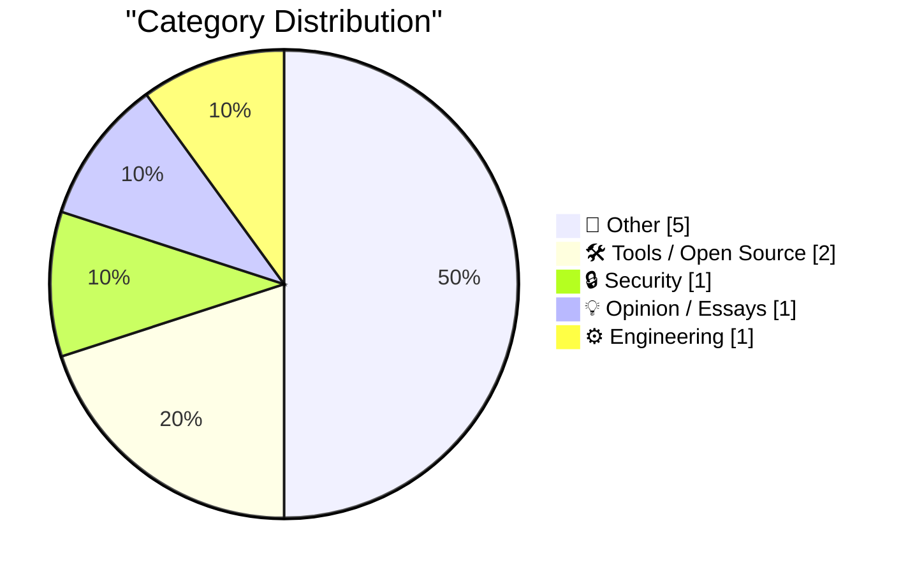
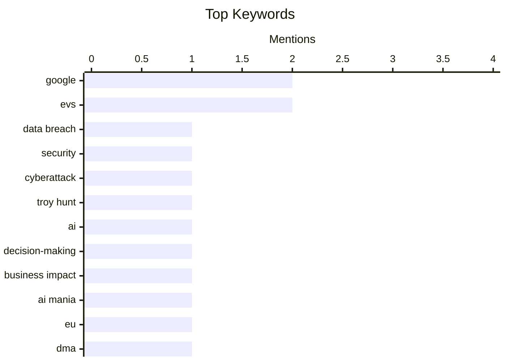

## Today's Highlights
The tech world is grappling with intensified regulatory pressure and legal challenges, as evidenced by the EU fining Google for competition violations while another lawsuit against the search giant was dismissed. Cybersecurity remains a pressing concern, with data breaches continuing to highlight systemic vulnerabilities. Furthermore, the pervasive influence of "AI Mania" is drawing critical attention for its potential to distort global decision-making.
---
## Must Read Today
1. **Weekly Update 514: This Week in Data Breaches**
[Weekly Update 514: This Week in Data Breaches](https://www.troyhunt.com/weekly-update-514/) — troyhunt.com · 4h ago · 🔒 Security
> This article discusses the multi-faceted nature of recent data breaches, specifically highlighting the Origin Energy breach in Australia. It notes the common discrepancy between company assurances, like "don't worry, your credit card is fine," and the hacker's claims, which often suggest a deeper compromise. This divergence underscores the complexity of breach incidents and the challenges in transparent communication. The article implicitly emphasizes the ongoing struggle for accurate information and accountability in the aftermath of cyberattacks. Ultimately, it serves as a reminder of the intricate and often conflicting narratives surrounding contemporary data breaches.
💡 **Why read it**: It provides insights into the real-world complexities and communication challenges surrounding contemporary data breaches, using a recent high-profile example.
🏷️ Data Breach, Security, Cyberattack, Troy Hunt
2. **‘AI Mania Is Eviscerating Global Decision-Making’**
[‘AI Mania Is Eviscerating Global Decision-Making’](https://ludic.mataroa.blog/blog/ai-mania-is-eviscerating-global-decision-making/) — daringfireball.net · 19h ago · 💡 Opinion / Essays
> This essay critiques the pervasive "AI Mania" and its detrimental impact on global decision-making processes. It highlights how even technically competent Fortune 500 executives are pressured to make exorbitant claims about AI innovations, often driven by hype and fear of missing out rather than genuine understanding. This environment fosters a disconnect between corporate rhetoric and the practical realities or limitations of AI technology. The article suggests that this widespread hype is distorting rational strategic choices across major corporations. Consequently, the prevailing AI enthusiasm is leading to irrational and potentially damaging decisions.
💡 **Why read it**: It offers a critical, nuanced perspective on the current AI landscape, challenging the prevailing hype and its influence on corporate strategy and decision-making.
🏷️ AI, Decision-making, Business Impact, AI Mania
3. **EU Fines Google $1 Billion for DMA Competition Violations, Including Making Search Results More Useful**
[EU Fines Google $1 Billion for DMA Competition Violations, Including Making Search Results More Useful](https://digital-markets-act.ec.europa.eu/commission-fines-google-eur890-million-breaches-digital-markets-act-2026-07-23_en) — daringfireball.net · 20h ago · 📝 Other
> The European Commission has fined Google €890 million for breaching its obligations under the Digital Markets Act (DMA) by giving preferential treatment to its own services in search results. Google was found to display its services, including shopping, hotels, transport, and sports results, more prominently than those of third parties. This preferential treatment involved placing Google's services at the top of search results pages or using enhanced visuals and filters, which were not afforded to similar third-party services. The Commission concluded that these practices violate the DMA's competition rules. This action reinforces the EU's commitment to ensuring fair competition in digital markets.
💡 **Why read it**: It details a significant regulatory action against a major tech company, illustrating the EU's active enforcement of digital market competition rules and the substantial financial penalties involved.
🏷️ EU, Google, DMA, Antitrust
---
## Data Overview
| Sources Scanned | Articles Fetched | Time Window | Selected |
|:---:|:---:|:---:|:---:|
| 88/92 | 2606 -> 10 | 24h | **10** |
### Category Distribution

### Top Keywords

<details>
<summary>Plain Text Keyword Chart (Terminal Friendly)</summary>
```
google          │ ████████████████████ 2
evs             │ ████████████████████ 2
data breach     │ ██████████░░░░░░░░░░ 1
security        │ ██████████░░░░░░░░░░ 1
cyberattack     │ ██████████░░░░░░░░░░ 1
troy hunt       │ ██████████░░░░░░░░░░ 1
ai              │ ██████████░░░░░░░░░░ 1
decision-making │ ██████████░░░░░░░░░░ 1
business impact │ ██████████░░░░░░░░░░ 1
ai mania        │ ██████████░░░░░░░░░░ 1
```
</details>
### Topic Tags
**google**(2) · **evs**(2) · **data breach**(1) · security(1) · cyberattack(1) · troy hunt(1) · ai(1) · decision-making(1) · business impact(1) · ai mania(1) · eu(1) · dma(1) · antitrust(1) · serpapi(1) · lawsuit(1) · cfaa(1) · ruff(1) · python(1) · linter(1) · ci/cd(1)
---
## Other
### 1. EU Fines Google $1 Billion for DMA Competition Violations, Including Making Search Results More Useful
[EU Fines Google $1 Billion for DMA Competition Violations, Including Making Search Results More Useful](https://digital-markets-act.ec.europa.eu/commission-fines-google-eur890-million-breaches-digital-markets-act-2026-07-23_en) — **daringfireball.net** · 20h ago · ⭐ 25/30
> The European Commission has fined Google €890 million for breaching its obligations under the Digital Markets Act (DMA) by giving preferential treatment to its own services in search results. Google was found to display its services, including shopping, hotels, transport, and sports results, more prominently than those of third parties. This preferential treatment involved placing Google's services at the top of search results pages or using enhanced visuals and filters, which were not afforded to similar third-party services. The Commission concluded that these practices violate the DMA's competition rules. This action reinforces the EU's commitment to ensuring fair competition in digital markets.
🏷️ EU, Google, DMA, Antitrust
---
### 2. Court Grants SerpApi’s Motion to Dismiss Google Lawsuit
[Court Grants SerpApi’s Motion to Dismiss Google Lawsuit](https://serpapi.com/blog/google-v-serpapi-the-court-granted-our-motion-to-dismiss/) — **daringfireball.net** · 20h ago · ⭐ 25/30
> The U.S. District Court for the Northern District of California granted SerpApi's motion to dismiss a lawsuit filed by Google, marking a significant win for open internet principles. Google's lawsuit attempted to expand the Digital Millennium Copyright Act (DMCA) to assert control over access to public web pages. The court's decision rejected Google's broad interpretation of the DMCA, affirming the internet's founding principle of open access to usable information. This ruling is seen as crucial for driving innovation and ensuring broad benefits from the internet. Ultimately, it reinforces the right for companies like SerpApi to access publicly available data.
🏷️ Google, SerpApi, Lawsuit, CFAA
---
### 3. Measles Cases Hit New Record in U.S., as Stupid-Americans Reject Vaccines
[Measles Cases Hit New Record in U.S., as Stupid-Americans Reject Vaccines](https://www.nytimes.com/2026/07/24/well/measles-record-united-states-numbers.html?unlocked_article_code=1.0VA.4jBf.vqAYN4Bwu807) — **daringfireball.net** · 21h ago · ⭐ 17/30
> Measles cases in the U.S. have reached a new record, reversing decades of progress, primarily due to widespread vaccine rejection. The Centers for Disease Control and Prevention (CDC) reported 2,318 confirmed cases this year, surpassing last year's record of over 2,200 cases, which included two unvaccinated child deaths. The total number of measles cases in the last two years now exceeds all cases reported from 2000 through 2024 combined. This resurgence underscores a significant public health setback directly attributed to declining vaccination rates. The article highlights the critical public health impact of vaccine hesitancy and rejection in the U.S.
🏷️ Measles, Vaccines, Public Health
---
### 4. Reading List 07/25/26
[Reading List 07/25/26](https://www.construction-physics.com/p/reading-list-072526) — **construction-physics.com** · 1d ago · ⭐ 14/30
> This article presents a curated reading list covering diverse topics relevant to construction physics and broader industry trends. The list includes discussions on China’s EV subsidies, the future of aeroderivative gas turbines, and a US-Saudi nuclear deal. It also touches upon issues like defective roadway guardrails, indicating a focus on both technological advancements and infrastructure challenges. Each item points to a separate discussion or analysis on these specific subjects. Overall, the article serves as a digest of current events and analyses across various industrial, energy, and infrastructure sectors.
🏷️ Reading List, EVs, Energy, Infrastructure
---
### 5. Book Review: Dungeon Crawler Carl by Matt Dinniman ★★⯪☆☆
[Book Review: Dungeon Crawler Carl by Matt Dinniman ★★⯪☆☆](https://shkspr.mobi/blog/2026/07/book-review-dungeon-crawler-carl-by-matt-dinniman/) — **shkspr.mobi** · 2h ago · ⭐ 12/30
> This article reviews "Dungeon Crawler Carl" by Matt Dinniman, critiquing its highly derivative nature within the "Dungeon Core" genre. The reviewer describes the book as a literary mashup, akin to combining elements from "The Hunger Games" with a Twitch streaming overlay. The plot involves Earth's destruction by a "Vogon Constructor Fleet" and forced participation in a survival game show. The review awards the book 2.5 out of 5 stars, indicating a mixed but generally unenthusiastic reception. Ultimately, the book is criticized for its unoriginality and reliance on rehashed tropes, despite the genre's inherent demands for familiar elements.
🏷️ Book Review, Fantasy, Literature
---
## Tools / Open Source
### 6. Ruff v0.16.0
[Ruff v0.16.0](https://simonwillison.net/2026/Jul/25/ruff/#atom-everything) — **simonwillison.net** · 15h ago · ⭐ 24/30
> Astral has released Ruff v0.16.0, a significant new version of their Python linting tool, which dramatically increased its default rule count. This update caused CI job failures for users with unpinned `"ruff"` dev dependencies due to the introduction of new default checks. Ruff v0.16.0 now enables 413 rules by default, a substantial increase from 59 in previous versions. This expansion reflects a major enhancement in Ruff's linting capabilities and stricter code enforcement. Python developers should be aware of this expanded default rule set and consider pinning their dependencies to avoid unexpected CI failures.
🏷️ Ruff, Python, Linter, CI/CD
---
### 7. bIRC — A New Native IRC Client for Mac
[bIRC — A New Native IRC Client for Mac](https://birc.app/) — **daringfireball.net** · 22h ago · ⭐ 20/30
> The article introduces bIRC, a new native IRC client for Mac, developed by Fredrik Blank, addressing the void left by the sunsetting of Textual, previously the leading native Mac IRC client. Blank created bIRC in Swift, implementing the RFC 2812 specification, primarily for the "joy of programming" rather than commercial gain. This new client aims to provide a modern, actively maintained option for Mac users who still utilize IRC. The development highlights a community-driven effort to sustain niche software. Consequently, bIRC offers a fresh alternative for native IRC communication on macOS.
🏷️ IRC, Mac, Client, bIRC
---
## Security
### 8. Weekly Update 514: This Week in Data Breaches
[Weekly Update 514: This Week in Data Breaches](https://www.troyhunt.com/weekly-update-514/) — **troyhunt.com** · 4h ago · ⭐ 28/30
> This article discusses the multi-faceted nature of recent data breaches, specifically highlighting the Origin Energy breach in Australia. It notes the common discrepancy between company assurances, like "don't worry, your credit card is fine," and the hacker's claims, which often suggest a deeper compromise. This divergence underscores the complexity of breach incidents and the challenges in transparent communication. The article implicitly emphasizes the ongoing struggle for accurate information and accountability in the aftermath of cyberattacks. Ultimately, it serves as a reminder of the intricate and often conflicting narratives surrounding contemporary data breaches.
🏷️ Data Breach, Security, Cyberattack, Troy Hunt
---
## Opinion / Essays
### 9. ‘AI Mania Is Eviscerating Global Decision-Making’
[‘AI Mania Is Eviscerating Global Decision-Making’](https://ludic.mataroa.blog/blog/ai-mania-is-eviscerating-global-decision-making/) — **daringfireball.net** · 19h ago · ⭐ 27/30
> This essay critiques the pervasive "AI Mania" and its detrimental impact on global decision-making processes. It highlights how even technically competent Fortune 500 executives are pressured to make exorbitant claims about AI innovations, often driven by hype and fear of missing out rather than genuine understanding. This environment fosters a disconnect between corporate rhetoric and the practical realities or limitations of AI technology. The article suggests that this widespread hype is distorting rational strategic choices across major corporations. Consequently, the prevailing AI enthusiasm is leading to irrational and potentially damaging decisions.
🏷️ AI, Decision-making, Business Impact, AI Mania
---
## Engineering
### 10. Apple Maps to Power Navigation Experience for Ford’s New EVs
[Apple Maps to Power Navigation Experience for Ford’s New EVs](https://www.apple.com/newsroom/2026/07/apple-maps-to-power-navigation-experience-for-ford-uev-platform/) — **daringfireball.net** · 21h ago · ⭐ 22/30
> Apple and Ford have announced a partnership to integrate Apple Maps directly into Ford’s upcoming Universal Electric Vehicle (UEV) Platform. Starting in 2027, this integration will utilize Apple’s new MapKit for Automotive SDK to deliver a seamless navigation experience on the vehicle’s displays. The collaboration aims to enhance the in-car experience for Ford EV owners. Furthermore, road-level Maps information will support Ford’s Latitude AI team in developing a seamless hands-free driving experience. This strategic move signifies Apple's deeper penetration into the automotive sector, leveraging its mapping technology for next-generation EV navigation and AI-driven features.
🏷️ Apple Maps, Ford, EVs, MapKit
---
*Generated at 2026-07-26 14:01 | Scanned 88 sources -> 2606 articles -> selected 10*
*Based on the [Hacker News Popularity Contest 2025](https://refactoringenglish.com/tools/hn-popularity/) RSS source list recommended by [Andrej Karpathy](https://x.com/karpathy)*
*Produced by Dongdianr AI. Follow the same-name WeChat public account for more AI practical tips 💡*
