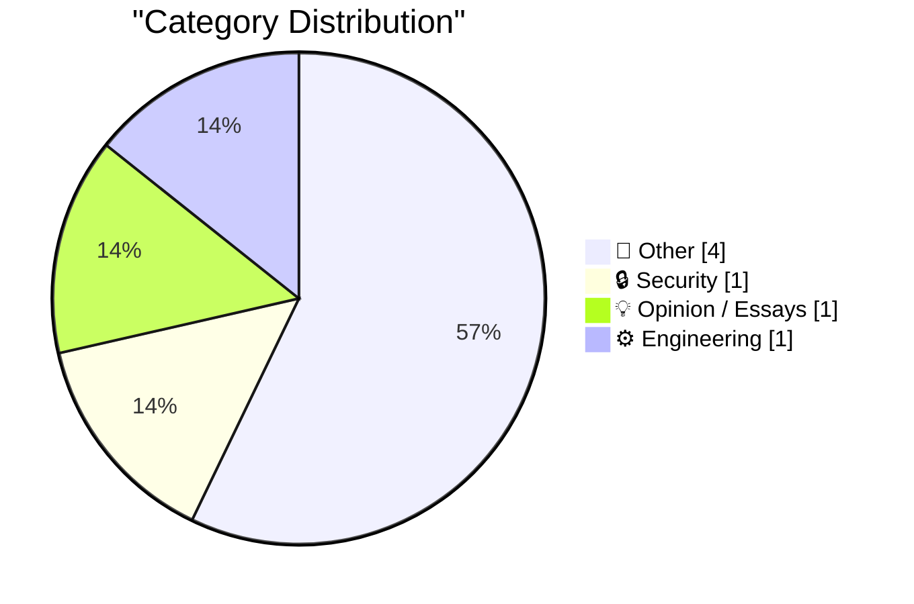
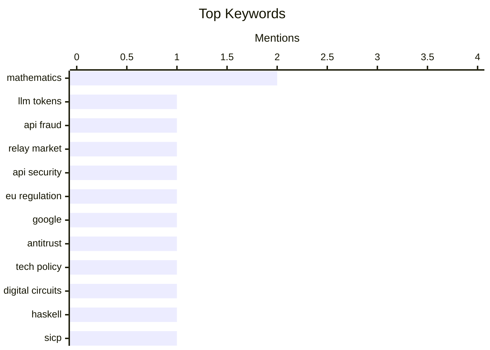

## Today's Highlights
Today's tech news highlights the ongoing battle for control and understanding in the digital world. Reports expose a growing illicit market for LLM tokens and detail the European Union's assertive stance on regulating tech giants. Meanwhile, the foundational aspects of technology and mathematics are being explored, with new insights into digital circuit simulation, advanced permutation roots, and generalized exponential functions.
---
## Must Read Today
1. **An Inside Look at the Relay Market Powering Token Resellers and Fraud**
[An Inside Look at the Relay Market Powering Token Resellers and Fraud](https://simonwillison.net/2026/Jul/26/relay-market/#atom-everything) — simonwillison.net · 18h ago · 🔒 Security
> This article investigates a growing illicit market, primarily in China, where LLM tokens are resold at significant discounts by pooling API keys from various sources. Resellers achieve these discounts by abusing free trials and other methods to acquire cheap tokens, operating through LLM proxies that provide access to discounted API usage. This market highlights significant vulnerabilities in LLM API pricing and access control mechanisms. The existence of such a market poses a substantial challenge for LLM providers in managing token distribution and preventing widespread fraud.
💡 **Why read it**: It exposes a prevalent, often overlooked, illicit market for discounted LLM tokens, revealing vulnerabilities and fraud patterns within the AI ecosystem.
🏷️ LLM tokens, API fraud, relay market, API security
2. **Pluralistic: How the EU can punish Google (despite Trump) (27 Jul 2026)**
[Pluralistic: How the EU can punish Google (despite Trump) (27 Jul 2026)](https://pluralistic.net/2026/07/27/eucd-6/) — pluralistic.net · 3h ago · 💡 Opinion / Essays
> The article discusses the European Union's capacity to enforce penalties against Google, specifically considering potential challenges from US political interference, such as a Trump administration. It emphasizes that the EU's ability to impose fines and regulatory measures on tech giants like Google is firmly rooted in its sovereign legal framework. This framework provides mechanisms for the EU to uphold its decisions and maintain corporate accountability, even when faced with external political pressure. Ultimately, the EU possesses the necessary legal and political tools to hold powerful tech companies accountable, regardless of international political dynamics.
💡 **Why read it**: It provides insight into the EU's robust regulatory power over tech giants and its resilience against potential international political interference.
🏷️ EU regulation, Google, antitrust, tech policy
3. **Digital circuit simulator in Haskell (SICP 3.3)**
[Digital circuit simulator in Haskell (SICP 3.3)](https://entropicthoughts.com/sicp-3-3-digital-circuit-simulator-in-haskell) — entropicthoughts.com · 16h ago · ⚙️ Engineering
> This article details the author's exploration into implementing a digital circuit simulator using Haskell, drawing inspiration from Chapter 3.3 of Structure and Interpretation of Computer Programs (SICP). The project builds upon previous work on generic functions, specifically employing tagged values for dispatching operations and mutable tables for operation-tag pairs. The simulator likely models various circuit components and their interactions, leveraging Haskell's functional programming paradigms for system design. This endeavor demonstrates a practical application of SICP principles in building complex system models using a modern functional language.
💡 **Why read it**: It offers a practical example of applying SICP principles to build a digital circuit simulator using Haskell, showcasing functional programming for system design.
🏷️ digital circuits, Haskell, SICP, functional programming
---
## Data Overview
| Sources Scanned | Articles Fetched | Time Window | Selected |
|:---:|:---:|:---:|:---:|
| 87/92 | 2581 -> 7 | 24h | **7** |
### Category Distribution

### Top Keywords

<details>
<summary>Plain Text Keyword Chart (Terminal Friendly)</summary>
```
mathematics      │ ████████████████████ 2
llm tokens       │ ██████████░░░░░░░░░░ 1
api fraud        │ ██████████░░░░░░░░░░ 1
relay market     │ ██████████░░░░░░░░░░ 1
api security     │ ██████████░░░░░░░░░░ 1
eu regulation    │ ██████████░░░░░░░░░░ 1
google           │ ██████████░░░░░░░░░░ 1
antitrust        │ ██████████░░░░░░░░░░ 1
tech policy      │ ██████████░░░░░░░░░░ 1
digital circuits │ ██████████░░░░░░░░░░ 1
```
</details>
### Topic Tags
**mathematics**(2) · **llm tokens**(1) · **api fraud**(1) · relay market(1) · api security(1) · eu regulation(1) · google(1) · antitrust(1) · tech policy(1) · digital circuits(1) · haskell(1) · sicp(1) · functional programming(1) · medical debt(1) · philanthropy(1) · economics(1) · permutations(1) · abstract algebra(1) · power series(1) · special functions(1)
---
## Other
### 1. Why $550 Million Medical Debt only Cost $5.5 Million
[Why $550 Million Medical Debt only Cost $5.5 Million](https://idiallo.com/byte-size/550-million-only-cost-5-million) — **idiallo.com** · 18h ago · ⭐ 15/30
> The article investigates why a widely reported $550 million medical debt donation by Snap's CEO and his wife actually cost only $5.5 million, highlighting a significant discrepancy in public reporting. News outlets inflated the donation amount by reporting the face value of the debt rather than the actual cost to acquire and forgive it. Medical debt can be purchased from collection agencies at a substantial discount, often for pennies on the dollar (e.g., 1 cent per dollar, making $550M debt cost $5.5M). This discrepancy reveals how medical debt relief initiatives can be misrepresented and clarifies that the actual cost of forgiving large sums of debt is often a small fraction of its face value.
🏷️ medical debt, philanthropy, economics
---
### 2. Permutation roots
[Permutation roots](https://www.johndcook.com/blog/2026/07/26/permutation-roots/) — **johndcook.com** · 17h ago · ⭐ 15/30
> This article defines and explores the mathematical concept of permutation roots, specifically focusing on square roots of permutations. A permutation τ is considered a square root of σ if applying τ twice has the same effect as applying σ once, denoted as σ = τ². The discussion likely involves concepts from group theory, including the cycle decomposition of permutations, and the conditions under which a given permutation possesses a square root. The elements on which the permutations act are typically considered as integers from 0 to n-1. The concept of permutation roots introduces an interesting problem in abstract algebra, with implications for understanding the structure and properties of permutations.
🏷️ permutations, mathematics, abstract algebra
---
### 3. exp_q
[exp_q](https://www.johndcook.com/blog/2026/07/26/exp-q/) — **johndcook.com** · 19h ago · ⭐ 15/30
> The article defines and explores the function exp_q(x), a generalization of the standard exponential function. exp_q(x) is constructed by taking the power series for exp(x) and retaining only those terms whose index is a multiple of q. For instance, exp_2(x) equals cosh(x) because it includes only the even-numbered terms from the exponential power series. The definition of this generalized sum utilizes Iverson's bracket notation. The exp_q(x) function provides a novel generalized form of the exponential series, revealing interesting connections to other known functions like cosh(x) and offering a new perspective on series expansions.
🏷️ power series, mathematics, special functions
---
### 4. Advantages and disadvantages of Windows NT 3.1
[Advantages and disadvantages of Windows NT 3.1](https://dfarq.homeip.net/advantages-and-disadvantages-of-windows-nt-3-1/?utm_source=rss&#038;utm_medium=rss&#038;utm_campaign=advantages-and-disadvantages-of-windows-nt-3-1) — **dfarq.homeip.net** · 3h ago · ⭐ 10/30
> This article discusses the advantages and disadvantages of Windows NT 3.1, an operating system first released on July 27, 1993. Windows NT 3.1 was a significant milestone, offering a more robust and secure architecture compared to contemporary consumer Windows versions. Its advantages included preemptive multitasking, a 32-bit kernel, and enhanced stability, primarily targeting business and server environments. However, disadvantages likely encompassed higher hardware requirements, initial limitations in application compatibility, and a steeper learning curve for users accustomed to Windows 3.1. Ultimately, Windows NT 3.1 laid crucial groundwork for modern Windows operating systems, balancing advanced features with early adoption challenges.
🏷️ Windows NT, operating system, history
---
## Security
### 5. An Inside Look at the Relay Market Powering Token Resellers and Fraud
[An Inside Look at the Relay Market Powering Token Resellers and Fraud](https://simonwillison.net/2026/Jul/26/relay-market/#atom-everything) — **simonwillison.net** · 18h ago · ⭐ 25/30
> This article investigates a growing illicit market, primarily in China, where LLM tokens are resold at significant discounts by pooling API keys from various sources. Resellers achieve these discounts by abusing free trials and other methods to acquire cheap tokens, operating through LLM proxies that provide access to discounted API usage. This market highlights significant vulnerabilities in LLM API pricing and access control mechanisms. The existence of such a market poses a substantial challenge for LLM providers in managing token distribution and preventing widespread fraud.
🏷️ LLM tokens, API fraud, relay market, API security
---
## Opinion / Essays
### 6. Pluralistic: How the EU can punish Google (despite Trump) (27 Jul 2026)
[Pluralistic: How the EU can punish Google (despite Trump) (27 Jul 2026)](https://pluralistic.net/2026/07/27/eucd-6/) — **pluralistic.net** · 3h ago · ⭐ 25/30
> The article discusses the European Union's capacity to enforce penalties against Google, specifically considering potential challenges from US political interference, such as a Trump administration. It emphasizes that the EU's ability to impose fines and regulatory measures on tech giants like Google is firmly rooted in its sovereign legal framework. This framework provides mechanisms for the EU to uphold its decisions and maintain corporate accountability, even when faced with external political pressure. Ultimately, the EU possesses the necessary legal and political tools to hold powerful tech companies accountable, regardless of international political dynamics.
🏷️ EU regulation, Google, antitrust, tech policy
---
## Engineering
### 7. Digital circuit simulator in Haskell (SICP 3.3)
[Digital circuit simulator in Haskell (SICP 3.3)](https://entropicthoughts.com/sicp-3-3-digital-circuit-simulator-in-haskell) — **entropicthoughts.com** · 16h ago · ⭐ 21/30
> This article details the author's exploration into implementing a digital circuit simulator using Haskell, drawing inspiration from Chapter 3.3 of Structure and Interpretation of Computer Programs (SICP). The project builds upon previous work on generic functions, specifically employing tagged values for dispatching operations and mutable tables for operation-tag pairs. The simulator likely models various circuit components and their interactions, leveraging Haskell's functional programming paradigms for system design. This endeavor demonstrates a practical application of SICP principles in building complex system models using a modern functional language.
🏷️ digital circuits, Haskell, SICP, functional programming
---
*Generated at 2026-07-27 14:01 | Scanned 87 sources -> 2581 articles -> selected 7*
*Based on the [Hacker News Popularity Contest 2025](https://refactoringenglish.com/tools/hn-popularity/) RSS source list recommended by [Andrej Karpathy](https://x.com/karpathy)*
*Produced by Dongdianr AI. Follow the same-name WeChat public account for more AI practical tips 💡*
