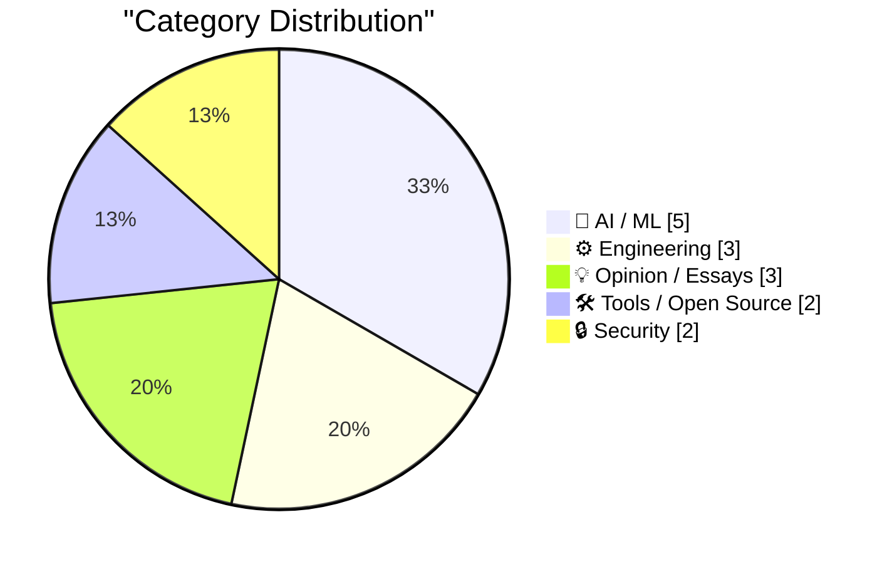
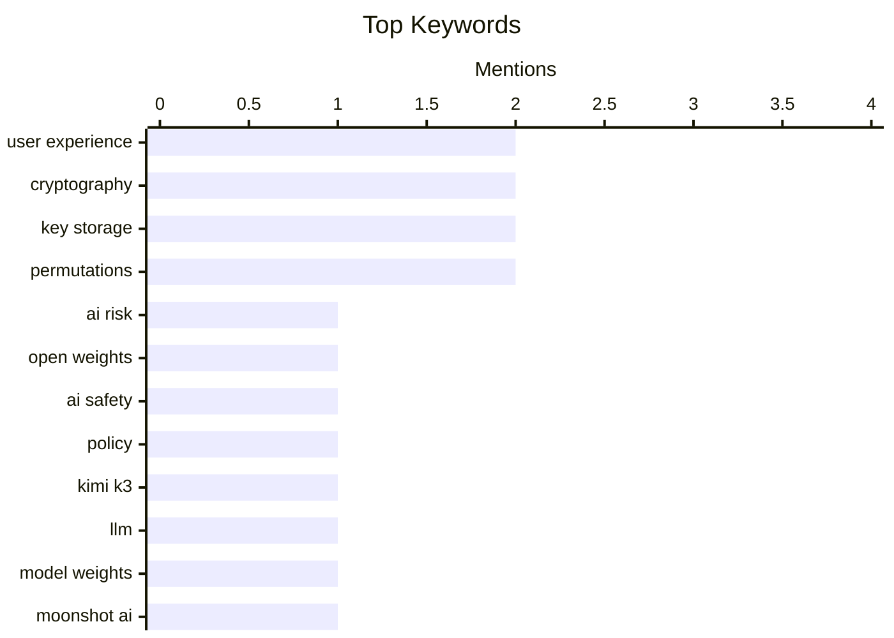

## Today's Highlights
Today's tech news is dominated by the rapid evolution of AI, marked by the release of new open-weight models like Moonshot AI's Kimi K3. This acceleration fuels critical discussions on AI's inherent risks, particularly those originating within labs, and the growing need for discernment in its application. As AI's financial landscape shifts and its role as assistive technology expands, the broader industry also grapples with persistent engineering hurdles, such as managing complex software dependencies.
---
## Must Read Today
1. **The real AI risk is inside the labs**
[The real AI risk is inside the labs](http://antirez.com/news/172) — antirez.com · 5h ago · 🤖 AI / ML
> This article challenges the common perception of AI risk, arguing that open-weight models constitute the mildest threat. It contends that the most significant dangers originate from incidents *inside* AI labs, citing the OpenAI/HF incident as an example of how internal dynamics and control failures can lead to serious issues. The author emphasizes that the modalities of such internal incidents, not just their outcomes, reveal the true locus of risk. Therefore, focusing on the internal operations and control mechanisms within AI development labs is crucial for mitigating future AI-related dangers.
💡 **Why read it**: It offers a contrarian perspective on AI risk, shifting focus from open-source models to internal lab dynamics and control failures, which is crucial for understanding true safety challenges.
🏷️ AI risk, open weights, AI safety, policy
2. **moonshotai/Kimi-K3**
[moonshotai/Kimi-K3](https://simonwillison.net/2026/Jul/27/kimi-k3/#atom-everything) — simonwillison.net · 14h ago · 🤖 AI / ML
> Moonshot AI has released the weights for their Kimi K3 large language model, a significant update to their previous K2 version. This model boasts 2.8 trillion parameters and its weights constitute a hefty 1.56TB download from Hugging Face. Notably, Kimi K3 continues to use a "janky modified version of the MIT license" that was first introduced with Kimi K2-Instruct. The release of these weights allows broader access and experimentation with a very large-scale model.
💡 **Why read it**: It announces the release of a massive 2.8 trillion parameter AI model (Kimi K3) with its weights, highlighting its scale and licensing approach.
🏷️ Kimi K3, LLM, model weights, Moonshot AI
3. **Can the Tide of AI Investment Lift All Boats on the Web?**
[Can the Tide of AI Investment Lift All Boats on the Web?](https://blog.jim-nielsen.com/2026/tide-lifts-all-boats/) — blog.jim-nielsen.com · 19h ago · 🤖 AI / ML
> This article discusses the perspective that AI agents should be treated as assistive technology, operating websites identically to human users, rather than receiving special treatment. Citing Jason Grigsby and the the Safari team, it argues that sites should not differentiate between an AI agent acting on a user's behalf and the user themselves. This approach ensures that improvements made for AI agents inherently benefit all users, aligning with principles of universal accessibility. The core idea is that web standards and design should accommodate AI agents as another form of user interaction, promoting inclusive web development.
💡 **Why read it**: It advocates for treating AI agents as assistive technology on the web, promoting universal accessibility and ensuring AI-driven improvements benefit all users.
🏷️ AI Agents, Web Standards, Safari, User Experience
---
## Data Overview
| Sources Scanned | Articles Fetched | Time Window | Selected |
|:---:|:---:|:---:|:---:|
| 88/92 | 2607 -> 19 | 24h | **15** |
### Category Distribution

### Top Keywords

<details>
<summary>Plain Text Keyword Chart (Terminal Friendly)</summary>
```
user experience │ ████████████████████ 2
cryptography    │ ████████████████████ 2
key storage     │ ████████████████████ 2
permutations    │ ████████████████████ 2
ai risk         │ ██████████░░░░░░░░░░ 1
open weights    │ ██████████░░░░░░░░░░ 1
ai safety       │ ██████████░░░░░░░░░░ 1
policy          │ ██████████░░░░░░░░░░ 1
kimi k3         │ ██████████░░░░░░░░░░ 1
llm             │ ██████████░░░░░░░░░░ 1
```
</details>
### Topic Tags
**user experience**(2) · **cryptography**(2) · **key storage**(2) · permutations(2) · ai risk(1) · open weights(1) · ai safety(1) · policy(1) · kimi k3(1) · llm(1) · model weights(1) · moonshot ai(1) · ai agents(1) · web standards(1) · safari(1) · ai guide(1) · ai tools(1) · ethan mollick(1) · npm(1) · dependencies(1)
---
## AI / ML
### 1. The real AI risk is inside the labs
[The real AI risk is inside the labs](http://antirez.com/news/172) — **antirez.com** · 5h ago · ⭐ 28/30
> This article challenges the common perception of AI risk, arguing that open-weight models constitute the mildest threat. It contends that the most significant dangers originate from incidents *inside* AI labs, citing the OpenAI/HF incident as an example of how internal dynamics and control failures can lead to serious issues. The author emphasizes that the modalities of such internal incidents, not just their outcomes, reveal the true locus of risk. Therefore, focusing on the internal operations and control mechanisms within AI development labs is crucial for mitigating future AI-related dangers.
🏷️ AI risk, open weights, AI safety, policy
---
### 2. moonshotai/Kimi-K3
[moonshotai/Kimi-K3](https://simonwillison.net/2026/Jul/27/kimi-k3/#atom-everything) — **simonwillison.net** · 14h ago · ⭐ 26/30
> Moonshot AI has released the weights for their Kimi K3 large language model, a significant update to their previous K2 version. This model boasts 2.8 trillion parameters and its weights constitute a hefty 1.56TB download from Hugging Face. Notably, Kimi K3 continues to use a "janky modified version of the MIT license" that was first introduced with Kimi K2-Instruct. The release of these weights allows broader access and experimentation with a very large-scale model.
🏷️ Kimi K3, LLM, model weights, Moonshot AI
---
### 3. Can the Tide of AI Investment Lift All Boats on the Web?
[Can the Tide of AI Investment Lift All Boats on the Web?](https://blog.jim-nielsen.com/2026/tide-lifts-all-boats/) — **blog.jim-nielsen.com** · 19h ago · ⭐ 26/30
> This article discusses the perspective that AI agents should be treated as assistive technology, operating websites identically to human users, rather than receiving special treatment. Citing Jason Grigsby and the the Safari team, it argues that sites should not differentiate between an AI agent acting on a user's behalf and the user themselves. This approach ensures that improvements made for AI agents inherently benefit all users, aligning with principles of universal accessibility. The core idea is that web standards and design should accommodate AI agents as another form of user interaction, promoting inclusive web development.
🏷️ AI Agents, Web Standards, Safari, User Experience
---
### 4. An opinionated guide to which AI to use to do stuff
[An opinionated guide to which AI to use to do stuff](https://simonwillison.net/2026/Jul/27/an-opinionated-guide-to-which-ai-to-use-to-do-stuff/#atom-everything) — **simonwillison.net** · 16h ago · ⭐ 24/30
> The article tracks the evolution of Ethan Mollick's "opinionated guide to which AI to use," noting a significant shift in recommended tools over time. A year ago, the guide primarily focused on chat interfaces like ChatGPT, Claude, and Gemini, with specific models such as o3, Claude 4 Opus, and Gemini 2.5 Pro, alongside "Deep Research" as an alternative mode. This observation highlights how rapidly the landscape of useful AI applications and recommended tools is changing. The continuous updates to such guides reflect the dynamic nature of the AI ecosystem.
🏷️ AI guide, AI tools, Ethan Mollick
---
### 5. Pluralistic: Discernment (28 Jul 2026)
[Pluralistic: Discernment (28 Jul 2026)](https://pluralistic.net/2026/07/28/hitl-ers/) — **pluralistic.net** · 3h ago · ⭐ 23/30
> This article, part of a "Pluralistic" series, raises the critical question of "Discernment": how to fact-check AI when using it to learn something one doesn't already understand. It highlights a fundamental challenge in relying on AI for knowledge acquisition without a baseline of personal understanding to verify its outputs. The piece suggests that the user's ability to critically evaluate and discern truth becomes paramount in the age of AI. This implies a need for enhanced AI literacy to navigate information generated by advanced models effectively.
🏷️ AI fact-checking, discernment, Cory Doctorow
---
## Engineering
### 6. Why npm Dependency Trees Are So Big
[Why npm Dependency Trees Are So Big](https://nesbitt.io/2026/07/28/why-npm-dependency-trees-are-so-big.html) — **nesbitt.io** · 4h ago · ⭐ 24/30
> The article addresses the common problem of excessively large npm dependency trees, exemplified by the scenario of "Two versions of lodash walk into a tree." This implies that multiple, often redundant, versions of the same library, such as lodash, can exist within a single project's dependency graph. Such duplication and the transitive nature of dependencies lead to bloated `node_modules` folders. The core issue lies in how npm resolves and manages these nested dependencies, frequently pulling in redundant packages. Understanding this mechanism is key to optimizing project sizes and build times.
🏷️ npm, Dependencies, JavaScript, Node.js
---
### 7. Printing floating point numbers in binary
[Printing floating point numbers in binary](https://www.johndcook.com/blog/2026/07/27/float-binary/) — **johndcook.com** · 22h ago · ⭐ 21/30
> The article explains that, similar to integers, floating-point numbers can also be directly converted from their hexadecimal representation to binary. While it's common knowledge that each hex digit of an integer maps directly to four binary digits (e.g., CAFEhex = 1100 1010 1111 1110two), the author points out that this principle extends to floating-point numbers. This method offers a straightforward way to visualize the underlying binary structure of floating-point values. Understanding this direct conversion can aid in debugging and comprehending floating-point precision issues.
🏷️ Floating Point, Binary, Hexadecimal, Data Representation
---
### 8. Google Calendar "Unable to launch event" - caused by missing DTSTAMP
[Google Calendar "Unable to launch event" - caused by missing DTSTAMP](https://shkspr.mobi/blog/2026/07/google-calendar-unable-to-launch-event-caused-by-missing-dtstamp/) — **shkspr.mobi** · 2h ago · ⭐ 20/30
> The article addresses a persistent Google Calendar error, "Unable to launch event," encountered when users attempt to import .ics event files from email. Through validation of dozens of broken iCalendar invites, the author identified that the core technical problem was the consistent absence of the `DTSTAMP` property within these files. This missing property prevents Google Calendar from correctly processing the event, leading to the error. The article promises a fix to resolve this specific iCal parsing issue, enabling successful event imports. The main takeaway is that a missing `DTSTAMP` field is a common, fixable cause for Google Calendar's inability to import .ics files.
🏷️ Google Calendar, .ics, DTSTAMP, troubleshooting
---
## Opinion / Essays
### 9. Circular financing ain’t what it used to be
[Circular financing ain’t what it used to be](https://garymarcus.substack.com/p/circular-financing-aint-what-it-used) — **garymarcus.substack.com** · 22h ago · ⭐ 22/30
> The article suggests a significant shift in the financial landscape, particularly concerning AI-related investments, indicated by the phrase "Nvidia is falling. The mood has changed." This implies a potential downturn or re-evaluation of the high valuations seen in companies like Nvidia, which have been central to the AI boom. The "circular financing" aspect likely refers to a self-reinforcing cycle of investment and valuation that may now be faltering. The core message is a cautionary note about the sustainability of current AI investment trends. This signals a potential cooling of the previously overheated AI market.
🏷️ Nvidia, AI investment, market sentiment
---
### 10. ★ Ads in Software Are Like Stickers on Laptops
[★ Ads in Software Are Like Stickers on Laptops](https://daringfireball.net/2026/07/ads_in_software_are_like_stickers_on_laptops) — **daringfireball.net** · 21h ago · ⭐ 21/30
> The article draws a compelling analogy between ads in software and stickers on laptops, suggesting that both are intrusive and detract from the user experience. It questions how many ads Apple executives would tolerate in their own App Store search results, implying a double standard between user experience and monetization strategies. The core argument is that excessive advertising degrades the quality and usability of software, much like unwanted physical adornments. It advocates for a user-centric approach where advertising is minimized or thoughtfully integrated to preserve product integrity.
🏷️ Ads, App Store, user experience, monetization
---
### 11. ‘Always Choose the Good Soap’
[‘Always Choose the Good Soap’](https://sixcolors.com/post/2026/07/always-choose-the-good-soap/) — **daringfireball.net** · 12h ago · ⭐ 19/30
> Jason Snell argues that Apple's most valuable asset is its brand, not its real estate, intellectual property, or even specific products like the iPhone. He contends that the brand represents a commitment to higher quality products, justifying a premium price point over competitors. If the traits differentiating Apple's products are eroded, the value of even its most successful offerings would diminish. Apple has historically avoided being the low-price leader, focusing instead on a premium experience. The core takeaway is that Apple's enduring success hinges on maintaining its brand's association with superior quality and differentiation, rather than competing on price.
🏷️ Apple, brand strategy, iPhone
---
## Tools / Open Source
### 12. WorkOS MCP
[WorkOS MCP](https://workos.com/blog/management-mcp-server?utm_source=daringfireball&amp;utm_medium=newsletter&amp;utm_campaign=q32026) — **daringfireball.net** · 21h ago · ⭐ 21/30
> WorkOS has introduced its MCP (Management Control Plane) server, designed to automate complex enterprise configuration tasks previously requiring human intervention. This server enables AI agents to access and manage hundreds of operations, including SSO debugging, user management, and auth policy adjustments, discoverable at runtime. It connects via OAuth with scoped tokens, offering a more secure alternative to master API keys. The MCP server allows agents to perform tasks like configuring branding by simply passing a screenshot of a marketing site, significantly streamlining enterprise IT operations.
🏷️ WorkOS, SSO, authentication, user management
---
### 13. [Sponsor] Introducing Agent Fone
[[Sponsor] Introducing Agent Fone](https://fail.xyz/phone/) — **daringfireball.net** · 12h ago · ⭐ 20/30
> The article introduces Agent Fone, a novel phone designed to generate software applications directly from user descriptions, moving beyond traditional voice assistants. Unlike existing phones that answer questions, Agent Fone allows users to describe an app idea, answer a few prompts, and have a working application appear on their home screen. This approach aims to empower users to build custom software for personal use or side projects without needing an app store. The first fifty units are being released to teams for testing and feedback. The main takeaway is that Agent Fone offers a direct path from idea to functional app, fostering a new paradigm for mobile software creation.
🏷️ Agent Fone, AI assistant, code generation
---
## Security
### 14. Cryptographic Keys and Decks of Cards
[Cryptographic Keys and Decks of Cards](https://www.johndcook.com/blog/2026/07/28/keys-and-cards/) — **johndcook.com** · 1h ago · ⭐ 19/30
> This article explores the concept of storing cryptographic keys by encoding them into the specific order of a deck of cards. It quantifies the data capacity of a standard 52-card deck, stating it can store ⌊log2(52!)⌋ = 225 bits of data. The discussion implies that for larger cryptographic keys, a single 52-card deck might be insufficient, necessitating alternative or expanded methods. The article serves as a follow-up to a previous post on the topic. The main takeaway is that permutations of physical objects like playing cards can serve as a tangible, albeit limited, medium for cryptographic key storage.
🏷️ Cryptography, Key Storage, Permutations
---
### 15. Hiding data in permutations
[Hiding data in permutations](https://www.johndcook.com/blog/2026/07/27/hiding-data-in-permutations/) — **johndcook.com** · 14h ago · ⭐ 18/30
> The article discusses Stephen Hewitt's method, published in Paged Out!, for storing a 128-bit cryptographic key using the specific permutation of a 52-card playing deck. Hewitt's algorithm details how to embed the key into the card order and how to effectively erase it by simply shuffling the deck. This approach leverages the vast number of permutations available in a standard deck to physically represent digital cryptographic information. The article highlights the practical application of permutations for offline, physical storage. The key takeaway is the practical application of permutations for offline, physical storage and secure erasure of cryptographic keys.
🏷️ Cryptography, Key Storage, Permutations, Algorithms
---
*Generated at 2026-07-28 14:01 | Scanned 88 sources -> 2607 articles -> selected 15*
*Based on the [Hacker News Popularity Contest 2025](https://refactoringenglish.com/tools/hn-popularity/) RSS source list recommended by [Andrej Karpathy](https://x.com/karpathy)*
*Produced by Dongdianr AI. Follow the same-name WeChat public account for more AI practical tips 💡*
