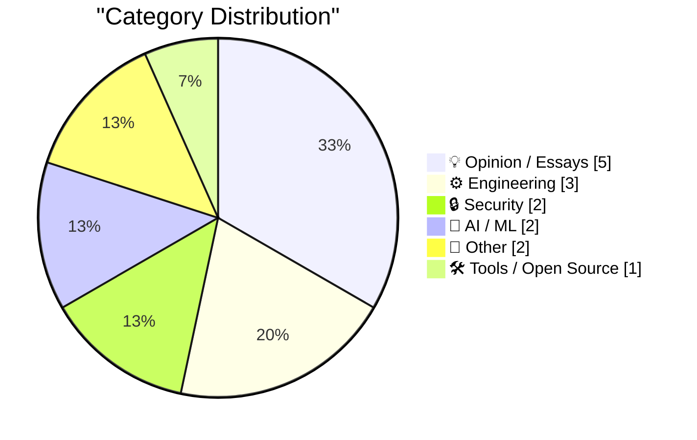
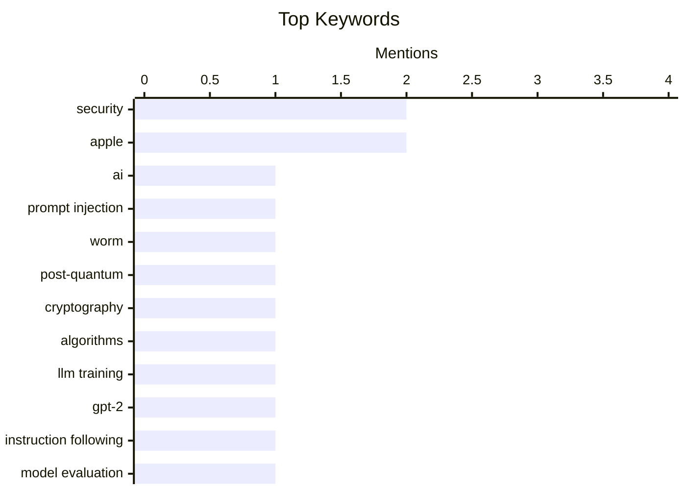

## Today's Highlights
Today's tech highlights reveal the complex impact of AI, from novel self-replicating worms threatening cybersecurity to escalating compute costs and training hurdles challenging its development. Simultaneously, the industry faces increasing scrutiny over user control and privacy, with debates around surveillance pricing and new device leasing programs that could restrict functionality. These trends underscore a rapidly evolving digital landscape where advanced threats and systemic errors alike carry significant real-world consequences.
---
## Must Read Today
1. **AI Worming through Word**
[AI Worming through Word](https://simonwillison.net/2026/Jul/29/ai-worming-through-word/#atom-everything) — simonwillison.net · 19h ago · 🔒 Security
> Håkon Måløy discovered a novel prompt injection variant that enables self-replicating worms in Microsoft Word using Copilot. This attack involves an attacker embedding hidden instructions within a document, which Copilot for Word then misinterprets as part of a user's request. This allows the malicious instructions to propagate and potentially execute further actions, effectively creating a self-replicating worm. This highlights a significant new vulnerability in AI-powered document processing, demonstrating how prompt injection can escalate to full self-replication.
💡 **Why read it**: It reveals a critical new security vulnerability in AI-powered document tools like Copilot, demonstrating how prompt injection can evolve into self-replicating worms.
🏷️ AI, Prompt Injection, Worm, Security
2. **Quoting Matthew Green**
[Quoting Matthew Green](https://simonwillison.net/2026/Jul/29/matthew-green/#atom-everything) — simonwillison.net · 19h ago · 🔒 Security
> The cybersecurity community is undergoing a historic transition from traditional public-key cryptography (EC-based, RSA) to new post-quantum algorithms. This transition, driven by the need for quantum-resistant security, involves the consideration of numerous new standards like HAWK. The timing of this shift presents a unique opportunity for a "massive new public cryptanalysis capability" to emerge, potentially disrupting the development and adoption of these new standards. The ongoing shift to post-quantum cryptography is a critical period, making the emergence of new cryptanalysis capabilities particularly impactful.
💡 **Why read it**: It highlights the critical and vulnerable period of transitioning to post-quantum cryptography, emphasizing the potential impact of new cryptanalysis capabilities.
🏷️ Post-Quantum, Cryptography, Security, Algorithms
3. **Why do OpenAI's GPT-2 weights beat mine?**
[Why do OpenAI's GPT-2 weights beat mine?](https://www.gilesthomas.com/2026/07/why-do-openai-gpt2-weights-beat-mine-1-intro) — gilesthomas.com · 22h ago · 🤖 AI / ML
> The author's custom-trained LLM models performed worse at instruction-following compared to the original OpenAI GPT-2 small weights. The author used an evaluation based on instruction fine-tuning code from "Build a Large Language Model (from Scratch)" and trained their model on a specific dataset. Despite following established methods, their models did not match the instruction-following capabilities of OpenAI's pre-trained GPT-2. This article explores the discrepancy in performance, suggesting potential underlying factors beyond basic training methodology that contribute to the superior instruction-following of OpenAI's models.
💡 **Why read it**: It investigates a common challenge in LLM development: understanding why custom-trained models may underperform compared to established pre-trained weights, even when following similar architectures.
🏷️ LLM training, GPT-2, Instruction following, Model evaluation
---
## Data Overview
| Sources Scanned | Articles Fetched | Time Window | Selected |
|:---:|:---:|:---:|:---:|
| 88/92 | 2609 -> 18 | 24h | **15** |
### Category Distribution

### Top Keywords

<details>
<summary>Plain Text Keyword Chart (Terminal Friendly)</summary>
```
security         │ ████████████████████ 2
apple            │ ████████████████████ 2
ai               │ ██████████░░░░░░░░░░ 1
prompt injection │ ██████████░░░░░░░░░░ 1
worm             │ ██████████░░░░░░░░░░ 1
post-quantum     │ ██████████░░░░░░░░░░ 1
cryptography     │ ██████████░░░░░░░░░░ 1
algorithms       │ ██████████░░░░░░░░░░ 1
llm training     │ ██████████░░░░░░░░░░ 1
gpt-2            │ ██████████░░░░░░░░░░ 1
```
</details>
### Topic Tags
**security**(2) · **apple**(2) · **ai**(1) · prompt injection(1) · worm(1) · post-quantum(1) · cryptography(1) · algorithms(1) · llm training(1) · gpt-2(1) · instruction following(1) · model evaluation(1) · surveillance(1) · privacy(1) · digital rights(1) · ethics(1) · compute cost(1) · ai economics(1) · h100(1) · infrastructure(1)
---
## Opinion / Essays
### 1. Pluralistic: The stupidest imaginable excuses for surveillance pricing (30 Jul 2026)
[Pluralistic: The stupidest imaginable excuses for surveillance pricing (30 Jul 2026)](https://pluralistic.net/2026/07/30/pay-for-privacy/) — **pluralistic.net** · 1h ago · ⭐ 26/30
> The article critiques the "stupidest imaginable excuses for surveillance pricing," linking it to historical corporate practices and broader issues of digital rights. It touches upon themes like "enshittification" and the persistent attempts by corporations, exemplified by San Francisco's Chamber of Commerce since 1850, to normalize exploitative practices. The author also mentions specific examples of digital vulnerabilities and failures, such as Diebold voting machines and RFID car theft, to underscore the pervasive nature of these issues. The piece argues that justifications for surveillance pricing are fundamentally flawed and part of a larger pattern of corporate overreach and user exploitation in the digital age.
🏷️ Surveillance, Privacy, Digital Rights, Ethics
---
### 2. Apple Says iOS 27 ‘Restricted Mode’ Isn’t for Users Who Miss Payments in New Apple Upgrade Program
[Apple Says iOS 27 ‘Restricted Mode’ Isn’t for Users Who Miss Payments in New Apple Upgrade Program](https://9to5mac.com/2026/07/28/apple-says-ios-27-restricted-mode-isnt-for-new-upgrade-program-leases/) — **daringfireball.net** · 17h ago · ⭐ 24/30
> Speculation arose that Apple's new iOS 27 "Restricted Mode" was designed to limit functionality on leased devices for users who missed payments in the new Apple Upgrade Program. Code in the iOS 27 developer beta revealed a "Restricted Mode" that limits devices to a few core apps (e.g., Accessibility Reader, App Store, Phone, Settings, Wallet, Passwords) and limited access to others like Messages. Apple, however, clarified that this feature is not intended for payment defaults in their new leasing program. Despite initial user speculation, Apple denies that iOS 27's "Restricted Mode" is linked to payment defaults, suggesting it serves another, as yet unstated, purpose.
🏷️ Apple, iOS, Restricted Mode, Payments
---
### 3. Apple Upgrade — New Program With Klarna for Leasing iPhones, Macs, iPads, and More for Near-Zero Interest
[Apple Upgrade — New Program With Klarna for Leasing iPhones, Macs, iPads, and More for Near-Zero Interest](https://www.apple.com/newsroom/2026/07/apple-upgrade-launches-in-the-united-states/) — **daringfireball.net** · 21h ago · ⭐ 24/30
> Apple has launched a new product leasing program, "Apple Upgrade," in partnership with Klarna, to make its products more accessible. The program offers near-zero interest leasing options for iPhones, Apple Watches, Macs, and iPads, available online and in Apple Stores in the United States. It provides 12- and 24-month leasing options for iPhones and Apple Watches, and 24- and 36-month options for other devices. Apple Upgrade aims to lower the barrier to entry for customers to acquire Apple products through flexible, low-interest leasing plans.
🏷️ Apple, Leasing, Klarna, Upgrade Program
---
### 4. Dario takes it on the chin
[Dario takes it on the chin](https://garymarcus.substack.com/p/dario-takes-it-on-the-chin) — **garymarcus.substack.com** · 20h ago · ⭐ 24/30
> The article briefly notes a significant decline in Dario Amodei's reputation. The provided text is extremely minimal, stating only "His reputation is crashing." Without further context from the article, specific arguments or technical details are unavailable. Dario Amodei's public standing or professional reputation is currently experiencing a rapid decline.
🏷️ Dario Amodei, Anthropic, AI criticism, Reputation
---
### 5. The AI Aesthetic
[The AI Aesthetic](https://blog.jim-nielsen.com/2026/ai-aesthetic/) — **blog.jim-nielsen.com** · 19h ago · ⭐ 23/30
> The article explores how new technological eras introduce unique design idioms, some of which become lasting paradigms while others fade as fads. It draws a parallel with the "hamburger menu" (≡), which emerged due to mobile screen size constraints and subsequently spread across various software interactions. The author suggests that the current "AI zeitgeist" is similarly generating its own distinct aesthetic and interaction patterns. These new design elements, driven by AI's capabilities and challenges, are beginning to influence software design. The article anticipates that the AI era will embed its own unique design language into future software interaction paradigms, much like previous technological shifts.
🏷️ AI design, User interface, Design trends, Aesthetic
---
## Engineering
### 6. Count Those Underscores
[Count Those Underscores](https://arstechnica.com/tech-policy/2026/07/police-missed-one-underscore-and-sent-the-wrong-man-to-prison/) — **daringfireball.net** · 22h ago · ⭐ 25/30
> A single-character error in a username led to the wrongful imprisonment of an innocent man for 18 months. Police were searching for a Kik messaging service user named "fus__ro_dah" (two underscores) but mistakenly requested records for "fus_ro_dah" (one underscore). This error resulted in Brandon Klayme being identified and imprisoned, despite a lack of other corroborating evidence. This case starkly illustrates the critical importance of meticulous data accuracy in law enforcement investigations and the severe consequences of even minor clerical errors.
🏷️ Data Accuracy, Typo, Legal Error, System Design
---
### 7. Wheels, Bottles and Images
[Wheels, Bottles and Images](https://nesbitt.io/2026/07/30/wheels-bottles-images.html) — **nesbitt.io** · 4h ago · ⭐ 23/30
> The article discusses the increasing convergence between package managers and container registries. It posits that modern package managers, by handling dependency resolution, environment isolation, and artifact distribution (like Python wheels or Homebrew bottles), are evolving to perform functions similar to container registries. This trend blurs the lines between managing software packages and deploying container images. The author concludes that advanced package managers are becoming functionally indistinguishable from container registries, highlighting a significant shift in software distribution paradigms.
🏷️ Package manager, Container registry, Software distribution
---
### 8. Quoting D. Richard Hipp
[Quoting D. Richard Hipp](https://simonwillison.net/2026/Jul/29/d-richard-hipp/#atom-everything) — **simonwillison.net** · 16h ago · ⭐ 21/30
> The article quotes D. Richard Hipp, highlighting the transformative impact of SQL on data querying and software development. Hipp explains that before SQL, specialized COBOL programmers were required to write extensive code for querying large datasets. SQL emerged as a declarative language, enabling users to specify queries simply, which then generated the complex underlying code previously written manually. This shift significantly reduced the need for expensive, specialized programming for data access. SQL democratized data querying by abstracting away low-level implementation details, making complex data operations accessible through simple specifications.
🏷️ SQL, COBOL, Database, Programming History
---
## Security
### 9. AI Worming through Word
[AI Worming through Word](https://simonwillison.net/2026/Jul/29/ai-worming-through-word/#atom-everything) — **simonwillison.net** · 19h ago · ⭐ 29/30
> Håkon Måløy discovered a novel prompt injection variant that enables self-replicating worms in Microsoft Word using Copilot. This attack involves an attacker embedding hidden instructions within a document, which Copilot for Word then misinterprets as part of a user's request. This allows the malicious instructions to propagate and potentially execute further actions, effectively creating a self-replicating worm. This highlights a significant new vulnerability in AI-powered document processing, demonstrating how prompt injection can escalate to full self-replication.
🏷️ AI, Prompt Injection, Worm, Security
---
### 10. Quoting Matthew Green
[Quoting Matthew Green](https://simonwillison.net/2026/Jul/29/matthew-green/#atom-everything) — **simonwillison.net** · 19h ago · ⭐ 28/30
> The cybersecurity community is undergoing a historic transition from traditional public-key cryptography (EC-based, RSA) to new post-quantum algorithms. This transition, driven by the need for quantum-resistant security, involves the consideration of numerous new standards like HAWK. The timing of this shift presents a unique opportunity for a "massive new public cryptanalysis capability" to emerge, potentially disrupting the development and adoption of these new standards. The ongoing shift to post-quantum cryptography is a critical period, making the emergence of new cryptanalysis capabilities particularly impactful.
🏷️ Post-Quantum, Cryptography, Security, Algorithms
---
## AI / ML
### 11. Why do OpenAI's GPT-2 weights beat mine?
[Why do OpenAI's GPT-2 weights beat mine?](https://www.gilesthomas.com/2026/07/why-do-openai-gpt2-weights-beat-mine-1-intro) — **gilesthomas.com** · 22h ago · ⭐ 27/30
> The author's custom-trained LLM models performed worse at instruction-following compared to the original OpenAI GPT-2 small weights. The author used an evaluation based on instruction fine-tuning code from "Build a Large Language Model (from Scratch)" and trained their model on a specific dataset. Despite following established methods, their models did not match the instruction-following capabilities of OpenAI's pre-trained GPT-2. This article explores the discrepancy in performance, suggesting potential underlying factors beyond basic training methodology that contribute to the superior instruction-following of OpenAI's models.
🏷️ LLM training, GPT-2, Instruction following, Model evaluation
---
### 12. Why compute might get 10x+ more expensive in coming years
[Why compute might get 10x+ more expensive in coming years](https://www.dwarkesh.com/p/why-compute-might-get-10x-more-expensive) — **dwarkesh.com** · 23h ago · ⭐ 26/30
> The cost of compute, particularly for advanced AI models, is projected to increase significantly, potentially by over 10x in the coming years. This projection is based on a comparison: if an H100 equivalent could run a human-level software engineer, its annual rental rate should exceed $250,000, which is 15 times today's spot price. This implies that as AI capabilities advance towards human-level performance, the economic value and thus the cost of the underlying compute infrastructure will skyrocket. The increasing demand for powerful compute to run advanced AI, especially human-level AI, will drive a dramatic surge in compute costs, making it a critical economic factor for future technological development.
🏷️ Compute cost, AI economics, H100, Infrastructure
---
## Other
### 13. ‘eBay’s Bizarre Cyberstalking Saga Ends With a $56 Million Settlement’
[‘eBay’s Bizarre Cyberstalking Saga Ends With a $56 Million Settlement’](https://www.theverge.com/tech/972209/ebay-cyberstalking-harassment-settlement) — **daringfireball.net** · 23h ago · ⭐ 23/30
> eBay and three former executives settled a cyberstalking and harassment lawsuit for $55.7 million with a Massachusetts couple. The settlement resolves a 2019 incident where former eBay executives orchestrated a bizarre campaign against David and Ina Steiner, publishers of a newsletter covering eBay. This campaign involved sending disturbing items like live insects, a bloody pig mask, and a funeral wreath to their home. The $55.7 million settlement underscores the severe legal and financial repercussions for corporate executives engaging in illegal harassment and cyberstalking.
🏷️ eBay, Cyberstalking, Settlement, Corporate Ethics
---
### 14. Why Is Everyone Trying to Build a Solid-State Battery?
[Why Is Everyone Trying to Build a Solid-State Battery?](https://www.construction-physics.com/p/why-is-everyone-trying-to-build-a) — **construction-physics.com** · 1h ago · ⭐ 19/30
> The article addresses the significant interest and investment in developing solid-state batteries. Solid-state batteries are a type of lithium-ion battery that replaces the traditional liquid electrolyte with a solid material. This fundamental design change promises several advantages, including higher energy density, improved safety (reduced risk of fire), and potentially faster charging times compared to conventional lithium-ion batteries. These benefits are driving extensive research and development efforts across the industry. Solid-state batteries are a highly anticipated next-generation technology due to their potential to offer substantial improvements in performance and safety over current lithium-ion batteries.
🏷️ Solid-state battery, Lithium-ion, Battery technology
---
## Tools / Open Source
### 15. Pastebot 3
[Pastebot 3](https://tapbots.com/pastebot/) — **daringfireball.net** · 21h ago · ⭐ 20/30
> The article announces the release of Pastebot 3, an updated clipboard manager for Mac, and highlights its key features. Despite other apps like Keyboard Maestro and LaunchBar offering clipboard management, the author prefers Pastebot for its dedicated functionality. Version 3 significantly improves by remembering up to 1,500 clippings, a 50% increase from version 2's 1,000. It also features seamless iCloud syncing, allowing copied items to be instantly available across multiple Macs. Pastebot 3 offers robust clipboard management with enhanced capacity and cross-device synchronization, making it a preferred tool for power users.
🏷️ Mac, Clipboard Manager, Pastebot, Productivity
---
*Generated at 2026-07-30 14:02 | Scanned 88 sources -> 2609 articles -> selected 15*
*Based on the [Hacker News Popularity Contest 2025](https://refactoringenglish.com/tools/hn-popularity/) RSS source list recommended by [Andrej Karpathy](https://x.com/karpathy)*
*Produced by Dongdianr AI. Follow the same-name WeChat public account for more AI practical tips 💡*
