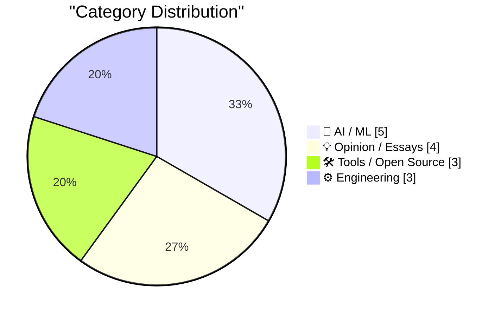
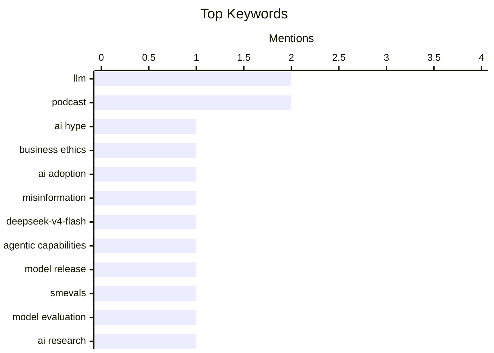

## Today's Highlights
Today's AI news showcases a dual narrative of rapid innovation and growing realism. While new models like DeepSeek-V4-Flash and advanced evaluation tools emerge, the industry faces increasing scrutiny over exaggerated claims and the escalating financial burden of AI development. Discussions also highlight the ongoing tension between open-weight models and proprietary systems, pushing for greater transparency and accountability in the AI space.
---
## Must Read Today
1. **Pluralistic: Why businesses lie about AI (01 Aug 2026)**
[Pluralistic: Why businesses lie about AI (01 Aug 2026)](https://pluralistic.net/2026/08/01/dare-snot/) — pluralistic.net · 1h ago · 💡 Opinion / Essays
> This article critically examines why businesses often misrepresent their AI capabilities, driven by internal pressures and a desire to appear innovative. It highlights the phenomenon of "humoring the boss all the way into bankruptcy" and the "AI's pogo-stick grift," suggesting a significant gap between actual AI utility and corporate narratives. The piece implies that this misrepresentation leads to wasted resources and a distorted understanding of AI's true potential and limitations. Ultimately, it advocates for skepticism regarding corporate AI claims to avoid falling for hype and financial mismanagement.
💡 **Why read it**: This article is worth reading for its critical perspective on corporate AI narratives, exposing potential dishonesty and the economic implications of AI hype.
🏷️ AI hype, business ethics, AI adoption, misinformation
2. **deepseek-ai/DeepSeek-V4-Flash-0731**
[deepseek-ai/DeepSeek-V4-Flash-0731](https://simonwillison.net/2026/Jul/31/deepseek-v4-flash-0731/#atom-everything) — simonwillison.net · 14h ago · 🤖 AI / ML
> This article introduces `deepseek-ai/DeepSeek-V4-Flash-0731`, the latest release in DeepSeek's V4 family, which boasts "substantially enhanced agentic capabilities." Despite being a 304 billion parameter model (167GB on Hugging Face), it demonstrates performance that "punches well above its weight." Artificial Analysis ranks it ahead of MiniMax M3, a larger 428B model, and it is priced competitively at $0.14/million input tokens. The model's efficiency and strong performance relative to its size suggest a significant advancement in large language model development.
💡 **Why read it**: This article is worth reading for its introduction to a highly efficient and powerful new LLM, DeepSeek-V4-Flash-0731, which offers superior performance at a competitive cost.
🏷️ DeepSeek-V4-Flash, LLM, agentic capabilities, model release
3. **smevals - a small eval suite for evaluating models, prompts, and harnesses**
[smevals - a small eval suite for evaluating models, prompts, and harnesses](https://simonwillison.net/2026/Jul/31/smevals/#atom-everything) — simonwillison.net · 16h ago · 🛠 Tools / Open Source
> The article announces `smevals`, a new open-source evaluation framework developed in collaboration with Jesse Vincent's Prime Radiant applied AI research lab. This tool is designed to systematically evaluate the capabilities of different AI models, prompts, and harnesses. `smevals` aims to provide a structured approach for answering critical questions about model performance and effectiveness. The framework is available on GitHub at `https://github.com/prime-radiant-inc/smevals`, offering a practical solution for researchers and developers to rigorously test and compare AI system components.
💡 **Why read it**: This article is worth reading for introducing `smevals`, a new open-source evaluation suite that provides a structured method for rigorously testing AI models, prompts, and harnesses.
🏷️ smevals, model evaluation, AI research, prompts
---
## Data Overview
| Sources Scanned | Articles Fetched | Time Window | Selected |
|:---:|:---:|:---:|:---:|
| 88/92 | 2610 -> 19 | 24h | **15** |
### Category Distribution

### Top Keywords

<details>
<summary>Plain Text Keyword Chart (Terminal Friendly)</summary>
```
llm                  │ ████████████████████ 2
podcast              │ ████████████████████ 2
ai hype              │ ██████████░░░░░░░░░░ 1
business ethics      │ ██████████░░░░░░░░░░ 1
ai adoption          │ ██████████░░░░░░░░░░ 1
misinformation       │ ██████████░░░░░░░░░░ 1
deepseek-v4-flash    │ ██████████░░░░░░░░░░ 1
agentic capabilities │ ██████████░░░░░░░░░░ 1
model release        │ ██████████░░░░░░░░░░ 1
smevals              │ ██████████░░░░░░░░░░ 1
```
</details>
### Topic Tags
**llm**(2) · **podcast**(2) · **ai hype**(1) · business ethics(1) · ai adoption(1) · misinformation(1) · deepseek-v4-flash(1) · agentic capabilities(1) · model release(1) · smevals(1) · model evaluation(1) · ai research(1) · prompts(1) · ai cost(1) · llms(1) · ai economics(1) · productivity(1) · llm-mcp-client(1) · mcp(1) · client library(1)
---
## AI / ML
### 1. deepseek-ai/DeepSeek-V4-Flash-0731
[deepseek-ai/DeepSeek-V4-Flash-0731](https://simonwillison.net/2026/Jul/31/deepseek-v4-flash-0731/#atom-everything) — **simonwillison.net** · 14h ago · ⭐ 26/30
> This article introduces `deepseek-ai/DeepSeek-V4-Flash-0731`, the latest release in DeepSeek's V4 family, which boasts "substantially enhanced agentic capabilities." Despite being a 304 billion parameter model (167GB on Hugging Face), it demonstrates performance that "punches well above its weight." Artificial Analysis ranks it ahead of MiniMax M3, a larger 428B model, and it is priced competitively at $0.14/million input tokens. The model's efficiency and strong performance relative to its size suggest a significant advancement in large language model development.
🏷️ DeepSeek-V4-Flash, LLM, agentic capabilities, model release
---
### 2. Premium: AI Is Getting Way Too Expensive
[Premium: AI Is Getting Way Too Expensive](https://www.wheresyoured.at/premium-ai-is-getting-way-too-expensive/) — **wheresyoured.at** · 22h ago · ⭐ 26/30
> The article addresses the often-overlooked financial implications of AI, specifically arguing that AI is becoming excessively expensive. It shifts the discussion from theoretical job losses or productivity gains to the tangible costs associated with deploying and maintaining AI systems, particularly LLMs. While the provided snippet is brief, it implies that the economic benefits often touted for AI may not outweigh the escalating expenses. The core problem highlighted is the increasing financial burden of AI, contrasting with the common focus on its societal or productivity impacts.
🏷️ AI cost, LLMs, AI economics, Productivity
---
### 3. Stateless MCP has recaptured my interest (and inspired mcp-explorer and datasette-mcp)
[Stateless MCP has recaptured my interest (and inspired mcp-explorer and datasette-mcp)](https://simonwillison.net/2026/Jul/31/stateless-mcp/#atom-everything) — **simonwillison.net** · 14h ago · ⭐ 24/30
> The article discusses the resurgence of interest in the Model Context Protocol (MCP) following the rollout of MCP 2.0, formally known as the `2026-07-28 Model Context Protocol specification`. This update represents the most significant change to the MCP spec since its inception, reigniting the author's personal engagement with the protocol. The new specification has inspired the development of related tools, `mcp-explorer` and `datasette-mcp`, indicating a renewed focus on practical implementations and explorations of the protocol. MCP is designed to manage model context, and this update promises enhanced capabilities and broader adoption.
🏷️ Model Context Protocol, MCP 2.0, AI protocol, specification
---
### 4. Three reactions to Anthropics’s latest apologia
[Three reactions to Anthropics’s latest apologia](https://garymarcus.substack.com/p/three-reactions-to-anthropicss-latest) — **garymarcus.substack.com** · 19h ago · ⭐ 24/30
> The article presents Gary Marcus's "three reactions" to Anthropic's latest "apologia," which likely refers to a recent statement or publication from Anthropic attempting to defend or explain aspects of their AI work. While the specific content of Anthropic's apologia isn't detailed in the snippet, Marcus's opening line, "I wish I could say I was comforted," strongly suggests a critical and skeptical stance. This implies that Marcus finds Anthropic's explanations insufficient or unconvincing regarding potential issues or claims related to their AI. The article serves as a critical commentary on Anthropic's public communications.
🏷️ Anthropic, AI critique, LLM safety, Gary Marcus
---
### 5. How I use AI on this blog
[How I use AI on this blog](https://www.gilesthomas.com/2026/07/ai-use) — **gilesthomas.com** · 19h ago · ⭐ 23/30
> How I use AI on this blog
🏷️ AI tools, Content creation, AI policy, Workflow
---
## Opinion / Essays
### 6. Pluralistic: Why businesses lie about AI (01 Aug 2026)
[Pluralistic: Why businesses lie about AI (01 Aug 2026)](https://pluralistic.net/2026/08/01/dare-snot/) — **pluralistic.net** · 1h ago · ⭐ 27/30
> This article critically examines why businesses often misrepresent their AI capabilities, driven by internal pressures and a desire to appear innovative. It highlights the phenomenon of "humoring the boss all the way into bankruptcy" and the "AI's pogo-stick grift," suggesting a significant gap between actual AI utility and corporate narratives. The piece implies that this misrepresentation leads to wasted resources and a distorted understanding of AI's true potential and limitations. Ultimately, it advocates for skepticism regarding corporate AI claims to avoid falling for hype and financial mismanagement.
🏷️ AI hype, business ethics, AI adoption, misinformation
---
### 7. Oxide and Friends: The Open Weight Revolution with Simon Willison
[Oxide and Friends: The Open Weight Revolution with Simon Willison](https://simonwillison.net/2026/Jul/31/oxide-and-friends/#atom-everything) — **simonwillison.net** · 16h ago · ⭐ 25/30
> This article highlights Simon Willison's appearance on the "Oxide and Friends" podcast, where he discussed the "Open Weight Revolution" in AI. The conversation centered on a "wild week" in AI, particularly the emergence of Kimi K3, an open-weight model demonstrated to compete effectively with proprietary frontier models. This event, alongside an "accidental cyberattack" on OpenAI, underscores a significant shift in the AI landscape. The discussion emphasizes the growing capability and competitiveness of open-weight AI models against their closed-source counterparts.
🏷️ Open Weight, AI models, podcast, Simon Willison
---
### 8. The Talk Show: ‘What’s in Louie’s Wallet’
[The Talk Show: ‘What’s in Louie’s Wallet’](https://daringfireball.net/thetalkshow/2026/07/31/ep-453) — **daringfireball.net** · 15h ago · ⭐ 23/30
> This episode of "The Talk Show" features Louie Mantia, who discusses the current state of UI and icon design across Apple's platforms. The conversation also includes speculation regarding Apple's ongoing trade secret lawsuit against OpenAI. The podcast touches upon how design principles are evolving within the Apple ecosystem and the broader implications of legal disputes involving major AI players. Sponsored by Notion, Even Realities (Even G2 smart glasses), and Squarespace, the episode offers insights into both design trends and the legal landscape of AI.
🏷️ UI design, Apple platforms, OpenAI lawsuit, podcast
---
### 9. Severance
[Severance](https://lcamtuf.substack.com/p/severance) — **lcamtuf.substack.com** · 20h ago · ⭐ 21/30
> Severance
🏷️ Severance, Layoffs, Tech industry, Career
---
## Tools / Open Source
### 10. smevals - a small eval suite for evaluating models, prompts, and harnesses
[smevals - a small eval suite for evaluating models, prompts, and harnesses](https://simonwillison.net/2026/Jul/31/smevals/#atom-everything) — **simonwillison.net** · 16h ago · ⭐ 26/30
> The article announces `smevals`, a new open-source evaluation framework developed in collaboration with Jesse Vincent's Prime Radiant applied AI research lab. This tool is designed to systematically evaluate the capabilities of different AI models, prompts, and harnesses. `smevals` aims to provide a structured approach for answering critical questions about model performance and effectiveness. The framework is available on GitHub at `https://github.com/prime-radiant-inc/smevals`, offering a practical solution for researchers and developers to rigorously test and compare AI system components.
🏷️ smevals, model evaluation, AI research, prompts
---
### 11. llm-mcp-client 0.1a0
[llm-mcp-client 0.1a0](https://simonwillison.net/2026/Jul/31/llm-mcp-client/#atom-everything) — **simonwillison.net** · 14h ago · ⭐ 25/30
> This article announces the release of `llm-mcp-client 0.1a0`, a new client for the Model Context Protocol (MCP). The release is tagged as `0.1a0` on GitHub, indicating an early alpha version. It is related to a broader discussion on the "Stateless MCP" and the `2026-07-28 Model Context Protocol specification`. This client likely facilitates interaction with AI models adhering to the MCP, which is designed for managing model context. The release signifies ongoing development and tooling support for the evolving MCP standard.
🏷️ llm-mcp-client, LLM, MCP, client library
---
### 12. datasette-agent 0.4a0
[datasette-agent 0.4a0](https://simonwillison.net/2026/Jul/31/datasette-agent/#atom-everything) — **simonwillison.net** · 23h ago · ⭐ 25/30
> This article announces the release of `datasette-agent 0.4a0`, a new version of the Datasette Agent plugin. The key new feature in this release is the `await context.browser_task()` mechanism, introduced in pull request #33. This capability allows agent tools to execute code directly within the user's browser, significantly enhancing the plugin's functionality. This development makes it easier for Datasette Agent plugins to provide powerful, client-side executable tools. The release marks an exciting expansion of Datasette Agent's interactive and programmatic capabilities.
🏷️ datasette-agent, agent tools, browser task, release
---
## Engineering
### 13. This Week in Package Management: 1 August 2026
[This Week in Package Management: 1 August 2026](https://nesbitt.io/2026/08/01/this-week-in-package-management.html) — **nesbitt.io** · 4h ago · ⭐ 22/30
> This Week in Package Management: 1 August 2026
🏷️ Package management, Releases, Advisories, Software distribution
---
### 14. Energizing a vacuum-tube flip-flop module from a 1948 IBM system
[Energizing a vacuum-tube flip-flop module from a 1948 IBM system](http://www.righto.com/feeds/8170534610895348133/comments/default) — **righto.com** · 21h ago · ⭐ 20/30
> Energizing a vacuum-tube flip-flop module from a 1948 IBM system
🏷️ IBM 604, Vacuum tube, Computer history, Hardware
---
### 15. Solving the RK4 design equations
[Solving the RK4 design equations](https://www.johndcook.com/blog/2026/07/31/runge-kutta-design/) — **johndcook.com** · 19h ago · ⭐ 20/30
> Solving the RK4 design equations
🏷️ Runge-Kutta, Differential equations, Numerical methods, Algorithms
---
*Generated at 2026-08-01 14:01 | Scanned 88 sources -> 2610 articles -> selected 15*
*Based on the [Hacker News Popularity Contest 2025](https://refactoringenglish.com/tools/hn-popularity/) RSS source list recommended by [Andrej Karpathy](https://x.com/karpathy)*
*Produced by Dongdianr AI. Follow the same-name WeChat public account for more AI practical tips 💡*
