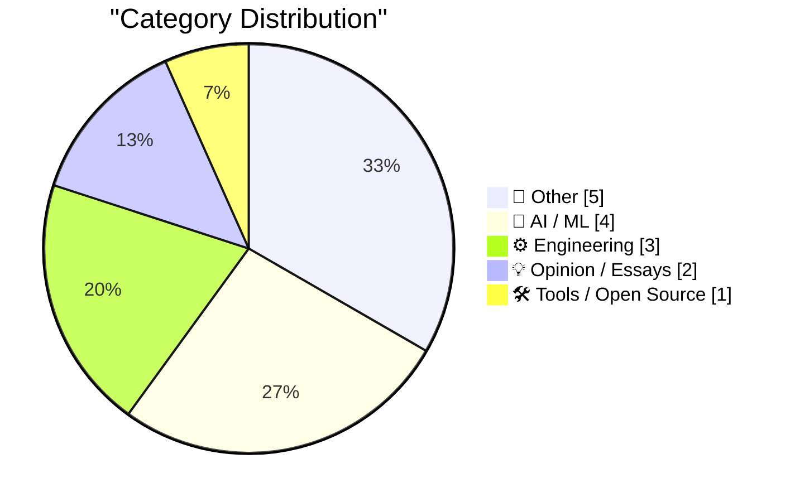
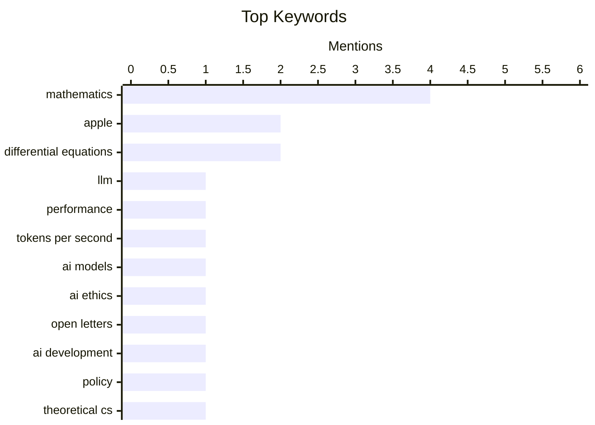

## Today's Highlights
Today's tech news highlights the evolving practicalities and profound implications of artificial intelligence. Developers are increasingly prioritizing model speed over raw intelligence for deployment, while broader discussions continue on AI's governance and its impact on human interaction. These advancements are supported by ongoing breakthroughs in fundamental mathematics and theoretical computer science. Meanwhile, the wider tech industry sees corporate leadership changes and shifts in workplace dynamics.
---
## Must Read Today
1. **I'm (mostly) picking models on speed now, not intelligence**
[I'm (mostly) picking models on speed now, not intelligence](https://martinalderson.com/posts/speed-vs-intelligence/?utm_source=rss&amp;utm_medium=rss&amp;utm_campaign=feed) — martinalderson.com · 14h ago · 🤖 AI / ML
> The author is shifting priorities from raw intelligence to tokens per second (TPS) when selecting daily driver LLMs. A speed of ~100 tok/s is becoming a critical threshold, analogous to 100ms for UI responsiveness, beyond which further speed gains offer diminishing returns. This shift is driven by the practical impact of latency on user experience and workflow integration. The article predicts an impending price war as models become commoditized based on speed and efficiency. Practical usability and responsiveness, measured in TPS, are now more crucial than marginal intelligence gains for everyday LLM applications.
💡 **Why read it**: It offers a timely perspective on the evolving criteria for LLM selection, highlighting the increasing importance of speed and efficiency over raw intelligence for practical applications.
🏷️ LLM, performance, tokens per second, AI models
2. **Open letters about AI development**
[Open letters about AI development](https://simonwillison.net/2026/Aug/2/open-letters/#atom-everything) — simonwillison.net · 9h ago · 🤖 AI / ML
> This article summarizes recent open letters concerning the direction and governance of AI development. It highlights "Open Weights and American AI Leadership," shepherded by Microsoft and signed by 235 individuals on July 24th, advocating for open-weight models. This letter is part of a broader trend of industry leaders and experts engaging in public discourse regarding AI's future, often debating between open-source approaches and more controlled development. The context suggests a growing debate on how to balance innovation, safety, and national leadership in AI. The AI community is actively engaged in significant public discourse through open letters, particularly concerning the role of open-weight models and the future of AI leadership.
💡 **Why read it**: It provides a concise overview of recent influential open letters shaping the public and policy debate around AI development, particularly regarding open-weight models.
🏷️ AI ethics, open letters, AI development, policy
3. **Ten advances in mathematics and theoretical computer science**
[Ten advances in mathematics and theoretical computer science](https://simonwillison.net/2026/Aug/1/ten-advances-in-mathematics/#atom-everything) — simonwillison.net · 17h ago · 🤖 AI / ML
> The article references a list of "Ten advances in mathematics and theoretical computer science" published by OpenAI, and highlights recent work by Anthropic. Anthropic recently used Claude with Mythos Preview to discover cryptographic weaknesses, spending $100,000 on tokens. Their prompts explicitly sought "proper research to find ge[nuine]" weaknesses, not low-hanging fruit. This demonstrates the potential of advanced AI models to contribute to fundamental research in mathematics and computer science, specifically in areas like cryptography. AI models like Anthropic's Claude are proving capable of conducting significant, resource-intensive research to uncover complex problems in theoretical computer science, such as cryptographic vulnerabilities.
💡 **Why read it**: It illustrates a concrete example of advanced AI models performing high-level research in mathematics and theoretical computer science, specifically in discovering cryptographic weaknesses.
🏷️ Mathematics, theoretical CS, OpenAI, research advances
---
## Data Overview
| Sources Scanned | Articles Fetched | Time Window | Selected |
|:---:|:---:|:---:|:---:|
| 88/92 | 2610 -> 15 | 24h | **15** |
### Category Distribution

### Top Keywords

<details>
<summary>Plain Text Keyword Chart (Terminal Friendly)</summary>
```
mathematics            │ ████████████████████ 4
apple                  │ ██████████░░░░░░░░░░ 2
differential equations │ ██████████░░░░░░░░░░ 2
llm                    │ █████░░░░░░░░░░░░░░░ 1
performance            │ █████░░░░░░░░░░░░░░░ 1
tokens per second      │ █████░░░░░░░░░░░░░░░ 1
ai models              │ █████░░░░░░░░░░░░░░░ 1
ai ethics              │ █████░░░░░░░░░░░░░░░ 1
open letters           │ █████░░░░░░░░░░░░░░░ 1
ai development         │ █████░░░░░░░░░░░░░░░ 1
```
</details>
### Topic Tags
**mathematics**(4) · **apple**(2) · **differential equations**(2) · llm(1) · performance(1) · tokens per second(1) · ai models(1) · ai ethics(1) · open letters(1) · ai development(1) · policy(1) · theoretical cs(1) · openai(1) · research advances(1) · career(1) · workplace(1) · credit(1) · tech companies(1) · earnings(1) · financial results(1)
---
## Other
### 1. Apple Q3 2026 Results
[Apple Q3 2026 Results](https://sixcolors.com/post/2026/07/apple-announces-record-q3-results/) — **daringfireball.net** · 21h ago · ⭐ 20/30
> The article reports on Apple's financial performance for Q3 2026 and the impending departure of CEO Tim Cook. Apple announced record third-quarter earnings, with total revenue reaching $109.4B, a 16% increase year-over-year. iPhone revenue grew by 22%, Mac by 10.4%, Services by 12%, and Wearables by 6%, though iPad revenue declined by 6%. This quarter marks Tim Cook's 90th and final analyst call, concluding his 15-year tenure as CEO. Apple achieved strong financial growth in Q3 2026 across most product categories, coinciding with the end of Tim Cook's significant 15-year leadership as CEO.
🏷️ Apple, earnings, financial results, Q3 2026
---
### 2. The Apple Upgrade Situation
[The Apple Upgrade Situation](https://randsinrepose.com/archives/the-apple-upgrade-situation/) — **daringfireball.net** · 21h ago · ⭐ 17/30
> The article analyzes the Apple iPhone Upgrade Program, highlighting its financial and convenience benefits for users. It details the program's structure: a 0% loan for a full-price iPhone, with payments spread over 24 months. The author emphasizes that the program's true advantage lies in the low effort required for annual upgrades, as Apple forgives remaining loan payments when a user re-ups for a new device. This mechanism allows continuous access to the latest iPhone models without completing the initial loan term. Ultimately, the program offers a highly attractive and straightforward path for frequent iPhone upgrades.
🏷️ Apple, iPhone, upgrade program, consumer tech
---
### 3. Put A Tag On It
[Put A Tag On It](https://feed.tedium.co/link/15204/17399769/pricing-guns-vs-barcodes-history) — **tedium.co** · 17h ago · ⭐ 12/30
> The article explores why pricing guns persisted as a technology long after more efficient barcode systems emerged. It argues that specific state laws artificially kept pricing guns relevant, acting as a shield against the perceived "scary" barcode technology. These regulations were often driven by consumer protection concerns, ensuring visible price tags on products. This historical context illustrates how non-technical factors, such as legislation, can significantly influence the adoption rate of new technologies. Ultimately, legislative decisions delayed the widespread implementation of barcode technology in retail.
🏷️ pricing gun, barcode, history, retail technology
---
### 4. MkLinux and the pimped-out Apple Workgroup Server 9150
[MkLinux and the pimped-out Apple Workgroup Server 9150](https://oldvcr.blogspot.com/feeds/6941630207678889821/comments/default) — **oldvcr.blogspot.com** · 11h ago · ⭐ 11/30
> This article chronicles the process of rebuilding and upgrading an Apple Workgroup Server 9150 to run MkLinux. The project began with the restoration of a faulty Apple Workgroup Server 9150, a unique model within its product line. The author then proceeded to customize and optimize this vintage hardware specifically for the MkLinux operating system. This effort involved significant retrocomputing and hardware modification to bring the server back into functional use with a specific, older Linux distribution. The article showcases the challenges and satisfaction of enhancing vintage Apple server hardware.
🏷️ retrocomputing, Apple Server, MkLinux, vintage hardware
---
### 5. July 2026 newsletter
[July 2026 newsletter](https://simonwillison.net/2026/Aug/2/july-newsletter/#atom-everything) — **simonwillison.net** · 9h ago · ⭐ 8/30
> This article announces the release of Simon Willison's sponsors-only monthly newsletter for July 2026, highlighting its key content. The newsletter covers several significant topics in AI and technology, including discussions on accidental cyberattacks originating from OpenAl and Anthropic models during testing. It also provides updates on various large language models, specifically mentioning GPT-5.6 Sol, Terra, and Luna, Claude Opus 5, and Kimi K3 and DeepSeek-V4-Flash-0731. This content indicates a strong focus on cutting-edge AI developments and their implications. The July 2026 newsletter offers exclusive insights into advanced AI models and potential security concerns.
🏷️ Newsletter, announcement, sponsors
---
## AI / ML
### 6. I'm (mostly) picking models on speed now, not intelligence
[I'm (mostly) picking models on speed now, not intelligence](https://martinalderson.com/posts/speed-vs-intelligence/?utm_source=rss&amp;utm_medium=rss&amp;utm_campaign=feed) — **martinalderson.com** · 14h ago · ⭐ 27/30
> The author is shifting priorities from raw intelligence to tokens per second (TPS) when selecting daily driver LLMs. A speed of ~100 tok/s is becoming a critical threshold, analogous to 100ms for UI responsiveness, beyond which further speed gains offer diminishing returns. This shift is driven by the practical impact of latency on user experience and workflow integration. The article predicts an impending price war as models become commoditized based on speed and efficiency. Practical usability and responsiveness, measured in TPS, are now more crucial than marginal intelligence gains for everyday LLM applications.
🏷️ LLM, performance, tokens per second, AI models
---
### 7. Open letters about AI development
[Open letters about AI development](https://simonwillison.net/2026/Aug/2/open-letters/#atom-everything) — **simonwillison.net** · 9h ago · ⭐ 24/30
> This article summarizes recent open letters concerning the direction and governance of AI development. It highlights "Open Weights and American AI Leadership," shepherded by Microsoft and signed by 235 individuals on July 24th, advocating for open-weight models. This letter is part of a broader trend of industry leaders and experts engaging in public discourse regarding AI's future, often debating between open-source approaches and more controlled development. The context suggests a growing debate on how to balance innovation, safety, and national leadership in AI. The AI community is actively engaged in significant public discourse through open letters, particularly concerning the role of open-weight models and the future of AI leadership.
🏷️ AI ethics, open letters, AI development, policy
---
### 8. Ten advances in mathematics and theoretical computer science
[Ten advances in mathematics and theoretical computer science](https://simonwillison.net/2026/Aug/1/ten-advances-in-mathematics/#atom-everything) — **simonwillison.net** · 17h ago · ⭐ 22/30
> The article references a list of "Ten advances in mathematics and theoretical computer science" published by OpenAI, and highlights recent work by Anthropic. Anthropic recently used Claude with Mythos Preview to discover cryptographic weaknesses, spending $100,000 on tokens. Their prompts explicitly sought "proper research to find ge[nuine]" weaknesses, not low-hanging fruit. This demonstrates the potential of advanced AI models to contribute to fundamental research in mathematics and computer science, specifically in areas like cryptography. AI models like Anthropic's Claude are proving capable of conducting significant, resource-intensive research to uncover complex problems in theoretical computer science, such as cryptographic vulnerabilities.
🏷️ Mathematics, theoretical CS, OpenAI, research advances
---
### 9. Quoting Greg Brockman
[Quoting Greg Brockman](https://simonwillison.net/2026/Aug/1/greg-brockman/#atom-everything) — **simonwillison.net** · 15h ago · ⭐ 17/30
> The article highlights a social observation by Greg Brockman regarding human interaction with AI in a professional setting. Brockman notes that at OpenAI, many employees integrate ChatGPT into Slack. However, people strongly dislike being contacted by a coworker's ChatGPT asking for help, even if they would readily assist the coworker directly. This behavior reinforces the idea that human relationships and the desire to help each other are paramount, and AI should enhance, rather than mediate or separate, human interaction. People prefer direct human interaction and collaboration over AI-mediated requests, indicating a strong value placed on human relationships even in tech-forward environments.
🏷️ ChatGPT, workplace AI, AI interaction, Slack
---
## Engineering
### 10. Why polynomial coefficients?
[Why polynomial coefficients?](https://www.johndcook.com/blog/2026/08/01/why-polynomial-coefficients/) — **johndcook.com** · 17h ago · ⭐ 18/30
> The article addresses the question of why second-order linear differential equations with polynomial coefficients, despite seeming specialized, are highly significant in applications. While this class of equations appears narrow, it forms a crucial area of study due to its widespread relevance in various scientific and engineering fields. The author, having a PhD in differential equations, highlights that the importance stems from their ability to model many physical phenomena and their mathematical tractability. The article implies that their utility in applications makes them a "mathematically natural topic." Second-order linear differential equations with polynomial coefficients are exceptionally important in applications because they effectively model numerous real-world phenomena and are mathematically well-behaved.
🏷️ Differential equations, polynomials, mathematics, applications
---
### 11. Counting rooted trees
[Counting rooted trees](https://www.johndcook.com/blog/2026/08/01/counting-rooted-trees/) — **johndcook.com** · 21h ago · ⭐ 18/30
> The article discusses the inherent interest of combinatorial problems, particularly when they connect to external fields, using the example of counting unlabeled rooted trees. Counting unlabeled rooted trees with 'n' nodes is presented as a pure mathematics problem. However, the article emphasizes that such combinatorial problems become more compelling when they reveal unexpected connections to other domains, such as designing numerical methods for solving differential equations. This interdisciplinary link elevates their importance beyond mere theoretical curiosity. Combinatorial problems like counting rooted trees gain significant interest and utility when they establish unexpected connections to practical applications, such as numerical methods for differential equations.
🏷️ Combinatorics, rooted trees, graph theory, mathematics
---
### 12. Runge-Kutta order versus stages
[Runge-Kutta order versus stages](https://www.johndcook.com/blog/2026/08/01/butcher-barrier/) — **johndcook.com** · 22h ago · ⭐ 17/30
> This article discusses the relationship between the number of stages (s) and the order of error (p) in Runge-Kutta (RK) methods for solving differential equations. While the standard 4-stage RK method achieves 4th-order error (s=p=4), this direct correspondence does not hold for higher orders. Specifically, to achieve an error order of p ≥ 5, the number of stages required (s) must be greater than p. This highlights a fundamental limitation in the efficiency of higher-order RK schemes. The efficiency of Runge-Kutta methods, in terms of stages per order, diminishes for orders five and higher.
🏷️ Runge-Kutta, numerical methods, differential equations
---
## Opinion / Essays
### 13. Giving and taking credit in big tech companies
[Giving and taking credit in big tech companies](https://seangoedecke.com/giving-and-taking-credit/) — **seangoedecke.com** · 14h ago · ⭐ 21/30
> Engineers often expect managers to handle their visibility and credit, viewing it as an extension of a "school fantasy" where performance alone guarantees recognition. This perspective is flawed because workplaces, unlike schools, require active participation in self-promotion and credit-taking. The article argues that engineers must learn to articulate their contributions, advocate for their work, and understand the political dynamics of credit allocation. Managers, while supportive, cannot solely be responsible for an engineer's visibility in large organizations. Engineers in big tech must proactively manage their own visibility and credit, rather than solely relying on managers, to succeed in a professional environment.
🏷️ Career, workplace, credit, tech companies
---
### 14. Mathematics Without Mathematicians
[Mathematics Without Mathematicians](https://borretti.me/article/mathematics-without-mathematicians) — **borretti.me** · 14h ago · ⭐ 19/30
> The article title "Mathematics Without Mathematicians" and the accompanying quote "We must know. We shall not know." suggest a philosophical exploration of the future of mathematical discovery, potentially in an age of advanced AI. Without further content, it's difficult to extract specific technical arguments. However, the title implies a discussion on whether mathematical breakthroughs can occur autonomously through computational systems or AI, independent of human mathematicians. The quote hints at the inherent limitations or mysteries that might persist even with advanced tools. The article likely delves into the philosophical implications of AI's growing capabilities in mathematics, questioning the future role of human mathematicians in discovery and understanding.
🏷️ mathematics, philosophy, knowledge
---
## Tools / Open Source
### 15. datasette-apps 0.2a0
[datasette-apps 0.2a0](https://simonwillison.net/2026/Aug/1/datasette-apps/#atom-everything) — **simonwillison.net** · 16h ago · ⭐ 18/30
> The article announces the release of `datasette-apps 0.2a0`, an alpha version with new features for improving Datasette Apps. This release introduces significant changes for creating and editing Datasette Apps using `Datasette Agent`. Key additions include a new `app_debug()` tool, which allows the agent to invisibly open and test an app using JavaScript (PR #33). Another feature is `app_list()`, which likely facilitates listing available applications. `datasette-apps 0.2a0` enhances the development and testing workflow for Datasette Apps, particularly through new debugging and listing tools integrated with `Datasette Agent`.
🏷️ Datasette, release, developer tools, Datasette Agent
---
*Generated at 2026-08-02 14:01 | Scanned 88 sources -> 2610 articles -> selected 15*
*Based on the [Hacker News Popularity Contest 2025](https://refactoringenglish.com/tools/hn-popularity/) RSS source list recommended by [Andrej Karpathy](https://x.com/karpathy)*
*Produced by Dongdianr AI. Follow the same-name WeChat public account for more AI practical tips 💡*
