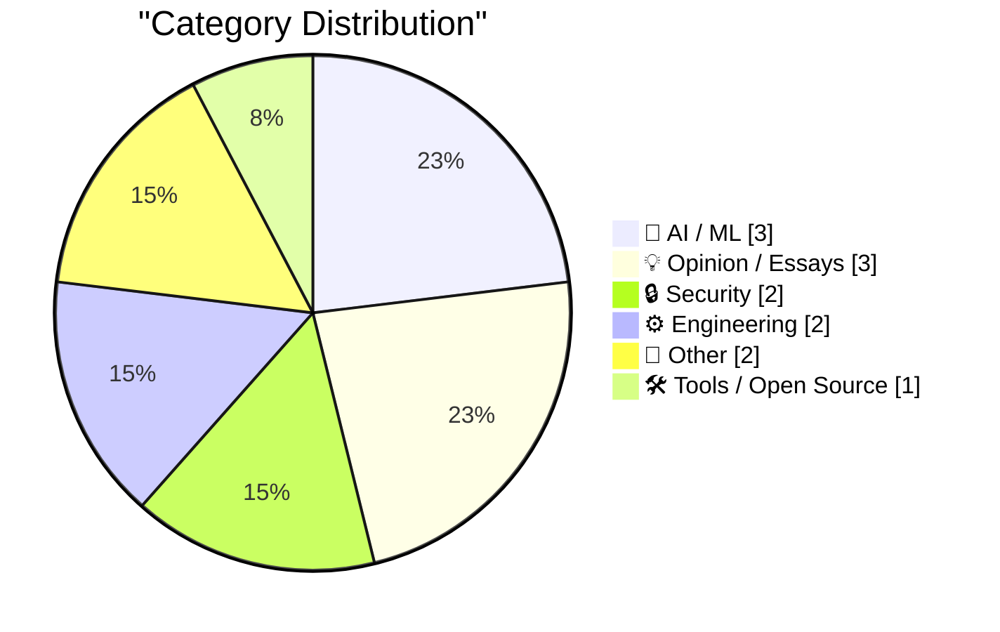
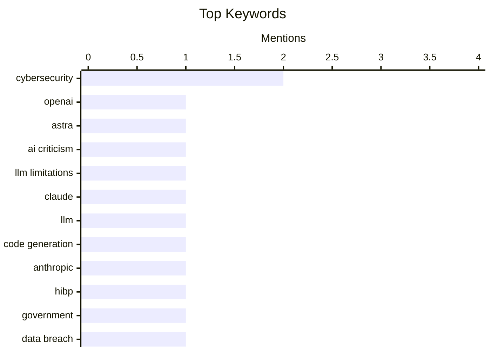

## Today's Highlights
Today's tech news highlights the rapid evolution of artificial intelligence alongside persistent cybersecurity challenges. While new AI models like OpenAI's Astra and innovative platforms such as Agent Fone continue to push technological boundaries, critical discussions emerge regarding their practical application and true capabilities. Developers are actively exploring methods to better direct large language models, even as governments, like Nepal, bolster their defenses against data breaches by adopting key security tools.
---
## Must Read Today
1. **OpenAI’s amazing — but vastly oversold — new model Astra**
[OpenAI’s amazing — but vastly oversold — new model Astra](https://garymarcus.substack.com/p/openais-amazing-but-vastly-oversold) — garymarcus.substack.com · 16h ago · 🤖 AI / ML
> This article critically examines OpenAI's new Astra model, arguing that despite its impressive capabilities, it is "vastly oversold" due to public misconceptions and marketing hype. It identifies "eight or nine misconceptions," suggesting that Astra's real-time interaction and reasoning depth are often exaggerated, and many perceived breakthroughs are either staged or cherry-picked. The author challenges the notion that Astra represents a significant leap towards AGI or truly human-like understanding. The main takeaway is that while Astra is a technical achievement, its public presentation fosters unrealistic expectations about its current intelligence and future potential, warranting a more critical assessment.
💡 **Why read it**: It provides a critical, expert perspective on the limitations and marketing hype surrounding OpenAI's Astra model, encouraging a more nuanced understanding of current AI capabilities.
🏷️ OpenAI, Astra, AI criticism, LLM limitations
2. **Boris Cherny on Trying to Get Claude Code to Rewrite the Claude App**
[Boris Cherny on Trying to Get Claude Code to Rewrite the Claude App](https://www.ycrootaccess.com/p/boris-cherny-building-claude-code) — daringfireball.net · 17h ago · 🤖 AI / ML
> Boris Cherny, head of Claude Code at Anthropic, discusses the challenge of directing large language models like Claude to perform complex software development tasks, specifically attempting to have Claude rewrite its own application. He emphasizes that the key skill is less about prompt engineering and more about structuring hard tasks to enable the AI to verify its work incrementally. This approach involves breaking down complex problems into verifiable sub-tasks, allowing Claude to self-correct and ensure accuracy throughout the development process. The main conclusion is that successful complex AI-driven software development requires designing tasks with built-in verification mechanisms to manage difficulty and ensure reliable outcomes.
💡 **Why read it**: It offers practical insights from an industry expert on advanced prompt engineering techniques for complex AI tasks, focusing on verification for robust software development.
🏷️ Claude, LLM, code generation, Anthropic
3. **Welcoming the Nepalese Government to Have I Been Pwned**
[Welcoming the Nepalese Government to Have I Been Pwned](https://www.troyhunt.com/welcoming-the-nepalese-government-to-have-i-been-pwned/) — troyhunt.com · 7h ago · 🔒 Security
> The article announces the onboarding of the Nepalese government to Have I Been Pwned's (HIBP) free government service to enhance national cybersecurity. Nepal's National Cyber Security Centre (NCSC) is the 47th government entity to join HIBP, gaining access to monitor Nepalese government domains. This integration allows the NCSC to identify email address exposures across government systems by cross-referencing them with HIBP's extensive database of compromised data. The addition of Nepal signifies the continued global expansion of HIBP's free service, empowering more governments to improve their cybersecurity posture by monitoring for data breaches.
💡 **Why read it**: It highlights a significant development in global cybersecurity cooperation, demonstrating how governments are leveraging free services like HIBP to protect national digital assets.
🏷️ HIBP, Government, Cybersecurity, Data Breach
---
## Data Overview
| Sources Scanned | Articles Fetched | Time Window | Selected |
|:---:|:---:|:---:|:---:|
| 88/92 | 2611 -> 13 | 24h | **13** |
### Category Distribution

### Top Keywords

<details>
<summary>Plain Text Keyword Chart (Terminal Friendly)</summary>
```
cybersecurity   │ ████████████████████ 2
openai          │ ██████████░░░░░░░░░░ 1
astra           │ ██████████░░░░░░░░░░ 1
ai criticism    │ ██████████░░░░░░░░░░ 1
llm limitations │ ██████████░░░░░░░░░░ 1
claude          │ ██████████░░░░░░░░░░ 1
llm             │ ██████████░░░░░░░░░░ 1
code generation │ ██████████░░░░░░░░░░ 1
anthropic       │ ██████████░░░░░░░░░░ 1
hibp            │ ██████████░░░░░░░░░░ 1
```
</details>
### Topic Tags
**cybersecurity**(2) · **openai**(1) · **astra**(1) · ai criticism(1) · llm limitations(1) · claude(1) · llm(1) · code generation(1) · anthropic(1) · hibp(1) · government(1) · data breach(1) · link aggregation(1) · drm(1) · hacking(1) · future of work(1) · automation(1) · ai impact(1) · societal implications(1) · condense-json(1)
---
## AI / ML
### 1. OpenAI’s amazing — but vastly oversold — new model Astra
[OpenAI’s amazing — but vastly oversold — new model Astra](https://garymarcus.substack.com/p/openais-amazing-but-vastly-oversold) — **garymarcus.substack.com** · 16h ago · ⭐ 27/30
> This article critically examines OpenAI's new Astra model, arguing that despite its impressive capabilities, it is "vastly oversold" due to public misconceptions and marketing hype. It identifies "eight or nine misconceptions," suggesting that Astra's real-time interaction and reasoning depth are often exaggerated, and many perceived breakthroughs are either staged or cherry-picked. The author challenges the notion that Astra represents a significant leap towards AGI or truly human-like understanding. The main takeaway is that while Astra is a technical achievement, its public presentation fosters unrealistic expectations about its current intelligence and future potential, warranting a more critical assessment.
🏷️ OpenAI, Astra, AI criticism, LLM limitations
---
### 2. Boris Cherny on Trying to Get Claude Code to Rewrite the Claude App
[Boris Cherny on Trying to Get Claude Code to Rewrite the Claude App](https://www.ycrootaccess.com/p/boris-cherny-building-claude-code) — **daringfireball.net** · 17h ago · ⭐ 25/30
> Boris Cherny, head of Claude Code at Anthropic, discusses the challenge of directing large language models like Claude to perform complex software development tasks, specifically attempting to have Claude rewrite its own application. He emphasizes that the key skill is less about prompt engineering and more about structuring hard tasks to enable the AI to verify its work incrementally. This approach involves breaking down complex problems into verifiable sub-tasks, allowing Claude to self-correct and ensure accuracy throughout the development process. The main conclusion is that successful complex AI-driven software development requires designing tasks with built-in verification mechanisms to manage difficulty and ensure reliable outcomes.
🏷️ Claude, LLM, code generation, Anthropic
---
### 3. Agent Fone
[Agent Fone](https://fail.xyz/phone/) — **daringfireball.net** · 16h ago · ⭐ 21/30
> The article introduces "Agent Fone," a new smartphone aiming to revolutionize mobile software development by enabling on-device AI-powered app creation. Described as a "crazily ambitious" device, Agent Fone moves beyond a built-in AI assistant to allow users to create custom software directly on the phone. Users can describe app or widget ideas, answer a few questions, and the phone's AI builds and deploys the application to the home screen. Agent Fone represents a bold vision for a future where smartphones empower users to become creators of personalized software through intuitive AI interaction, bypassing traditional development barriers.
🏷️ smartphone, AI assistant, on-device AI, custom software
---
## Opinion / Essays
### 4. Review: Job-Less Utopia
[Review: Job-Less Utopia](https://borretti.me/article/review-job-less-utopia) — **borretti.me** · 14h ago · ⭐ 23/30
> This article is a review of Marcus Hutter's book, "Job-Less Utopia," which explores the profound implications of advanced AI on human labor and societal structures. The book likely discusses Hutter's vision of a future where AI handles most labor, leading to a "job-less" society, and delves into the economic, social, and philosophical challenges and opportunities arising from such a paradigm shift. It probably advocates for solutions like universal basic income or new societal values to help humanity find purpose beyond traditional work. The review likely assesses Hutter's arguments for a post-labor society, evaluating the feasibility and desirability of his proposed solutions for a future dominated by AI.
🏷️ future of work, automation, AI impact, societal implications
---
### 5. Invisible Problems
[Invisible Problems](https://idiallo.com/blog/invisible-problems) — **idiallo.com** · 7h ago · ⭐ 17/30
> The article uses an online escape room experience to illustrate how "invisible problems" – issues not immediately apparent or shared across a team – can hinder collaborative problem-solving. During a virtual team escape room, participants had to find clues in individual "cells" to solve a collective puzzle, highlighting that each person held a unique, initially "invisible" piece of the solution. The challenge underscored the importance of explicit communication and synthesis of disparate information when individual contributions seem isolated. The anecdote emphasizes that effective teamwork, especially in remote or distributed settings, depends on proactively surfacing and integrating "invisible" individual insights to solve complex, shared problems.
🏷️ teamwork, project management, remote work, problem solving
---
### 6. Weekly Update 515
[Weekly Update 515](https://www.troyhunt.com/weekly-update-515/) — **troyhunt.com** · 13h ago · ⭐ 8/30
> The article snippet discusses Australia's strong coffee culture, asserting its status as a potential "coffee capital of the world." The author notes the widespread obsession with coffee among Australians, particularly in certain regions. This claim is contrasted with Italy's traditional reputation, which the author disputes based on extensive personal experience. The piece suggests that Australia's vibrant coffee scene might surpass other well-known global contenders.
🏷️ Coffee, Personal, Anecdote
---
## Security
### 7. Welcoming the Nepalese Government to Have I Been Pwned
[Welcoming the Nepalese Government to Have I Been Pwned](https://www.troyhunt.com/welcoming-the-nepalese-government-to-have-i-been-pwned/) — **troyhunt.com** · 7h ago · ⭐ 25/30
> The article announces the onboarding of the Nepalese government to Have I Been Pwned's (HIBP) free government service to enhance national cybersecurity. Nepal's National Cyber Security Centre (NCSC) is the 47th government entity to join HIBP, gaining access to monitor Nepalese government domains. This integration allows the NCSC to identify email address exposures across government systems by cross-referencing them with HIBP's extensive database of compromised data. The addition of Nepal signifies the continued global expansion of HIBP's free service, empowering more governments to improve their cybersecurity posture by monitoring for data breaches.
🏷️ HIBP, Government, Cybersecurity, Data Breach
---
### 8. Pluralistic: Dualism (03 Aug 2026)
[Pluralistic: Dualism (03 Aug 2026)](https://pluralistic.net/2026/08/03/andor/) — **pluralistic.net** · 5h ago · ⭐ 23/30
> This article is a "Pluralistic" daily link aggregation, presenting a diverse collection of news and commentary under the theme of "Dualism: Why not both?", often focusing on digital rights and technology policy. It touches on various topics including the UK's "Great Firewall" falling, issues with digital rights management (DRM) and virtual pets, Getty Images' "copyfrauds" of 47,000 photos, and the failure of "Real Names" policies. Other points include net Mexico-US illegal migration being zero and remote-hacking big rigs. The article serves as a curated digest of contemporary issues, emphasizing the complexities and often contradictory nature of modern technological and political landscapes, advocating for a critical perspective on power structures.
🏷️ link aggregation, DRM, hacking, cybersecurity
---
## Engineering
### 9. Book Review: The Field Guide to Understanding 'Human Error' by Sidney Dekker ★★★★☆
[Book Review: The Field Guide to Understanding 'Human Error' by Sidney Dekker ★★★★☆](https://shkspr.mobi/blog/2026/08/book-review-the-field-guide-to-understanding-human-error-by-sidney-dekker/) — **shkspr.mobi** · 2h ago · ⭐ 21/30
> This article reviews Sidney Dekker's "The Field Guide to Understanding 'Human Error'," challenging the conventional notion that "human error" is the root cause of catastrophes. The book argues that "human error" is a misnomer, asserting that most failures stem from systemic issues, misaligned incentives, and unrealistic processes rather than individual blunders. It posits that humans operate within flawed systems, rather than being erratic elements to be protected from. The review praises the book's utility in shifting perspective from individual blame to systemic analysis. The core takeaway is that understanding and preventing failures requires moving beyond blaming individuals to critically examining and redesigning the underlying systems and processes.
🏷️ human error, system design, incident response, safety culture
---
### 10. The Caldera-SCO merger of 2000
[The Caldera-SCO merger of 2000](https://dfarq.homeip.net/the-caldera-sco-merger-of-2000/?utm_source=rss&#038;utm_medium=rss&#038;utm_campaign=the-caldera-sco-merger-of-2000) — **dfarq.homeip.net** · 3h ago · ⭐ 12/30
> The article discusses the merger of Caldera, a second-tier Linux vendor, and SCO, a struggling Unix vendor, which occurred on August 2, 2000. This acquisition, while receiving some press, was largely overlooked by many not deeply engaged with the Linux ecosystem at the turn of the millennium. The merger represented a significant, albeit understated, event in the evolving landscape of open-source and proprietary operating systems. It highlights a pivotal moment where a Linux company absorbed a legacy Unix player, shaping future industry dynamics.
🏷️ Caldera, SCO, Linux, History
---
## Other
### 11. Holonomic functions
[Holonomic functions](https://www.johndcook.com/blog/2026/08/02/holonomic-functions/) — **johndcook.com** · 17h ago · ⭐ 17/30
> The article defines and explains "holonomic functions," a class of functions frequently encountered in mathematical physics. Building on a previous discussion about special functions being solutions to second-order linear differential equations with polynomial coefficients, this article generalizes the concept. Holonomic functions are defined as solutions to linear differential equations of *any* order, provided they have polynomial coefficients. Most special functions, which are prevalent in mathematical physics, fall into this broader category. Understanding holonomic functions provides a unified mathematical framework for a wide array of special functions crucial in various scientific and engineering applications.
🏷️ mathematics, holonomic functions, differential equations
---
### 12. Estimating a cumulative sum
[Estimating a cumulative sum](https://www.johndcook.com/blog/2026/08/02/estimating-a-cumulative-sum/) — **johndcook.com** · 20h ago · ⭐ 17/30
> The article introduces the mathematical challenge of estimating a cumulative sum, focusing on two specific sequences: t(n) and c(n). The sequence t(n) represents the number of unlabeled rooted trees with n nodes, while c(n) is its cumulative sum. Notably, c(n) also corresponds to the number of constraints on an n-step Runge-Kutta method, indicating its importance in numerical analysis. The post sets the stage for exploring methods to estimate these complex sums, highlighting their dual relevance in combinatorics and computational mathematics.
🏷️ combinatorics, rooted trees, Runge-Kutta, numerical methods
---
## Tools / Open Source
### 13. condense-json 1.0
[condense-json 1.0](https://simonwillison.net/2026/Aug/2/condense-json/#atom-everything) — **simonwillison.net** · 15h ago · ⭐ 21/30
> The article announces the release of `condense-json` version 1.0, a Python library designed to compact JSON data. Simon Willison released this version after a year and a half of development, incorporating "sensible and non-disruptive fixes." The library's primary function is to reduce the size of JSON output, making it more compact and efficient for uses like logging, data transfer, or display in constrained interfaces, as demonstrated by an example of condensing nested JSON structures. `condense-json` 1.0 provides a stable and mature tool for developers needing to optimize JSON data representation by making it more concise.
🏷️ condense-json, JSON, utility, library
---
*Generated at 2026-08-03 14:01 | Scanned 88 sources -> 2611 articles -> selected 13*
*Based on the [Hacker News Popularity Contest 2025](https://refactoringenglish.com/tools/hn-popularity/) RSS source list recommended by [Andrej Karpathy](https://x.com/karpathy)*
*Produced by Dongdianr AI. Follow the same-name WeChat public account for more AI practical tips 💡*
