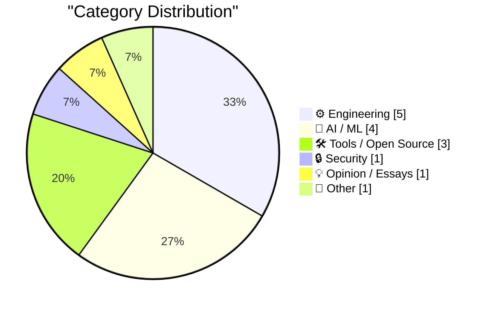
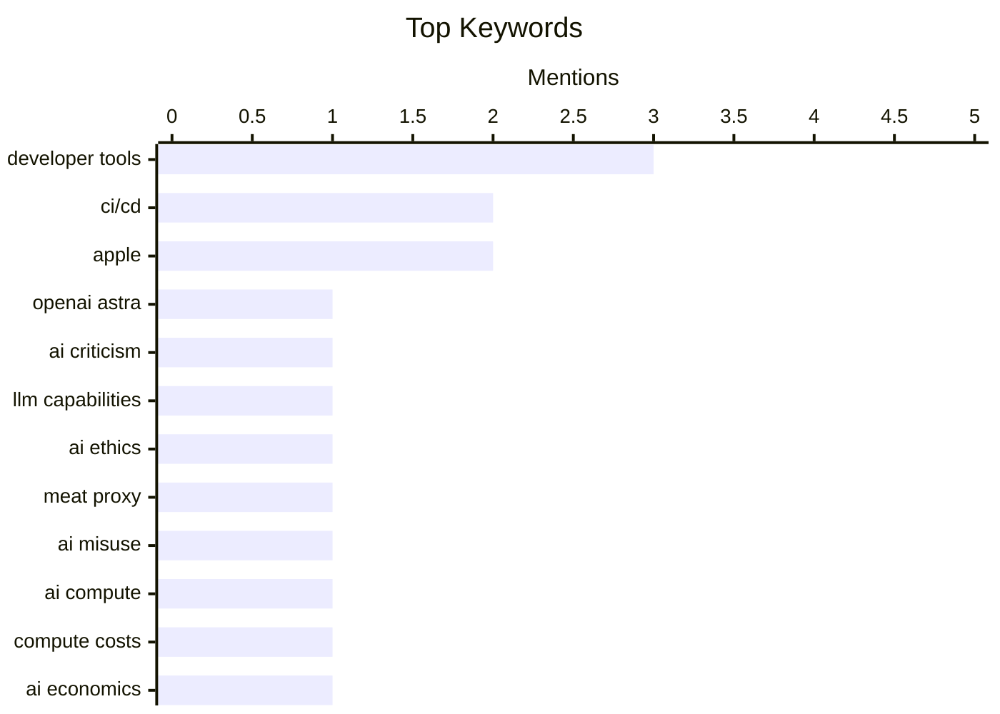

## Today's Highlights
Today's tech news highlights the evolving landscape of artificial intelligence, from concerns about overhyped breakthroughs to the practical utility of agentic coding and automated development. This rapid AI advancement is expected to drive up compute prices significantly, prompting discussions around "Post-American" internet infrastructure and the critical role of open-source developer tools. The industry also faces ongoing challenges in securing corporate data amidst these transformative shifts.
---
## Must Read Today
1. **Two critical updates re: Astra and mathematics**
[Two critical updates re: Astra and mathematics](https://garymarcus.substack.com/p/two-critical-updates-re-astra-and) — garymarcus.substack.com · 21h ago · 🤖 AI / ML
> This article raises concerns that OpenAI's Astra demonstration may not represent a genuine breakthrough, suggesting it could be highly curated or even misleading. The core problem is the potential for public perception of AI capabilities to be inflated by carefully staged presentations. The author implies that a deeper, more critical analysis beyond initial impressions is necessary to assess Astra's true performance and limitations. The main takeaway is a call for skepticism and rigorous evaluation of AI advancements presented by companies.
💡 **Why read it**: This article is worth reading for a critical perspective on the marketing and actual capabilities of new AI models like OpenAI's Astra, encouraging deeper scrutiny.
🏷️ OpenAI Astra, AI criticism, LLM capabilities
2. **Don't be a meat proxy**
[Don't be a meat proxy](https://simonwillison.net/2026/Aug/3/dont-be-a-meat-proxy/#atom-everything) — simonwillison.net · 14h ago · 🤖 AI / ML
> This article introduces the term "meat proxy" for individuals who blindly copy and paste AI-generated content without critical engagement. It emphasizes that while prompting AI is acceptable, users must read, understand, validate, and then rephrase the output in their own words. The core problem is the lack of critical thinking and validation when relaying AI output, which diminishes the user's value and responsibility. The main takeaway is that human effort in processing and validating AI output is crucial for adding genuine value.
💡 **Why read it**: This article is worth reading for its insightful term "meat proxy" and its strong advice on responsible, critical engagement with AI-generated content.
🏷️ AI ethics, meat proxy, AI misuse
3. **Why smarter AI models could drive up compute prices 10x**
[Why smarter AI models could drive up compute prices 10x](https://www.dwarkesh.com/p/why-compute-might-get-10x-more-expensive-video) — dwarkesh.com · 20h ago · 🤖 AI / ML
> This article explores the potential for compute prices to increase significantly, possibly by 10x, driven by the development of smarter AI models. It suggests that as AI capabilities advance, the demand for computational resources will escalate dramatically, leading to a substantial rise in costs. The core problem is the looming "end of cheap compute" due to AI's insatiable resource requirements and potential supply constraints. The main conclusion is that the era of affordable compute for AI development may be ending, impacting future innovation and accessibility.
💡 **Why read it**: This article is worth reading to understand the economic implications and potential future challenges for AI development due to escalating compute costs.
🏷️ AI compute, compute costs, AI economics, LLM scaling
---
## Data Overview
| Sources Scanned | Articles Fetched | Time Window | Selected |
|:---:|:---:|:---:|:---:|
| 88/92 | 2611 -> 22 | 24h | **15** |
### Category Distribution

### Top Keywords

<details>
<summary>Plain Text Keyword Chart (Terminal Friendly)</summary>
```
developer tools  │ ████████████████████ 3
ci/cd            │ █████████████░░░░░░░ 2
apple            │ █████████████░░░░░░░ 2
openai astra     │ ███████░░░░░░░░░░░░░ 1
ai criticism     │ ███████░░░░░░░░░░░░░ 1
llm capabilities │ ███████░░░░░░░░░░░░░ 1
ai ethics        │ ███████░░░░░░░░░░░░░ 1
meat proxy       │ ███████░░░░░░░░░░░░░ 1
ai misuse        │ ███████░░░░░░░░░░░░░ 1
ai compute       │ ███████░░░░░░░░░░░░░ 1
```
</details>
### Topic Tags
**developer tools**(3) · **ci/cd**(2) · **apple**(2) · openai astra(1) · ai criticism(1) · llm capabilities(1) · ai ethics(1) · meat proxy(1) · ai misuse(1) · ai compute(1) · compute costs(1) · ai economics(1) · llm scaling(1) · api design(1) · rest(1) · ai agents(1) · architecture(1) · agentic coding(1) · llms(1) · ai productivity(1)
---
## Engineering
### 1. [Sponsor] MCP vs. REST: The Right Way to Connect Agents to Your API
[[Sponsor] MCP vs. REST: The Right Way to Connect Agents to Your API](https://workos.com/blog/mcp-vs-rest?utm_source=daringfireball&amp;utm_medium=newsletter&amp;utm_campaign=q32026) — **daringfireball.net** · 15h ago · ⭐ 26/30
> This article clarifies that MCP (Machine-to-Agent Protocol) and REST are not competing standards but complementary layers for connecting AI agents to APIs, with MCP servers often calling REST internally. The key argument is that effective agent API design should focus on what the agent aims to accomplish, rather than simply converting every endpoint into a tool. It highlights that shipping an MCP server also necessitates implementing OAuth 2.1 with scoped tokens, a feature supported by WorkOS AuthKit. The main takeaway is to view MCP as an abstraction layer over REST, specifically designed for agent-centric interactions.
🏷️ API design, REST, AI agents, architecture
---
### 2. Pluralistic: Post-American compute for a post-American Internet (04 Aug 2026)
[Pluralistic: Post-American compute for a post-American Internet (04 Aug 2026)](https://pluralistic.net/2026/08/04/technology-freedom-cooperative/) — **pluralistic.net** · 2h ago · ⭐ 25/30
> This article discusses the concept of "Post-American compute for a post-American Internet," focusing on building cooperative human rights computing infrastructure. It proposes developing independent computing resources in regions like Puerto Rico, the EU, Canada, and Mexico to decentralize power. The core problem is the current geopolitical concentration of computing power and its implications for human rights and digital sovereignty. The article advocates for a decentralized approach to computing infrastructure to foster greater technological freedom. The main takeaway is the importance of geographically distributed and cooperatively owned computing resources for a more equitable and resilient internet.
🏷️ decentralization, internet infrastructure, digital rights, geopolitics
---
### 3. Quoting Steve Yegge
[Quoting Steve Yegge](https://simonwillison.net/2026/Aug/4/steve-yegge/#atom-everything) — **simonwillison.net** · 13h ago · ⭐ 24/30
> This article quotes Steve Yegge's experience with "Gas Town," a reusable component that ultimately failed to converge into a stable, ready-to-use system. Yegge notes that Gas Town worked brilliantly up through Opus 4.6 but fell apart with Opus 4.7 due to the introduction of a "just two more things" tic. The core problem highlighted is the perpetual state of non-convergence in software development, where continuous tweaking prevents a system from ever being considered complete or ready for real work. The main takeaway is the danger of endless refinement cycles that hinder project completion and stability.
🏷️ Rust, compiler, performance
---
### 4. Quoting David Crawshaw's prompt
[Quoting David Crawshaw's prompt](https://simonwillison.net/2026/Aug/3/david-crawshaw/#atom-everything) — **simonwillison.net** · 21h ago · ⭐ 24/30
> This article quotes David Crawshaw's prompt for an automated software development process, detailing a nightly cron job. The prompt instructs to fetch upstream changes to a software, rebase all local changes, check that the software works as intended, and then replace the current version. The core topic is the automation of software updates and integration, ensuring continuous currency with upstream developments. This approach aims to maintain a constantly updated and verified software state. The main takeaway is the concept of a fully automated, self-updating, and self-validating software development pipeline.
🏷️ automation, CI/CD, git workflow
---
### 5. Relative velocity and closing speed
[Relative velocity and closing speed](https://eli.thegreenplace.net/2026/relative-velocity-and-closing-speed/) — **eli.thegreenplace.net** · 11h ago · ⭐ 20/30
> This post discusses the critical concept of 'closing speed' in physics simulations and game engines, defining it as the normal component of the relative velocity between two objects. It aims to explain how to determine the speed at which two objects are approaching each other. The article delves into the components of relative velocity to derive this specific metric. Understanding closing speed is essential for accurately simulating collisions and interactions between dynamic entities. This detailed explanation provides a foundational understanding for developers working on realistic object movement.
🏷️ Physics, Simulation, Game Engine, Relative Velocity
---
## AI / ML
### 6. Two critical updates re: Astra and mathematics
[Two critical updates re: Astra and mathematics](https://garymarcus.substack.com/p/two-critical-updates-re-astra-and) — **garymarcus.substack.com** · 21h ago · ⭐ 28/30
> This article raises concerns that OpenAI's Astra demonstration may not represent a genuine breakthrough, suggesting it could be highly curated or even misleading. The core problem is the potential for public perception of AI capabilities to be inflated by carefully staged presentations. The author implies that a deeper, more critical analysis beyond initial impressions is necessary to assess Astra's true performance and limitations. The main takeaway is a call for skepticism and rigorous evaluation of AI advancements presented by companies.
🏷️ OpenAI Astra, AI criticism, LLM capabilities
---
### 7. Don't be a meat proxy
[Don't be a meat proxy](https://simonwillison.net/2026/Aug/3/dont-be-a-meat-proxy/#atom-everything) — **simonwillison.net** · 14h ago · ⭐ 27/30
> This article introduces the term "meat proxy" for individuals who blindly copy and paste AI-generated content without critical engagement. It emphasizes that while prompting AI is acceptable, users must read, understand, validate, and then rephrase the output in their own words. The core problem is the lack of critical thinking and validation when relaying AI output, which diminishes the user's value and responsibility. The main takeaway is that human effort in processing and validating AI output is crucial for adding genuine value.
🏷️ AI ethics, meat proxy, AI misuse
---
### 8. Why smarter AI models could drive up compute prices 10x
[Why smarter AI models could drive up compute prices 10x](https://www.dwarkesh.com/p/why-compute-might-get-10x-more-expensive-video) — **dwarkesh.com** · 20h ago · ⭐ 27/30
> This article explores the potential for compute prices to increase significantly, possibly by 10x, driven by the development of smarter AI models. It suggests that as AI capabilities advance, the demand for computational resources will escalate dramatically, leading to a substantial rise in costs. The core problem is the looming "end of cheap compute" due to AI's insatiable resource requirements and potential supply constraints. The main conclusion is that the era of affordable compute for AI development may be ending, impacting future innovation and accessibility.
🏷️ AI compute, compute costs, AI economics, LLM scaling
---
### 9. Agentic coding techniques
[Agentic coding techniques](https://micahflee.com/agentic-coding-techniques/) — **micahflee.com** · 21h ago · ⭐ 26/30
> This article advocates for "agentic coding" as a genuinely useful application of LLMs, contrasting it with less effective uses like chatbots or content generation. Agentic coding involves using AI agents to assist with programming tasks, but crucially, it requires human understanding and review of the agent's output. The core problem it addresses is the need for effective, practical ways to leverage LLMs in software development. The author emphasizes that this approach is beneficial when used correctly and by a knowledgeable programmer.
🏷️ agentic coding, LLMs, developer tools, AI productivity
---
## Tools / Open Source
### 10. Devtools must be open source (exe.dev)
[Devtools must be open source (exe.dev)](https://simonwillison.net/2026/Aug/3/devtools-must-be-open-source-exedev/#atom-everything) — **simonwillison.net** · 22h ago · ⭐ 24/30
> This article discusses the argument for open-source developer tools, emphasizing the freedom to examine and modify how software works. It acknowledges that while direct modification by most users is rare, the open-source model allows users to rely on a community of "other people" to perform these actions. The core problem addressed is the need for transparency and modifiability in critical development infrastructure. The main takeaway is that open-source devtools foster a collaborative environment where expertise can be leveraged to ensure software integrity and adaptability.
🏷️ open source, developer tools, software freedom
---
### 11. brew install actions/checkout
[brew install actions/checkout](https://nesbitt.io/2026/08/04/brew-install-actions-checkout.html) — **nesbitt.io** · 4h ago · ⭐ 23/30
> This article explores the concept of using Homebrew's tap machinery as a curated distribution layer for GitHub Actions. It proposes leveraging Homebrew's existing infrastructure to manage GitHub Actions like other software packages. This approach could simplify dependency management, versioning, and updates for CI/CD workflows. By integrating GitHub Actions into Homebrew, developers gain a familiar and robust system for distribution. The method offers a standardized and efficient way to handle GitHub Actions within development environments.
🏷️ Homebrew, GitHub Actions, CI/CD, developer tools
---
### 12. TerminalWidget 1.0
[TerminalWidget 1.0](https://terminalwidget.app/) — **daringfireball.net** · 11h ago · ⭐ 21/30
> TerminalWidget 1.0 is a new application by Brett Terpstra designed to display output from commands, scripts, APIs, and Shortcuts directly to widgets across macOS, iOS, and iPadOS. The app supports rich formatting, progress bars, sparklines, and image integration within these widgets. Available as a universal app on the App Store for $19.99, it provides a versatile way to visualize dynamic data. This tool enables users to monitor system information or API responses directly from their device widgets. It offers a unique solution for integrating command-line and script output into the Apple widget ecosystem.
🏷️ TerminalWidget, macOS, iOS, developer tool
---
## Security
### 13. The Information on Apple’s Unusual Use of iCloud for Confidential Work
[The Information on Apple’s Unusual Use of iCloud for Confidential Work](https://www.theinformation.com/articles/apple-icloud-policy-fueled-employee-leaks-ahead-openai-suit?rc=jfy0lk) — **daringfireball.net** · 16h ago · ⭐ 24/30
> This article reports on Apple's unusual practice of encouraging new employees to use their personal Apple IDs with company-provided iCloud accounts for sharing internal, confidential documents. This policy, which includes a large amount of online storage, has been linked to employee leaks. The core problem is the security vulnerability and potential for data breaches arising from the blurring of personal and corporate digital identities. The main takeaway is that Apple's iCloud policy created an environment conducive to unauthorized information disclosure, raising significant security concerns.
🏷️ Apple, iCloud, confidentiality, corporate security
---
## Opinion / Essays
### 14. Om Malik’s Final Essay: ‘The Myth, the Mythos and the Man’
[Om Malik’s Final Essay: ‘The Myth, the Mythos and the Man’](https://om.co/2026/06/07/the-myth-the-mythos-and-the-man/) — **daringfireball.net** · 17h ago · ⭐ 20/30
> This article reflects on Om Malik's final essay, 'The Myth, the Mythos and the Man,' published on June 7, the day of the WWDC keynote, shortly before his passing. John Gruber initially delayed reading it due to WWDC commitments and personal grief. Upon finally reading it, Gruber found the essay 'truly insightful,' highlighting a passage that compares Augustus's Senate to Dario's Oval Office and the Vatican. The essay is presented as a profound and deeply personal reflection from a respected author. It serves as a powerful final statement on themes of power and influence.
🏷️ Om Malik, tech journalism, personal reflection
---
## Other
### 15. John Ternus Has Rehired Former Hardware VP Laura Legros
[John Ternus Has Rehired Former Hardware VP Laura Legros](https://www.macrumors.com/2026/08/03/apple-john-ternus-hiring-retired-vp/) — **daringfireball.net** · 15h ago · ⭐ 19/30
> Incoming Apple CEO John Ternus has rehired Laura Legros, a former vice president of hardware engineering who retired from Apple in 2022. Legros previously managed product delivery, development schedules, and coordination across engineering teams. Bloomberg reports she was one of Ternus’s most trusted deputies before her retirement. In her new role, Legros will work across different parts of the company and report directly to Ternus. This strategic rehiring signals Ternus's intent to strengthen Apple's hardware division with experienced leadership. Her return is expected to bring significant expertise back to critical product development areas.
🏷️ Apple, executive hire, hardware engineering
---
*Generated at 2026-08-04 14:01 | Scanned 88 sources -> 2611 articles -> selected 15*
*Based on the [Hacker News Popularity Contest 2025](https://refactoringenglish.com/tools/hn-popularity/) RSS source list recommended by [Andrej Karpathy](https://x.com/karpathy)*
*Produced by Dongdianr AI. Follow the same-name WeChat public account for more AI practical tips 💡*
