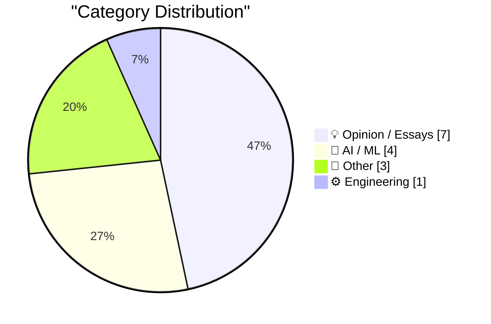
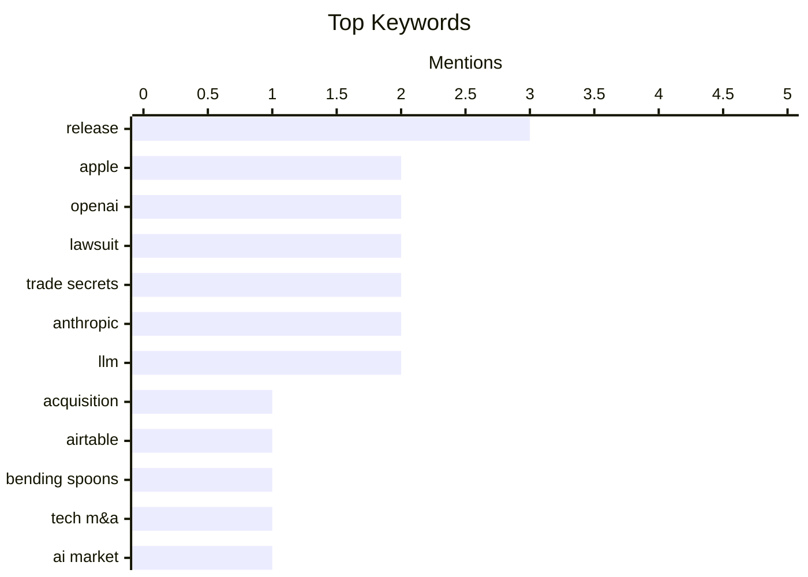

## Today's Highlights
The AI sector is buzzing with a high-stakes legal clash as Apple seeks an injunction against OpenAI in a trade secrets dispute, to which OpenAI has strongly responded. This intense competition unfolds alongside rapid advancements in AI development, including major updates to LLM tools and the introduction of new omni-modal generative systems. Simultaneously, market activity remains robust with significant acquisitions, even as discussions emerge questioning a potential "AI demand bubble."
---
## Must Read Today
1. **Apple Seeks Preliminary Injunction Against OpenAI in Trade Secrets Case**
[Apple Seeks Preliminary Injunction Against OpenAI in Trade Secrets Case](https://www.reuters.com/legal/litigation/apple-seeks-preliminary-injunction-against-openai-trade-secrets-case-2026-08-04/) — daringfireball.net · 22h ago · 💡 Opinion / Essays
> Apple has requested a U.S. judge issue a preliminary injunction against two former employees and OpenAI, aiming to prevent them from accessing or disclosing alleged confidential information in an ongoing trade secrets case. Concurrently, Apple filed a motion for expedited discovery to obtain documents related to the defendants' alleged access to its proprietary information. This legal action seeks to protect Apple's trade secrets during the litigation process. The core takeaway is Apple's aggressive stance in safeguarding its intellectual property against former employees and OpenAI.
💡 **Why read it**: This article is worth reading to understand the latest legal developments in Apple's trade secrets lawsuit against OpenAI and its former employees.
🏷️ Apple, OpenAI, lawsuit, trade secrets
2. **★ OpenAI Responds to Apple’s Lawsuit and Motion for Preliminary Injunction: ‘Apple Is Getting This Wrong’**
[★ OpenAI Responds to Apple’s Lawsuit and Motion for Preliminary Injunction: ‘Apple Is Getting This Wrong’](https://daringfireball.net/2026/08/openai_apple_is_getting_this_wrong) — daringfireball.net · 15h ago · 💡 Opinion / Essays
> OpenAI has publicly responded to Apple's lawsuit and motion for a preliminary injunction, asserting that "Apple Is Getting This Wrong." This response, unusually delivered via a blog post, indicates OpenAI's disagreement with Apple's allegations regarding trade secret misappropriation by former employees. The company's public statement suggests a strong defense against Apple's claims and the requested injunction. The article highlights the unconventional communication strategy employed by OpenAI in a high-stakes legal battle.
💡 **Why read it**: This article is worth reading to understand OpenAI's immediate public counter-narrative to Apple's trade secret lawsuit and its implications for the legal dispute.
🏷️ OpenAI, Apple, lawsuit, trade secrets
3. **Bending Spoons to Buy Airtable for $1.3 Billion**
[Bending Spoons to Buy Airtable for $1.3 Billion](https://techcrunch.com/2026/08/04/bending-spoons-to-buy-airtable-for-1-28b/) — daringfireball.net · 22h ago · 📝 Other
> Bending Spoons, recently public, has agreed to acquire the spreadsheet and database startup Airtable for $1.28 billion in cash. Airtable, founded in 2013, had previously raised over $1.4 billion and reached a peak valuation of over $11 billion in 2021. However, its valuation on secondary markets had dropped to $4 billion earlier this year. This acquisition marks Bending Spoons' first major move since its IPO and reflects a significant valuation adjustment for Airtable.
💡 **Why read it**: This article is worth reading to understand a major acquisition in the tech industry, highlighting a significant valuation shift for a well-known startup.
🏷️ Acquisition, Airtable, Bending Spoons, tech M&A
---
## Data Overview
| Sources Scanned | Articles Fetched | Time Window | Selected |
|:---:|:---:|:---:|:---:|
| 86/92 | 2574 -> 15 | 24h | **15** |
### Category Distribution

### Top Keywords

<details>
<summary>Plain Text Keyword Chart (Terminal Friendly)</summary>
```
release        │ ████████████████████ 3
apple          │ █████████████░░░░░░░ 2
openai         │ █████████████░░░░░░░ 2
lawsuit        │ █████████████░░░░░░░ 2
trade secrets  │ █████████████░░░░░░░ 2
anthropic      │ █████████████░░░░░░░ 2
llm            │ █████████████░░░░░░░ 2
acquisition    │ ███████░░░░░░░░░░░░░ 1
airtable       │ ███████░░░░░░░░░░░░░ 1
bending spoons │ ███████░░░░░░░░░░░░░ 1
```
</details>
### Topic Tags
**release**(3) · **apple**(2) · **openai**(2) · lawsuit(2) · trade secrets(2) · anthropic(2) · llm(2) · acquisition(1) · airtable(1) · bending spoons(1) · tech m&a(1) · ai market(1) · demand bubble(1) · nvidia(1) · reasoning traces(1) · server-side tools(1) · google(1) · scams(1) · internet(1) · platform issues(1)
---
## Opinion / Essays
### 1. Apple Seeks Preliminary Injunction Against OpenAI in Trade Secrets Case
[Apple Seeks Preliminary Injunction Against OpenAI in Trade Secrets Case](https://www.reuters.com/legal/litigation/apple-seeks-preliminary-injunction-against-openai-trade-secrets-case-2026-08-04/) — **daringfireball.net** · 22h ago · ⭐ 27/30
> Apple has requested a U.S. judge issue a preliminary injunction against two former employees and OpenAI, aiming to prevent them from accessing or disclosing alleged confidential information in an ongoing trade secrets case. Concurrently, Apple filed a motion for expedited discovery to obtain documents related to the defendants' alleged access to its proprietary information. This legal action seeks to protect Apple's trade secrets during the litigation process. The core takeaway is Apple's aggressive stance in safeguarding its intellectual property against former employees and OpenAI.
🏷️ Apple, OpenAI, lawsuit, trade secrets
---
### 2. ★ OpenAI Responds to Apple’s Lawsuit and Motion for Preliminary Injunction: ‘Apple Is Getting This Wrong’
[★ OpenAI Responds to Apple’s Lawsuit and Motion for Preliminary Injunction: ‘Apple Is Getting This Wrong’](https://daringfireball.net/2026/08/openai_apple_is_getting_this_wrong) — **daringfireball.net** · 15h ago · ⭐ 26/30
> OpenAI has publicly responded to Apple's lawsuit and motion for a preliminary injunction, asserting that "Apple Is Getting This Wrong." This response, unusually delivered via a blog post, indicates OpenAI's disagreement with Apple's allegations regarding trade secret misappropriation by former employees. The company's public statement suggests a strong defense against Apple's claims and the requested injunction. The article highlights the unconventional communication strategy employed by OpenAI in a high-stakes legal battle.
🏷️ OpenAI, Apple, lawsuit, trade secrets
---
### 3. The AI Demand Bubble
[The AI Demand Bubble](https://www.wheresyoured.at/the-ai-demand-bubble/) — **wheresyoured.at** · 22h ago · ⭐ 25/30
> This article discusses the potential "AI Demand Bubble," suggesting an inflated perception of AI's current market value and capabilities. While the provided snippet is brief, the core topic likely revolves around the sustainability of current AI valuations and investment trends. The author offers a premium newsletter for detailed analyses of companies like NVIDIA and Anthropic, implying a critical look at the underlying economics. The main takeaway is a cautionary perspective on the current hype surrounding AI.
🏷️ AI market, demand bubble, NVIDIA, Anthropic
---
### 4. Pluralistic: Google is a scammer's paradise (05 Aug 2026)
[Pluralistic: Google is a scammer's paradise (05 Aug 2026)](https://pluralistic.net/2026/08/05/absentee-landlord/) — **pluralistic.net** · 3h ago · ⭐ 23/30
> This article, titled "Google is a scammer's paradise," critiques Google's role as an "absentee landlord" of the internet, implying a lack of effective moderation against scams and malicious content. The author likely argues that Google's platforms inadvertently facilitate fraudulent activities due to insufficient oversight. The piece suggests that Google's dominant position comes with a responsibility it is not adequately fulfilling. The core takeaway is a strong criticism of Google's platform governance and its impact on user safety.
🏷️ Google, scams, internet, platform issues
---
### 5. Yours Truly on TBPN Yesterday
[Yours Truly on TBPN Yesterday](https://www.youtube.com/live/ruL8Q-TsbbI?t=4085) — **daringfireball.net** · 19h ago · ⭐ 12/30
> This brief article reflects on the author's experience as a guest on the TBPN show. The author initially anticipated not enjoying the guesting experience on TBPN. However, contrary to expectations, they found the show quite enjoyable. The piece serves as a personal endorsement of the TBPN show from the perspective of a guest. It concludes by expressing the author's unexpected positive sentiment towards the program.
🏷️ Podcast, John Gruber, TBPN
---
### 6. Committing to creativity
[Committing to creativity](https://herman.bearblog.dev/creativity/) — **herman.bearblog.dev** · 2h ago · ⭐ 11/30
> This article aims to explore the intricate relationship between commitment and motivation in the context of creative endeavors. It intends to delve into the 'fine line' that separates these two crucial elements for sustained creative output. The piece will likely discuss how initial motivation might spark creativity, but it is commitment that ensures its continuity and development. It seeks to provide insights into balancing these forces to foster consistent creative work. The core takeaway is understanding how to navigate this dynamic for effective creative pursuit.
🏷️ creativity, motivation, commitment
---
### 7. Meta: 7,000
[Meta: 7,000](https://lcamtuf.substack.com/p/meta-7000) — **lcamtuf.substack.com** · 19h ago · ⭐ 3/30
> This article announces a significant subscriber milestone for the author's publication. The publication has successfully surpassed 7,000 email subscribers. This reported figure specifically accounts for email subscribers and explicitly excludes an unquantified number of RSS readers. The author expresses satisfaction with this growth, acknowledging the expanding reach of their content. The main takeaway is the celebration of a substantial community milestone for the publication.
🏷️ substack, subscribers, personal update
---
## AI / ML
### 8. New release of LLM adds support for reasoning traces, OpenAI Responses, server-side tools, and smarter logging
[New release of LLM adds support for reasoning traces, OpenAI Responses, server-side tools, and smarter logging](https://simonwillison.net/2026/Aug/4/new-release-of-llm/#atom-everything) — **simonwillison.net** · 14h ago · ⭐ 24/30
> LLM 0.32 has been released, marking the most significant update since the project's inception, introducing several key features. This version includes support for visible reasoning traces, server-side provider tools, and redesigned content-addressable SQLite logs for improved data management. Additionally, it leverages new features from the OpenAI Responses API and updates the `llm-anthropic` plugin. These enhancements aim to provide more transparency in model operations, expand tool integration, and refine logging capabilities.
🏷️ LLM, release, reasoning traces, server-side tools
---
### 9. PipeNetwork/minimax-h3-mlx
[PipeNetwork/minimax-h3-mlx](https://simonwillison.net/2026/Aug/4/minimax-h3-mlx/#atom-everything) — **simonwillison.net** · 18h ago · ⭐ 21/30
> MiniMax has released MiniMax-H3, an "omni-modal generative system" capable of accepting text, images, audio, and video inputs to generate up to 15-second video clips with accompanying audio. The `PipeNetwork/minimax-h3-mlx` Python package ports this system to MLX, enabling its execution on Apple Silicon hardware. This development allows users with Apple Silicon devices to leverage MiniMax-H3's advanced multi-modal generation capabilities locally. The core takeaway is the availability of a powerful multi-modal AI model optimized for Apple Silicon.
🏷️ Generative AI, omni-modal, MiniMax-H3, MLX
---
### 10. llm 0.32
[llm 0.32](https://simonwillison.net/2026/Aug/4/llm/#atom-everything) — **simonwillison.net** · 20h ago · ⭐ 21/30
> This article announces the release of LLM 0.32, a significant update to the LLM project. It directs readers to a detailed blog post for comprehensive information about the new features. The release likely includes enhancements related to reasoning traces, server-side tools, and logging, as indicated by the linked detailed post. The core takeaway is the availability of a new, feature-rich version of the LLM tool.
🏷️ LLM, release, changelog
---
### 11. llm-anthropic 0.26
[llm-anthropic 0.26](https://simonwillison.net/2026/Aug/4/llm-anthropic/#atom-everything) — **simonwillison.net** · 16h ago · ⭐ 20/30
> The `llm-anthropic` plugin has been updated to version 0.26, incorporating new features enabled by the LLM 0.32 release. This update specifically adds support for new Anthropic models: `claude-fable-5`, `claude-sonnet-5`, and `claude-opus-5`. These additions expand the range of advanced language models available through the `llm-anthropic` plugin. The core takeaway is the integration of new, powerful Anthropic models into the LLM ecosystem.
🏷️ LLM plugin, Anthropic, Claude, release
---
## Other
### 12. Bending Spoons to Buy Airtable for $1.3 Billion
[Bending Spoons to Buy Airtable for $1.3 Billion](https://techcrunch.com/2026/08/04/bending-spoons-to-buy-airtable-for-1-28b/) — **daringfireball.net** · 22h ago · ⭐ 25/30
> Bending Spoons, recently public, has agreed to acquire the spreadsheet and database startup Airtable for $1.28 billion in cash. Airtable, founded in 2013, had previously raised over $1.4 billion and reached a peak valuation of over $11 billion in 2021. However, its valuation on secondary markets had dropped to $4 billion earlier this year. This acquisition marks Bending Spoons' first major move since its IPO and reflects a significant valuation adjustment for Airtable.
🏷️ Acquisition, Airtable, Bending Spoons, tech M&A
---
### 13. Gadget Review: T2 Max plug-in Thermal Camera ★★★⯪☆
[Gadget Review: T2 Max plug-in Thermal Camera ★★★⯪☆](https://shkspr.mobi/blog/2026/08/gadget-review-t2-max-plug-in-thermal-camera/) — **shkspr.mobi** · 2h ago · ⭐ 16/30
> This article reviews the T2 Max plug-in thermal camera from Thermal Master, contrasting it with a previous larger touchscreen model. The T2 Max is a compact, chunky camera designed to connect to a phone's USB-C port. Its USB-C connector is specifically noted as being long enough to ensure a secure connection even when the phone is in a case. The review focuses on the camera's physical design, portability, and practical connectivity features for mobile use. It highlights the device's suitability as a portable thermal imaging solution for smartphone users.
🏷️ Thermal camera, gadget review, USB-C, T2 Max
---
### 14. Ebay’s 1995 debut
[Ebay’s 1995 debut](https://dfarq.homeip.net/ebays-1995-debut/?utm_source=rss&#038;utm_medium=rss&#038;utm_campaign=ebays-1995-debut) — **dfarq.homeip.net** · 3h ago · ⭐ 12/30
> This article clarifies the historical debut and early naming conventions of the e-commerce platform, eBay. The eBay domain name was registered on August 4, 1995, marking 31 years since its inception. However, the actual website launched almost a month later, on September 3, 1995. Notably, the platform originally debuted under the name "Auctionweb" before it was rebranded to eBay. The article distinguishes between the domain registration date and the site's operational launch under its initial name.
🏷️ eBay, history, Auctionweb, 1995
---
## Engineering
### 15. Purely functional digital circuit simulator (SICP 3.3)
[Purely functional digital circuit simulator (SICP 3.3)](https://entropicthoughts.com/sicp-3-3-pure-digital-circuit-simulator) — **entropicthoughts.com** · 16h ago · ⭐ 19/30
> This article explores the implementation of a purely functional digital circuit simulator, contrasting it with the object-oriented, mutable state approach presented in SICP Chapter 3.3. The author aims to demonstrate how to achieve circuit simulation without relying on hidden mutable state or message-passing, which SICP uses, even involving a mutable global variable. This approach highlights the benefits of functional programming for managing complexity and state in simulations. The core takeaway is a demonstration of building a digital circuit simulator using purely functional principles as an alternative to traditional mutable state designs.
🏷️ SICP, functional programming, circuit simulator
---
*Generated at 2026-08-05 14:05 | Scanned 86 sources -> 2574 articles -> selected 15*
*Based on the [Hacker News Popularity Contest 2025](https://refactoringenglish.com/tools/hn-popularity/) RSS source list recommended by [Andrej Karpathy](https://x.com/karpathy)*
*Produced by Dongdianr AI. Follow the same-name WeChat public account for more AI practical tips 💡*
