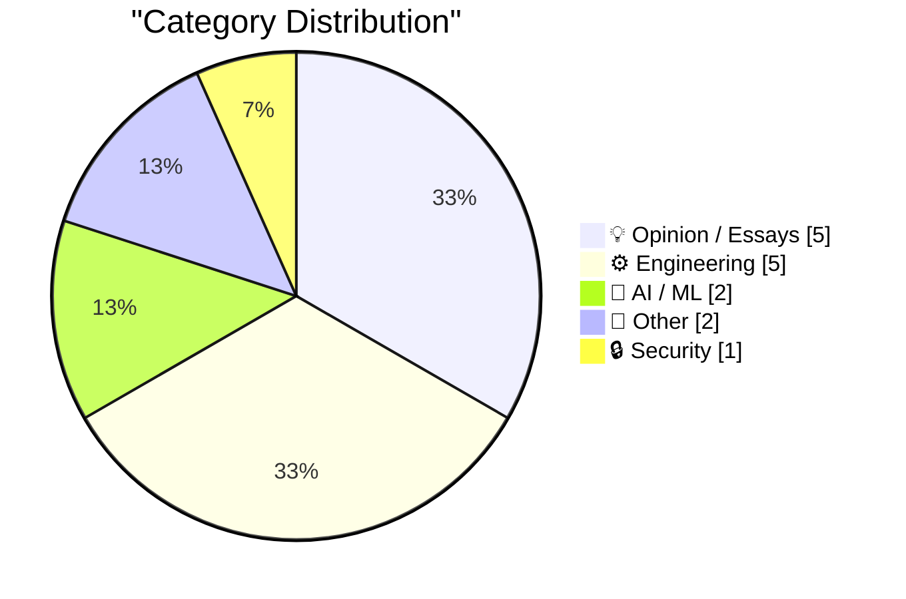
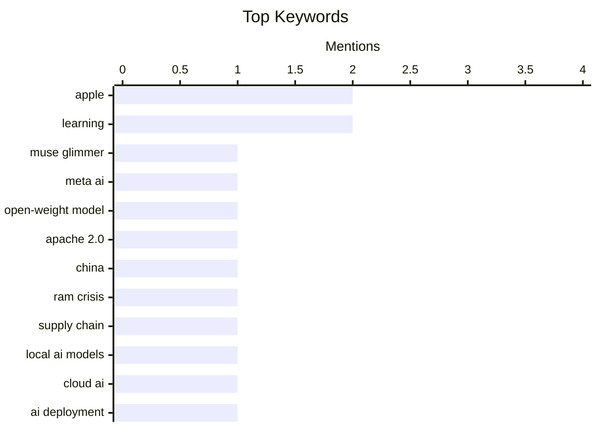

## Today's Highlights
Today's tech news highlights a dynamic shift in artificial intelligence, marked by Meta's release of a new open-weight model and ongoing discussions about the viability of local AI. Concurrently, Apple is pushing boundaries in immersive entertainment with live sports broadcasts on Vision Pro, even as it grapples with geopolitical supply chain pressures for critical components. The broader industry is also grappling with crucial distinctions between open-source and open-weight models, alongside warnings about concerning financial practices.
---
## Must Read Today
1. **Introducing Muse Glimmer**
[Introducing Muse Glimmer](https://simonwillison.net/2026/Aug/10/introducing-muse-glimmer/#atom-everything) — simonwillison.net · 14h ago · 🤖 AI / ML
> Meta has released Muse Glimmer, a new 30B open-weight AI model under a permissive Apache 2.0 license, marking a return to more open licensing. This model is specifically optimized for end-to-end agentic task completion, robust tool use, and handling long context windows up to 256k tokens. These capabilities make it particularly suitable for local deployment and complex, multi-step AI tasks. Muse Glimmer represents Meta's renewed commitment to advancing open-weight models with strong agentic capabilities.
💡 **Why read it**: It announces a significant new open-weight AI model from Meta with a permissive license and advanced agentic capabilities, relevant for AI developers and researchers.
🏷️ Muse Glimmer, Meta AI, open-weight model, Apache 2.0
2. **The NYT and WSJ on Apple, China, and the RAM Crisis**
[The NYT and WSJ on Apple, China, and the RAM Crisis](https://www.nytimes.com/2026/08/10/technology/memory-chip-shortage-ai.html?unlocked_article_code=1.4VA.49f7.Qj8S541DkkOz) — daringfireball.net · 22h ago · 📝 Other
> Apple and other consumer electronics companies are reportedly pushing for permission to purchase memory chips from China amidst a global chip shortage exacerbated by AI demand. Apple previously engaged in talks with Yangtze Memory Technologies Corporation (YMTC) in 2022 but ceased efforts due to U.S. pressure and restrictions. The current severe memory chip shortage has led to recent price increases and is compelling major tech firms to explore all possible supply chain avenues. This situation highlights the complex interplay between global supply chain pressures, geopolitical restrictions, and the strategic sourcing decisions of major technology companies.
💡 **Why read it**: It highlights the complex interplay between global supply chain shortages, geopolitical tensions, and the strategic sourcing decisions of major tech companies like Apple.
🏷️ Apple, China, RAM crisis, supply chain
3. **No, local models will not win**
[No, local models will not win](https://seangoedecke.com/local-models-will-not-win/) — seangoedecke.com · 14h ago · 💡 Opinion / Essays
> This article challenges the popular notion that local AI models will eventually dominate inference, arguing that datacenter-based AI will remain the primary mode of deployment. The author contends that local models are inherently too weak for widespread use, citing limitations in model size, computational power, and the difficulty of running large, state-of-the-art models on consumer hardware. Even with continuous hardware improvements, the most powerful and cutting-edge models will always push the limits of datacenter infrastructure first. Therefore, the majority of AI inference will continue to occur in centralized datacenters due to the superior power and scale required for advanced AI.
💡 **Why read it**: It provides a contrarian perspective on the future of AI model deployment, challenging the common narrative about the inevitable rise of local AI.
🏷️ Local AI models, cloud AI, AI deployment
---
## Data Overview
| Sources Scanned | Articles Fetched | Time Window | Selected |
|:---:|:---:|:---:|:---:|
| 88/92 | 2612 -> 23 | 24h | **15** |
### Category Distribution

### Top Keywords

<details>
<summary>Plain Text Keyword Chart (Terminal Friendly)</summary>
```
apple             │ ████████████████████ 2
learning          │ ████████████████████ 2
muse glimmer      │ ██████████░░░░░░░░░░ 1
meta ai           │ ██████████░░░░░░░░░░ 1
open-weight model │ ██████████░░░░░░░░░░ 1
apache 2.0        │ ██████████░░░░░░░░░░ 1
china             │ ██████████░░░░░░░░░░ 1
ram crisis        │ ██████████░░░░░░░░░░ 1
supply chain      │ ██████████░░░░░░░░░░ 1
local ai models   │ ██████████░░░░░░░░░░ 1
```
</details>
### Topic Tags
**apple**(2) · **learning**(2) · **muse glimmer**(1) · meta ai(1) · open-weight model(1) · apache 2.0(1) · china(1) · ram crisis(1) · supply chain(1) · local ai models(1) · cloud ai(1) · ai deployment(1) · open source(1) · open weight(1) · ai models(1) · nyt(1) · cryptography(1) · manual encryption(1) · security theory(1) · package managers(1)
---
## Opinion / Essays
### 1. No, local models will not win
[No, local models will not win](https://seangoedecke.com/local-models-will-not-win/) — **seangoedecke.com** · 14h ago · ⭐ 24/30
> This article challenges the popular notion that local AI models will eventually dominate inference, arguing that datacenter-based AI will remain the primary mode of deployment. The author contends that local models are inherently too weak for widespread use, citing limitations in model size, computational power, and the difficulty of running large, state-of-the-art models on consumer hardware. Even with continuous hardware improvements, the most powerful and cutting-edge models will always push the limits of datacenter infrastructure first. Therefore, the majority of AI inference will continue to occur in centralized datacenters due to the superior power and scale required for advanced AI.
🏷️ Local AI models, cloud AI, AI deployment
---
### 2. Michael Tsai on My Retraction of the Astrology/Astronomy App Store Rejection Story
[Michael Tsai on My Retraction of the Astrology/Astronomy App Store Rejection Story](https://mjtsai.com/blog/2026/08/07/dark-hours-rejected-from-the-app-store/) — **daringfireball.net** · 17h ago · ⭐ 20/30
> Michael Tsai has retracted a previously circulated story about an App Store rejection based on Apple conflating astrology and astronomy, expressing regret for its dissemination. The story, involving developer Godier, was initially deemed believable due to a known history of "crazy rejections" and Godier's reputation. However, it was later found to be false, prompting concern that such unverified narratives could undermine the credibility of legitimate developer complaints about App Review. The incident underscores the critical importance of verifying information, even when it aligns with perceived patterns, to maintain credibility in discussions about App Store policies and developer experiences.
🏷️ App Store, App Review, Michael Tsai
---
### 3. BREAKING: Circular financing reaches new heights
[BREAKING: Circular financing reaches new heights](https://garymarcus.substack.com/p/breaking-circular-financing-reaches) — **garymarcus.substack.com** · 31m ago · ⭐ 20/30
> The article warns about an alarming increase in circular financing practices, where funds are recycled within a system, potentially creating an illusion of growth and inflating valuations. This typically involves entities investing in each other or using internal loans to fund various parts of a system, rather than securing genuine external capital. Such practices can lead to unsustainable bubbles and significant financial risk, as the perceived capital is not backed by real external value. The escalating prevalence of circular financing signals a potentially dangerous financial environment where valuations may be artificially inflated, posing a risk of collapse if the cycle breaks.
🏷️ Circular Financing, Economy, Financial Risk
---
### 4. ‘The Problem With Vibe-Coded Flattery’
[‘The Problem With Vibe-Coded Flattery’](https://tedium.co/2026/08/09/vibe-coding-insincerity/) — **daringfireball.net** · 21h ago · ⭐ 19/30
> This article addresses the growing issue of insincere, AI-generated flattery and manufactured "passion" in emails, particularly concerning pitches for new apps. The author observes a significant increase in app-related emails, but notes that a "fair chunk" are "clearly written by an AI chatbot," making the expressed passion for the product untrustworthy. This trend raises concerns about the authenticity of communication when the sender's true enthusiasm cannot be verified. The proliferation of AI-generated content in professional communications undermines trust and makes it difficult to discern genuine enthusiasm from automated flattery.
🏷️ Authenticity, flattery, communication
---
### 5. Pluralistic: Surveillance vs guillotines (11 Aug 2026)
[Pluralistic: Surveillance vs guillotines (11 Aug 2026)](https://pluralistic.net/2026/08/11/tragedy-of-the-commoners/) — **pluralistic.net** · 2h ago · ⭐ 18/30
> This entry is a typical "Pluralistic" daily link aggregation by Cory Doctorow, covering a diverse range of topics including surveillance, digital rights, and intellectual property issues. The post touches on themes like "Surveillance vs guillotines" and "Object permanence," referencing historical and contemporary examples such as DeCSS, the Warhol Worm, and the RIAA's actions against a grieving family. It also lists the author's upcoming and recent appearances, alongside his latest books. The article serves as a curated digest of current events and ongoing discussions at the intersection of technology, society, and intellectual property, reflecting Cory Doctorow's critical perspective.
🏷️ Surveillance, digital rights, tech policy
---
## Engineering
### 6. Shared Code Between Package Managers
[Shared Code Between Package Managers](https://nesbitt.io/2026/08/11/package-manager-library-reuse.html) — **nesbitt.io** · 4h ago · ⭐ 21/30
> This article investigates the extent of code reuse among twenty different package managers, aiming to identify shared libraries and common architectural patterns. The analysis would likely involve examining dependencies and common components across a diverse set of package management systems. Understanding which functionalities are frequently shared can highlight best practices, potential for standardization, and common challenges in package management development. This insight could foster collaborative development and lead to more robust and efficient package management ecosystems.
🏷️ package managers, code reuse, dependencies, software ecosystems
---
### 7. Learning from historical mistakes
[Learning from historical mistakes](https://www.johndcook.com/blog/2026/08/10/learning-from-historical-mistakes/) — **johndcook.com** · 23h ago · ⭐ 20/30
> This article emphasizes the profound value of learning from historical errors in scientific and technical literature, drawing inspiration from Donald Knuth's advice in TAOCP Volume 4A. Knuth encourages modern readers to identify and correct mistakes in older works, not to boast, but to understand the evolution of knowledge and prevent repeating past errors. This process fosters a deeper understanding of the subject matter and the challenges faced by earlier researchers. Engaging with historical errors in technical fields is presented as a valuable pedagogical exercise that promotes critical thinking, improves understanding, and contributes to the ongoing refinement of knowledge.
🏷️ Knuth, Historical Errors, Learning, Engineering Practice
---
### 8. Inverse differential equations
[Inverse differential equations](https://www.johndcook.com/blog/2026/08/10/inverse-differential-equations/) — **johndcook.com** · 23h ago · ⭐ 20/30
> This article explores the concept of "inverse differential equations," a less common problem where one infers the governing differential equation from a given set of functions or observed solutions. In contrast to typical science and engineering problems that solve differential equations derived from physical laws like Newton's, this approach starts with the behavior and works backward. This method is more frequently encountered in pure mathematics. The piece highlights a fundamental duality in mathematical modeling: both deriving solutions from equations and inferring equations from solutions are valid and important perspectives.
🏷️ Differential Equations, Inverse Problems, Mathematics, Modeling
---
### 9. What’s New in iOS 27 Beta 5
[What’s New in iOS 27 Beta 5](https://9to5mac.com/2026/08/10/heres-whats-new-with-ios-27-beta-5/) — **daringfireball.net** · 16h ago · ⭐ 19/30
> This article details the new features and changes introduced in iOS 27 Beta 5, as reported by Zac Hall at 9to5Mac. Key updates include visual tweaks to some app icons, with the Siri app receiving a notable redesign. More significantly, existing American and British Siri speaking voices now feature Pace and Expressivity adjustment sliders, offering users greater customization. The release cycle for OS 27 betas also saw Beta 4 lasting 22 days, a week longer than usual. iOS 27 Beta 5 brings minor UI refinements and significant new voice customization options for Siri, alongside an extended beta testing period.
🏷️ iOS 27, Beta features, Siri, Apple
---
### 10. A noob learns FFT
[A noob learns FFT](https://entropicthoughts.com/fft) — **entropicthoughts.com** · 16h ago · ⭐ 19/30
> This article documents a beginner's journey into understanding and applying the Fast Fourier Transform (FFT) for time-frequency transformations. The author, new to the topic, embarks on learning the fundamental concepts of FFT. The initial practical example provided involves analyzing a three-second recording of a single 5 Hz sine wave, sampled at a rate of 100 Hz. This setup serves as a concrete starting point for demonstrating FFT's application. This piece serves as an introductory guide for those new to FFT, demonstrating its fundamental concepts through a simple, concrete example.
🏷️ FFT, signal processing, algorithm, learning
---
## AI / ML
### 11. Introducing Muse Glimmer
[Introducing Muse Glimmer](https://simonwillison.net/2026/Aug/10/introducing-muse-glimmer/#atom-everything) — **simonwillison.net** · 14h ago · ⭐ 26/30
> Meta has released Muse Glimmer, a new 30B open-weight AI model under a permissive Apache 2.0 license, marking a return to more open licensing. This model is specifically optimized for end-to-end agentic task completion, robust tool use, and handling long context windows up to 256k tokens. These capabilities make it particularly suitable for local deployment and complex, multi-step AI tasks. Muse Glimmer represents Meta's renewed commitment to advancing open-weight models with strong agentic capabilities.
🏷️ Muse Glimmer, Meta AI, open-weight model, Apache 2.0
---
### 12. Open-source is NOT the same as open-weight
[Open-source is NOT the same as open-weight](https://garymarcus.substack.com/p/open-source-is-not-the-same-as-open) — **garymarcus.substack.com** · 22h ago · ⭐ 24/30
> The article clarifies the crucial distinction between "open-source" and "open-weight" in the context of AI models, criticizing media outlets for conflating these terms. "Open-source" refers to software with publicly available and modifiable source code, encompassing the entire development process. In contrast, "open-weight" specifically means that the trained model parameters (weights) are released, but not necessarily the full training code, data, or methodology. Many AI models are open-weight but lack the full transparency and modifiability associated with traditional open-source software. Accurate terminology is essential for understanding the true implications of AI model releases regarding transparency, control, and community contribution.
🏷️ Open Source, Open Weight, AI Models, NYT
---
## Other
### 13. The NYT and WSJ on Apple, China, and the RAM Crisis
[The NYT and WSJ on Apple, China, and the RAM Crisis](https://www.nytimes.com/2026/08/10/technology/memory-chip-shortage-ai.html?unlocked_article_code=1.4VA.49f7.Qj8S541DkkOz) — **daringfireball.net** · 22h ago · ⭐ 25/30
> Apple and other consumer electronics companies are reportedly pushing for permission to purchase memory chips from China amidst a global chip shortage exacerbated by AI demand. Apple previously engaged in talks with Yangtze Memory Technologies Corporation (YMTC) in 2022 but ceased efforts due to U.S. pressure and restrictions. The current severe memory chip shortage has led to recent price increases and is compelling major tech firms to explore all possible supply chain avenues. This situation highlights the complex interplay between global supply chain pressures, geopolitical restrictions, and the strategic sourcing decisions of major technology companies.
🏷️ Apple, China, RAM crisis, supply chain
---
### 14. ‘Friday Night Baseball’ Will Start Broadcasting Games Live, in Apple Immersive, on Vision Pro
[‘Friday Night Baseball’ Will Start Broadcasting Games Live, in Apple Immersive, on Vision Pro](https://www.apple.com/newsroom/2026/08/apple-mlb-announce-september-friday-night-baseball-schedule/) — **daringfireball.net** · 17h ago · ⭐ 20/30
> Apple and MLB are launching live "Friday Night Baseball" broadcasts in Apple Immersive on Apple Vision Pro, starting August 28. Viewers with Vision Pro will experience games, including the iconic Red Sox vs. Yankees rivalry, using 3D video recorded in 8K with a 180-degree field of view. This technology offers unique camera angles that place viewers directly in the game, providing an immersive experience of at-bats, dugout celebrations, and close plays. This initiative marks a significant step in sports broadcasting, leveraging Apple Vision Pro's immersive capabilities to deliver a novel and highly engaging live viewing experience for baseball fans.
🏷️ Apple Vision Pro, Immersive video, 3D video
---
## Security
### 15. Manually unbreakable cryptography
[Manually unbreakable cryptography](https://www.johndcook.com/blog/2026/08/11/manually-unbreakable-cryptography/) — **johndcook.com** · 1h ago · ⭐ 21/30
> The article explores the practical limitations of implementing modern, computationally secure cryptography in a pre-computer era, focusing on the user's manual effort rather than the attacker's. While algorithms like RSA would be theoretically unbreakable by attackers without computers, their manual execution by users would be prohibitively complex and time-consuming. The computational burden of encryption and decryption, even for seemingly simple operations, would render such systems unusable without automated tools. This highlights that the 'unbreakability' of cryptography is not solely about an attacker's resources but also about the feasibility of manual implementation for legitimate users.
🏷️ Cryptography, Manual Encryption, Security Theory
---
*Generated at 2026-08-11 14:01 | Scanned 88 sources -> 2612 articles -> selected 15*
*Based on the [Hacker News Popularity Contest 2025](https://refactoringenglish.com/tools/hn-popularity/) RSS source list recommended by [Andrej Karpathy](https://x.com/karpathy)*
*Produced by Dongdianr AI. Follow the same-name WeChat public account for more AI practical tips 💡*
