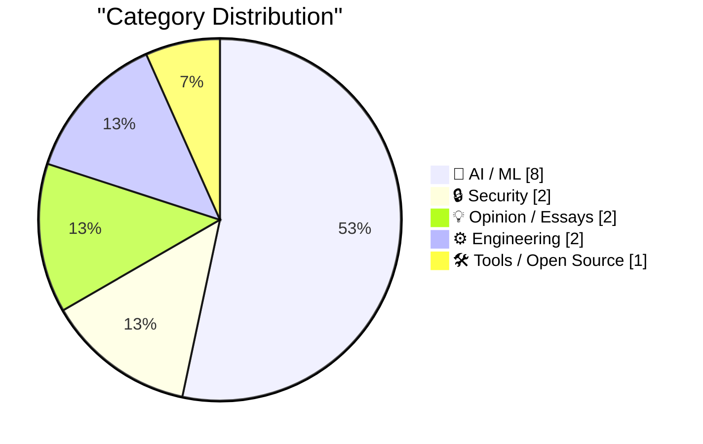
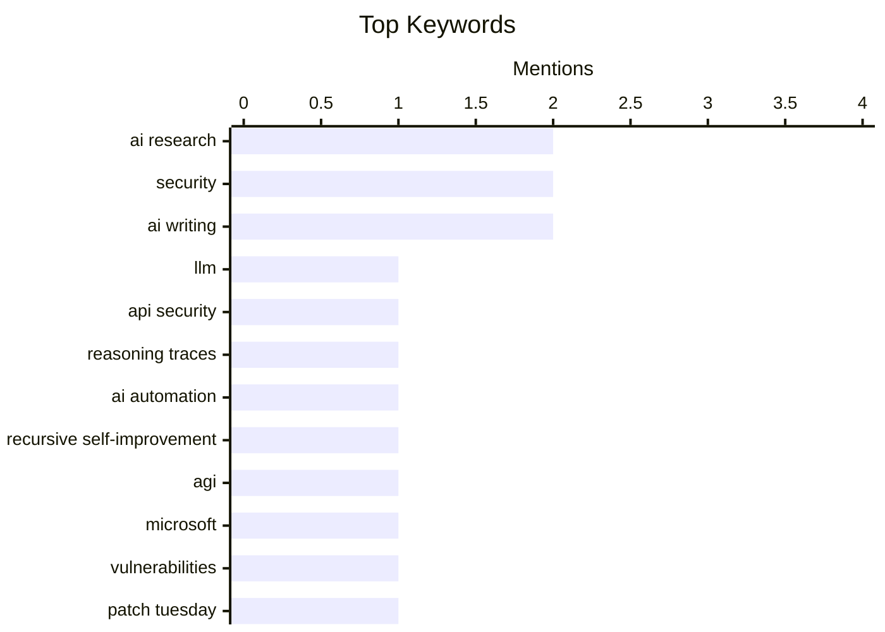

## Today's Highlights
Artificial intelligence continues its rapid evolution, sparking discussions on its future ability to automate research and its pervasive impact on content creation. However, this progress is shadowed by significant challenges, including vulnerabilities like stolen reasoning traces, the risk of model collapse, and ongoing struggles with AI transparency and reliably detecting AI-generated text. Beyond AI, general cybersecurity remains a critical focus, exemplified by Microsoft patching nearly 400 security holes.
---
## Must Read Today
1. **Stealing Reasoning Traces from Proprietary LLM APIs**
[Stealing Reasoning Traces from Proprietary LLM APIs](https://simonwillison.net/2026/Aug/11/stealing-reasoning-traces/#atom-everything) — simonwillison.net · 15h ago · 🤖 AI / ML
> Stealing Reasoning Traces from Proprietary LLM APIs
🏷️ LLM, API security, Reasoning traces, AI research
2. **Ryan Greenblatt – What happens once AI can automate AI research?**
[Ryan Greenblatt – What happens once AI can automate AI research?](https://www.dwarkesh.com/p/ryan-greenblatt) — dwarkesh.com · 21h ago · 🤖 AI / ML
> Ryan Greenblatt – What happens once AI can automate AI research?
🏷️ AI research, AI automation, Recursive self-improvement, AGI
3. **Microsoft Plugs Nearly 400 Security Holes**
[Microsoft Plugs Nearly 400 Security Holes](https://krebsonsecurity.com/2026/08/microsoft-plugs-nearly-400-security-holes/) — krebsonsecurity.com · 16h ago · 🔒 Security
> Microsoft Plugs Nearly 400 Security Holes
🏷️ Microsoft, Security, Vulnerabilities, Patch Tuesday
---
## Data Overview
| Sources Scanned | Articles Fetched | Time Window | Selected |
|:---:|:---:|:---:|:---:|
| 87/92 | 2587 -> 26 | 24h | **15** |
### Category Distribution

### Top Keywords

<details>
<summary>Plain Text Keyword Chart (Terminal Friendly)</summary>
```
ai research                │ ████████████████████ 2
security                   │ ████████████████████ 2
ai writing                 │ ████████████████████ 2
llm                        │ ██████████░░░░░░░░░░ 1
api security               │ ██████████░░░░░░░░░░ 1
reasoning traces           │ ██████████░░░░░░░░░░ 1
ai automation              │ ██████████░░░░░░░░░░ 1
recursive self-improvement │ ██████████░░░░░░░░░░ 1
agi                        │ ██████████░░░░░░░░░░ 1
microsoft                  │ ██████████░░░░░░░░░░ 1
```
</details>
### Topic Tags
**ai research**(2) · **security**(2) · **ai writing**(2) · llm(1) · api security(1) · reasoning traces(1) · ai automation(1) · recursive self-improvement(1) · agi(1) · microsoft(1) · vulnerabilities(1) · patch tuesday(1) · model collapse(1) · ai training(1) · synthetic data(1) · cory doctorow(1) · opentelemetry(1) · observability(1) · otel(1) · vendor sdks(1)
---
## AI / ML
### 1. Stealing Reasoning Traces from Proprietary LLM APIs
[Stealing Reasoning Traces from Proprietary LLM APIs](https://simonwillison.net/2026/Aug/11/stealing-reasoning-traces/#atom-everything) — **simonwillison.net** · 15h ago · ⭐ 30/30
> Stealing Reasoning Traces from Proprietary LLM APIs
🏷️ LLM, API security, Reasoning traces, AI research
---
### 2. Ryan Greenblatt – What happens once AI can automate AI research?
[Ryan Greenblatt – What happens once AI can automate AI research?](https://www.dwarkesh.com/p/ryan-greenblatt) — **dwarkesh.com** · 21h ago · ⭐ 30/30
> Ryan Greenblatt – What happens once AI can automate AI research?
🏷️ AI research, AI automation, Recursive self-improvement, AGI
---
### 3. Pluralistic: Model collapse (12 Aug 2026)
[Pluralistic: Model collapse (12 Aug 2026)](https://pluralistic.net/2026/08/12/insurance-value-of-biodiversity/) — **pluralistic.net** · 5h ago · ⭐ 27/30
> Pluralistic: Model collapse (12 Aug 2026)
🏷️ Model collapse, AI training, Synthetic data, Cory Doctorow
---
### 4. Anthropic Posts ‘How Claude Marks AI-Generated Content’ Without Explaining How Claude Marks AI-Generated Content
[Anthropic Posts ‘How Claude Marks AI-Generated Content’ Without Explaining How Claude Marks AI-Generated Content](https://support.claude.com/en/articles/16266773-how-claude-marks-ai-generated-content) — **daringfireball.net** · 20h ago · ⭐ 26/30
> Anthropic Posts ‘How Claude Marks AI-Generated Content’ Without Explaining How Claude Marks AI-Generated Content
🏷️ Anthropic, AI content, EU AI Act, Transparency
---
### 5. There are no lossless transformations of natural-language text
[There are no lossless transformations of natural-language text](https://simonwillison.net/2026/Aug/11/there-are-no-lossless-transformations-of-natural-language-text/#atom-everything) — **simonwillison.net** · 14h ago · ⭐ 24/30
> There are no lossless transformations of natural-language text
🏷️ AI writing, LLM policy, Natural language, Engineer ethics
---
### 6. Mark Zuckerberg Posts 6,500-Word AI Essay
[Mark Zuckerberg Posts 6,500-Word AI Essay](https://www.meta.com/thefutureisforeveryone/) — **daringfireball.net** · 18h ago · ⭐ 24/30
> Mark Zuckerberg Posts 6,500-Word AI Essay
🏷️ Zuckerberg, AI vision, Meta, AI strategy
---
### 7. The Fruits of AI
[The Fruits of AI](https://blog.jim-nielsen.com/2026/fruit-of-ai/) — **blog.jim-nielsen.com** · 19h ago · ⭐ 24/30
> The Fruits of AI
🏷️ AI, Claude, Trust, Reliability
---
### 8. The Economist: ‘How to Spot AI Writing’
[The Economist: ‘How to Spot AI Writing’](https://www.economist.com/culture/2026/07/30/how-to-spot-ai-writing?giftId=NzBlNTc2OGItMDgxNS00N2EzLWE4NmUtZDgzZmE4Y2FkM2Mw) — **daringfireball.net** · 16h ago · ⭐ 22/30
> The Economist: ‘How to Spot AI Writing’
🏷️ AI writing, AI detection, Generative AI, Economist
---
## Security
### 9. Microsoft Plugs Nearly 400 Security Holes
[Microsoft Plugs Nearly 400 Security Holes](https://krebsonsecurity.com/2026/08/microsoft-plugs-nearly-400-security-holes/) — **krebsonsecurity.com** · 16h ago · ⭐ 29/30
> Microsoft Plugs Nearly 400 Security Holes
🏷️ Microsoft, Security, Vulnerabilities, Patch Tuesday
---
### 10. Weekly Update 516: Live From Vietnam
[Weekly Update 516: Live From Vietnam](https://www.troyhunt.com/weekly-update-516/) — **troyhunt.com** · 5h ago · ⭐ 22/30
> This weekly update from Troy Hunt, recorded live from Vietnam, highlights a significant issue with Brinks Home's FAQ section. Despite minor technical difficulties during recording, such as wind noise, connectivity flakiness, and YouTube lip-sync issues, the main focus is on the poor quality or inaccuracies found within Brinks Home's self-written FAQ. The author expresses surprise at how a company could produce such a flawed internal document. The article implicitly critiques the importance of accurate and well-maintained documentation, even for internal or customer-facing FAQs.
🏷️ Security, Weekly Update, Brinks Home, Observations
---
## Opinion / Essays
### 11. The Talk Show: ‘Getting the Snack Right’
[The Talk Show: ‘Getting the Snack Right’](https://daringfireball.net/thetalkshow/2026/08/10/ep-454) — **daringfireball.net** · 19h ago · ⭐ 22/30
> This podcast episode discusses several current Apple-related technology and legal topics with guest Chance Miller. Key discussions include the development progress of iOS 27, the experience of watching live baseball on Vision Pro, and the ongoing "RAM crisis." The episode also covers Apple's trade secret lawsuit against OpenAI and "io," and the implications of the EU's Digital Markets Act (DMA). It provides a broad overview of significant developments and challenges facing Apple across its software, hardware, and legal/regulatory fronts.
🏷️ Apple, OpenAI lawsuit, EU DMA, Tech news
---
### 12. Netflix Has Peaked
[Netflix Has Peaked](https://sharptext.net/2026/is-netflix-washed-now/) — **daringfireball.net** · 19h ago · ⭐ 19/30
> This article discusses whether Netflix has peaked, analyzing its slowing growth despite its massive global reach. Andrew Sharp, writing at Sharp Text, observes heightened anxiety around Netflix after its earnings report, but clarifies he is not predicting imminent doom. Netflix's content reaches a staggering 85% of American viewers and boasts 325 million global subscribers. The slowing growth is attributed to the "law of large numbers," indicating market saturation rather than failure. While Netflix's subscriber growth is decelerating due to its extensive market penetration, its dominant position and reach remain substantial.
🏷️ Netflix, Business, Streaming, Tech industry
---
## Engineering
### 13. Cryptic but consistent
[Cryptic but consistent](https://www.johndcook.com/blog/2026/08/12/cryptic-but-consistent/) — **johndcook.com** · 44m ago · ⭐ 21/30
> This article discusses the difficulty new command-line users face in retaining obscure but useful bash shell shortcuts like `!$`, which refers to the last word of the previous command. The author explains that such facts often don't stick because beginners lack immediate application for them and find them cryptic. However, the consistency of these shortcuts makes them powerful once their utility is understood and practiced. Effective learning of command-line tools therefore requires practical application and understanding the underlying consistency, rather than rote memorization of cryptic commands.
🏷️ Bash, Command line, Shell, Shortcuts
---
### 14. Dogs and fat tails
[Dogs and fat tails](https://www.johndcook.com/blog/2026/08/11/dogs-and-fat-tails/) — **johndcook.com** · 23h ago · ⭐ 21/30
> This article explores unexpected patterns in a dataset of dog names in NYC, linking it to the statistical concept of "fat tails." Prompted by a Hacker News post on boat names, the author analyzed NYC dog name data, finding the most popular names were surprising. This observation likely relates to "fat tails," where extreme values or less common occurrences have a higher probability than in a normal distribution, suggesting a wide variety of unique names beyond the common ones. The analysis highlights how real-world datasets, even for seemingly simple topics like dog names, can exhibit statistical properties like fat tails, challenging initial expectations.
🏷️ Fat tails, Statistics, Data analysis, Probability
---
## Tools / Open Source
### 15. OTel Isn't Going Well (And I Made A Spreadsheet About It)
[OTel Isn't Going Well (And I Made A Spreadsheet About It)](https://matduggan.com/otel-isnt-going-well-and-i-made-a-spreadsheet-about-it/) — **matduggan.com** · 2h ago · ⭐ 27/30
> OTel Isn't Going Well (And I Made A Spreadsheet About It)
🏷️ OpenTelemetry, Observability, OTel, Vendor SDKs
---
*Generated at 2026-08-12 14:01 | Scanned 87 sources -> 2587 articles -> selected 15*
*Based on the [Hacker News Popularity Contest 2025](https://refactoringenglish.com/tools/hn-popularity/) RSS source list recommended by [Andrej Karpathy](https://x.com/karpathy)*
*Produced by Dongdianr AI. Follow the same-name WeChat public account for more AI practical tips 💡*
