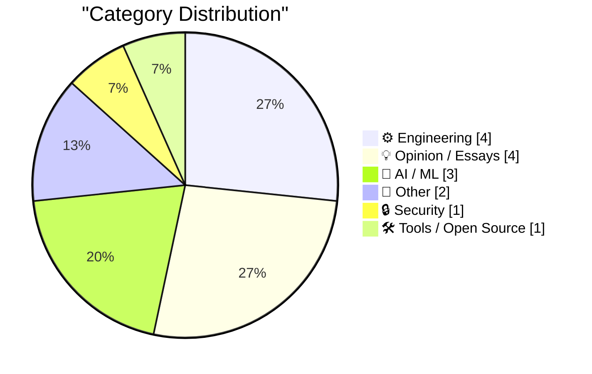
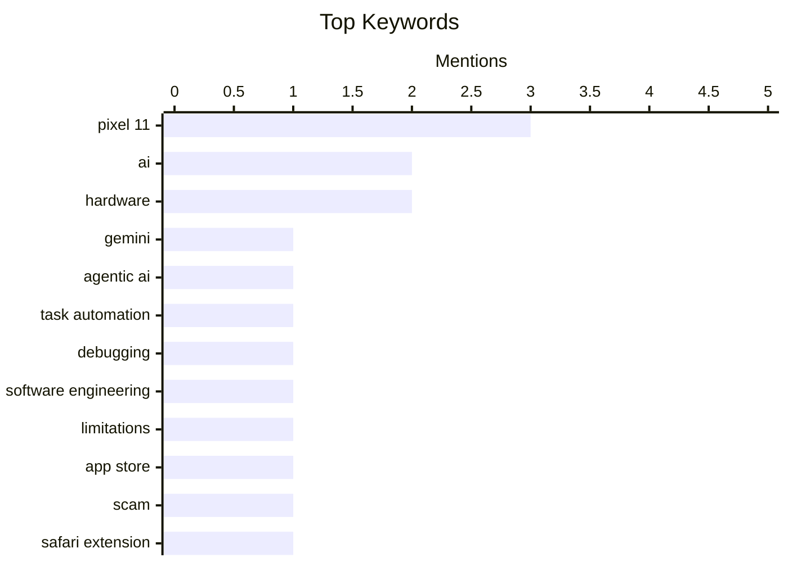

## Today's Highlights
Google's new Pixel 11 series is dominating headlines, heavily integrating "agentic AI" through Gemini and introducing innovative features like 'Camera Looks' and 'HiLight' notifications across its new devices. This reflects a broader, rapid evolution in the AI landscape, marked by new model releases like DeepSeek V4 Pro, even as experts raise concerns about potential over-reliance on these advanced technologies. Amidst these advancements, vigilance remains crucial, with new App Store scams like 'TabControl Extension' highlighting ongoing digital security challenges.
---
## Must Read Today
1. **TechCrunch on Google’s Pixel 11 Lineup**
[TechCrunch on Google’s Pixel 11 Lineup](https://techcrunch.com/2026/08/12/pixel-11-has-few-hardware-changes-and-more-gemini/) — daringfireball.net · 18h ago · 🤖 AI / ML
> Google's Pixel 11 series heavily emphasizes "agentic AI" through its Gemini integration, aiming to complete user tasks more autonomously. U.S.-based users can leverage Gemini to order groceries, book rides, get coffee, or even call businesses for reservations and appointments. Google ensures user control, allowing them to take over or stop tasks at any point and review transcripts of AI-operated calls. This launch also signals an upcoming expansion of connected applications. The Pixel 11 lineup marks a significant shift towards AI-driven task completion and enhanced user agency.
💡 **Why read it**: It highlights Google's strategic shift towards "agentic AI" in its Pixel 11 lineup, detailing Gemini's practical applications and user control features.
🏷️ Pixel 11, Gemini, agentic AI, task automation
2. **Quoting Florian Herrengt**
[Quoting Florian Herrengt](https://simonwillison.net/2026/Aug/12/florian-herrengt/) — simonwillison.net · 22h ago · ⚙️ Engineering
> This article, quoting Florian Herrengt, explores a concerning future scenario where excessive reliance on AI in software development erodes fundamental human engineering skills. It depicts a situation where teams use AI like Fable to fix bugs, but when a complex, recurring issue arises, human engineers lack the deep understanding to diagnose the problem, even questioning basic data origins. This reliance on AI for core development tasks leads to a degradation of critical problem-solving abilities. The piece concludes that over-dependence on AI could leave engineers unable to tackle intricate system issues effectively.
💡 **Why read it**: It offers a critical perspective on the potential negative impact of excessive AI reliance in software engineering, specifically regarding the erosion of fundamental debugging skills.
🏷️ AI, debugging, software engineering, limitations
3. **App Store Scam of the Week: ‘TabControl Extension’ for Safari**
[App Store Scam of the Week: ‘TabControl Extension’ for Safari](https://lapcatsoftware.com/articles/2026/8/4.html) — daringfireball.net · 22h ago · 🔒 Security
> This article exposes 'TabControl Extension' for Safari as a likely App Store scam, based on suspicious review patterns. The app displays numerous 5-star reviews, all in English, yet none are visible in the US, Australian, or Canadian App Stores. Furthermore, all reviewer names follow an unusual 'first name + initial' format, which is atypical for genuine App Store user reviews. These inconsistencies strongly suggest the reviews are fabricated, indicating a fraudulent application. The article concludes that the 'TabControl Extension' exhibits clear signs of an App Store scam through manipulated reviews and unusual listing patterns.
💡 **Why read it**: It provides concrete examples and methods for identifying App Store scams, particularly through suspicious review patterns and geographical inconsistencies.
🏷️ App Store, Scam, Safari Extension, Fake Reviews
---
## Data Overview
| Sources Scanned | Articles Fetched | Time Window | Selected |
|:---:|:---:|:---:|:---:|
| 88/92 | 2612 -> 20 | 24h | **15** |
### Category Distribution

### Top Keywords

<details>
<summary>Plain Text Keyword Chart (Terminal Friendly)</summary>
```
pixel 11             │ ████████████████████ 3
ai                   │ █████████████░░░░░░░ 2
hardware             │ █████████████░░░░░░░ 2
gemini               │ ███████░░░░░░░░░░░░░ 1
agentic ai           │ ███████░░░░░░░░░░░░░ 1
task automation      │ ███████░░░░░░░░░░░░░ 1
debugging            │ ███████░░░░░░░░░░░░░ 1
software engineering │ ███████░░░░░░░░░░░░░ 1
limitations          │ ███████░░░░░░░░░░░░░ 1
app store            │ ███████░░░░░░░░░░░░░ 1
```
</details>
### Topic Tags
**pixel 11**(3) · **ai**(2) · **hardware**(2) · gemini(1) · agentic ai(1) · task automation(1) · debugging(1) · software engineering(1) · limitations(1) · app store(1) · scam(1) · safari extension(1) · fake reviews(1) · deepseek(1) · llm(1) · ai model(1) · openrouter(1) · python(1) · database(1) · utility(1)
---
## Engineering
### 1. Quoting Florian Herrengt
[Quoting Florian Herrengt](https://simonwillison.net/2026/Aug/12/florian-herrengt/) — **simonwillison.net** · 22h ago · ⭐ 24/30
> This article, quoting Florian Herrengt, explores a concerning future scenario where excessive reliance on AI in software development erodes fundamental human engineering skills. It depicts a situation where teams use AI like Fable to fix bugs, but when a complex, recurring issue arises, human engineers lack the deep understanding to diagnose the problem, even questioning basic data origins. This reliance on AI for core development tasks leads to a degradation of critical problem-solving abilities. The piece concludes that over-dependence on AI could leave engineers unable to tackle intricate system issues effectively.
🏷️ AI, debugging, software engineering, limitations
---
### 2. Google Introduces ‘Camera Looks’ With Pixel 11 Phones
[Google Introduces ‘Camera Looks’ With Pixel 11 Phones](https://www.theverge.com/tech/978084/google-camera-looks-interview-computational-photography) — **daringfireball.net** · 17h ago · ⭐ 23/30
> Google is introducing 'Camera Looks' with its Pixel 11 phones to address the growing divergence in user preferences for smartphone photography. Isaac Reynolds, head of the Pixel camera team, notes that while some users desire perfectly optimized photos, an increasing number seek more "authentic or traditional" aesthetics. 'Camera Looks' allows users to select different photographic styles, moving beyond a single computational photography output. This feature aims to provide personalized visual outcomes, catering to a broader spectrum of user tastes. 'Camera Looks' is Google's solution to provide personalized photographic styles on Pixel 11, moving beyond a one-size-fits-all computational photography approach.
🏷️ Pixel 11, smartphone camera, image processing, user preferences
---
### 3. Book Review: Coding Literacy by Annette Vee ★★⯪☆☆
[Book Review: Coding Literacy by Annette Vee ★★⯪☆☆](https://shkspr.mobi/blog/2026/08/book-review-coding-literacy-by-annette-vee/) — **shkspr.mobi** · 2h ago · ⭐ 21/30
> This article presents a critical review of Annette Vee's book, "Coding Literacy," which claims to explore how computer programming is changing writing. The reviewer finds the book disappointing and frustrating, stating it fails to deliver on its subtitle's promise. Instead of deeply examining the impact of programming on writing, the book primarily focuses on the historical definitions of "literacy" and "illiteracy." It is criticized for missing the opportunity to discuss its stated topic. "Coding Literacy" is thus deemed to largely fail in addressing its central premise, instead dwelling on historical definitions of literacy.
🏷️ Coding Literacy, Programming, Book Review, Writing
---
### 4. IBM 5170 PC/AT
[IBM 5170 PC/AT](https://dfarq.homeip.net/ibm-5170-pc-at/?utm_source=rss&#038;utm_medium=rss&#038;utm_campaign=ibm-5170-pc-at) — **dfarq.homeip.net** · 3h ago · ⭐ 19/30
> The IBM 5170 PC/AT, launched on August 14, 1984, is a highly popular retro PC due to its historical significance and performance. It marked the last of IBM's open-architecture PCs, a design choice that fostered innovation and compatibility. From its release until mid-1987, it stood as the fastest and most expensive personal computer available on the market. Its combination of open architecture and top-tier performance solidified its place as a pivotal machine in computing history. The 5170 PC/AT represents a crucial era before IBM shifted its PC strategy, making it a significant system for enthusiasts.
🏷️ IBM PC/AT, Retro PC, Computer History, Open Architecture
---
## Opinion / Essays
### 5. Joanna Stern on the Pixel 11 ‘HiLight’ Notification Light
[Joanna Stern on the Pixel 11 ‘HiLight’ Notification Light](https://thenewthings.com/p/the-new-pixel-feature-i-want-on-my-iphone?gift_content=e9bf3ebd-db33-4ee5-91b0-84d7acac3263) — **daringfireball.net** · 16h ago · ⭐ 19/30
> Joanna Stern praises Google's new 'HiLight' notification feature on the Pixel 11, which revives and enhances a beloved functionality from older phones. She recalls the utility of blinking notification lights on devices like BlackBerry and Droid 2 for discreet message alerts. Google's 'HiLight' advances this concept by allowing users to assign different colors to VIP contacts. This enables users to identify who is trying to reach them by the color of the light when the phone is face down, without needing to pick it up. The Pixel 11's 'HiLight' feature innovatively revives and enhances the utility of notification lights by adding customizable color-coding for VIP contacts.
🏷️ Pixel 11, notification light, mobile, user experience
---
### 6. Google Design Pisses Its Pants on Twitter/X
[Google Design Pisses Its Pants on Twitter/X](https://x.com/googledesign/status/2087195277094695096) — **daringfireball.net** · 12h ago · ⭐ 18/30
> This article critically lambasts a design post from the official @GoogleDesign Twitter account, questioning the competence and aesthetic judgment of Google's design team. The author expresses disbelief, suggesting the showcased 'little to-do app' design appears amateurish, akin to an 8th grader's work. They even hope the design is "AI slop" rather than the product of human designers, implying a severe lack of appropriate proportions or aesthetic appeal. The post highlights a perceived significant decline in Google's design quality, raising concerns about the company's current design standards.
🏷️ Google Design, Twitter/X, brand, design critique
---
### 7. Amazon Is Spiting Customers With Unhelpful Order Confirmation Emails
[Amazon Is Spiting Customers With Unhelpful Order Confirmation Emails](https://www.theverge.com/ai-artificial-intelligence/977733/amazon-order-emails-google-gmail-ai-agents-data) — **daringfireball.net** · 19h ago · ⭐ 17/30
> Amazon has begun sending order confirmation emails that omit specific item names, instead listing only broad product categories, causing customer frustration. Shoppers have reported receiving generic phrases such as "Your Beauty item is confirmed!" for specific products like retainer cleaning tablets, or "Ordered: 1 Hardware item." This change significantly reduces the utility of order confirmations, making it difficult for customers to quickly identify purchased items. The article suggests this move might be a deliberate strategy by Amazon to hinder AI agents from easily parsing specific purchase data. Ultimately, the new format degrades the user experience by making essential information less accessible.
🏷️ Amazon, customer experience, email, order confirmation
---
### 8. Nature Is Healing
[Nature Is Healing](https://mastodon.social/@BasicAppleGuy/117073366339407186) — **daringfireball.net** · 23h ago · ⭐ 16/30
> This article celebrates a significant aesthetic improvement in the new Chess icon for macOS 27 Beta 5, signaling a positive shift in Apple's design focus. Basic Apple Guy describes the update as the "hardest icon glow-up," emphasizing it's a substantial enhancement rather than a minor tweak. The previous icon is implicitly criticized as "total shit" in contrast to the new "really nice icon." This design change is presented as a welcome return to high-quality visual standards. The main conclusion is that Apple has delivered a remarkably improved design for a specific system icon, demonstrating renewed attention to detail and aesthetic quality.
🏷️ macOS, Icon Design, Apple, UI/UX
---
## AI / ML
### 9. TechCrunch on Google’s Pixel 11 Lineup
[TechCrunch on Google’s Pixel 11 Lineup](https://techcrunch.com/2026/08/12/pixel-11-has-few-hardware-changes-and-more-gemini/) — **daringfireball.net** · 18h ago · ⭐ 27/30
> Google's Pixel 11 series heavily emphasizes "agentic AI" through its Gemini integration, aiming to complete user tasks more autonomously. U.S.-based users can leverage Gemini to order groceries, book rides, get coffee, or even call businesses for reservations and appointments. Google ensures user control, allowing them to take over or stop tasks at any point and review transcripts of AI-operated calls. This launch also signals an upcoming expansion of connected applications. The Pixel 11 lineup marks a significant shift towards AI-driven task completion and enhanced user agency.
🏷️ Pixel 11, Gemini, agentic AI, task automation
---
### 10. DeepSeek V4 Pro 0813 (on OpenRouter)
[DeepSeek V4 Pro 0813 (on OpenRouter)](https://simonwillison.net/2026/Aug/12/deepseek-v4-pro-0813/) — **simonwillison.net** · 14h ago · ⭐ 23/30
> The DeepSeek V4 Pro 0813 model has been released and is now available, exclusively via API on OpenRouter. There is no obvious official announcement page from DeepSeek itself regarding this new model. It remains unconfirmed whether DeepSeek plans to release the open weights for this version, unlike previous models such as the DeepSeek-V4-Pro released in April. This suggests a potential shift in DeepSeek's release strategy for its Pro models. DeepSeek V4 Pro 0813 is a new API-only model accessible via OpenRouter, with uncertainty regarding open-weight availability.
🏷️ DeepSeek, LLM, AI model, OpenRouter
---
### 11. Edinburgh Fringe - Garrett Millerick: We Tried it Your Way ★☆☆☆☆
[Edinburgh Fringe - Garrett Millerick: We Tried it Your Way ★☆☆☆☆](https://shkspr.mobi/blog/2026/08/edinburgh-fringe-garrett-millerick-we-tried-it-your-way/) — **shkspr.mobi** · 20h ago · ⭐ 18/30
> This article reviews Garrett Millerick's stand-up show "We Tried it Your Way" at the Edinburgh Fringe, rating it a dismal one star. The reviewer found the show "obnoxiously dull" and Millerick himself "simply obnoxious," citing an instance where he rudely insulted a child on stage. The show's premise involved an AI trained on Millerick's stand-up, which the reviewer implies could easily replace him given the poor quality of his performance. Characterized by tired rants against religion and politics, the show was deemed the "worst" seen at the fringe. The main conclusion is that the performance lacked both humor and basic courtesy.
🏷️ Edinburgh Fringe, AI, Stand-up, Creative AI
---
## Other
### 12. Hands-On With Google Pixel 11 Pro Fold
[Hands-On With Google Pixel 11 Pro Fold](https://www.engadget.com/2235294/google-pixel-11-pro-fold-hands-on/) — **daringfireball.net** · 18h ago · ⭐ 20/30
> This hands-on review of the Google Pixel 11 Pro Fold focuses on its design and durability, noting both improvements and persistent issues. The device maintains an IP68 dust and water resistance rating, which is superior to the Z Fold 8 line's IP48. However, Google did not reduce the weight and thickness, a key criticism from the previous generation. Instead, the company leaned into sturdiness, incorporating a new glass fiber material for the rear panel. The Pixel 11 Pro Fold prioritizes durability with its IP68 rating and new materials but remains heavy and thick, not addressing previous design criticisms.
🏷️ Pixel 11 Fold, foldable phone, hardware, IP rating
---
### 13. Google’s Pixel Watch 5
[Google’s Pixel Watch 5](https://www.theverge.com/tech/978094/pixel-watch-5-hands-on-made-by-google-gemini-wearables-smartwatch) — **daringfireball.net** · 18h ago · ⭐ 19/30
> This article provides a hands-on review of the Google Pixel Watch 5, highlighting its minimal hardware changes despite a $50 price increase to $399. The watch features minor updates, including a new satin pyrite case finish, a few new strap colors, and a Steph Curry Special Edition. Internally, it includes a slightly faster Qualcomm processor and an "itty-bitty" battery bump. The article suggests the Pixel Watch 5's focus is not on significant hardware innovation, attributing the price hike to "RAMageddon." The Pixel Watch 5 offers minimal hardware upgrades and a $50 price increase, indicating a focus away from significant physical innovation.
🏷️ Pixel Watch 5, smartwatch, hardware, Qualcomm
---
## Security
### 14. App Store Scam of the Week: ‘TabControl Extension’ for Safari
[App Store Scam of the Week: ‘TabControl Extension’ for Safari](https://lapcatsoftware.com/articles/2026/8/4.html) — **daringfireball.net** · 22h ago · ⭐ 24/30
> This article exposes 'TabControl Extension' for Safari as a likely App Store scam, based on suspicious review patterns. The app displays numerous 5-star reviews, all in English, yet none are visible in the US, Australian, or Canadian App Stores. Furthermore, all reviewer names follow an unusual 'first name + initial' format, which is atypical for genuine App Store user reviews. These inconsistencies strongly suggest the reviews are fabricated, indicating a fraudulent application. The article concludes that the 'TabControl Extension' exhibits clear signs of an App Store scam through manipulated reviews and unusual listing patterns.
🏷️ App Store, Scam, Safari Extension, Fake Reviews
---
## Tools / Open Source
### 15. alchemy-utils 0.1a0
[alchemy-utils 0.1a0](https://simonwillison.net/2026/Aug/12/alchemy-utils/) — **simonwillison.net** · 18h ago · ⭐ 23/30
> The article announces the release of `alchemy-utils 0.1a0`, a new Python library and CLI utility designed for database agnosticism. Inspired by the author's `sqlite-utils` library, this prototype was developed with assistance from AI tools like Codex and GPT-5.6 Sol Ultra. The goal is to create a utility that offers similar functionalities to `sqlite-utils` but can operate across various database systems, moving beyond SQLite's specific scope. This initial `0.1a0` release marks an early alpha version of the project. `alchemy-utils` aims to be a versatile, database-agnostic Python tool, building on the success of its SQLite-specific predecessor.
🏷️ Python, database, utility, open source
---
*Generated at 2026-08-13 14:01 | Scanned 88 sources -> 2612 articles -> selected 15*
*Based on the [Hacker News Popularity Contest 2025](https://refactoringenglish.com/tools/hn-popularity/) RSS source list recommended by [Andrej Karpathy](https://x.com/karpathy)*
*Produced by Dongdianr AI. Follow the same-name WeChat public account for more AI practical tips 💡*
