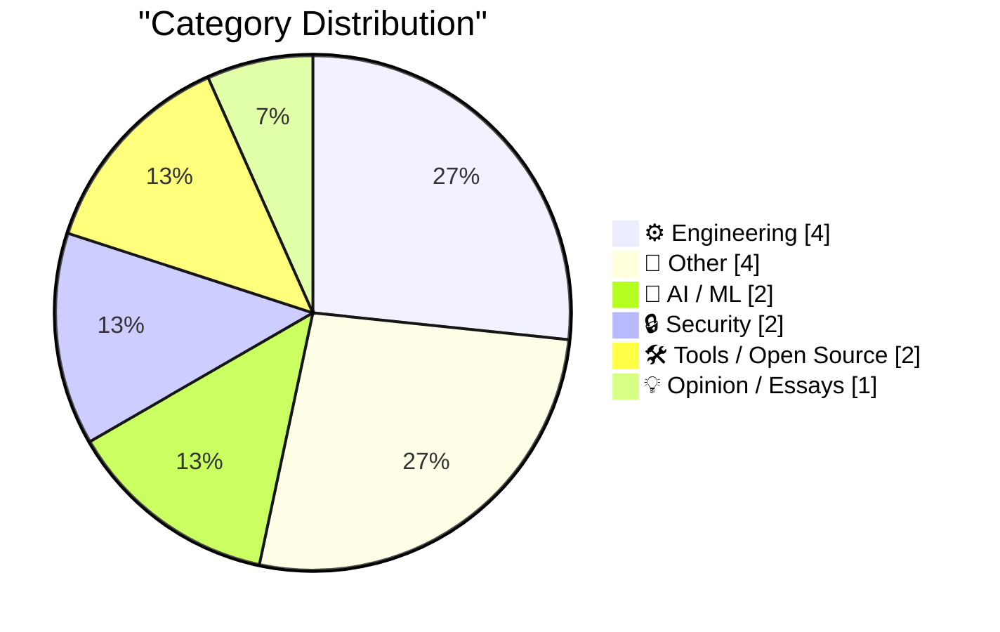
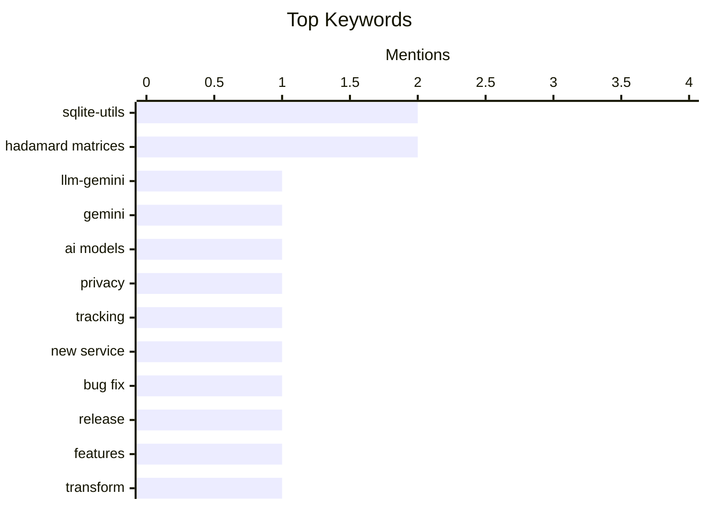

## Today's Highlights
Artificial intelligence continues to advance, with new plugins for large language models like Gemini emerging and AI even aiding in the discovery of complex mathematical structures such as Hadamard matrices. This highlights a broader emphasis on foundational engineering principles, particularly in data integrity and error correction, a field spanning from historical NASA image transmission techniques to these modern AI-driven mathematical breakthroughs. Concurrently, practical tools and utilities are also seeing updates, from essential database management improvements to new services designed to help individuals identify who is tracking them online.
---
## Must Read Today
1. **llm-gemini 0.33**
[llm-gemini 0.33](https://simonwillison.net/2026/Aug/13/llm-gemini/) — simonwillison.net · 18h ago · 🤖 AI / ML
> This article announces the release of `llm-gemini` version 0.33, a plugin for interacting with Google's Gemini models. The new version adds support for the recently released Gemini 3.7 Flash, along with `gemini-3.6-flash`, `gemini-3.5-flash-lite`, and two new embedding models. Specifically, it includes `gemini-em` for embeddings. This update expands the plugin's compatibility with the latest Gemini AI models, including new flash and embedding options.
💡 **Why read it**: It informs users about new model support in a popular LLM plugin, enabling access to the latest Gemini AI capabilities.
🏷️ llm-gemini, Gemini, AI models
2. **Who’s Tracking You? Use This New Service to Find Out**
[Who’s Tracking You? Use This New Service to Find Out](https://krebsonsecurity.com/2026/08/whos-tracking-you-use-this-new-service-to-find-out/) — krebsonsecurity.com · 2h ago · 🔒 Security
> It is challenging for individuals to identify which entities are responsible for serving ads and harvesting data from websites and mobile apps. A powerful and free new service called DecryptAds addresses this by scraping and correlating semi-public adtech data, which was previously difficult to parse and often confined to large advertising platforms. This service simplifies the process of understanding data collection by various entities. DecryptAds empowers users with an accessible tool to uncover the hidden adtech ecosystem tracking their online activities.
💡 **Why read it**: It introduces a valuable free service, DecryptAds, that demystifies online tracking and data harvesting by adtech companies.
🏷️ privacy, tracking, new service
3. **sqlite-utils 4.2.1**
[sqlite-utils 4.2.1](https://simonwillison.net/2026/Aug/13/sqlite-utils-2/) — simonwillison.net · 14h ago · 🛠 Tools / Open Source
> This article announces `sqlite-utils` version 4.2.1, a patch release addressing a critical bug in the previous version. Version 4.2 introduced a crashing bug due to the use of `from typing_extensions import Self` without explicitly listing `typing-extensions` as a dependency. The 4.2.1 release fixes this by ensuring the necessary package is included in the dependencies. Users should upgrade to `sqlite-utils` 4.2.1 to resolve a dependency-related crashing bug present in version 4.2.
💡 **Why read it**: It provides an immediate solution to a critical bug in a widely used SQLite utility, ensuring stability for users.
🏷️ sqlite-utils, bug fix, release
---
## Data Overview
| Sources Scanned | Articles Fetched | Time Window | Selected |
|:---:|:---:|:---:|:---:|
| 88/92 | 2611 -> 20 | 24h | **15** |
### Category Distribution

### Top Keywords

<details>
<summary>Plain Text Keyword Chart (Terminal Friendly)</summary>
```
sqlite-utils      │ ████████████████████ 2
hadamard matrices │ ████████████████████ 2
llm-gemini        │ ██████████░░░░░░░░░░ 1
gemini            │ ██████████░░░░░░░░░░ 1
ai models         │ ██████████░░░░░░░░░░ 1
privacy           │ ██████████░░░░░░░░░░ 1
tracking          │ ██████████░░░░░░░░░░ 1
new service       │ ██████████░░░░░░░░░░ 1
bug fix           │ ██████████░░░░░░░░░░ 1
release           │ ██████████░░░░░░░░░░ 1
```
</details>
### Topic Tags
**sqlite-utils**(2) · **hadamard matrices**(2) · **llm-gemini**(1) · gemini(1) · ai models(1) · privacy(1) · tracking(1) · new service(1) · bug fix(1) · release(1) · features(1) · transform(1) · hadamard codes(1) · sphere packing(1) · claude ai(1) · mathematics(1) · mariner 9(1) · error correction(1) · image encoding(1) · matrix construction(1)
---
## Engineering
### 1. How NASA’s Mariner 9 probe encoded images
[How NASA’s Mariner 9 probe encoded images](https://www.johndcook.com/blog/2026/08/13/mariner-hadamard/) — **johndcook.com** · 14h ago · ⭐ 20/30
> This article explains how NASA's Mariner 9 probe used error-correcting codes to transmit images from Mars in 1971 without significant corruption. Mariner 9 encoded images using a (32, 6, 16) Hadamard code, which is based on Hadamard matrices. This specific code was crucial for ensuring the integrity of the transmitted data over long distances. Hadamard codes were instrumental in enabling reliable image transmission from space probes like Mariner 9, demonstrating their critical role in early space communication.
🏷️ Mariner 9, Error correction, Hadamard matrices, Image encoding
---
### 2. Constructing Hadamard matrices
[Constructing Hadamard matrices](https://www.johndcook.com/blog/2026/08/13/constructing-hadamard-matrices/) — **johndcook.com** · 22h ago · ⭐ 20/30
> This article explains the definition and construction methods for Hadamard matrices, which are orthogonal matrices with entries of 1 or -1. The article defines a Hadamard matrix, providing an example of an order 2 matrix. It then describes Sylvester's method for bootstrapping smaller Hadamard matrices into larger ones, illustrating a recursive construction technique. Hadamard matrices can be systematically constructed, with Sylvester's method providing a foundational technique for generating higher-order matrices from smaller examples.
🏷️ Hadamard matrices, Matrix construction, Coding theory
---
### 3. How This Blog Is Built
[How This Blog Is Built](https://nesbitt.io/2026/08/14/how-this-blog-is-built.html) — **nesbitt.io** · 4h ago · ⭐ 20/30
> This article promises a comprehensive walkthrough of the custom technical stack behind the nesbitt.io blog. The article will detail the custom static site generator used, the content pipeline for managing and processing blog posts, and the edge deployment strategy for serving the site efficiently. It aims to provide a full understanding of the bespoke architecture. The article provides an in-depth look into the bespoke architecture of nesbitt.io, covering its custom static site generation, content management, and deployment.
🏷️ Static site generator, Content pipeline, Edge deployment, Blog architecture
---
### 4. Printing Lists
[Printing Lists](https://matklad.github.io/2026/08/14/printing-lists.html) — **matklad.github.io** · 14h ago · ⭐ 16/30
> This article explores efficient and idiomatic ways to print comma-separated lists in programming contexts. It highlights a concise technique where the comma is optionally printed *before* each element, except for the first one. This method elegantly avoids common issues such as special-casing the first element or needing to remove a trailing comma after the loop. The approach likely demonstrates improved code readability and conciseness compared to alternative list formatting strategies. The "print comma first" idiom is presented as a clean and effective pattern for formatting lists, enhancing code clarity and reducing complexity.
🏷️ Programming tip, List printing, Code idiom
---
## Other
### 5. Ceramic Shield 2 Is the Real Deal
[Ceramic Shield 2 Is the Real Deal](https://www.tomsguide.com/phones/iphones/iphone-17-and-iphone-air-durability-testing-heres-how-the-new-iphones-stand-up-to-bending-scratching-and-dropping) — **daringfireball.net** · 22h ago · ⭐ 19/30
> This article evaluates the durability of Apple's Ceramic Shield 2, particularly its scratch resistance, for the iPhone 17 and iPhone Air. Torture tests by JerryRigEverything indicate that Ceramic Shield 2 significantly resists scratching, showing only light scratches at level 7 on the Mohs scale of hardness. This is an improvement over typical glass, which scratches at levels 5 or 6 on that scale. Ceramic Shield 2 demonstrates superior scratch resistance compared to standard smartphone glass, validating Apple's claims about its enhanced durability.
🏷️ iPhone, durability, Ceramic Shield
---
### 6. How Will the 21st Century ROAD to Housing Act Affect Housing Supply? Part II
[How Will the 21st Century ROAD to Housing Act Affect Housing Supply? Part II](https://www.construction-physics.com/p/how-will-the-21st-century-road-to) — **construction-physics.com** · 1h ago · ⭐ 17/30
> This article, the second installment in a series, analyzes the potential impact of the 21st Century ROAD to Housing Act on housing supply. It delves into specific provisions of the Act, examining how measures related to zoning reform, infrastructure funding, and regulatory streamlining are intended to increase housing availability. The author evaluates the mechanisms through which these provisions might operate, considering both their direct and indirect effects on construction and development. The analysis aims to discern the actual effectiveness of each component in boosting the overall housing supply. The Act's success in increasing housing supply will depend significantly on the precise implementation and interaction of its various provisions, with some likely having a more substantial impact than others.
🏷️ Housing Act, Housing supply, Policy analysis, Economics
---
### 7. Commodore’s purchase of Amiga, August 14, 1984
[Commodore’s purchase of Amiga, August 14, 1984](https://dfarq.homeip.net/commodores-purchase-of-amiga-august-14-1984/?utm_source=rss&#038;utm_medium=rss&#038;utm_campaign=commodores-purchase-of-amiga-august-14-1984) — **dfarq.homeip.net** · 3h ago · ⭐ 16/30
> This article recounts the historical event of Commodore International's acquisition of Amiga Corporation on August 14, 1984. Commodore purchased Amiga for $27 million, driven by the expectation of bringing Amiga’s advanced multitasking computer, featuring high-color graphics and sound, to market within a year. The acquisition was a pivotal moment aimed at accelerating the launch of a groundbreaking personal computer. However, the article notes that the actual market introduction of the Amiga computer took longer than the initially projected one-year timeframe. This event marked a significant turning point in the early personal computing industry.
🏷️ Commodore, Amiga, Tech history, Acquisition
---
### 8. Edinburgh Fringe: Waiting for Wonka ★★★⯪☆
[Edinburgh Fringe: Waiting for Wonka ★★★⯪☆](https://shkspr.mobi/blog/2026/08/edinburgh-fringe-waiting-for-wonka/) — **shkspr.mobi** · 1h ago · ⭐ 9/30
> This article reviews "Waiting for Wonka," a play by New Zealand's Half Trick performed at the Edinburgh Fringe Festival, rating it ★★★⯪☆. The play explores a dark concept: the post-rejection lives of the children from *Charlie and the Chocolate Factory*, trapped in a *Big Brother*-esque household where they "trauma-dump" on each other. The reviewer notes that shrinking the full-length play to a 60-minute Fringe standard makes it feel "brusque" and somewhat underdeveloped, despite its brilliant premise. The production delivers an intense and "fucked up" experience. Ultimately, while the concept is strong, the condensed format limits its full potential.
🏷️ Edinburgh Fringe, play review
---
## AI / ML
### 9. llm-gemini 0.33
[llm-gemini 0.33](https://simonwillison.net/2026/Aug/13/llm-gemini/) — **simonwillison.net** · 18h ago · ⭐ 26/30
> This article announces the release of `llm-gemini` version 0.33, a plugin for interacting with Google's Gemini models. The new version adds support for the recently released Gemini 3.7 Flash, along with `gemini-3.6-flash`, `gemini-3.5-flash-lite`, and two new embedding models. Specifically, it includes `gemini-em` for embeddings. This update expands the plugin's compatibility with the latest Gemini AI models, including new flash and embedding options.
🏷️ llm-gemini, Gemini, AI models
---
### 10. Hadamard Codes and Sphere Packing
[Hadamard Codes and Sphere Packing](https://www.johndcook.com/blog/2026/08/13/hadamard-sphere-packing/) — **johndcook.com** · 12h ago · ⭐ 23/30
> This article connects the recent discovery of a new Hadamard matrix using Claude AI to the practical applications of Hadamard codes, specifically in sphere packing. Hadamard matrices are orthogonal matrices with entries of 1 or -1, used in error-correcting codes. The article references a previous post explaining their construction and then provides an example of their application, such as NASA's use of Hadamard codes. Hadamard codes, derived from Hadamard matrices, have practical applications in areas like error correction and sphere packing, as exemplified by NASA's historical use.
🏷️ Hadamard codes, Sphere packing, Claude AI, Mathematics
---
## Security
### 11. Who’s Tracking You? Use This New Service to Find Out
[Who’s Tracking You? Use This New Service to Find Out](https://krebsonsecurity.com/2026/08/whos-tracking-you-use-this-new-service-to-find-out/) — **krebsonsecurity.com** · 2h ago · ⭐ 26/30
> It is challenging for individuals to identify which entities are responsible for serving ads and harvesting data from websites and mobile apps. A powerful and free new service called DecryptAds addresses this by scraping and correlating semi-public adtech data, which was previously difficult to parse and often confined to large advertising platforms. This service simplifies the process of understanding data collection by various entities. DecryptAds empowers users with an accessible tool to uncover the hidden adtech ecosystem tracking their online activities.
🏷️ privacy, tracking, new service
---
### 12. Supplier Security Questionnaire
[Supplier Security Questionnaire](https://nesbitt.io/2026/08/13/supplier-security-questionnaire.html) — **nesbitt.io** · 21h ago · ⭐ 18/30
> This article addresses the challenges of traditional supplier security questionnaires, which are often time-consuming, inconsistent, and lack effective follow-up. It advocates for a more structured, risk-based approach, emphasizing the use of standardized frameworks like NIST CSF or ISO 27001. Key recommendations include automating the questionnaire process, integrating with Governance, Risk, and Compliance (GRC) tools, and implementing continuous monitoring. The author stresses the importance of clear communication and focusing on the most critical risks rather than exhaustive checklists. Ultimately, a streamlined, risk-aware, and automated process is crucial for effective third-party security risk management.
🏷️ Security questionnaire, Supplier security, Risk management
---
## Tools / Open Source
### 13. sqlite-utils 4.2.1
[sqlite-utils 4.2.1](https://simonwillison.net/2026/Aug/13/sqlite-utils-2/) — **simonwillison.net** · 14h ago · ⭐ 24/30
> This article announces `sqlite-utils` version 4.2.1, a patch release addressing a critical bug in the previous version. Version 4.2 introduced a crashing bug due to the use of `from typing_extensions import Self` without explicitly listing `typing-extensions` as a dependency. The 4.2.1 release fixes this by ensuring the necessary package is included in the dependencies. Users should upgrade to `sqlite-utils` 4.2.1 to resolve a dependency-related crashing bug present in version 4.2.
🏷️ sqlite-utils, bug fix, release
---
### 14. sqlite-utils 4.2
[sqlite-utils 4.2](https://simonwillison.net/2026/Aug/13/sqlite-utils/) — **simonwillison.net** · 17h ago · ⭐ 24/30
> This article details the improvements in `sqlite-utils` version 4.2, focusing on its `table.transform()` feature. The `transform()` feature, which handles complex `ALTER TABLE` operations by creating a new table, copying data, and replacing the old one, now preserves foreign key constraints, indexes, and triggers. It also gained a new `pk` argument for specifying a new primary key during transformation. `sqlite-utils` 4.2 significantly enhances the `table.transform()` functionality, making complex table schema modifications more robust and feature-rich.
🏷️ sqlite-utils, features, transform
---
## Opinion / Essays
### 15. Pluralistic: Capital formation (14 Aug 2026)
[Pluralistic: Capital formation (14 Aug 2026)](https://pluralistic.net/2026/08/14/one-chokable-throat/) — **pluralistic.net** · 2h ago · ⭐ 18/30
> This article is a collection of links and short notes covering various topics, including capital formation, tech delights, and digital rights issues. The "Object permanence" section highlights several instances of censorship and surveillance, such as London Copyfighters, TSA vs. lipstick, Long Beach vs. photographers, China's internet censorship, and the "Privacy preserving age verification" debate. It also mentions "McMansion Hell" and copyrighting an MTG deck. The article serves as a curated digest of current events and discussions, particularly emphasizing ongoing challenges to digital rights, privacy, and free expression.
🏷️ links, current events, Cory Doctorow
---
*Generated at 2026-08-14 14:01 | Scanned 88 sources -> 2611 articles -> selected 15*
*Based on the [Hacker News Popularity Contest 2025](https://refactoringenglish.com/tools/hn-popularity/) RSS source list recommended by [Andrej Karpathy](https://x.com/karpathy)*
*Produced by Dongdianr AI. Follow the same-name WeChat public account for more AI practical tips 💡*
