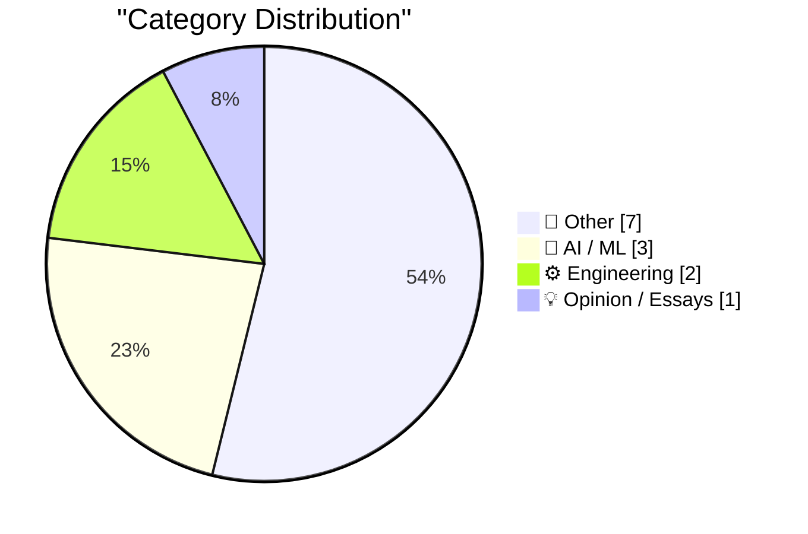
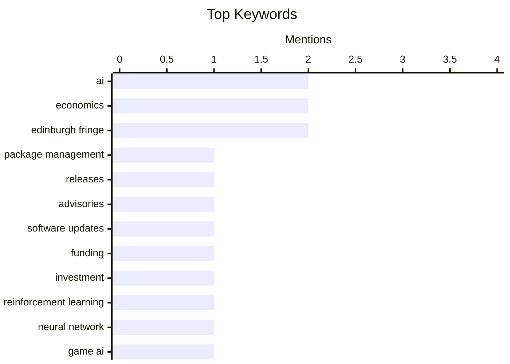

## Today's Highlights
Today's tech landscape is dominated by the escalating financial demands and innovative applications of artificial intelligence, from training models for gaming to novel content tagging techniques. Concurrently, the software engineering realm continues to evolve, marked by updates in package management and sharp critiques of major design systems like Google's Material 3. These developments underscore a period of rapid advancement and critical evaluation across the tech industry.
---
## Must Read Today
1. **This Week in Package Management: 15 August 2026**
[This Week in Package Management: 15 August 2026](https://nesbitt.io/2026/08/15/this-week-in-package-management.html) — nesbitt.io · 4h ago · ⚙️ Engineering
> This article provides a weekly roundup of news and updates in the package management ecosystem. It covers recent releases, security advisories, and notable articles from various package managers and related tools. The content is a curated digest for staying informed about developments in this critical area of software development. The main conclusion is that staying updated on package management trends is crucial for maintaining secure and efficient software projects.
💡 **Why read it**: It offers a concise, centralized overview of the latest developments in package management, which is essential for developers and system administrators.
🏷️ package management, releases, advisories, software updates
2. **Premium: How Much Money Does AI Need?**
[Premium: How Much Money Does AI Need?](https://www.wheresyoured.at/premium-how-much-money-does-ai-need/) — wheresyoured.at · 22h ago · 🤖 AI / ML
> This article discusses the significant financial requirements for developing and deploying AI technologies. It likely delves into the substantial costs associated with compute infrastructure, extensive data acquisition, complex model training, and ongoing operational expenses. The author emphasizes that a thorough understanding of these monetary demands is crucial for assessing the feasibility and sustainability of AI projects. The piece aims to provide a detailed financial perspective on the AI industry, highlighting the economic realities behind its advancement.
💡 **Why read it**: It provides a critical financial analysis of the AI industry, which is vital for understanding the economic realities and investment landscape of AI development.
🏷️ AI, funding, economics, investment
3. **Training a Reinforcement Learning Model to Play Bonk.io**
[Training a Reinforcement Learning Model to Play Bonk.io](https://blog.pixelmelt.dev/training-a-reinforcement-learning-model-to-play-bonk-io/) — blog.pixelmelt.dev · 11h ago · 🤖 AI / ML
> This article details the process of training a reinforcement learning (RL) model to play the web game Bonk.io. The core problem involved dissecting the game to re-implement its physics engine, which was crucial for creating a simulated environment for training. The technical approach likely involved using an RL framework to train a neural network agent within this custom physics simulation, allowing it to learn optimal strategies through trial and error. The project demonstrates the practical application of RL in game environments and the necessity of accurate environment modeling for effective agent training.
💡 **Why read it**: It offers a practical case study on applying reinforcement learning to a complex web game, highlighting the technical challenges of environment replication and model training.
🏷️ Reinforcement Learning, Neural Network, Game AI, Bonk.io
---
## Data Overview
| Sources Scanned | Articles Fetched | Time Window | Selected |
|:---:|:---:|:---:|:---:|
| 88/92 | 2612 -> 13 | 24h | **13** |
### Category Distribution

### Top Keywords

<details>
<summary>Plain Text Keyword Chart (Terminal Friendly)</summary>
```
ai                     │ ████████████████████ 2
economics              │ ████████████████████ 2
edinburgh fringe       │ ████████████████████ 2
package management     │ ██████████░░░░░░░░░░ 1
releases               │ ██████████░░░░░░░░░░ 1
advisories             │ ██████████░░░░░░░░░░ 1
software updates       │ ██████████░░░░░░░░░░ 1
funding                │ ██████████░░░░░░░░░░ 1
investment             │ ██████████░░░░░░░░░░ 1
reinforcement learning │ ██████████░░░░░░░░░░ 1
```
</details>
### Topic Tags
**ai**(2) · **economics**(2) · **edinburgh fringe**(2) · package management(1) · releases(1) · advisories(1) · software updates(1) · funding(1) · investment(1) · reinforcement learning(1) · neural network(1) · game ai(1) · bonk.io(1) · llm(1) · hallucination(1) · classification(1) · google(1) · material design(1) · ui/ux(1) · design system(1)
---
## Other
### 1. ★ You Don’t Need to Worry About Scratching Your iPhone Camera Lenses
[★ You Don’t Need to Worry About Scratching Your iPhone Camera Lenses](https://daringfireball.net/2026/08/iphone_camera_lens_scratch_resistance) — **daringfireball.net** · 20h ago · ⭐ 15/30
> This article addresses common user concerns about scratching iPhone camera lenses. It clarifies that the exposed lens covers are made of sapphire, not ordinary glass, making them incredibly scratch-resistant. Furthermore, the author asserts that even if a scratch were to occur on a sapphire lens cover, it would almost certainly not impact image quality due to the material's properties. The main takeaway is that users can generally be confident in the durability and photographic integrity of their iPhone camera lenses without excessive worry.
🏷️ iPhone, camera, sapphire, scratch resistance
---
### 2. Reading List — 08/15/2026
[Reading List — 08/15/2026](https://www.construction-physics.com/p/reading-list-08152026) — **construction-physics.com** · 1h ago · ⭐ 13/30
> This article presents a curated reading list covering various topics relevant to construction and economics. Key subjects include analyses of home price declines, discussions on the Strategic Petroleum Reserve, and updates on The Boring Company's fundraising activities. The list aims to provide readers with diverse perspectives and current information on significant industry and economic trends. The main takeaway is a concise overview of important developments across these sectors.
🏷️ reading list, economics, business, Boring Company
---
### 3. This Week on The Analog Antiquarian
[This Week on The Analog Antiquarian](https://www.filfre.net/2026/08/this-week-on-the-analog-antiquarian/) — **filfre.net** · 21h ago · ⭐ 7/30
> This article serves as a weekly update from "The Analog Antiquarian" blog, highlighting recent content. The specific topic mentioned for this week is "Richard Goes to the Movies," suggesting a historical or analytical piece related to cinema. The article acts as a digest for followers of the blog, pointing them to the latest deep dives into historical or cultural subjects. The main conclusion is that it provides a convenient summary of the blog's newest historical explorations.
🏷️ Antiquarian, History, Movies
---
### 4. Northern Gannet
[Northern Gannet](https://simonwillison.net/2026/Aug/15/sighting-391300422/) — **simonwillison.net** · 10h ago · ⭐ 5/30
> This article documents the sighting of a Northern Gannet (Morus bassanus) named Morris in Pillar Point Harbor, CA, US. The core topic is the unusual presence of this specific bird, as Morris is the only known Northern Gannet in the entire Pacific Ocean. He first appeared in the Farallon Islands 14 years ago, making him a local celebrity and a subject of scientific interest, potentially linked to phenomena like melting Arctic ice. The article highlights a unique instance of avian migration and adaptation, underscoring the rarity of his presence.
🏷️ Northern Gannet, bird, nature, observation
---
### 5. Book Review: Slags by Emma Jane Unsworth ★★★⯪☆
[Book Review: Slags by Emma Jane Unsworth ★★★⯪☆](https://shkspr.mobi/blog/2026/08/book-review-slags-by-emma-jane-unsworth/) — **shkspr.mobi** · 2h ago · ⭐ 5/30
> This article reviews "Slags" by Emma Jane Unsworth, a book recommended for its blend of tragedy and comedy. The reviewer praises the "excruciatingly well written" characters, noting their ability to evoke a "terrifying wave of nostalgia" for 1990s teenage experiences like shoplifting Impulse body-spray. The book's themes are likened to Marie Le Conte's essay on consent, suggesting a deep exploration of issues faced by teenage girls. Despite the powerful characterization and thematic depth, the reviewer expresses ambivalence, "not sure what to make of this book." Ultimately, it's presented as a complex read that leaves a lasting impression.
🏷️ book review, novel, literature
---
### 6. Edinburgh Fringe: Target Audience ★★★★★
[Edinburgh Fringe: Target Audience ★★★★★](https://shkspr.mobi/blog/2026/08/edinburgh-fringe-target-audience/) — **shkspr.mobi** · 19h ago · ⭐ 5/30
> This article reviews "Target Audience," hailed as the best show seen at the Edinburgh Fringe. The plot centers on a television company tasking a literary genius with creating a "pro-weapons sitcom." The show is characterized by its fast pace, blending elements of "2012" and "Episodes," with jokes ranging from "furiousity of bullets" to "subtlety of a knife." All four cast members are lauded as spectacular, contributing to its high quality. The reviewer concludes it is a top-tier Fringe performance, highly recommended for its unique premise, rapid humor, and strong ensemble.
🏷️ Edinburgh Fringe, show review, comedy
---
### 7. Edinburgh Fringe: Stand-up Philosophy ★★★⯪☆
[Edinburgh Fringe: Stand-up Philosophy ★★★⯪☆](https://shkspr.mobi/blog/2026/08/edinburgh-fringe-stand-up-philosophy/) — **shkspr.mobi** · 22h ago · ⭐ 5/30
> This article reviews "Stand-up Philosophy," a pay-what-you-want show at the Edinburgh Fringe featuring three comedians. The show's core gimmick involves comedians performing sets on philosophical themes, followed by an audience Q&A posing philosophical conundrums. While the concept "more-or-less works," the reviewer suggests an early afternoon crowd might prefer anonymous questions for the Q&A. A notable highlight was Daman, a Sikh comedian, delivering an "unnervingly accurate impression of Trump." Overall, it's considered a decent show for its price and unique premise, offering memorable comedic moments despite minor interactive limitations.
🏷️ Edinburgh Fringe, philosophy, stand-up
---
## AI / ML
### 8. Premium: How Much Money Does AI Need?
[Premium: How Much Money Does AI Need?](https://www.wheresyoured.at/premium-how-much-money-does-ai-need/) — **wheresyoured.at** · 22h ago · ⭐ 27/30
> This article discusses the significant financial requirements for developing and deploying AI technologies. It likely delves into the substantial costs associated with compute infrastructure, extensive data acquisition, complex model training, and ongoing operational expenses. The author emphasizes that a thorough understanding of these monetary demands is crucial for assessing the feasibility and sustainability of AI projects. The piece aims to provide a detailed financial perspective on the AI industry, highlighting the economic realities behind its advancement.
🏷️ AI, funding, economics, investment
---
### 9. Training a Reinforcement Learning Model to Play Bonk.io
[Training a Reinforcement Learning Model to Play Bonk.io](https://blog.pixelmelt.dev/training-a-reinforcement-learning-model-to-play-bonk-io/) — **blog.pixelmelt.dev** · 11h ago · ⭐ 26/30
> This article details the process of training a reinforcement learning (RL) model to play the web game Bonk.io. The core problem involved dissecting the game to re-implement its physics engine, which was crucial for creating a simulated environment for training. The technical approach likely involved using an RL framework to train a neural network agent within this custom physics simulation, allowing it to learn optimal strategies through trial and error. The project demonstrates the practical application of RL in game environments and the necessity of accurate environment modeling for effective agent training.
🏷️ Reinforcement Learning, Neural Network, Game AI, Bonk.io
---
### 10. Don't classify. Hallucinate!
[Don't classify. Hallucinate!](https://simonwillison.net/2026/Aug/14/dont-classify-hallucinate/) — **simonwillison.net** · 16h ago · ⭐ 25/30
> The article addresses the challenge of tagging a large volume of untagged blog content when the existing tag set (1,856 tags) is too extensive for direct LLM input. Simon Willison discusses Doug Turnbull's "hypothetical classifications" solution, which involves instructing the LLM to generate relevant tags without prior knowledge of the existing tag list. This approach leverages the LLM's generative capabilities to "hallucinate" appropriate tags, which can then be mapped or used as suggestions. The key takeaway is that for large, dynamic tag sets, generative AI can be more effective than traditional classification by allowing the model to invent rather than select.
🏷️ LLM, hallucination, classification, AI
---
## Engineering
### 11. This Week in Package Management: 15 August 2026
[This Week in Package Management: 15 August 2026](https://nesbitt.io/2026/08/15/this-week-in-package-management.html) — **nesbitt.io** · 4h ago · ⭐ 27/30
> This article provides a weekly roundup of news and updates in the package management ecosystem. It covers recent releases, security advisories, and notable articles from various package managers and related tools. The content is a curated digest for staying informed about developments in this critical area of software development. The main conclusion is that staying updated on package management trends is crucial for maintaining secure and efficient software projects.
🏷️ package management, releases, advisories, software updates
---
### 12. Google’s ‘Material 3’ Design Write-Up Is 93.3 Percent Embarrassing
[Google’s ‘Material 3’ Design Write-Up Is 93.3 Percent Embarrassing](https://design.google/library/expressive-material-design-google-research) — **daringfireball.net** · 21h ago · ⭐ 24/30
> This article critiques Google's "Material 3" UI design language, specifically focusing on a Google Design write-up. The author highlights several design choices as problematic, such as changing the standard I-beam cursor for text selection to a circle in desktop browsers, which is deemed impractical. The piece suggests that the design documentation itself is poorly executed and reflects a lack of practical usability considerations. The overall conclusion is that Google's Material 3 presentation and some of its core design elements are significantly flawed and demonstrate poor user experience judgment.
🏷️ Google, Material Design, UI/UX, design system
---
## Opinion / Essays
### 13. Oh Hey, It’s Not Just Me
[Oh Hey, It’s Not Just Me](https://blog.jim-nielsen.com/2026/its-not-just-me/) — **blog.jim-nielsen.com** · 19h ago · ⭐ 7/30
> The article discusses the author's recent experience of noticing a subtle decline in their eyesight, particularly in the mornings. The core topic is the realization that this "slippage" in vision is a common phenomenon, especially as people age. The author found validation for this experience through a post by Chris Coyier, suggesting a shared human experience rather than an isolated personal issue. The main takeaway is the comfort and understanding derived from discovering that such age-related changes in vision are widely experienced and normal.
🏷️ Eyesight, Personal reflection, Aging
---
*Generated at 2026-08-15 14:01 | Scanned 88 sources -> 2612 articles -> selected 13*
*Based on the [Hacker News Popularity Contest 2025](https://refactoringenglish.com/tools/hn-popularity/) RSS source list recommended by [Andrej Karpathy](https://x.com/karpathy)*
*Produced by Dongdianr AI. Follow the same-name WeChat public account for more AI practical tips 💡*
