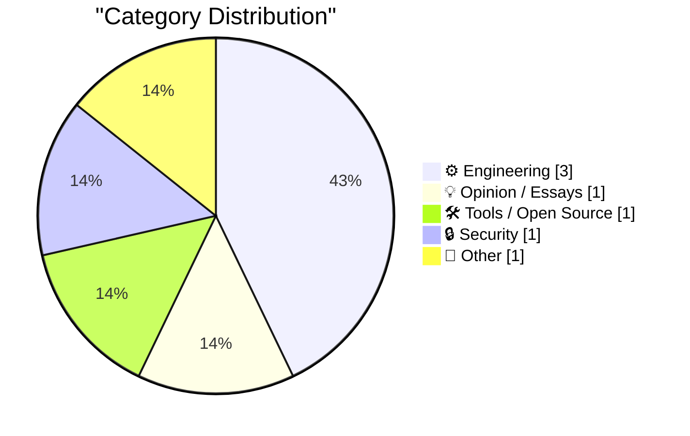
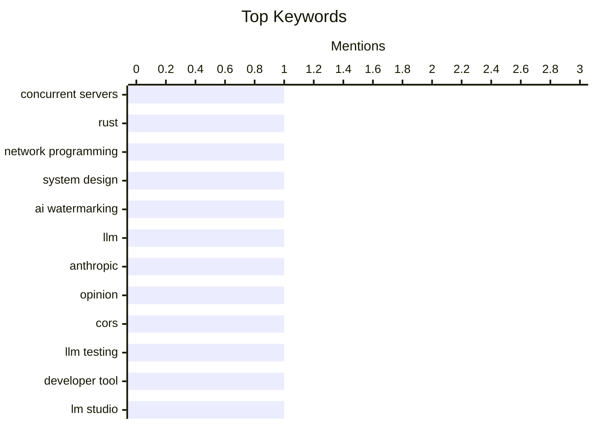

## Today's Highlights
Today's tech highlights reveal a dual focus on advancing AI capabilities and tackling fundamental engineering hurdles. While debates around AI text watermarking continue, new development tools like CORS Chat are streamlining interaction with AI endpoints. Meanwhile, engineers are pushing boundaries in concurrent server design with Rust, alongside exploring complex data compression and probabilistic error correction methods. Businesses are also finding specialized solutions to navigate the complexities of compliance.
---
## Must Read Today
1. **Concurrent Servers: Part 7 - Rust**
[Concurrent Servers: Part 7 - Rust](https://eli.thegreenplace.net/2026/concurrent-servers-part-7-rust/) — eli.thegreenplace.net · 21h ago · ⚙️ Engineering
> This article, part 7 in a series, examines how the Rust programming language addresses challenges in writing concurrent network servers, building on concepts from earlier parts. It likely discusses Rust's ownership model, borrowing, and concurrency primitives like `Arc` and `Mutex` to ensure memory safety and prevent data races. The article probably highlights Rust's `async/await` for asynchronous I/O and its compile-time guarantees for robust concurrency. Ultimately, it demonstrates Rust's effectiveness in building high-performance, safe concurrent servers without a garbage collector.
💡 **Why read it**: It provides valuable insights into Rust's specific features and design philosophy that make it a strong candidate for developing safe and efficient concurrent network servers.
🏷️ Concurrent servers, Rust, network programming, system design
2. **AI text watermarking is not a big deal**
[AI text watermarking is not a big deal](https://seangoedecke.com/ai-text-watermarking-is-not-a-big-deal/) — seangoedecke.com · 14h ago · 💡 Opinion / Essays
> The article challenges the widespread concern and negative reactions to Anthropic's plan to include hidden watermarks in Claude model outputs. It argues that AI text watermarking will not lead to a mass exodus from Anthropic models nor constitute a meaningful change for users. The author likely posits that these watermarks are easily circumvented or have limited practical impact on typical user workflows. The main conclusion is that the perceived threat or impact of AI text watermarking is overblown and will not fundamentally alter the landscape of AI model usage.
💡 **Why read it**: It offers a contrarian perspective on the impact of AI text watermarking, challenging common anxieties and providing reasons why it might not be as disruptive as feared.
🏷️ AI watermarking, LLM, Anthropic, opinion
3. **CORS Chat**
[CORS Chat](https://simonwillison.net/2026/Aug/15/cors-chat/) — simonwillison.net · 23h ago · 🛠 Tools / Open Source
> Simon Willison developed "CORS Chat" to facilitate testing OpenAI-Responses-compatible chat endpoints, particularly for local LLMs like Qwen 3.8 27B running in LM Studio. The tool provides a web UI for exercising these endpoints, enabling testing against LM Studio with the `--cors` option and OpenRouter. Built with GPT-5.6-Sol xhigh, it was tested on an M5 MacBook Pro and an NVIDIA DGX Spark, demonstrating its utility for both local and remote LLM interaction. CORS Chat offers a practical, web-based solution for developers to test and interact with various OpenAI-compatible chat APIs, simplifying development and debugging.
💡 **Why read it**: It introduces a useful open-source tool for developers to test and interact with OpenAI-compatible chat endpoints, particularly for local LLM setups, enhancing development workflows.
🏷️ CORS, LLM testing, developer tool, LM Studio
---
## Data Overview
| Sources Scanned | Articles Fetched | Time Window | Selected |
|:---:|:---:|:---:|:---:|
| 88/92 | 2612 -> 7 | 24h | **7** |
### Category Distribution

### Top Keywords

<details>
<summary>Plain Text Keyword Chart (Terminal Friendly)</summary>
```
concurrent servers  │ ████████████████████ 1
rust                │ ████████████████████ 1
network programming │ ████████████████████ 1
system design       │ ████████████████████ 1
ai watermarking     │ ████████████████████ 1
llm                 │ ████████████████████ 1
anthropic           │ ████████████████████ 1
opinion             │ ████████████████████ 1
cors                │ ████████████████████ 1
llm testing         │ ████████████████████ 1
```
</details>
### Topic Tags
**concurrent servers**(1) · **rust**(1) · **network programming**(1) · system design(1) · ai watermarking(1) · llm(1) · anthropic(1) · opinion(1) · cors(1) · llm testing(1) · developer tool(1) · lm studio(1) · hadamard matrix(1) · compression(1) · error correction(1) · mathematics(1) · error correcting codes(1) · hadamard code(1) · information theory(1) · probability(1)
---
## Engineering
### 1. Concurrent Servers: Part 7 - Rust
[Concurrent Servers: Part 7 - Rust](https://eli.thegreenplace.net/2026/concurrent-servers-part-7-rust/) — **eli.thegreenplace.net** · 21h ago · ⭐ 27/30
> This article, part 7 in a series, examines how the Rust programming language addresses challenges in writing concurrent network servers, building on concepts from earlier parts. It likely discusses Rust's ownership model, borrowing, and concurrency primitives like `Arc` and `Mutex` to ensure memory safety and prevent data races. The article probably highlights Rust's `async/await` for asynchronous I/O and its compile-time guarantees for robust concurrency. Ultimately, it demonstrates Rust's effectiveness in building high-performance, safe concurrent servers without a garbage collector.
🏷️ Concurrent servers, Rust, network programming, system design
---
### 2. Compressing a Hadamard matrix
[Compressing a Hadamard matrix](https://www.johndcook.com/blog/2026/08/15/compressing-a-hadamard-matrix/) — **johndcook.com** · 22h ago · ⭐ 22/30
> This article discusses the concept of compressing Hadamard matrices, a topic that has gained renewed relevance following the recent announcement of a newly discovered Hadamard matrix. It builds upon previous posts that introduced Hadamard matrices and their applications, such as in the Mariner 9 error-correcting code and constructing sphere packings. While the specific compression method is not detailed in the snippet, the article implies exploring efficient ways to represent these orthogonal matrices. The piece aims to delve into methods for compactly storing or representing Hadamard matrices, which are fundamental in various mathematical and engineering applications.
🏷️ Hadamard matrix, compression, error correction, mathematics
---
### 3. Probability of correcting errors
[Probability of correcting errors](https://www.johndcook.com/blog/2026/08/15/probability-of-correcting-errors/) — **johndcook.com** · 21h ago · ⭐ 18/30
> The article explores the probabilistic nature of error correction, moving beyond the simpler "certain correction" descriptions of error-correcting codes. It uses the Hadamard code from the Mariner 9 probe as an example, where a 6-bit pixel encoded into a 32-bit codeword was guaranteed recoverable if no more than 7 bits were corrupted. The article likely delves into calculating the probability of successful correction when more than the guaranteed number of errors occur, or when errors are random. It provides a deeper understanding of error correction by analyzing the probability of successful data recovery under various error conditions, rather than just worst-case guarantees.
🏷️ Error correcting codes, Hadamard code, information theory, probability
---
## Opinion / Essays
### 4. AI text watermarking is not a big deal
[AI text watermarking is not a big deal](https://seangoedecke.com/ai-text-watermarking-is-not-a-big-deal/) — **seangoedecke.com** · 14h ago · ⭐ 24/30
> The article challenges the widespread concern and negative reactions to Anthropic's plan to include hidden watermarks in Claude model outputs. It argues that AI text watermarking will not lead to a mass exodus from Anthropic models nor constitute a meaningful change for users. The author likely posits that these watermarks are easily circumvented or have limited practical impact on typical user workflows. The main conclusion is that the perceived threat or impact of AI text watermarking is overblown and will not fundamentally alter the landscape of AI model usage.
🏷️ AI watermarking, LLM, Anthropic, opinion
---
## Tools / Open Source
### 5. CORS Chat
[CORS Chat](https://simonwillison.net/2026/Aug/15/cors-chat/) — **simonwillison.net** · 23h ago · ⭐ 23/30
> Simon Willison developed "CORS Chat" to facilitate testing OpenAI-Responses-compatible chat endpoints, particularly for local LLMs like Qwen 3.8 27B running in LM Studio. The tool provides a web UI for exercising these endpoints, enabling testing against LM Studio with the `--cors` option and OpenRouter. Built with GPT-5.6-Sol xhigh, it was tested on an M5 MacBook Pro and an NVIDIA DGX Spark, demonstrating its utility for both local and remote LLM interaction. CORS Chat offers a practical, web-based solution for developers to test and interact with various OpenAI-compatible chat APIs, simplifying development and debugging.
🏷️ CORS, LLM testing, developer tool, LM Studio
---
## Security
### 6. Drata
[Drata](https://drata.com/daring) — **daringfireball.net** · 16h ago · ⭐ 11/30
> The article highlights Drata's solution for businesses grappling with the complexities of compliance, risk management, and proving security posture. Drata leverages autonomous AI agents to automate these critical processes. This includes automating compliance tasks, managing both internal and third-party risks, and continuously monitoring and proving security posture. Drata provides an AI-driven platform designed to streamline and automate security and compliance operations, helping organizations maintain and demonstrate their security posture efficiently.
🏷️ Compliance, AI agents, security posture, risk management
---
## Other
### 7. Thoughts on visiting the Edinburgh Fringe as a newbie
[Thoughts on visiting the Edinburgh Fringe as a newbie](https://shkspr.mobi/blog/2026/08/thoughts-on-the-edinburgh-fringe-as-a-newbie/) — **shkspr.mobi** · 2h ago · ⭐ 11/30
> This article offers a first-time visitor's candid perspective on the Edinburgh Fringe, detailing both the positive and negative aspects of attending the massive arts festival. The author and their companion saw 23 shows, experiencing a generally positive hit-to-miss ratio. However, the frustration of wasting time on a bad show is emphasized, given the hundreds of other options available. The article likely covers logistical challenges, show selection strategies, and the overall overwhelming yet rewarding experience. The Edinburgh Fringe offers an overwhelming but rewarding experience, though navigating the vast number of shows and avoiding disappointing ones can be a significant challenge for newcomers.
🏷️ Edinburgh Fringe, festival, travel, personal experience
---
*Generated at 2026-08-16 14:01 | Scanned 88 sources -> 2612 articles -> selected 7*
*Based on the [Hacker News Popularity Contest 2025](https://refactoringenglish.com/tools/hn-popularity/) RSS source list recommended by [Andrej Karpathy](https://x.com/karpathy)*
*Produced by Dongdianr AI. Follow the same-name WeChat public account for more AI practical tips 💡*
